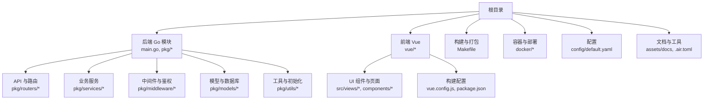
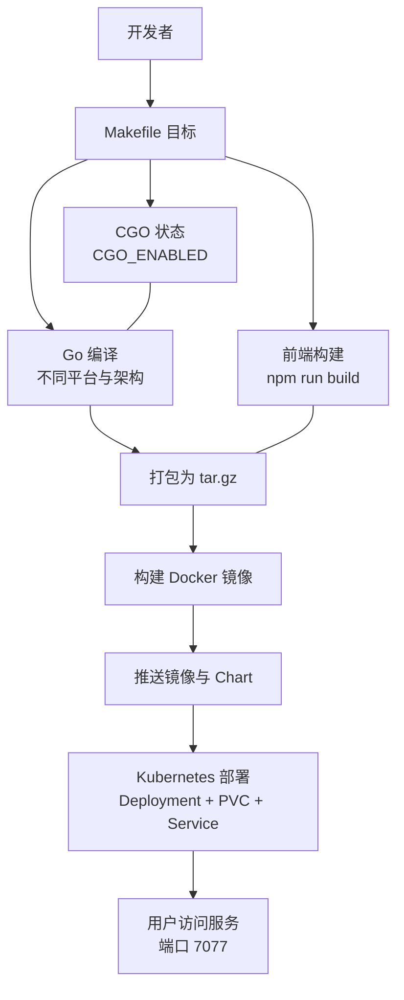
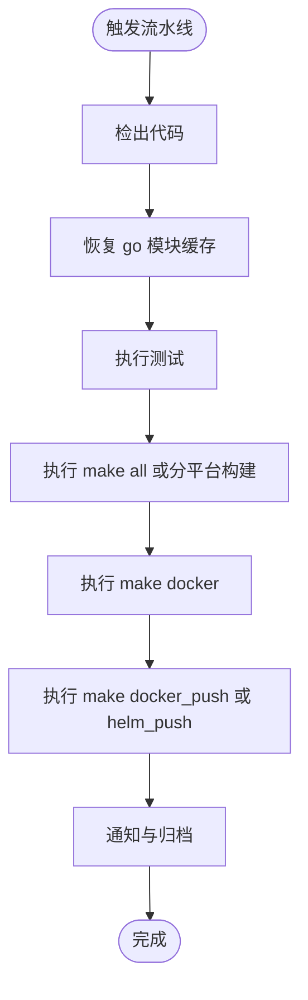
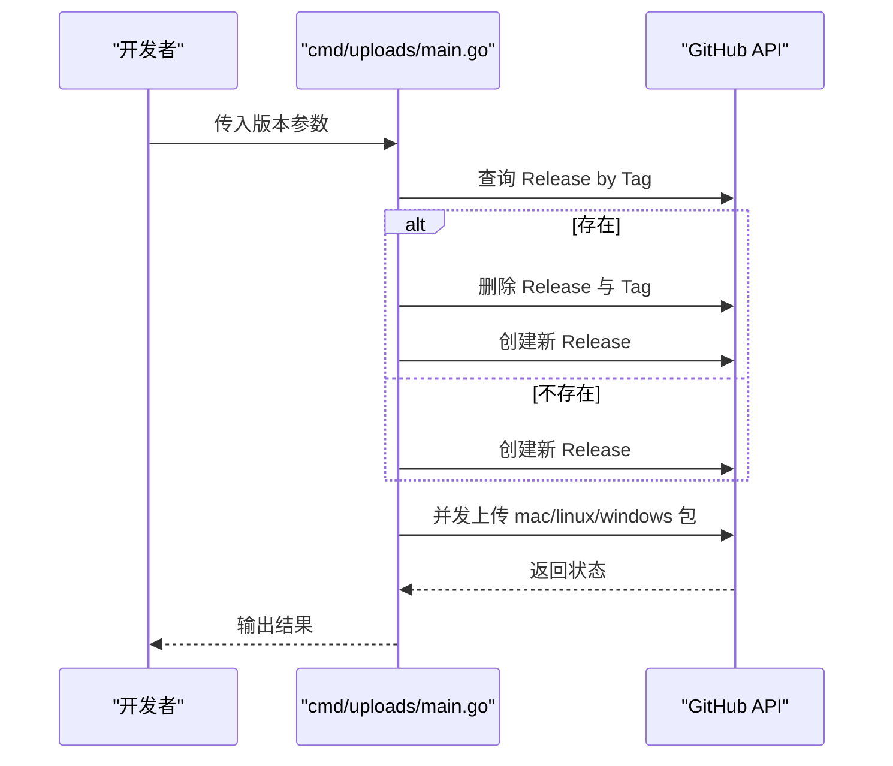
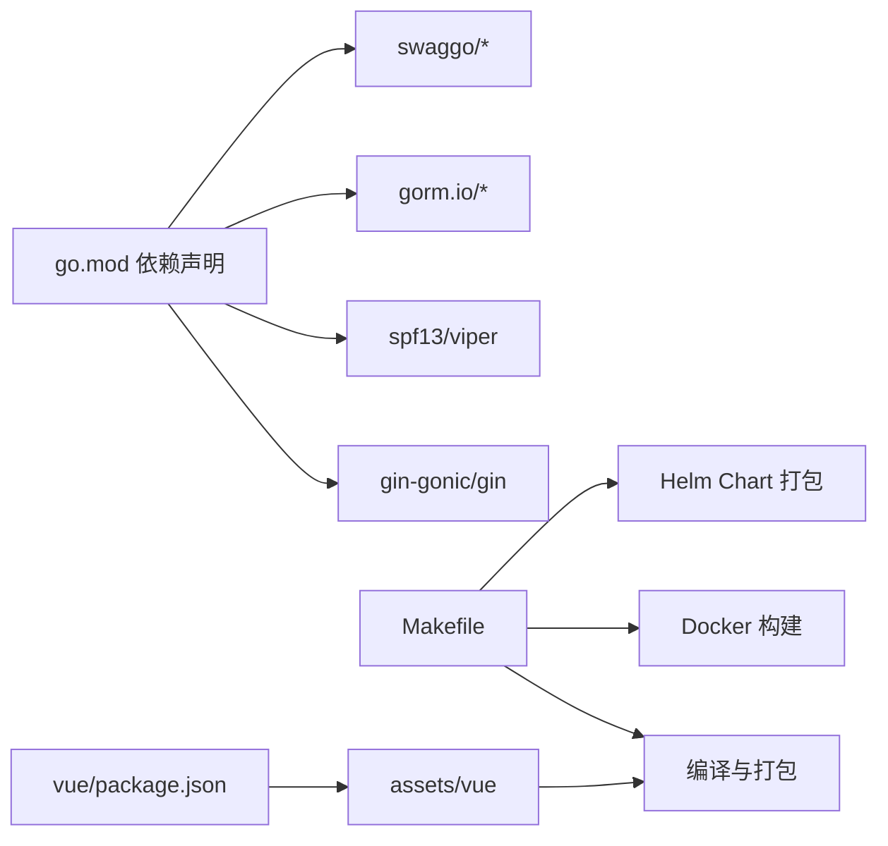

# 构建与测试

<cite>
**本文引用的文件**
- [Makefile](file://Makefile)
- [go.mod](file://go.mod)
- [main.go](file://main.go)
- [cmd/uploads/main.go](file://cmd/uploads/main.go)
- [docker/Dockerfile](file://docker/Dockerfile)
- [docker/Deployment.yaml](file://docker/Deployment.yaml)
- [docker/helm/Chart.yaml](file://docker/helm/Chart.yaml)
- [docker/helm/values.yaml](file://docker/helm/values.yaml)
- [config/default.yaml](file://config/default.yaml)
- [pkg/utils/initialize/swagger.go](file://pkg/utils/initialize/swagger.go)
- [pkg/utils/initialize/mode.go](file://pkg/utils/initialize/mode.go)
- [vue/package.json](file://vue/package.json)
- [vue/vue.config.js](file://vue/vue.config.js)
- [.air.toml](file://.air.toml)
</cite>

## 目录
1. [简介](#简介)
2. [项目结构](#项目结构)
3. [核心组件](#核心组件)
4. [架构总览](#架构总览)
5. [详细组件分析](#详细组件分析)
6. [依赖分析](#依赖分析)
7. [性能考量](#性能考量)
8. [故障排查指南](#故障排查指南)
9. [结论](#结论)
10. [附录](#附录)

## 简介
本指南面向开发者，系统性说明本项目的构建与测试流程，涵盖：
- 构建命令与参数：编译、打包、清理、Docker 镜像与 Helm Chart 发布、GitHub Release 包上传
- 测试策略与组织：单元测试与集成测试的编写与执行建议
- CI/CD 配置示例：自动化构建、测试、打包与发布
- Swagger 文档生成与更新流程
- 开发模式与生产模式的区别与切换
- 常见构建问题排查与解决方案

## 项目结构
项目采用后端 Go 与前端 Vue 分离的多模块布局，构建流程通过 Makefile 统一编排，Docker 与 Helm 提供容器化部署，配置由 Viper 与 YAML 管理。

图表来源
- [Makefile:1-230](file://Makefile#L1-L230)
- [main.go:1-56](file://main.go#L1-L56)
- [vue/vue.config.js:1-14](file://vue/vue.config.js#L1-L14)
- [config/default.yaml:1-83](file://config/default.yaml#L1-L83)

章节来源
- [Makefile:1-230](file://Makefile#L1-L230)
- [main.go:1-56](file://main.go#L1-L56)
- [vue/vue.config.js:1-14](file://vue/vue.config.js#L1-L14)
- [config/default.yaml:1-83](file://config/default.yaml#L1-L83)

## 核心组件
- 构建与打包：通过 Makefile 提供统一入口，包含清理、依赖处理、前端构建、跨平台编译、打包、Docker 镜像构建与推送、Helm Chart 打包与推送、GitHub Release 包上传等目标。
- 初始化与运行：主程序在 init 中按序初始化配置、命令行参数、日志、Swagger、运行模式与数据库；运行时根据配置决定监听地址与端口。
- 容器与部署：Dockerfile 基于 Alpine，暴露 7077 端口；Deployment 使用 PVC 存储；Helm Chart 定义应用版本与模板参数。
- 配置管理：Viper 读取 config/default.yaml，支持全局环境与 Gin 运行模式等关键参数。
- 文档与工具：Swagger 初始化；热更新工具 air 配置排除规则与输出路径。

章节来源
- [Makefile:1-230](file://Makefile#L1-L230)
- [main.go:13-35](file://main.go#L13-L35)
- [pkg/utils/initialize/swagger.go:8-18](file://pkg/utils/initialize/swagger.go#L8-L18)
- [pkg/utils/initialize/mode.go:9-28](file://pkg/utils/initialize/mode.go#L9-L28)
- [docker/Dockerfile:1-20](file://docker/Dockerfile#L1-L20)
- [docker/Deployment.yaml:1-63](file://docker/Deployment.yaml#L1-L63)
- [docker/helm/Chart.yaml:1-38](file://docker/helm/Chart.yaml#L1-L38)
- [docker/helm/values.yaml:1-19](file://docker/helm/values.yaml#L1-L19)
- [config/default.yaml:4-21](file://config/default.yaml#L4-L21)
- [.air.toml:1-39](file://.air.toml#L1-L39)

## 架构总览
下图展示从代码变更到产物发布的整体流程，包括本地构建、Docker 镜像、Kubernetes 部署与 Helm 发布。

图表来源
- [Makefile:77-156](file://Makefile#L77-L156)
- [Makefile:170-204](file://Makefile#L170-L204)
- [docker/Dockerfile:7-19](file://docker/Dockerfile#L7-L19)
- [docker/Deployment.yaml:19-31](file://docker/Deployment.yaml#L19-L31)
- [docker/helm/Chart.yaml:18-24](file://docker/helm/Chart.yaml#L18-L24)

## 详细组件分析

### 构建命令与参数
- 清理与依赖
  - make clean：清理临时与构建产物，保留输出目录结构
  - make start：执行 go mod tidy
- Swagger 文档
  - make swagger：安装 swag 工具并生成 assets/docs 下的文档
- 前端构建
  - make build_frontend：调用 vue 项目构建脚本，输出至 assets/vue
- 平台编译与打包
  - make build_mac / build_mac_arm64 / build_windows / build_linux：分别针对 Darwin x86_64/arm64、Windows amd64、Linux amd64 进行编译与打包
  - Linux 编译依赖 musl 工具链与 CGO 静态链接标志
- Docker 与 Helm
  - make docker：基于 build_linux 产出构建 latest 与指定版本镜像
  - make docker_push：多平台构建并推送镜像，随后更新 Helm Chart 版本并推送 Chart 包
  - make helm_push：仅打包并推送 Chart
- GitHub Release 包上传
  - make package_push：调用 cmd/uploads，按版本号查找或创建 Release 并上传三类平台包

章节来源
- [Makefile:43-54](file://Makefile#L43-L54)
- [Makefile:59-62](file://Makefile#L59-L62)
- [Makefile:67-72](file://Makefile#L67-L72)
- [Makefile:77-82](file://Makefile#L77-L82)
- [Makefile:87-98](file://Makefile#L87-L98)
- [Makefile:104-116](file://Makefile#L104-L116)
- [Makefile:121-136](file://Makefile#L121-L136)
- [Makefile:141-156](file://Makefile#L141-L156)
- [Makefile:170-179](file://Makefile#L170-L179)
- [Makefile:185-204](file://Makefile#L185-L204)
- [Makefile:211-221](file://Makefile#L211-L221)
- [Makefile:227-230](file://Makefile#L227-L230)

### 测试策略与组织
- 单元测试
  - 命名规范：以 _test.go 结尾的文件位于对应包内
  - 推荐：针对核心服务与工具函数编写独立测试，使用表驱动测试提升可维护性
  - 执行：使用 go test 在各包内运行，或通过 Makefile 的测试目标统一执行
- 集成测试
  - 建议：结合 Swagger 文档与 API 路由进行端到端验证，使用 TestMain 初始化最小化运行环境
  - 数据库：可使用 SQLite 内存数据库进行隔离测试
- 测试文件组织
  - 建议将测试文件与被测代码置于同一包，便于导入与测试
  - 对复杂场景可拆分至独立子包，如 pkg/services/core/v1/test

[本节为通用实践指导，未直接分析具体文件，故无“章节来源”]

### CI/CD 配置示例
以下为基于 Makefile 的 CI/CD 流水线建议步骤（概念性流程，非特定实现）：

说明
- 依赖缓存：利用 go 模块缓存加速构建
- 多平台并行：在 CI 中并行执行不同平台的编译与打包
- 安全凭证：镜像与 Chart 推送需配置相应凭据
- 归档与通知：上传产物并发送通知

[本图为概念性流程，未映射到具体源文件，故无“图表来源”]

### Swagger 文档生成与更新
- 初始化与配置
  - 初始化函数设置标题、版本、描述与协议
  - 默认在 assets/docs 下生成 JSON/YAML 文档
- 生成流程
  - make swagger：安装 swag 并生成文档
  - 代码注释遵循 swag 规范，确保接口定义正确
- 更新流程
  - 修改接口注释后重新执行 swagger 目标
  - 前端通过 assets/vue/index.html 访问 Swagger UI

章节来源
- [pkg/utils/initialize/swagger.go:8-18](file://pkg/utils/initialize/swagger.go#L8-L18)
- [Makefile:67-72](file://Makefile#L67-L72)

### 开发模式与生产模式
- 模式来源
  - 从配置文件 global.ginMode 读取运行模式
- 模式切换
  - debug：启用调试日志与 Gin DebugMode
  - test：用于测试环境
  - release：默认生产模式，优化性能与日志级别
- 生效位置
  - main 初始化阶段设置 Gin 运行模式
  - 配合 config/default.yaml 的 ginMode 字段进行切换

章节来源
- [config/default.yaml:4-6](file://config/default.yaml#L4-L6)
- [pkg/utils/initialize/mode.go:9-28](file://pkg/utils/initialize/mode.go#L9-L28)
- [main.go:32-33](file://main.go#L32-L33)

### 前端构建与静态资源
- 构建脚本
  - vue/package.json 定义 dev/build/lint 脚本
- 输出目录
  - vue/vue.config.js 将构建产物输出到 assets/vue
- 与后端集成
  - 后端编译时复制 assets 目录，确保 UI 静态资源可用

章节来源
- [vue/package.json:5-8](file://vue/package.json#L5-L8)
- [vue/vue.config.js:1-14](file://vue/vue.config.js#L1-L14)
- [Makefile:142-156](file://Makefile#L142-L156)

### 容器化与部署
- Dockerfile
  - 基于 Alpine，创建工作目录与数据目录，暴露 7077 端口，入口为二进制
- Kubernetes 部署
  - Deployment 使用 gomessage/gomessage 镜像，挂载 PVC 至 /opt/gomessage/data
  - Service 暴露 NodePort 32077 映射到容器 7077
- Helm Chart
  - Chart.yaml 定义应用版本与 appVersion
  - values.yaml 提供命名空间、副本数、PVC 与 Service 参数

章节来源
- [docker/Dockerfile:7-19](file://docker/Dockerfile#L7-L19)
- [docker/Deployment.yaml:19-31](file://docker/Deployment.yaml#L19-L31)
- [docker/helm/Chart.yaml:18-24](file://docker/helm/Chart.yaml#L18-L24)
- [docker/helm/values.yaml:5-16](file://docker/helm/values.yaml#L5-L16)

### 上传发布到 GitHub Releases
- 功能概述
  - 通过 cmd/uploads/main.go 创建/更新 Release 并上传三类平台包
  - 支持按版本号参数执行
- 关键流程
  - 查询是否存在对应 Tag 的 Release
  - 若存在则删除旧 Release 与 Tag，重新创建
  - 并发上传 mac/linux/windows 包

图表来源
- [cmd/uploads/main.go:121-161](file://cmd/uploads/main.go#L121-L161)
- [cmd/uploads/main.go:192-217](file://cmd/uploads/main.go#L192-L217)
- [cmd/uploads/main.go:264-306](file://cmd/uploads/main.go#L264-L306)

章节来源
- [cmd/uploads/main.go:121-161](file://cmd/uploads/main.go#L121-L161)
- [cmd/uploads/main.go:192-217](file://cmd/uploads/main.go#L192-L217)
- [cmd/uploads/main.go:264-306](file://cmd/uploads/main.go#L264-L306)

## 依赖分析
- 语言与框架
  - Go 1.21，使用 Gin、Viper、GORM、Swag 等生态组件
- 构建与打包
  - Makefile 统一编排，跨平台编译与打包
- 前后端集成
  - 前端构建产物复制到 assets/vue，随后端打包分发
- 容器与部署
  - Dockerfile、Deployment、Helm Chart 形成完整的交付链路

图表来源
- [go.mod:5-21](file://go.mod#L5-L21)
- [Makefile:77-156](file://Makefile#L77-L156)
- [vue/package.json:5-8](file://vue/package.json#L5-L8)

章节来源
- [go.mod:1-75](file://go.mod#L1-L75)
- [Makefile:77-156](file://Makefile#L77-L156)
- [vue/package.json:5-8](file://vue/package.json#L5-L8)

## 性能考量
- 编译优化
  - 使用 -ldflags '-s -w' 减小二进制体积
  - Linux 静态链接减少运行时依赖
- 运行模式
  - 生产模式下关闭调试信息，降低日志开销
- 前端资源
  - 构建产物按需加载，避免冗余资源

[本节为通用指导，未直接分析具体文件，故无“章节来源”]

## 故障排查指南
- 构建失败（缺少工具链）
  - 现象：Linux 编译报错，提示找不到 musl 工具链
  - 处理：安装 x86_64-linux-musl-gcc 与对应 C++ 工具链
- CGO 相关问题
  - 现象：Windows 编译失败或链接错误
  - 处理：确认 MinGW 工具链与 CGO_ENABLED 设置一致
- 前端构建异常
  - 现象：构建后 assets/vue 缺失或为空
  - 处理：检查 NODE_OPTIONS 与 npm 脚本；确认 vue.config.js 输出路径
- Swagger 文档未更新
  - 现象：接口变更后文档未反映
  - 处理：重新执行 make swagger；检查接口注释规范
- Docker 镜像无法启动
  - 现象：容器启动即退出
  - 处理：检查配置文件路径与权限；确认端口占用
- Helm Chart 版本不一致
  - 现象：推送后版本号未更新
  - 处理：确认 Chart.yaml 中 version/appVersion 是否被替换

章节来源
- [Makefile:148-150](file://Makefile#L148-L150)
- [Makefile:127-129](file://Makefile#L127-L129)
- [vue/vue.config.js:1-14](file://vue/vue.config.js#L1-L14)
- [Makefile:67-72](file://Makefile#L67-L72)
- [docker/Dockerfile:7-19](file://docker/Dockerfile#L7-L19)
- [docker/helm/Chart.yaml:18-24](file://docker/helm/Chart.yaml#L18-L24)

## 结论
本项目通过 Makefile 实现统一的构建与发布流程，结合 Docker 与 Helm 提供标准化交付能力；Swagger 文档与前后端构建产物集成完善；配置与运行模式支持灵活切换。建议在 CI/CD 中沿用 Makefile 目标，确保一致性与可重复性。

[本节为总结性内容，未直接分析具体文件，故无“章节来源”]

## 附录

### 常用命令速查
- 清理与依赖：make clean；make start
- 生成文档：make swagger
- 前端构建：make build_frontend
- 平台编译：make build_linux / build_mac / build_windows
- Docker：make docker；make docker_push
- Helm：make helm_push；make package_push

章节来源
- [Makefile:43-54](file://Makefile#L43-L54)
- [Makefile:59-62](file://Makefile#L59-L62)
- [Makefile:67-72](file://Makefile#L67-L72)
- [Makefile:77-82](file://Makefile#L77-L82)
- [Makefile:141-156](file://Makefile#L141-L156)
- [Makefile:170-179](file://Makefile#L170-L179)
- [Makefile:185-204](file://Makefile#L185-L204)
- [Makefile:211-221](file://Makefile#L211-L221)
- [Makefile:227-230](file://Makefile#L227-L230)

### 开发辅助工具
- 热更新：.air.toml 配置了忽略目录与文件，避免不必要的重启
- 前端开发：vue/package.json 提供开发与生产模式脚本

章节来源
- [.air.toml:5-21](file://.air.toml#L5-L21)
- [vue/package.json:5-8](file://vue/package.json#L5-L8)