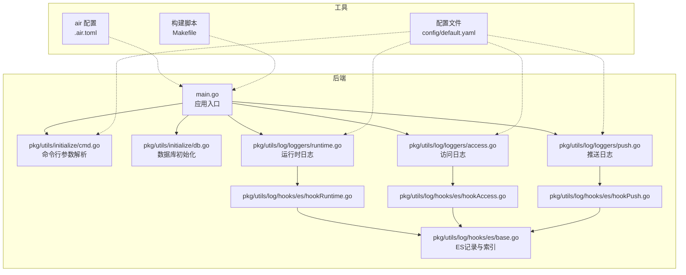
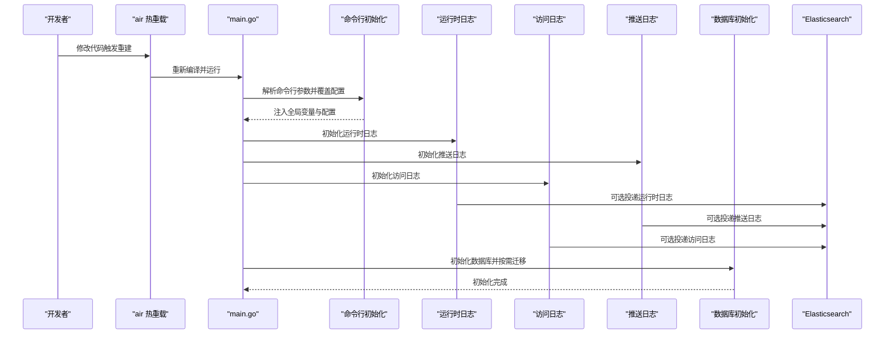
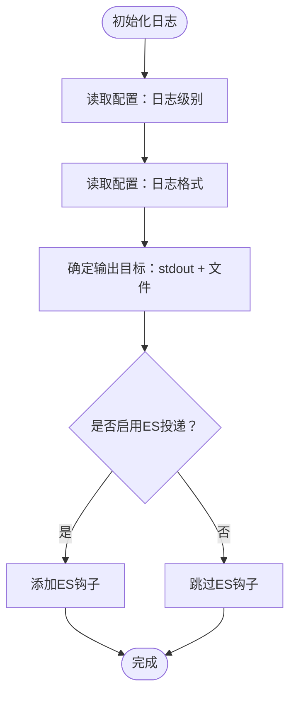
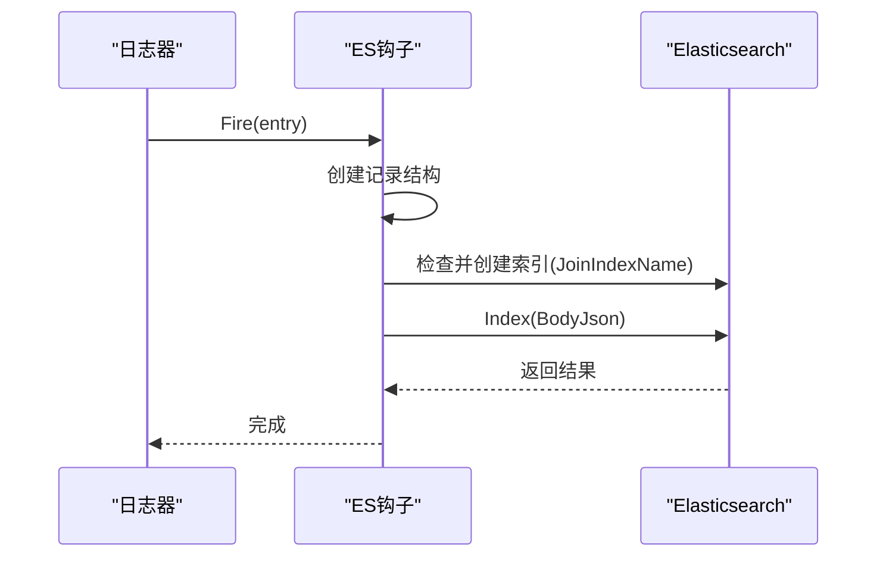
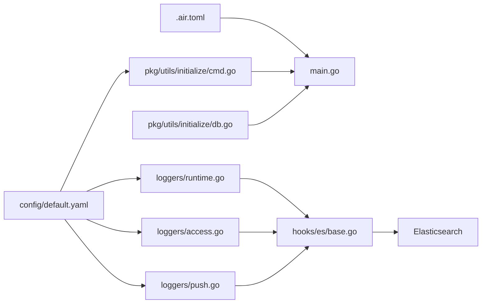

# 调试与工具

<cite>
**本文引用的文件**
- [.air.toml](file://.air.toml)
- [Makefile](file://Makefile)
- [main.go](file://main.go)
- [config/default.yaml](file://config/default.yaml)
- [pkg/utils/initialize/cmd.go](file://pkg/utils/initialize/cmd.go)
- [pkg/utils/initialize/db.go](file://pkg/utils/initialize/db.go)
- [pkg/utils/log/loggers/runtime.go](file://pkg/utils/log/loggers/runtime.go)
- [pkg/utils/log/loggers/access.go](file://pkg/utils/log/loggers/access.go)
- [pkg/utils/log/loggers/push.go](file://pkg/utils/log/loggers/push.go)
- [pkg/utils/log/hooks/es/base.go](file://pkg/utils/log/hooks/es/base.go)
- [pkg/utils/log/hooks/es/hookAccess.go](file://pkg/utils/log/hooks/es/hookAccess.go)
- [pkg/utils/log/hooks/es/hookPush.go](file://pkg/utils/log/hooks/es/hookPush.go)
- [pkg/utils/log/hooks/es/hookRuntime.go](file://pkg/utils/log/hooks/es/hookRuntime.go)
</cite>

## 目录
1. [简介](#简介)
2. [项目结构](#项目结构)
3. [核心组件](#核心组件)
4. [架构总览](#架构总览)
5. [详细组件分析](#详细组件分析)
6. [依赖分析](#依赖分析)
7. [性能考虑](#性能考虑)
8. [故障排查指南](#故障排查指南)
9. [结论](#结论)
10. [附录](#附录)

## 简介
本指南面向开发者，聚焦于本项目的调试技巧与工具使用，涵盖以下主题：
- 热重载工具 air 的配置与使用（自动重启、文件监听等）
- 日志系统（运行时日志、访问日志、推送日志）的查看与分析，以及与 Elasticsearch 的集成
- 断点调试方法与 IDE 调试器使用建议
- 性能分析工具（pprof）的使用
- 常见问题的调试思路与排查方法
- 开发工具推荐与配置建议

## 项目结构
本项目采用后端 Go 与前端 Vue 分离的结构，后端通过 Gin 提供 API，日志系统基于 logrus 并可选投递至 Elasticsearch。热重载使用 air，构建与打包通过 Makefile。

图表来源
- [main.go:1-56](file://main.go#L1-L56)
- [pkg/utils/initialize/cmd.go:1-99](file://pkg/utils/initialize/cmd.go#L1-L99)
- [pkg/utils/initialize/db.go:1-60](file://pkg/utils/initialize/db.go#L1-L60)
- [pkg/utils/log/loggers/runtime.go:1-113](file://pkg/utils/log/loggers/runtime.go#L1-L113)
- [pkg/utils/log/loggers/access.go:1-59](file://pkg/utils/log/loggers/access.go#L1-L59)
- [pkg/utils/log/loggers/push.go:1-59](file://pkg/utils/log/loggers/push.go#L1-L59)
- [pkg/utils/log/hooks/es/base.go:1-78](file://pkg/utils/log/hooks/es/base.go#L1-L78)
- [pkg/utils/log/hooks/es/hookRuntime.go:1-31](file://pkg/utils/log/hooks/es/hookRuntime.go#L1-L31)
- [pkg/utils/log/hooks/es/hookAccess.go:1-31](file://pkg/utils/log/hooks/es/hookAccess.go#L1-L31)
- [pkg/utils/log/hooks/es/hookPush.go:1-31](file://pkg/utils/log/hooks/es/hookPush.go#L1-L31)
- [.air.toml:1-39](file://.air.toml#L1-L39)
- [Makefile:1-235](file://Makefile#L1-L235)
- [config/default.yaml:1-83](file://config/default.yaml#L1-L83)

章节来源
- [main.go:1-56](file://main.go#L1-L56)
- [.air.toml:1-39](file://.air.toml#L1-L39)
- [Makefile:1-235](file://Makefile#L1-L235)
- [config/default.yaml:1-83](file://config/default.yaml#L1-L83)

## 核心组件
- 热重载与自动重启：air 配置文件定义了监听目录、排除规则、构建命令与二进制输出路径，支持错误日志输出与颜色控制。
- 日志系统：运行时日志、访问日志、推送日志分别初始化，支持 JSON/文本格式、级别控制、多输出（标准输出与文件），并可选启用 Elasticsearch 投递。
- 命令行参数：支持覆盖配置项（环境、Gin 模式、是否迁移数据库、是否投递 ES），并注入全局变量。
- 数据库初始化：根据配置选择数据库类型，按需执行迁移与默认数据初始化。
- Elasticsearch 集成：统一记录结构、索引命名策略、按日创建索引、超时控制与客户端初始化。

章节来源
- [.air.toml:1-39](file://.air.toml#L1-L39)
- [pkg/utils/log/loggers/runtime.go:1-113](file://pkg/utils/log/loggers/runtime.go#L1-L113)
- [pkg/utils/log/loggers/access.go:1-59](file://pkg/utils/log/loggers/access.go#L1-L59)
- [pkg/utils/log/loggers/push.go:1-59](file://pkg/utils/log/loggers/push.go#L1-L59)
- [pkg/utils/initialize/cmd.go:1-99](file://pkg/utils/initialize/cmd.go#L1-L99)
- [pkg/utils/initialize/db.go:1-60](file://pkg/utils/initialize/db.go#L1-L60)
- [pkg/utils/log/hooks/es/base.go:1-78](file://pkg/utils/log/hooks/es/base.go#L1-L78)

## 架构总览
下图展示从应用启动到日志与数据库初始化的关键流程，以及 air 的热重载参与点。

图表来源
- [main.go:1-56](file://main.go#L1-L56)
- [pkg/utils/initialize/cmd.go:1-99](file://pkg/utils/initialize/cmd.go#L1-L99)
- [pkg/utils/log/loggers/runtime.go:1-113](file://pkg/utils/log/loggers/runtime.go#L1-L113)
- [pkg/utils/log/loggers/access.go:1-59](file://pkg/utils/log/loggers/access.go#L1-L59)
- [pkg/utils/log/loggers/push.go:1-59](file://pkg/utils/log/loggers/push.go#L1-L59)
- [pkg/utils/log/hooks/es/base.go:1-78](file://pkg/utils/log/hooks/es/base.go#L1-L78)
- [pkg/utils/initialize/db.go:1-60](file://pkg/utils/initialize/db.go#L1-L60)

## 详细组件分析

### 热重载工具 air 配置与使用
- 自动重启与文件监听
  - 监听扩展名：go、tpl、tmpl、html
  - 排除目录：assets、tmp、vendor、testdata、docs、logs、wiki
  - 排除规则：测试文件与未变更文件
  - 构建命令：使用 go build 输出到 tmp 目录下的二进制
  - 错误日志：构建错误写入独立日志文件
- 使用建议
  - 在开发阶段运行 air，修改后自动编译并重启服务
  - 如需快速定位构建问题，查看构建错误日志文件
  - 若遇到 IDE 中断点不生效，确认 air 重启后 IDE 已重新连接调试器

章节来源
- [.air.toml:1-39](file://.air.toml#L1-L39)

### 日志系统：运行时、访问、推送日志
- 初始化顺序与职责
  - 运行时日志：标准输出与文件双输出，支持 JSON/文本格式与级别控制
  - 访问日志：JSON 格式，按天轮转索引（可选 ES 投递）
  - 推送日志：JSON 格式，按天轮转索引（可选 ES 投递）
- 配置要点
  - 日志级别与格式来自配置文件
  - 是否投递 ES 由配置项控制，投递时自动创建索引
  - 文件路径与权限在初始化时确保存在
- 查看与分析
  - 本地：直接查看对应日志文件
  - ES：按日期索引检索，结合日志级别与消息字段过滤

图表来源
- [pkg/utils/log/loggers/runtime.go:1-113](file://pkg/utils/log/loggers/runtime.go#L1-L113)
- [pkg/utils/log/loggers/access.go:1-59](file://pkg/utils/log/loggers/access.go#L1-L59)
- [pkg/utils/log/loggers/push.go:1-59](file://pkg/utils/log/loggers/push.go#L1-L59)
- [config/default.yaml:25-44](file://config/default.yaml#L25-L44)

章节来源
- [pkg/utils/log/loggers/runtime.go:1-113](file://pkg/utils/log/loggers/runtime.go#L1-L113)
- [pkg/utils/log/loggers/access.go:1-59](file://pkg/utils/log/loggers/access.go#L1-L59)
- [pkg/utils/log/loggers/push.go:1-59](file://pkg/utils/log/loggers/push.go#L1-L59)
- [config/default.yaml:25-44](file://config/default.yaml#L25-L44)

### Elasticsearch 日志集成
- 记录结构与索引
  - 统一记录结构包含时间戳、主机、文件、函数、消息、级别与附加数据
  - 索引按日命名，例如“索引名-年.月.日”
  - 首次投递时自动检查并创建索引
- 钩子实现
  - 运行时、访问、推送三类日志分别有对应的 ES 钩子
  - 钩子在 Fire 时设置超时并投递 JSON 记录
- 配置启用
  - 通过配置项开启 ES 投递，ES 地址与认证在配置中设置

图表来源
- [pkg/utils/log/hooks/es/base.go:1-78](file://pkg/utils/log/hooks/es/base.go#L1-L78)
- [pkg/utils/log/hooks/es/hookRuntime.go:1-31](file://pkg/utils/log/hooks/es/hookRuntime.go#L1-L31)
- [pkg/utils/log/hooks/es/hookAccess.go:1-31](file://pkg/utils/log/hooks/es/hookAccess.go#L1-L31)
- [pkg/utils/log/hooks/es/hookPush.go:1-31](file://pkg/utils/log/hooks/es/hookPush.go#L1-L31)
- [config/default.yaml:33-44](file://config/default.yaml#L33-L44)

章节来源
- [pkg/utils/log/hooks/es/base.go:1-78](file://pkg/utils/log/hooks/es/base.go#L1-L78)
- [pkg/utils/log/hooks/es/hookRuntime.go:1-31](file://pkg/utils/log/hooks/es/hookRuntime.go#L1-L31)
- [pkg/utils/log/hooks/es/hookAccess.go:1-31](file://pkg/utils/log/hooks/es/hookAccess.go#L1-L31)
- [pkg/utils/log/hooks/es/hookPush.go:1-31](file://pkg/utils/log/hooks/es/hookPush.go#L1-L31)
- [config/default.yaml:33-44](file://config/default.yaml#L33-L44)

### 命令行参数与环境覆盖
- 支持参数
  - 环境：dev/fat/pro
  - Gin 模式：debug/test/release
  - 是否迁移数据库：true/false
  - 是否投递 ES：true/false
- 覆盖机制
  - 命令行参数优先级最高，可覆盖配置文件中的同名项
  - 参数标准化兼容下划线、点号、短横线等分隔符
  - 将环境与迁移标志注入全局变量，供后续初始化使用

章节来源
- [pkg/utils/initialize/cmd.go:1-99](file://pkg/utils/initialize/cmd.go#L1-L99)

### 数据库初始化与迁移
- 初始化流程
  - 根据配置选择数据库类型并建立连接
  - 按需执行迁移，迁移列表包含命名空间、模板、变量、客户端及授权相关表
  - 迁移完成后创建默认命名空间与管理员账户
- 调试提示
  - 如迁移失败，检查数据库连接与权限
  - 使用命令行参数关闭迁移以验证非迁移路径

章节来源
- [pkg/utils/initialize/db.go:1-60](file://pkg/utils/initialize/db.go#L1-L60)

## 依赖分析
- 组件耦合
  - main.go 依赖初始化模块与日志模块，日志模块再依赖 ES 钩子
  - 命令行初始化负责覆盖配置，影响日志与数据库行为
- 外部依赖
  - air：热重载与自动重启
  - logrus：日志记录
  - elastic v7：ES 客户端
  - viper/pflag：配置与命令行参数
  - GORM：数据库 ORM

图表来源
- [.air.toml:1-39](file://.air.toml#L1-L39)
- [main.go:1-56](file://main.go#L1-L56)
- [pkg/utils/initialize/cmd.go:1-99](file://pkg/utils/initialize/cmd.go#L1-L99)
- [pkg/utils/initialize/db.go:1-60](file://pkg/utils/initialize/db.go#L1-L60)
- [pkg/utils/log/loggers/runtime.go:1-113](file://pkg/utils/log/loggers/runtime.go#L1-L113)
- [pkg/utils/log/loggers/access.go:1-59](file://pkg/utils/log/loggers/access.go#L1-L59)
- [pkg/utils/log/loggers/push.go:1-59](file://pkg/utils/log/loggers/push.go#L1-L59)
- [pkg/utils/log/hooks/es/base.go:1-78](file://pkg/utils/log/hooks/es/base.go#L1-L78)
- [config/default.yaml:1-83](file://config/default.yaml#L1-L83)

## 性能考虑
- pprof 使用建议
  - 在应用中引入 pprof 包，以便在开发与测试环境中采集 CPU、内存、阻塞等性能数据
  - 通过 HTTP 接口暴露 pprof 端点，便于浏览器或 go tool pprof 工具抓取
  - 结合日志与 ES 记录，定位高延迟请求与异常峰值
- 优化方向
  - 减少不必要的日志输出与 ES 投递开销
  - 控制日志级别与格式，避免在高并发场景下产生过多 IO
  - 对数据库查询与外部接口调用进行缓存与限流

## 故障排查指南
- air 无法自动重启
  - 检查监听扩展名与排除目录是否覆盖到目标文件
  - 查看构建错误日志文件，修复编译错误后再尝试
- 日志未落盘或未投递 ES
  - 确认日志文件路径与权限，确保目录存在且可写
  - 检查配置中的 ES 开关与地址，确认网络可达
- 命令行参数未生效
  - 确认参数拼写与分隔符（支持多种分隔符）
  - 确认参数优先级高于配置文件
- 数据库迁移失败
  - 检查数据库连接信息与权限
  - 使用命令行参数关闭迁移以隔离问题

章节来源
- [.air.toml:1-39](file://.air.toml#L1-L39)
- [config/default.yaml:25-44](file://config/default.yaml#L25-L44)
- [pkg/utils/initialize/cmd.go:1-99](file://pkg/utils/initialize/cmd.go#L1-L99)
- [pkg/utils/initialize/db.go:1-60](file://pkg/utils/initialize/db.go#L1-L60)

## 结论
本指南提供了从热重载、日志系统、命令行参数、数据库初始化到 ES 集成的全链路调试方法。建议在开发中结合 air 实现快速迭代，利用日志与 ES 快速定位问题，并通过命令行参数灵活覆盖配置。对于性能问题，建议配合 pprof 进行采样与分析。

## 附录
- 开发工具推荐
  - IDE：支持 Go 调试器（如 VS Code/GoLand），配合 air 使用断点调试
  - 日志分析：Kibana/Head 或 curl 查询 ES 索引
  - 性能分析：pprof 与火焰图工具
- 配置建议
  - 开发环境：开启日志投递 ES，便于集中分析
  - 生产环境：谨慎开启日志投递，控制日志级别与格式，避免 IO 压力过大