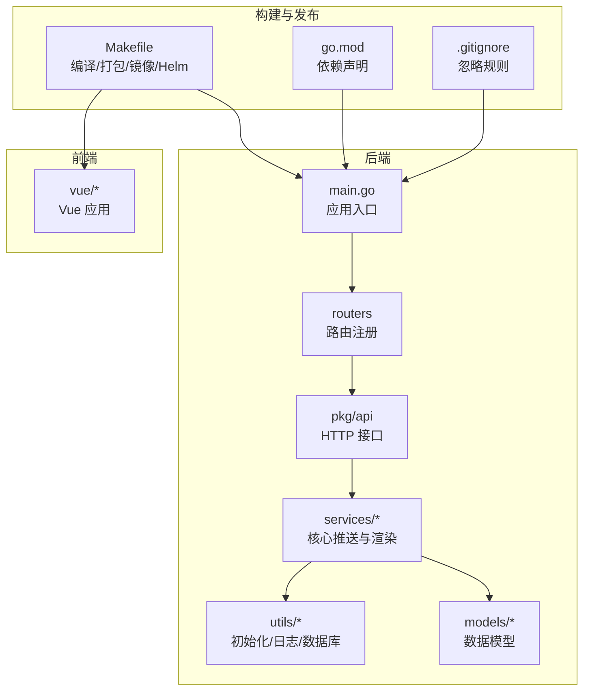
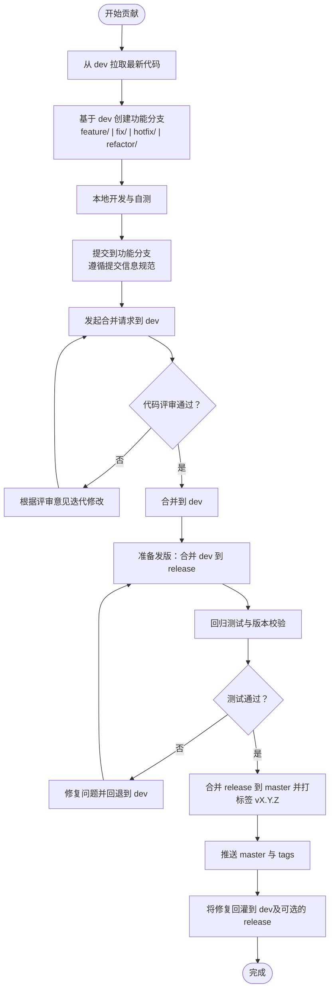
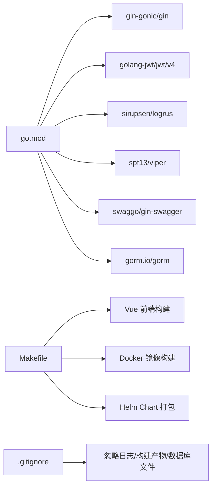

# 贡献指南

<cite>
**本文引用的文件**
- [CONTRIBUTING.md](file://CONTRIBUTING.md)
- [README.md](file://README.md)
- [go.mod](file://go.mod)
- [Makefile](file://Makefile)
- [main.go](file://main.go)
- [.gitignore](file://.gitignore)
</cite>

## 目录
1. [引言](#引言)
2. [项目结构](#项目结构)
3. [核心组件](#核心组件)
4. [架构总览](#架构总览)
5. [详细组件分析](#详细组件分析)
6. [依赖分析](#依赖分析)
7. [性能考虑](#性能考虑)
8. [故障排查指南](#故障排查指南)
9. [结论](#结论)
10. [附录](#附录)

## 引言
本贡献指南面向希望参与 GoMessage 开发与维护的贡献者，明确贡献流程、分支策略、提交信息规范、代码审查流程、Issue 提交规范、测试与覆盖率要求、文档更新流程以及社区行为准则与沟通指南。本文档基于仓库现有约定与配置文件整理而成，旨在帮助贡献者高效协作、降低沟通成本并提升发布质量。

## 项目结构
GoMessage 采用前后端分离的工程组织方式：
- 后端服务：Go 语言实现，包含 API、中间件、模型、服务层、工具集与初始化模块。
- 前端界面：Vue.js 实现，提供通道管理、客户端配置、模板编辑与用户操作界面。
- 文档与安装：README 与 wiki 提供使用说明与安装指南。
- 构建与打包：Makefile 统一管理跨平台编译、前端构建、Docker 镜像与 Helm Chart 打包。

图表来源
- [main.go:1-56](file://main.go#L1-L56)
- [Makefile:1-235](file://Makefile#L1-L235)
- [go.mod:1-75](file://go.mod#L1-L75)
- [.gitignore:1-44](file://.gitignore#L1-L44)

章节来源
- [README.md:1-197](file://README.md#L1-L197)
- [Makefile:1-235](file://Makefile#L1-L235)
- [go.mod:1-75](file://go.mod#L1-L75)
- [.gitignore:1-44](file://.gitignore#L1-L44)

## 核心组件
- 分支与发布模型：遵循 dev → release → master 的线性发布路径，保证主分支稳定与可追溯。
- 开发流程：从 dev 拉取最新代码，基于 dev 创建功能分支，开发完成后提交合并请求至 dev，按需进入 release 与 master。
- 分支命名规范：feature/、fix/、hotfix/、refactor/ 等前缀，确保职责清晰。
- 合并策略：禁止直接在 master/release 开发；通过合并请求进行代码评审；合并前确保基础构建与关键校验通过。
- 版本与标签：以 master 上的 Tag 为准，格式建议 vX.Y.Z；release 分支仅用于发布准备，不作为最终版本事实来源。
- 热修复流程：从 master 拉取 hotfix/<name>，先合入 master 并打补丁版本 Tag，随后回灌 dev；若存在进行中的 release，亦需合入。

章节来源
- [CONTRIBUTING.md:10-73](file://CONTRIBUTING.md#L10-L73)

## 架构总览
下图展示了贡献流程与分支策略在实际代码中的落地关系，体现从功能开发到发布的完整闭环。

图表来源
- [CONTRIBUTING.md:16-72](file://CONTRIBUTING.md#L16-L72)

## 详细组件分析

### 分支与合并策略
- 分支模型
  - master：生产稳定分支，仅接收已验证可发布的代码。
  - release：发布候选分支，用于冻结、回归测试与版本校验。
  - dev：日常开发集成分支，功能开发最终先合入此处。
- 合并策略
  - 禁止在 master/release 直接开发；
  - 通过合并请求进行代码评审后再合并；
  - 合并前确保基础构建与关键校验通过。

章节来源
- [CONTRIBUTING.md:10-38](file://CONTRIBUTING.md#L10-L38)

### 分支命名规范
- 功能开发：feature/<name>
- 缺陷修复：fix/<name>
- 紧急修复：hotfix/<name>
- 重构优化：refactor/<name>

章节来源
- [CONTRIBUTING.md:25-31](file://CONTRIBUTING.md#L25-L31)

### 提交信息规范
- 建议采用类型+主题的格式，如 feat:、fix:、docs:、style:、refactor:、perf:、test:、chore: 等，结合简明描述与必要上下文。
- 示例参考贡献指南中的常用命令示例，其中包含以 feat: 开头的提交信息示例。

章节来源
- [CONTRIBUTING.md:51-60](file://CONTRIBUTING.md#L51-L60)

### 代码审查流程与标准
- 通过合并请求进行评审；
- 评审通过后方可合并；
- 合并前确保基础构建与关键校验通过；
- 保持提交粒度合理，变更范围明确，避免引入不必要的复杂度。

章节来源
- [CONTRIBUTING.md:32-38](file://CONTRIBUTING.md#L32-L38)

### Issue 提交规范与标签使用
- Issue 类型：缺陷报告、功能请求、文档问题、性能问题、安全问题等。
- 提交时应包含：标题、复现步骤、期望结果、实际结果、环境信息（操作系统、浏览器、Go 版本、部署方式）、日志片段或截图。
- 标签建议：bug、enhancement、documentation、help wanted、good first issue、security 等（如仓库未定义，请在首次使用时统一约定并在后续沿用）。

[本节为通用规范说明，不直接分析具体文件，故无章节来源]

### 测试要求与覆盖率标准
- 单元测试：针对核心服务与工具函数编写单元测试，覆盖关键路径与边界条件。
- 集成测试：对路由、中间件与数据库交互进行集成测试，确保端到端流程稳定。
- 性能测试：对推送与渲染关键路径进行压力测试，记录响应时间与吞吐量。
- 覆盖率目标：建议关键模块行覆盖率不低于 80%，分支覆盖率不低于 60%（可根据团队实际情况调整）。
- 自动化：在合并请求中触发 CI，确保测试与静态检查通过。

[本节为通用规范说明，不直接分析具体文件，故无章节来源]

### 文档更新要求与流程
- 新增或修改功能需同步更新 README、wiki 与 Swagger 文档；
- 文档更新应包含：功能说明、配置项、接口示例、注意事项与常见问题；
- 文档提交建议与代码提交同流程，通过合并请求评审后合并。

[本节为通用规范说明，不直接分析具体文件，故无章节来源]

### 社区行为准则与沟通指南
- 尊重与包容：营造开放、尊重、包容的社区氛围；
- 明确沟通：使用清晰、简洁的语言，必要时附带日志与截图；
- 积极协作：优先提出建设性意见，共同解决问题；
- 遵守法律：遵守所在国家与地区的法律法规。

[本节为通用规范说明，不直接分析具体文件，故无章节来源]

## 依赖分析
- 语言与框架
  - Go 1.21，使用 Gin 作为 Web 框架，Swag 进行 API 文档生成，Viper 进行配置管理，Logrus 进行日志记录，GORM 进行数据库访问。
- 前端生态
  - Vue 生态（Vue Router、Vuex、Element Plus 等），通过 npm 管理依赖，构建产物嵌入后端资源。
- 构建与发布
  - Makefile 统一管理跨平台编译、前端构建、Docker 镜像与 Helm Chart 打包；.gitignore 规范忽略文件与目录。

图表来源
- [go.mod:1-75](file://go.mod#L1-L75)
- [Makefile:1-235](file://Makefile#L1-L235)
- [.gitignore:1-44](file://.gitignore#L1-L44)

章节来源
- [go.mod:1-75](file://go.mod#L1-L75)
- [Makefile:1-235](file://Makefile#L1-L235)
- [.gitignore:1-44](file://.gitignore#L1-L44)

## 性能考虑
- 代码层面：避免在热路径中进行阻塞操作，合理使用缓存与连接池；对模板渲染与推送流程进行性能压测。
- 部署层面：使用 Docker 与 Helm 进行标准化部署，结合资源限制与健康检查保障稳定性。
- 监控与日志：启用访问日志与推送日志，定期分析慢查询与异常峰值。

[本节提供一般性指导，不直接分析具体文件，故无章节来源]

## 故障排查指南
- 常见问题
  - 服务无法启动：检查配置文件与端口占用，确认数据库初始化成功。
  - 前端页面空白：确认前端构建产物已嵌入后端资源，检查静态文件路径。
  - 推送失败：核对客户端配置与网络连通性，查看推送日志与错误码。
- 调试建议
  - 使用日志模块定位问题，逐步缩小范围；
  - 对关键路径添加单元测试与集成测试，确保问题可复现；
  - 在 dev 分支进行最小化复现，避免污染 master/release。

[本节为通用指导，不直接分析具体文件，故无章节来源]

## 结论
通过明确的分支策略、严格的提交与评审流程、完善的测试与文档规范，以及友好的社区沟通准则，GoMessage 可以在多人协作中保持高质量与高效率。请所有贡献者遵循本文档约定，共同推动项目稳健发展。

## 附录
- 常用命令示例（参考贡献指南）
  - 从 dev 拉取最新代码并创建功能分支、提交与推送
  - 合并 dev 到 release
  - 合并 release 到 master 并打标签 vX.Y.Z

章节来源
- [CONTRIBUTING.md:51-72](file://CONTRIBUTING.md#L51-L72)