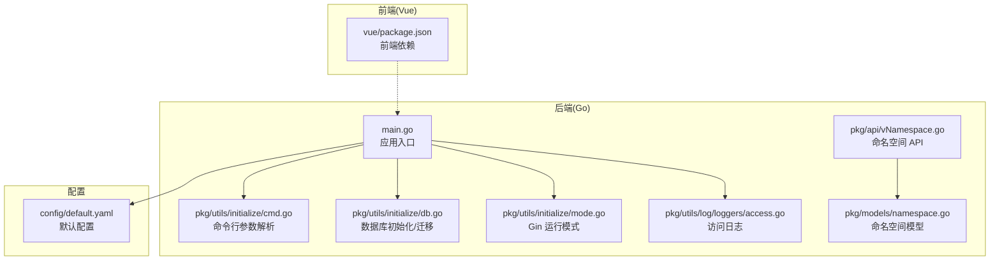
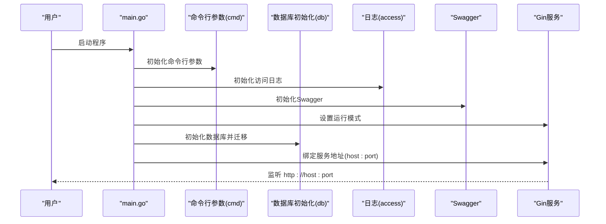
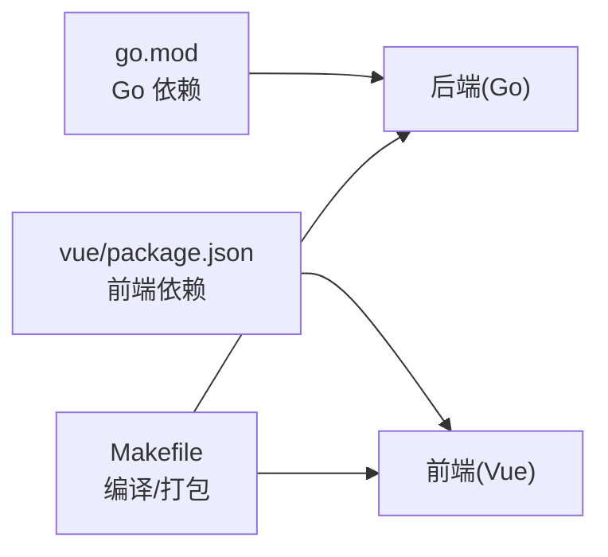

# 快速开始

<cite>
**本文引用的文件**
- [main.go](file://main.go)
- [config/default.yaml](file://config/default.yaml)
- [go.mod](file://go.mod)
- [Makefile](file://Makefile)
- [docker/Dockerfile](file://docker/Dockerfile)
- [docker/Deployment.yaml](file://docker/Deployment.yaml)
- [pkg/utils/initialize/cmd.go](file://pkg/utils/initialize/cmd.go)
- [pkg/utils/initialize/db.go](file://pkg/utils/initialize/db.go)
- [pkg/utils/initialize/mode.go](file://pkg/utils/initialize/mode.go)
- [pkg/utils/log/loggers/access.go](file://pkg/utils/log/loggers/access.go)
- [pkg/models/namespace.go](file://pkg/models/namespace.go)
- [pkg/api/vNamespace.go](file://pkg/api/vNamespace.go)
- [pkg/models/namespace_init.go](file://pkg/models/namespace_init.go)
- [wiki/install_linux.md](file://wiki/install_linux.md)
- [wiki/install_docker.md](file://wiki/install_docker.md)
- [vue/package.json](file://vue/package.json)
- [assets/docs/swagger.json](file://assets/docs/swagger.json)
- [wiki/response.md](file://wiki/response.md)
</cite>

## 目录
1. [简介](#简介)
2. [项目结构](#项目结构)
3. [核心组件](#核心组件)
4. [架构总览](#架构总览)
5. [详细组件分析](#详细组件分析)
6. [依赖分析](#依赖分析)
7. [性能注意事项](#性能注意事项)
8. [故障排查指南](#故障排查指南)
9. [结论](#结论)
10. [附录](#附录)

## 简介
本指南面向首次接触 GoMessage 的用户，帮助你在最短时间内完成环境准备、安装部署与基础配置，并通过 Web 界面与 API 完成“创建命名空间 → 配置客户端 → 发送第一条消息推送”的全流程体验。文档覆盖源码编译安装与 Docker 部署两种方式，提供配置项说明、常见问题与解决方案，确保你快速上手。

## 项目结构
GoMessage 采用后端 Go + 前端 Vue 的双栈架构，后端通过 Gin 提供 REST API，前端基于 Vue 2 + Element-UI 构建管理界面。项目还包含 Swagger 文档与 Helm/Kubernetes 部署示例。

图表来源
- [main.go:1-56](file://main.go#L1-L56)
- [pkg/utils/initialize/cmd.go:1-99](file://pkg/utils/initialize/cmd.go#L1-L99)
- [pkg/utils/initialize/db.go:1-60](file://pkg/utils/initialize/db.go#L1-L60)
- [pkg/utils/initialize/mode.go:1-29](file://pkg/utils/initialize/mode.go#L1-L29)
- [pkg/utils/log/loggers/access.go:1-59](file://pkg/utils/log/loggers/access.go#L1-L59)
- [pkg/api/vNamespace.go:1-149](file://pkg/api/vNamespace.go#L1-L149)
- [pkg/models/namespace.go:1-106](file://pkg/models/namespace.go#L1-L106)
- [config/default.yaml:1-82](file://config/default.yaml#L1-L82)
- [vue/package.json:1-54](file://vue/package.json#L1-L54)

章节来源
- [main.go:1-56](file://main.go#L1-L56)
- [config/default.yaml:1-82](file://config/default.yaml#L1-L82)
- [go.mod:1-75](file://go.mod#L1-L75)
- [vue/package.json:1-54](file://vue/package.json#L1-L54)

## 核心组件
- 应用入口与初始化流程：负责按序初始化配置、命令行参数、日志、Swagger、Gin 模式与数据库。
- 命名空间与模板：系统默认提供“默认通道”，支持创建自定义命名空间并初始化模板与变量映射。
- API 层：提供命名空间的增删改查接口，便于前端与外部系统集成。
- 配置中心：集中管理服务监听地址、数据库类型、日志级别与输出目标等。
- 部署与打包：提供 Makefile 编译脚本与 Dockerfile，支持容器化部署与 Kubernetes 清单。

章节来源
- [main.go:13-35](file://main.go#L13-L35)
- [pkg/models/namespace_init.go:1-59](file://pkg/models/namespace_init.go#L1-L59)
- [pkg/api/vNamespace.go:15-55](file://pkg/api/vNamespace.go#L15-L55)
- [config/default.yaml:18-21](file://config/default.yaml#L18-L21)
- [config/default.yaml:46-61](file://config/default.yaml#L46-L61)
- [config/default.yaml:26-43](file://config/default.yaml#L26-L43)

## 架构总览
下图展示了从启动到监听服务、初始化数据库与日志的关键流程：

图表来源
- [main.go:13-35](file://main.go#L13-L35)
- [pkg/utils/initialize/cmd.go:46-99](file://pkg/utils/initialize/cmd.go#L46-L99)
- [pkg/utils/initialize/db.go:11-19](file://pkg/utils/initialize/db.go#L11-L19)
- [pkg/utils/log/loggers/access.go:15-58](file://pkg/utils/log/loggers/access.go#L15-L58)
- [pkg/utils/initialize/mode.go:9-28](file://pkg/utils/initialize/mode.go#L9-L28)

## 详细组件分析

### 环境要求
- Go 版本：项目使用 Go 1.21。
- 数据库：默认推荐 SQLite3，用于存储元数据；也可选 MySQL（已实现支持，但不推荐）。
- 前端依赖：Vue 2 生态，Element-UI，构建工具基于 @vue/cli-service。
- 可选：Elasticsearch（用于日志投递，需 7.x+）。

章节来源
- [go.mod:3](file://go.mod#L3)
- [config/default.yaml:46-61](file://config/default.yaml#L46-L61)
- [config/default.yaml:32-43](file://config/default.yaml#L32-L43)
- [vue/package.json:10-33](file://vue/package.json#L10-L33)

### 安装步骤

#### 方式一：源码编译安装
- 准备：安装 Go 1.21+，克隆仓库。
- 依赖：执行依赖整理。
- 编译：使用 Makefile 一键编译 Linux/macOS/Windows 平台发行包，或仅编译二进制。
- 运行：直接运行二进制，默认监听 0.0.0.0:7077。
- 可选：封装为 systemd 服务，实现开机自启与稳定运行。

章节来源
- [Makefile:59-146](file://Makefile#L59-L146)
- [Makefile:158-167](file://Makefile#L158-L167)
- [wiki/install_linux.md:20-167](file://wiki/install_linux.md#L20-L167)

#### 方式二：Docker 部署
- 拉取镜像：docker pull gomessage/gomessage:latest。
- 前台/后台运行：支持 --rm 一次性运行与持久化数据卷挂载。
- 生产建议：使用 --restart=always 与宿主机目录挂载 /opt/gomessage/data，避免数据丢失。

章节来源
- [wiki/install_docker.md:1-58](file://wiki/install_docker.md#L1-L58)
- [docker/Dockerfile:1-20](file://docker/Dockerfile#L1-L20)
- [docker/Deployment.yaml:1-63](file://docker/Deployment.yaml#L1-L63)

### 配置文件设置
- 服务监听：host 与 port 默认 0.0.0.0:7077。
- Gin 运行模式：默认 release，可通过命令行参数覆盖。
- 数据库：databaseType 支持 sqlite3 或 mysql；SQLite3 默认路径 ./data/gomessage.db。
- 日志：支持文本/JSON 格式，可选投递至 Elasticsearch（7.x+）。
- JWT 密钥：auth.jwtKey 用于鉴权，首次部署请务必修改。

章节来源
- [config/default.yaml:18-21](file://config/default.yaml#L18-L21)
- [config/default.yaml:6-7](file://config/default.yaml#L6-L7)
- [config/default.yaml:51](file://config/default.yaml#L51)
- [config/default.yaml:57-61](file://config/default.yaml#L57-L61)
- [config/default.yaml:26-43](file://config/default.yaml#L26-L43)
- [config/default.yaml:11-12](file://config/default.yaml#L11-L12)

### 基本使用示例

#### 1) 创建命名空间
- 使用 API：POST /api/v1/namespace
- 请求体字段：name、is_active、is_renders、description
- 成功后：系统自动为该命名空间初始化模板与变量映射

章节来源
- [pkg/api/vNamespace.go:34-55](file://pkg/api/vNamespace.go#L34-L55)
- [pkg/models/namespace.go:28-38](file://pkg/models/namespace.go#L28-L38)

#### 2) 配置客户端
- 在 Web 界面或通过 API 为命名空间配置各类客户端（钉钉、飞书、企业微信、邮箱等）。
- 客户端启用后可用于接收消息推送。

章节来源
- [assets/docs/swagger.json:1-53](file://assets/docs/swagger.json#L1-L53)

#### 3) 发送第一条消息推送
- 通过 Web 界面或 API 将消息推送到指定命名空间，观察对应客户端是否收到推送。
- 若未收到，检查客户端配置、网络连通性与日志。

章节来源
- [pkg/api/vNamespace.go:15-32](file://pkg/api/vNamespace.go#L15-L32)

### 命令行参数与启动模式
- --env/-e：运行环境（dev/fat/pro），必填。
- --ginMode/-g：Gin 运行模式（debug/test/release），可覆盖配置。
- --migrate/-m：是否迁移数据库表结构，默认 true。
- --log2es/-l：是否将日志投递到 Elasticsearch。

章节来源
- [pkg/utils/initialize/cmd.go:56-99](file://pkg/utils/initialize/cmd.go#L56-L99)
- [pkg/utils/initialize/mode.go:9-28](file://pkg/utils/initialize/mode.go#L9-L28)

### 数据库初始化与默认命名空间
- 启动时根据 databaseType 初始化数据库连接。
- 自动迁移表结构（命名空间、模板、变量、各客户端等）。
- 若迁移开启，自动创建默认命名空间“default”并初始化模板与变量映射。

章节来源
- [pkg/utils/initialize/db.go:11-48](file://pkg/utils/initialize/db.go#L11-L48)
- [pkg/models/namespace_init.go:9-31](file://pkg/models/namespace_init.go#L9-L31)

### 日志配置与输出
- 访问日志文件路径由配置项决定，启动时会自动创建目录与文件。
- 日志格式支持 JSON/文本，可选开启 ES 投递钩子。
- 运行时日志与推送日志分别独立配置。

章节来源
- [pkg/utils/log/loggers/access.go:15-58](file://pkg/utils/log/loggers/access.go#L15-L58)
- [config/default.yaml:26-43](file://config/default.yaml#L26-L43)

## 依赖分析
- 后端依赖：Gin、Viper、Swag、Logrus、GORM、MySQL/SQLite 驱动等。
- 前端依赖：Vue 2、Element-UI、Axios、ESLint 等。
- 构建与打包：Makefile 提供跨平台编译与 Docker 镜像构建。

图表来源
- [go.mod:5-21](file://go.mod#L5-L21)
- [vue/package.json:10-33](file://vue/package.json#L10-L33)
- [Makefile:59-146](file://Makefile#L59-L146)

章节来源
- [go.mod:1-75](file://go.mod#L1-L75)
- [vue/package.json:1-54](file://vue/package.json#L1-L54)
- [Makefile:1-217](file://Makefile#L1-L217)

## 性能注意事项
- 默认使用 SQLite3 存储元数据，容量小、延迟低，适合中小规模场景。
- 如需高并发或集中化日志分析，可启用 Elasticsearch 投递，但需评估 ES 资源开销。
- 建议生产环境使用 systemd 或容器编排，配合持久化存储与健康检查。

## 故障排查指南
- 启动报错“--env 参数不能为空”：请在启动时指定 --env=dev|fat|pro。
- 数据库迁移失败：检查数据库类型与连接配置，确认迁移开关与权限。
- 访问日志无法写入：确认日志文件路径可写，目录已创建。
- 前端无法访问：确认服务监听地址与端口，浏览器访问 http://host:7077。
- 客户端未收到推送：核对命名空间、客户端配置与网络连通性。

章节来源
- [pkg/utils/initialize/cmd.go:88-98](file://pkg/utils/initialize/cmd.go#L88-L98)
- [pkg/utils/initialize/db.go:50-59](file://pkg/utils/initialize/db.go#L50-L59)
- [pkg/utils/log/loggers/access.go:15-31](file://pkg/utils/log/loggers/access.go#L15-L31)
- [config/default.yaml:18-21](file://config/default.yaml#L18-L21)

## 结论
通过本指南，你可以快速完成 GoMessage 的环境准备、安装部署与基础配置，并成功创建命名空间、配置客户端与发送第一条消息推送。建议在生产环境中结合 systemd 或容器编排，配合持久化存储与日志投递，确保服务稳定与可观测。

## 附录

### 响应约定
- 成功响应包含 code、msg、result 字段；失败响应包含 code、msg、error 字段。
- 建议前端与集成方统一按该约定解析返回结果。

章节来源
- [wiki/response.md:1-43](file://wiki/response.md#L1-L43)