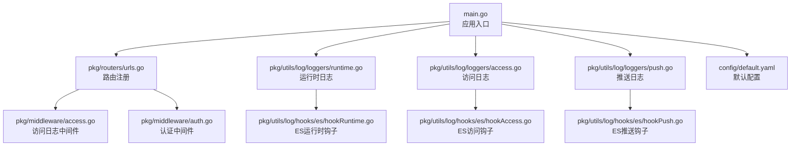
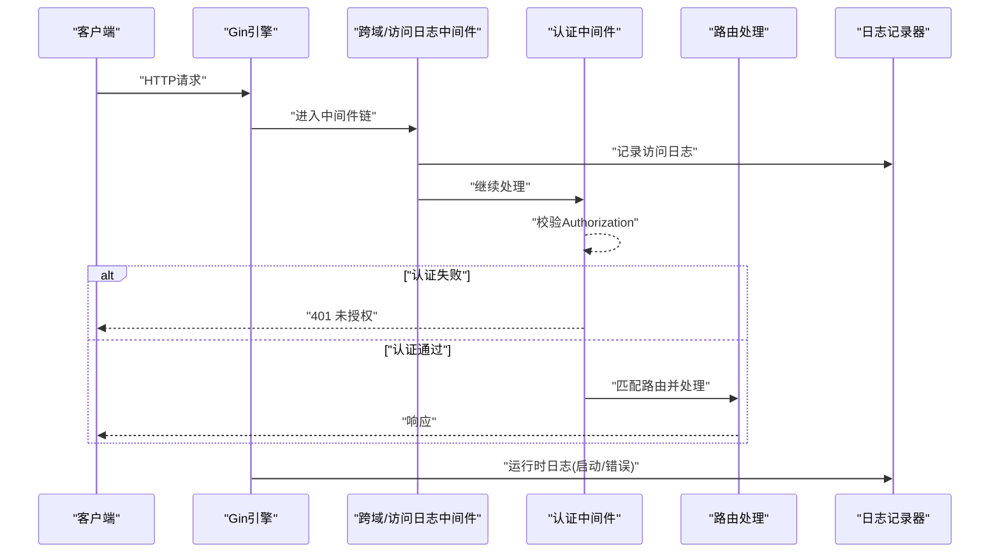
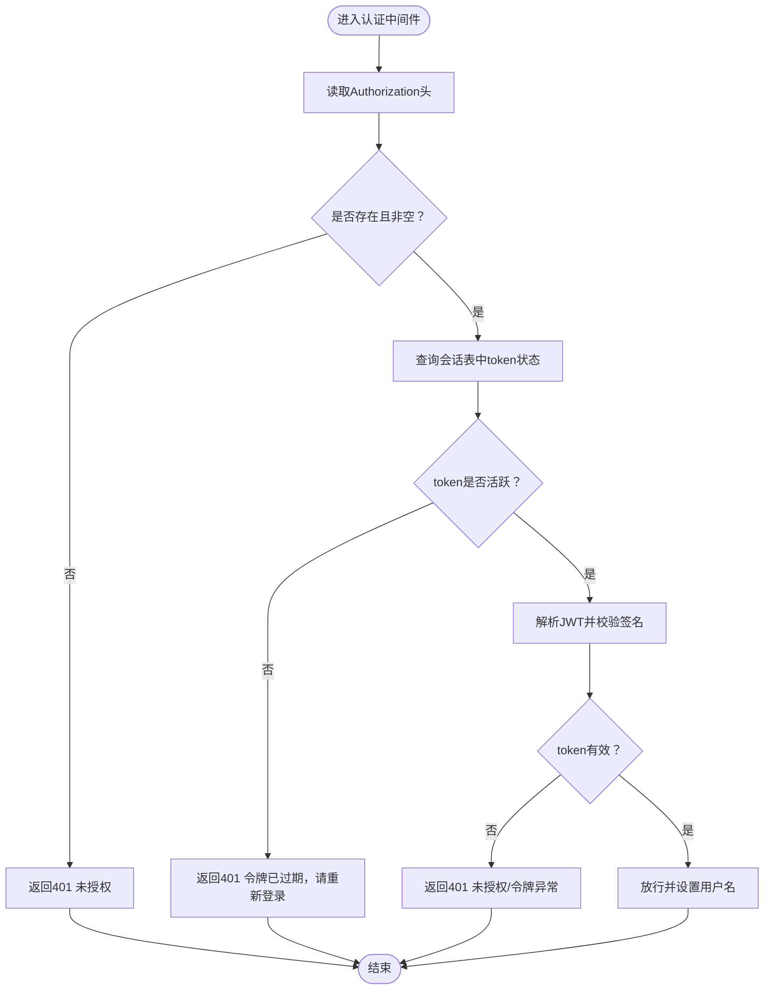
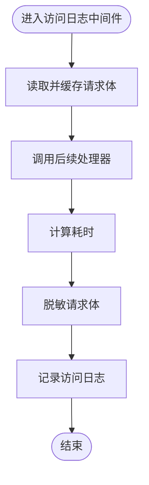
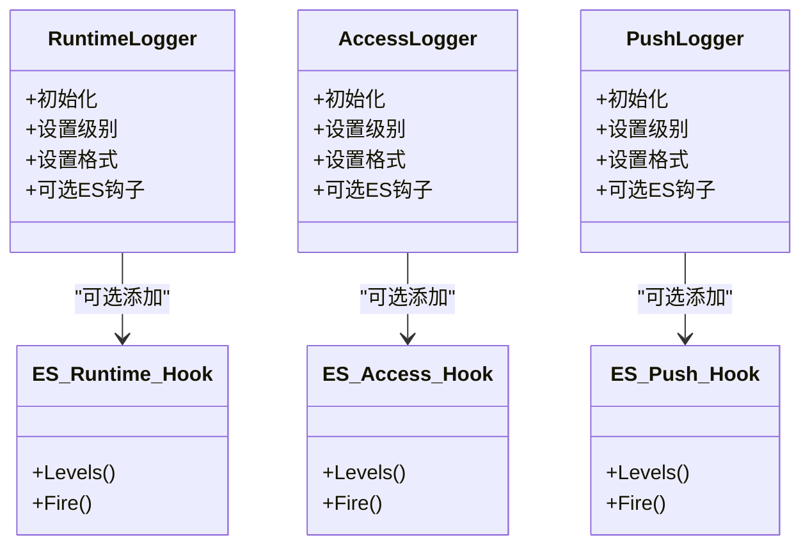
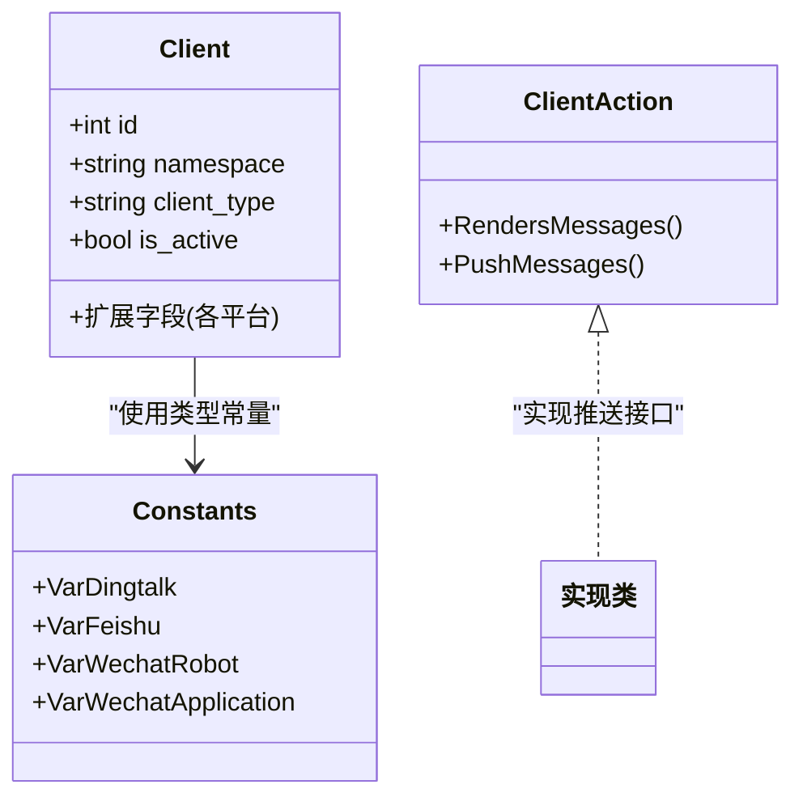
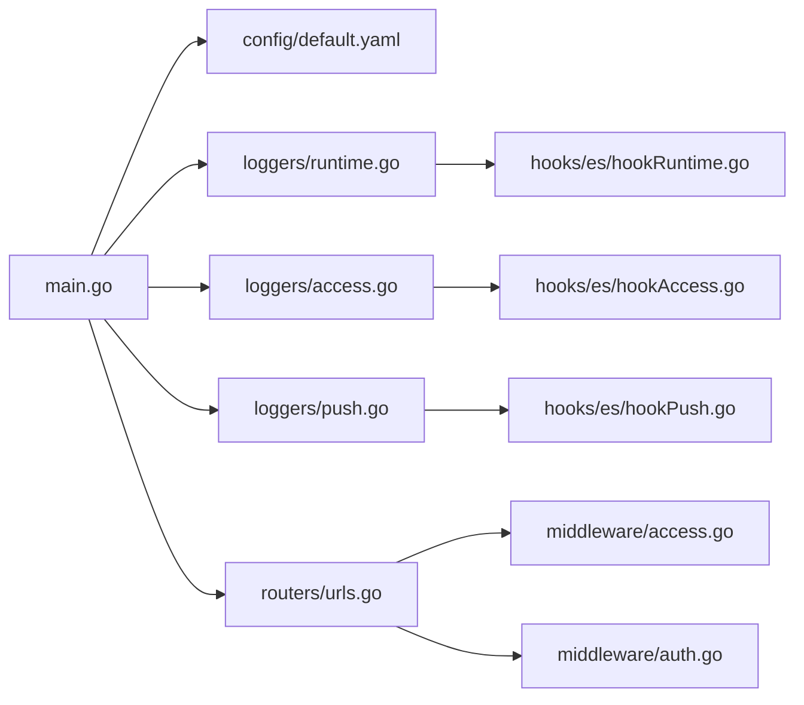

# 故障排除

<cite>
**本文引用的文件**
- [main.go](file://main.go)
- [default.yaml](file://config/default.yaml)
- [runtime.go](file://pkg/utils/log/loggers/runtime.go)
- [access.go](file://pkg/utils/log/loggers/access.go)
- [push.go](file://pkg/utils/log/loggers/push.go)
- [hookAccess.go](file://pkg/utils/log/hooks/es/hookAccess.go)
- [hookPush.go](file://pkg/utils/log/hooks/es/hookPush.go)
- [hookRuntime.go](file://pkg/utils/log/hooks/es/hookRuntime.go)
- [urls.go](file://pkg/routers/urls.go)
- [auth.go](file://pkg/middleware/auth.go)
- [access.go](file://pkg/middleware/access.go)
- [response.go](file://pkg/utils/response.go)
- [client.go](file://pkg/models/client.go)
- [constants.go](file://pkg/utils/constants.go)
- [install_linux.md](file://wiki/install_linux.md)
</cite>

## 目录
1. [简介](#简介)
2. [项目结构](#项目结构)
3. [核心组件](#核心组件)
4. [架构总览](#架构总览)
5. [详细组件分析](#详细组件分析)
6. [依赖分析](#依赖分析)
7. [性能考虑](#性能考虑)
8. [故障排除指南](#故障排除指南)
9. [结论](#结论)
10. [附录](#附录)

## 简介
本指南面向运维与开发者，聚焦于安装、配置、认证、推送、日志与性能等常见问题的排查与解决。文档基于仓库现有实现，提供错误代码参考、日志查看方式、调试技巧、性能诊断与优化建议，并给出社区支持与问题反馈渠道。

## 项目结构
- 启动入口负责按序初始化配置、命令行参数、日志、Swagger、Gin 模式与数据库，随后启动 HTTP 服务。
- 路由层定义了健康检查、静态资源、Swagger 文档、数据入口、鉴权、命名空间与客户端管理等接口。
- 中间件层包含跨域、访问日志与认证校验。
- 日志系统分为运行时日志、访问日志与推送日志，支持落盘与可选的 Elasticsearch 输出。
- 配置文件集中管理全局、鉴权、服务监听、日志、数据库与 ES 等参数。

图表来源
- [main.go:13-35](file://main.go#L13-L35)
- [urls.go:21-108](file://pkg/routers/urls.go#L21-L108)
- [runtime.go:15-60](file://pkg/utils/log/loggers/runtime.go#L15-L60)
- [access.go:15-58](file://pkg/utils/log/loggers/access.go#L15-L58)
- [push.go:15-58](file://pkg/utils/log/loggers/push.go#L15-L58)
- [hookAccess.go:10-30](file://pkg/utils/log/hooks/es/hookAccess.go#L10-L30)
- [hookPush.go:10-30](file://pkg/utils/log/hooks/es/hookPush.go#L10-L30)
- [hookRuntime.go:10-30](file://pkg/utils/log/hooks/es/hookRuntime.go#L10-L30)
- [default.yaml:1-83](file://config/default.yaml#L1-L83)

章节来源
- [main.go:13-55](file://main.go#L13-L55)
- [urls.go:21-108](file://pkg/routers/urls.go#L21-L108)
- [default.yaml:1-83](file://config/default.yaml#L1-L83)

## 核心组件
- 应用入口与初始化顺序：严格遵循配置、命令行、日志、Swagger、Gin 模式、数据库的初始化顺序，避免运行时状态不一致。
- 路由与中间件：统一启用跨域与访问日志；v1 接口组启用命名空间校验与认证中间件。
- 日志系统：运行时日志同时输出至标准输出与文件，访问与推送日志分别落盘；可选将三类日志投递至 Elasticsearch。
- 配置中心：通过默认配置文件集中管理服务监听、日志级别与格式、数据库类型与连接参数、ES 开关与凭据等。

章节来源
- [main.go:13-35](file://main.go#L13-L35)
- [urls.go:27-28](file://pkg/routers/urls.go#L27-L28)
- [runtime.go:15-60](file://pkg/utils/log/loggers/runtime.go#L15-L60)
- [access.go:15-58](file://pkg/utils/log/loggers/access.go#L15-L58)
- [push.go:15-58](file://pkg/utils/log/loggers/push.go#L15-L58)
- [default.yaml:27-44](file://config/default.yaml#L27-L44)

## 架构总览
下图展示从请求进入、中间件处理、路由分发到日志记录的整体流程，以及日志可选投递至 Elasticsearch 的路径。

图表来源
- [urls.go:27-28](file://pkg/routers/urls.go#L27-L28)
- [access.go:23-71](file://pkg/middleware/access.go#L23-L71)
- [auth.go:12-61](file://pkg/middleware/auth.go#L12-L61)
- [runtime.go:15-60](file://pkg/utils/log/loggers/runtime.go#L15-L60)

## 详细组件分析

### 认证中间件
- 关键行为：从请求头提取 Authorization 字段，校验 JWT 签名与有效性，并检查会话表中 token 的活跃状态。
- 失败场景：缺少或为空的 Authorization 头、签名无效、令牌异常、令牌无效、token 已注销。
- 响应：统一返回失败响应模板，包含错误信息与帮助链接。

图表来源
- [auth.go:12-61](file://pkg/middleware/auth.go#L12-L61)
- [response.go:20-27](file://pkg/utils/response.go#L20-L27)

章节来源
- [auth.go:12-61](file://pkg/middleware/auth.go#L12-L61)
- [response.go:20-27](file://pkg/utils/response.go#L20-L27)

### 访问日志中间件
- 关键行为：记录请求开始时间、URI、查询参数、方法、路由、客户端 IP、状态码、耗时与脱敏后的请求体。
- 脱敏策略：对 password、secret、token、authorization 等敏感字段进行替换，限制最大长度。
- 输出：写入访问日志记录器，支持 JSON 格式与可选 ES 投递。

图表来源
- [access.go:23-71](file://pkg/middleware/access.go#L23-L71)
- [access.go:15-21](file://pkg/middleware/access.go#L15-L21)

章节来源
- [access.go:23-71](file://pkg/middleware/access.go#L23-L71)
- [access.go:15-21](file://pkg/middleware/access.go#L15-L21)

### 日志系统与 ES 钩子
- 运行时日志：同时输出到标准输出与文件，支持 debug/info 级别与 text/json 格式；可选投递 ES。
- 访问日志：落盘并可选投递 ES。
- 推送日志：落盘并可选投递 ES。
- ES 钩子：每个日志类别独立钩子，超时控制，自动同步索引。

图表来源
- [runtime.go:15-60](file://pkg/utils/log/loggers/runtime.go#L15-L60)
- [access.go:15-58](file://pkg/utils/log/loggers/access.go#L15-L58)
- [push.go:15-58](file://pkg/utils/log/loggers/push.go#L15-L58)
- [hookRuntime.go:10-30](file://pkg/utils/log/hooks/es/hookRuntime.go#L10-L30)
- [hookAccess.go:10-30](file://pkg/utils/log/hooks/es/hookAccess.go#L10-L30)
- [hookPush.go:10-30](file://pkg/utils/log/hooks/es/hookPush.go#L10-L30)

章节来源
- [runtime.go:15-113](file://pkg/utils/log/loggers/runtime.go#L15-L113)
- [access.go:15-59](file://pkg/utils/log/loggers/access.go#L15-L59)
- [push.go:15-59](file://pkg/utils/log/loggers/push.go#L15-L59)
- [hookRuntime.go:10-31](file://pkg/utils/log/hooks/es/hookRuntime.go#L10-L31)
- [hookAccess.go:10-31](file://pkg/utils/log/hooks/es/hookAccess.go#L10-L31)
- [hookPush.go:10-31](file://pkg/utils/log/hooks/es/hookPush.go#L10-L31)

### 客户端模型与推送相关
- 客户端类型常量：钉钉、飞书、微信机器人、企业微信应用。
- 客户端 CRUD：新增、更新、删除、按 ID 查询、列出、获取激活客户端等。
- 推送接口：定义渲染消息与推送消息的接口契约，用于不同平台的消息发送。

图表来源
- [client.go:13-239](file://pkg/models/client.go#L13-L239)
- [constants.go:3-8](file://pkg/utils/constants.go#L3-L8)
- [interfaces.go:7-10](file://pkg/services/core/v3/interfaces.go#L7-L10)

章节来源
- [client.go:13-239](file://pkg/models/client.go#L13-L239)
- [constants.go:3-8](file://pkg/utils/constants.go#L3-L8)
- [interfaces.go:7-10](file://pkg/services/core/v3/interfaces.go#L7-L10)

## 依赖分析
- 初始化耦合：入口严格控制初始化顺序，降低组件间依赖风险。
- 中间件耦合：访问日志中间件与认证中间件在路由组中按序启用，确保日志先行。
- 日志耦合：运行时、访问、推送日志分别独立初始化，ES 钩子按需启用，避免强耦合。
- 配置耦合：配置项集中于默认配置文件，日志级别、格式、ES 开关、数据库类型与连接参数均在此处定义。

图表来源
- [main.go:13-35](file://main.go#L13-L35)
- [default.yaml:1-83](file://config/default.yaml#L1-L83)
- [runtime.go:15-60](file://pkg/utils/log/loggers/runtime.go#L15-L60)
- [access.go:15-58](file://pkg/utils/log/loggers/access.go#L15-L58)
- [push.go:15-58](file://pkg/utils/log/loggers/push.go#L15-L58)
- [hookRuntime.go:10-30](file://pkg/utils/log/hooks/es/hookRuntime.go#L10-L30)
- [hookAccess.go:10-30](file://pkg/utils/log/hooks/es/hookAccess.go#L10-L30)
- [hookPush.go:10-30](file://pkg/utils/log/hooks/es/hookPush.go#L10-L30)
- [urls.go:21-108](file://pkg/routers/urls.go#L21-L108)
- [access.go:23-71](file://pkg/middleware/access.go#L23-L71)
- [auth.go:12-61](file://pkg/middleware/auth.go#L12-L61)

章节来源
- [main.go:13-35](file://main.go#L13-L35)
- [urls.go:21-108](file://pkg/routers/urls.go#L21-L108)
- [default.yaml:1-83](file://config/default.yaml#L1-L83)

## 性能考虑
- 日志级别与格式：生产环境建议使用 info 级别与 text 或 json 格式，避免过度开销；仅在排障阶段临时提升到 debug。
- ES 投递：当 log2es=true 时，日志将投递至 ES，注意网络与 ES 性能；若日志量大，建议评估 ES 规格或关闭投递。
- 数据库连接：SQLite 默认 MaxIdleConns 与 MaxOpenConns 已配置，MySQL 不推荐使用；如使用 MySQL，需评估连接池与索引。
- 网络与超时：ES 钩子 Fire 方法设置了超时，避免阻塞日志写入；如网络抖动频繁，建议优化网络或调整超时阈值。
- 路由与中间件：访问日志中间件会对请求体进行读取与缓存，注意请求体大小限制与内存占用。

章节来源
- [runtime.go:63-112](file://pkg/utils/log/loggers/runtime.go#L63-L112)
- [default.yaml:58-61](file://config/default.yaml#L58-L61)
- [hookAccess.go:18-24](file://pkg/utils/log/hooks/es/hookAccess.go#L18-L24)
- [hookPush.go:18-24](file://pkg/utils/log/hooks/es/hookPush.go#L18-L24)
- [hookRuntime.go:18-24](file://pkg/utils/log/hooks/es/hookRuntime.go#L18-L24)

## 故障排除指南

### 一、安装与启动问题
- 现象：服务无法启动或端口占用
  - 检查服务监听地址与端口配置，确认未被占用。
  - 查看运行时日志中“服务监听”输出，确认绑定地址与端口。
  - 使用 systemd 管理服务，确保 WorkingDirectory 与 ExecStart 指向正确路径。
- 现象：首次访问页面空白或 404
  - 确认静态资源与首页路由已注册。
  - 检查静态文件目录与 HTML 加载逻辑。
- 参考文件
  - [main.go:48-54](file://main.go#L48-L54)
  - [urls.go:15-39](file://pkg/routers/urls.go#L15-L39)
  - [install_linux.md:85-141](file://wiki/install_linux.md#L85-L141)

章节来源
- [main.go:48-54](file://main.go#L48-L54)
- [urls.go:15-39](file://pkg/routers/urls.go#L15-L39)
- [install_linux.md:85-141](file://wiki/install_linux.md#L85-L141)

### 二、配置错误
- 现象：日志未输出或输出异常
  - 检查日志级别与格式配置，确认目录与文件存在。
  - 若启用 ES 投递，检查 log2es 与 ES 凭据、URL 是否正确。
- 现象：数据库连接失败
  - 确认 databaseType 与 sqlite3/mysql 参数配置正确。
  - SQLite 路径需存在且可写；MySQL 需检查主机、端口、库名、账号与密码。
- 参考文件
  - [default.yaml:27-44](file://config/default.yaml#L27-L44)
  - [default.yaml:52](file://config/default.yaml#L52)
  - [default.yaml:58-75](file://config/default.yaml#L58-L75)
  - [runtime.go:15-60](file://pkg/utils/log/loggers/runtime.go#L15-L60)
  - [access.go:15-58](file://pkg/utils/log/loggers/access.go#L15-L58)
  - [push.go:15-58](file://pkg/utils/log/loggers/push.go#L15-L58)

章节来源
- [default.yaml:27-44](file://config/default.yaml#L27-L44)
- [default.yaml:52](file://config/default.yaml#L52)
- [default.yaml:58-75](file://config/default.yaml#L58-L75)
- [runtime.go:15-60](file://pkg/utils/log/loggers/runtime.go#L15-L60)
- [access.go:15-58](file://pkg/utils/log/loggers/access.go#L15-L58)
- [push.go:15-58](file://pkg/utils/log/loggers/push.go#L15-L58)

### 三、认证问题
- 现象：401 未授权
  - 缺少 Authorization 头或为空；检查请求头是否正确传递。
  - JWT 签名无效或令牌异常；检查 jwtKey 与令牌生成方。
  - 令牌无效或已过期；检查会话表中 token 状态。
- 现象：接口提示“令牌已过期，请重新登录”
  - 表示 token 在会话表中不活跃，需重新登录获取新 token。
- 参考文件
  - [auth.go:12-61](file://pkg/middleware/auth.go#L12-L61)
  - [response.go:20-27](file://pkg/utils/response.go#L20-L27)

章节来源
- [auth.go:12-61](file://pkg/middleware/auth.go#L12-L61)
- [response.go:20-27](file://pkg/utils/response.go#L20-L27)

### 四、推送失败
- 现象：消息未送达或部分失败
  - 检查客户端类型与配置（如机器人 URL、关键词、应用凭证等）。
  - 查看推送日志，确认平台 API 返回与重试策略。
  - 平台限流或网络异常：适当降低并发与增加重试间隔。
- 参考文件
  - [client.go:13-239](file://pkg/models/client.go#L13-L239)
  - [constants.go:3-8](file://pkg/utils/constants.go#L3-L8)
  - [push.go:15-58](file://pkg/utils/log/loggers/push.go#L15-L58)

章节来源
- [client.go:13-239](file://pkg/models/client.go#L13-L239)
- [constants.go:3-8](file://pkg/utils/constants.go#L3-L8)
- [push.go:15-58](file://pkg/utils/log/loggers/push.go#L15-L58)

### 五、日志分析与查看
- 运行时日志
  - 作用：记录服务启动、错误与核心流程信息。
  - 查看：标准输出与 runtimeLogFile；生产环境建议仅查看文件。
  - 参考：[runtime.go:15-60](file://pkg/utils/log/loggers/runtime.go#L15-L60)
- 访问日志
  - 作用：记录请求路径、方法、状态码、耗时、客户端 IP、路由与脱敏请求体。
  - 查看：accessLogFile；可选投递 ES，索引名含日期。
  - 参考：[access.go:15-58](file://pkg/utils/log/loggers/access.go#L15-L58)，[hookAccess.go:10-30](file://pkg/utils/log/hooks/es/hookAccess.go#L10-L30)
- 推送日志
  - 作用：记录推送过程与结果统计。
  - 查看：pushLogFile；可选投递 ES，索引名含日期。
  - 参考：[push.go:15-58](file://pkg/utils/log/loggers/push.go#L15-L58)，[hookPush.go:10-30](file://pkg/utils/log/hooks/es/hookPush.go#L10-L30)
- ES 日志
  - 索引格式：gomessage-runtime-yyyy.mm.dd、gomessage-access-yyyy.mm.dd、gomessage-push-yyyy.mm.dd。
  - 参考：[hookRuntime.go:21-22](file://pkg/utils/log/hooks/es/hookRuntime.go#L21-L22)，[hookAccess.go:21-22](file://pkg/utils/log/hooks/es/hookAccess.go#L21-L22)，[hookPush.go:21-22](file://pkg/utils/log/hooks/es/hookPush.go#L21-L22)

章节来源
- [runtime.go:15-60](file://pkg/utils/log/loggers/runtime.go#L15-L60)
- [access.go:15-58](file://pkg/utils/log/loggers/access.go#L15-L58)
- [push.go:15-58](file://pkg/utils/log/loggers/push.go#L15-L58)
- [hookRuntime.go:21-22](file://pkg/utils/log/hooks/es/hookRuntime.go#L21-L22)
- [hookAccess.go:21-22](file://pkg/utils/log/hooks/es/hookAccess.go#L21-L22)
- [hookPush.go:21-22](file://pkg/utils/log/hooks/es/hookPush.go#L21-L22)

### 六、调试技巧与工具
- 日志级别：排障时临时提升到 debug，观察更细粒度信息。
- 访问日志脱敏：注意敏感字段已被脱敏，必要时结合后端业务日志定位。
- Swagger 文档：通过 /swagger/*any 访问在线文档，核对接口与参数。
- 健康检查：GET /ok 与 GET /health 快速判断服务可用性。
- 参考文件
  - [runtime.go:63-84](file://pkg/utils/log/loggers/runtime.go#L63-L84)
  - [urls.go:30-39](file://pkg/routers/urls.go#L30-L39)
  - [urls.go:30-32](file://pkg/routers/urls.go#L30-L32)

章节来源
- [runtime.go:63-84](file://pkg/utils/log/loggers/runtime.go#L63-L84)
- [urls.go:30-39](file://pkg/routers/urls.go#L30-L39)
- [urls.go:30-32](file://pkg/routers/urls.go#L30-L32)

### 七、错误代码参考
- 统一响应模板字段
  - code: 1 成功，0 失败
  - msg: 描述信息
  - result: 成功时返回结果
  - error: 失败时返回错误对象
  - help: 帮助文档链接
- 参考文件
  - [response.go:3-9](file://pkg/utils/response.go#L3-L9)
  - [response.go:11-27](file://pkg/utils/response.go#L11-L27)

章节来源
- [response.go:3-9](file://pkg/utils/response.go#L3-L9)
- [response.go:11-27](file://pkg/utils/response.go#L11-L27)

### 八、性能诊断与优化
- 日志开销：减少 debug 级别与 JSON 格式使用频率；必要时关闭 ES 投递。
- 数据库：SQLite 默认连接池已配置；MySQL 不推荐使用。
- 网络：ES 超时默认 5 秒，网络不稳定时可评估超时与重试策略。
- 参考文件
  - [runtime.go:63-112](file://pkg/utils/log/loggers/runtime.go#L63-L112)
  - [default.yaml:58-61](file://config/default.yaml#L58-L61)
  - [hookAccess.go:18-24](file://pkg/utils/log/hooks/es/hookAccess.go#L18-L24)

章节来源
- [runtime.go:63-112](file://pkg/utils/log/loggers/runtime.go#L63-L112)
- [default.yaml:58-61](file://config/default.yaml#L58-L61)
- [hookAccess.go:18-24](file://pkg/utils/log/hooks/es/hookAccess.go#L18-L24)

### 九、社区支持与问题反馈
- 文档与安装指南：参考 Linux 安装文档，了解部署与 systemd 使用。
- 参考文件
  - [install_linux.md:1-167](file://wiki/install_linux.md#L1-L167)

章节来源
- [install_linux.md:1-167](file://wiki/install_linux.md#L1-L167)

### 十、诊断信息收集与 Bug 报告
- 收集内容建议
  - 运行时日志片段（含启动与错误）
  - 访问日志（含目标路径、状态码、耗时）
  - 配置文件片段（日志、ES、数据库相关）
  - 操作系统与内核版本、GoMessage 版本
- 提交方式：根据项目维护者提供的渠道提交 Issue，附带上述信息与最小复现步骤。

章节来源
- [runtime.go:15-60](file://pkg/utils/log/loggers/runtime.go#L15-L60)
- [access.go:15-58](file://pkg/utils/log/loggers/access.go#L15-L58)
- [default.yaml:27-44](file://config/default.yaml#L27-L44)

### 十一、紧急应急处理
- 立即措施
  - 降级日志级别与格式，关闭 ES 投递，减轻系统负载。
  - 检查网络连通性与 ES 可用性，必要时临时禁用 ES。
  - 重启服务，确认端口占用与进程状态。
- 参考文件
  - [runtime.go:63-84](file://pkg/utils/log/loggers/runtime.go#L63-L84)
  - [hookRuntime.go:18-24](file://pkg/utils/log/hooks/es/hookRuntime.go#L18-L24)
  - [install_linux.md:120-141](file://wiki/install_linux.md#L120-L141)

章节来源
- [runtime.go:63-84](file://pkg/utils/log/loggers/runtime.go#L63-L84)
- [hookRuntime.go:18-24](file://pkg/utils/log/hooks/es/hookRuntime.go#L18-L24)
- [install_linux.md:120-141](file://wiki/install_linux.md#L120-L141)

## 结论
本指南基于仓库现有实现，提供了从安装、配置、认证、推送、日志到性能与应急处理的全链路故障排除路径。建议在生产环境中保持合理的日志级别与格式，谨慎启用 ES 投递，并通过 systemd 等方式稳定运行服务。遇到复杂问题时，按“诊断信息收集—日志分析—最小复现—提交反馈”的流程推进。

## 附录
- 常用接口
  - 健康检查：GET /ok、GET /health
  - Swagger：GET /swagger/*any
  - 登录注册：POST /auth/login、POST /auth/logout、POST /auth/register
  - 数据入口：GET /go/:namespace、POST /go/:namespace
- 参考文件
  - [urls.go:30-53](file://pkg/routers/urls.go#L30-L53)
  - [urls.go:41-48](file://pkg/routers/urls.go#L41-L48)

章节来源
- [urls.go:30-53](file://pkg/routers/urls.go#L30-L53)
- [urls.go:41-48](file://pkg/routers/urls.go#L41-L48)