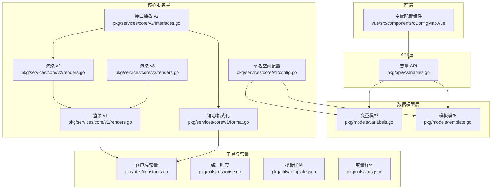
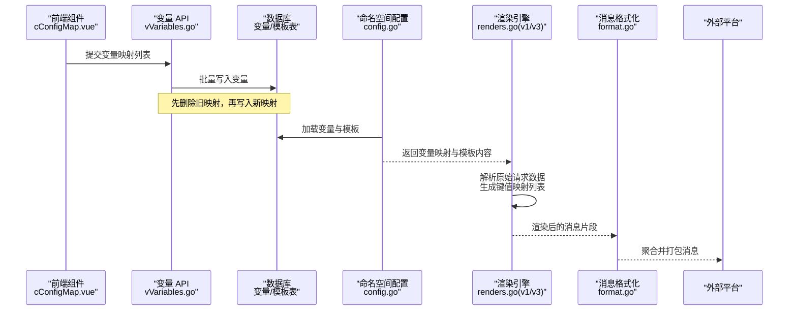
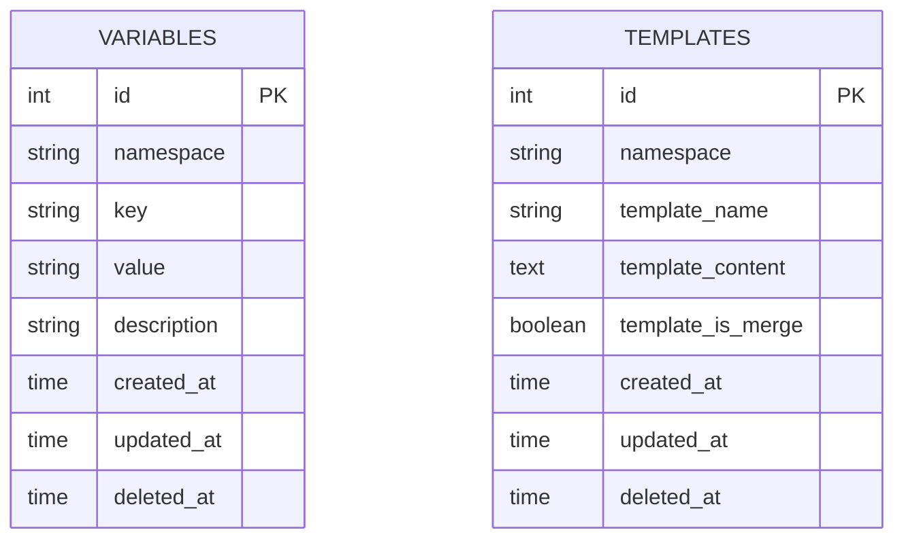
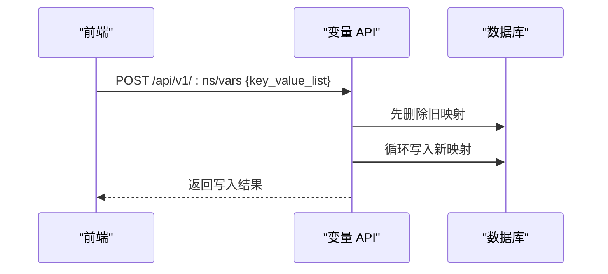
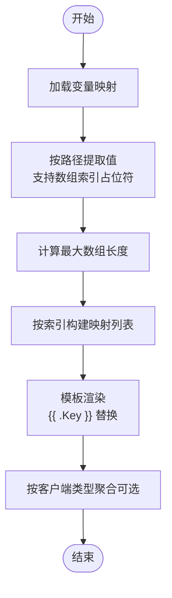
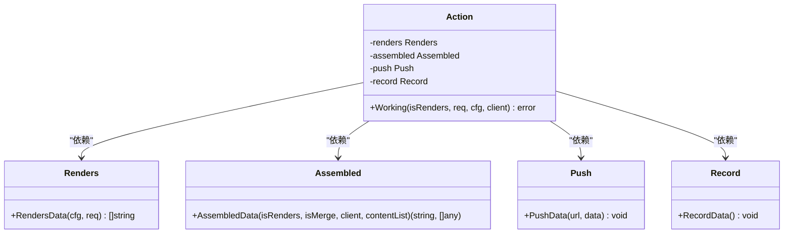
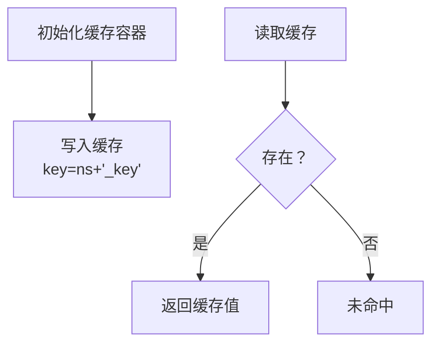
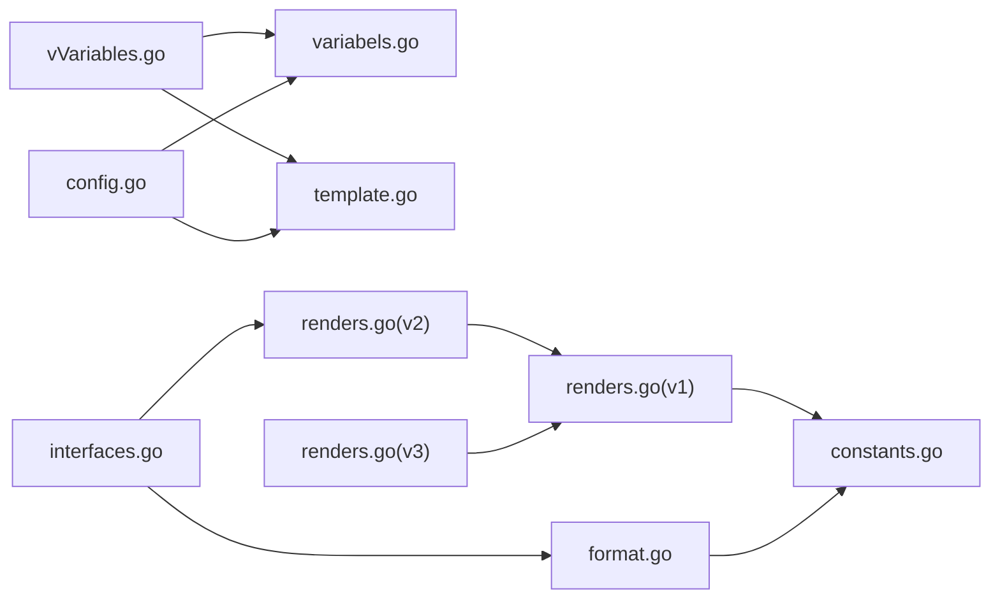

# 变量映射系统

<cite>
**本文引用的文件**
- [pkg/models/variabels.go](file://pkg/models/variabels.go)
- [pkg/api/vVariables.go](file://pkg/api/vVariables.go)
- [pkg/services/core/v1/config.go](file://pkg/services/core/v1/config.go)
- [pkg/services/core/v1/renders.go](file://pkg/services/core/v1/renders.go)
- [pkg/services/core/v2/renders.go](file://pkg/services/core/v2/renders.go)
- [pkg/services/core/v3/renders.go](file://pkg/services/core/v3/renders.go)
- [pkg/services/core/v1/format.go](file://pkg/services/core/v1/format.go)
- [pkg/services/core/v2/interfaces.go](file://pkg/services/core/v2/interfaces.go)
- [pkg/services/hijacking/cache.go](file://pkg/services/hijacking/cache.go)
- [pkg/utils/constants.go](file://pkg/utils/constants.go)
- [pkg/utils/response.go](file://pkg/utils/response.go)
- [pkg/utils/template.json](file://pkg/utils/template.json)
- [pkg/utils/vars.json](file://pkg/utils/vars.json)
- [pkg/models/template.go](file://pkg/models/template.go)
- [vue/src/components/cConfigMap.vue](file://vue/src/components/cConfigMap.vue)
</cite>

## 目录
1. [引言](#引言)
2. [项目结构](#项目结构)
3. [核心组件](#核心组件)
4. [架构总览](#架构总览)
5. [详细组件分析](#详细组件分析)
6. [依赖分析](#依赖分析)
7. [性能考虑](#性能考虑)
8. [故障排查指南](#故障排查指南)
9. [结论](#结论)
10. [附录](#附录)

## 引言
本文件系统性阐述变量映射系统在模板渲染中的核心作用，覆盖变量定义、类型转换与作用域管理；变量的存储结构、查询机制与缓存策略；变量与模板的绑定关系及动态变量替换实现；并提供简单变量、数组变量与对象变量的实际使用示例与最佳实践。目标是帮助开发者与运维人员快速理解并正确使用变量映射系统。

## 项目结构
变量映射系统由以下层次构成：
- 数据模型层：变量与模板的持久化模型与 CRUD 接口
- API 层：对外暴露变量的增删改查接口
- 核心服务层：变量映射解析、模板渲染、消息聚合与格式化
- 工具与常量：客户端类型常量、统一响应封装
- 前端交互：变量映射的可视化编辑与提交

图表来源
- [pkg/models/variabels.go:1-89](file://pkg/models/variabels.go#L1-L89)
- [pkg/models/template.go:1-72](file://pkg/models/template.go#L1-L72)
- [pkg/api/vVariables.go:1-103](file://pkg/api/vVariables.go#L1-L103)
- [pkg/services/core/v1/config.go:1-79](file://pkg/services/core/v1/config.go#L1-L79)
- [pkg/services/core/v1/renders.go:1-127](file://pkg/services/core/v1/renders.go#L1-L127)
- [pkg/services/core/v2/renders.go:1-29](file://pkg/services/core/v2/renders.go#L1-L29)
- [pkg/services/core/v3/renders.go:1-59](file://pkg/services/core/v3/renders.go#L1-L59)
- [pkg/services/core/v1/format.go:1-62](file://pkg/services/core/v1/format.go#L1-L62)
- [pkg/services/core/v2/interfaces.go:1-60](file://pkg/services/core/v2/interfaces.go#L1-L60)
- [pkg/utils/constants.go:1-9](file://pkg/utils/constants.go#L1-L9)
- [pkg/utils/response.go:1-28](file://pkg/utils/response.go#L1-L28)
- [pkg/utils/template.json:1-5](file://pkg/utils/template.json#L1-L5)
- [pkg/utils/vars.json:1-29](file://pkg/utils/vars.json#L1-L29)
- [vue/src/components/cConfigMap.vue:120-163](file://vue/src/components/cConfigMap.vue#L120-L163)

章节来源
- [pkg/models/variabels.go:1-89](file://pkg/models/variabels.go#L1-L89)
- [pkg/models/template.go:1-72](file://pkg/models/template.go#L1-L72)
- [pkg/api/vVariables.go:1-103](file://pkg/api/vVariables.go#L1-L103)
- [pkg/services/core/v1/config.go:1-79](file://pkg/services/core/v1/config.go#L1-L79)
- [pkg/services/core/v1/renders.go:1-127](file://pkg/services/core/v1/renders.go#L1-L127)
- [pkg/services/core/v2/renders.go:1-29](file://pkg/services/core/v2/renders.go#L1-L29)
- [pkg/services/core/v3/renders.go:1-59](file://pkg/services/core/v3/renders.go#L1-L59)
- [pkg/services/core/v1/format.go:1-62](file://pkg/services/core/v1/format.go#L1-L62)
- [pkg/services/core/v2/interfaces.go:1-60](file://pkg/services/core/v2/interfaces.go#L1-L60)
- [pkg/utils/constants.go:1-9](file://pkg/utils/constants.go#L1-L9)
- [pkg/utils/response.go:1-28](file://pkg/utils/response.go#L1-L28)
- [pkg/utils/template.json:1-5](file://pkg/utils/template.json#L1-L5)
- [pkg/utils/vars.json:1-29](file://pkg/utils/vars.json#L1-L29)
- [vue/src/components/cConfigMap.vue:120-163](file://vue/src/components/cConfigMap.vue#L120-L163)

## 核心组件
- 变量模型与 CRUD
  - 变量实体包含命名空间、键、值与描述等字段，并提供按 ID、命名空间查询与批量更新写入能力
  - 批量更新逻辑会先清空当前命名空间下旧变量，再写入新列表，确保映射一致性
- 模板模型与查询
  - 模板实体包含命名空间、模板名、模板内容与是否合并标志
  - 支持按命名空间获取模板内容与合并策略
- 变量 API
  - 提供变量列表查询、批量新增、单条查询、更新与删除接口
  - 统一响应封装，便于前端与监控系统消费
- 渲染与绑定
  - v1/v2/v3 提供多版本渲染流程，均通过变量映射解析与模板渲染生成最终消息
  - 解析阶段使用 JSON 路径语法从原始请求中提取数组或标量值，形成键值映射
  - 模板渲染采用 Go html/template，变量以 {{ .Key }} 形式注入
- 消息格式化与聚合
  - 根据客户端类型对渲染结果进行聚合与打包，支持合并与非合并两种模式
- 前端交互
  - 变量配置组件支持动态增删变量映射，提交时将当前映射整体覆盖写入后端

章节来源
- [pkg/models/variabels.go:9-88](file://pkg/models/variabels.go#L9-L88)
- [pkg/models/template.go:9-71](file://pkg/models/template.go#L9-L71)
- [pkg/api/vVariables.go:12-103](file://pkg/api/vVariables.go#L12-L103)
- [pkg/services/core/v1/config.go:11-58](file://pkg/services/core/v1/config.go#L11-L58)
- [pkg/services/core/v1/renders.go:16-102](file://pkg/services/core/v1/renders.go#L16-L102)
- [pkg/services/core/v2/renders.go:15-28](file://pkg/services/core/v2/renders.go#L15-L28)
- [pkg/services/core/v3/renders.go:10-58](file://pkg/services/core/v3/renders.go#L10-L58)
- [pkg/services/core/v1/format.go:10-61](file://pkg/services/core/v1/format.go#L10-L61)
- [vue/src/components/cConfigMap.vue:120-163](file://vue/src/components/cConfigMap.vue#L120-L163)

## 架构总览
变量映射系统围绕“变量定义—变量解析—模板渲染—消息聚合—推送”闭环工作。前端负责维护变量映射，后端通过 API 写入数据库；运行时根据命名空间加载变量与模板，解析原始请求数据，生成可渲染的数据集，最终输出适配不同客户端的消息体。

图表来源
- [vue/src/components/cConfigMap.vue:120-163](file://vue/src/components/cConfigMap.vue#L120-L163)
- [pkg/api/vVariables.go:30-43](file://pkg/api/vVariables.go#L30-L43)
- [pkg/models/variabels.go:65-88](file://pkg/models/variabels.go#L65-L88)
- [pkg/services/core/v1/config.go:20-58](file://pkg/services/core/v1/config.go#L20-L58)
- [pkg/services/core/v1/renders.go:16-102](file://pkg/services/core/v1/renders.go#L16-L102)
- [pkg/services/core/v3/renders.go:10-58](file://pkg/services/core/v3/renders.go#L10-L58)
- [pkg/services/core/v1/format.go:10-61](file://pkg/services/core/v1/format.go#L10-L61)

## 详细组件分析

### 变量模型与存储结构
- 字段设计
  - 命名空间：用于隔离不同业务域的变量集合
  - 键/值：键为模板中使用的占位符名称，值为请求数据中的 JSON 路径表达式
  - 描述：便于维护与审计
- 存储与查询
  - 支持按 ID 精确查询、按命名空间列出、按命名空间删除
  - 批量更新采用“全量覆盖”策略，避免残留旧映射导致的渲染歧义
- 复杂度与性能
  - 单次查询为 O(n) 列表扫描，命名空间内变量规模通常较小，影响有限
  - 批量更新涉及删除与插入，建议在低峰期执行

图表来源
- [pkg/models/variabels.go:9-22](file://pkg/models/variabels.go#L9-L22)
- [pkg/models/template.go:9-22](file://pkg/models/template.go#L9-L22)

章节来源
- [pkg/models/variabels.go:9-88](file://pkg/models/variabels.go#L9-L88)
- [pkg/models/template.go:9-71](file://pkg/models/template.go#L9-L71)

### 变量 API 与前端交互
- 接口职责
  - GET /api/v1/:namespace/vars：列出命名空间下所有变量
  - POST /api/v1/:namespace/vars：批量新增变量映射（全量覆盖）
  - GET /api/v1/:namespace/vars/:id：按 ID 查询变量
  - PUT /api/v1/:namespace/vars/:id：更新变量
  - DELETE /api/v1/:namespace/vars/:id：删除变量
- 响应规范
  - 成功/失败统一包装，便于前端一致化处理
- 前端行为
  - 动态增删变量映射，提交时将当前列表整体上传，后端执行覆盖写入

图表来源
- [pkg/api/vVariables.go:12-43](file://pkg/api/vVariables.go#L12-L43)
- [pkg/models/variabels.go:65-88](file://pkg/models/variabels.go#L65-L88)
- [vue/src/components/cConfigMap.vue:120-163](file://vue/src/components/cConfigMap.vue#L120-L163)

章节来源
- [pkg/api/vVariables.go:12-103](file://pkg/api/vVariables.go#L12-L103)
- [pkg/utils/response.go:11-27](file://pkg/utils/response.go#L11-L27)
- [vue/src/components/cConfigMap.vue:120-163](file://vue/src/components/cConfigMap.vue#L120-L163)

### 变量解析与模板绑定
- 解析流程（v1/v3）
  - 读取用户变量映射列表，逐项从原始请求数据中提取值
  - 对数组路径（如 alerts.#.labels.xxx）按最大长度生成多组映射
  - 将每组映射作为模板上下文执行渲染
- 模板绑定
  - 模板中使用 {{ .Key }} 的形式引用变量
  - 模板内容与是否合并由模板实体决定
- 时间处理
  - 在 v1 中对 RFC3339 时间进行时区转换与格式化，保证展示一致性

图表来源
- [pkg/services/core/v1/renders.go:69-102](file://pkg/services/core/v1/renders.go#L69-L102)
- [pkg/services/core/v3/renders.go:15-58](file://pkg/services/core/v3/renders.go#L15-L58)
- [pkg/services/core/v1/config.go:34-55](file://pkg/services/core/v1/config.go#L34-L55)

章节来源
- [pkg/services/core/v1/renders.go:16-127](file://pkg/services/core/v1/renders.go#L16-L127)
- [pkg/services/core/v3/renders.go:10-59](file://pkg/services/core/v3/renders.go#L10-L59)
- [pkg/services/core/v1/config.go:19-58](file://pkg/services/core/v1/config.go#L19-L58)

### 渲染与消息聚合（v2 接口抽象）
- 抽象接口
  - Renders：渲染数据为消息片段
  - Assembled：按客户端类型聚合与打包
  - Push：推送至外部平台
  - Record：记录日志或指标
- 工作流
  - Action.Working 负责编排：渲染 → 聚合 → 推送 → 记录
  - 若渲染结果为空，返回明确错误提示，便于前端与监控定位问题

图表来源
- [pkg/services/core/v2/interfaces.go:9-60](file://pkg/services/core/v2/interfaces.go#L9-L60)
- [pkg/services/core/v2/renders.go:15-28](file://pkg/services/core/v2/renders.go#L15-L28)
- [pkg/services/core/v1/format.go:10-61](file://pkg/services/core/v1/format.go#L10-L61)

章节来源
- [pkg/services/core/v2/interfaces.go:1-60](file://pkg/services/core/v2/interfaces.go#L1-L60)
- [pkg/services/core/v2/renders.go:1-29](file://pkg/services/core/v2/renders.go#L1-L29)
- [pkg/services/core/v1/format.go:1-62](file://pkg/services/core/v1/format.go#L1-L62)

### 缓存策略与作用域管理
- 当前实现
  - 使用内存 map 作为临时缓存容器，提供并发安全的读写封装
  - 缓存键采用“命名空间+固定后缀”的组合，避免冲突
- 作用域管理
  - 命名空间作为变量与模板的最小作用域边界，确保不同业务域互不影响
- 建议
  - 未来可引入带过期策略的缓存组件，减少重复查询数据库的开销
  - 对热点命名空间增加本地缓存预热与失效策略

图表来源
- [pkg/services/hijacking/cache.go:15-63](file://pkg/services/hijacking/cache.go#L15-L63)

章节来源
- [pkg/services/hijacking/cache.go:1-64](file://pkg/services/hijacking/cache.go#L1-L64)

### 实际使用示例与最佳实践
- 简单变量
  - 示例：将 alerts.0.labels.alertname 映射为 N1，模板中使用 {{ .N1 }}
  - 注意：键名需与模板占位符一致，且命名空间隔离
- 数组变量
  - 示例：alerts.#.labels.severity 会按 alerts 数组长度生成多条映射
  - 渲染后由聚合函数按客户端类型连接为完整消息
- 对象变量
  - 示例：alerts.#.annotations.description 可作为富文本内容注入模板
  - 建议在模板中使用条件判断与格式化，提升可读性
- 最佳实践
  - 变量映射采用“全量覆盖”策略，避免历史残留导致的渲染异常
  - 模板内容与是否合并由模板实体控制，前端仅负责变量映射
  - 对时间类字段在解析阶段完成格式化，保证跨环境一致性

章节来源
- [pkg/utils/vars.json:1-29](file://pkg/utils/vars.json#L1-L29)
- [pkg/utils/template.json:1-5](file://pkg/utils/template.json#L1-L5)
- [pkg/services/core/v1/renders.go:35-54](file://pkg/services/core/v1/renders.go#L35-L54)
- [vue/src/components/cConfigMap.vue:120-163](file://vue/src/components/cConfigMap.vue#L120-L163)

## 依赖分析
- 组件耦合
  - v1 渲染与客户端常量强关联，便于按类型聚合
  - v2 通过接口抽象解耦渲染、组装与推送，利于扩展与测试
  - API 层仅依赖模型层，职责清晰
- 外部依赖
  - JSON 路径解析依赖第三方库
  - HTML 模板渲染依赖标准库
- 潜在风险
  - 全量覆盖写入可能带来短暂窗口的映射不一致，建议在变更时暂停流量或增加幂等校验

图表来源
- [pkg/api/vVariables.go:1-103](file://pkg/api/vVariables.go#L1-L103)
- [pkg/models/variabels.go:1-89](file://pkg/models/variabels.go#L1-L89)
- [pkg/models/template.go:1-72](file://pkg/models/template.go#L1-L72)
- [pkg/services/core/v1/config.go:1-79](file://pkg/services/core/v1/config.go#L1-L79)
- [pkg/services/core/v1/renders.go:1-127](file://pkg/services/core/v1/renders.go#L1-L127)
- [pkg/services/core/v2/renders.go:1-29](file://pkg/services/core/v2/renders.go#L1-L29)
- [pkg/services/core/v3/renders.go:1-59](file://pkg/services/core/v3/renders.go#L1-L59)
- [pkg/services/core/v1/format.go:1-62](file://pkg/services/core/v1/format.go#L1-L62)
- [pkg/services/core/v2/interfaces.go:1-60](file://pkg/services/core/v2/interfaces.go#L1-L60)
- [pkg/utils/constants.go:1-9](file://pkg/utils/constants.go#L1-L9)

章节来源
- [pkg/api/vVariables.go:1-103](file://pkg/api/vVariables.go#L1-L103)
- [pkg/services/core/v2/interfaces.go:1-60](file://pkg/services/core/v2/interfaces.go#L1-L60)

## 性能考虑
- 查询与渲染
  - 变量与模板查询为小规模列表操作，性能瓶颈不在数据库层
  - 渲染阶段的字符串拼接与模板解析为主要开销，建议在高并发场景限制单次渲染批次大小
- 缓存
  - 当前为内存缓存，适合单实例部署；多实例需引入分布式缓存
  - 可对热点命名空间进行预热，降低首次访问延迟
- 并发
  - 写入采用全量覆盖策略，建议在变更期间限流或加锁，避免竞态
- 日志与可观测性
  - 对模板解析失败、变量缺失等情况记录详细日志，便于定位问题

## 故障排查指南
- 变量映射无效
  - 检查命名空间是否正确，确认变量键名与模板占位符一致
  - 确认 JSON 路径表达式指向的字段是否存在
- 模板渲染失败
  - 查看模板语法是否正确，占位符是否匹配变量键名
  - 关注时间字段的格式化逻辑，避免跨时区差异
- 接口返回错误
  - 使用统一响应结构中的错误字段定位具体原因
  - 对批量写入失败，检查请求体格式与字段约束
- 缓存相关
  - 若出现读取不到最新映射，确认缓存键与命名空间一致，必要时清理缓存后重试

章节来源
- [pkg/utils/response.go:11-27](file://pkg/utils/response.go#L11-L27)
- [pkg/services/core/v1/renders.go:26-60](file://pkg/services/core/v1/renders.go#L26-L60)
- [pkg/services/hijacking/cache.go:38-63](file://pkg/services/hijacking/cache.go#L38-L63)

## 结论
变量映射系统通过“变量定义—解析—渲染—聚合—推送”的完整链路，实现了模板驱动的动态消息生成。其设计强调命名空间隔离、全量覆盖写入与多版本渲染兼容，既保证了灵活性，也兼顾了稳定性。建议在生产环境中结合缓存与限流策略，持续优化渲染性能与可靠性。

## 附录
- 变量样例与模板样例
  - 变量样例展示了数组路径与标量路径的混合使用方式
  - 模板样例展示了条件渲染与占位符注入的典型写法

章节来源
- [pkg/utils/vars.json:1-29](file://pkg/utils/vars.json#L1-L29)
- [pkg/utils/template.json:1-5](file://pkg/utils/template.json#L1-L5)