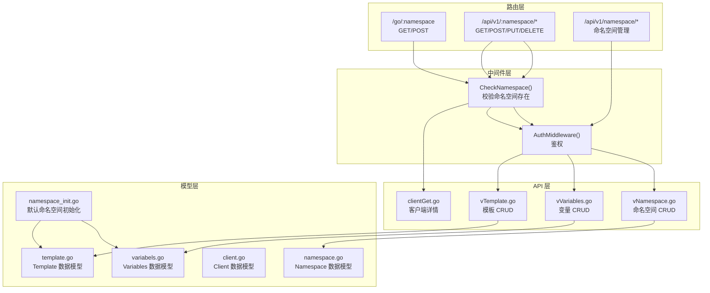
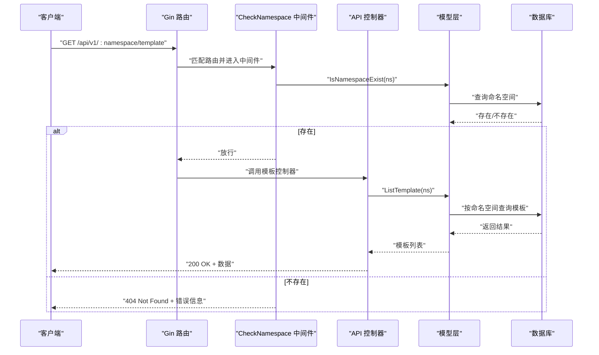
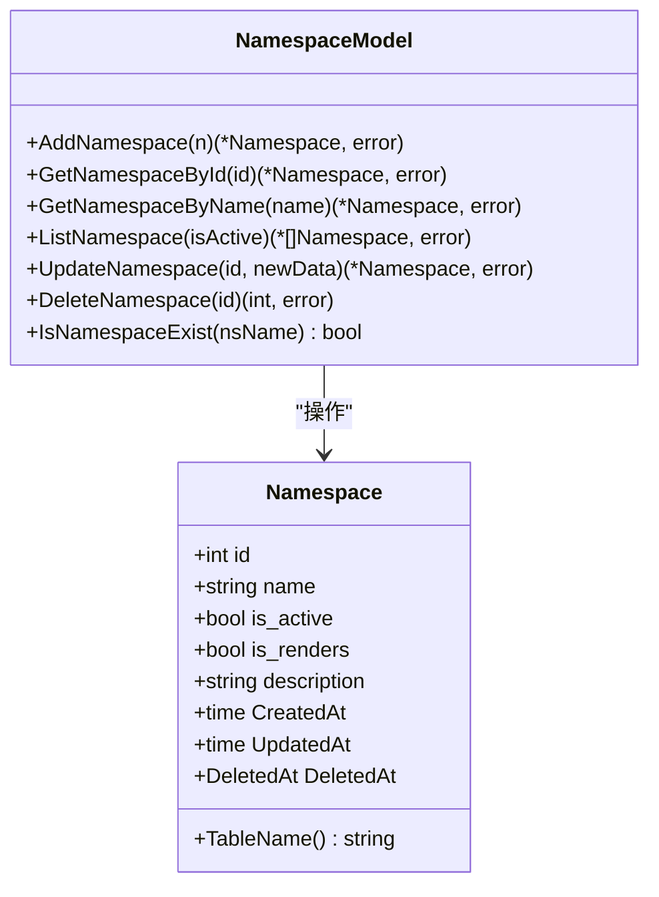
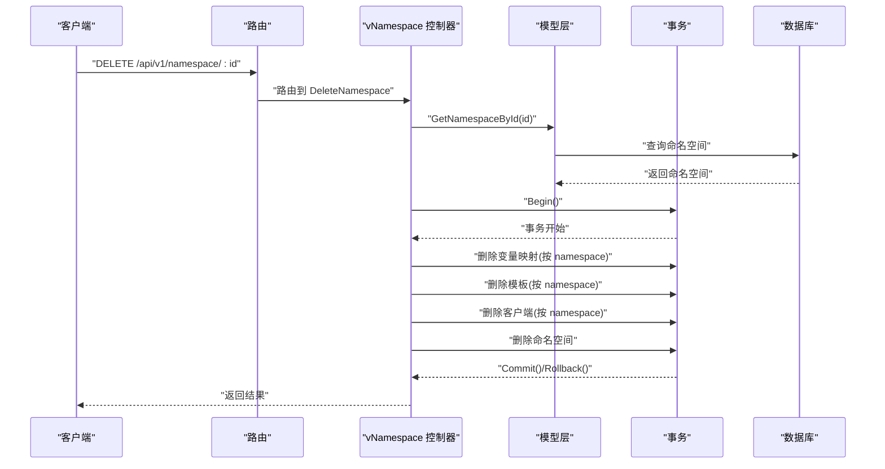
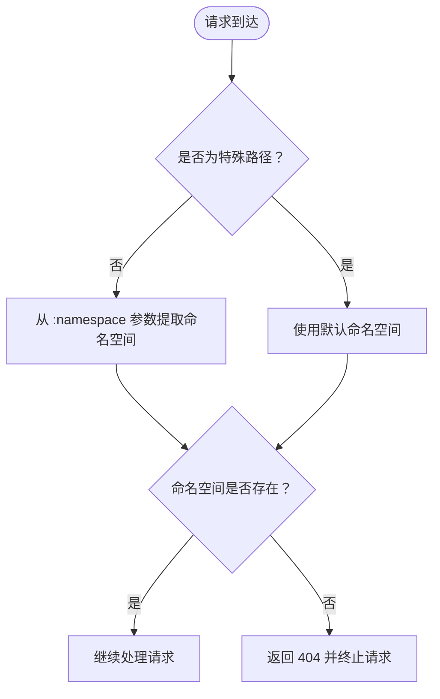
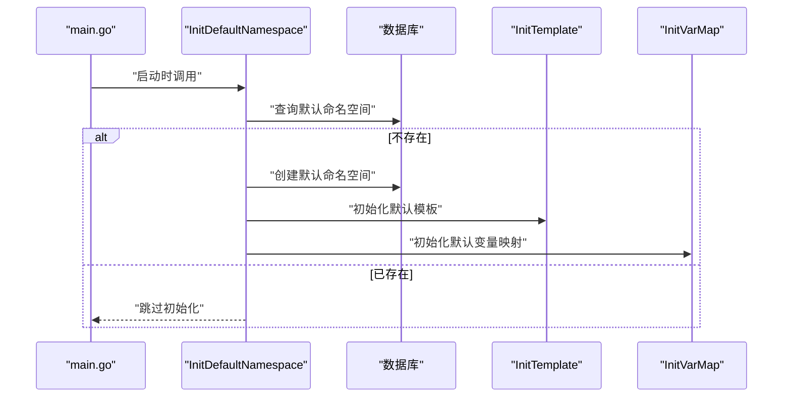
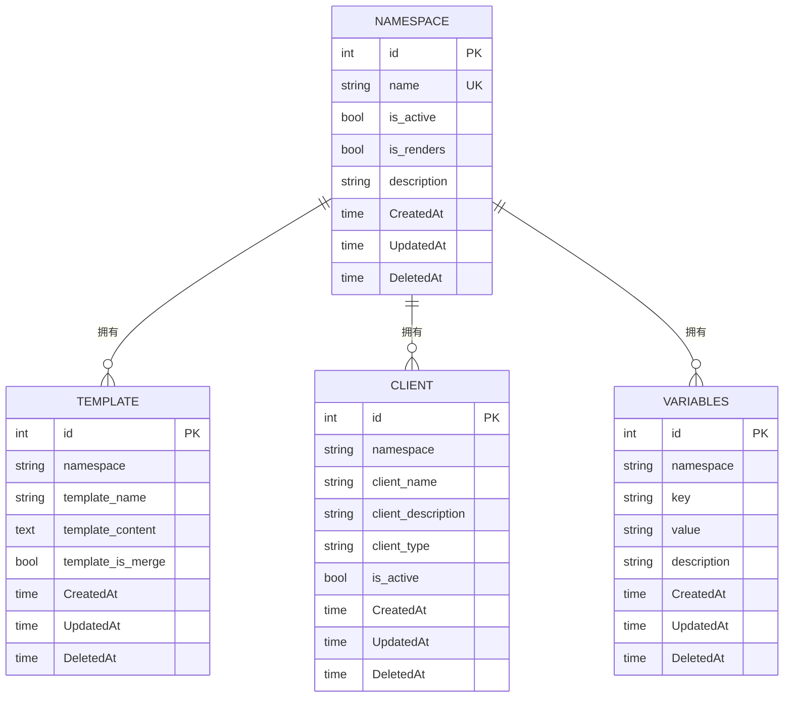
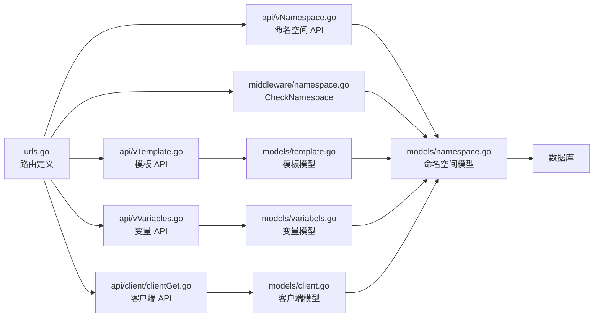

# 命名空间（Namespace）

<cite>
**本文引用的文件**
- [main.go](file://main.go)
- [namespace.go](file://pkg/models/namespace.go)
- [namespace_init.go](file://pkg/models/namespace_init.go)
- [vNamespace.go](file://pkg/api/vNamespace.go)
- [namespace.go](file://pkg/middleware/namespace.go)
- [urls.go](file://pkg/routers/urls.go)
- [template.go](file://pkg/models/template.go)
- [client.go](file://pkg/models/client.go)
- [variabels.go](file://pkg/models/variabels.go)
- [vTemplate.go](file://pkg/api/vTemplate.go)
- [vVariables.go](file://pkg/api/vVariables.go)
- [constants.go](file://pkg/utils/constants.go)
- [clientGet.go](file://pkg/api/client/clientGet.go)
</cite>

## 目录
1. [简介](#简介)
2. [项目结构](#项目结构)
3. [核心组件](#核心组件)
4. [架构总览](#架构总览)
5. [详细组件分析](#详细组件分析)
6. [依赖关系分析](#依赖关系分析)
7. [性能考量](#性能考量)
8. [故障排查指南](#故障排查指南)
9. [结论](#结论)
10. [附录](#附录)

## 简介
本文件围绕“命名空间（Namespace）”概念进行系统性说明，重点阐述其作为多租户隔离机制的核心作用。命名空间在本项目中承担以下职责：
- 多租户隔离：通过命名空间区分不同租户的数据域，确保模板、客户端、变量等资源彼此独立。
- 资源归属：模板、客户端、变量均以命名空间为维度进行存储与查询，避免跨租户数据泄露。
- 激活状态与渲染模式：通过激活开关与渲染模式控制消息推送行为。
- 生命周期管理：支持创建、查询、更新、删除（软删除）等操作，并在删除时联动清理子资源。

## 项目结构
命名空间相关代码分布在以下层次：
- 路由层：定义对外 API 与路由分组，绑定命名空间参数与中间件。
- 中间件层：校验命名空间存在性，确保请求落到正确的租户上下文。
- API 层：提供命名空间 CRUD 与关联资源操作接口。
- 模型层：定义命名空间数据模型及 CRUD 方法；同时负责默认命名空间初始化与关联资源初始化。
- 关联模型：模板、客户端、变量等资源均以命名空间为维度进行隔离。

图表来源
- [urls.go:41-104](file://pkg/routers/urls.go#L41-L104)
- [namespace.go:20-46](file://pkg/middleware/namespace.go#L20-L46)
- [vNamespace.go:15-148](file://pkg/api/vNamespace.go#L15-L148)
- [vTemplate.go:13-146](file://pkg/api/vTemplate.go#L13-L146)
- [vVariables.go:12-102](file://pkg/api/vVariables.go#L12-L102)
- [namespace.go:12-105](file://pkg/models/namespace.go#L12-L105)
- [namespace_init.go:8-93](file://pkg/models/namespace_init.go#L8-L93)
- [template.go:9-71](file://pkg/models/template.go#L9-L71)
- [client.go:13-238](file://pkg/models/client.go#L13-L238)
- [variabels.go:9-88](file://pkg/models/variabels.go#L9-L88)

章节来源
- [urls.go:41-104](file://pkg/routers/urls.go#L41-L104)
- [namespace.go:20-46](file://pkg/middleware/namespace.go#L20-L46)
- [vNamespace.go:15-148](file://pkg/api/vNamespace.go#L15-L148)

## 核心组件
- 命名空间数据模型（Namespace）
  - 字段含义
    - id：自增主键
    - name：命名空间名称，唯一且非空
    - is_active：是否激活，默认 true
    - is_renders：是否开启渲染模式，默认 true
    - description：描述信息
    - 时间戳：CreatedAt、UpdatedAt、DeletedAt（软删除）
  - 业务逻辑
    - 唯一约束保证命名空间名称不可重复
    - 默认激活与渲染模式便于快速启用
    - 删除采用软删除策略，保留历史数据以便审计

- 命名空间 API
  - 列表查询：支持按 is_active 过滤
  - 新增：创建命名空间后自动初始化模板与变量映射
  - 更新：可修改名称、激活状态、渲染模式与描述
  - 删除：软删除命名空间，并级联删除该命名空间下的模板、客户端、变量映射

- 命名空间中间件
  - 校验路由参数中的命名空间是否存在，不存在则拒绝请求
  - 对特殊路径（如 /go、/gomessage）自动映射到默认命名空间

- 默认命名空间初始化
  - 启动时仅初始化一次默认命名空间
  - 自动创建默认模板与变量映射，便于快速体验

章节来源
- [namespace.go:12-105](file://pkg/models/namespace.go#L12-L105)
- [vNamespace.go:15-148](file://pkg/api/vNamespace.go#L15-L148)
- [namespace.go:20-46](file://pkg/middleware/namespace.go#L20-L46)
- [namespace_init.go:8-93](file://pkg/models/namespace_init.go#L8-L93)

## 架构总览
命名空间贯穿路由、中间件、API 与模型层，形成完整的多租户隔离闭环：
- 路由层：统一在 /api/v1/:namespace/* 与 /go/:namespace 上下文中启用命名空间中间件
- 中间件层：校验命名空间存在性，确保后续操作落在正确租户
- API 层：对模板、客户端、变量等资源进行命名空间维度的 CRUD
- 模型层：命名空间作为资源归属标识，配合软删除与初始化流程

图表来源
- [urls.go:58-90](file://pkg/routers/urls.go#L58-L90)
- [namespace.go:20-46](file://pkg/middleware/namespace.go#L20-L46)
- [vTemplate.go:13-25](file://pkg/api/vTemplate.go#L13-L25)
- [template.go:55-59](file://pkg/models/template.go#L55-L59)

## 详细组件分析

### 命名空间数据模型与 CRUD
- 数据模型
  - 结构体字段与 GORM 注解明确字段语义与约束
  - 表名固定为 namespaces
- CRUD 方法
  - 创建：AddNamespace
  - 查询：GetNamespaceById、GetNamespaceByName、ListNamespace
  - 更新：UpdateNamespace
  - 删除：DeleteNamespace（软删除策略）

图表来源
- [namespace.go:12-105](file://pkg/models/namespace.go#L12-L105)

章节来源
- [namespace.go:12-105](file://pkg/models/namespace.go#L12-L105)

### 命名空间 API 流程
- 列表查询
  - 支持 is_active 参数过滤（true/false/1/0/空），空表示查询全部
- 新增命名空间
  - 创建成功后自动初始化模板与变量映射
- 更新命名空间
  - 可修改名称、激活状态、渲染模式与描述
- 删除命名空间
  - 使用事务删除该命名空间下的模板、客户端、变量映射，最后软删除命名空间本身

图表来源
- [vNamespace.go:98-148](file://pkg/api/vNamespace.go#L98-L148)
- [namespace.go:40-48](file://pkg/models/namespace.go#L40-L48)
- [variabels.go:35-39](file://pkg/models/variabels.go#L35-L39)
- [template.go:35-39](file://pkg/models/template.go#L35-L39)
- [client.go:221-228](file://pkg/models/client.go#L221-L228)

章节来源
- [vNamespace.go:15-148](file://pkg/api/vNamespace.go#L15-L148)

### 命名空间中间件与路由绑定
- 中间件 CheckNamespace
  - 优先处理特殊路径（/go、/gomessage、/go/message）映射到默认命名空间
  - 其他路由从参数 :namespace 提取命名空间并校验存在性
- 路由绑定
  - /go/:namespace 与 /api/v1/:namespace/* 统一启用 CheckNamespace 中间件
  - /api/v1/namespace/* 为命名空间管理专用路由，不强制命名空间参数

图表来源
- [namespace.go:20-46](file://pkg/middleware/namespace.go#L20-L46)
- [urls.go:41-63](file://pkg/routers/urls.go#L41-L63)

章节来源
- [namespace.go:20-46](file://pkg/middleware/namespace.go#L20-L46)
- [urls.go:41-63](file://pkg/routers/urls.go#L41-L63)

### 默认命名空间初始化
- InitDefaultNamespace
  - 启动时仅初始化一次默认命名空间
  - 设置描述信息并自动初始化模板与变量映射
- InitTemplate/InitVarMap
  - 为新命名空间创建默认模板与变量映射

图表来源
- [namespace_init.go:8-31](file://pkg/models/namespace_init.go#L8-L31)
- [namespace_init.go:33-77](file://pkg/models/namespace_init.go#L33-L77)
- [namespace_init.go:79-93](file://pkg/models/namespace_init.go#L79-L93)

章节来源
- [namespace_init.go:8-31](file://pkg/models/namespace_init.go#L8-L31)
- [namespace_init.go:33-77](file://pkg/models/namespace_init.go#L33-L77)
- [namespace_init.go:79-93](file://pkg/models/namespace_init.go#L79-L93)

### 与模板、客户端、变量的关系
- 模板（Template）
  - 每个模板包含 namespace 字段，用于标识所属命名空间
  - API 层在查询、新增、更新、删除时均校验模板属于当前命名空间
- 客户端（Client）
  - 每个客户端包含 namespace 字段，用于标识所属命名空间
  - API 层在查询客户端详情时校验客户端属于当前命名空间
- 变量（Variables）
  - 每个变量包含 namespace 字段，用于标识所属命名空间
  - API 层在查询、新增、更新、删除时均校验变量属于当前命名空间

图表来源
- [namespace.go:12-22](file://pkg/models/namespace.go#L12-L22)
- [template.go:9-18](file://pkg/models/template.go#L9-L18)
- [client.go:13-28](file://pkg/models/client.go#L13-L28)
- [variabels.go:9-18](file://pkg/models/variabels.go#L9-L18)

章节来源
- [template.go:55-71](file://pkg/models/template.go#L55-L71)
- [client.go:221-238](file://pkg/models/client.go#L221-L238)
- [variabels.go:59-63](file://pkg/models/variabels.go#L59-L63)

### API 使用示例（路径参考）
- 获取命名空间列表
  - 路径：/api/v1/namespace?is_active=true
  - 方法：GET
  - 参数：is_active（可选，true/false/1/0/空）
  - 返回：命名空间列表
  - 参考：[vNamespace.go:15-32](file://pkg/api/vNamespace.go#L15-L32)
- 新增命名空间
  - 路径：/api/v1/namespace
  - 方法：POST
  - 请求体：包含 name、is_active、is_renders、description
  - 返回：创建成功的命名空间，并自动初始化模板与变量映射
  - 参考：[vNamespace.go:34-55](file://pkg/api/vNamespace.go#L34-L55)
- 查询单个命名空间
  - 路径：/api/v1/namespace/:id
  - 方法：GET
  - 参数：id（整数）
  - 返回：指定命名空间
  - 参考：[vNamespace.go:57-73](file://pkg/api/vNamespace.go#L57-L73)
- 更新命名空间
  - 路径：/api/v1/namespace/:id
  - 方法：PUT
  - 参数：id（整数）
  - 请求体：包含 name、is_active、is_renders、description
  - 返回：更新后的命名空间
  - 参考：[vNamespace.go:75-96](file://pkg/api/vNamespace.go#L75-L96)
- 删除命名空间
  - 路径：/api/v1/namespace/:id
  - 方法：DELETE
  - 参数：id（整数）
  - 返回：删除结果（含受影响行数）
  - 参考：[vNamespace.go:98-148](file://pkg/api/vNamespace.go#L98-L148)

- 获取模板列表（命名空间维度）
  - 路径：/api/v1/:namespace/template
  - 方法：GET
  - 参数：namespace（路由参数）
  - 返回：该命名空间下的模板列表
  - 参考：[vTemplate.go:13-25](file://pkg/api/vTemplate.go#L13-L25)
- 获取变量列表（命名空间维度）
  - 路径：/api/v1/:namespace/vars
  - 方法：GET
  - 参数：namespace（路由参数）
  - 返回：该命名空间下的变量列表
  - 参考：[vVariables.go:12-24](file://pkg/api/vVariables.go#L12-L24)
- 获取客户端详情（命名空间维度）
  - 路径：/api/v1/:namespace/client/:id
  - 方法：GET
  - 参数：namespace（路由参数）、id（整数）
  - 返回：客户端详情（含扩展信息）
  - 参考：[clientGet.go:27-92](file://pkg/api/client/clientGet.go#L27-L92)

章节来源
- [vNamespace.go:15-148](file://pkg/api/vNamespace.go#L15-L148)
- [vTemplate.go:13-146](file://pkg/api/vTemplate.go#L13-L146)
- [vVariables.go:12-102](file://pkg/api/vVariables.go#L12-L102)
- [clientGet.go:27-92](file://pkg/api/client/clientGet.go#L27-L92)

## 依赖关系分析
- 路由与中间件
  - /go/:namespace 与 /api/v1/:namespace/* 统一启用 CheckNamespace 中间件
  - /api/v1/namespace/* 不强制命名空间参数，但受鉴权中间件保护
- API 与模型
  - 所有命名空间相关 API 均调用 models 包中的方法
  - 模型层通过 GORM 访问数据库，遵循软删除与唯一约束
- 关联资源
  - 命名空间删除时，需先删除其下的模板、客户端、变量映射，体现强耦合关系

图表来源
- [urls.go:41-104](file://pkg/routers/urls.go#L41-L104)
- [namespace.go:20-46](file://pkg/middleware/namespace.go#L20-L46)
- [vNamespace.go:15-148](file://pkg/api/vNamespace.go#L15-L148)
- [namespace.go:12-105](file://pkg/models/namespace.go#L12-L105)
- [vTemplate.go:13-146](file://pkg/api/vTemplate.go#L13-L146)
- [vVariables.go:12-102](file://pkg/api/vVariables.go#L12-L102)
- [clientGet.go:27-92](file://pkg/api/client/clientGet.go#L27-L92)

章节来源
- [urls.go:41-104](file://pkg/routers/urls.go#L41-L104)

## 性能考量
- 查询优化
  - 命名空间名称具有唯一索引，查询效率高
  - 列表查询支持按 is_active 过滤，建议在高频场景下使用布尔参数减少全表扫描
- 删除性能
  - 删除命名空间采用事务，一次性删除模板、客户端、变量映射，避免多次往返
  - 若命名空间下资源较多，删除操作可能较耗时，建议在低峰期执行
- 中间件开销
  - CheckNamespace 每次请求都会进行一次存在性检查，建议在路由层统一启用，避免重复校验

## 故障排查指南
- 命名空间不存在
  - 现象：请求返回 404，提示命名空间不存在
  - 原因：CheckNamespace 中间件校验失败
  - 处理：确认路由参数 :namespace 是否正确，或检查默认命名空间是否初始化
  - 参考：[namespace.go:20-46](file://pkg/middleware/namespace.go#L20-L46)
- 命名空间名称重复
  - 现象：新增命名空间时报错，提示命名空间已存在
  - 原因：name 字段唯一约束冲突
  - 处理：更换唯一名称后重试
  - 参考：[vNamespace.go:34-55](file://pkg/api/vNamespace.go#L34-L55)
- 删除失败
  - 现象：删除命名空间返回错误
  - 原因：事务回滚或子资源删除失败
  - 处理：检查模板、客户端、变量映射是否存在异常；确认数据库连接与权限
  - 参考：[vNamespace.go:98-148](file://pkg/api/vNamespace.go#L98-L148)
- 资源不属于当前命名空间
  - 现象：查询模板/变量/客户端时返回参数错误
  - 原因：资源的 namespace 与当前命名空间不一致
  - 处理：确认请求的命名空间参数与资源实际归属一致
  - 参考：[vTemplate.go:66-86](file://pkg/api/vTemplate.go#L66-L86), [vVariables.go:45-61](file://pkg/api/vVariables.go#L45-L61), [clientGet.go:47-50](file://pkg/api/client/clientGet.go#L47-L50)

章节来源
- [namespace.go:20-46](file://pkg/middleware/namespace.go#L20-L46)
- [vNamespace.go:34-55](file://pkg/api/vNamespace.go#L34-L55)
- [vNamespace.go:98-148](file://pkg/api/vNamespace.go#L98-L148)
- [vTemplate.go:66-86](file://pkg/api/vTemplate.go#L66-L86)
- [vVariables.go:45-61](file://pkg/api/vVariables.go#L45-L61)
- [clientGet.go:47-50](file://pkg/api/client/clientGet.go#L47-L50)

## 结论
命名空间在本项目中扮演多租户隔离的核心角色，通过唯一名称、软删除、中间件校验与默认初始化等机制，实现了清晰的租户边界与便捷的资源管理。结合模板、客户端、变量等资源的命名空间维度控制，系统能够稳定支撑多租户场景下的消息推送与配置管理需求。

## 附录
- 软删除机制
  - 使用 GORM 的 DeletedAt 字段实现软删除，删除操作不会物理移除数据，便于审计与恢复
  - 参考：[namespace.go:17](file://pkg/models/namespace.go#L17)
- 命名空间重命名策略
  - 当前实现未提供直接重命名接口；删除旧命名空间并创建新命名空间是推荐做法
  - 参考：[vNamespace.go:98-148](file://pkg/api/vNamespace.go#L98-L148)
- 激活状态与渲染模式
  - is_active 控制命名空间是否启用
  - is_renders 控制是否启用渲染模式
  - 参考：[namespace.go:18-21](file://pkg/models/namespace.go#L18-L21)