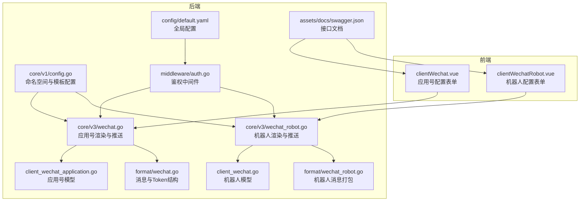
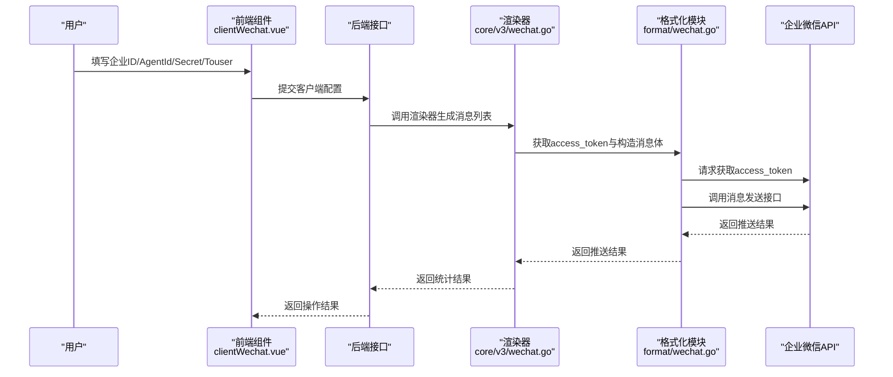
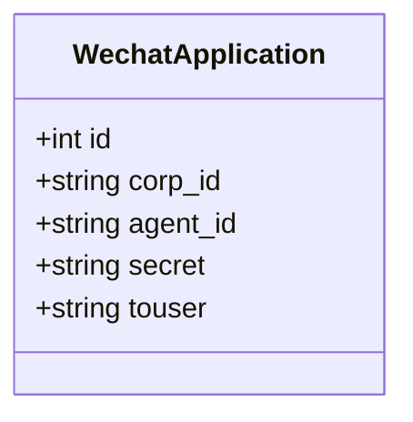
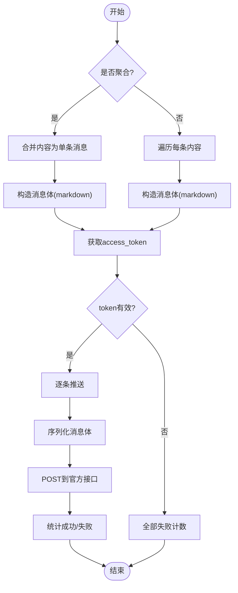
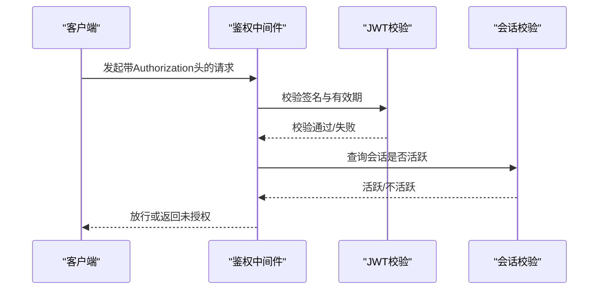
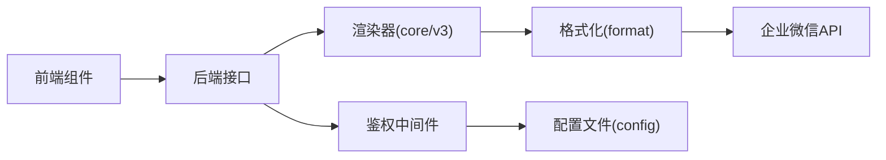

# 企业微信应用

<cite>
**本文引用的文件**
- [pkg/models/client_wechat_application.go](file://pkg/models/client_wechat_application.go)
- [pkg/services/core/v3/wechat.go](file://pkg/services/core/v3/wechat.go)
- [pkg/services/format/wechat.go](file://pkg/services/format/wechat.go)
- [vue/src/components/clients/clientWechat.vue](file://vue/src/components/clients/clientWechat.vue)
- [pkg/services/core/v3/wechat_robot.go](file://pkg/services/core/v3/wechat_robot.go)
- [vue/src/components/clients/clientWechatRobot.vue](file://vue/src/components/clients/clientWechatRobot.vue)
- [pkg/services/format/wechat_robot.go](file://pkg/services/format/wechat_robot.go)
- [pkg/services/core/v1/config.go](file://pkg/services/core/v1/config.go)
- [pkg/middleware/auth.go](file://pkg/middleware/auth.go)
- [config/default.yaml](file://config/default.yaml)
- [assets/docs/swagger.json](file://assets/docs/swagger.json)
</cite>

## 目录
1. [简介](#简介)
2. [项目结构](#项目结构)
3. [核心组件](#核心组件)
4. [架构总览](#架构总览)
5. [详细组件分析](#详细组件分析)
6. [依赖分析](#依赖分析)
7. [性能考虑](#性能考虑)
8. [故障排查指南](#故障排查指南)
9. [结论](#结论)
10. [附录](#附录)

## 简介
本文件面向企业微信应用客户端的使用者与维护者，系统性说明如何在本项目中配置与使用“企业微信应用号”能力，涵盖以下主题：
- 企业微信应用的配置项：企业 ID（CorpId）、应用 ID（AgentId）、应用密钥（Secret）、接收用户（Touser）等
- 推送机制与权限范围：应用推送与机器人推送的区别、适用场景与限制
- 完整配置示例：单应用与多应用配置思路
- 权限控制与安全机制：鉴权中间件、JWT 密钥、会话校验
- 管理后台配置步骤、API 限制与最佳实践建议

## 项目结构
围绕企业微信应用号与群机器人的实现，前端与后端的关键文件分布如下：
- 前端：Vue 组件负责表单录入与展示，分别对应“企业微信应用号”和“企业微信群机器人”
- 后端：模型定义、消息渲染、推送执行、鉴权中间件与配置文件

图表来源
- [vue/src/components/clients/clientWechat.vue:1-203](file://vue/src/components/clients/clientWechat.vue#L1-L203)
- [vue/src/components/clients/clientWechatRobot.vue:1-227](file://vue/src/components/clients/clientWechatRobot.vue#L1-L227)
- [pkg/models/client_wechat_application.go:1-24](file://pkg/models/client_wechat_application.go#L1-L24)
- [pkg/models/client_wechat.go:1-24](file://pkg/models/client_wechat.go#L1-L24)
- [pkg/services/format/wechat.go:1-115](file://pkg/services/format/wechat.go#L1-L115)
- [pkg/services/format/wechat_robot.go:1-22](file://pkg/services/format/wechat_robot.go#L1-L22)
- [pkg/services/core/v3/wechat.go:1-121](file://pkg/services/core/v3/wechat.go#L1-L121)
- [pkg/services/core/v3/wechat_robot.go:1-40](file://pkg/services/core/v3/wechat_robot.go#L1-L40)
- [pkg/services/core/v1/config.go:1-79](file://pkg/services/core/v1/config.go#L1-L79)
- [pkg/middleware/auth.go:1-62](file://pkg/middleware/auth.go#L1-L62)
- [config/default.yaml:1-83](file://config/default.yaml#L1-L83)
- [assets/docs/swagger.json:1-53](file://assets/docs/swagger.json#L1-L53)

章节来源
- [vue/src/components/clients/clientWechat.vue:1-203](file://vue/src/components/clients/clientWechat.vue#L1-L203)
- [vue/src/components/clients/clientWechatRobot.vue:1-227](file://vue/src/components/clients/clientWechatRobot.vue#L1-L227)
- [pkg/models/client_wechat_application.go:1-24](file://pkg/models/client_wechat_application.go#L1-L24)
- [pkg/models/client_wechat.go:1-24](file://pkg/models/client_wechat.go#L1-L24)
- [pkg/services/format/wechat.go:1-115](file://pkg/services/format/wechat.go#L1-L115)
- [pkg/services/format/wechat_robot.go:1-22](file://pkg/services/format/wechat_robot.go#L1-L22)
- [pkg/services/core/v3/wechat.go:1-121](file://pkg/services/core/v3/wechat.go#L1-L121)
- [pkg/services/core/v3/wechat_robot.go:1-40](file://pkg/services/core/v3/wechat_robot.go#L1-L40)
- [pkg/services/core/v1/config.go:1-79](file://pkg/services/core/v1/config.go#L1-L79)
- [pkg/middleware/auth.go:1-62](file://pkg/middleware/auth.go#L1-L62)
- [config/default.yaml:1-83](file://config/default.yaml#L1-L83)
- [assets/docs/swagger.json:1-53](file://assets/docs/swagger.json#L1-L53)

## 核心组件
- 应用号模型：用于持久化企业微信应用号的配置项（企业 ID、应用 ID、应用密钥、接收用户）
- 消息格式与 Token 结构：统一应用号与机器人的消息体与访问令牌结构
- 渲染器与推送器：将业务内容渲染为符合企业微信 API 的消息体，并调用官方接口进行推送
- 前端表单组件：提供可视化配置入口，支持创建、修改、删除与查看
- 鉴权中间件：基于 JWT 的请求拦截与会话校验
- 配置文件：全局运行参数、日志、数据库与鉴权密钥等

章节来源
- [pkg/models/client_wechat_application.go:8-19](file://pkg/models/client_wechat_application.go#L8-L19)
- [pkg/services/format/wechat.go:13-39](file://pkg/services/format/wechat.go#L13-L39)
- [pkg/services/core/v3/wechat.go:17-53](file://pkg/services/core/v3/wechat.go#L17-L53)
- [vue/src/components/clients/clientWechat.vue:45-69](file://vue/src/components/clients/clientWechat.vue#L45-L69)
- [pkg/middleware/auth.go:12-61](file://pkg/middleware/auth.go#L12-L61)
- [config/default.yaml:11-13](file://config/default.yaml#L11-L13)

## 架构总览
企业微信应用号的推送流程由前端表单收集配置，后端通过渲染器生成消息体，再通过访问令牌获取接口进行推送。

图表来源
- [vue/src/components/clients/clientWechat.vue:120-139](file://vue/src/components/clients/clientWechat.vue#L120-L139)
- [pkg/services/core/v3/wechat.go:24-91](file://pkg/services/core/v3/wechat.go#L24-L91)
- [pkg/services/format/wechat.go:42-114](file://pkg/services/format/wechat.go#L42-L114)

## 详细组件分析

### 企业微信应用号模型与表单
- 模型字段：包含企业 ID、应用 ID、应用密钥、接收用户等，用于持久化保存
- 表单字段：前端提供企业 ID、应用 AgentId、应用 Secret、接收用户（可多用户以分隔符拼接）等输入项
- 表单规则：创建时对 Secret 长度进行校验，防止过短导致不可用

图表来源
- [pkg/models/client_wechat_application.go:9-19](file://pkg/models/client_wechat_application.go#L9-L19)

章节来源
- [pkg/models/client_wechat_application.go:8-19](file://pkg/models/client_wechat_application.go#L8-L19)
- [vue/src/components/clients/clientWechat.vue:45-69](file://vue/src/components/clients/clientWechat.vue#L45-L69)
- [vue/src/components/clients/clientWechat.vue:120-139](file://vue/src/components/clients/clientWechat.vue#L120-L139)

### 企业微信应用号渲染与推送
- 渲染逻辑：支持聚合与非聚合两种模式；聚合时将多条内容合并为一条消息；非聚合时逐条渲染
- 消息体：固定消息类型为 markdown，包含接收用户、应用 ID、内容
- 访问令牌：调用官方接口获取 access_token，失败则直接终止后续推送
- 推送循环：逐条序列化消息体并调用官方消息发送接口，统计成功/失败数量

图表来源
- [pkg/services/core/v3/wechat.go:24-91](file://pkg/services/core/v3/wechat.go#L24-L91)
- [pkg/services/format/wechat.go:13-39](file://pkg/services/format/wechat.go#L13-L39)

章节来源
- [pkg/services/core/v3/wechat.go:24-91](file://pkg/services/core/v3/wechat.go#L24-L91)
- [pkg/services/format/wechat.go:42-114](file://pkg/services/format/wechat.go#L42-L114)

### 企业微信应用号与群机器人对比
- 应用号推送：需配置企业 ID、应用 ID、应用密钥与接收用户；通过官方接口发送消息，具备更强的权限与可控性
- 群机器人推送：配置多个机器人 URL，按随机策略选择发送，可规避单机器人频率限制，适合高并发场景
- 适用场景：
  - 应用号：面向内部系统、需要严格权限控制与消息加密的场景
  - 机器人：面向外部群组或临时通知，无需复杂权限，但受接口频率限制

章节来源
- [vue/src/components/clients/clientWechat.vue:45-69](file://vue/src/components/clients/clientWechat.vue#L45-L69)
- [vue/src/components/clients/clientWechatRobot.vue:50-74](file://vue/src/components/clients/clientWechatRobot.vue#L50-L74)
- [pkg/services/core/v3/wechat_robot.go:14-39](file://pkg/services/core/v3/wechat_robot.go#L14-L39)
- [pkg/services/format/wechat_robot.go:5-21](file://pkg/services/format/wechat_robot.go#L5-L21)

### 配置参数详解
- 企业 ID（CorpId）：企业唯一标识，从企业微信管理后台获取
- 应用 ID（AgentId）：应用唯一标识，从企业微信管理后台获取
- 应用密钥（Secret）：应用密钥，用于换取 access_token，需妥善保管
- 接收用户（Touser）：可填写多个用户账号，使用分隔符拼接；用于定向发送给指定成员

章节来源
- [vue/src/components/clients/clientWechat.vue:45-69](file://vue/src/components/clients/clientWechat.vue#L45-L69)
- [pkg/models/client_wechat_application.go:15-18](file://pkg/models/client_wechat_application.go#L15-L18)

### 完整配置示例
- 单应用配置：在前端表单中填写企业 ID、应用 AgentId、应用 Secret、接收用户，提交后由后端保存模型并用于后续推送
- 多应用配置：可在同一命名空间下创建多个应用号客户端，分别配置不同的 CorpId/AgentId/Secret/Touser，实现多组织或多渠道的差异化推送

章节来源
- [vue/src/components/clients/clientWechat.vue:120-139](file://vue/src/components/clients/clientWechat.vue#L120-L139)
- [pkg/models/client_wechat_application.go:8-19](file://pkg/models/client_wechat_application.go#L8-L19)

### 权限控制与安全机制
- 鉴权中间件：要求请求携带 Authorization 头，验证 JWT 签名与有效性，并检查会话是否仍处于活跃状态
- 配置密钥：鉴权密钥在配置文件中定义，生产环境必须修改为强随机字符串
- 会话校验：若令牌不在会话表中或已被标记为不活跃，则拒绝请求

图表来源
- [pkg/middleware/auth.go:12-61](file://pkg/middleware/auth.go#L12-L61)
- [config/default.yaml:11-13](file://config/default.yaml#L11-L13)

章节来源
- [pkg/middleware/auth.go:12-61](file://pkg/middleware/auth.go#L12-L61)
- [config/default.yaml:11-13](file://config/default.yaml#L11-L13)

### 管理后台配置步骤与最佳实践
- 管理后台配置步骤（基于前端组件）：
  - 打开“企业微信·应用号”配置页面，填写企业 ID、应用 AgentId、应用 Secret、接收用户
  - 提交后系统返回操作结果，可在列表中查看与修改
- API 限制与最佳实践：
  - 应用号推送：建议使用聚合模式减少调用次数，合理拆分消息体大小
  - 机器人推送：建议配置多个机器人 URL 并开启随机选择，以规避单机器人频率限制
  - 安全建议：生产环境务必修改默认 JWT 密钥，妥善保管应用密钥，定期轮换

章节来源
- [vue/src/components/clients/clientWechat.vue:120-139](file://vue/src/components/clients/clientWechat.vue#L120-L139)
- [vue/src/components/clients/clientWechatRobot.vue:127-142](file://vue/src/components/clients/clientWechatRobot.vue#L127-L142)
- [config/default.yaml:11-13](file://config/default.yaml#L11-L13)

## 依赖分析
- 前端组件依赖后端接口完成客户端的增删改查与配置展示
- 后端渲染器依赖格式化模块生成消息体与访问令牌结构
- 推送器依赖企业微信官方接口完成消息发送
- 鉴权中间件贯穿所有受保护接口，确保请求合法性

图表来源
- [vue/src/components/clients/clientWechat.vue:1-203](file://vue/src/components/clients/clientWechat.vue#L1-L203)
- [pkg/services/core/v3/wechat.go:1-121](file://pkg/services/core/v3/wechat.go#L1-L121)
- [pkg/services/format/wechat.go:1-115](file://pkg/services/format/wechat.go#L1-L115)
- [pkg/middleware/auth.go:1-62](file://pkg/middleware/auth.go#L1-L62)
- [config/default.yaml:1-83](file://config/default.yaml#L1-L83)

章节来源
- [vue/src/components/clients/clientWechat.vue:1-203](file://vue/src/components/clients/clientWechat.vue#L1-L203)
- [pkg/services/core/v3/wechat.go:1-121](file://pkg/services/core/v3/wechat.go#L1-L121)
- [pkg/services/format/wechat.go:1-115](file://pkg/services/format/wechat.go#L1-L115)
- [pkg/middleware/auth.go:1-62](file://pkg/middleware/auth.go#L1-L62)
- [config/default.yaml:1-83](file://config/default.yaml#L1-L83)

## 性能考虑
- 聚合推送：在需要发送多条内容时，优先采用聚合模式，降低接口调用次数与网络开销
- 异步与批处理：对于高频推送场景，可结合队列与批处理策略进一步优化吞吐
- 访问令牌缓存：当前实现每次推送均重新获取 access_token，建议在生产环境中引入短期缓存以减少重复请求
- 错误重试：对网络异常与第三方接口波动进行指数退避重试，避免雪崩效应

## 故障排查指南
- 访问令牌获取失败：检查企业 ID、应用 ID、应用密钥是否正确；确认网络可达与响应解析是否正常
- 消息序列化失败：检查消息体字段是否完整，尤其是消息类型与内容字段
- 推送接口异常：核对官方接口返回码与错误信息，定位具体失败原因
- 鉴权失败：确认 Authorization 头是否存在且有效，JWT 密钥是否与配置一致，会话是否仍处于活跃状态

章节来源
- [pkg/services/core/v3/wechat.go:55-91](file://pkg/services/core/v3/wechat.go#L55-L91)
- [pkg/services/format/wechat.go:42-114](file://pkg/services/format/wechat.go#L42-L114)
- [pkg/middleware/auth.go:12-61](file://pkg/middleware/auth.go#L12-L61)

## 结论
本项目提供了企业微信应用号与群机器人的完整实现路径：从前端表单配置到后端渲染与推送，再到鉴权与配置管理。通过合理的配置与最佳实践，可在保证安全性的同时实现稳定高效的推送能力。建议在生产环境中强化密钥管理、引入令牌缓存与重试策略，并根据业务场景选择应用号或机器人推送方式。

## 附录
- 接口文档：可通过 Swagger 文档查看客户端相关的增删改查接口与请求规范
- 配置文件：包含运行环境、服务监听地址、日志级别与鉴权密钥等关键参数

章节来源
- [assets/docs/swagger.json:1-53](file://assets/docs/swagger.json#L1-L53)
- [config/default.yaml:1-83](file://config/default.yaml#L1-L83)