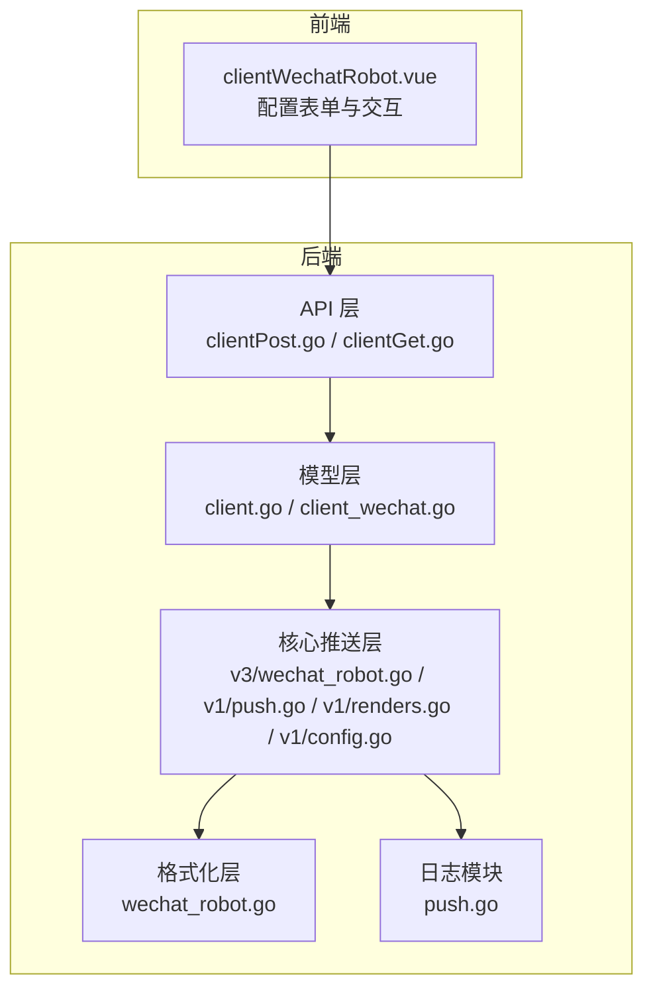
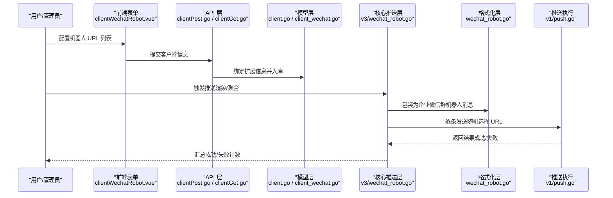
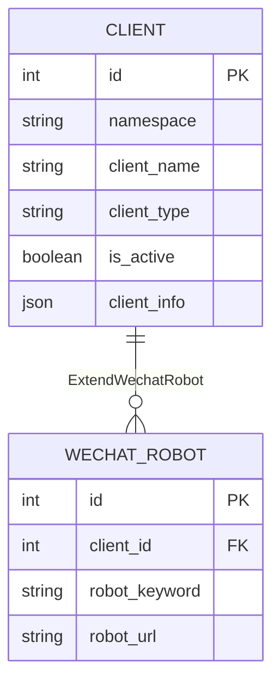
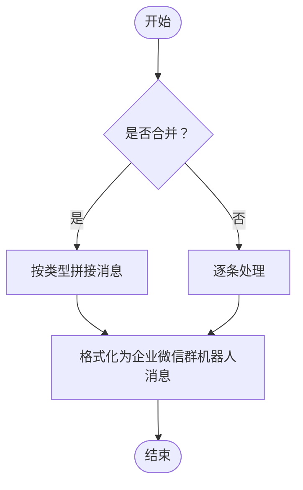
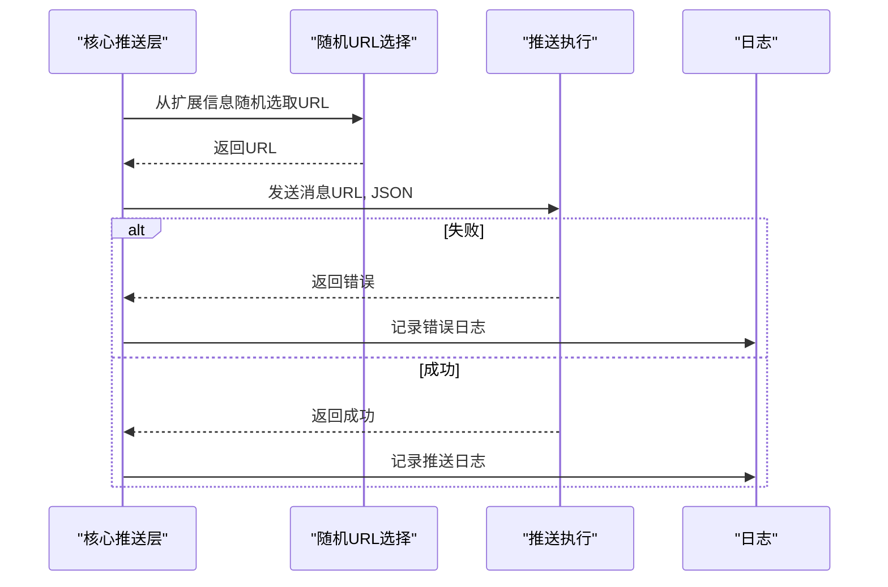
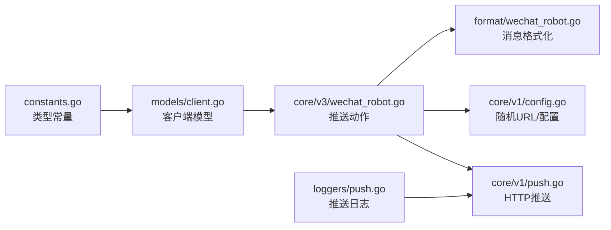

# 企业微信机器人

<cite>
**本文引用的文件**
- [pkg/models/client_wechat.go](file://pkg/models/client_wechat.go)
- [pkg/models/client.go](file://pkg/models/client.go)
- [pkg/services/format/wechat_robot.go](file://pkg/services/format/wechat_robot.go)
- [pkg/services/core/v3/wechat_robot.go](file://pkg/services/core/v3/wechat_robot.go)
- [pkg/services/core/v1/push.go](file://pkg/services/core/v1/push.go)
- [pkg/services/core/v1/config.go](file://pkg/services/core/v1/config.go)
- [pkg/services/core/v1/renders.go](file://pkg/services/core/v1/renders.go)
- [vue/src/components/clients/clientWechatRobot.vue](file://vue/src/components/clients/clientWechatRobot.vue)
- [pkg/api/client/clientPost.go](file://pkg/api/client/clientPost.go)
- [pkg/api/client/clientGet.go](file://pkg/api/client/clientGet.go)
- [pkg/utils/constants.go](file://pkg/utils/constants.go)
- [config/default.yaml](file://config/default.yaml)
- [pkg/utils/log/loggers/push.go](file://pkg/utils/log/loggers/push.go)
</cite>

## 目录
1. [简介](#简介)
2. [项目结构](#项目结构)
3. [核心组件](#核心组件)
4. [架构总览](#架构总览)
5. [组件详解](#组件详解)
6. [依赖关系分析](#依赖关系分析)
7. [性能与可靠性](#性能与可靠性)
8. [故障排查指南](#故障排查指南)
9. [结论](#结论)
10. [附录](#附录)

## 简介
本文件面向企业微信群机器人客户端的使用者与维护者，系统性说明以下内容：
- 企业微信群机器人的工作原理与配置方法（群机器人设置、机器人密钥、webhook 地址配置）
- 客户端配置参数（机器人 URL 列表、关键字匹配规则、推送优先级设置）
- 消息格式与样式支持（文本、markdown 等）
- 单机器人与多机器人配置示例
- 权限控制与安全机制
- 推送失败与网络异常处理
- 管理端配置步骤与 API 限制说明

## 项目结构
围绕企业微信群机器人能力，后端主要由模型层、格式化层、核心推送层与 API 层组成；前端提供可视化配置界面。

**图表来源**
- [vue/src/components/clients/clientWechatRobot.vue:1-227](file://vue/src/components/clients/clientWechatRobot.vue#L1-L227)
- [pkg/api/client/clientPost.go:1-50](file://pkg/api/client/clientPost.go#L1-L50)
- [pkg/api/client/clientGet.go:53-92](file://pkg/api/client/clientGet.go#L53-L92)
- [pkg/models/client.go:1-239](file://pkg/models/client.go#L1-L239)
- [pkg/models/client_wechat.go:1-24](file://pkg/models/client_wechat.go#L1-L24)
- [pkg/services/format/wechat_robot.go:1-22](file://pkg/services/format/wechat_robot.go#L1-L22)
- [pkg/services/core/v3/wechat_robot.go:1-40](file://pkg/services/core/v3/wechat_robot.go#L1-L40)
- [pkg/services/core/v1/push.go:1-58](file://pkg/services/core/v1/push.go#L1-L58)
- [pkg/services/core/v1/renders.go:1-127](file://pkg/services/core/v1/renders.go#L1-L127)
- [pkg/services/core/v1/config.go:1-79](file://pkg/services/core/v1/config.go#L1-L79)
- [pkg/utils/log/loggers/push.go:1-59](file://pkg/utils/log/loggers/push.go#L1-L59)

**章节来源**
- [vue/src/components/clients/clientWechatRobot.vue:1-227](file://vue/src/components/clients/clientWechatRobot.vue#L1-L227)
- [pkg/api/client/clientPost.go:1-50](file://pkg/api/client/clientPost.go#L1-L50)
- [pkg/api/client/clientGet.go:53-92](file://pkg/api/client/clientGet.go#L53-L92)
- [pkg/models/client.go:1-239](file://pkg/models/client.go#L1-L239)
- [pkg/models/client_wechat.go:1-24](file://pkg/models/client_wechat.go#L1-L24)
- [pkg/services/format/wechat_robot.go:1-22](file://pkg/services/format/wechat_robot.go#L1-L22)
- [pkg/services/core/v3/wechat_robot.go:1-40](file://pkg/services/core/v3/wechat_robot.go#L1-L40)
- [pkg/services/core/v1/push.go:1-58](file://pkg/services/core/v1/push.go#L1-L58)
- [pkg/services/core/v1/renders.go:1-127](file://pkg/services/core/v1/renders.go#L1-L127)
- [pkg/services/core/v1/config.go:1-79](file://pkg/services/core/v1/config.go#L1-L79)
- [pkg/utils/log/loggers/push.go:1-59](file://pkg/utils/log/loggers/push.go#L1-L59)

## 核心组件
- 客户端模型与扩展信息
  - 客户端基础模型包含通用字段与 ClientType 标识，通过 ExtendWechatRobot 承载群机器人扩展信息。
  - 群机器人扩展模型包含机器人关键字、机器人 URL 列表与随机 URL 列表等字段。
- 消息格式化
  - 将内容列表按客户端类型进行拼接与聚合，最终包装为符合企业微信群机器人接口的 JSON 结构（markdown 类型）。
- 推送执行
  - 从扩展信息中随机选取一个机器人 URL，逐条发送消息；对每次发送进行日志记录与错误统计。
- 前端配置界面
  - 支持添加/删除多个机器人 URL，提示多 URL 可规避单机器人频率限制。

**章节来源**
- [pkg/models/client.go:13-28](file://pkg/models/client.go#L13-L28)
- [pkg/models/client_wechat.go:8-19](file://pkg/models/client_wechat.go#L8-L19)
- [pkg/services/format/wechat_robot.go:5-21](file://pkg/services/format/wechat_robot.go#L5-L21)
- [pkg/services/core/v3/wechat_robot.go:14-39](file://pkg/services/core/v3/wechat_robot.go#L14-L39)
- [vue/src/components/clients/clientWechatRobot.vue:50-75](file://vue/src/components/clients/clientWechatRobot.vue#L50-L75)

## 架构总览
企业微信群机器人从“配置—渲染—推送”三个阶段完成消息投递。

**图表来源**
- [vue/src/components/clients/clientWechatRobot.vue:127-142](file://vue/src/components/clients/clientWechatRobot.vue#L127-L142)
- [pkg/api/client/clientPost.go:25-41](file://pkg/api/client/clientPost.go#L25-L41)
- [pkg/models/client.go:66-73](file://pkg/models/client.go#L66-L73)
- [pkg/services/core/v3/wechat_robot.go:14-39](file://pkg/services/core/v3/wechat_robot.go#L14-L39)
- [pkg/services/format/wechat_robot.go:5-21](file://pkg/services/format/wechat_robot.go#L5-L21)
- [pkg/services/core/v1/push.go:15-57](file://pkg/services/core/v1/push.go#L15-L57)

## 组件详解

### 数据模型与字段
- 客户端模型
  - 关键字段：namespace、client_name、client_type、is_active、client_info（json.RawMessage）、ExtendWechatRobot。
- 群机器人扩展模型
  - 关键字段：robot_keyword、robot_url、robot_url_list、robot_url_random_list。
- 字段关系与持久化
  - 创建/更新客户端时，根据 client_type 将扩展信息写入对应扩展表，并生成随机 URL 列表用于推送。

**图表来源**
- [pkg/models/client.go:13-28](file://pkg/models/client.go#L13-L28)
- [pkg/models/client_wechat.go:8-19](file://pkg/models/client_wechat.go#L8-L19)

**章节来源**
- [pkg/models/client.go:40-87](file://pkg/models/client.go#L40-L87)
- [pkg/models/client.go:122-129](file://pkg/models/client.go#L122-L129)
- [pkg/models/client_wechat.go:8-19](file://pkg/models/client_wechat.go#L8-L19)

### 消息渲染与聚合
- 聚合策略
  - 不同客户端类型采用不同的分隔符进行聚合，群机器人使用特定分隔符进行拼接。
- 渲染流程
  - 根据 isMerge 决定是否聚合；聚合后通过格式化函数包装为企业微信群机器人消息结构（markdown 类型）。

**图表来源**
- [pkg/services/core/v1/renders.go:104-126](file://pkg/services/core/v1/renders.go#L104-L126)
- [pkg/services/format/wechat_robot.go:5-21](file://pkg/services/format/wechat_robot.go#L5-L21)
- [pkg/services/core/v3/wechat_robot.go:14-27](file://pkg/services/core/v3/wechat_robot.go#L14-L27)

**章节来源**
- [pkg/services/core/v1/renders.go:104-126](file://pkg/services/core/v1/renders.go#L104-L126)
- [pkg/services/format/wechat_robot.go:5-21](file://pkg/services/format/wechat_robot.go#L5-L21)
- [pkg/services/core/v3/wechat_robot.go:14-27](file://pkg/services/core/v3/wechat_robot.go#L14-L27)

### 推送执行与随机 URL 选择
- 随机 URL 选择
  - 从扩展信息中的随机 URL 列表中随机选取一个 URL 进行发送。
- 发送流程
  - 序列化消息体为 JSON，构造 application/json 请求体，向企业微信群机器人 webhook 发送 POST 请求。
- 错误处理与日志
  - 对序列化失败、请求失败、响应读取失败等情况进行日志记录与错误返回；统计成功/失败计数。

**图表来源**
- [pkg/services/core/v3/wechat_robot.go:29-39](file://pkg/services/core/v3/wechat_robot.go#L29-L39)
- [pkg/services/core/v1/config.go:60-65](file://pkg/services/core/v1/config.go#L60-L65)
- [pkg/services/core/v1/push.go:15-57](file://pkg/services/core/v1/push.go#L15-L57)
- [pkg/utils/log/loggers/push.go:15-58](file://pkg/utils/log/loggers/push.go#L15-L58)

**章节来源**
- [pkg/services/core/v3/wechat_robot.go:29-39](file://pkg/services/core/v3/wechat_robot.go#L29-L39)
- [pkg/services/core/v1/config.go:60-65](file://pkg/services/core/v1/config.go#L60-L65)
- [pkg/services/core/v1/push.go:15-57](file://pkg/services/core/v1/push.go#L15-L57)
- [pkg/utils/log/loggers/push.go:15-58](file://pkg/utils/log/loggers/push.go#L15-L58)

### 前端配置与多 URL 支持
- 表单字段
  - 客户端名称、描述、是否激活、客户端类型（固定为 wechat_robot）、机器人 URL 列表。
- 动态增删
  - 支持动态添加/删除多个机器人 URL 输入框。
- 提示信息
  - 多 URL 可降低单机器人频率限制风险，提升重要告警的送达率。

**章节来源**
- [vue/src/components/clients/clientWechatRobot.vue:1-227](file://vue/src/components/clients/clientWechatRobot.vue#L1-L227)

### API 与持久化
- 创建客户端
  - 根据 client_type 将 client_info 解析到对应扩展模型，创建客户端与扩展信息。
- 查询客户端
  - 将扩展信息中的随机 URL 列表转换为前端展示所需的 URL 数组。

**章节来源**
- [pkg/api/client/clientPost.go:25-41](file://pkg/api/client/clientPost.go#L25-L41)
- [pkg/api/client/clientGet.go:76-85](file://pkg/api/client/clientGet.go#L76-L85)
- [pkg/models/client.go:66-73](file://pkg/models/client.go#L66-L73)
- [pkg/models/client.go:122-129](file://pkg/models/client.go#L122-L129)

## 依赖关系分析
- 类型常量
  - 客户端类型常量统一定义，保证前后端一致。
- 组件耦合
  - 核心推送层依赖格式化层与配置层；模型层负责数据持久化与扩展信息绑定；API 层负责请求解析与响应封装。

**图表来源**
- [pkg/utils/constants.go:3-8](file://pkg/utils/constants.go#L3-L8)
- [pkg/models/client.go:66-73](file://pkg/models/client.go#L66-L73)
- [pkg/services/core/v3/wechat_robot.go:1-40](file://pkg/services/core/v3/wechat_robot.go#L1-L40)
- [pkg/services/format/wechat_robot.go:1-22](file://pkg/services/format/wechat_robot.go#L1-L22)
- [pkg/services/core/v1/config.go:60-65](file://pkg/services/core/v1/config.go#L60-L65)
- [pkg/services/core/v1/push.go:1-58](file://pkg/services/core/v1/push.go#L1-L58)
- [pkg/utils/log/loggers/push.go:1-59](file://pkg/utils/log/loggers/push.go#L1-L59)

**章节来源**
- [pkg/utils/constants.go:3-8](file://pkg/utils/constants.go#L3-L8)
- [pkg/models/client.go:66-73](file://pkg/models/client.go#L66-L73)
- [pkg/services/core/v3/wechat_robot.go:1-40](file://pkg/services/core/v3/wechat_robot.go#L1-L40)
- [pkg/services/format/wechat_robot.go:1-22](file://pkg/services/format/wechat_robot.go#L1-L22)
- [pkg/services/core/v1/config.go:60-65](file://pkg/services/core/v1/config.go#L60-L65)
- [pkg/services/core/v1/push.go:1-58](file://pkg/services/core/v1/push.go#L1-L58)
- [pkg/utils/log/loggers/push.go:1-59](file://pkg/utils/log/loggers/push.go#L1-L59)

## 性能与可靠性
- 多 URL 随机选择
  - 通过扩展信息中的随机 URL 列表，避免单个 webhook 的频率限制，提高消息送达稳定性。
- 合并推送
  - 在 isMerge=true 时进行聚合，减少请求次数，提升吞吐。
- 日志与可观测性
  - 推送日志包含请求/响应体、状态码与时间戳，便于问题定位与审计。
- 网络异常处理
  - 对序列化、请求、响应读取失败进行捕获与日志记录，返回错误并计入失败计数。

**章节来源**
- [pkg/services/core/v1/config.go:60-65](file://pkg/services/core/v1/config.go#L60-L65)
- [pkg/services/core/v1/renders.go:104-126](file://pkg/services/core/v1/renders.go#L104-L126)
- [pkg/utils/log/loggers/push.go:15-58](file://pkg/utils/log/loggers/push.go#L15-L58)
- [pkg/services/core/v1/push.go:15-57](file://pkg/services/core/v1/push.go#L15-L57)

## 故障排查指南
- 常见问题
  - 机器人 URL 无效或被禁用：确认 URL 来自企业微信群机器人设置页面。
  - 频率限制导致失败：使用多 URL 配置并启用随机选择。
  - 模板渲染失败：检查模板语法与变量映射，查看日志中模板解析错误。
  - 推送失败：查看推送日志中的响应状态与响应体，定位具体错误。
- 建议排查步骤
  - 在前端确认已正确填写多个机器人 URL 并保存。
  - 查看推送日志文件，核对请求体与响应体。
  - 对单个 URL 进行独立测试，排除 URL 有效性问题。
  - 检查网络连通性与防火墙策略。

**章节来源**
- [pkg/utils/log/loggers/push.go:15-58](file://pkg/utils/log/loggers/push.go#L15-L58)
- [pkg/services/core/v1/push.go:15-57](file://pkg/services/core/v1/push.go#L15-L57)
- [vue/src/components/clients/clientWechatRobot.vue:70-75](file://vue/src/components/clients/clientWechatRobot.vue#L70-L75)

## 结论
企业微信群机器人客户端通过“配置—渲染—推送”的清晰分层，提供了稳定的消息投递能力。多 URL 随机选择与聚合推送有效缓解了频率限制与网络异常带来的影响；完善的日志记录为运维与排障提供了可靠依据。建议在生产环境中：
- 使用多个机器人 URL 并定期轮换
- 合理设置模板与变量映射，避免渲染失败
- 关注推送日志，建立告警与巡检机制

## 附录

### 企业微信群机器人配置步骤（管理端）
- 在企业微信管理端创建群机器人，获取 webhook URL
- 在前端“企业微信·群机器人”客户端中填写客户端名称与描述
- 添加多个机器人 URL（建议至少两个以上）
- 保存配置并启用客户端
- 如需验证，可在前端进行测试推送

**章节来源**
- [vue/src/components/clients/clientWechatRobot.vue:50-75](file://vue/src/components/clients/clientWechatRobot.vue#L50-L75)
- [pkg/api/client/clientPost.go:25-41](file://pkg/api/client/clientPost.go#L25-L41)

### 配置参数说明
- 客户端类型：wechat_robot（固定）
- 是否激活：true/false
- 机器人 URL 列表：多个 webhook 地址，用于随机选择
- 机器人关键字：当前群机器人实现未使用关键字字段，保留以兼容未来扩展

**章节来源**
- [vue/src/components/clients/clientWechatRobot.vue:102-112](file://vue/src/components/clients/clientWechatRobot.vue#L102-L112)
- [pkg/models/client_wechat.go:15-18](file://pkg/models/client_wechat.go#L15-L18)

### 消息格式与样式支持
- 消息类型：markdown
- 支持内容：纯文本、markdown 文本（由渲染层拼接）
- 不支持类型：图片、文件等富媒体类型（当前实现为 markdown）

**章节来源**
- [pkg/services/format/wechat_robot.go:9-18](file://pkg/services/format/wechat_robot.go#L9-L18)
- [pkg/services/core/v1/renders.go:104-126](file://pkg/services/core/v1/renders.go#L104-L126)

### API 限制说明
- 企业微信群机器人接口限制
  - 单机器人每分钟有消息发送频率限制
  - 建议配置多个机器人 URL，利用随机选择降低命中频率限制的概率
- 本项目通过扩展信息中的随机 URL 列表实现规避策略

**章节来源**
- [vue/src/components/clients/clientWechatRobot.vue:70-75](file://vue/src/components/clients/clientWechatRobot.vue#L70-L75)
- [pkg/services/core/v1/config.go:60-65](file://pkg/services/core/v1/config.go#L60-L65)

### 完整配置示例（单机器人与多机器人）
- 单机器人
  - 在“机器人 URL 列表”中仅填写一个 URL
- 多机器人
  - 在“机器人 URL 列表”中填写多个 URL，系统将随机选择其一进行推送
- 优先级设置
  - 当前实现未提供显式优先级字段；可通过 URL 数量与权重策略间接实现（例如重复 URL 或在前端管理中进行排序）

**章节来源**
- [vue/src/components/clients/clientWechatRobot.vue:66-75](file://vue/src/components/clients/clientWechatRobot.vue#L66-L75)
- [pkg/services/core/v1/config.go:60-65](file://pkg/services/core/v1/config.go#L60-L65)