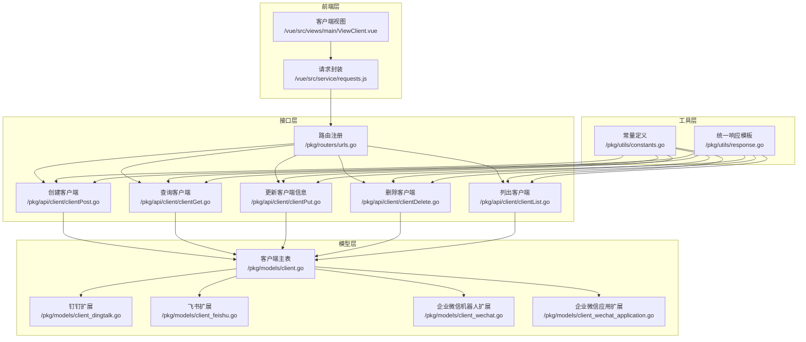
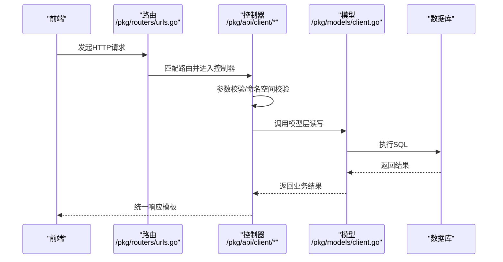
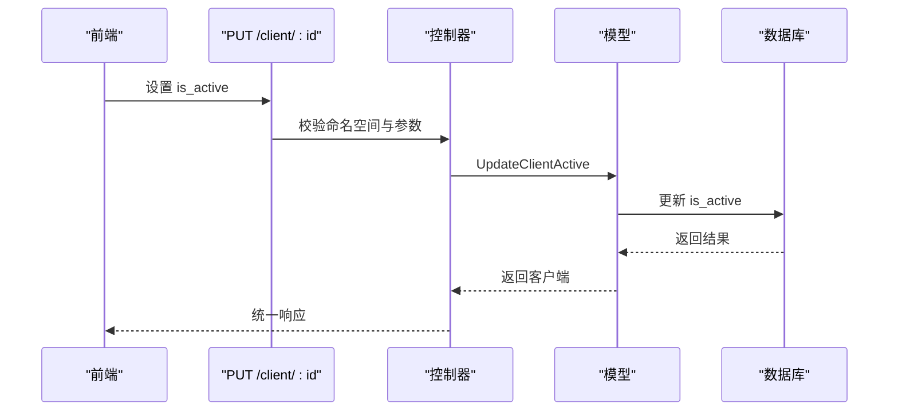
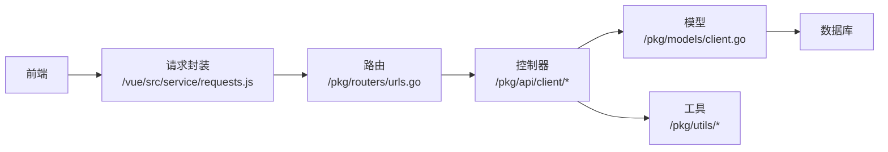

# 客户端操作指南

<cite>
**本文引用的文件**
- [clientPost.go](file://pkg/api/client/clientPost.go)
- [clientGet.go](file://pkg/api/client/clientGet.go)
- [clientPut.go](file://pkg/api/client/clientPut.go)
- [clientDelete.go](file://pkg/api/client/clientDelete.go)
- [clientList.go](file://pkg/api/client/clientList.go)
- [client.go](file://pkg/models/client.go)
- [client_dingtalk.go](file://pkg/models/client_dingtalk.go)
- [client_feishu.go](file://pkg/models/client_feishu.go)
- [client_wechat.go](file://pkg/models/client_wechat.go)
- [client_wechat_application.go](file://pkg/models/client_wechat_application.go)
- [constants.go](file://pkg/utils/constants.go)
- [response.go](file://pkg/utils/response.go)
- [urls.go](file://pkg/routers/urls.go)
- [requests.js](file://vue/src/service/requests.js)
- [ViewClient.vue](file://vue/src/views/main/ViewClient.vue)
- [response.md](file://wiki/response.md)
- [swagger.json](file://assets/docs/swagger.json)
</cite>

## 目录
1. [简介](#简介)
2. [项目结构](#项目结构)
3. [核心组件](#核心组件)
4. [架构总览](#架构总览)
5. [详细组件分析](#详细组件分析)
6. [依赖分析](#依赖分析)
7. [性能考虑](#性能考虑)
8. [故障排查指南](#故障排查指南)
9. [结论](#结论)
10. [附录](#附录)

## 简介
本指南面向后端与前端开发者，系统性说明“客户端”模块的 CRUD 操作接口与状态管理流程，覆盖以下要点：
- 创建、查询、更新、删除客户端的 API 调用方法与参数说明
- 响应格式与错误码约定
- 客户端状态管理（激活/停用）与状态切换实现
- 批量与批量删除能力与使用建议
- 配置验证、冲突处理与数据一致性保障
- 错误处理与调试技巧
- 完整的调用与响应示例路径

## 项目结构
客户端相关代码按职责分层组织：
- 接口层：HTTP 路由与控制器，负责参数解析、鉴权与调用模型层
- 模型层：数据结构与数据库访问逻辑，包含主表与各扩展表
- 工具层：统一响应模板、常量定义等
- 前端层：Vue 组件与请求封装，对接后端 API

图表来源
- [urls.go:79-85](file://pkg/routers/urls.go#L79-L85)
- [clientPost.go:14](file://pkg/api/client/clientPost.go#L14)
- [clientGet.go:30](file://pkg/api/client/clientGet.go#L30)
- [clientPut.go:16](file://pkg/api/client/clientPut.go#L16)
- [clientDelete.go:17](file://pkg/api/client/clientDelete.go#L17)
- [clientList.go:13](file://pkg/api/client/clientList.go#L13)
- [client.go:13-28](file://pkg/models/client.go#L13-L28)
- [client_dingtalk.go:21-33](file://pkg/models/client_dingtalk.go#L21-L33)
- [client_feishu.go:8-19](file://pkg/models/client_feishu.go#L8-L19)
- [client_wechat.go:9-19](file://pkg/models/client_wechat.go#L9-L19)
- [client_wechat_application.go:9-19](file://pkg/models/client_wechat_application.go#L9-L19)
- [constants.go:3-8](file://pkg/utils/constants.go#L3-L8)
- [response.go:3-9](file://pkg/utils/response.go#L3-L9)
- [requests.js:22-27](file://vue/src/service/requests.js#L22-L27)
- [ViewClient.vue:39-73](file://vue/src/views/main/ViewClient.vue#L39-L73)

章节来源
- [urls.go:79-85](file://pkg/routers/urls.go#L79-L85)
- [clientPost.go:14](file://pkg/api/client/clientPost.go#L14)
- [clientGet.go:30](file://pkg/api/client/clientGet.go#L30)
- [clientPut.go:16](file://pkg/api/client/clientPut.go#L16)
- [clientDelete.go:17](file://pkg/api/client/clientDelete.go#L17)
- [clientList.go:13](file://pkg/api/client/clientList.go#L13)

## 核心组件
- 客户端主表模型：包含命名空间、名称、描述、类型、是否激活、扩展信息字段等
- 扩展模型：钉钉、飞书、企业微信机器人、企业微信应用四类扩展表，分别存储各自特有字段与机器人 URL 列表
- 控制器：提供创建、查询、更新（信息与激活状态）、删除、列表等接口
- 响应模板：统一返回 code/msg/result/error/help 字段，约定 1 成功、0 失败

章节来源
- [client.go:13-28](file://pkg/models/client.go#L13-L28)
- [client_dingtalk.go:21-33](file://pkg/models/client_dingtalk.go#L21-L33)
- [client_feishu.go:8-19](file://pkg/models/client_feishu.go#L8-L19)
- [client_wechat.go:9-19](file://pkg/models/client_wechat.go#L9-L19)
- [client_wechat_application.go:9-19](file://pkg/models/client_wechat_application.go#L9-L19)
- [response.go:3-9](file://pkg/utils/response.go#L3-L9)

## 架构总览
客户端操作遵循“路由 -> 控制器 -> 模型 -> 数据库”的分层设计，命名空间作为强约束条件贯穿查询与变更操作。

图表来源
- [urls.go:79-85](file://pkg/routers/urls.go#L79-L85)
- [clientPost.go:15-48](file://pkg/api/client/clientPost.go#L15-L48)
- [clientGet.go:31-91](file://pkg/api/client/clientGet.go#L31-L91)
- [clientPut.go:17-109](file://pkg/api/client/clientPut.go#L17-L109)
- [clientDelete.go:18-38](file://pkg/api/client/clientDelete.go#L18-L38)
- [clientList.go:14-21](file://pkg/api/client/clientList.go#L14-L21)
- [client.go:40-86](file://pkg/models/client.go#L40-L86)

## 详细组件分析

### 创建客户端（POST /api/v1/:namespace/client）
- 功能：在指定命名空间下创建一个新的客户端，并根据客户端类型写入对应的扩展表
- 请求参数
  - 路径参数：namespace（命名空间）
  - 请求体：包含客户端基础字段与 client_info（JSON），client_type 决定扩展类型
  - 支持类型：dingtalk、feishu、wechat_robot、wechat
- 响应
  - 成功：返回统一响应模板，result 为新建客户端对象
  - 失败：返回统一响应模板，code=0，包含错误信息
- 关键逻辑
  - 解析 JSON 并绑定到 Client 结构体
  - 根据 client_type 将 client_info 反序列化到对应扩展结构
  - 主表默认 is_active=false，随后写入扩展表并生成随机 URL 列表
- 错误码与提示
  - 参数错误、请求内容错误、未知 client_type、数据库错误等
- 前端调用参考
  - 路由注册：/pkg/routers/urls.go
  - 请求封装：/vue/src/service/requests.js
  - 视图交互：/vue/src/views/main/ViewClient.vue

章节来源
- [clientPost.go:14-48](file://pkg/api/client/clientPost.go#L14-L48)
- [client.go:40-86](file://pkg/models/client.go#L40-L86)
- [constants.go:3-8](file://pkg/utils/constants.go#L3-L8)
- [response.go:11-18](file://pkg/utils/response.go#L11-L18)
- [urls.go:81](file://pkg/routers/urls.go#L81)
- [requests.js:23](file://vue/src/service/requests.js#L23)
- [ViewClient.vue:68](file://vue/src/views/main/ViewClient.vue#L68)

### 查询客户端（GET /api/v1/:namespace/client/:id）
- 功能：按 ID 查询客户端详情，同时将扩展信息转换为前端可用结构
- 请求参数
  - 路径参数：namespace、id
- 响应
  - 成功：返回统一响应模板，result 中包含基础字段与 client_info（按类型展开）
  - 失败：返回统一响应模板，code=0
- 关键逻辑
  - 校验命名空间一致性
  - 根据 client_type 将扩展表中的 robot_url 拆分为 robot_url_list
- 错误码与提示
  - 参数错误、查询错误、命名空间不匹配

章节来源
- [clientGet.go:30-91](file://pkg/api/client/clientGet.go#L30-L91)
- [client.go:162-210](file://pkg/models/client.go#L162-L210)
- [response.go:20-27](file://pkg/utils/response.go#L20-L27)
- [urls.go:82](file://pkg/routers/urls.go#L82)

### 更新客户端信息（PUT /api/v1/:namespace/client-info/:id）
- 功能：更新客户端的基础信息（名称、描述、是否激活）
- 请求参数
  - 路径参数：namespace、id
  - 请求体：包含基础字段（client_name、client_description、is_active 等）
- 响应
  - 成功：返回统一响应模板
  - 失败：返回统一响应模板，code=0
- 关键逻辑
  - 校验命名空间一致性
  - 根据 client_type 更新扩展表中的关键字与 URL 列表
- 错误码与提示
  - 参数错误、请求内容错误、未知 client_type、更新失败

章节来源
- [clientPut.go:16-74](file://pkg/api/client/clientPut.go#L16-L74)
- [client.go:89-146](file://pkg/models/client.go#L89-L146)
- [response.go:20-27](file://pkg/utils/response.go#L20-L27)
- [urls.go:84](file://pkg/routers/urls.go#L84)

### 更新客户端激活状态（PUT /api/v1/:namespace/client/:id）
- 功能：切换客户端的 is_active 状态
- 请求参数
  - 路径参数：namespace、id
  - 请求体：包含 is_active 字段
- 响应
  - 成功：返回统一响应模板
  - 失败：返回统一响应模板，code=0
- 关键逻辑
  - 校验命名空间一致性
  - 仅更新 is_active 字段
- 错误码与提示
  - 参数错误、请求内容错误、查询失败、更新失败

章节来源
- [clientPut.go:77-109](file://pkg/api/client/clientPut.go#L77-L109)
- [client.go:155-159](file://pkg/models/client.go#L155-L159)
- [response.go:20-27](file://pkg/utils/response.go#L20-L27)
- [urls.go:83](file://pkg/routers/urls.go#L83)

### 删除客户端（DELETE /api/v1/:namespace/client/:id）
- 功能：删除指定 ID 的客户端及其扩展记录
- 请求参数
  - 路径参数：namespace、id
- 响应
  - 成功：返回统一响应模板，result 包含受影响行数
  - 失败：返回统一响应模板，code=0
- 关键逻辑
  - 校验命名空间一致性
  - 删除主表与扩展表记录
- 错误码与提示
  - 参数错误、查询失败、删除失败

章节来源
- [clientDelete.go:17-38](file://pkg/api/client/clientDelete.go#L17-L38)
- [client.go:149-153](file://pkg/models/client.go#L149-L153)
- [response.go:20-27](file://pkg/utils/response.go#L20-L27)
- [urls.go:85](file://pkg/routers/urls.go#L85)

### 列出客户端（GET /api/v1/:namespace/client）
- 功能：获取指定命名空间下的所有客户端
- 请求参数
  - 路径参数：namespace
- 响应
  - 成功：返回统一响应模板
  - 失败：返回统一响应模板，code=0
- 关键逻辑
  - 按 ID 降序返回
- 错误码与提示
  - 查询失败

章节来源
- [clientList.go:13-21](file://pkg/api/client/clientList.go#L13-L21)
- [client.go:221-228](file://pkg/models/client.go#L221-L228)
- [response.go:20-27](file://pkg/utils/response.go#L20-L27)
- [urls.go:80](file://pkg/routers/urls.go#L80)

### 客户端状态管理与状态切换
- 激活/停用流程
  - 通过“更新激活状态”接口设置 is_active=true/false
  - 前端可通过复选框直接触发保存
- 状态切换序列

图表来源
- [clientPut.go:77-109](file://pkg/api/client/clientPut.go#L77-L109)
- [client.go:155-159](file://pkg/models/client.go#L155-L159)
- [ViewClient.vue:43-46](file://vue/src/views/main/ViewClient.vue#L43-L46)

### 批量操作与批量删除
- 当前后端未提供“批量创建/批量更新/批量删除”接口
- 建议策略
  - 前端循环调用现有接口进行批量处理
  - 对于大量数据，建议引入异步任务或后台批处理队列
  - 在前端做好并发控制与重试机制

章节来源
- [clientPost.go:14-48](file://pkg/api/client/clientPost.go#L14-L48)
- [clientPut.go:16-74](file://pkg/api/client/clientPut.go#L16-L74)
- [clientDelete.go:17-38](file://pkg/api/client/clientDelete.go#L17-L38)

### 数据模型与字段说明
- 客户端主表字段
  - id、namespace、client_name、client_description、client_type、is_active、client_info（JSON）
- 扩展表字段
  - 钉钉：robot_keyword、robot_url、at_all、at_mobiles、robot_url_list、robot_url_random_list
  - 飞书：robot_keyword、title_color、robot_url、robot_url_list
  - 企业微信机器人：robot_keyword、robot_url、robot_url_list
  - 企业微信应用：corp_id、agent_id、secret、touser
- URL 列表处理
  - 前端传入 robot_url_list，后端生成 robot_url_random_list 并合并为 robot_url（换行分隔）

章节来源
- [client.go:13-28](file://pkg/models/client.go#L13-L28)
- [client_dingtalk.go:21-33](file://pkg/models/client_dingtalk.go#L21-L33)
- [client_feishu.go:8-19](file://pkg/models/client_feishu.go#L8-L19)
- [client_wechat.go:9-19](file://pkg/models/client_wechat.go#L9-L19)
- [client_wechat_application.go:9-19](file://pkg/models/client_wechat_application.go#L9-L19)

## 依赖分析
- 控制器依赖模型层与工具层
- 模型层依赖数据库连接与常量定义
- 前端通过请求封装对接后端路由

图表来源
- [clientPost.go:14-48](file://pkg/api/client/clientPost.go#L14-L48)
- [clientGet.go:30-91](file://pkg/api/client/clientGet.go#L30-L91)
- [clientPut.go:16-109](file://pkg/api/client/clientPut.go#L16-L109)
- [clientDelete.go:17-38](file://pkg/api/client/clientDelete.go#L17-L38)
- [clientList.go:13-21](file://pkg/api/client/clientList.go#L13-L21)
- [client.go:40-86](file://pkg/models/client.go#L40-L86)
- [constants.go:3-8](file://pkg/utils/constants.go#L3-L8)
- [response.go:3-9](file://pkg/utils/response.go#L3-L9)
- [requests.js:22-27](file://vue/src/service/requests.js#L22-L27)
- [urls.go:79-85](file://pkg/routers/urls.go#L79-L85)

章节来源
- [urls.go:79-85](file://pkg/routers/urls.go#L79-L85)
- [client.go:40-86](file://pkg/models/client.go#L40-L86)
- [constants.go:3-8](file://pkg/utils/constants.go#L3-L8)
- [response.go:3-9](file://pkg/utils/response.go#L3-L9)
- [requests.js:22-27](file://vue/src/service/requests.js#L22-L27)

## 性能考虑
- 查询优化
  - 列表接口按 id 降序，适合分页场景
  - 查询详情时按 client_type 分支读取扩展表，避免全表扫描
- 写入优化
  - 扩展表写入与主表写入分离，减少锁竞争
  - URL 列表生成与合并在服务端完成，降低前端复杂度
- 并发与一致性
  - 使用事务包裹主表与扩展表写入（建议在模型层增加事务封装）
  - 命名空间强校验避免跨命名空间数据污染

## 故障排查指南
- 常见错误与定位
  - 参数错误：检查路径参数与请求体格式
  - 命名空间不匹配：确认 namespace 是否正确传递
  - 未知 client_type：核对 client_type 常量
  - 数据库错误：查看模型层返回的错误并结合日志
- 统一响应模板
  - 成功：code=1，result 为业务数据
  - 失败：code=0，error 为错误详情，help 指向文档
- 文档与示例
  - 响应约定与示例：/wiki/response.md
  - Swagger 文档：/assets/docs/swagger.json

章节来源
- [response.go:11-18](file://pkg/utils/response.go#L11-L18)
- [response.go:20-27](file://pkg/utils/response.go#L20-L27)
- [response.md:1-43](file://wiki/response.md#L1-L43)
- [swagger.json:6-53](file://assets/docs/swagger.json#L6-L53)

## 结论
本指南梳理了客户端模块的完整 CRUD 流程与状态管理机制，明确了接口规范、数据模型与前后端协作方式。建议在生产环境中进一步完善批量操作、事务一致性与错误恢复机制，以提升系统的稳定性与可维护性。

## 附录

### API 调用与响应示例（路径）
- 创建客户端
  - 请求：POST /api/v1/{namespace}/client
  - 示例：/pkg/api/client/clientPost.go
  - 响应：/pkg/utils/response.go
- 查询客户端
  - 请求：GET /api/v1/{namespace}/client/{id}
  - 示例：/pkg/api/client/clientGet.go
  - 响应：/pkg/utils/response.go
- 更新客户端信息
  - 请求：PUT /api/v1/{namespace}/client-info/{id}
  - 示例：/pkg/api/client/clientPut.go
  - 响应：/pkg/utils/response.go
- 更新激活状态
  - 请求：PUT /api/v1/{namespace}/client/{id}
  - 示例：/pkg/api/client/clientPut.go
  - 响应：/pkg/utils/response.go
- 删除客户端
  - 请求：DELETE /api/v1/{namespace}/client/{id}
  - 示例：/pkg/api/client/clientDelete.go
  - 响应：/pkg/utils/response.go
- 列出客户端
  - 请求：GET /api/v1/{namespace}/client
  - 示例：/pkg/api/client/clientList.go
  - 响应：/pkg/utils/response.go

章节来源
- [clientPost.go:14-48](file://pkg/api/client/clientPost.go#L14-L48)
- [clientGet.go:30-91](file://pkg/api/client/clientGet.go#L30-L91)
- [clientPut.go:16-109](file://pkg/api/client/clientPut.go#L16-L109)
- [clientDelete.go:17-38](file://pkg/api/client/clientDelete.go#L17-L38)
- [clientList.go:13-21](file://pkg/api/client/clientList.go#L13-L21)
- [response.go:11-18](file://pkg/utils/response.go#L11-L18)
- [response.go:20-27](file://pkg/utils/response.go#L20-L27)