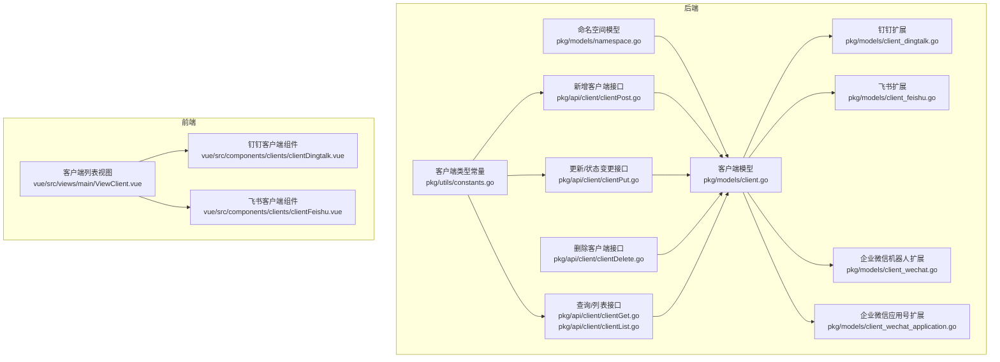
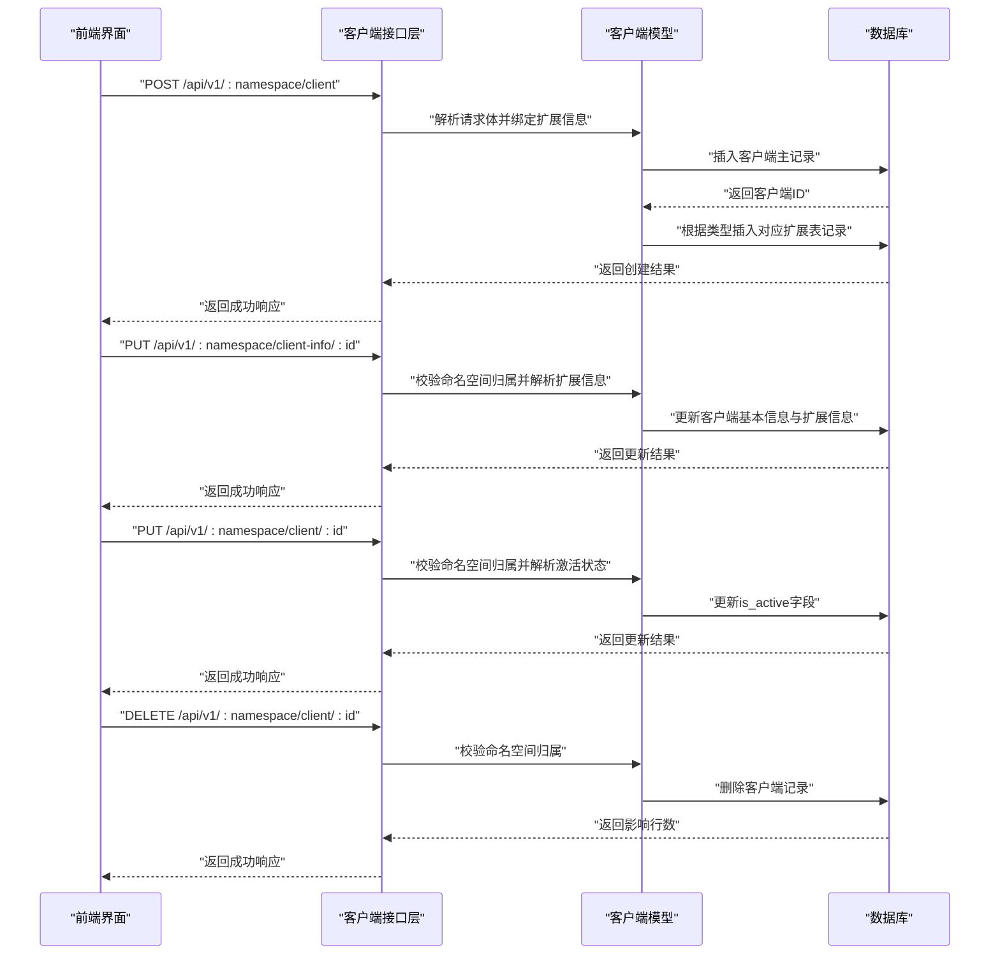
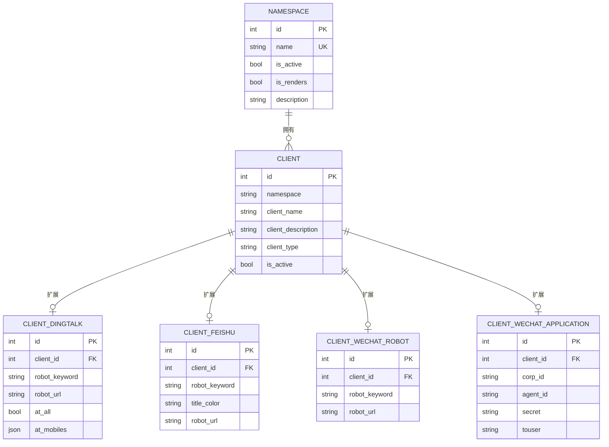
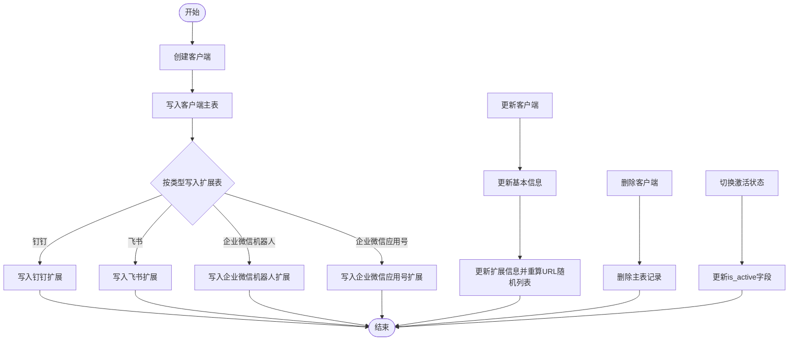
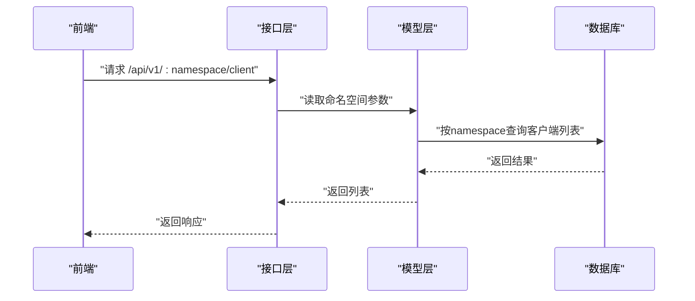
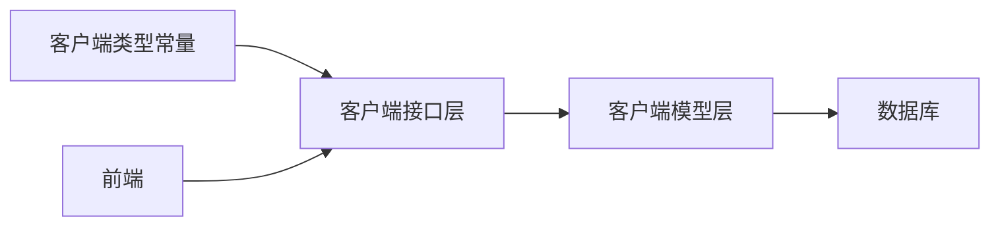

# 客户端概述

<cite>
**本文引用的文件**
- [pkg/models/client.go](file://pkg/models/client.go)
- [pkg/models/namespace.go](file://pkg/models/namespace.go)
- [pkg/api/client/clientPost.go](file://pkg/api/client/clientPost.go)
- [pkg/api/client/clientPut.go](file://pkg/api/client/clientPut.go)
- [pkg/api/client/clientDelete.go](file://pkg/api/client/clientDelete.go)
- [pkg/api/client/clientGet.go](file://pkg/api/client/clientGet.go)
- [pkg/api/client/clientList.go](file://pkg/api/client/clientList.go)
- [pkg/models/client_dingtalk.go](file://pkg/models/client_dingtalk.go)
- [pkg/models/client_feishu.go](file://pkg/models/client_feishu.go)
- [pkg/models/client_wechat.go](file://pkg/models/client_wechat.go)
- [pkg/models/client_wechat_application.go](file://pkg/models/client_wechat_application.go)
- [pkg/utils/constants.go](file://pkg/utils/constants.go)
- [vue/src/views/main/ViewClient.vue](file://vue/src/views/main/ViewClient.vue)
- [vue/src/components/clients/clientDingtalk.vue](file://vue/src/components/clients/clientDingtalk.vue)
- [vue/src/components/clients/clientFeishu.vue](file://vue/src/components/clients/clientFeishu.vue)
</cite>

## 目录
1. [简介](#简介)
2. [项目结构](#项目结构)
3. [核心组件](#核心组件)
4. [架构总览](#架构总览)
5. [详细组件分析](#详细组件分析)
6. [依赖分析](#依赖分析)
7. [性能考虑](#性能考虑)
8. [故障排查指南](#故障排查指南)
9. [结论](#结论)
10. [附录](#附录)

## 简介
本章节面向“客户端管理”的使用者与维护者，系统性阐述客户端作为消息推送渠道的核心概念与工作机制。客户端是消息推送系统中的“出口”，负责将模板化或格式化的消息推送到外部平台（如钉钉、飞书、企业微信机器人或应用号）。每个客户端都隶属于一个命名空间（Namespace），用于实现多租户隔离与资源边界划分。本文将从客户端基本属性、与命名空间的关系、生命周期管理、通用操作流程与最佳实践等方面进行深入说明。

## 项目结构
客户端管理涉及后端模型与接口、前端视图与组件，以及常量定义。整体结构围绕“命名空间”与“客户端”两条主线展开，并按类型拆分具体扩展信息表。

图表来源
- [pkg/models/namespace.go:12-26](file://pkg/models/namespace.go#L12-L26)
- [pkg/models/client.go:13-38](file://pkg/models/client.go#L13-L38)
- [pkg/models/client_dingtalk.go:21-37](file://pkg/models/client_dingtalk.go#L21-L37)
- [pkg/models/client_feishu.go:8-23](file://pkg/models/client_feishu.go#L8-L23)
- [pkg/models/client_wechat.go:8-23](file://pkg/models/client_wechat.go#L8-L23)
- [pkg/models/client_wechat_application.go:8-23](file://pkg/models/client_wechat_application.go#L8-L23)
- [pkg/api/client/clientPost.go:11-49](file://pkg/api/client/clientPost.go#L11-L49)
- [pkg/api/client/clientPut.go:13-109](file://pkg/api/client/clientPut.go#L13-L109)
- [pkg/api/client/clientDelete.go:14-39](file://pkg/api/client/clientDelete.go#L14-L39)
- [pkg/api/client/clientGet.go:27-92](file://pkg/api/client/clientGet.go#L27-L92)
- [pkg/api/client/clientList.go:10-22](file://pkg/api/client/clientList.go#L10-L22)
- [pkg/utils/constants.go:3-8](file://pkg/utils/constants.go#L3-L8)
- [vue/src/views/main/ViewClient.vue:1-266](file://vue/src/views/main/ViewClient.vue#L1-L266)
- [vue/src/components/clients/clientDingtalk.vue:1-240](file://vue/src/components/clients/clientDingtalk.vue#L1-L240)
- [vue/src/components/clients/clientFeishu.vue:1-278](file://vue/src/components/clients/clientFeishu.vue#L1-L278)

章节来源
- [pkg/models/client.go:13-38](file://pkg/models/client.go#L13-L38)
- [pkg/models/namespace.go:12-26](file://pkg/models/namespace.go#L12-L26)
- [pkg/utils/constants.go:3-8](file://pkg/utils/constants.go#L3-L8)

## 核心组件
- 命名空间（Namespace）
  - 作用：作为“通道”或“租户”的抽象，承载一组客户端与模板，实现资源隔离与权限边界。
  - 关键字段：名称、是否激活、是否启用渲染模式、描述等。
- 客户端（Client）
  - 作用：消息推送的出口，绑定到某个命名空间，携带类型与扩展信息。
  - 关键字段：命名空间标识、客户端名称、描述、类型、是否激活、扩展信息等。
- 客户端扩展（按类型）
  - 钉钉扩展：机器人关键字、机器人URL列表及随机化存储、@相关配置等。
  - 飞书扩展：机器人关键字、标题颜色、机器人URL列表等。
  - 企业微信机器人扩展：机器人关键字、机器人URL列表等。
  - 企业微信应用号扩展：企业ID、应用AgentID、Secret、默认接收人等。

章节来源
- [pkg/models/namespace.go:12-26](file://pkg/models/namespace.go#L12-L26)
- [pkg/models/client.go:13-28](file://pkg/models/client.go#L13-L28)
- [pkg/models/client_dingtalk.go:21-37](file://pkg/models/client_dingtalk.go#L21-L37)
- [pkg/models/client_feishu.go:8-23](file://pkg/models/client_feishu.go#L8-L23)
- [pkg/models/client_wechat.go:8-23](file://pkg/models/client_wechat.go#L8-L23)
- [pkg/models/client_wechat_application.go:8-23](file://pkg/models/client_wechat_application.go#L8-L23)

## 架构总览
客户端管理采用前后端分离架构：
- 前端负责展示与交互（列表、新建/编辑、删除、状态切换）。
- 后端提供REST接口，完成客户端的增删改查与状态变更，并与数据库交互。
- 客户端与命名空间通过外键/字段关联，确保同一命名空间内的资源隔离。

图表来源
- [pkg/api/client/clientPost.go:11-49](file://pkg/api/client/clientPost.go#L11-L49)
- [pkg/api/client/clientPut.go:13-109](file://pkg/api/client/clientPut.go#L13-L109)
- [pkg/api/client/clientDelete.go:14-39](file://pkg/api/client/clientDelete.go#L14-L39)
- [pkg/models/client.go:40-87](file://pkg/models/client.go#L40-L87)
- [pkg/models/client.go:89-147](file://pkg/models/client.go#L89-L147)
- [pkg/models/client.go:149-160](file://pkg/models/client.go#L149-L160)

## 详细组件分析

### 客户端数据模型与关系
- 主模型与扩展模型通过ClientId建立一对一/一对多关系，不同类型客户端拥有独立扩展表，便于按需扩展字段与校验。
- 客户端与命名空间通过字段关联，查询时以命名空间过滤，保证多租户隔离。

图表来源
- [pkg/models/namespace.go:12-26](file://pkg/models/namespace.go#L12-L26)
- [pkg/models/client.go:13-28](file://pkg/models/client.go#L13-L28)
- [pkg/models/client_dingtalk.go:21-37](file://pkg/models/client_dingtalk.go#L21-L37)
- [pkg/models/client_feishu.go:8-23](file://pkg/models/client_feishu.go#L8-L23)
- [pkg/models/client_wechat.go:8-23](file://pkg/models/client_wechat.go#L8-L23)
- [pkg/models/client_wechat_application.go:8-23](file://pkg/models/client_wechat_application.go#L8-L23)

章节来源
- [pkg/models/client.go:13-38](file://pkg/models/client.go#L13-L38)
- [pkg/models/client_dingtalk.go:21-37](file://pkg/models/client_dingtalk.go#L21-L37)
- [pkg/models/client_feishu.go:8-23](file://pkg/models/client_feishu.go#L8-L23)
- [pkg/models/client_wechat.go:8-23](file://pkg/models/client_wechat.go#L8-L23)
- [pkg/models/client_wechat_application.go:8-23](file://pkg/models/client_wechat_application.go#L8-L23)

### 客户端生命周期管理
- 创建：后端接收请求体，绑定扩展信息，先写入客户端主表，再按类型写入对应扩展表；默认状态为未激活。
- 更新：支持更新基本信息与扩展信息；更新时会重新生成URL随机列表并持久化。
- 删除：按ID删除客户端记录，同时联动删除对应扩展记录。
- 状态切换：仅允许更新is_active字段，用于启用/禁用推送。

图表来源
- [pkg/models/client.go:40-87](file://pkg/models/client.go#L40-L87)
- [pkg/models/client.go:89-147](file://pkg/models/client.go#L89-L147)
- [pkg/models/client.go:149-160](file://pkg/models/client.go#L149-L160)

章节来源
- [pkg/models/client.go:40-87](file://pkg/models/client.go#L40-L87)
- [pkg/models/client.go:89-147](file://pkg/models/client.go#L89-L147)
- [pkg/models/client.go:149-160](file://pkg/models/client.go#L149-L160)

### 命名空间与多租户隔离
- 命名空间作为资源边界，客户端必须属于某命名空间；所有查询、更新、删除均会校验命名空间归属。
- 前端通过Store传递当前命名空间，后端在接口层读取并校验，确保跨租户数据隔离。

图表来源
- [pkg/api/client/clientList.go:10-22](file://pkg/api/client/clientList.go#L10-L22)
- [pkg/api/client/clientGet.go:27-50](file://pkg/api/client/clientGet.go#L27-L50)
- [pkg/api/client/clientPut.go:13-31](file://pkg/api/client/clientPut.go#L13-L31)
- [pkg/api/client/clientDelete.go:14-32](file://pkg/api/client/clientDelete.go#L14-L32)

章节来源
- [pkg/api/client/clientList.go:10-22](file://pkg/api/client/clientList.go#L10-L22)
- [pkg/api/client/clientGet.go:27-50](file://pkg/api/client/clientGet.go#L27-L50)
- [pkg/api/client/clientPut.go:13-31](file://pkg/api/client/clientPut.go#L13-L31)
- [pkg/api/client/clientDelete.go:14-32](file://pkg/api/client/clientDelete.go#L14-L32)

### 前端交互与最佳实践
- 列表页：展示客户端名称、描述、类型、激活状态；支持一键刷新、查看详情、删除。
- 新建/编辑：按类型加载对应组件，支持动态增删机器人URL、关键字配置、标题颜色等。
- 最佳实践：
  - 在创建时即明确客户端类型，避免后续变更导致扩展字段不匹配。
  - 多URL配置建议至少准备2个以上，以便推送时做随机轮换，规避平台频率限制。
  - 激活状态应谨慎开启，建议先在测试环境验证后再上线。
  - 删除前确认命名空间归属，避免误删他人资源。

章节来源
- [vue/src/views/main/ViewClient.vue:1-266](file://vue/src/views/main/ViewClient.vue#L1-L266)
- [vue/src/components/clients/clientDingtalk.vue:1-240](file://vue/src/components/clients/clientDingtalk.vue#L1-L240)
- [vue/src/components/clients/clientFeishu.vue:1-278](file://vue/src/components/clients/clientFeishu.vue#L1-L278)

## 依赖分析
- 类型常量：统一管理客户端类型枚举，避免魔法字符串，提升一致性与可维护性。
- 接口层依赖模型层：接口负责参数校验、命名空间归属校验与响应封装。
- 模型层依赖数据库层：负责CRUD与关联查询，按类型分支处理扩展信息。
- 前端依赖接口层：通过服务层发起HTTP请求，完成客户端全生命周期操作。

图表来源
- [pkg/utils/constants.go:3-8](file://pkg/utils/constants.go#L3-L8)
- [pkg/api/client/clientPost.go:11-49](file://pkg/api/client/clientPost.go#L11-L49)
- [pkg/models/client.go:40-87](file://pkg/models/client.go#L40-L87)

章节来源
- [pkg/utils/constants.go:3-8](file://pkg/utils/constants.go#L3-L8)
- [pkg/api/client/clientPost.go:11-49](file://pkg/api/client/clientPost.go#L11-L49)
- [pkg/models/client.go:40-87](file://pkg/models/client.go#L40-L87)

## 性能考虑
- URL随机化：将URL列表打散为随机序列，有助于均衡平台限流压力，提高消息送达可靠性。
- 扩展表拆分：按类型拆分扩展表，减少无关字段扫描，提升查询与更新效率。
- 分页与筛选：列表查询支持按命名空间过滤，避免全表扫描；建议在大数据量场景下增加索引与分页参数。

## 故障排查指南
- 参数错误
  - 现象：接口返回参数错误或请求内容错误。
  - 排查：检查客户端类型是否正确、扩展字段是否完整、命名空间参数是否一致。
- 客户端不属于当前命名空间
  - 现象：更新/删除/查询时返回归属校验失败。
  - 排查：确认前端Store中的命名空间与请求路径一致，避免跨租户误操作。
- 未知的客户端类型
  - 现象：创建/更新时提示未知类型。
  - 排查：核对客户端类型常量与前端传参，确保类型值与后端枚举一致。
- 数据库异常
  - 现象：创建/更新/删除失败。
  - 排查：查看数据库日志与事务回滚情况，确认外键约束与唯一索引冲突。

章节来源
- [pkg/api/client/clientPut.go:13-31](file://pkg/api/client/clientPut.go#L13-L31)
- [pkg/api/client/clientDelete.go:14-32](file://pkg/api/client/clientDelete.go#L14-L32)
- [pkg/models/client.go:82-84](file://pkg/models/client.go#L82-L84)

## 结论
客户端管理以“命名空间”为核心边界，结合“主表+扩展表”的设计，实现了多类型客户端的统一管理与高效推送。通过前后端协作与严格的参数校验，系统在易用性与安全性之间取得平衡。建议在生产环境中遵循“先验证、后上线”的原则，配合多URL轮换与状态开关，确保消息推送的稳定性与可靠性。

## 附录
- 客户端基本属性说明
  - 客户端名称：用于识别与展示的友好名称。
  - 客户端描述：简要说明用途或注意事项。
  - 客户端类型：枚举值，决定扩展字段与推送行为。
  - 是否激活：控制该客户端是否参与实际推送。
  - 扩展信息：按类型包含关键字、URL列表、颜色等字段。
- 常用操作流程
  - 创建：选择类型 → 填写基础信息 → 配置扩展信息 → 提交创建。
  - 更新：选择客户端 → 修改基础信息或扩展信息 → 提交更新。
  - 删除：确认归属 → 执行删除 → 校验返回结果。
  - 状态切换：勾选/取消激活 → 自动保存状态。