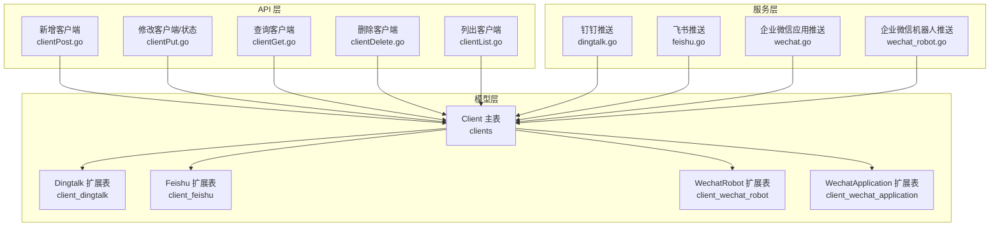
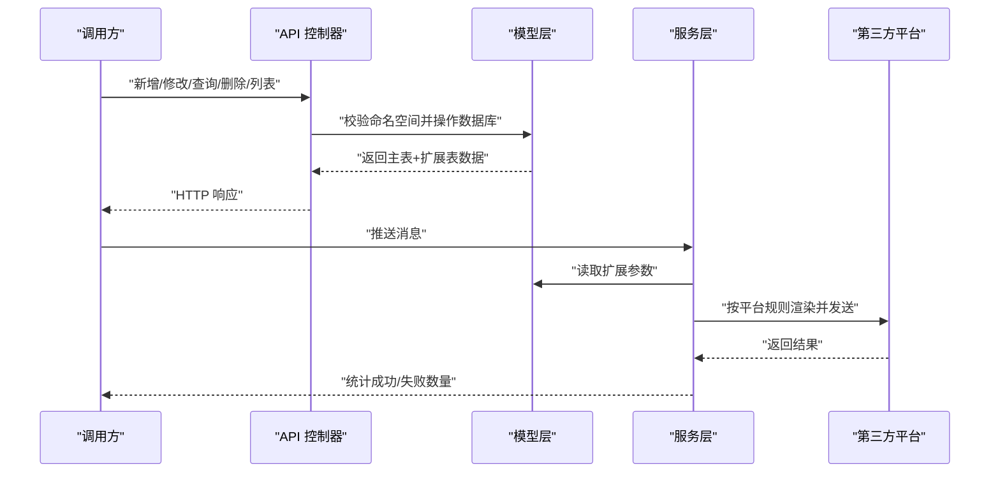
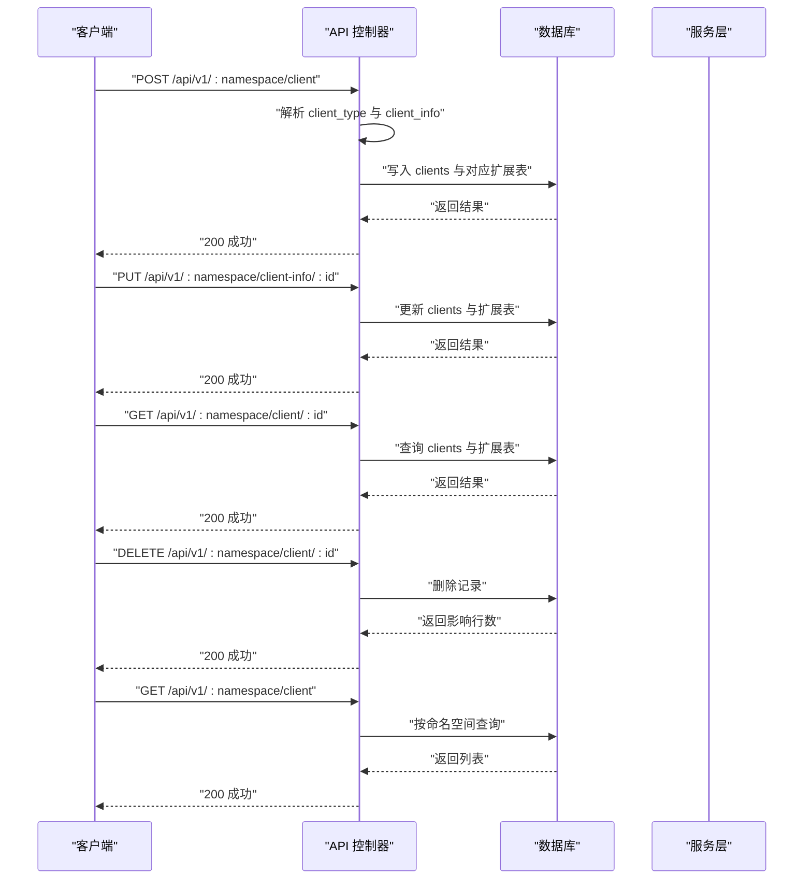
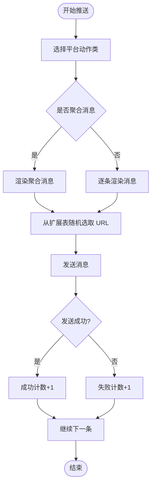
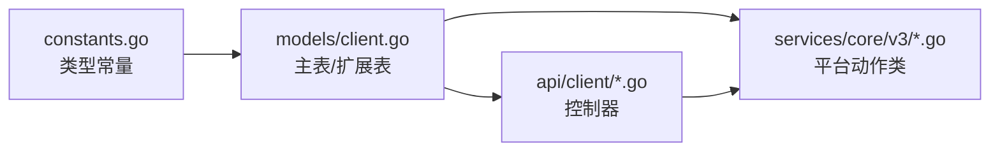

# 客户端管理

<cite>
**本文引用的文件**
- [pkg/models/client.go](file://pkg/models/client.go)
- [pkg/models/client_dingtalk.go](file://pkg/models/client_dingtalk.go)
- [pkg/models/client_feishu.go](file://pkg/models/client_feishu.go)
- [pkg/models/client_wechat.go](file://pkg/models/client_wechat.go)
- [pkg/models/client_wechat_application.go](file://pkg/models/client_wechat_application.go)
- [pkg/api/client/clientPost.go](file://pkg/api/client/clientPost.go)
- [pkg/api/client/clientPut.go](file://pkg/api/client/clientPut.go)
- [pkg/api/client/clientGet.go](file://pkg/api/client/clientGet.go)
- [pkg/api/client/clientDelete.go](file://pkg/api/client/clientDelete.go)
- [pkg/api/client/clientList.go](file://pkg/api/client/clientList.go)
- [pkg/utils/constants.go](file://pkg/utils/constants.go)
- [pkg/services/core/v3/dingtalk.go](file://pkg/services/core/v3/dingtalk.go)
- [pkg/services/core/v3/feishu.go](file://pkg/services/core/v3/feishu.go)
- [pkg/services/core/v3/wechat.go](file://pkg/services/core/v3/wechat.go)
- [pkg/services/core/v3/wechat_robot.go](file://pkg/services/core/v3/wechat_robot.go)
</cite>

## 目录
1. [简介](#简介)
2. [项目结构](#项目结构)
3. [核心组件](#核心组件)
4. [架构总览](#架构总览)
5. [详细组件分析](#详细组件分析)
6. [依赖分析](#依赖分析)
7. [性能考虑](#性能考虑)
8. [故障排查指南](#故障排查指南)
9. [结论](#结论)
10. [附录](#附录)

## 简介
本文件面向“客户端管理系统”的使用者与维护者，系统性阐述客户端作为消息推送渠道的概念与作用，覆盖钉钉机器人、飞书机器人、企业微信机器人、企业微信应用等客户端类型的特点与适用场景；详细说明各客户端的配置参数与数据模型；解释状态管理、连接验证与错误处理机制；提供配置示例与最佳实践；并说明客户端与命名空间的关联关系及多客户端并存与负载均衡策略。

## 项目结构
客户端管理相关的核心代码分布在以下层次：
- 模型层：定义客户端主表与各平台扩展表，负责持久化与查询。
- API 层：提供客户端的增删改查接口，校验命名空间归属。
- 服务层：按平台封装渲染与推送逻辑，支持聚合发送与随机 URL 负载均衡。



图表来源
- [pkg/models/client.go:13-28](file://pkg/models/client.go#L13-L28)
- [pkg/models/client_dingtalk.go:21-33](file://pkg/models/client_dingtalk.go#L21-L33)
- [pkg/models/client_feishu.go:8-19](file://pkg/models/client_feishu.go#L8-L19)
- [pkg/models/client_wechat.go:9-19](file://pkg/models/client_wechat.go#L9-L19)
- [pkg/models/client_wechat_application.go:9-19](file://pkg/models/client_wechat_application.go#L9-L19)
- [pkg/api/client/clientPost.go:11-49](file://pkg/api/client/clientPost.go#L11-L49)
- [pkg/api/client/clientPut.go:13-109](file://pkg/api/client/clientPut.go#L13-L109)
- [pkg/api/client/clientGet.go:27-92](file://pkg/api/client/clientGet.go#L27-L92)
- [pkg/api/client/clientDelete.go:14-39](file://pkg/api/client/clientDelete.go#L14-L39)
- [pkg/api/client/clientList.go:10-22](file://pkg/api/client/clientList.go#L10-L22)
- [pkg/services/core/v3/dingtalk.go:10-40](file://pkg/services/core/v3/dingtalk.go#L10-L40)
- [pkg/services/core/v3/feishu.go:10-39](file://pkg/services/core/v3/feishu.go#L10-L39)
- [pkg/services/core/v3/wechat.go:17-91](file://pkg/services/core/v3/wechat.go#L17-L91)
- [pkg/services/core/v3/wechat_robot.go:10-39](file://pkg/services/core/v3/wechat_robot.go#L10-L39)

章节来源
- [pkg/models/client.go:13-28](file://pkg/models/client.go#L13-L28)
- [pkg/api/client/clientPost.go:11-49](file://pkg/api/client/clientPost.go#L11-L49)
- [pkg/api/client/clientPut.go:13-109](file://pkg/api/client/clientPut.go#L13-L109)
- [pkg/api/client/clientGet.go:27-92](file://pkg/api/client/clientGet.go#L27-L92)
- [pkg/api/client/clientDelete.go:14-39](file://pkg/api/client/clientDelete.go#L14-L39)
- [pkg/api/client/clientList.go:10-22](file://pkg/api/client/clientList.go#L10-L22)

## 核心组件
- 客户端主表与扩展表
  - 主表包含命名空间、名称、描述、类型、启用状态与通用扩展字段；通过类型区分具体平台扩展表。
  - 平台扩展表分别存储平台特有参数（如机器人 URL 列表、关键词、应用号 CorpId/AgentId/Secret 等）。
- API 控制器
  - 新增/修改/查询/删除/列表接口均校验命名空间归属，避免跨域访问。
- 服务层
  - 钉钉/飞书/企业微信机器人：支持消息聚合与随机 URL 推送。
  - 企业微信应用：先获取 access_token，再逐条发送消息。

章节来源
- [pkg/models/client.go:13-28](file://pkg/models/client.go#L13-L28)
- [pkg/models/client_dingtalk.go:21-33](file://pkg/models/client_dingtalk.go#L21-L33)
- [pkg/models/client_feishu.go:8-19](file://pkg/models/client_feishu.go#L8-L19)
- [pkg/models/client_wechat.go:9-19](file://pkg/models/client_wechat.go#L9-L19)
- [pkg/models/client_wechat_application.go:9-19](file://pkg/models/client_wechat_application.go#L9-L19)
- [pkg/api/client/clientPost.go:11-49](file://pkg/api/client/clientPost.go#L11-L49)
- [pkg/api/client/clientPut.go:13-109](file://pkg/api/client/clientPut.go#L13-L109)
- [pkg/api/client/clientGet.go:27-92](file://pkg/api/client/clientGet.go#L27-L92)
- [pkg/api/client/clientDelete.go:14-39](file://pkg/api/client/clientDelete.go#L14-L39)
- [pkg/api/client/clientList.go:10-22](file://pkg/api/client/clientList.go#L10-L22)
- [pkg/services/core/v3/dingtalk.go:10-40](file://pkg/services/core/v3/dingtalk.go#L10-L40)
- [pkg/services/core/v3/feishu.go:10-39](file://pkg/services/core/v3/feishu.go#L10-L39)
- [pkg/services/core/v3/wechat.go:17-91](file://pkg/services/core/v3/wechat.go#L17-L91)
- [pkg/services/core/v3/wechat_robot.go:10-39](file://pkg/services/core/v3/wechat_robot.go#L10-L39)

## 架构总览
客户端管理采用“模型-接口-服务”分层设计，数据在主表与扩展表之间解耦，便于扩展新平台；服务层按平台实现渲染与推送策略，统一通过随机 URL 实现负载均衡。



图表来源
- [pkg/api/client/clientPost.go:11-49](file://pkg/api/client/clientPost.go#L11-L49)
- [pkg/api/client/clientPut.go:13-109](file://pkg/api/client/clientPut.go#L13-L109)
- [pkg/api/client/clientGet.go:27-92](file://pkg/api/client/clientGet.go#L27-L92)
- [pkg/api/client/clientDelete.go:14-39](file://pkg/api/client/clientDelete.go#L14-L39)
- [pkg/api/client/clientList.go:10-22](file://pkg/api/client/clientList.go#L10-L22)
- [pkg/models/client.go:40-87](file://pkg/models/client.go#L40-L87)
- [pkg/services/core/v3/dingtalk.go:14-40](file://pkg/services/core/v3/dingtalk.go#L14-L40)
- [pkg/services/core/v3/feishu.go:14-39](file://pkg/services/core/v3/feishu.go#L14-L39)
- [pkg/services/core/v3/wechat.go:55-91](file://pkg/services/core/v3/wechat.go#L55-L91)
- [pkg/services/core/v3/wechat_robot.go:14-39](file://pkg/services/core/v3/wechat_robot.go#L14-L39)

## 详细组件分析

### 数据模型与关系
- Client 主表
  - 关键字段：命名空间、名称、描述、类型、启用状态、扩展 JSON 字段。
  - 生命周期：新增时写入主表与对应扩展表；查询时按类型回填扩展字段。
- 平台扩展表
  - 钉钉：机器人关键词、机器人 URL（多地址）、@ 全体/手机号集合、URL 列表与随机列表。
  - 飞书：机器人关键词、标题颜色、机器人 URL 列表与随机列表。
  - 企业微信机器人：机器人关键词、机器人 URL 列表与随机列表。
  - 企业微信应用：企业 ID、应用 AgentId、应用密钥、接收人。

```mermaid
classDiagram
class Client {
+int id
+string namespace
+string client_name
+string client_description
+string client_type
+bool is_active
+json client_info
}
class Dingtalk {
+int id
+int client_id
+string robot_keyword
+string robot_url
+bool at_all
+json at_mobiles
+[]Url robot_url_list
+[]string robot_url_random_list
}
class Feishu {
+int id
+int client_id
+string robot_keyword
+string title_color
+string robot_url
+[]Url robot_url_list
+[]string robot_url_random_list
}
class WechatRobot {
+int id
+int client_id
+string robot_keyword
+string robot_url
+[]Url robot_url_list
+[]string robot_url_random_list
}
class WechatApplication {
+int id
+int client_id
+string corp_id
+string agent_id
+string secret
+string touser
}
Client --> Dingtalk : "1 : 1 扩展"
Client --> Feishu : "1 : 1 扩展"
Client --> WechatRobot : "1 : 1 扩展"
Client --> WechatApplication : "1 : 1 扩展"
```

图表来源
- [pkg/models/client.go:13-28](file://pkg/models/client.go#L13-L28)
- [pkg/models/client_dingtalk.go:21-33](file://pkg/models/client_dingtalk.go#L21-L33)
- [pkg/models/client_feishu.go:8-19](file://pkg/models/client_feishu.go#L8-L19)
- [pkg/models/client_wechat.go:9-19](file://pkg/models/client_wechat.go#L9-L19)
- [pkg/models/client_wechat_application.go:9-19](file://pkg/models/client_wechat_application.go#L9-L19)

章节来源
- [pkg/models/client.go:13-28](file://pkg/models/client.go#L13-L28)
- [pkg/models/client_dingtalk.go:21-33](file://pkg/models/client_dingtalk.go#L21-L33)
- [pkg/models/client_feishu.go:8-19](file://pkg/models/client_feishu.go#L8-L19)
- [pkg/models/client_wechat.go:9-19](file://pkg/models/client_wechat.go#L9-L19)
- [pkg/models/client_wechat_application.go:9-19](file://pkg/models/client_wechat_application.go#L9-L19)

### API 工作流
- 新增客户端
  - 校验请求体与命名空间；按类型解析扩展字段；写入主表与扩展表。
- 修改客户端信息/状态
  - 校验命名空间与存在性；按类型解析扩展字段；更新主表与扩展表。
- 查询客户端
  - 校验命名空间；按类型回填扩展字段与 URL 列表。
- 删除客户端
  - 校验命名空间与存在性；删除记录。
- 列出客户端
  - 按命名空间查询主表列表。



图表来源
- [pkg/api/client/clientPost.go:11-49](file://pkg/api/client/clientPost.go#L11-L49)
- [pkg/api/client/clientPut.go:13-109](file://pkg/api/client/clientPut.go#L13-L109)
- [pkg/api/client/clientGet.go:27-92](file://pkg/api/client/clientGet.go#L27-L92)
- [pkg/api/client/clientDelete.go:14-39](file://pkg/api/client/clientDelete.go#L14-L39)
- [pkg/api/client/clientList.go:10-22](file://pkg/api/client/clientList.go#L10-L22)
- [pkg/models/client.go:40-87](file://pkg/models/client.go#L40-L87)

章节来源
- [pkg/api/client/clientPost.go:11-49](file://pkg/api/client/clientPost.go#L11-L49)
- [pkg/api/client/clientPut.go:13-109](file://pkg/api/client/clientPut.go#L13-L109)
- [pkg/api/client/clientGet.go:27-92](file://pkg/api/client/clientGet.go#L27-L92)
- [pkg/api/client/clientDelete.go:14-39](file://pkg/api/client/clientDelete.go#L14-L39)
- [pkg/api/client/clientList.go:10-22](file://pkg/api/client/clientList.go#L10-L22)
- [pkg/models/client.go:40-87](file://pkg/models/client.go#L40-L87)

### 平台推送流程与负载均衡
- 钉钉/飞书/企业微信机器人
  - 支持消息聚合；按扩展表中的 URL 随机选择目标地址进行推送，实现负载均衡。
- 企业微信应用
  - 先获取 access_token，再逐条发送消息；失败时记录日志并计数。



图表来源
- [pkg/services/core/v3/dingtalk.go:14-40](file://pkg/services/core/v3/dingtalk.go#L14-L40)
- [pkg/services/core/v3/feishu.go:14-39](file://pkg/services/core/v3/feishu.go#L14-L39)
- [pkg/services/core/v3/wechat_robot.go:14-39](file://pkg/services/core/v3/wechat_robot.go#L14-L39)
- [pkg/services/core/v3/wechat.go:55-91](file://pkg/services/core/v3/wechat.go#L55-L91)

章节来源
- [pkg/services/core/v3/dingtalk.go:14-40](file://pkg/services/core/v3/dingtalk.go#L14-L40)
- [pkg/services/core/v3/feishu.go:14-39](file://pkg/services/core/v3/feishu.go#L14-L39)
- [pkg/services/core/v3/wechat_robot.go:14-39](file://pkg/services/core/v3/wechat_robot.go#L14-L39)
- [pkg/services/core/v3/wechat.go:55-91](file://pkg/services/core/v3/wechat.go#L55-L91)

### 客户端类型与配置要点
- 钉钉机器人
  - 关键参数：机器人关键词、机器人 URL 列表（支持多地址）、@ 全体开关、@ 手机号集合。
  - 适用场景：群内消息通知、告警聚合。
  - 最佳实践：配置多个机器人 URL 以提升可用性；合理使用关键词过滤。
- 飞书机器人
  - 关键参数：机器人关键词、标题颜色、机器人 URL 列表。
  - 适用场景：团队协作与公告推送。
  - 最佳实践：为不同频道配置独立 URL；利用标题颜色增强可读性。
- 企业微信机器人
  - 关键参数：机器人关键词、机器人 URL 列表。
  - 适用场景：企业内部通知与公告。
  - 最佳实践：多 URL 负载均衡；结合关键词做消息筛选。
- 企业微信应用
  - 关键参数：企业 ID、应用 AgentId、应用密钥、接收人。
  - 适用场景：正式工作流通知、Markdown 内容。
  - 最佳实践：使用 access_token 缓存；严格控制接收人范围。

章节来源
- [pkg/models/client_dingtalk.go:21-33](file://pkg/models/client_dingtalk.go#L21-L33)
- [pkg/models/client_feishu.go:8-19](file://pkg/models/client_feishu.go#L8-L19)
- [pkg/models/client_wechat.go:9-19](file://pkg/models/client_wechat.go#L9-L19)
- [pkg/models/client_wechat_application.go:9-19](file://pkg/models/client_wechat_application.go#L9-L19)
- [pkg/utils/constants.go:3-8](file://pkg/utils/constants.go#L3-L8)

### 状态管理、连接验证与错误处理
- 状态管理
  - 客户端启用/禁用由主表字段控制；查询激活客户端用于推送筛选。
- 连接验证
  - 企业微信应用：先请求 access_token，失败则整体失败并记录日志。
  - 机器人类：通过随机 URL 发送，单次失败不影响后续消息。
- 错误处理
  - API 层对命名空间校验、参数校验与数据库错误进行统一返回。
  - 服务层对网络请求、响应读取、JSON 解析失败进行日志记录与失败计数。

章节来源
- [pkg/models/client.go:230-238](file://pkg/models/client.go#L230-L238)
- [pkg/api/client/clientPut.go:77-109](file://pkg/api/client/clientPut.go#L77-L109)
- [pkg/services/core/v3/wechat.go:55-91](file://pkg/services/core/v3/wechat.go#L55-L91)

## 依赖分析
- 类型常量
  - 客户端类型常量集中定义，确保前后端一致。
- 模型与 API 的耦合
  - API 仅负责参数解析与命名空间校验，业务逻辑集中在模型层与服务层。
- 服务层与平台的耦合
  - 服务层按平台封装渲染与推送，降低平台变更对上层的影响。



图表来源
- [pkg/utils/constants.go:3-8](file://pkg/utils/constants.go#L3-L8)
- [pkg/models/client.go:13-28](file://pkg/models/client.go#L13-L28)
- [pkg/api/client/clientPost.go:11-49](file://pkg/api/client/clientPost.go#L11-L49)
- [pkg/api/client/clientPut.go:13-109](file://pkg/api/client/clientPut.go#L13-L109)
- [pkg/services/core/v3/dingtalk.go:10-40](file://pkg/services/core/v3/dingtalk.go#L10-L40)
- [pkg/services/core/v3/feishu.go:10-39](file://pkg/services/core/v3/feishu.go#L10-L39)
- [pkg/services/core/v3/wechat.go:17-91](file://pkg/services/core/v3/wechat.go#L17-L91)
- [pkg/services/core/v3/wechat_robot.go:10-39](file://pkg/services/core/v3/wechat_robot.go#L10-L39)

章节来源
- [pkg/utils/constants.go:3-8](file://pkg/utils/constants.go#L3-L8)
- [pkg/models/client.go:13-28](file://pkg/models/client.go#L13-L28)
- [pkg/api/client/clientPost.go:11-49](file://pkg/api/client/clientPost.go#L11-L49)
- [pkg/api/client/clientPut.go:13-109](file://pkg/api/client/clientPut.go#L13-L109)
- [pkg/services/core/v3/dingtalk.go:10-40](file://pkg/services/core/v3/dingtalk.go#L10-L40)
- [pkg/services/core/v3/feishu.go:10-39](file://pkg/services/core/v3/feishu.go#L10-L39)
- [pkg/services/core/v3/wechat.go:17-91](file://pkg/services/core/v3/wechat.go#L17-L91)
- [pkg/services/core/v3/wechat_robot.go:10-39](file://pkg/services/core/v3/wechat_robot.go#L10-L39)

## 性能考虑
- 负载均衡
  - 机器人类客户端通过扩展表中的 URL 列表进行随机选择，分散请求压力。
- 消息聚合
  - 支持将多条消息合并为一条，减少网络往返与平台限流风险。
- 日志与可观测性
  - 服务层对关键错误进行日志记录，便于定位问题与统计失败率。

章节来源
- [pkg/services/core/v3/dingtalk.go:14-40](file://pkg/services/core/v3/dingtalk.go#L14-L40)
- [pkg/services/core/v3/feishu.go:14-39](file://pkg/services/core/v3/feishu.go#L14-L39)
- [pkg/services/core/v3/wechat_robot.go:14-39](file://pkg/services/core/v3/wechat_robot.go#L14-L39)
- [pkg/services/core/v3/wechat.go:55-91](file://pkg/services/core/v3/wechat.go#L55-L91)

## 故障排查指南
- 命名空间不匹配
  - 现象：返回参数错误。
  - 处理：确认请求路径中的命名空间与客户端所属命名空间一致。
- 参数解析失败
  - 现象：新增/修改接口返回请求内容错误。
  - 处理：检查 client_type 与 client_info 的 JSON 结构是否正确。
- 访问令牌获取失败（企业微信应用）
  - 现象：整体推送失败，日志记录错误。
  - 处理：核对企业 ID、应用 AgentId、应用密钥；检查网络连通性。
- URL 随机选择导致部分失败
  - 现象：个别消息发送失败。
  - 处理：检查扩展表中的 URL 列表有效性；增加备用 URL。

章节来源
- [pkg/api/client/clientPut.go:17-31](file://pkg/api/client/clientPut.go#L17-L31)
- [pkg/api/client/clientGet.go:37-50](file://pkg/api/client/clientGet.go#L37-L50)
- [pkg/services/core/v3/wechat.go:55-91](file://pkg/services/core/v3/wechat.go#L55-L91)

## 结论
本系统通过清晰的模型分层与平台化服务封装，实现了对多种消息推送渠道的统一管理。客户端与命名空间的强绑定保证了资源隔离，扩展表的设计便于未来扩展更多平台。通过 URL 随机与消息聚合策略，系统在可用性与性能方面具备良好表现。

## 附录
- 客户端与命名空间关联
  - 所有客户端均绑定命名空间，API 层在新增、修改、查询、删除时均进行校验。
- 多客户端并存与负载均衡
  - 在同一命名空间下可并存多种类型的客户端；机器人类通过扩展表中的 URL 列表实现负载均衡。

章节来源
- [pkg/models/client.go:230-238](file://pkg/models/client.go#L230-L238)
- [pkg/api/client/clientPost.go:22-23](file://pkg/api/client/clientPost.go#L22-L23)
- [pkg/api/client/clientPut.go:23-31](file://pkg/api/client/clientPut.go#L23-L31)
- [pkg/api/client/clientGet.go:47-50](file://pkg/api/client/clientGet.go#L47-L50)
- [pkg/api/client/clientDelete.go:24-32](file://pkg/api/client/clientDelete.go#L24-L32)
- [pkg/services/core/v3/dingtalk.go:30-38](file://pkg/services/core/v3/dingtalk.go#L30-L38)
- [pkg/services/core/v3/feishu.go:29-37](file://pkg/services/core/v3/feishu.go#L29-L37)
- [pkg/services/core/v3/wechat_robot.go:29-37](file://pkg/services/core/v3/wechat_robot.go#L29-L37)