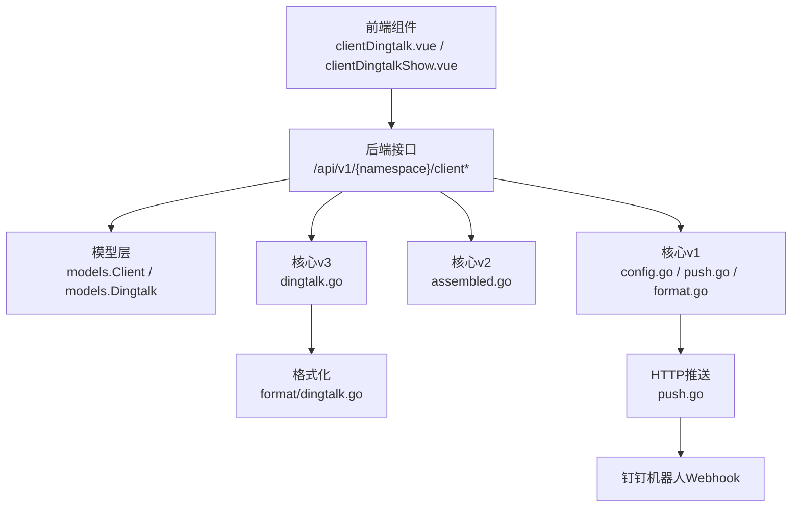
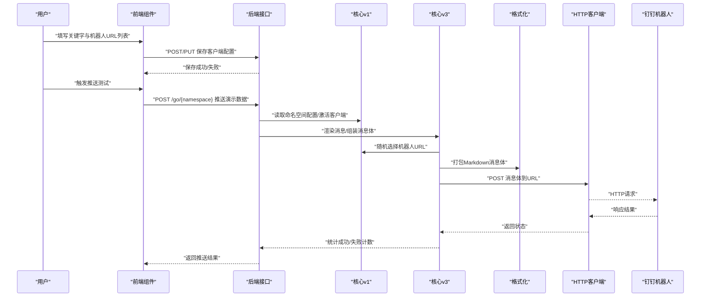
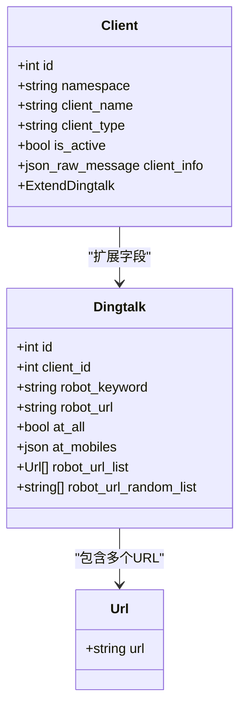
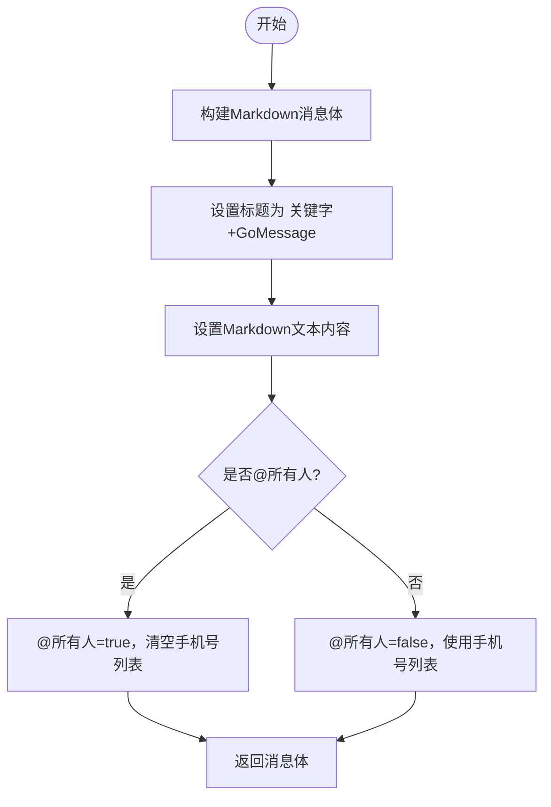
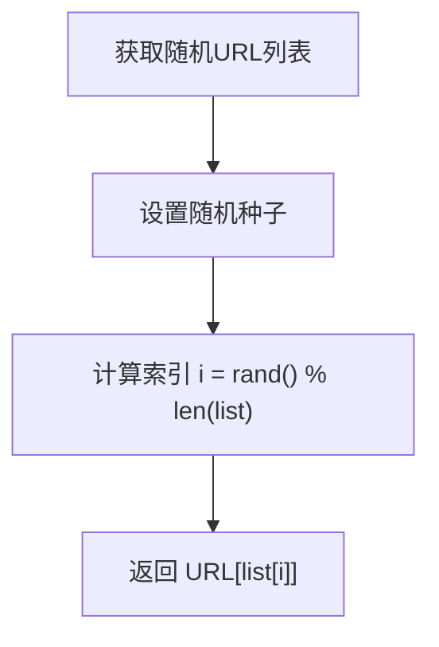
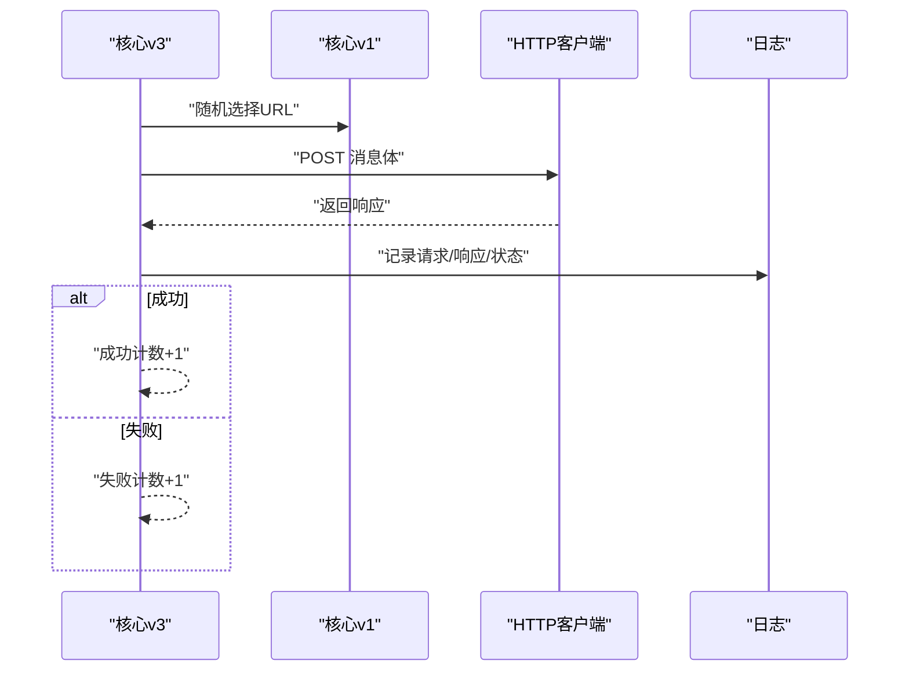
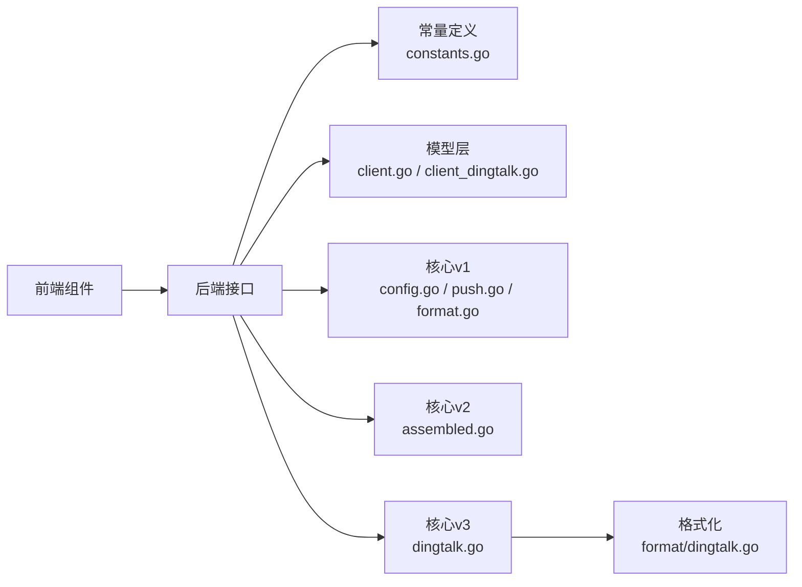

# 钉钉客户端

<cite>
**本文引用的文件**
- [pkg/models/client_dingtalk.go](file://pkg/models/client_dingtalk.go)
- [pkg/models/client.go](file://pkg/models/client.go)
- [pkg/services/core/v1/config.go](file://pkg/services/core/v1/config.go)
- [pkg/services/core/v1/push.go](file://pkg/services/core/v1/push.go)
- [pkg/services/core/v1/format.go](file://pkg/services/core/v1/format.go)
- [pkg/services/core/v2/assembled.go](file://pkg/services/core/v2/assembled.go)
- [pkg/services/core/v3/dingtalk.go](file://pkg/services/core/v3/dingtalk.go)
- [pkg/services/format/dingtalk.go](file://pkg/services/format/dingtalk.go)
- [vue/src/components/clients/clientDingtalk.vue](file://vue/src/components/clients/clientDingtalk.vue)
- [vue/src/components/clientDingtalkShow.vue](file://vue/src/components/clientDingtalkShow.vue)
- [vue/src/service/requests.js](file://vue/src/service/requests.js)
- [config/default.yaml](file://config/default.yaml)
- [pkg/utils/constants.go](file://pkg/utils/constants.go)
</cite>

## 目录
1. [简介](#简介)
2. [项目结构](#项目结构)
3. [核心组件](#核心组件)
4. [架构总览](#架构总览)
5. [详细组件分析](#详细组件分析)
6. [依赖分析](#依赖分析)
7. [性能考虑](#性能考虑)
8. [故障排查指南](#故障排查指南)
9. [结论](#结论)
10. [附录](#附录)

## 简介
本文件面向“钉钉客户端”的使用者与维护者，系统性阐述以下内容：
- 钉钉机器人的工作原理与配置方法：机器人密钥获取、webhook 地址设置、关键字配置
- 钉钉客户端的配置参数：机器人 URL 列表、随机 URL 选择机制、关键字匹配规则
- 钉钉推送的消息格式与样式定制：文本、Markdown 等消息类型
- 完整配置示例：单机器人与多机器人场景
- 错误处理与重试机制、推送测试与调试方法
- 钉钉平台 API 限制与最佳实践建议

## 项目结构
围绕“钉钉客户端”的实现，涉及前后端协作的关键模块如下：
- 前端 Vue 组件：负责用户在界面上录入机器人 URL 列表、关键字等配置，并调用后端接口保存
- 后端模型与服务：负责解析配置、组装消息体、随机选择机器人 URL 并发起 HTTP 推送
- 日志与配置：统一的日志输出与基础运行配置

图表来源
- [vue/src/components/clients/clientDingtalk.vue:1-240](file://vue/src/components/clients/clientDingtalk.vue#L1-L240)
- [vue/src/components/clientDingtalkShow.vue:1-131](file://vue/src/components/clientDingtalkShow.vue#L1-L131)
- [pkg/models/client.go:1-239](file://pkg/models/client.go#L1-L239)
- [pkg/models/client_dingtalk.go:1-38](file://pkg/models/client_dingtalk.go#L1-L38)
- [pkg/services/core/v1/config.go:1-79](file://pkg/services/core/v1/config.go#L1-L79)
- [pkg/services/core/v1/push.go:1-58](file://pkg/services/core/v1/push.go#L1-L58)
- [pkg/services/core/v1/format.go:1-61](file://pkg/services/core/v1/format.go#L1-L61)
- [pkg/services/core/v2/assembled.go:1-72](file://pkg/services/core/v2/assembled.go#L1-L72)
- [pkg/services/core/v3/dingtalk.go:1-41](file://pkg/services/core/v3/dingtalk.go#L1-L41)
- [pkg/services/format/dingtalk.go:1-30](file://pkg/services/format/dingtalk.go#L1-L30)

章节来源
- [vue/src/components/clients/clientDingtalk.vue:1-240](file://vue/src/components/clients/clientDingtalk.vue#L1-L240)
- [vue/src/components/clientDingtalkShow.vue:1-131](file://vue/src/components/clientDingtalkShow.vue#L1-L131)
- [pkg/models/client.go:1-239](file://pkg/models/client.go#L1-L239)
- [pkg/models/client_dingtalk.go:1-38](file://pkg/models/client_dingtalk.go#L1-L38)
- [pkg/services/core/v1/config.go:1-79](file://pkg/services/core/v1/config.go#L1-L79)
- [pkg/services/core/v1/push.go:1-58](file://pkg/services/core/v1/push.go#L1-L58)
- [pkg/services/core/v1/format.go:1-61](file://pkg/services/core/v1/format.go#L1-L61)
- [pkg/services/core/v2/assembled.go:1-72](file://pkg/services/core/v2/assembled.go#L1-L72)
- [pkg/services/core/v3/dingtalk.go:1-41](file://pkg/services/core/v3/dingtalk.go#L1-L41)
- [pkg/services/format/dingtalk.go:1-30](file://pkg/services/format/dingtalk.go#L1-L30)

## 核心组件
- 模型层
  - 客户端模型：统一承载各渠道客户端信息，其中钉钉扩展字段包含关键字、机器人 URL 列表、随机 URL 列表等
  - 钉钉扩展模型：包含机器人关键字、机器人 URL、@ 配置、URL 列表与随机列表等字段
- 服务层
  - v1：提供命名空间配置读取、随机 URL 选择、消息组装与推送等通用能力
  - v2：按渠道封装消息体组装流程，统一返回 URL 与消息体
  - v3：面向业务的客户端动作封装，负责渲染消息与执行推送
  - format：针对钉钉的消息体打包器，生成 Markdown 类型消息
- 前端组件
  - 提供“添加/删除”机器人 URL 的交互，展示与编辑关键字与 URL 列表
  - 调用后端接口完成创建、更新与删除

章节来源
- [pkg/models/client.go:1-239](file://pkg/models/client.go#L1-L239)
- [pkg/models/client_dingtalk.go:1-38](file://pkg/models/client_dingtalk.go#L1-L38)
- [pkg/services/core/v1/config.go:1-79](file://pkg/services/core/v1/config.go#L1-L79)
- [pkg/services/core/v1/format.go:1-61](file://pkg/services/core/v1/format.go#L1-L61)
- [pkg/services/core/v2/assembled.go:1-72](file://pkg/services/core/v2/assembled.go#L1-L72)
- [pkg/services/core/v3/dingtalk.go:1-41](file://pkg/services/core/v3/dingtalk.go#L1-L41)
- [pkg/services/format/dingtalk.go:1-30](file://pkg/services/format/dingtalk.go#L1-L30)
- [vue/src/components/clients/clientDingtalk.vue:1-240](file://vue/src/components/clients/clientDingtalk.vue#L1-L240)
- [vue/src/components/clientDingtalkShow.vue:1-131](file://vue/src/components/clientDingtalkShow.vue#L1-L131)

## 架构总览
钉钉客户端的端到端流程如下：
- 前端录入配置并保存至后端
- 后端读取命名空间配置与激活客户端
- 依据是否渲染模板决定消息体组装方式
- 随机选择一个机器人 URL
- 发起 HTTP POST 请求至钉钉 Webhook
- 记录推送日志并返回结果

图表来源
- [vue/src/components/clients/clientDingtalk.vue:1-240](file://vue/src/components/clients/clientDingtalk.vue#L1-L240)
- [vue/src/service/requests.js:1-42](file://vue/src/service/requests.js#L1-L42)
- [pkg/services/core/v1/config.go:1-79](file://pkg/services/core/v1/config.go#L1-L79)
- [pkg/services/core/v1/format.go:1-61](file://pkg/services/core/v1/format.go#L1-L61)
- [pkg/services/core/v3/dingtalk.go:1-41](file://pkg/services/core/v3/dingtalk.go#L1-L41)
- [pkg/services/core/v1/push.go:1-58](file://pkg/services/core/v1/push.go#L1-L58)

## 详细组件分析

### 配置参数与数据模型
- 关键字（robot_keyword）：用于匹配放行关键词，确保消息符合预期才推送
- 机器人 URL 列表（robot_url_list）：支持多个机器人 URL，便于分散推送压力
- 随机 URL 列表（robot_url_random_list）：运行时由 URL 列表生成，每次推送随机选择一个
- @ 配置：支持“@所有人”或指定手机号列表（当前格式化器固定为 Markdown，@ 配置由格式化器处理）

图表来源
- [pkg/models/client.go:13-28](file://pkg/models/client.go#L13-L28)
- [pkg/models/client_dingtalk.go:21-33](file://pkg/models/client_dingtalk.go#L21-L33)

章节来源
- [pkg/models/client.go:1-239](file://pkg/models/client.go#L1-L239)
- [pkg/models/client_dingtalk.go:1-38](file://pkg/models/client_dingtalk.go#L1-L38)

### 前端配置与交互
- 支持动态添加/删除机器人 URL 输入框
- 展示与编辑“放行关键字”
- 保存后通过接口更新后端配置
- 多机器人场景提示：随机选择 URL，避免单机器人频率限制

章节来源
- [vue/src/components/clients/clientDingtalk.vue:1-240](file://vue/src/components/clients/clientDingtalk.vue#L1-L240)
- [vue/src/components/clientDingtalkShow.vue:1-131](file://vue/src/components/clientDingtalkShow.vue#L1-L131)
- [vue/src/service/requests.js:1-42](file://vue/src/service/requests.js#L1-L42)

### 消息格式与样式定制
- 默认消息类型：Markdown
- 标题：由“关键字+GoMessage”组成
- 文本内容：来自渲染后的模板或原始消息
- @ 配置：支持“@所有人”或指定手机号列表；当前实现以 Markdown 为主，@ 配置由格式化器注入

图表来源
- [pkg/services/format/dingtalk.go:1-30](file://pkg/services/format/dingtalk.go#L1-L30)

章节来源
- [pkg/services/format/dingtalk.go:1-30](file://pkg/services/format/dingtalk.go#L1-L30)

### 随机 URL 选择机制
- 在客户端保存时，将 URL 列表转换为“随机 URL 列表”
- 推送前从随机列表中等概率选取一个 URL
- 多 URL 可有效分散单机器人频率限制带来的风险

图表来源
- [pkg/models/client.go:40-87](file://pkg/models/client.go#L40-L87)
- [pkg/services/core/v1/config.go:60-65](file://pkg/services/core/v1/config.go#L60-L65)

章节来源
- [pkg/models/client.go:40-87](file://pkg/models/client.go#L40-L87)
- [pkg/services/core/v1/config.go:60-65](file://pkg/services/core/v1/config.go#L60-L65)

### 推送流程与错误处理
- 序列化消息体为 JSON
- 使用 HTTP 客户端发起 POST 请求
- 读取响应体并记录日志（包含请求/响应体、状态码等）
- 返回错误时计入失败计数，成功时计入成功计数

图表来源
- [pkg/services/core/v3/dingtalk.go:30-40](file://pkg/services/core/v3/dingtalk.go#L30-L40)
- [pkg/services/core/v1/push.go:15-57](file://pkg/services/core/v1/push.go#L15-L57)

章节来源
- [pkg/services/core/v3/dingtalk.go:1-41](file://pkg/services/core/v3/dingtalk.go#L1-L41)
- [pkg/services/core/v1/push.go:1-58](file://pkg/services/core/v1/push.go#L1-L58)

### 关键字匹配规则
- 关键字用于“放行关键词”，确保消息符合预期才推送
- 前端与后端均以“关键字”作为匹配依据，需保持一致

章节来源
- [vue/src/components/clients/clientDingtalk.vue:45-51](file://vue/src/components/clients/clientDingtalk.vue#L45-L51)
- [pkg/services/format/dingtalk.go:16-18](file://pkg/services/format/dingtalk.go#L16-L18)

### 配置示例（单机器人与多机器人）
- 单机器人：在“机器人URL列表”中仅保留一个 URL
- 多机器人：在列表中添加多个 URL，系统将随机选择其一进行推送
- 关键字：与钉钉机器人后台设置的“放行关键词”保持一致

章节来源
- [vue/src/components/clients/clientDingtalk.vue:45-82](file://vue/src/components/clients/clientDingtalk.vue#L45-L82)
- [vue/src/components/clientDingtalkShow.vue:23-39](file://vue/src/components/clientDingtalkShow.vue#L23-L39)

## 依赖分析
- 前端依赖后端接口完成客户端配置的增删改查
- 后端模型与服务之间通过常量标识客户端类型，保证多渠道一致性
- v1 提供通用能力（随机 URL、推送、模板渲染），v2/v3 分别面向“组装”和“动作”两个层次

图表来源
- [pkg/utils/constants.go:1-9](file://pkg/utils/constants.go#L1-L9)
- [pkg/models/client.go:1-239](file://pkg/models/client.go#L1-L239)
- [pkg/models/client_dingtalk.go:1-38](file://pkg/models/client_dingtalk.go#L1-L38)
- [pkg/services/core/v1/config.go:1-79](file://pkg/services/core/v1/config.go#L1-L79)
- [pkg/services/core/v1/push.go:1-58](file://pkg/services/core/v1/push.go#L1-L58)
- [pkg/services/core/v1/format.go:1-61](file://pkg/services/core/v1/format.go#L1-L61)
- [pkg/services/core/v2/assembled.go:1-72](file://pkg/services/core/v2/assembled.go#L1-L72)
- [pkg/services/core/v3/dingtalk.go:1-41](file://pkg/services/core/v3/dingtalk.go#L1-L41)
- [pkg/services/format/dingtalk.go:1-30](file://pkg/services/format/dingtalk.go#L1-L30)

章节来源
- [pkg/utils/constants.go:1-9](file://pkg/utils/constants.go#L1-L9)
- [pkg/models/client.go:1-239](file://pkg/models/client.go#L1-L239)
- [pkg/models/client_dingtalk.go:1-38](file://pkg/models/client_dingtalk.go#L1-L38)
- [pkg/services/core/v1/config.go:1-79](file://pkg/services/core/v1/config.go#L1-L79)
- [pkg/services/core/v1/push.go:1-58](file://pkg/services/core/v1/push.go#L1-L58)
- [pkg/services/core/v1/format.go:1-61](file://pkg/services/core/v1/format.go#L1-L61)
- [pkg/services/core/v2/assembled.go:1-72](file://pkg/services/core/v2/assembled.go#L1-L72)
- [pkg/services/core/v3/dingtalk.go:1-41](file://pkg/services/core/v3/dingtalk.go#L1-L41)
- [pkg/services/format/dingtalk.go:1-30](file://pkg/services/format/dingtalk.go#L1-L30)

## 性能考虑
- 多 URL 随机选择：分散单机器人频率限制，提升可用性与稳定性
- 消息体轻量化：默认使用 Markdown，减少冗余字段
- 日志开销：推送日志包含请求/响应体与状态，建议在高并发场景下调低日志级别或按需开启

## 故障排查指南
- 关键字不匹配
  - 现象：消息未推送或被拦截
  - 排查：确认前端与后端“放行关键字”一致
- URL 不可用
  - 现象：HTTP 推送失败
  - 排查：检查 URL 是否正确、Token 是否有效、网络连通性
- 频率限制
  - 现象：部分推送被限流
  - 排查：增加机器人 URL 数量，利用随机选择机制分摊压力
- 日志定位
  - 查看推送日志文件，核对请求体、响应体与状态码
- 测试与调试
  - 使用前端提供的“推送演示数据”接口进行快速验证

章节来源
- [vue/src/service/requests.js:4-5](file://vue/src/service/requests.js#L4-L5)
- [pkg/services/core/v1/push.go:45-56](file://pkg/services/core/v1/push.go#L45-L56)
- [config/default.yaml:27-44](file://config/default.yaml#L27-L44)

## 结论
本方案通过“关键字放行 + 多机器人 URL 随机选择 + Markdown 消息体”的组合，既满足钉钉平台的使用规范，又具备良好的可扩展性与稳定性。建议在生产环境中：
- 为每个重要通道至少配置 2~3 个机器人 URL
- 保持“放行关键字”与钉钉机器人后台一致
- 结合日志与监控，持续观察推送成功率与频率限制表现

## 附录
- 前端接口一览（与钉钉客户端相关）
  - 创建客户端：POST /api/v1/{namespace}/client
  - 更新客户端：PUT /api/v1/{namespace}/client/{id}
  - 更新客户端信息：PUT /api/v1/{namespace}/client-info/{id}
  - 删除客户端：DELETE /api/v1/{namespace}/client/{id}
  - 推送演示数据：POST /go/{namespace}

章节来源
- [vue/src/service/requests.js:21-27](file://vue/src/service/requests.js#L21-L27)
- [vue/src/service/requests.js:4-5](file://vue/src/service/requests.js#L4-L5)