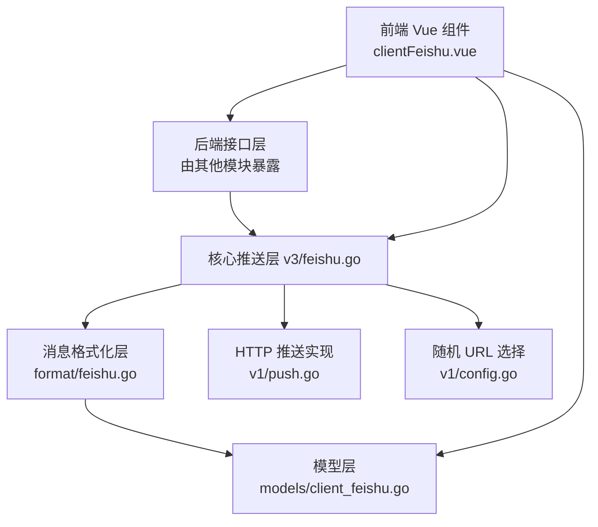
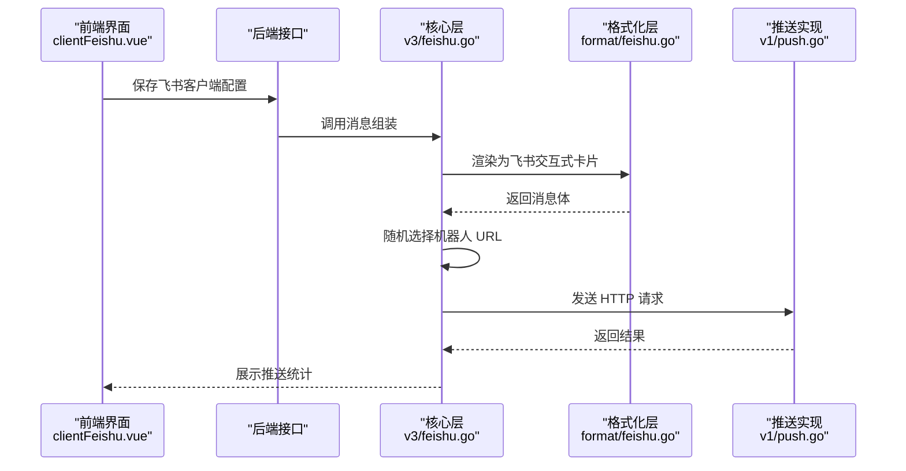
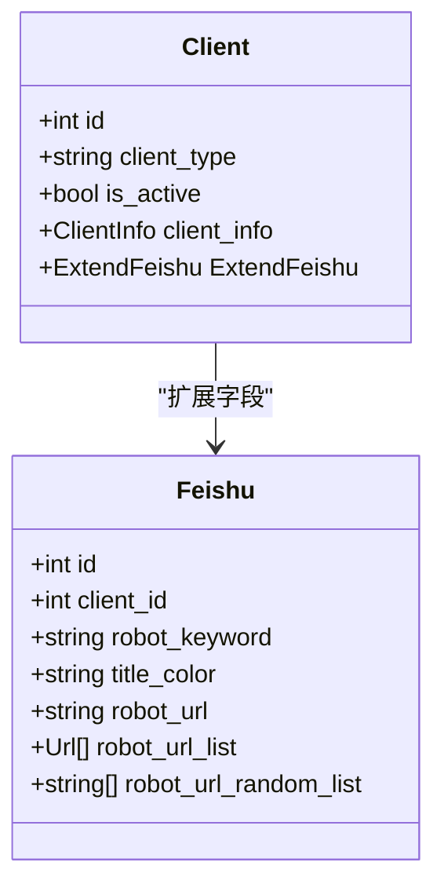
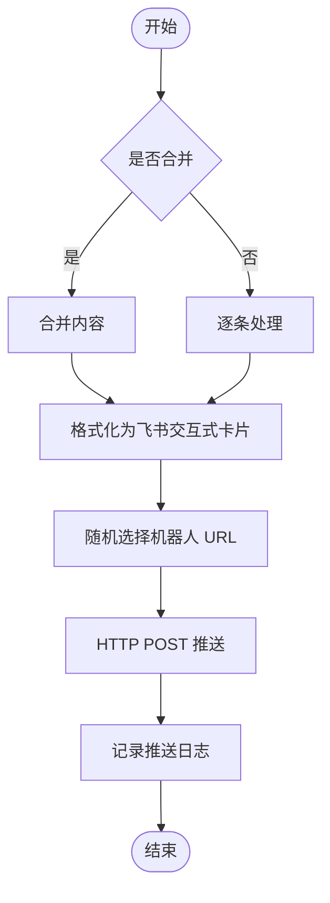
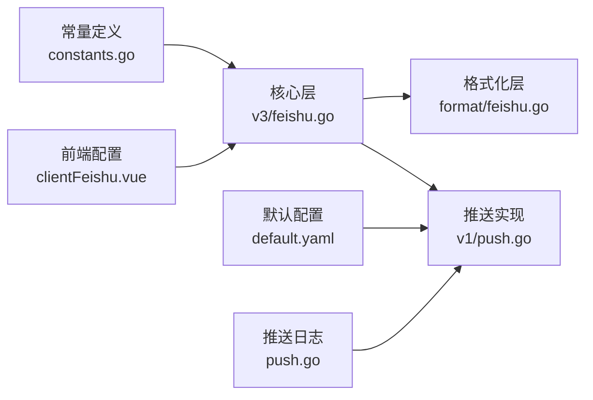

# 飞书客户端

<cite>
**本文引用的文件**
- [pkg/models/client_feishu.go](file://pkg/models/client_feishu.go)
- [pkg/models/client.go](file://pkg/models/client.go)
- [pkg/services/format/feishu.go](file://pkg/services/format/feishu.go)
- [pkg/services/core/v3/feishu.go](file://pkg/services/core/v3/feishu.go)
- [pkg/services/core/v1/push.go](file://pkg/services/core/v1/push.go)
- [pkg/services/core/v1/config.go](file://pkg/services/core/v1/config.go)
- [vue/src/components/clients/clientFeishu.vue](file://vue/src/components/clients/clientFeishu.vue)
- [pkg/utils/constants.go](file://pkg/utils/constants.go)
- [pkg/utils/log/loggers/push.go](file://pkg/utils/log/loggers/push.go)
- [config/default.yaml](file://config/default.yaml)
- [wiki/install_docker.md](file://wiki/install_docker.md)
</cite>

## 目录
1. [简介](#简介)
2. [项目结构](#项目结构)
3. [核心组件](#核心组件)
4. [架构总览](#架构总览)
5. [详细组件分析](#详细组件分析)
6. [依赖分析](#依赖分析)
7. [性能考虑](#性能考虑)
8. [故障排查指南](#故障排查指南)
9. [结论](#结论)
10. [附录](#附录)

## 简介
本文件面向飞书客户端的使用者与维护者，系统性说明飞书机器人的配置与使用流程，涵盖以下主题：
- 机器人 ID 获取、机器人密钥设置与 webhook 地址配置
- 飞书客户端的关键配置参数：机器人 URL 列表、标题颜色、关键字匹配
- 推送消息格式与富文本支持：文本、富文本、交互式卡片
- 配置示例与最佳实践：多机器人负载均衡、推送优先级
- 平台限制、频率控制与错误处理机制
- 飞书开放平台 API 文档链接与常见问题参考

## 项目结构
飞书客户端能力由后端模型层、格式化层、核心推送层与前端配置界面共同构成，整体采用分层设计，职责清晰：
- 模型层：定义飞书客户端的持久化结构与扩展字段
- 格式化层：将业务内容渲染为飞书可识别的消息体
- 核心层：负责消息组装、随机选择机器人 URL、执行 HTTP 推送
- 前端层：提供飞书客户端的可视化配置界面

图表来源
- [vue/src/components/clients/clientFeishu.vue](file://vue/src/components/clients/clientFeishu.vue)
- [pkg/services/core/v3/feishu.go](file://pkg/services/core/v3/feishu.go)
- [pkg/services/format/feishu.go](file://pkg/services/format/feishu.go)
- [pkg/models/client_feishu.go](file://pkg/models/client_feishu.go)
- [pkg/services/core/v1/push.go](file://pkg/services/core/v1/push.go)
- [pkg/services/core/v1/config.go](file://pkg/services/core/v1/config.go)

章节来源
- [vue/src/components/clients/clientFeishu.vue](file://vue/src/components/clients/clientFeishu.vue)
- [pkg/services/core/v3/feishu.go](file://pkg/services/core/v3/feishu.go)
- [pkg/services/format/feishu.go](file://pkg/services/format/feishu.go)
- [pkg/models/client_feishu.go](file://pkg/models/client_feishu.go)
- [pkg/services/core/v1/push.go](file://pkg/services/core/v1/push.go)
- [pkg/services/core/v1/config.go](file://pkg/services/core/v1/config.go)

## 核心组件
- 飞书模型（持久化结构）
  - 字段：机器人关键字、标题颜色、机器人 URL 列表、随机 URL 列表
  - 关系：与通用客户端模型通过扩展字段关联
- 消息格式化器
  - 将内容渲染为飞书“交互式卡片”消息，包含标题与富文本元素
- 核心推送器
  - 支持合并/拆分两种消息模式，随机选择机器人 URL 并执行 HTTP 推送
- 前端配置组件
  - 提供关键字、标题颜色、机器人 URL 列表的可视化配置与动态增删

章节来源
- [pkg/models/client_feishu.go](file://pkg/models/client_feishu.go)
- [pkg/models/client.go](file://pkg/models/client.go)
- [pkg/services/format/feishu.go](file://pkg/services/format/feishu.go)
- [pkg/services/core/v3/feishu.go](file://pkg/services/core/v3/feishu.go)
- [vue/src/components/clients/clientFeishu.vue](file://vue/src/components/clients/clientFeishu.vue)

## 架构总览
飞书客户端的调用链路如下：
- 前端填写配置并保存至后端
- 后端将配置持久化到模型层
- 核心层按策略组装消息体
- 格式化层将内容转为飞书交互式卡片
- 核心层随机选择机器人 URL 并调用 HTTP 推送
- 日志系统记录推送请求与响应

图表来源
- [vue/src/components/clients/clientFeishu.vue](file://vue/src/components/clients/clientFeishu.vue)
- [pkg/services/core/v3/feishu.go](file://pkg/services/core/v3/feishu.go)
- [pkg/services/format/feishu.go](file://pkg/services/format/feishu.go)
- [pkg/services/core/v1/push.go](file://pkg/services/core/v1/push.go)

## 详细组件分析

### 飞书模型与配置参数
- 关键字段
  - 机器人关键字：用于标题展示
  - 标题颜色：支持多种预设颜色
  - 机器人 URL 列表：可配置多个 webhook 地址
  - 随机 URL 列表：用于推送时随机选择
- 存储与扩展
  - 通用客户端模型包含扩展字段，飞书模型作为其扩展之一
  - 创建/更新时将 URL 列表转换为随机列表并持久化

图表来源
- [pkg/models/client.go](file://pkg/models/client.go)
- [pkg/models/client_feishu.go](file://pkg/models/client_feishu.go)

章节来源
- [pkg/models/client_feishu.go](file://pkg/models/client_feishu.go)
- [pkg/models/client.go](file://pkg/models/client.go)

### 消息格式化与推送
- 消息类型
  - 使用“交互式卡片”消息类型，包含头部标题与富文本元素
  - 富文本内容来自业务消息，渲染为 Markdown 结构
- 组装与推送
  - 支持合并与拆分两种模式
  - 随机选择机器人 URL 列表中的一个进行推送
  - 执行 HTTP POST 请求，记录请求与响应日志

图表来源
- [pkg/services/core/v3/feishu.go](file://pkg/services/core/v3/feishu.go)
- [pkg/services/format/feishu.go](file://pkg/services/format/feishu.go)
- [pkg/services/core/v1/push.go](file://pkg/services/core/v1/push.go)
- [pkg/services/core/v1/config.go](file://pkg/services/core/v1/config.go)

章节来源
- [pkg/services/format/feishu.go](file://pkg/services/format/feishu.go)
- [pkg/services/core/v3/feishu.go](file://pkg/services/core/v3/feishu.go)
- [pkg/services/core/v1/push.go](file://pkg/services/core/v1/push.go)
- [pkg/services/core/v1/config.go](file://pkg/services/core/v1/config.go)

### 前端配置界面与最佳实践
- 配置项
  - 客户端名称、描述、是否激活
  - 标题名称（关键字）、标题颜色
  - 机器人 URL 列表：支持动态增删
- 最佳实践
  - 多机器人 URL：推送时随机选择，降低单机器人频率限制带来的漏推风险
  - 关键字与颜色：提升消息在飞书中的辨识度与可读性

章节来源
- [vue/src/components/clients/clientFeishu.vue](file://vue/src/components/clients/clientFeishu.vue)

## 依赖分析
- 模块耦合
  - 前端仅依赖后端提供的客户端配置接口，不直接依赖具体推送实现
  - 核心层依赖格式化层与推送实现，形成清晰的调用链
- 常量与类型
  - 客户端类型常量统一管理，便于扩展新平台
- 日志与配置
  - 推送日志独立初始化，支持文件落盘与可选 ES 投递
  - 默认配置文件提供基础运行参数

图表来源
- [pkg/utils/constants.go](file://pkg/utils/constants.go)
- [pkg/services/core/v3/feishu.go](file://pkg/services/core/v3/feishu.go)
- [pkg/services/format/feishu.go](file://pkg/services/format/feishu.go)
- [pkg/services/core/v1/push.go](file://pkg/services/core/v1/push.go)
- [vue/src/components/clients/clientFeishu.vue](file://vue/src/components/clients/clientFeishu.vue)
- [config/default.yaml](file://config/default.yaml)
- [pkg/utils/log/loggers/push.go](file://pkg/utils/log/loggers/push.go)

章节来源
- [pkg/utils/constants.go](file://pkg/utils/constants.go)
- [pkg/services/core/v3/feishu.go](file://pkg/services/core/v3/feishu.go)
- [pkg/services/format/feishu.go](file://pkg/services/format/feishu.go)
- [pkg/services/core/v1/push.go](file://pkg/services/core/v1/push.go)
- [vue/src/components/clients/clientFeishu.vue](file://vue/src/components/clients/clientFeishu.vue)
- [config/default.yaml](file://config/default.yaml)
- [pkg/utils/log/loggers/push.go](file://pkg/utils/log/loggers/push.go)

## 性能考虑
- 多机器人负载均衡
  - 通过随机选择 URL 列表中的地址，分散推送压力，避免单点限流导致的漏推
- 合并与拆分策略
  - 合并模式减少 HTTP 请求次数，适合批量场景
  - 拆分模式便于快速反馈与细粒度控制
- 日志与可观测性
  - 推送日志包含请求体、响应体与状态，便于定位问题
  - 可选 ES 投递，便于集中检索与分析

## 故障排查指南
- 常见问题
  - 机器人 URL 无效或权限不足：检查 URL 是否正确、是否已加入群组并授权
  - 关键字不匹配：确认关键字与飞书侧设置一致
  - 频率限制：单机器人短时间内推送过多会被限制，建议配置多个 URL 实现负载均衡
- 错误处理
  - 推送失败会记录错误日志，包含请求与响应信息
  - 建议结合日志与响应状态排查网络、鉴权与平台限制问题
- 参考资源
  - 飞书开放平台 API 文档（请参考官方文档以获取最新接口规范与限制说明）

章节来源
- [pkg/services/core/v1/push.go](file://pkg/services/core/v1/push.go)
- [pkg/utils/log/loggers/push.go](file://pkg/utils/log/loggers/push.go)

## 结论
飞书客户端通过清晰的分层设计与可视化配置，实现了灵活的消息推送能力。借助多机器人 URL 的负载均衡与交互式卡片的消息格式，能够在保证可靠性的同时提升消息的可读性与可操作性。建议在生产环境中结合日志与限流策略，持续优化推送效果。

## 附录
- 部署参考
  - Docker 快速部署与数据持久化示例可参考安装文档
- 飞书开放平台 API
  - 请参考官方文档以获取最新接口规范与限制说明

章节来源
- [wiki/install_docker.md](file://wiki/install_docker.md)