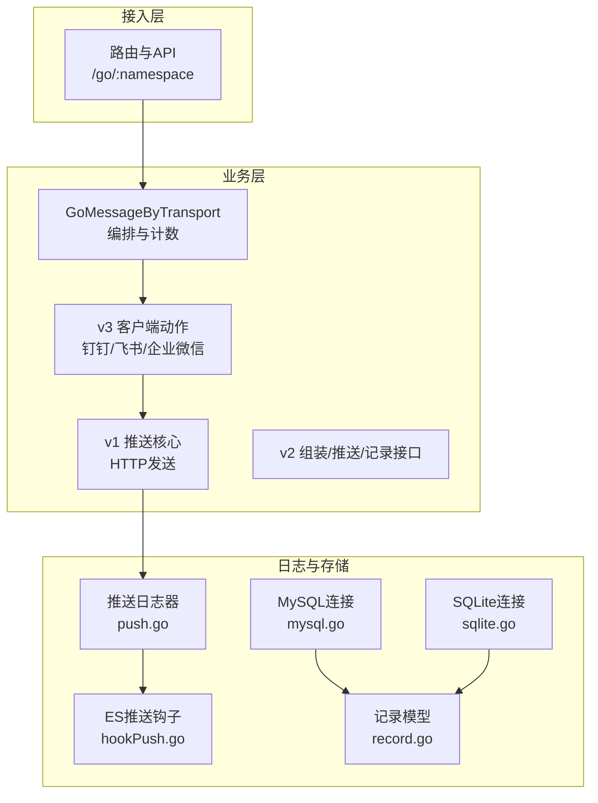
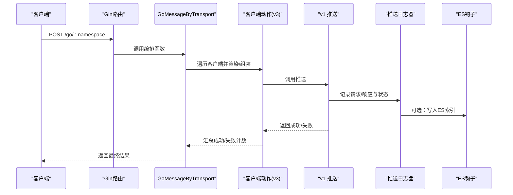
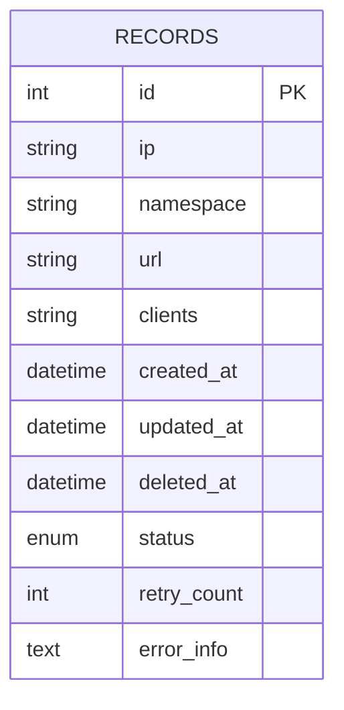
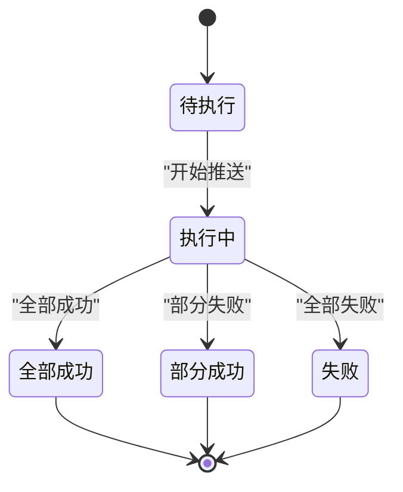
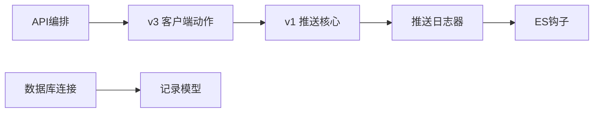

# 推送记录与状态管理

<cite>
**本文引用的文件**
- [pkg/models/record.go](file://pkg/models/record.go)
- [pkg/services/core/v2/record.go](file://pkg/services/core/v2/record.go)
- [pkg/utils/log/loggers/push.go](file://pkg/utils/log/loggers/push.go)
- [pkg/utils/log/hooks/es/hookPush.go](file://pkg/utils/log/hooks/es/hookPush.go)
- [pkg/utils/database/mysql.go](file://pkg/utils/database/mysql.go)
- [pkg/utils/database/sqlite.go](file://pkg/utils/database/sqlite.go)
- [pkg/api/vGomessage.go](file://pkg/api/vGomessage.go)
- [pkg/services/core/v1/push.go](file://pkg/services/core/v1/push.go)
- [pkg/services/core/v2/push.go](file://pkg/services/core/v2/push.go)
- [pkg/services/core/v3/feishu.go](file://pkg/services/core/v3/feishu.go)
- [pkg/services/core/v3/wechat.go](file://pkg/services/core/v3/wechat.go)
- [pkg/services/core/v2/assembled.go](file://pkg/services/core/v2/assembled.go)
- [pkg/utils/constants.go](file://pkg/utils/constants.go)
- [pkg/routers/urls.go](file://pkg/routers/urls.go)
</cite>

## 目录
1. [简介](#简介)
2. [项目结构](#项目结构)
3. [核心组件](#核心组件)
4. [架构总览](#架构总览)
5. [详细组件分析](#详细组件分析)
6. [依赖分析](#依赖分析)
7. [性能考虑](#性能考虑)
8. [故障排查指南](#故障排查指南)
9. [结论](#结论)
10. [附录](#附录)

## 简介
本文件面向“推送记录与状态管理”主题，系统性梳理推送记录的数据模型、状态生命周期、查询统计与分析、存储策略与清理机制，并给出监控最佳实践与故障排查方法。当前代码库在推送链路中已具备完善的日志记录与ES索引投递能力，但尚未实现持久化的推送记录表与状态字段。本文在不改变现有实现的前提下，提出可落地的扩展方案与建议。

## 项目结构
围绕推送记录与状态管理的关键模块分布如下：
- API入口与路由：负责接收外部推送请求并编排后续流程
- 核心推送服务：v1/v2/v3多版本推送实现，统一通过日志记录关键信息
- 日志与ES钩子：将推送日志写入文件与Elasticsearch
- 数据库：MySQL与SQLite连接初始化，为未来持久化记录提供基础
- 模型：当前仅定义通用记录表结构，需扩展状态字段以支撑状态管理

图表来源
- [pkg/routers/urls.go:21-109](file://pkg/routers/urls.go#L21-L109)
- [pkg/api/vGomessage.go:21-173](file://pkg/api/vGomessage.go#L21-L173)
- [pkg/services/core/v1/push.go:15-58](file://pkg/services/core/v1/push.go#L15-L58)
- [pkg/services/core/v2/push.go:19-78](file://pkg/services/core/v2/push.go#L19-L78)
- [pkg/services/core/v3/feishu.go:29-39](file://pkg/services/core/v3/feishu.go#L29-L39)
- [pkg/services/core/v3/wechat.go:55-91](file://pkg/services/core/v3/wechat.go#L55-L91)
- [pkg/utils/log/loggers/push.go:15-59](file://pkg/utils/log/loggers/push.go#L15-L59)
- [pkg/utils/log/hooks/es/hookPush.go:18-24](file://pkg/utils/log/hooks/es/hookPush.go#L18-L24)
- [pkg/utils/database/mysql.go:24-52](file://pkg/utils/database/mysql.go#L24-L52)
- [pkg/utils/database/sqlite.go:17-47](file://pkg/utils/database/sqlite.go#L17-L47)
- [pkg/models/record.go:9-28](file://pkg/models/record.go#L9-L28)

章节来源
- [pkg/routers/urls.go:21-109](file://pkg/routers/urls.go#L21-L109)
- [pkg/api/vGomessage.go:21-173](file://pkg/api/vGomessage.go#L21-L173)
- [pkg/utils/database/mysql.go:24-52](file://pkg/utils/database/mysql.go#L24-L52)
- [pkg/utils/database/sqlite.go:17-47](file://pkg/utils/database/sqlite.go#L17-L47)
- [pkg/models/record.go:9-28](file://pkg/models/record.go#L9-L28)

## 核心组件
- 记录模型与持久化
  - 当前模型包含基础字段与软删除索引，尚未包含推送状态、时间戳、错误信息、重试次数等状态字段
  - 建议扩展：增加状态枚举、创建/更新时间、错误详情、重试次数、目标客户端列表等
- 推送日志与ES
  - 推送日志器记录请求/响应体、状态码、时间等关键信息
  - ES钩子将日志写入独立索引，便于检索与分析
- 推送核心
  - v1统一HTTP发送；v2引入接口抽象；v3按客户端类型实现渲染与推送
- 路由与编排
  - API入口根据命名空间与客户端配置，逐个执行推送并统计成功/失败

章节来源
- [pkg/models/record.go:9-28](file://pkg/models/record.go#L9-L28)
- [pkg/utils/log/loggers/push.go:45-52](file://pkg/utils/log/loggers/push.go#L45-L52)
- [pkg/utils/log/hooks/es/hookPush.go:18-24](file://pkg/utils/log/hooks/es/hookPush.go#L18-L24)
- [pkg/services/core/v1/push.go:15-58](file://pkg/services/core/v1/push.go#L15-L58)
- [pkg/api/vGomessage.go:63-153](file://pkg/api/vGomessage.go#L63-L153)

## 架构总览
推送请求自路由进入，经API编排后，按客户端类型调用对应动作，统一通过v1核心发送HTTP请求，并将关键信息写入推送日志器，必要时投递至ES。当前未见持久化记录表的查询与统计逻辑，后续可在数据库层补充。

图表来源
- [pkg/routers/urls.go:46-48](file://pkg/routers/urls.go#L46-L48)
- [pkg/api/vGomessage.go:68-143](file://pkg/api/vGomessage.go#L68-L143)
- [pkg/services/core/v3/feishu.go:29-39](file://pkg/services/core/v3/feishu.go#L29-L39)
- [pkg/services/core/v1/push.go:16-52](file://pkg/services/core/v1/push.go#L16-L52)
- [pkg/utils/log/loggers/push.go:45-52](file://pkg/utils/log/loggers/push.go#L45-L52)
- [pkg/utils/log/hooks/es/hookPush.go:18-24](file://pkg/utils/log/hooks/es/hookPush.go#L18-L24)

## 详细组件分析

### 数据模型与状态字段设计
- 现状
  - 模型定义了基础字段与软删除索引，适合作为通用记录载体
- 扩展建议
  - 新增字段：状态枚举、创建/更新时间、错误详情、重试次数、目标客户端列表、命名空间、IP、URL、客户端列表
  - 索引优化：为状态、命名空间、创建时间建立索引，提升查询与统计性能
  - 软删除：沿用DeletedAt，便于审计与恢复

图表来源
- [pkg/models/record.go:9-18](file://pkg/models/record.go#L9-L18)

章节来源
- [pkg/models/record.go:9-28](file://pkg/models/record.go#L9-L28)

### 推送状态生命周期管理
- 生命周期阶段
  - 创建：接收请求并生成待推送任务
  - 执行：按客户端类型渲染/组装并发送
  - 完成/失败：根据返回结果更新状态与错误信息
- 状态枚举建议
  - 待执行、执行中、部分成功、全部成功、失败
- 关键控制点
  - API层汇总成功/失败计数，决定最终响应
  - v3各客户端动作在失败时增加失败计数

章节来源
- [pkg/api/vGomessage.go:63-153](file://pkg/api/vGomessage.go#L63-L153)
- [pkg/services/core/v3/feishu.go:29-39](file://pkg/services/core/v3/feishu.go#L29-L39)
- [pkg/services/core/v3/wechat.go:55-91](file://pkg/services/core/v3/wechat.go#L55-L91)

### 推送记录的查询、统计与分析
- 查询
  - 按命名空间、状态、时间范围、客户端过滤
  - 分页与排序：按创建时间倒序
- 统计
  - 成功率：成功次数 / 总次数
  - 失败原因分类：按错误信息关键字归类
  - 性能指标：平均耗时、P95/P99延迟、吞吐量
- 分析
  - 时间序列：按小时/天聚合成功率与失败率
  - 客户端对比：不同客户端的成功率与失败原因
  - 命名空间趋势：跨命名空间的推送表现

章节来源
- [pkg/utils/log/loggers/push.go:45-52](file://pkg/utils/log/loggers/push.go#L45-L52)
- [pkg/utils/log/hooks/es/hookPush.go:18-24](file://pkg/utils/log/hooks/es/hookPush.go#L18-L24)

### 存储策略与清理机制
- 存储策略
  - MySQL/SQLite双栈：生产环境优先MySQL，开发/测试可用SQLite
  - 连接池参数：合理设置最大空闲/活跃连接与生命周期
- 清理机制
  - 基于时间的归档与删除：保留近N天的明细，历史归档至冷存储
  - 软删除：结合DeletedAt实现可恢复删除
  - 索引维护：定期重建/优化索引，避免碎片

章节来源
- [pkg/utils/database/mysql.go:38-51](file://pkg/utils/database/mysql.go#L38-L51)
- [pkg/utils/database/sqlite.go:35-46](file://pkg/utils/database/sqlite.go#L35-L46)

### 监控最佳实践
- 指标采集
  - 推送成功率、失败率、错误码分布
  - 响应时间与超时率
  - 客户端维度与命名空间维度指标
- 告警策略
  - 成功率低于阈值、错误率突增、响应时间超限
- 日志与追踪
  - 结合ES索引与日志器，实现端到端追踪
  - 关键字段：namespace、url、request_body、response_status、time_now

章节来源
- [pkg/utils/log/loggers/push.go:45-52](file://pkg/utils/log/loggers/push.go#L45-L52)
- [pkg/utils/log/hooks/es/hookPush.go:18-24](file://pkg/utils/log/hooks/es/hookPush.go#L18-L24)

### 故障排查方法
- 快速定位
  - 查看推送日志器输出与ES索引，确认请求/响应与状态码
  - 检查客户端配置（URL、密钥、合并策略等）
- 常见问题
  - 序列化失败：检查请求体合法性与编码
  - 接口调用异常：核对第三方平台URL与鉴权
  - 响应读取失败：关注网络与超时设置
- 回滚与恢复
  - 使用软删除与备份，快速回滚到上一稳定版本

章节来源
- [pkg/services/core/v1/push.go:16-52](file://pkg/services/core/v1/push.go#L16-L52)
- [pkg/services/core/v3/wechat.go:94-120](file://pkg/services/core/v3/wechat.go#L94-L120)

## 依赖分析
- 组件耦合
  - API层依赖v3客户端动作与v1核心推送
  - v3动作依赖格式化工具与常量
  - 日志器与ES钩子相互独立，可按需启用
- 外部依赖
  - HTTP客户端用于第三方推送
  - GORM驱动MySQL/SQLite
  - Logrus与Elasticsearch客户端

图表来源
- [pkg/api/vGomessage.go:68-143](file://pkg/api/vGomessage.go#L68-L143)
- [pkg/services/core/v3/feishu.go:29-39](file://pkg/services/core/v3/feishu.go#L29-L39)
- [pkg/services/core/v1/push.go:16-52](file://pkg/services/core/v1/push.go#L16-L52)
- [pkg/utils/log/loggers/push.go:45-52](file://pkg/utils/log/loggers/push.go#L45-L52)
- [pkg/utils/log/hooks/es/hookPush.go:18-24](file://pkg/utils/log/hooks/es/hookPush.go#L18-L24)
- [pkg/utils/database/mysql.go:24-52](file://pkg/utils/database/mysql.go#L24-L52)
- [pkg/utils/database/sqlite.go:17-47](file://pkg/utils/database/sqlite.go#L17-L47)
- [pkg/models/record.go:9-28](file://pkg/models/record.go#L9-L28)

## 性能考虑
- 连接池与并发
  - 合理设置最大连接数与空闲连接，避免资源争用
- 日志与ES
  - 控制日志粒度，避免高频写入影响性能
  - ES写入采用批量与异步策略
- 推送链路
  - 对第三方接口进行超时与重试控制
  - 合理合并消息，降低请求数量

章节来源
- [pkg/utils/database/mysql.go:44-49](file://pkg/utils/database/mysql.go#L44-L49)
- [pkg/utils/database/sqlite.go:42-44](file://pkg/utils/database/sqlite.go#L42-L44)
- [pkg/utils/log/loggers/push.go:45-52](file://pkg/utils/log/loggers/push.go#L45-L52)

## 故障排查指南
- 日志定位
  - 检查推送日志器输出，确认请求体与响应状态
  - 若启用ES，核对索引是否存在与数据是否写入
- 配置核对
  - 客户端URL、密钥、合并开关
  - 命名空间与变量映射
- 网络与第三方
  - 第三方接口连通性与鉴权
  - 超时与重试策略

章节来源
- [pkg/utils/log/loggers/push.go:15-59](file://pkg/utils/log/loggers/push.go#L15-L59)
- [pkg/utils/log/hooks/es/hookPush.go:18-24](file://pkg/utils/log/hooks/es/hookPush.go#L18-L24)
- [pkg/services/core/v3/wechat.go:55-91](file://pkg/services/core/v3/wechat.go#L55-L91)

## 结论
当前系统在日志与ES方面具备良好基础，但尚未实现持久化的推送记录与状态管理。建议在保持现有推送链路不变的前提下，扩展记录模型的状态字段，完善查询统计与清理策略，并结合日志与ES实现可观测性与分析能力。通过标准化状态生命周期与监控告警，可显著提升系统的稳定性与可运维性。

## 附录
- 常量定义
  - 客户端类型常量：钉钉、飞书、企业微信机器人、企业微信应用号
- 路由入口
  - 支持GET/POST两种入口，均指向统一编排逻辑

章节来源
- [pkg/utils/constants.go:3-8](file://pkg/utils/constants.go#L3-L8)
- [pkg/routers/urls.go:42-48](file://pkg/routers/urls.go#L42-L48)