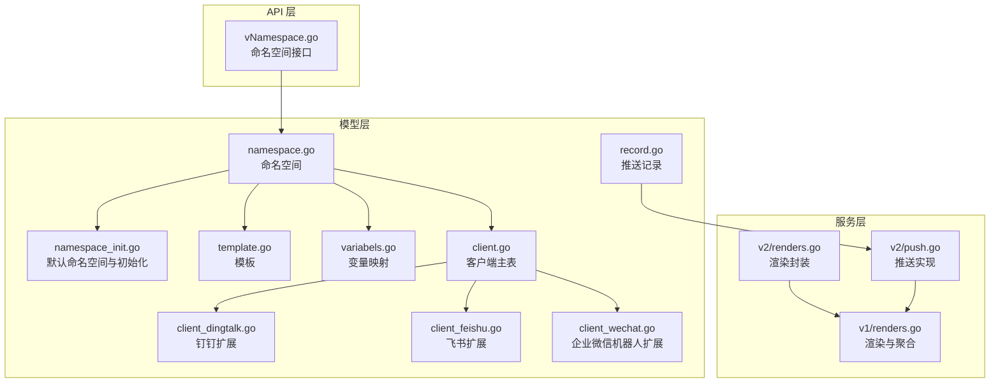
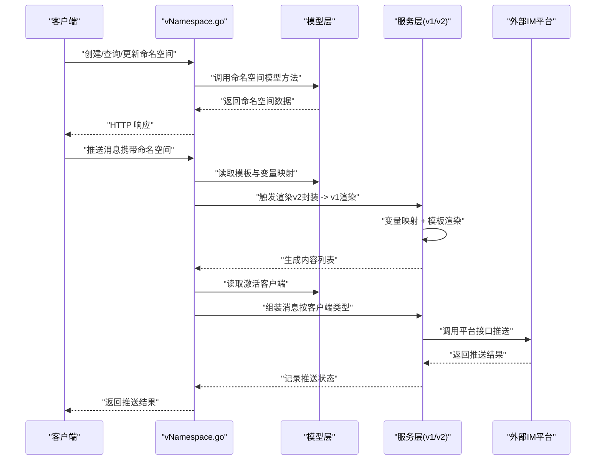
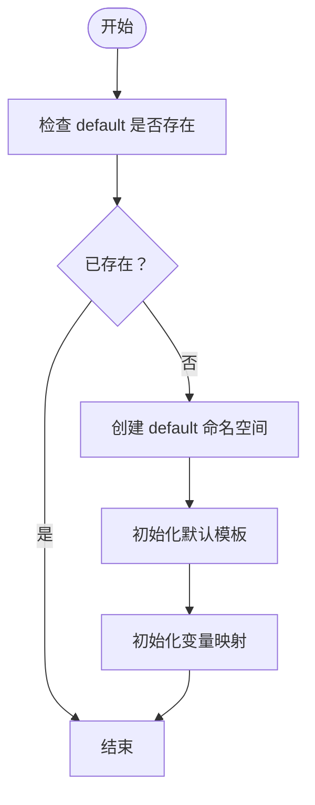
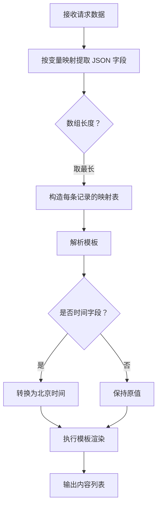
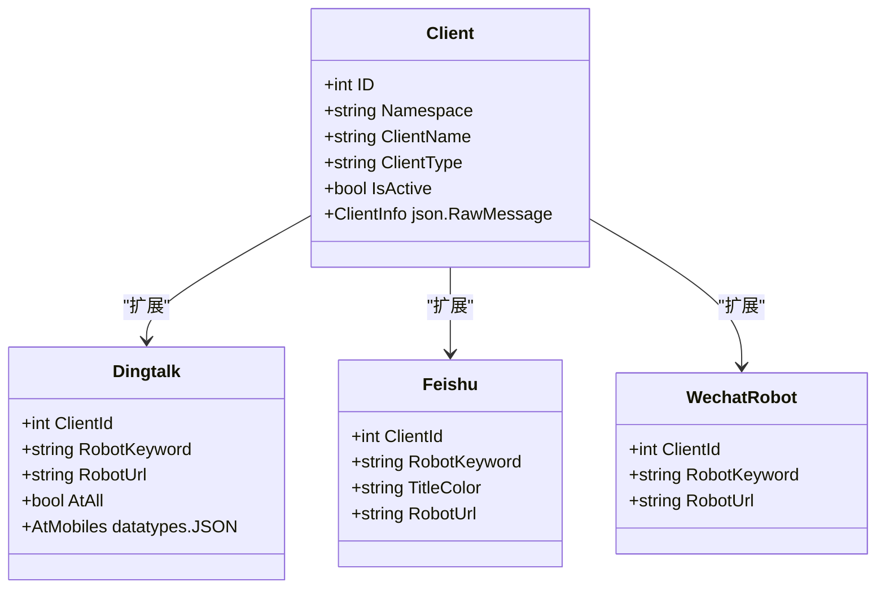
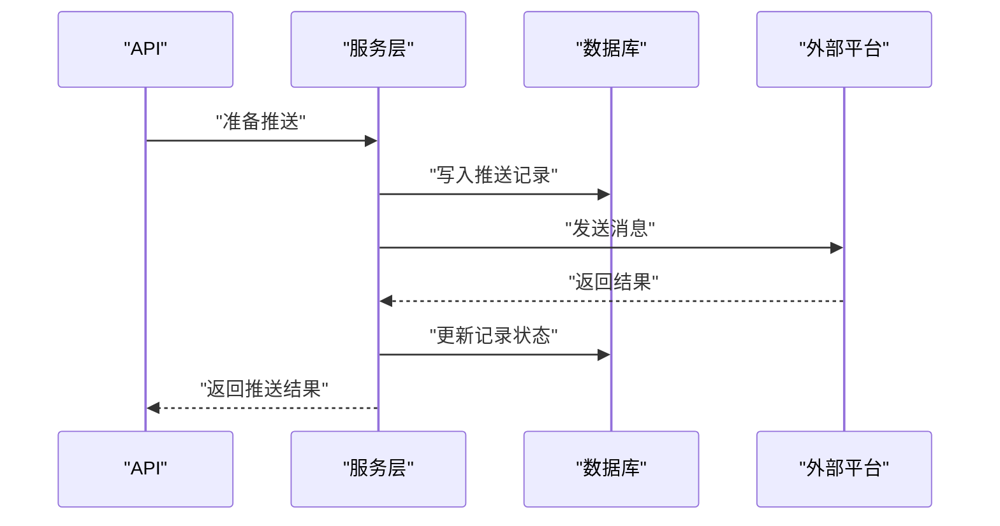
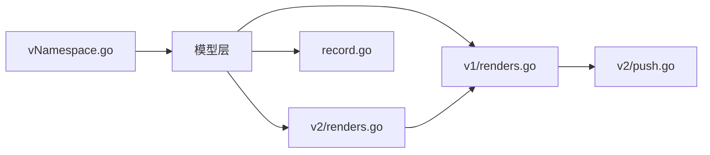

# 核心概念

<cite>
**本文引用的文件**
- [pkg/models/namespace.go](file://pkg/models/namespace.go)
- [pkg/api/vNamespace.go](file://pkg/api/vNamespace.go)
- [pkg/models/namespace_init.go](file://pkg/models/namespace_init.go)
- [pkg/models/template.go](file://pkg/models/template.go)
- [pkg/models/variabels.go](file://pkg/models/variabels.go)
- [pkg/services/core/v1/renders.go](file://pkg/services/core/v1/renders.go)
- [pkg/services/core/v2/renders.go](file://pkg/services/core/v2/renders.go)
- [pkg/models/client.go](file://pkg/models/client.go)
- [pkg/models/client_dingtalk.go](file://pkg/models/client_dingtalk.go)
- [pkg/models/client_feishu.go](file://pkg/models/client_feishu.go)
- [pkg/models/client_wechat.go](file://pkg/models/client_wechat.go)
- [pkg/utils/constants.go](file://pkg/utils/constants.go)
- [pkg/services/core/v2/push.go](file://pkg/services/core/v2/push.go)
- [pkg/models/record.go](file://pkg/models/record.go)
</cite>

## 目录
1. [引言](#引言)
2. [项目结构](#项目结构)
3. [核心组件](#核心组件)
4. [架构总览](#架构总览)
5. [详细组件分析](#详细组件分析)
6. [依赖分析](#依赖分析)
7. [性能考虑](#性能考虑)
8. [故障排查指南](#故障排查指南)
9. [结论](#结论)
10. [附录](#附录)

## 引言
本文件面向初学者与高级用户，系统性阐述 GoMessage 的核心概念与实现要点，重点覆盖以下主题：
- 命名空间（Namespace）：多租户隔离、创建与管理、默认通道初始化
- 消息模板系统：JSON 变量映射、模板语法、渲染流程
- 客户端管理：多平台客户端类型、配置与持久化、激活策略
- 推送记录与状态管理：记录入库、状态流转与可观测性

目标是帮助读者快速理解并正确使用命名空间、模板与客户端配置，并在生产环境中安全、稳定地运行。

## 项目结构
围绕核心概念，GoMessage 在后端采用分层设计：
- 数据模型层：命名空间、模板、变量映射、客户端及扩展表
- API 层：命名空间 CRUD、模板与变量映射的读写接口
- 服务层：渲染引擎（v1/v2）、消息组装与推送
- 工具与常量：客户端类型常量、日志与数据库工具

图表来源
- [pkg/api/vNamespace.go:1-149](file://pkg/api/vNamespace.go#L1-L149)
- [pkg/models/namespace.go:1-106](file://pkg/models/namespace.go#L1-L106)
- [pkg/models/namespace_init.go:1-94](file://pkg/models/namespace_init.go#L1-L94)
- [pkg/models/template.go:1-72](file://pkg/models/template.go#L1-L72)
- [pkg/models/variabels.go:1-89](file://pkg/models/variabels.go#L1-L89)
- [pkg/models/client.go:1-239](file://pkg/models/client.go#L1-L239)
- [pkg/models/client_dingtalk.go:1-38](file://pkg/models/client_dingtalk.go#L1-L38)
- [pkg/models/client_feishu.go:1-24](file://pkg/models/client_feishu.go#L1-L24)
- [pkg/models/client_wechat.go:1-24](file://pkg/models/client_wechat.go#L1-L24)
- [pkg/services/core/v1/renders.go:1-127](file://pkg/services/core/v1/renders.go#L1-L127)
- [pkg/services/core/v2/renders.go:1-29](file://pkg/services/core/v2/renders.go#L1-L29)
- [pkg/services/core/v2/push.go:1-107](file://pkg/services/core/v2/push.go#L1-L107)
- [pkg/models/record.go:1-29](file://pkg/models/record.go#L1-L29)

章节来源
- [pkg/api/vNamespace.go:1-149](file://pkg/api/vNamespace.go#L1-L149)
- [pkg/models/namespace.go:1-106](file://pkg/models/namespace.go#L1-L106)
- [pkg/models/namespace_init.go:1-94](file://pkg/models/namespace_init.go#L1-L94)
- [pkg/models/template.go:1-72](file://pkg/models/template.go#L1-L72)
- [pkg/models/variabels.go:1-89](file://pkg/models/variabels.go#L1-L89)
- [pkg/models/client.go:1-239](file://pkg/models/client.go#L1-L239)
- [pkg/models/client_dingtalk.go:1-38](file://pkg/models/client_dingtalk.go#L1-L38)
- [pkg/models/client_feishu.go:1-24](file://pkg/models/client_feishu.go#L1-L24)
- [pkg/models/client_wechat.go:1-24](file://pkg/models/client_wechat.go#L1-L24)
- [pkg/services/core/v1/renders.go:1-127](file://pkg/services/core/v1/renders.go#L1-L127)
- [pkg/services/core/v2/renders.go:1-29](file://pkg/services/core/v2/renders.go#L1-L29)
- [pkg/services/core/v2/push.go:1-107](file://pkg/services/core/v2/push.go#L1-L107)
- [pkg/models/record.go:1-29](file://pkg/models/record.go#L1-L29)

## 核心组件
- 命名空间（Namespace）
  - 多租户隔离单元，具备唯一名称、激活状态、渲染开关与描述
  - 支持创建、查询、更新、按激活状态筛选与删除（软删除+重命名）
- 消息模板（Template）
  - 绑定命名空间，存储模板名、模板内容与是否合并标志
  - 提供增删查改与按命名空间查询
- 变量映射（Variables）
  - 将 JSON 路径映射到 N1..N9 等占位符，用于模板渲染
  - 支持按命名空间列出与批量更新
- 客户端（Client）
  - 主表包含类型、名称、描述、激活状态与命名空间
  - 通过扩展表保存各平台特有配置（钉钉、飞书、企业微信机器人、企业微信应用）
  - 支持按命名空间列出、获取激活客户端、更新激活状态
- 推送记录（Record）
  - 记录推送来源 IP、命名空间、URL 与客户端集合，便于审计与追踪

章节来源
- [pkg/models/namespace.go:12-26](file://pkg/models/namespace.go#L12-L26)
- [pkg/models/namespace.go:28-105](file://pkg/models/namespace.go#L28-L105)
- [pkg/models/template.go:9-22](file://pkg/models/template.go#L9-L22)
- [pkg/models/template.go:24-71](file://pkg/models/template.go#L24-L71)
- [pkg/models/variabels.go:9-22](file://pkg/models/variabels.go#L9-L22)
- [pkg/models/variabels.go:24-88](file://pkg/models/variabels.go#L24-L88)
- [pkg/models/client.go:13-38](file://pkg/models/client.go#L13-L38)
- [pkg/models/client.go:40-238](file://pkg/models/client.go#L40-L238)
- [pkg/models/record.go:9-22](file://pkg/models/record.go#L9-L22)
- [pkg/models/record.go:24-28](file://pkg/models/record.go#L24-L28)

## 架构总览
下图展示从 API 到模型、服务与外部平台的整体交互路径，以及渲染与推送的关键节点。

图表来源
- [pkg/api/vNamespace.go:15-148](file://pkg/api/vNamespace.go#L15-L148)
- [pkg/models/namespace.go:28-105](file://pkg/models/namespace.go#L28-L105)
- [pkg/models/template.go:24-71](file://pkg/models/template.go#L24-L71)
- [pkg/models/variabels.go:24-88](file://pkg/models/variabels.go#L24-L88)
- [pkg/models/client.go:230-238](file://pkg/models/client.go#L230-L238)
- [pkg/services/core/v2/renders.go:14-28](file://pkg/services/core/v2/renders.go#L14-L28)
- [pkg/services/core/v1/renders.go:15-127](file://pkg/services/core/v1/renders.go#L15-L127)
- [pkg/services/core/v2/push.go:19-78](file://pkg/services/core/v2/push.go#L19-L78)

## 详细组件分析

### 命名空间（Namespace）与多租户隔离
- 设计要点
  - 唯一名称约束，避免重复；默认激活与渲染开关可独立控制
  - 删除采用“软删除 + 名称重命名”策略，保留审计痕迹
  - 支持按激活状态过滤查询，便于运维筛选
- 默认命名空间初始化
  - 应用启动时仅初始化一次“default”命名空间，并自动注入默认模板与变量映射
- API 行为
  - 创建命名空间后，自动初始化模板与变量映射
  - 删除命名空间时，事务内级联删除该命名空间下的模板、变量映射与客户端

图表来源
- [pkg/models/namespace_init.go:8-31](file://pkg/models/namespace_init.go#L8-L31)
- [pkg/models/namespace_init.go:33-77](file://pkg/models/namespace_init.go#L33-L77)
- [pkg/models/namespace_init.go:79-93](file://pkg/models/namespace_init.go#L79-L93)

章节来源
- [pkg/models/namespace.go:12-26](file://pkg/models/namespace.go#L12-L26)
- [pkg/models/namespace.go:28-105](file://pkg/models/namespace.go#L28-L105)
- [pkg/api/vNamespace.go:15-55](file://pkg/api/vNamespace.go#L15-L55)
- [pkg/api/vNamespace.go:98-148](file://pkg/api/vNamespace.go#L98-L148)
- [pkg/models/namespace_init.go:8-31](file://pkg/models/namespace_init.go#L8-L31)
- [pkg/models/namespace_init.go:33-77](file://pkg/models/namespace_init.go#L33-L77)
- [pkg/models/namespace_init.go:79-93](file://pkg/models/namespace_init.go#L79-L93)

### 消息模板系统：JSON 模板语法、变量映射与渲染流程
- 变量映射
  - 将 JSON 路径映射到 N1..N9 占位符，支持数组索引占位（例如 alerts.#.labels.alertname）
  - 按命名空间批量更新映射，保证渲染一致性
- 模板内容
  - 存储命名空间绑定的模板文本与“是否合并”标志
  - 渲染时使用 Go 内置 html/template，支持条件分支与格式化
- 渲染流程（v1）
  - 解析模板 → 遍历映射值 → 时间格式标准化 → 执行模板 → 输出内容列表
- 渲染封装（v2）
  - 对 v1 的封装，统一入口：是否渲染 → 变量映射 → 模板渲染 → 返回内容列表

图表来源
- [pkg/services/core/v1/renders.go:69-102](file://pkg/services/core/v1/renders.go#L69-L102)
- [pkg/services/core/v1/renders.go:15-67](file://pkg/services/core/v1/renders.go#L15-L67)
- [pkg/services/core/v2/renders.go:14-28](file://pkg/services/core/v2/renders.go#L14-L28)

章节来源
- [pkg/models/template.go:9-22](file://pkg/models/template.go#L9-L22)
- [pkg/models/template.go:24-71](file://pkg/models/template.go#L24-L71)
- [pkg/models/variabels.go:9-22](file://pkg/models/variabels.go#L9-L22)
- [pkg/models/variabels.go:24-88](file://pkg/models/variabels.go#L24-L88)
- [pkg/services/core/v1/renders.go:15-127](file://pkg/services/core/v1/renders.go#L15-L127)
- [pkg/services/core/v2/renders.go:14-28](file://pkg/services/core/v2/renders.go#L14-L28)

### 客户端管理：类型、配置与激活策略
- 类型与常量
  - 钉钉、飞书、企业微信机器人、企业微信应用四类
- 配置持久化
  - 主表保存通用信息（名称、类型、描述、激活状态、命名空间）
  - 扩展表保存各平台特有字段（如机器人 URL 列表、关键词、At 配置等）
  - 创建/更新时同步扩展表，支持随机 URL 列表与 At 配置
- 激活策略
  - 仅激活客户端参与推送；按命名空间查询激活客户端

图表来源
- [pkg/models/client.go:13-38](file://pkg/models/client.go#L13-L38)
- [pkg/models/client_dingtalk.go:21-37](file://pkg/models/client_dingtalk.go#L21-L37)
- [pkg/models/client_feishu.go:8-23](file://pkg/models/client_feishu.go#L8-L23)
- [pkg/models/client_wechat.go:8-23](file://pkg/models/client_wechat.go#L8-L23)
- [pkg/utils/constants.go:3-8](file://pkg/utils/constants.go#L3-L8)

章节来源
- [pkg/models/client.go:13-38](file://pkg/models/client.go#L13-L38)
- [pkg/models/client.go:40-238](file://pkg/models/client.go#L40-L238)
- [pkg/models/client_dingtalk.go:13-37](file://pkg/models/client_dingtalk.go#L13-L37)
- [pkg/models/client_feishu.go:8-23](file://pkg/models/client_feishu.go#L8-L23)
- [pkg/models/client_wechat.go:8-23](file://pkg/models/client_wechat.go#L8-L23)
- [pkg/utils/constants.go:3-8](file://pkg/utils/constants.go#L3-L8)

### 推送记录与状态管理
- 记录字段
  - 包含来源 IP、命名空间、URL 与客户端集合，便于审计与回溯
- 入库时机
  - 推送前或后由服务层统一记录，确保可观测性
- 状态管理
  - 结合外部平台返回码与日志，形成推送状态闭环

图表来源
- [pkg/models/record.go:9-22](file://pkg/models/record.go#L9-L22)
- [pkg/models/record.go:24-28](file://pkg/models/record.go#L24-L28)
- [pkg/services/core/v2/push.go:19-78](file://pkg/services/core/v2/push.go#L19-L78)

章节来源
- [pkg/models/record.go:9-22](file://pkg/models/record.go#L9-L22)
- [pkg/models/record.go:24-28](file://pkg/models/record.go#L24-L28)
- [pkg/services/core/v2/push.go:19-78](file://pkg/services/core/v2/push.go#L19-L78)

## 依赖分析
- 组件耦合
  - API 层依赖模型层；服务层依赖模型层与第三方 SDK
  - 客户端扩展表与主表通过 ClientId 关联，避免跨表复杂 JOIN
- 外部依赖
  - JSON 路径解析使用 gjson
  - 模板渲染使用 Go html/template
  - HTTP 推送使用标准库 net/http
- 循环依赖
  - 未发现循环导入；各层职责清晰

图表来源
- [pkg/api/vNamespace.go:1-149](file://pkg/api/vNamespace.go#L1-L149)
- [pkg/models/namespace.go:1-106](file://pkg/models/namespace.go#L1-L106)
- [pkg/models/template.go:1-72](file://pkg/models/template.go#L1-L72)
- [pkg/models/variabels.go:1-89](file://pkg/models/variabels.go#L1-L89)
- [pkg/models/client.go:1-239](file://pkg/models/client.go#L1-L239)
- [pkg/services/core/v1/renders.go:1-127](file://pkg/services/core/v1/renders.go#L1-L127)
- [pkg/services/core/v2/renders.go:1-29](file://pkg/services/core/v2/renders.go#L1-L29)
- [pkg/services/core/v2/push.go:1-107](file://pkg/services/core/v2/push.go#L1-L107)
- [pkg/models/record.go:1-29](file://pkg/models/record.go#L1-L29)

章节来源
- [pkg/api/vNamespace.go:1-149](file://pkg/api/vNamespace.go#L1-L149)
- [pkg/models/namespace.go:1-106](file://pkg/models/namespace.go#L1-L106)
- [pkg/models/template.go:1-72](file://pkg/models/template.go#L1-L72)
- [pkg/models/variabels.go:1-89](file://pkg/models/variabels.go#L1-L89)
- [pkg/models/client.go:1-239](file://pkg/models/client.go#L1-L239)
- [pkg/services/core/v1/renders.go:1-127](file://pkg/services/core/v1/renders.go#L1-L127)
- [pkg/services/core/v2/renders.go:1-29](file://pkg/services/core/v2/renders.go#L1-L29)
- [pkg/services/core/v2/push.go:1-107](file://pkg/services/core/v2/push.go#L1-L107)
- [pkg/models/record.go:1-29](file://pkg/models/record.go#L1-L29)

## 性能考虑
- 渲染性能
  - 使用 gjson 快速提取数组长度与字段，避免全量解析
  - 模板解析仅在首次渲染时发生，后续复用模板对象
- 数据库访问
  - 按命名空间查询模板与变量映射，减少无关扫描
  - 批量更新变量映射时先清空再写入，降低并发冲突
- 推送性能
  - 客户端 URL 支持随机列表，提升可用性与容错
  - 微信应用推送需获取 access_token，建议缓存与复用

## 故障排查指南
- 命名空间
  - 创建失败：检查唯一性约束与数据库连接
  - 删除失败：确认事务回滚原因（模板/变量/客户端删除）
- 模板与变量
  - 渲染报错：检查模板语法与变量映射路径是否匹配
  - 时间显示异常：确认时区设置与 RFC3339 格式
- 客户端
  - 激活状态无效：确认 IsActive 字段与按命名空间查询逻辑
  - 平台推送失败：检查 URL 列表、关键词与平台凭据
- 记录
  - 无法入库：检查数据库连接与字段约束
  - 状态缺失：确认推送后是否更新记录状态

章节来源
- [pkg/api/vNamespace.go:15-55](file://pkg/api/vNamespace.go#L15-L55)
- [pkg/api/vNamespace.go:98-148](file://pkg/api/vNamespace.go#L98-L148)
- [pkg/services/core/v1/renders.go:15-67](file://pkg/services/core/v1/renders.go#L15-L67)
- [pkg/services/core/v2/push.go:19-78](file://pkg/services/core/v2/push.go#L19-L78)
- [pkg/models/record.go:24-28](file://pkg/models/record.go#L24-L28)

## 结论
通过命名空间实现多租户隔离，结合模板与变量映射完成灵活的消息渲染，并以客户端扩展表支撑多平台推送。服务层在 v1/v2 间形成清晰的抽象边界，既满足初学者快速上手，也为高级用户提供可扩展的实现细节。配合推送记录与日志体系，系统具备良好的可观测性与可维护性。

## 附录
- 实际使用场景示例（路径指引）
  - 创建命名空间并初始化模板与变量映射：[创建接口:34-55](file://pkg/api/vNamespace.go#L34-L55)
  - 按激活状态查询命名空间：[查询接口:15-32](file://pkg/api/vNamespace.go#L15-L32)
  - 删除命名空间并级联清理：[删除接口:98-148](file://pkg/api/vNamespace.go#L98-L148)
  - 渲染流程（变量映射 → 模板渲染）：[v1 渲染:69-102](file://pkg/services/core/v1/renders.go#L69-L102), [v2 封装:14-28](file://pkg/services/core/v2/renders.go#L14-L28)
  - 客户端创建与扩展表同步：[创建逻辑:40-87](file://pkg/models/client.go#L40-L87)
  - 激活客户端查询与推送：[激活查询:230-238](file://pkg/models/client.go#L230-L238), [微信推送:24-78](file://pkg/services/core/v2/push.go#L24-L78)
  - 推送记录写入：[记录模型:24-28](file://pkg/models/record.go#L24-L28)