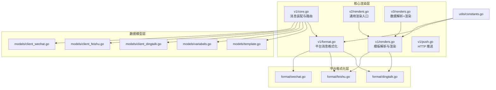
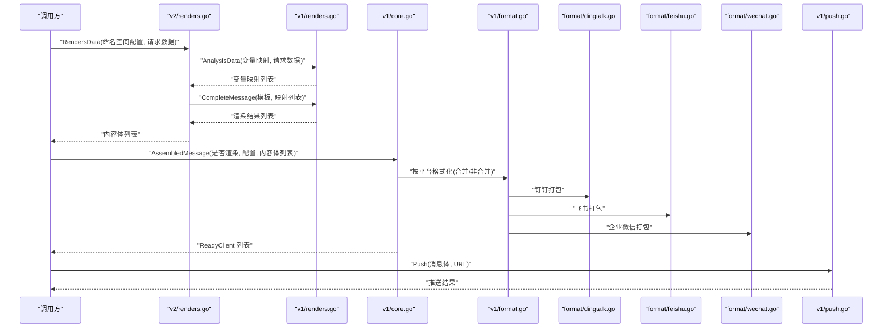
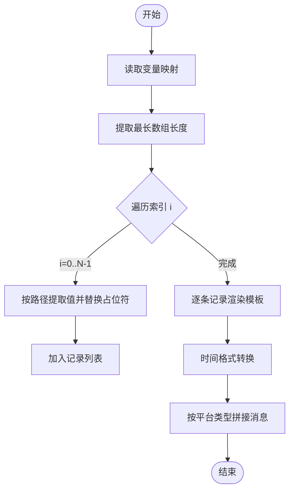
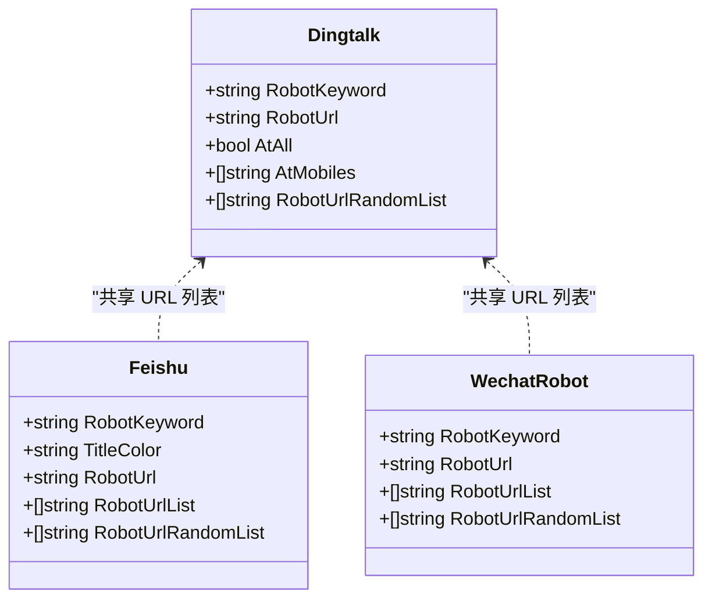
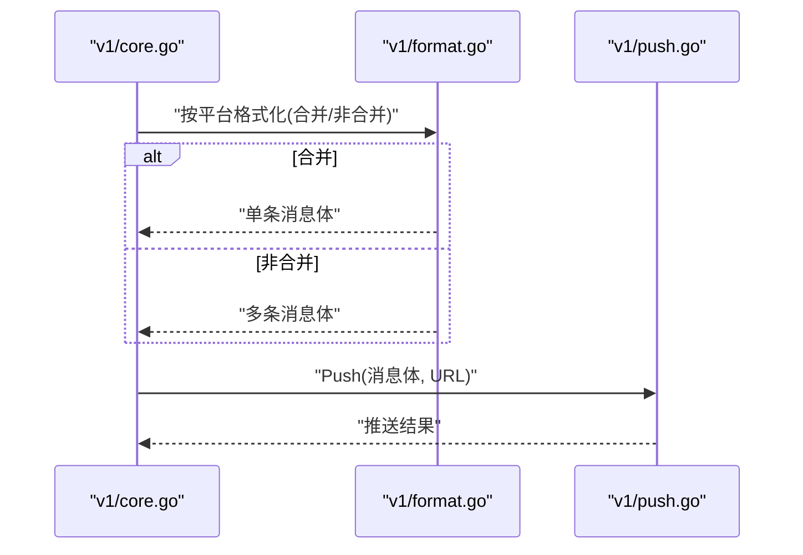
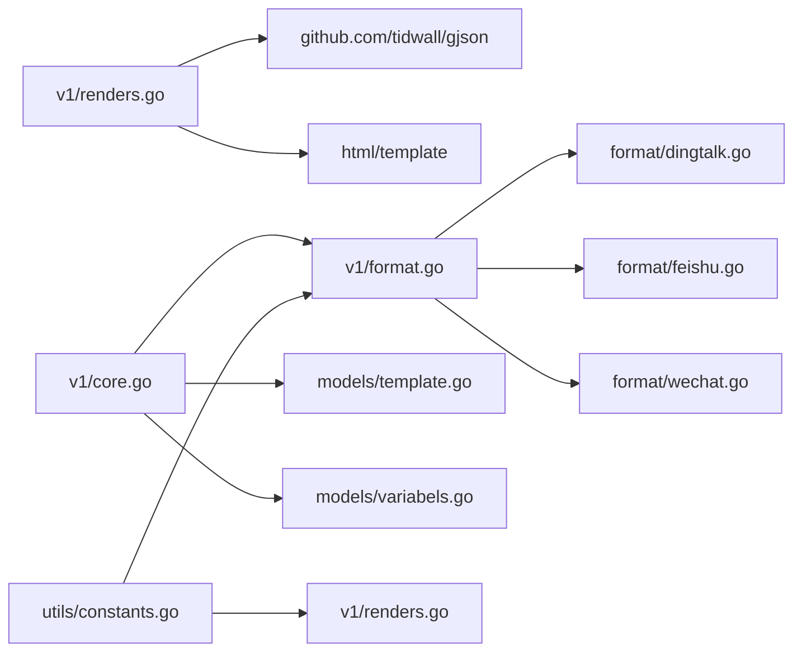

# 模板渲染机制

<cite>
**本文引用的文件**
- [pkg/services/core/v1/renders.go](file://pkg/services/core/v1/renders.go)
- [pkg/services/core/v1/format.go](file://pkg/services/core/v1/format.go)
- [pkg/services/core/v1/push.go](file://pkg/services/core/v1/push.go)
- [pkg/services/core/v1/core.go](file://pkg/services/core/v1/core.go)
- [pkg/services/core/v2/renders.go](file://pkg/services/core/v2/renders.go)
- [pkg/services/core/v3/renders.go](file://pkg/services/core/v3/renders.go)
- [pkg/services/format/dingtalk.go](file://pkg/services/format/dingtalk.go)
- [pkg/services/format/feishu.go](file://pkg/services/format/feishu.go)
- [pkg/services/format/wechat.go](file://pkg/services/format/wechat.go)
- [pkg/models/template.go](file://pkg/models/template.go)
- [pkg/models/variabels.go](file://pkg/models/variabels.go)
- [pkg/models/client_dingtalk.go](file://pkg/models/client_dingtalk.go)
- [pkg/models/client_feishu.go](file://pkg/models/client_feishu.go)
- [pkg/models/client_wechat.go](file://pkg/models/client_wechat.go)
- [pkg/utils/constants.go](file://pkg/utils/constants.go)
</cite>

## 目录
1. [简介](#简介)
2. [项目结构](#项目结构)
3. [核心组件](#核心组件)
4. [架构总览](#架构总览)
5. [详细组件分析](#详细组件分析)
6. [依赖分析](#依赖分析)
7. [性能考虑](#性能考虑)
8. [故障排查指南](#故障排查指南)
9. [结论](#结论)
10. [附录](#附录)

## 简介
本文件系统性阐述模板渲染机制的完整工作流程，覆盖从模板加载、变量解析到最终消息生成与平台适配的全过程；解释变量替换算法（占位符识别、变量查找与值替换）的实现原理；说明模板合并（template_is_merge）的工作方式与适用场景；给出针对钉钉、飞书、企业微信等平台的适配策略；提供调试方法与错误处理机制；并总结性能优化与效率提升建议。

## 项目结构
模板渲染相关代码主要分布在以下层次：
- 核心渲染层：v1、v2、v3 多版本渲染接口与算法
- 平台格式化层：各平台消息体打包（钉钉、飞书、企业微信）
- 数据模型层：模板、变量、客户端配置等持久化结构
- 工具常量层：平台类型常量定义

图表来源
- [pkg/services/core/v1/renders.go:1-127](file://pkg/services/core/v1/renders.go#L1-L127)
- [pkg/services/core/v1/format.go:1-62](file://pkg/services/core/v1/format.go#L1-L62)
- [pkg/services/core/v1/push.go:1-58](file://pkg/services/core/v1/push.go#L1-L58)
- [pkg/services/core/v1/core.go:1-65](file://pkg/services/core/v1/core.go#L1-L65)
- [pkg/services/core/v2/renders.go:1-29](file://pkg/services/core/v2/renders.go#L1-L29)
- [pkg/services/core/v3/renders.go:1-59](file://pkg/services/core/v3/renders.go#L1-L59)
- [pkg/services/format/dingtalk.go:1-30](file://pkg/services/format/dingtalk.go#L1-L30)
- [pkg/services/format/feishu.go:1-61](file://pkg/services/format/feishu.go#L1-L61)
- [pkg/services/format/wechat.go:1-115](file://pkg/services/format/wechat.go#L1-L115)
- [pkg/models/template.go:1-72](file://pkg/models/template.go#L1-L72)
- [pkg/models/variabels.go:1-89](file://pkg/models/variabels.go#L1-L89)
- [pkg/models/client_dingtalk.go:1-38](file://pkg/models/client_dingtalk.go#L1-L38)
- [pkg/models/client_feishu.go:1-24](file://pkg/models/client_feishu.go#L1-L24)
- [pkg/models/client_wechat.go:1-24](file://pkg/models/client_wechat.go#L1-L24)
- [pkg/utils/constants.go:1-9](file://pkg/utils/constants.go#L1-L9)

章节来源
- [pkg/services/core/v1/renders.go:1-127](file://pkg/services/core/v1/renders.go#L1-L127)
- [pkg/services/core/v1/format.go:1-62](file://pkg/services/core/v1/format.go#L1-L62)
- [pkg/services/core/v1/push.go:1-58](file://pkg/services/core/v1/push.go#L1-L58)
- [pkg/services/core/v1/core.go:1-65](file://pkg/services/core/v1/core.go#L1-L65)
- [pkg/services/core/v2/renders.go:1-29](file://pkg/services/core/v2/renders.go#L1-L29)
- [pkg/services/core/v3/renders.go:1-59](file://pkg/services/core/v3/renders.go#L1-L59)
- [pkg/services/format/dingtalk.go:1-30](file://pkg/services/format/dingtalk.go#L1-L30)
- [pkg/services/format/feishu.go:1-61](file://pkg/services/format/feishu.go#L1-L61)
- [pkg/services/format/wechat.go:1-115](file://pkg/services/format/wechat.go#L1-L115)
- [pkg/models/template.go:1-72](file://pkg/models/template.go#L1-L72)
- [pkg/models/variabels.go:1-89](file://pkg/models/variabels.go#L1-L89)
- [pkg/models/client_dingtalk.go:1-38](file://pkg/models/client_dingtalk.go#L1-L38)
- [pkg/models/client_feishu.go:1-24](file://pkg/models/client_feishu.go#L1-L24)
- [pkg/models/client_wechat.go:1-24](file://pkg/models/client_wechat.go#L1-L24)
- [pkg/utils/constants.go:1-9](file://pkg/utils/constants.go#L1-L9)

## 核心组件
- 变量解析与模板渲染（v1）
  - 变量解析：基于 gjson 的路径提取，支持数组索引占位符，按最长数组长度展开为多条记录。
  - 模板渲染：使用 Go html/template 对每条记录渲染，内置时间格式转换与错误日志。
  - 消息聚合：按平台类型选择分隔符进行拼接。
- 多版本渲染入口（v2/v3）
  - v2：封装通用渲染结果结构，统一调用 v1 的解析与渲染。
  - v3：先解析数据，再调用 v1 完整消息渲染。
- 平台格式化（钉钉/飞书/企业微信）
  - 钉钉：Markdown 结构，支持 @ 手机号与全体成员。
  - 飞书：Interactive 卡片结构，支持标题颜色与关键字。
  - 企业微信：通过 AccessToken 获取后发送 Markdown。
- 消息装配与推送（v1/core）
  - 组装 ReadyClient，按客户端类型调用对应格式化函数，支持合并与非合并两种模式。
  - 推送：统一 JSON 序列化与 HTTP POST，记录请求/响应日志。

章节来源
- [pkg/services/core/v1/renders.go:15-127](file://pkg/services/core/v1/renders.go#L15-L127)
- [pkg/services/core/v2/renders.go:8-29](file://pkg/services/core/v2/renders.go#L8-L29)
- [pkg/services/core/v3/renders.go:10-59](file://pkg/services/core/v3/renders.go#L10-L59)
- [pkg/services/core/v1/format.go:10-62](file://pkg/services/core/v1/format.go#L10-L62)
- [pkg/services/core/v1/core.go:34-65](file://pkg/services/core/v1/core.go#L34-L65)
- [pkg/services/core/v1/push.go:15-58](file://pkg/services/core/v1/push.go#L15-L58)

## 架构总览
模板渲染的整体流程如下：
- 输入：命名空间配置、请求原始数据、模板内容、变量映射、客户端配置
- 变量解析：提取用户关注字段，按最长数组长度展开
- 模板渲染：逐条记录渲染为字符串列表
- 平台适配：按平台类型格式化消息体
- 合并策略：可选将多条消息合并为单条
- 推送：序列化并发送至各平台机器人或应用

图表来源
- [pkg/services/core/v2/renders.go:15-29](file://pkg/services/core/v2/renders.go#L15-L29)
- [pkg/services/core/v1/renders.go:69-127](file://pkg/services/core/v1/renders.go#L69-L127)
- [pkg/services/core/v1/core.go:34-65](file://pkg/services/core/v1/core.go#L34-L65)
- [pkg/services/core/v1/format.go:10-62](file://pkg/services/core/v1/format.go#L10-L62)
- [pkg/services/format/dingtalk.go:3-30](file://pkg/services/format/dingtalk.go#L3-L30)
- [pkg/services/format/feishu.go:8-61](file://pkg/services/format/feishu.go#L8-L61)
- [pkg/services/format/wechat.go:71-115](file://pkg/services/format/wechat.go#L71-L115)
- [pkg/services/core/v1/push.go:16-58](file://pkg/services/core/v1/push.go#L16-L58)

## 详细组件分析

### 变量解析与模板渲染（v1）
- 变量解析算法
  - 遍历用户提供的变量映射，每个键对应一个 gjson 路径表达式（支持数组占位符）。
  - 使用 gjson 提取数组长度，确定最长数组作为批次数。
  - 逐条记录构造键值映射，将占位符替换为当前索引，形成多条记录。
- 模板渲染
  - 逐条记录构建模板并执行渲染，内置时间格式转换（将 RFC3339 转换为本地时间字符串）。
  - 错误处理：模板解析失败或执行失败时记录日志并跳过该条记录。
- 消息聚合
  - 不同平台采用不同分隔符进行拼接，避免内容混排问题。

图表来源
- [pkg/services/core/v1/renders.go:69-127](file://pkg/services/core/v1/renders.go#L69-L127)

章节来源
- [pkg/services/core/v1/renders.go:69-127](file://pkg/services/core/v1/renders.go#L69-L127)

### 多版本渲染入口（v2/v3）
- v2 入口
  - 将是否渲染标记与解析/渲染流程封装在结构体中，便于统一调用。
- v3 入口
  - 先解析数据，再调用 v1 的完整渲染流程，适合更复杂的输入结构。

章节来源
- [pkg/services/core/v2/renders.go:8-29](file://pkg/services/core/v2/renders.go#L8-L29)
- [pkg/services/core/v3/renders.go:10-59](file://pkg/services/core/v3/renders.go#L10-L59)

### 平台适配策略
- 钉钉
  - 使用 Markdown 结构，支持机器人关键字、@ 手机号与全体成员。
  - 支持多 URL 随机轮询，提高可用性。
- 飞书
  - 使用 Interactive 卡片结构，支持标题颜色与关键字，内容为 Markdown。
- 企业微信
  - 先获取 AccessToken，再发送 Markdown 消息，支持用户与 AgentId。

图表来源
- [pkg/models/client_dingtalk.go:21-38](file://pkg/models/client_dingtalk.go#L21-L38)
- [pkg/models/client_feishu.go:8-24](file://pkg/models/client_feishu.go#L8-L24)
- [pkg/models/client_wechat.go:9-24](file://pkg/models/client_wechat.go#L9-L24)

章节来源
- [pkg/services/format/dingtalk.go:3-30](file://pkg/services/format/dingtalk.go#L3-L30)
- [pkg/services/format/feishu.go:8-61](file://pkg/services/format/feishu.go#L8-L61)
- [pkg/services/format/wechat.go:42-115](file://pkg/services/format/wechat.go#L42-L115)
- [pkg/models/client_dingtalk.go:21-38](file://pkg/models/client_dingtalk.go#L21-L38)
- [pkg/models/client_feishu.go:8-24](file://pkg/models/client_feishu.go#L8-L24)
- [pkg/models/client_wechat.go:9-24](file://pkg/models/client_wechat.go#L9-L24)

### 消息装配与推送
- 消息装配
  - 遍历激活客户端，按类型调用对应格式化函数，支持合并/非合并两种模式。
  - 合并模式：将多条消息按平台分隔符拼接为单条消息。
  - 非合并模式：每条消息独立包装为平台消息体。
- 推送
  - 统一 JSON 序列化与 HTTP POST，记录请求/响应日志，便于审计与排障。

图表来源
- [pkg/services/core/v1/core.go:34-65](file://pkg/services/core/v1/core.go#L34-L65)
- [pkg/services/core/v1/format.go:10-62](file://pkg/services/core/v1/format.go#L10-L62)
- [pkg/services/core/v1/push.go:16-58](file://pkg/services/core/v1/push.go#L16-L58)

章节来源
- [pkg/services/core/v1/core.go:34-65](file://pkg/services/core/v1/core.go#L34-L65)
- [pkg/services/core/v1/format.go:10-62](file://pkg/services/core/v1/format.go#L10-L62)
- [pkg/services/core/v1/push.go:16-58](file://pkg/services/core/v1/push.go#L16-L58)

### 模板合并机制（template_is_merge）
- 合并含义
  - 当启用合并时，将多条渲染结果按平台分隔符拼接为单条消息，减少推送次数。
- 适用场景
  - 大批量告警聚合展示、降低平台限流压力、提升用户体验。
- 实现位置
  - 在消息装配阶段根据配置决定是否调用聚合函数，随后统一格式化与推送。

章节来源
- [pkg/services/core/v1/format.go:14-24](file://pkg/services/core/v1/format.go#L14-L24)
- [pkg/services/core/v1/format.go:41-51](file://pkg/services/core/v1/format.go#L41-L51)
- [pkg/services/core/v1/renders.go:105-127](file://pkg/services/core/v1/renders.go#L105-L127)

### 模板与变量模型
- 模板模型
  - 包含命名空间、模板名称、模板内容、是否合并等字段。
- 变量模型
  - 包含命名空间、键、值、描述等字段，支持批量更新与查询。

章节来源
- [pkg/models/template.go:9-18](file://pkg/models/template.go#L9-L18)
- [pkg/models/variabels.go:9-18](file://pkg/models/variabels.go#L9-L18)

## 依赖分析
- 组件耦合
  - v1 渲染层与平台格式化层松耦合，通过常量与接口参数解耦。
  - v2/v3 仅负责编排与数据预处理，核心逻辑集中在 v1。
- 外部依赖
  - gjson：用于复杂 JSON 路径提取。
  - html/template：用于模板渲染。
  - HTTP 客户端：用于平台推送。
- 平台常量
  - 通过统一常量定义平台类型，避免魔法字符串。

图表来源
- [pkg/services/core/v1/renders.go:3-13](file://pkg/services/core/v1/renders.go#L3-L13)
- [pkg/services/core/v1/format.go:1-8](file://pkg/services/core/v1/format.go#L1-L8)
- [pkg/services/core/v1/core.go:1-8](file://pkg/services/core/v1/core.go#L1-L8)
- [pkg/models/template.go:1-7](file://pkg/models/template.go#L1-L7)
- [pkg/models/variabels.go:1-7](file://pkg/models/variabels.go#L1-L7)
- [pkg/utils/constants.go:3-9](file://pkg/utils/constants.go#L3-L9)

章节来源
- [pkg/services/core/v1/renders.go:3-13](file://pkg/services/core/v1/renders.go#L3-L13)
- [pkg/services/core/v1/format.go:1-8](file://pkg/services/core/v1/format.go#L1-L8)
- [pkg/services/core/v1/core.go:1-8](file://pkg/services/core/v1/core.go#L1-L8)
- [pkg/models/template.go:1-7](file://pkg/models/template.go#L1-L7)
- [pkg/models/variabels.go:1-7](file://pkg/models/variabels.go#L1-L7)
- [pkg/utils/constants.go:3-9](file://pkg/utils/constants.go#L3-L9)

## 性能考虑
- 变量解析
  - 仅提取用户关注字段，避免无关数据处理；按最长数组长度展开，避免重复扫描。
- 模板渲染
  - 每条记录独立解析模板，避免全局状态；时间格式转换仅对可解析时间执行。
- 平台适配
  - 合并模式减少推送次数，降低网络开销；URL 随机轮询提高可用性。
- 日志与监控
  - 统一记录请求/响应与耗时，便于定位性能瓶颈。

[本节为通用性能建议，无需特定文件来源]

## 故障排查指南
- 模板解析失败
  - 现象：模板解析报错并跳过该条记录。
  - 排查：检查模板语法、占位符是否匹配变量映射。
- 模板执行失败
  - 现象：模板执行报错并跳过该条记录。
  - 排查：检查数据类型与模板字段一致性。
- 时间格式转换失败
  - 现象：时间字段未按预期格式输出。
  - 排查：确认数据为 RFC3339 格式；检查时区加载是否成功。
- 平台推送失败
  - 现象：HTTP 请求失败或响应异常。
  - 排查：检查 URL、Token、网络连通性；查看日志中的请求/响应详情。
- 合并/非合并配置错误
  - 现象：消息过多或过少。
  - 排查：核对 IsMerge 配置与平台分隔符。

章节来源
- [pkg/services/core/v1/renders.go:26-29](file://pkg/services/core/v1/renders.go#L26-L29)
- [pkg/services/core/v1/renders.go:57-60](file://pkg/services/core/v1/renders.go#L57-L60)
- [pkg/services/core/v1/push.go:31-33](file://pkg/services/core/v1/push.go#L31-L33)
- [pkg/services/core/v1/format.go:14-24](file://pkg/services/core/v1/format.go#L14-L24)

## 结论
该模板渲染机制通过清晰的分层设计实现了从变量解析到平台适配的完整闭环。v1 层提供稳定的渲染与聚合能力，v2/v3 层提供灵活的编排入口；平台格式化层确保消息体符合各平台规范；通过合并策略与日志体系，兼顾了性能与可观测性。建议在生产环境中结合业务场景合理配置合并策略与超时重试，持续优化变量映射与模板结构以提升渲染效率。

[本节为总结性内容，无需特定文件来源]

## 附录
- 关键流程路径参考
  - 变量解析与渲染：[pkg/services/core/v1/renders.go:69-127](file://pkg/services/core/v1/renders.go#L69-L127)
  - 多版本入口：[pkg/services/core/v2/renders.go:15-29](file://pkg/services/core/v2/renders.go#L15-L29)、[pkg/services/core/v3/renders.go:10-59](file://pkg/services/core/v3/renders.go#L10-L59)
  - 平台格式化：[pkg/services/core/v1/format.go:10-62](file://pkg/services/core/v1/format.go#L10-L62)
  - 推送流程：[pkg/services/core/v1/push.go:16-58](file://pkg/services/core/v1/push.go#L16-L58)
  - 消息装配：[pkg/services/core/v1/core.go:34-65](file://pkg/services/core/v1/core.go#L34-L65)
  - 平台常量：[pkg/utils/constants.go:3-9](file://pkg/utils/constants.go#L3-L9)

[本节为参考清单，无需特定文件来源]