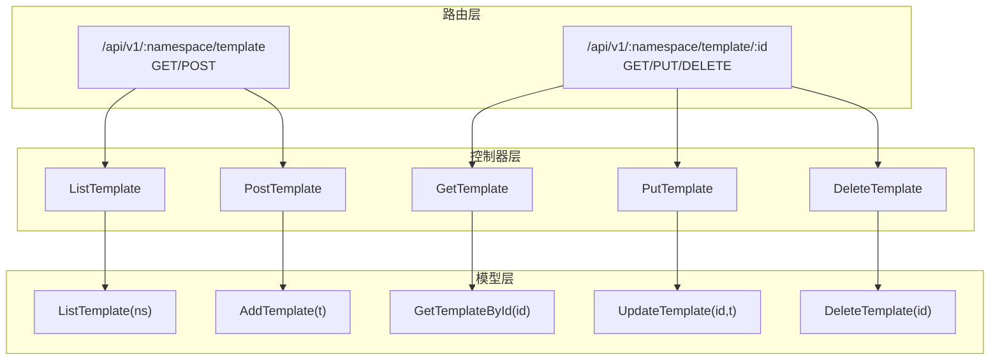
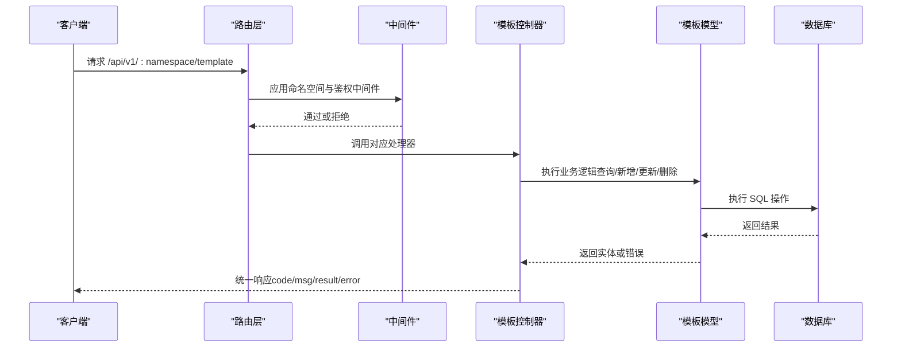
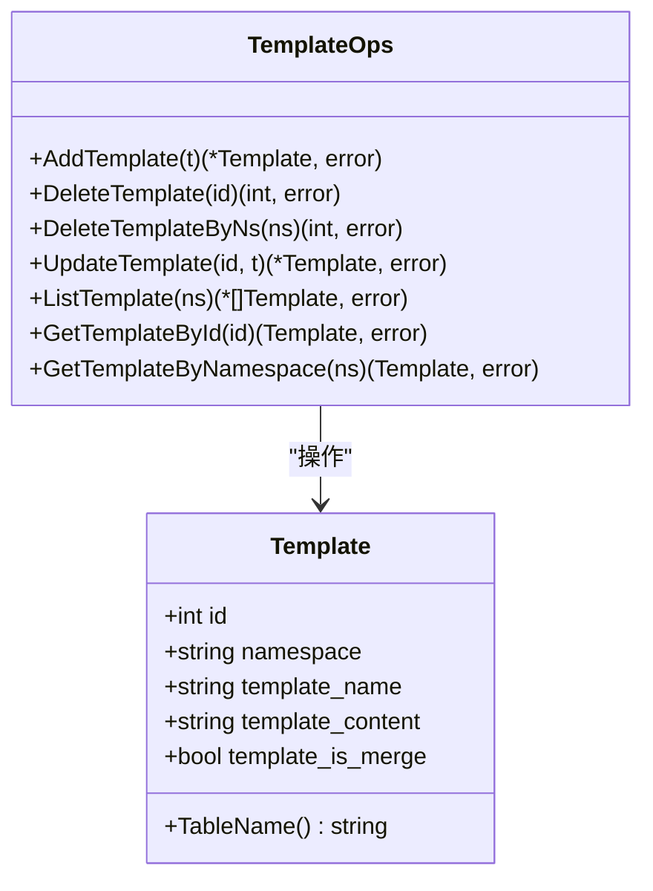
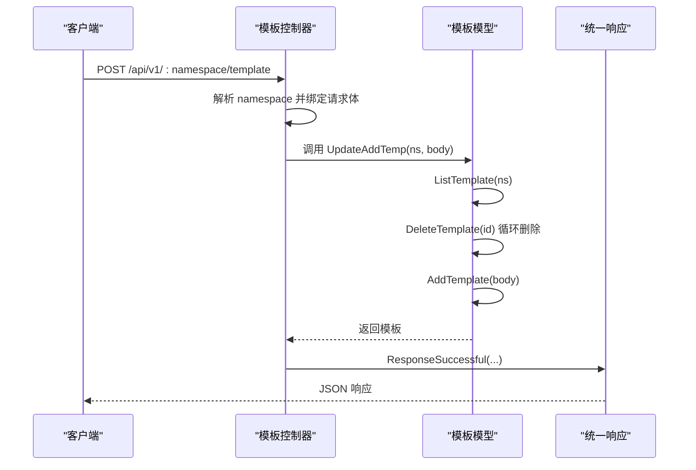
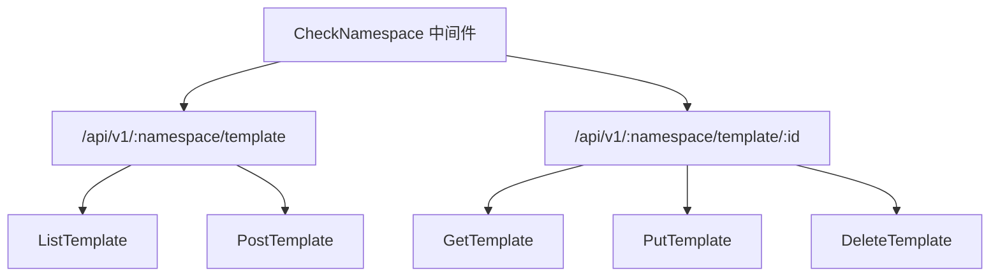
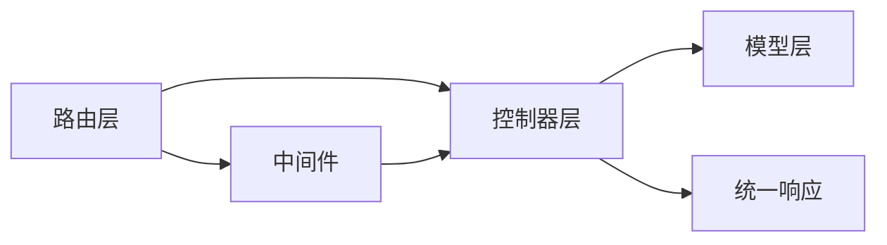

# 模板管理功能

<cite>
**本文引用的文件**
- [pkg/models/template.go](file://pkg/models/template.go)
- [pkg/api/vTemplate.go](file://pkg/api/vTemplate.go)
- [pkg/routers/urls.go](file://pkg/routers/urls.go)
- [pkg/utils/response.go](file://pkg/utils/response.go)
- [pkg/middleware/namespace.go](file://pkg/middleware/namespace.go)
- [pkg/models/namespace_init.go](file://pkg/models/namespace_init.go)
- [assets/docs/swagger.yaml](file://assets/docs/swagger.yaml)
- [wiki/response.md](file://wiki/response.md)
- [vue/src/service/requests.js](file://vue/src/service/requests.js)
</cite>

## 目录
1. [简介](#简介)
2. [项目结构](#项目结构)
3. [核心组件](#核心组件)
4. [架构总览](#架构总览)
5. [详细组件分析](#详细组件分析)
6. [依赖关系分析](#依赖关系分析)
7. [性能考量](#性能考量)
8. [故障排查指南](#故障排查指南)
9. [结论](#结论)
10. [附录](#附录)

## 简介
本文件面向模板管理功能，系统性阐述模板的 CRUD 操作接口与实现细节，覆盖创建、查询、更新、删除模板的完整流程；说明模板列表查询、按 ID 查询、按命名空间查询的实现方式；解释模板数据验证规则与业务逻辑约束（如命名空间唯一性检查与模板内容格式验证）；提供模板管理的 API 接口文档（请求参数、响应格式、错误码说明）；展示实际使用示例与最佳实践，并包含模板版本管理与批量操作的使用指南。

## 项目结构
模板管理功能由三层协作构成：
- 路由层：定义 REST 接口路径与中间件
- 控制器层：处理请求、参数校验、调用模型层并返回统一响应
- 模型层：封装数据库访问与业务逻辑（如模板的增删改查）

图表来源
- [pkg/routers/urls.go:75-86](file://pkg/routers/urls.go#L75-L86)
- [pkg/api/vTemplate.go:13-147](file://pkg/api/vTemplate.go#L13-L147)
- [pkg/models/template.go:24-71](file://pkg/models/template.go#L24-L71)

章节来源
- [pkg/routers/urls.go:58-90](file://pkg/routers/urls.go#L58-L90)
- [pkg/api/vTemplate.go:13-147](file://pkg/api/vTemplate.go#L13-L147)
- [pkg/models/template.go:9-71](file://pkg/models/template.go#L9-L71)

## 核心组件
- 模板模型：定义模板的数据结构与数据库表映射，提供增删改查与按命名空间查询等方法。
- 模板控制器：对接路由，负责参数解析、请求体绑定、调用模型层、返回统一响应。
- 路由注册：在 v1 分组下挂载模板相关接口，并应用命名空间中间件与鉴权中间件。
- 统一响应：规范响应结构，包含 code、msg、result、error 字段，便于前后端一致处理。
- 命名空间中间件：确保请求的命名空间存在，否则直接返回错误。

章节来源
- [pkg/models/template.go:9-71](file://pkg/models/template.go#L9-L71)
- [pkg/api/vTemplate.go:13-147](file://pkg/api/vTemplate.go#L13-L147)
- [pkg/routers/urls.go:58-90](file://pkg/routers/urls.go#L58-L90)
- [pkg/utils/response.go:3-27](file://pkg/utils/response.go#L3-L27)
- [pkg/middleware/namespace.go:20-46](file://pkg/middleware/namespace.go#L20-L46)

## 架构总览
模板管理采用典型的 MVC 架构，结合 Gin 路由与 GORM 数据库访问，通过中间件实现命名空间与鉴权控制。

图表来源
- [pkg/routers/urls.go:58-90](file://pkg/routers/urls.go#L58-L90)
- [pkg/middleware/namespace.go:20-46](file://pkg/middleware/namespace.go#L20-L46)
- [pkg/api/vTemplate.go:13-147](file://pkg/api/vTemplate.go#L13-L147)
- [pkg/models/template.go:24-71](file://pkg/models/template.go#L24-L71)

## 详细组件分析

### 模型层：模板数据结构与持久化
- 数据结构
  - 字段：id、namespace、template_name、template_content、template_is_merge、软删除标记 DeletedAt
  - 表名：templates
- 关键方法
  - 新增：AddTemplate
  - 删除：DeleteTemplate、DeleteTemplateByNs
  - 更新：UpdateTemplate（按 id）
  - 查询：
    - 列表：ListTemplate(ns)
    - 按 id：GetTemplateById(id)
    - 按命名空间：GetTemplateByNamespace(ns)

图表来源
- [pkg/models/template.go:9-71](file://pkg/models/template.go#L9-L71)

章节来源
- [pkg/models/template.go:9-71](file://pkg/models/template.go#L9-L71)

### 控制器层：模板接口实现
- 接口概览
  - GET /api/v1/:namespace/template → 列出命名空间下所有模板
  - POST /api/v1/:namespace/template → 新增模板（当前实现为“先清空同命名空间旧模板，再新增”）
  - GET /api/v1/:namespace/template/:id → 按 id 查询模板
  - PUT /api/v1/:namespace/template/:id → 更新模板
  - DELETE /api/v1/:namespace/template/:id → 删除模板
- 参数与校验
  - 路径参数：namespace、id（字符串转整型）
  - 请求体：JSON 绑定
  - 命名空间归属校验：查询到的模板 namespace 必须等于当前 namespace
- 响应
  - 成功：code=1，msg 描述，result 返回数据
  - 失败：code=0，msg 描述，error 返回错误对象

图表来源
- [pkg/api/vTemplate.go:27-64](file://pkg/api/vTemplate.go#L27-L64)
- [pkg/models/template.go:24-71](file://pkg/models/template.go#L24-L71)
- [pkg/utils/response.go:11-27](file://pkg/utils/response.go#L11-L27)

章节来源
- [pkg/api/vTemplate.go:13-147](file://pkg/api/vTemplate.go#L13-L147)
- [pkg/utils/response.go:3-27](file://pkg/utils/response.go#L3-L27)

### 路由层：接口注册与中间件
- v1 分组路由
  - GET /api/v1/:namespace/template → ListTemplate
  - POST /api/v1/:namespace/template → PostTemplate
  - GET/PUT/DELETE /api/v1/:namespace/template/:id → Get/Put/DeleteTemplate
- 中间件
  - CheckNamespace：校验命名空间是否存在
  - AuthMiddleware：鉴权（在 v1View 分组中应用）

图表来源
- [pkg/routers/urls.go:58-90](file://pkg/routers/urls.go#L58-L90)
- [pkg/middleware/namespace.go:20-46](file://pkg/middleware/namespace.go#L20-L46)

章节来源
- [pkg/routers/urls.go:58-90](file://pkg/routers/urls.go#L58-L90)
- [pkg/middleware/namespace.go:20-46](file://pkg/middleware/namespace.go#L20-L46)

### 响应与错误码约定
- 统一响应结构
  - code：1 成功，0 失败
  - msg：描述信息
  - result：成功时返回结果
  - error：失败时返回错误对象
- Swagger 文档
  - 模板接口路径已在 swagger.yaml 中声明，便于自动生成文档与测试

章节来源
- [pkg/utils/response.go:3-27](file://pkg/utils/response.go#L3-L27)
- [assets/docs/swagger.yaml:37-63](file://assets/docs/swagger.yaml#L37-L63)
- [wiki/response.md:1-43](file://wiki/response.md#L1-L43)

### 命名空间唯一性与模板内容格式
- 命名空间唯一性
  - 命名空间由 CheckNamespace 中间件校验，不存在则直接返回错误
  - 命名空间删除时会级联删除该命名空间下的模板、变量映射、客户端
- 模板内容格式
  - 模板内容为字符串，未在模型层进行格式校验
  - 默认模板内容为 Go 模板语法，用于渲染消息
  - 合并发送标志 template_is_merge 控制渲染后的消息是否合并发送

章节来源
- [pkg/middleware/namespace.go:20-46](file://pkg/middleware/namespace.go#L20-L46)
- [pkg/models/namespace_init.go:33-77](file://pkg/models/namespace_init.go#L33-L77)

## 依赖关系分析
- 控制器依赖模型层进行数据访问
- 路由层依赖控制器处理请求
- 统一响应工具为控制器提供标准化输出
- 中间件在路由层应用，影响控制器行为

图表来源
- [pkg/routers/urls.go:58-90](file://pkg/routers/urls.go#L58-L90)
- [pkg/api/vTemplate.go:13-147](file://pkg/api/vTemplate.go#L13-L147)
- [pkg/utils/response.go:3-27](file://pkg/utils/response.go#L3-L27)
- [pkg/middleware/namespace.go:20-46](file://pkg/middleware/namespace.go#L20-L46)

章节来源
- [pkg/routers/urls.go:58-90](file://pkg/routers/urls.go#L58-L90)
- [pkg/api/vTemplate.go:13-147](file://pkg/api/vTemplate.go#L13-L147)
- [pkg/utils/response.go:3-27](file://pkg/utils/response.go#L3-L27)
- [pkg/middleware/namespace.go:20-46](file://pkg/middleware/namespace.go#L20-L46)

## 性能考量
- 查询优化
  - 按命名空间查询使用 Where 条件，建议在 namespace 字段建立索引以提升查询效率
- 写入优化
  - 新增模板时先清空同命名空间旧模板再插入，适合“单模板命名空间”的场景；若需保留历史版本，建议改为版本号字段或历史表
- 并发与事务
  - 删除命名空间时使用事务保证一致性，避免部分删除导致的数据不一致

章节来源
- [pkg/models/template.go:55-71](file://pkg/models/template.go#L55-L71)
- [pkg/api/vNamespace.go:114-144](file://pkg/api/vNamespace.go#L114-L144)

## 故障排查指南
- 常见错误与定位
  - 参数错误：路径参数 id 非法或 namespace 不存在
  - 查询失败：数据库查询异常或记录不存在
  - 更新/删除失败：数据库更新/删除异常
  - 命名空间错误：模板不属于当前命名空间
- 统一响应结构
  - code=0 时，error 字段包含错误详情，便于定位问题
- 建议排查步骤
  - 检查路由是否正确匹配（命名空间中间件是否生效）
  - 核对请求体 JSON 结构与字段类型
  - 查看数据库日志与模型层返回的错误

章节来源
- [pkg/api/vTemplate.go:70-146](file://pkg/api/vTemplate.go#L70-L146)
- [pkg/utils/response.go:3-27](file://pkg/utils/response.go#L3-L27)

## 结论
模板管理功能通过清晰的分层设计与统一响应机制，提供了完整的 CRUD 能力。当前实现采用“命名空间内单模板”的策略，便于简化管理；若未来需要版本管理与批量操作，可在现有基础上扩展版本号字段、历史表与批量接口。

## 附录

### API 接口文档

- 获取所有消息模板
  - 方法：GET
  - 路径：/api/v1/:namespace/template
  - 路由注册：[pkg/routers/urls.go:75-76](file://pkg/routers/urls.go#L75-L76)
  - 控制器：[pkg/api/vTemplate.go:13-25](file://pkg/api/vTemplate.go#L13-L25)
  - 请求参数：路径参数 namespace
  - 响应：统一响应结构，成功时 result 为模板数组
  - 错误：命名空间不存在或查询异常

- 新增消息模板
  - 方法：POST
  - 路径：/api/v1/:namespace/template
  - 路由注册：[pkg/routers/urls.go:75-77](file://pkg/routers/urls.go#L75-L77)
  - 控制器：[pkg/api/vTemplate.go:27-47](file://pkg/api/vTemplate.go#L27-L47)
  - 请求体：JSON，包含 template_name、template_content、template_is_merge 等字段
  - 业务逻辑：先清空同命名空间旧模板，再新增
  - 响应：统一响应结构，成功时 result 为新增模板
  - 错误：请求体绑定失败、命名空间不存在、新增失败

- 查询一个消息模板
  - 方法：GET
  - 路径：/api/v1/:namespace/template/:id
  - 路由注册：[pkg/routers/urls.go:75-77](file://pkg/routers/urls.go#L75-L77)
  - 控制器：[pkg/api/vTemplate.go:66-86](file://pkg/api/vTemplate.go#L66-L86)
  - 请求参数：路径参数 namespace、id
  - 业务逻辑：校验模板属于当前命名空间
  - 响应：统一响应结构，成功时 result 为模板详情
  - 错误：参数非法、模板不存在、命名空间不匹配

- 修改一个消息模板
  - 方法：PUT
  - 路径：/api/v1/:namespace/template/:id
  - 路由注册：[pkg/routers/urls.go:75-77](file://pkg/routers/urls.go#L75-L77)
  - 控制器：[pkg/api/vTemplate.go:88-119](file://pkg/api/vTemplate.go#L88-L119)
  - 请求体：JSON，包含 template_name、template_content、template_is_merge 等字段
  - 业务逻辑：校验模板属于当前命名空间
  - 响应：统一响应结构，成功时 result 为更新后的模板
  - 错误：参数非法、模板不存在、命名空间不匹配、更新失败

- 删除一个消息模板
  - 方法：DELETE
  - 路径：/api/v1/:namespace/template/:id
  - 路由注册：[pkg/routers/urls.go:75-77](file://pkg/routers/urls.go#L75-L77)
  - 控制器：[pkg/api/vTemplate.go:121-146](file://pkg/api/vTemplate.go#L121-L146)
  - 请求参数：路径参数 namespace、id
  - 业务逻辑：校验模板属于当前命名空间
  - 响应：统一响应结构，成功时 result 为受影响行数
  - 错误：参数非法、模板不存在、命名空间不匹配、删除失败

- 统一响应结构
  - 字段：code、msg、result、error
  - 参考：[pkg/utils/response.go:3-27](file://pkg/utils/response.go#L3-L27)
  - 示例：[wiki/response.md:11-40](file://wiki/response.md#L11-L40)

- Swagger 文档
  - 模板接口路径已在 swagger.yaml 中声明
  - 参考：[assets/docs/swagger.yaml:37-63](file://assets/docs/swagger.yaml#L37-L63)

章节来源
- [pkg/routers/urls.go:75-77](file://pkg/routers/urls.go#L75-L77)
- [pkg/api/vTemplate.go:13-147](file://pkg/api/vTemplate.go#L13-L147)
- [pkg/utils/response.go:3-27](file://pkg/utils/response.go#L3-L27)
- [assets/docs/swagger.yaml:37-63](file://assets/docs/swagger.yaml#L37-L63)
- [wiki/response.md:11-40](file://wiki/response.md#L11-L40)

### 实际使用示例与最佳实践
- 使用示例（前端调用）
  - 查询模板：[vue/src/service/requests.js:17-18](file://vue/src/service/requests.js#L17-L18)
  - 新增模板：[vue/src/service/requests.js:17-18](file://vue/src/service/requests.js#L17-L18)
- 最佳实践
  - 在命名空间维度管理模板，避免跨命名空间冲突
  - 使用 template_is_merge 控制是否合并发送，减少消息数量
  - 如需版本管理，建议引入版本号字段或历史表，避免覆盖式更新

章节来源
- [vue/src/service/requests.js:17-18](file://vue/src/service/requests.js#L17-L18)

### 版本管理与批量操作指南
- 版本管理
  - 当前实现为“命名空间内单模板”，若需版本管理，建议：
    - 在模板模型中增加 version 字段
    - 新增模板时写入新版本，保留历史版本
    - 提供按版本查询与回滚接口
- 批量操作
  - 当前控制器未提供批量接口，如需批量导入/导出：
    - 设计批量导入接口，支持 JSON 数组
    - 设计批量删除接口，支持 id 列表
    - 在事务中执行，保证一致性

章节来源
- [pkg/models/template.go:9-18](file://pkg/models/template.go#L9-L18)
- [pkg/api/vTemplate.go:49-64](file://pkg/api/vTemplate.go#L49-L64)