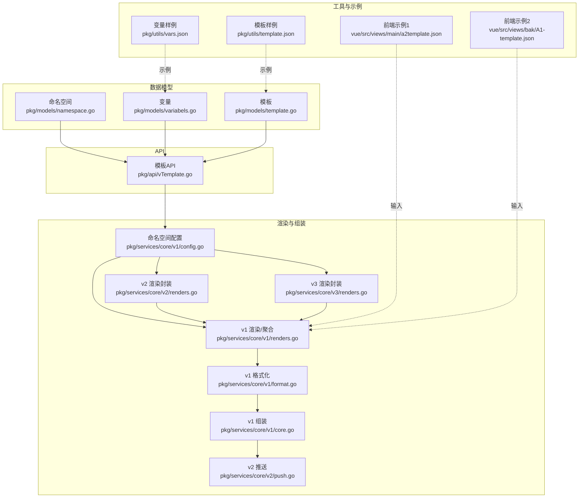
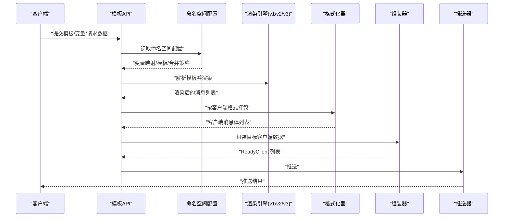
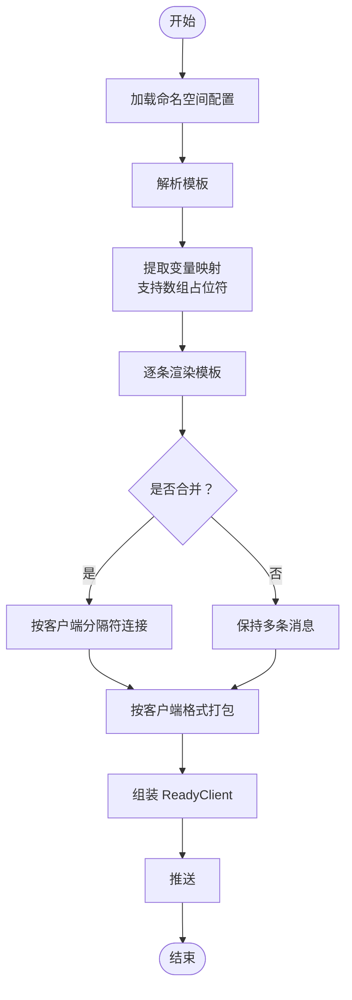
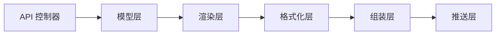

# 模板系统

<cite>
**本文引用的文件**
- [pkg/models/template.go](file://pkg/models/template.go)
- [pkg/api/vTemplate.go](file://pkg/api/vTemplate.go)
- [pkg/services/core/v1/renders.go](file://pkg/services/core/v1/renders.go)
- [pkg/services/core/v1/config.go](file://pkg/services/core/v1/config.go)
- [pkg/services/core/v1/format.go](file://pkg/services/core/v1/format.go)
- [pkg/services/core/v1/core.go](file://pkg/services/core/v1/core.go)
- [pkg/services/core/v2/renders.go](file://pkg/services/core/v2/renders.go)
- [pkg/services/core/v2/push.go](file://pkg/services/core/v2/push.go)
- [pkg/services/core/v3/renders.go](file://pkg/services/core/v3/renders.go)
- [pkg/models/variabels.go](file://pkg/models/variabels.go)
- [pkg/models/namespace.go](file://pkg/models/namespace.go)
- [pkg/utils/template.json](file://pkg/utils/template.json)
- [pkg/utils/vars.json](file://pkg/utils/vars.json)
- [vue/src/views/main/a2template.json](file://vue/src/views/main/a2template.json)
- [vue/src/views/bak/A1-template.json](file://vue/src/views/bak/A1-template.json)
- [pkg/services/core/v3/interfaces.go](file://pkg/services/core/v3/interfaces.go)
</cite>

## 目录
1. [简介](#简介)
2. [项目结构](#项目结构)
3. [核心组件](#核心组件)
4. [架构总览](#架构总览)
5. [详细组件分析](#详细组件分析)
6. [依赖分析](#依赖分析)
7. [性能考虑](#性能考虑)
8. [故障排查指南](#故障排查指南)
9. [结论](#结论)
10. [附录](#附录)

## 简介
本文件面向模板系统，系统性阐述消息模板的设计原理、JSON 模板语法、渲染机制、验证与错误处理、调试方法、命名空间与版本管理、继承机制、最佳实践与性能优化建议，并通过真实示例帮助读者快速上手。

## 项目结构
模板系统围绕“命名空间”组织，每个命名空间可独立维护一组变量映射与模板内容，并按需渲染为不同客户端的消息体。核心模块包括：
- 数据模型层：命名空间、模板、变量
- API 层：模板的增删改查接口
- 渲染层：v1/v2/v3 多版本渲染与组装
- 格式化层：针对不同客户端的消息体打包
- 工具与示例：模板与变量样例、前端示例数据

图表来源
- [pkg/models/namespace.go:12-26](file://pkg/models/namespace.go#L12-L26)
- [pkg/models/template.go:9-22](file://pkg/models/template.go#L9-L22)
- [pkg/models/variabels.go:9-22](file://pkg/models/variabels.go#L9-L22)
- [pkg/api/vTemplate.go:13-147](file://pkg/api/vTemplate.go#L13-L147)
- [pkg/services/core/v1/config.go:11-17](file://pkg/services/core/v1/config.go#L11-L17)
- [pkg/services/core/v1/renders.go:15-127](file://pkg/services/core/v1/renders.go#L15-L127)
- [pkg/services/core/v1/format.go:10-62](file://pkg/services/core/v1/format.go#L10-L62)
- [pkg/services/core/v1/core.go:25-65](file://pkg/services/core/v1/core.go#L25-L65)
- [pkg/services/core/v2/renders.go:8-29](file://pkg/services/core/v2/renders.go#L8-L29)
- [pkg/services/core/v3/renders.go:10-59](file://pkg/services/core/v3/renders.go#L10-L59)
- [pkg/services/core/v2/push.go:15-107](file://pkg/services/core/v2/push.go#L15-L107)
- [pkg/utils/template.json:1-5](file://pkg/utils/template.json#L1-L5)
- [pkg/utils/vars.json:1-29](file://pkg/utils/vars.json#L1-L29)
- [vue/src/views/main/a2template.json:1-92](file://vue/src/views/main/a2template.json#L1-L92)
- [vue/src/views/bak/A1-template.json:1-50](file://vue/src/views/bak/A1-template.json#L1-L50)

章节来源
- [pkg/models/namespace.go:12-26](file://pkg/models/namespace.go#L12-L26)
- [pkg/models/template.go:9-22](file://pkg/models/template.go#L9-L22)
- [pkg/models/variabels.go:9-22](file://pkg/models/variabels.go#L9-L22)
- [pkg/api/vTemplate.go:13-147](file://pkg/api/vTemplate.go#L13-L147)
- [pkg/services/core/v1/config.go:11-17](file://pkg/services/core/v1/config.go#L11-L17)
- [pkg/services/core/v1/renders.go:15-127](file://pkg/services/core/v1/renders.go#L15-L127)
- [pkg/services/core/v1/format.go:10-62](file://pkg/services/core/v1/format.go#L10-L62)
- [pkg/services/core/v1/core.go:25-65](file://pkg/services/core/v1/core.go#L25-L65)
- [pkg/services/core/v2/renders.go:8-29](file://pkg/services/core/v2/renders.go#L8-L29)
- [pkg/services/core/v3/renders.go:10-59](file://pkg/services/core/v3/renders.go#L10-L59)
- [pkg/services/core/v2/push.go:15-107](file://pkg/services/core/v2/push.go#L15-L107)
- [pkg/utils/template.json:1-5](file://pkg/utils/template.json#L1-L5)
- [pkg/utils/vars.json:1-29](file://pkg/utils/vars.json#L1-L29)
- [vue/src/views/main/a2template.json:1-92](file://vue/src/views/main/a2template.json#L1-L92)
- [vue/src/views/bak/A1-template.json:1-50](file://vue/src/views/bak/A1-template.json#L1-L50)

## 核心组件
- 命名空间模型：用于隔离通道，控制是否渲染、是否合并等全局开关。
- 模板模型：存储命名空间下的模板内容与是否合并标志。
- 变量模型：存储命名空间下的变量映射（键到 JSON 路径的映射）。
- API 控制器：提供模板的增删改查接口，校验命名空间归属。
- 渲染引擎（v1/v2/v3）：解析模板、提取数据、执行模板、聚合输出。
- 格式化器：将渲染结果打包为各客户端所需的消息体。
- 推送器：向各平台机器人或接口发起推送。

章节来源
- [pkg/models/namespace.go:12-26](file://pkg/models/namespace.go#L12-L26)
- [pkg/models/template.go:9-22](file://pkg/models/template.go#L9-L22)
- [pkg/models/variabels.go:9-22](file://pkg/models/variabels.go#L9-L22)
- [pkg/api/vTemplate.go:13-147](file://pkg/api/vTemplate.go#L13-L147)
- [pkg/services/core/v1/config.go:11-17](file://pkg/services/core/v1/config.go#L11-L17)
- [pkg/services/core/v1/renders.go:15-127](file://pkg/services/core/v1/renders.go#L15-L127)
- [pkg/services/core/v1/format.go:10-62](file://pkg/services/core/v1/format.go#L10-L62)
- [pkg/services/core/v1/core.go:25-65](file://pkg/services/core/v1/core.go#L25-L65)
- [pkg/services/core/v2/renders.go:8-29](file://pkg/services/core/v2/renders.go#L8-L29)
- [pkg/services/core/v3/renders.go:10-59](file://pkg/services/core/v3/renders.go#L10-L59)
- [pkg/services/core/v2/push.go:15-107](file://pkg/services/core/v2/push.go#L15-L107)

## 架构总览
模板系统采用“配置驱动 + 多版本渲染 + 客户端适配”的架构。输入为命名空间配置（变量映射、模板、合并策略）与原始 JSON 数据；经过解析与渲染，生成各客户端的消息体并推送。

图表来源
- [pkg/api/vTemplate.go:13-147](file://pkg/api/vTemplate.go#L13-L147)
- [pkg/services/core/v1/config.go:19-58](file://pkg/services/core/v1/config.go#L19-L58)
- [pkg/services/core/v1/renders.go:15-127](file://pkg/services/core/v1/renders.go#L15-L127)
- [pkg/services/core/v1/format.go:10-62](file://pkg/services/core/v1/format.go#L10-L62)
- [pkg/services/core/v1/core.go:34-65](file://pkg/services/core/v1/core.go#L34-L65)
- [pkg/services/core/v2/push.go:19-78](file://pkg/services/core/v2/push.go#L19-L78)

## 详细组件分析

### 模板设计与 JSON 模板语法
- 模板结构
  - 模板内容为字符串，采用 Go 模板语法（如条件、循环、函数等）。模板内容由命名空间绑定，支持是否合并标志。
  - 模板样例位于工具目录，展示了条件判断与变量占位符的组合使用方式。
- 变量占位符
  - 变量映射为键到 JSON 路径的映射，渲染时通过路径从原始请求数据中提取值。
  - 支持数组索引占位符“#”，自动按最长数组长度展开为多条记录。
- 条件判断
  - 使用 Go 模板的条件语法，基于变量值进行分支渲染（如状态判断）。
- 循环结构
  - 通过“#”占位符与数组路径配合，渲染器自动按数组长度生成多条消息。
- 时间处理
  - 渲染器对时间字段进行时区转换与格式化，确保输出一致。

章节来源
- [pkg/models/template.go:9-18](file://pkg/models/template.go#L9-L18)
- [pkg/utils/template.json:1-5](file://pkg/utils/template.json#L1-L5)
- [pkg/utils/vars.json:1-29](file://pkg/utils/vars.json#L1-L29)
- [pkg/services/core/v1/renders.go:15-127](file://pkg/services/core/v1/renders.go#L15-L127)
- [pkg/services/core/v3/renders.go:15-59](file://pkg/services/core/v3/renders.go#L15-L59)

### 模板渲染机制工作流程
- 加载阶段
  - 读取命名空间配置：激活客户端、变量映射、模板内容、是否合并。
- 解析阶段
  - 使用 Go 模板引擎解析模板字符串。
- 数据提取与映射
  - 依据变量映射，使用 JSON 路径从请求数据中提取字段；支持“#”占位符展开数组。
- 执行阶段
  - 对每条映射数据执行模板渲染，生成消息片段。
- 聚合阶段
  - 根据客户端类型与合并策略，将多条消息进行连接。
- 格式化阶段
  - 将聚合后的消息按客户端要求打包为消息体。
- 组装与推送
  - 组装 ReadyClient 列表并推送至各客户端。

图表来源
- [pkg/services/core/v1/config.go:19-58](file://pkg/services/core/v1/config.go#L19-L58)
- [pkg/services/core/v1/renders.go:15-127](file://pkg/services/core/v1/renders.go#L15-L127)
- [pkg/services/core/v1/format.go:10-62](file://pkg/services/core/v1/format.go#L10-L62)
- [pkg/services/core/v1/core.go:34-65](file://pkg/services/core/v1/core.go#L34-L65)

### 模板验证规则与错误处理
- 参数校验
  - API 层对命名空间与 ID 进行校验，防止跨命名空间访问。
- 模板解析错误
  - 解析失败时记录日志并跳过该条渲染，保证整体流程继续。
- 执行错误
  - 模板执行失败时记录日志并跳过，避免中断后续消息生成。
- 客户端类型错误
  - 聚合阶段若客户端类型未知，记录错误日志。
- 变量映射缺失
  - 若 JSON 路径取值为空，渲染结果对应位置为空字符串，需在模板中做好容错。

章节来源
- [pkg/api/vTemplate.go:66-147](file://pkg/api/vTemplate.go#L66-L147)
- [pkg/services/core/v1/renders.go:25-67](file://pkg/services/core/v1/renders.go#L25-L67)
- [pkg/services/core/v1/renders.go:108-127](file://pkg/services/core/v1/renders.go#L108-L127)

### 调试方法
- 日志定位
  - 解析失败、执行失败、客户端类型错误均会记录日志，便于定位问题。
- 变量映射核对
  - 使用变量样例与前端示例数据，确认 JSON 路径是否正确。
- 模板最小化测试
  - 先用简单模板与少量变量验证流程，再逐步增加复杂度。
- 分步验证
  - 先验证变量映射提取，再验证模板渲染，最后验证聚合与格式化。

章节来源
- [pkg/services/core/v1/renders.go:25-67](file://pkg/services/core/v1/renders.go#L25-L67)
- [pkg/utils/vars.json:1-29](file://pkg/utils/vars.json#L1-L29)
- [vue/src/views/main/a2template.json:1-92](file://vue/src/views/main/a2template.json#L1-L92)

### 模板示例与场景
- 报警模板示例
  - 使用条件判断区分“报警中/已恢复/其他”，并在模板中插入变量占位符。
- 变量映射示例
  - 将 N1..N8 映射到 alerts 数组中的 labels/annotations 字段及时间字段。
- 前端示例数据
  - 提供包含 alerts 数组的示例 JSON，便于测试数组展开与渲染。

章节来源
- [pkg/utils/template.json:1-5](file://pkg/utils/template.json#L1-L5)
- [pkg/utils/vars.json:1-29](file://pkg/utils/vars.json#L1-L29)
- [vue/src/views/main/a2template.json:1-92](file://vue/src/views/main/a2template.json#L1-L92)
- [vue/src/views/bak/A1-template.json:1-50](file://vue/src/views/bak/A1-template.json#L1-L50)

### 命名空间、版本管理与继承
- 命名空间
  - 作为通道隔离单元，控制是否渲染、是否合并等全局行为。
- 版本管理
  - v1/v2/v3 渲染器并存，新增 v3 时保留 v1 的兼容逻辑，便于平滑迁移。
- 继承机制
  - 通过 v2 的封装类组合 v1 的渲染能力，形成“继承式”复用。
- 模板与变量的绑定
  - 模板与变量均按命名空间绑定，实现“命名空间即模板域”。

章节来源
- [pkg/models/namespace.go:12-26](file://pkg/models/namespace.go#L12-L26)
- [pkg/services/core/v1/config.go:19-58](file://pkg/services/core/v1/config.go#L19-L58)
- [pkg/services/core/v2/renders.go:8-29](file://pkg/services/core/v2/renders.go#L8-L29)
- [pkg/services/core/v3/renders.go:10-59](file://pkg/services/core/v3/renders.go#L10-L59)

### 最佳实践
- 模板设计
  - 使用条件判断与占位符组合，保证在不同状态下的可读性。
  - 对时间字段进行统一格式化，避免时区差异导致的显示异常。
- 变量映射
  - 仅映射必要字段，减少冗余计算；对数组字段使用“#”占位符。
- 错误处理
  - 在模板中对空值进行兜底，避免渲染后出现空白。
- 性能优化
  - 合理使用合并策略，减少消息数量；避免在模板中进行复杂计算。
  - 优先使用 v1 的高效实现，必要时再升级到 v2/v3。

## 依赖分析
- 组件耦合
  - API 层依赖模型层；渲染层依赖配置层；格式化层依赖渲染层；推送层依赖格式化层。
- 外部依赖
  - JSON 路径解析使用第三方库；模板引擎使用标准库；HTTP 推送依赖网络。
- 潜在风险
  - 模板解析与执行失败会影响消息生成；变量映射路径错误会导致渲染为空。

图表来源
- [pkg/api/vTemplate.go:13-147](file://pkg/api/vTemplate.go#L13-L147)
- [pkg/services/core/v1/config.go:19-58](file://pkg/services/core/v1/config.go#L19-L58)
- [pkg/services/core/v1/renders.go:15-127](file://pkg/services/core/v1/renders.go#L15-L127)
- [pkg/services/core/v1/format.go:10-62](file://pkg/services/core/v1/format.go#L10-L62)
- [pkg/services/core/v1/core.go:34-65](file://pkg/services/core/v1/core.go#L34-L65)
- [pkg/services/core/v2/push.go:19-78](file://pkg/services/core/v2/push.go#L19-L78)

## 性能考虑
- 渲染效率
  - 使用一次性解析模板与批量渲染，避免重复解析。
  - 合并策略可显著降低消息数量，提升推送吞吐。
- 内存占用
  - 大数组场景下注意内存峰值，必要时分批处理。
- 网络开销
  - 并发推送时控制并发度，避免触发平台限流。

## 故障排查指南
- 常见问题
  - 模板解析失败：检查模板语法与占位符是否匹配。
  - 变量映射为空：检查 JSON 路径是否正确，确认字段存在。
  - 客户端类型错误：检查命名空间配置与客户端类型一致性。
- 排查步骤
  - 从变量映射与模板最小化开始，逐步增加复杂度。
  - 查看日志定位失败点，结合前端示例数据复现问题。

章节来源
- [pkg/services/core/v1/renders.go:25-67](file://pkg/services/core/v1/renders.go#L25-L67)
- [pkg/services/core/v1/renders.go:108-127](file://pkg/services/core/v1/renders.go#L108-L127)
- [pkg/api/vTemplate.go:66-147](file://pkg/api/vTemplate.go#L66-L147)

## 结论
模板系统通过“命名空间 + 变量映射 + Go 模板”的组合，实现了灵活、可扩展的消息渲染与推送。v1/v2/v3 多版本并存提供了平滑演进路径；结合严格的参数校验与完善的日志体系，能够稳定支撑多客户端的消息分发。建议在生产环境中遵循最佳实践，持续优化模板与变量映射，以获得更优的性能与可维护性。

## 附录
- 关键接口与职责
  - API 控制器：模板 CRUD、命名空间校验。
  - 渲染引擎：模板解析、数据提取、模板执行、聚合。
  - 格式化器：按客户端打包消息体。
  - 组装器：生成 ReadyClient 列表。
  - 推送器：向各平台发起推送。

章节来源
- [pkg/api/vTemplate.go:13-147](file://pkg/api/vTemplate.go#L13-L147)
- [pkg/services/core/v1/renders.go:15-127](file://pkg/services/core/v1/renders.go#L15-L127)
- [pkg/services/core/v1/format.go:10-62](file://pkg/services/core/v1/format.go#L10-L62)
- [pkg/services/core/v1/core.go:34-65](file://pkg/services/core/v1/core.go#L34-L65)
- [pkg/services/core/v2/push.go:19-78](file://pkg/services/core/v2/push.go#L19-L78)
- [pkg/services/core/v3/interfaces.go:7-11](file://pkg/services/core/v3/interfaces.go#L7-L11)