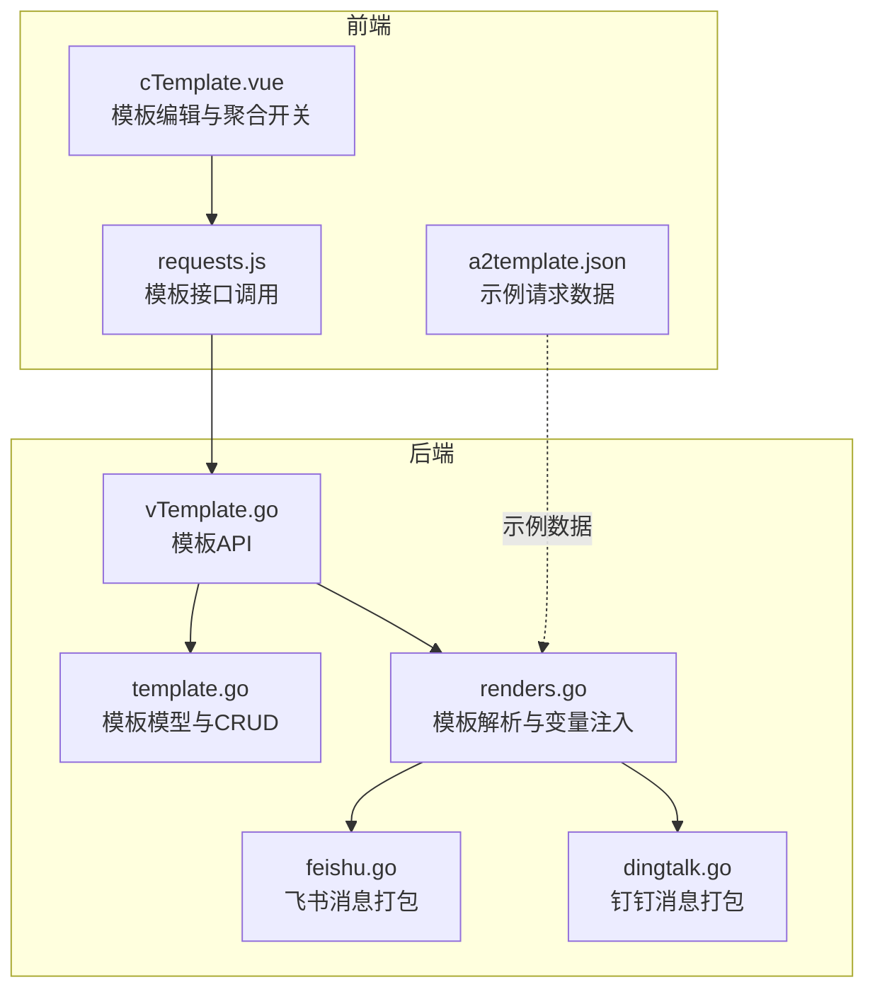
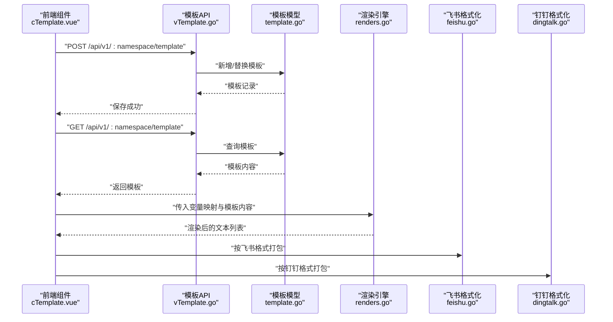
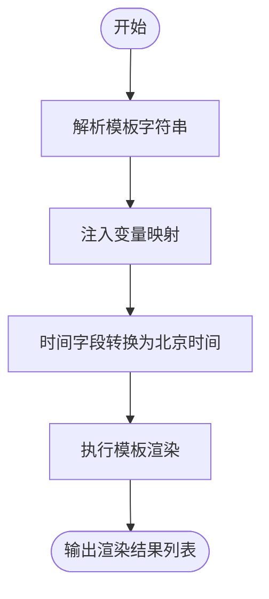
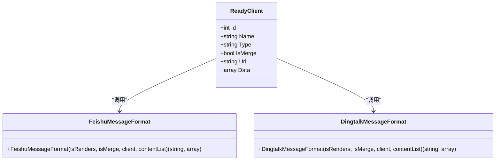
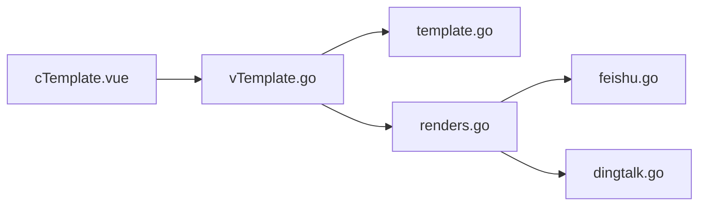

# 模板语法与结构

<cite>
**本文引用的文件**   
- [pkg/models/template.go](file://pkg/models/template.go)
- [pkg/api/vTemplate.go](file://pkg/api/vTemplate.go)
- [pkg/services/core/v1/renders.go](file://pkg/services/core/v1/renders.go)
- [pkg/services/core/v1/format.go](file://pkg/services/core/v1/format.go)
- [pkg/services/format/feishu.go](file://pkg/services/format/feishu.go)
- [pkg/services/format/dingtalk.go](file://pkg/services/format/dingtalk.go)
- [vue/src/components/cTemplate.vue](file://vue/src/components/cTemplate.vue)
- [vue/src/views/main/a2template.json](file://vue/src/views/main/a2template.json)
- [pkg/utils/template.json](file://pkg/utils/template.json)
- [vue/src/service/requests.js](file://vue/src/service/requests.js)
</cite>

## 目录
1. [简介](#简介)
2. [项目结构](#项目结构)
3. [核心组件](#核心组件)
4. [架构总览](#架构总览)
5. [详细组件分析](#详细组件分析)
6. [依赖分析](#依赖分析)
7. [性能考虑](#性能考虑)
8. [故障排查指南](#故障排查指南)
9. [结论](#结论)
10. [附录](#附录)

## 简介
本文件系统性阐述消息模板的语法与结构规范，覆盖以下方面：
- JSON 模板的基本语法与结构规范
- 模板字段定义、命名规则与数据类型约束
- 模板内容的存储格式与编码要求
- template_is_merge 字段的作用与使用场景
- 关键字段说明：namespace、template_name、template_content、template_is_merge
- 标准模板结构示例与编写要点
- 模板语法最佳实践与常见错误规避

## 项目结构
围绕模板的前后端协作链路，主要涉及如下模块：
- 数据模型层：模板实体定义与持久化接口
- 接口层：模板的增删改查 API
- 渲染层：基于 Go html/template 的模板解析与变量注入
- 格式化层：针对不同客户端（飞书、钉钉）的消息体打包
- 前端组件：模板编辑、聚合开关与数据拉取/保存
- 示例数据：用于演示与测试的标准模板与示例请求数据

**图表来源**
- [vue/src/components/cTemplate.vue:1-140](file://vue/src/components/cTemplate.vue#L1-L140)
- [vue/src/service/requests.js:1-42](file://vue/src/service/requests.js#L1-L42)
- [vue/src/views/main/a2template.json:1-92](file://vue/src/views/main/a2template.json#L1-L92)
- [pkg/api/vTemplate.go:1-147](file://pkg/api/vTemplate.go#L1-L147)
- [pkg/models/template.go:1-72](file://pkg/models/template.go#L1-L72)
- [pkg/services/core/v1/renders.go:1-127](file://pkg/services/core/v1/renders.go#L1-L127)
- [pkg/services/format/feishu.go:1-61](file://pkg/services/format/feishu.go#L1-L61)
- [pkg/services/format/dingtalk.go:1-30](file://pkg/services/format/dingtalk.go#L1-L30)

**章节来源**
- [pkg/models/template.go:1-72](file://pkg/models/template.go#L1-L72)
- [pkg/api/vTemplate.go:1-147](file://pkg/api/vTemplate.go#L1-L147)
- [pkg/services/core/v1/renders.go:1-127](file://pkg/services/core/v1/renders.go#L1-L127)
- [pkg/services/core/v1/format.go:1-62](file://pkg/services/core/v1/format.go#L1-L62)
- [pkg/services/format/feishu.go:1-61](file://pkg/services/format/feishu.go#L1-L61)
- [pkg/services/format/dingtalk.go:1-30](file://pkg/services/format/dingtalk.go#L1-L30)
- [vue/src/components/cTemplate.vue:1-140](file://vue/src/components/cTemplate.vue#L1-L140)
- [vue/src/service/requests.js:1-42](file://vue/src/service/requests.js#L1-L42)
- [vue/src/views/main/a2template.json:1-92](file://vue/src/views/main/a2template.json#L1-L92)
- [pkg/utils/template.json:1-5](file://pkg/utils/template.json#L1-L5)

## 核心组件
- 模型与持久化
  - 模板实体包含命名空间、模板名、模板内容、是否合并发送等字段，并提供 CRUD 方法。
- 接口层
  - 提供模板列表、新增、查询、修改、删除等 REST 接口，统一处理命名空间与参数校验。
- 渲染层
  - 使用 Go html/template 解析模板字符串，将变量映射注入生成最终文本内容。
- 格式化层
  - 针对不同客户端（飞书、钉钉）输出符合其协议的消息体结构。
- 前端组件
  - 提供模板编辑器、聚合开关、示例模板与数据拉取/保存逻辑。

**章节来源**
- [pkg/models/template.go:9-18](file://pkg/models/template.go#L9-L18)
- [pkg/api/vTemplate.go:13-147](file://pkg/api/vTemplate.go#L13-L147)
- [pkg/services/core/v1/renders.go:15-67](file://pkg/services/core/v1/renders.go#L15-L67)
- [pkg/services/core/v1/format.go:10-61](file://pkg/services/core/v1/format.go#L10-L61)
- [vue/src/components/cTemplate.vue:40-128](file://vue/src/components/cTemplate.vue#L40-L128)

## 架构总览
模板从“输入数据 + 变量映射 + 模板内容”三要素出发，经过解析与变量注入，再按客户端类型进行消息体打包，最终发送到目标平台。

**图表来源**
- [vue/src/components/cTemplate.vue:94-119](file://vue/src/components/cTemplate.vue#L94-L119)
- [pkg/api/vTemplate.go:31-64](file://pkg/api/vTemplate.go#L31-L64)
- [pkg/models/template.go:24-27](file://pkg/models/template.go#L24-L27)
- [pkg/services/core/v1/renders.go:15-67](file://pkg/services/core/v1/renders.go#L15-L67)
- [pkg/services/format/feishu.go:8-60](file://pkg/services/format/feishu.go#L8-L60)
- [pkg/services/format/dingtalk.go:3-29](file://pkg/services/format/dingtalk.go#L3-L29)

## 详细组件分析

### 模板字段与结构规范
- 字段定义与约束
  - namespace：字符串，模板所属命名空间，用于隔离与路由。
  - template_name：字符串，模板名称，建议与命名空间一致或具有唯一性。
  - template_content：字符串，Go html/template 语法的模板内容，需为合法模板字符串。
  - template_is_merge：布尔值，控制是否将多条渲染结果合并发送。
- 存储格式与编码
  - 模板内容以 JSON 字符串形式存储，应遵循 UTF-8 编码。
  - 模板字符串内部可包含换行与特殊字符，但需确保作为 JSON 字符串有效。
- 命名规则
  - 建议使用小写、短横线或下划线组合，避免空格与特殊字符。
  - template_name 与 namespace 组合在命名空间内应唯一或按后写入覆盖策略处理。

**章节来源**
- [pkg/models/template.go:9-18](file://pkg/models/template.go#L9-L18)
- [pkg/api/vTemplate.go:32-41](file://pkg/api/vTemplate.go#L32-L41)
- [pkg/utils/template.json:1-5](file://pkg/utils/template.json#L1-L5)

### 模板内容语法与变量注入
- 语法基础
  - 使用 Go html/template 语法，通过 {{ }} 注入变量，如 {{ .N1 }}、{{ .N2 }} 等。
  - 支持条件判断、循环与函数调用等模板指令。
- 变量映射
  - 通过 gjson 从原始请求数据中提取指定路径的值，形成键值映射表。
  - 多条记录按最长数组长度进行对齐，逐条生成渲染结果。
- 时间处理
  - 若字段为 RFC3339 时间格式，将转换为北京时间字符串，便于阅读。
- 渲染流程
  - Parse 模板 -> Execute 注入变量 -> 输出字符串列表。

**图表来源**
- [pkg/services/core/v1/renders.go:15-67](file://pkg/services/core/v1/renders.go#L15-L67)
- [pkg/services/core/v1/renders.go:69-102](file://pkg/services/core/v1/renders.go#L69-L102)

**章节来源**
- [pkg/services/core/v1/renders.go:15-67](file://pkg/services/core/v1/renders.go#L15-L67)
- [pkg/services/core/v1/renders.go:69-102](file://pkg/services/core/v1/renders.go#L69-L102)

### 消息聚合与客户端格式化
- 聚合开关 template_is_merge
  - 当为 true 时，将多个渲染结果按客户端类型进行拼接，减少发送次数。
  - 当为 false 时，每条渲染结果独立发送。
- 客户端格式化
  - 飞书：采用交互卡片结构，包含标题、模板颜色与 Markdown 内容。
  - 钉钉：采用 Markdown 结构，支持 @ 手机号与 @All。

**图表来源**
- [pkg/services/core/v1/core.go:25-64](file://pkg/services/core/v1/core.go#L25-L64)
- [pkg/services/core/v1/format.go:10-61](file://pkg/services/core/v1/format.go#L10-L61)
- [pkg/services/format/feishu.go:8-60](file://pkg/services/format/feishu.go#L8-L60)
- [pkg/services/format/dingtalk.go:3-29](file://pkg/services/format/dingtalk.go#L3-L29)

**章节来源**
- [pkg/services/core/v1/format.go:10-61](file://pkg/services/core/v1/format.go#L10-L61)
- [pkg/services/format/feishu.go:8-60](file://pkg/services/format/feishu.go#L8-L60)
- [pkg/services/format/dingtalk.go:3-29](file://pkg/services/format/dingtalk.go#L3-L29)

### 前端模板编辑与示例
- 模板编辑器
  - 提供聚合发送开关与模板内容编辑区域，支持 Golang 模板语法提示。
- 示例模板
  - 包含示例模板 JSON，展示 template_is_merge 与 template_content 的典型用法。
- 示例请求数据
  - 提供标准 Alertmanager 请求数据样例，便于测试变量映射与渲染效果。

**章节来源**
- [vue/src/components/cTemplate.vue:40-128](file://vue/src/components/cTemplate.vue#L40-L128)
- [vue/src/views/main/a2template.json:1-92](file://vue/src/views/main/a2template.json#L1-L92)
- [pkg/utils/template.json:1-5](file://pkg/utils/template.json#L1-L5)

## 依赖分析
- 模块耦合
  - 前端通过 requests.js 调用后端模板 API，API 层依赖模板模型与渲染服务。
  - 渲染服务依赖变量映射与模板字符串，格式化服务依赖客户端配置。
- 关键依赖链
  - cTemplate.vue → vTemplate.go → template.go → renders.go → format/*.go

**图表来源**
- [vue/src/components/cTemplate.vue:94-119](file://vue/src/components/cTemplate.vue#L94-L119)
- [pkg/api/vTemplate.go:31-64](file://pkg/api/vTemplate.go#L31-L64)
- [pkg/models/template.go:24-27](file://pkg/models/template.go#L24-L27)
- [pkg/services/core/v1/renders.go:15-67](file://pkg/services/core/v1/renders.go#L15-L67)
- [pkg/services/format/feishu.go:8-60](file://pkg/services/format/feishu.go#L8-L60)
- [pkg/services/format/dingtalk.go:3-29](file://pkg/services/format/dingtalk.go#L3-L29)

**章节来源**
- [vue/src/service/requests.js:16-18](file://vue/src/service/requests.js#L16-L18)
- [pkg/api/vTemplate.go:13-147](file://pkg/api/vTemplate.go#L13-L147)
- [pkg/models/template.go:1-72](file://pkg/models/template.go#L1-L72)
- [pkg/services/core/v1/renders.go:1-127](file://pkg/services/core/v1/renders.go#L1-L127)
- [pkg/services/format/feishu.go:1-61](file://pkg/services/format/feishu.go#L1-L61)
- [pkg/services/format/dingtalk.go:1-30](file://pkg/services/format/dingtalk.go#L1-L30)

## 性能考虑
- 模板解析缓存
  - 对于高频使用的模板，可在渲染前进行解析缓存，避免重复 Parse。
- 变量映射优化
  - 仅提取必要字段，减少 gjson 解析与映射构建开销。
- 聚合发送
  - 在 template_is_merge 为 true 时，合理控制聚合长度，避免单次消息过大导致客户端限制。
- 并发渲染
  - 将多条渲染任务并发执行，注意线程安全与资源上限控制。

## 故障排查指南
- 模板解析失败
  - 现象：日志出现模板解析错误。
  - 排查：检查模板字符串语法，确认变量名与映射一致。
- 变量未注入
  - 现象：渲染结果中出现未替换的占位符。
  - 排查：核对变量映射路径与原始数据结构，确认 gjson 路径正确。
- 时间字段异常
  - 现象：时间显示不符合预期。
  - 排查：确认字段为 RFC3339 格式，检查时区转换逻辑。
- 聚合发送异常
  - 现象：聚合内容格式错乱。
  - 排查：确认 template_is_merge 开关与客户端类型匹配，检查拼接分隔符。
- 命名空间不匹配
  - 现象：接口返回参数错误。
  - 排查：确认请求路径中的命名空间与模板记录一致。

**章节来源**
- [pkg/services/core/v1/renders.go:25-29](file://pkg/services/core/v1/renders.go#L25-L29)
- [pkg/services/core/v1/renders.go:57-60](file://pkg/services/core/v1/renders.go#L57-L60)
- [pkg/api/vTemplate.go:81-84](file://pkg/api/vTemplate.go#L81-L84)
- [pkg/api/vTemplate.go:103-106](file://pkg/api/vTemplate.go#L103-L106)

## 结论
- 模板系统以 Go html/template 为核心，结合变量映射与客户端格式化，实现了灵活的消息渲染与发送。
- template_is_merge 提供了“逐条发送”与“聚合发送”的双模式，满足不同业务场景。
- 建议在编写模板时遵循命名规范、保持变量映射简洁、并结合示例数据进行充分测试。

## 附录

### 字段说明与示例
- 字段清单
  - namespace：模板所属命名空间
  - template_name：模板名称
  - template_content：Go 模板字符串
  - template_is_merge：是否聚合发送
- 示例参考
  - 示例模板 JSON：[pkg/utils/template.json:1-5](file://pkg/utils/template.json#L1-L5)
  - 示例请求数据：[vue/src/views/main/a2template.json:1-92](file://vue/src/views/main/a2template.json#L1-L92)

**章节来源**
- [pkg/utils/template.json:1-5](file://pkg/utils/template.json#L1-L5)
- [vue/src/views/main/a2template.json:1-92](file://vue/src/views/main/a2template.json#L1-L92)