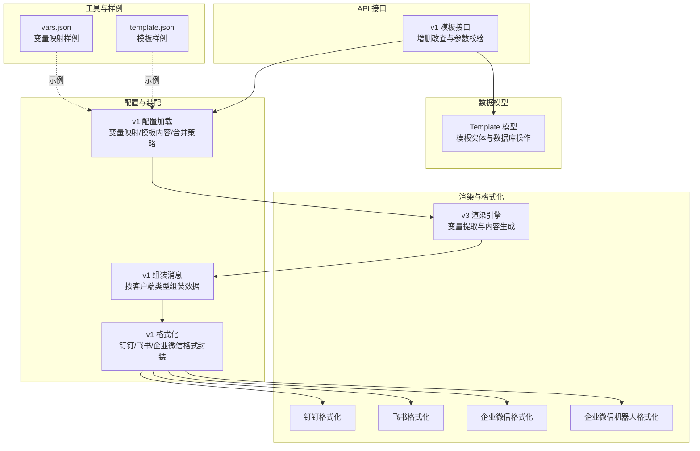
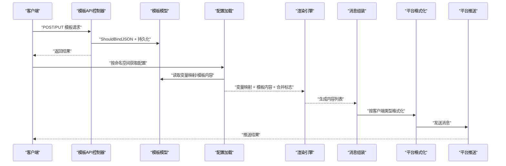
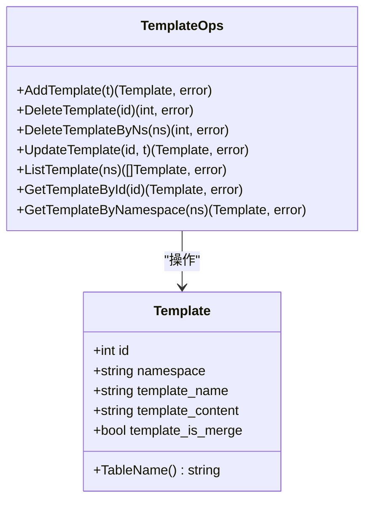
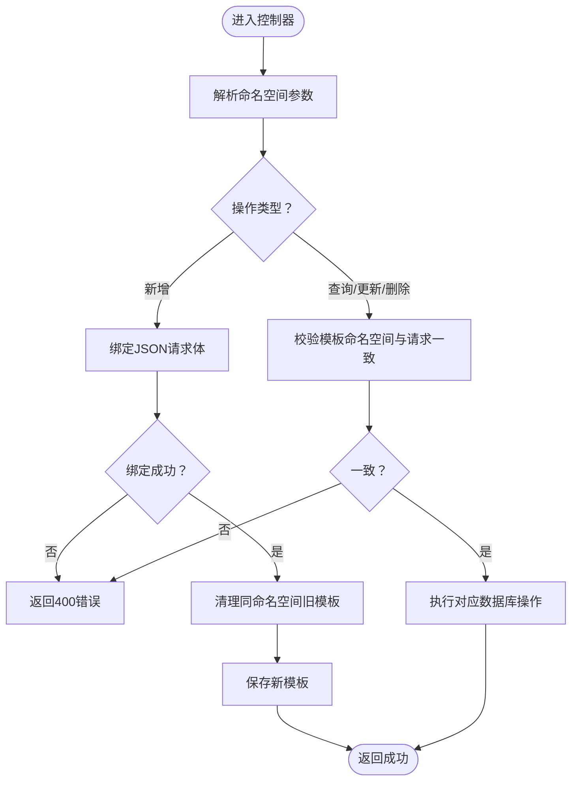
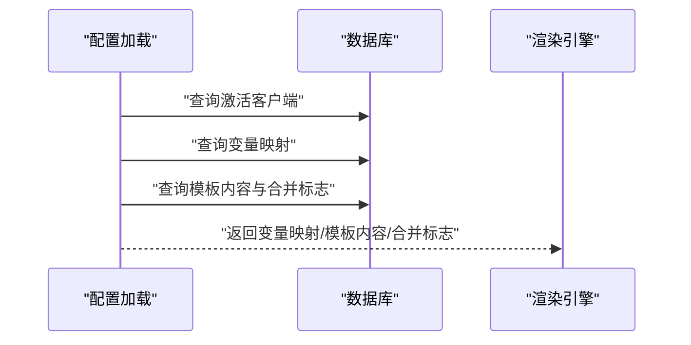
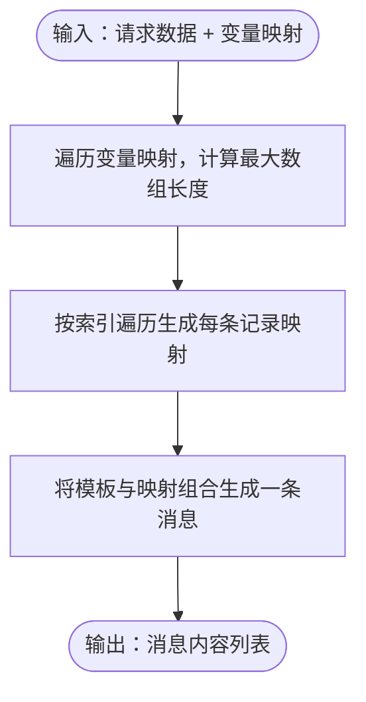
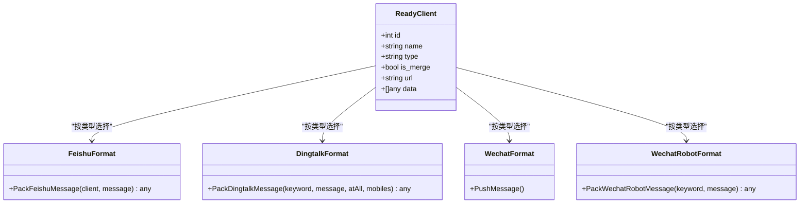
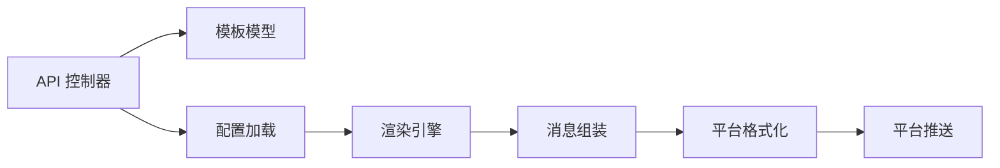

# 模板验证与测试

<cite>
**本文引用的文件**
- [pkg/models/template.go](file://pkg/models/template.go)
- [pkg/api/vTemplate.go](file://pkg/api/vTemplate.go)
- [pkg/services/core/v1/config.go](file://pkg/services/core/v1/config.go)
- [pkg/services/core/v1/core.go](file://pkg/services/core/v1/core.go)
- [pkg/services/core/v1/format.go](file://pkg/services/core/v1/format.go)
- [pkg/services/core/v3/renders.go](file://pkg/services/core/v3/renders.go)
- [pkg/services/format/dingtalk.go](file://pkg/services/format/dingtalk.go)
- [pkg/services/format/feishu.go](file://pkg/services/format/feishu.go)
- [pkg/services/format/wechat.go](file://pkg/services/format/wechat.go)
- [pkg/services/format/wechat_robot.go](file://pkg/services/format/wechat_robot.go)
- [pkg/utils/template.json](file://pkg/utils/template.json)
- [pkg/utils/vars.json](file://pkg/utils/vars.json)
</cite>

## 目录
1. [引言](#引言)
2. [项目结构](#项目结构)
3. [核心组件](#核心组件)
4. [架构总览](#架构总览)
5. [详细组件分析](#详细组件分析)
6. [依赖分析](#依赖分析)
7. [性能考虑](#性能考虑)
8. [故障排查指南](#故障排查指南)
9. [结论](#结论)
10. [附录](#附录)

## 引言
本文件面向模板验证与测试，系统性阐述模板在系统中的验证规则与检查机制，覆盖语法验证、格式验证与业务规则验证；解释模板内容有效性检查方法，包括 JSON 格式验证、变量引用检查与平台兼容性验证；提供模板测试的方法与工具建议，涵盖单元测试、集成测试与性能测试；最后给出常见模板错误的诊断与修复路径，并总结模板质量评估标准与最佳实践。

## 项目结构
围绕模板验证与测试的关键模块分布如下：
- 数据模型层：模板实体定义与持久化接口
- API 层：模板的增删改查入口与参数校验
- 配置与装配层：命名空间配置、变量映射与模板内容加载
- 渲染与格式化层：模板渲染、变量替换与各平台消息格式打包
- 工具与示例：模板与变量映射的样例文件

图表来源
- [pkg/models/template.go:1-72](file://pkg/models/template.go#L1-L72)
- [pkg/api/vTemplate.go:1-147](file://pkg/api/vTemplate.go#L1-L147)
- [pkg/services/core/v1/config.go:1-79](file://pkg/services/core/v1/config.go#L1-L79)
- [pkg/services/core/v1/core.go:1-65](file://pkg/services/core/v1/core.go#L1-L65)
- [pkg/services/core/v1/format.go:1-62](file://pkg/services/core/v1/format.go#L1-L62)
- [pkg/services/core/v3/renders.go:1-59](file://pkg/services/core/v3/renders.go#L1-L59)
- [pkg/services/format/dingtalk.go:1-30](file://pkg/services/format/dingtalk.go#L1-L30)
- [pkg/services/format/feishu.go:1-61](file://pkg/services/format/feishu.go#L1-L61)
- [pkg/services/format/wechat.go:1-115](file://pkg/services/format/wechat.go#L1-L115)
- [pkg/services/format/wechat_robot.go:1-22](file://pkg/services/format/wechat_robot.go#L1-L22)
- [pkg/utils/template.json:1-5](file://pkg/utils/template.json#L1-L5)
- [pkg/utils/vars.json:1-29](file://pkg/utils/vars.json#L1-L29)

章节来源
- [pkg/models/template.go:1-72](file://pkg/models/template.go#L1-L72)
- [pkg/api/vTemplate.go:1-147](file://pkg/api/vTemplate.go#L1-L147)
- [pkg/services/core/v1/config.go:1-79](file://pkg/services/core/v1/config.go#L1-L79)
- [pkg/services/core/v1/core.go:1-65](file://pkg/services/core/v1/core.go#L1-L65)
- [pkg/services/core/v1/format.go:1-62](file://pkg/services/core/v1/format.go#L1-L62)
- [pkg/services/core/v3/renders.go:1-59](file://pkg/services/core/v3/renders.go#L1-L59)
- [pkg/services/format/dingtalk.go:1-30](file://pkg/services/format/dingtalk.go#L1-L30)
- [pkg/services/format/feishu.go:1-61](file://pkg/services/format/feishu.go#L1-L61)
- [pkg/services/format/wechat.go:1-115](file://pkg/services/format/wechat.go#L1-L115)
- [pkg/services/format/wechat_robot.go:1-22](file://pkg/services/format/wechat_robot.go#L1-L22)
- [pkg/utils/template.json:1-5](file://pkg/utils/template.json#L1-L5)
- [pkg/utils/vars.json:1-29](file://pkg/utils/vars.json#L1-L29)

## 核心组件
- 模板模型与持久化：定义模板字段、命名空间、模板内容、是否合并等，并提供新增、删除、更新、查询等数据库操作。
- API 控制器：提供模板的列表、新增、查询、更新、删除接口，包含参数校验与命名空间一致性检查。
- 配置加载：按命名空间加载变量映射、模板内容与合并策略，供渲染流程使用。
- 渲染引擎：基于变量映射从请求数据中提取字段，生成多条消息内容。
- 平台格式化：将渲染结果按钉钉、飞书、企业微信等平台的消息格式进行封装，支持合并发送与逐条发送两种模式。

章节来源
- [pkg/models/template.go:9-22](file://pkg/models/template.go#L9-L22)
- [pkg/api/vTemplate.go:13-147](file://pkg/api/vTemplate.go#L13-L147)
- [pkg/services/core/v1/config.go:20-58](file://pkg/services/core/v1/config.go#L20-L58)
- [pkg/services/core/v3/renders.go:10-58](file://pkg/services/core/v3/renders.go#L10-L58)
- [pkg/services/core/v1/format.go:10-61](file://pkg/services/core/v1/format.go#L10-L61)

## 架构总览
模板验证与测试贯穿“配置加载—渲染—格式化—推送”的主链路。验证点主要集中在：
- 输入参数与命名空间一致性（API 层）
- 变量映射与模板内容的可渲染性（配置与渲染层）
- 平台格式兼容性（格式化层）
- 平台推送结果（推送层）

图表来源
- [pkg/api/vTemplate.go:31-64](file://pkg/api/vTemplate.go#L31-L64)
- [pkg/services/core/v1/config.go:20-58](file://pkg/services/core/v1/config.go#L20-L58)
- [pkg/services/core/v3/renders.go:10-13](file://pkg/services/core/v3/renders.go#L10-L13)
- [pkg/services/core/v1/core.go:34-64](file://pkg/services/core/v1/core.go#L34-L64)
- [pkg/services/core/v1/format.go:10-61](file://pkg/services/core/v1/format.go#L10-L61)

## 详细组件分析

### 模板模型与持久化
- 字段设计：包含命名空间、模板名、模板内容、是否合并等，便于按命名空间隔离与复用。
- 数据访问：提供新增、删除、批量删除、更新、查询等方法，支持按 ID 与命名空间查询。
- 关键注意：更新时仅更新非主键字段，避免误更新标识符。

图表来源
- [pkg/models/template.go:9-22](file://pkg/models/template.go#L9-L22)
- [pkg/models/template.go:24-71](file://pkg/models/template.go#L24-L71)

章节来源
- [pkg/models/template.go:9-22](file://pkg/models/template.go#L9-L22)
- [pkg/models/template.go:24-71](file://pkg/models/template.go#L24-L71)

### 模板 API 控制器
- 列表/新增/查询/更新/删除：统一通过命名空间参数校验与一致性检查，新增时先清理同命名空间旧模板再写入新模板。
- 参数校验：使用 JSON 绑定校验请求体，失败返回错误。
- 命名空间一致性：查询/更新/删除前校验模板所属命名空间与请求路径一致。

图表来源
- [pkg/api/vTemplate.go:17-25](file://pkg/api/vTemplate.go#L17-L25)
- [pkg/api/vTemplate.go:31-64](file://pkg/api/vTemplate.go#L31-L64)
- [pkg/api/vTemplate.go:66-146](file://pkg/api/vTemplate.go#L66-L146)

章节来源
- [pkg/api/vTemplate.go:17-25](file://pkg/api/vTemplate.go#L17-L25)
- [pkg/api/vTemplate.go:31-64](file://pkg/api/vTemplate.go#L31-L64)
- [pkg/api/vTemplate.go:66-146](file://pkg/api/vTemplate.go#L66-L146)

### 配置加载与模板内容
- 加载顺序：激活客户端列表 → 变量映射 → 模板内容与是否合并标志。
- 变量映射：将存储的键值对映射为渲染所需的结构。
- 模板内容：直接读取模板字符串与合并标志位，供渲染引擎使用。

图表来源
- [pkg/services/core/v1/config.go:20-58](file://pkg/services/core/v1/config.go#L20-L58)

章节来源
- [pkg/services/core/v1/config.go:20-58](file://pkg/services/core/v1/config.go#L20-L58)

### 渲染引擎（v3）
- 变量提取：根据变量映射从请求数据中提取字段，支持数组索引占位，计算最大数组长度以决定生成消息条数。
- 内容生成：将模板与变量映射组合，生成多条消息内容列表。

图表来源
- [pkg/services/core/v3/renders.go:15-58](file://pkg/services/core/v3/renders.go#L15-L58)

章节来源
- [pkg/services/core/v3/renders.go:10-58](file://pkg/services/core/v3/renders.go#L10-L58)

### 消息组装与平台格式化
- 组装逻辑：遍历激活客户端，按类型调用对应格式化函数，支持合并发送与逐条发送。
- 平台格式：钉钉、飞书、企业微信分别封装消息体字段，确保符合平台要求。

图表来源
- [pkg/services/core/v1/core.go:25-64](file://pkg/services/core/v1/core.go#L25-L64)
- [pkg/services/format/feishu.go:8-60](file://pkg/services/format/feishu.go#L8-L60)
- [pkg/services/format/dingtalk.go:3-29](file://pkg/services/format/dingtalk.go#L3-L29)
- [pkg/services/format/wechat.go:71-114](file://pkg/services/format/wechat.go#L71-L114)
- [pkg/services/format/wechat_robot.go:6-21](file://pkg/services/format/wechat_robot.go#L6-L21)

章节来源
- [pkg/services/core/v1/core.go:34-64](file://pkg/services/core/v1/core.go#L34-L64)
- [pkg/services/core/v1/format.go:10-61](file://pkg/services/core/v1/format.go#L10-L61)
- [pkg/services/format/feishu.go:8-60](file://pkg/services/format/feishu.go#L8-L60)
- [pkg/services/format/dingtalk.go:3-29](file://pkg/services/format/dingtalk.go#L3-L29)
- [pkg/services/format/wechat.go:71-114](file://pkg/services/format/wechat.go#L71-L114)
- [pkg/services/format/wechat_robot.go:6-21](file://pkg/services/format/wechat_robot.go#L6-L21)

## 依赖分析
- 模块耦合：API 层依赖模型层；配置层依赖模型层；渲染层依赖配置层；格式化层依赖渲染层与平台封装。
- 外部依赖：gjson 用于 JSON 路径取值；HTTP 客户端用于企业微信 Token 获取与消息推送。
- 循环依赖：未发现循环依赖迹象。

图表来源
- [pkg/api/vTemplate.go:31-64](file://pkg/api/vTemplate.go#L31-L64)
- [pkg/services/core/v1/config.go:20-58](file://pkg/services/core/v1/config.go#L20-L58)
- [pkg/services/core/v3/renders.go:10-13](file://pkg/services/core/v3/renders.go#L10-L13)
- [pkg/services/core/v1/core.go:34-64](file://pkg/services/core/v1/core.go#L34-L64)
- [pkg/services/core/v1/format.go:10-61](file://pkg/services/core/v1/format.go#L10-L61)

章节来源
- [pkg/api/vTemplate.go:31-64](file://pkg/api/vTemplate.go#L31-L64)
- [pkg/services/core/v1/config.go:20-58](file://pkg/services/core/v1/config.go#L20-L58)
- [pkg/services/core/v3/renders.go:10-13](file://pkg/services/core/v3/renders.go#L10-L13)
- [pkg/services/core/v1/core.go:34-64](file://pkg/services/core/v1/core.go#L34-L64)
- [pkg/services/core/v1/format.go:10-61](file://pkg/services/core/v1/format.go#L10-L61)

## 性能考虑
- 渲染性能：变量映射遍历与模板组合为 O(N×M)，其中 N 为变量数量，M 为最大数组长度；建议控制变量数量与数组长度，避免过长列表导致内存与 CPU 压力。
- 平台推送：企业微信 Token 获取与消息推送存在网络开销，建议缓存 Token 并复用，减少重复请求。
- 合并发送：开启合并发送可降低平台推送次数，但需权衡单条消息大小限制与平台格式要求。

## 故障排查指南
- 模板新增失败
  - 现象：新增模板返回错误。
  - 排查：确认请求体 JSON 绑定是否成功；检查命名空间参数与模板内容合法性；查看清理旧模板与保存新模板过程中的错误日志。
  - 参考路径
    - [pkg/api/vTemplate.go:37-46](file://pkg/api/vTemplate.go#L37-L46)
    - [pkg/api/vTemplate.go:49-64](file://pkg/api/vTemplate.go#L49-L64)
- 命名空间不一致
  - 现象：查询/更新/删除模板时报错“模板不属于当前命名空间”。
  - 排查：核对请求路径中的命名空间与模板记录中的命名空间是否一致。
  - 参考路径
    - [pkg/api/vTemplate.go:81-84](file://pkg/api/vTemplate.go#L81-L84)
    - [pkg/api/vTemplate.go:103-106](file://pkg/api/vTemplate.go#L103-L106)
    - [pkg/api/vTemplate.go:136-139](file://pkg/api/vTemplate.go#L136-L139)
- 变量映射无效或数组越界
  - 现象：渲染后消息为空或部分字段缺失。
  - 排查：确认变量映射中的 JSON 路径正确；检查数组占位符索引是否超出实际长度；验证最大数组长度计算逻辑。
  - 参考路径
    - [pkg/services/core/v3/renders.go:15-58](file://pkg/services/core/v3/renders.go#L15-L58)
- 平台格式不兼容
  - 现象：平台返回格式错误或字段缺失。
  - 排查：核对平台格式封装字段是否完整；确认关键字、标题颜色、机器人关键词等配置项有效。
  - 参考路径
    - [pkg/services/format/feishu.go:8-60](file://pkg/services/format/feishu.go#L8-L60)
    - [pkg/services/format/dingtalk.go:3-29](file://pkg/services/format/dingtalk.go#L3-L29)
    - [pkg/services/format/wechat_robot.go:6-21](file://pkg/services/format/wechat_robot.go#L6-L21)
- 企业微信推送失败
  - 现象：Token 获取失败或消息推送失败。
  - 排查：检查企业微信接口返回值与网络连通性；确认 AgentId、AgentSecret、Touser 等配置；查看日志中错误码与错误信息。
  - 参考路径
    - [pkg/services/format/wechat.go:42-68](file://pkg/services/format/wechat.go#L42-L68)
    - [pkg/services/format/wechat.go:71-114](file://pkg/services/format/wechat.go#L71-L114)

章节来源
- [pkg/api/vTemplate.go:37-46](file://pkg/api/vTemplate.go#L37-L46)
- [pkg/api/vTemplate.go:49-64](file://pkg/api/vTemplate.go#L49-L64)
- [pkg/api/vTemplate.go:81-84](file://pkg/api/vTemplate.go#L81-L84)
- [pkg/api/vTemplate.go:103-106](file://pkg/api/vTemplate.go#L103-L106)
- [pkg/api/vTemplate.go:136-139](file://pkg/api/vTemplate.go#L136-L139)
- [pkg/services/core/v3/renders.go:15-58](file://pkg/services/core/v3/renders.go#L15-L58)
- [pkg/services/format/feishu.go:8-60](file://pkg/services/format/feishu.go#L8-L60)
- [pkg/services/format/dingtalk.go:3-29](file://pkg/services/format/dingtalk.go#L3-L29)
- [pkg/services/format/wechat_robot.go:6-21](file://pkg/services/format/wechat_robot.go#L6-L21)
- [pkg/services/format/wechat.go:42-68](file://pkg/services/format/wechat.go#L42-L68)
- [pkg/services/format/wechat.go:71-114](file://pkg/services/format/wechat.go#L71-L114)

## 结论
模板验证与测试应覆盖参数校验、变量映射与模板内容的可渲染性、平台格式兼容性以及推送结果反馈。通过清晰的模块职责划分与完善的错误处理，可在保证稳定性的同时提升模板的可维护性与可测试性。建议在 CI 中引入单元测试与集成测试，结合性能压测与日志监控，持续优化模板质量与推送效率。

## 附录

### 模板验证规则与检查机制
- 语法验证
  - JSON 格式：请求体与模板内容必须为合法 JSON；可通过绑定与解析阶段捕获语法错误。
  - 变量表达式：模板中的变量占位符需与变量映射键一致，避免未定义变量。
- 格式验证
  - 平台字段：飞书/钉钉/企业微信的消息体字段需完整且符合平台规范。
  - 合并策略：当开启合并发送时，需确保单条消息不超过平台限制。
- 业务规则验证
  - 命名空间一致性：模板操作需与请求路径中的命名空间保持一致。
  - 变量映射有效性：数组索引占位符需与实际数据长度匹配，避免越界。

章节来源
- [pkg/api/vTemplate.go:37-46](file://pkg/api/vTemplate.go#L37-L46)
- [pkg/services/core/v3/renders.go:15-58](file://pkg/services/core/v3/renders.go#L15-L58)
- [pkg/services/format/feishu.go:8-60](file://pkg/services/format/feishu.go#L8-L60)
- [pkg/services/format/dingtalk.go:3-29](file://pkg/services/format/dingtalk.go#L3-L29)
- [pkg/services/format/wechat.go:71-114](file://pkg/services/format/wechat.go#L71-L114)

### 模板测试方法与工具
- 单元测试
  - 验证模板新增/更新/删除的参数绑定与命名空间一致性。
  - 验证变量映射提取与模板渲染的正确性。
- 集成测试
  - 模拟请求数据与变量映射，验证从配置加载到平台格式化的完整链路。
  - 对不同平台的消息格式进行断言，确保字段完整性。
- 性能测试
  - 在高并发场景下评估渲染与推送性能，关注 Token 缓存与批量发送策略。

### 模板质量评估标准与最佳实践
- 质量标准
  - 正确性：模板语法正确、变量引用有效、平台格式合规。
  - 可维护性：模板结构清晰、变量映射简洁、命名空间隔离明确。
  - 可测试性：具备可重复的测试用例与可观测的日志。
- 最佳实践
  - 使用样例文件（如模板与变量映射）作为测试基线。
  - 控制变量数量与数组长度，避免过度复杂。
  - 开启合并发送时，严格遵守平台消息大小限制。
  - 对企业微信等外部服务增加重试与熔断策略。

章节来源
- [pkg/utils/template.json:1-5](file://pkg/utils/template.json#L1-L5)
- [pkg/utils/vars.json:1-29](file://pkg/utils/vars.json#L1-L29)