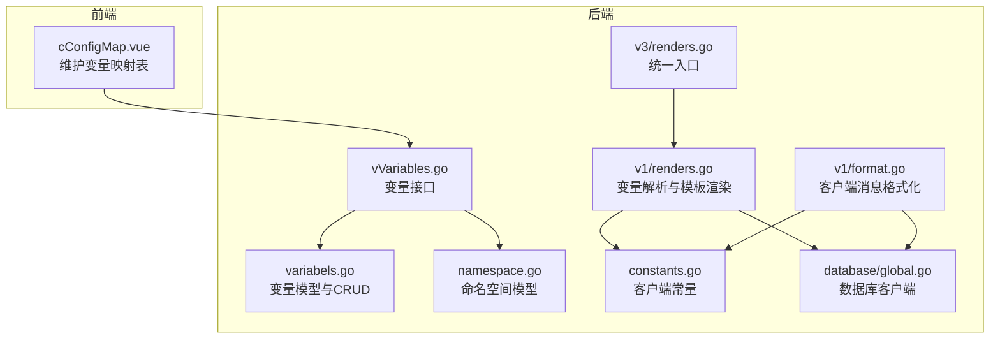
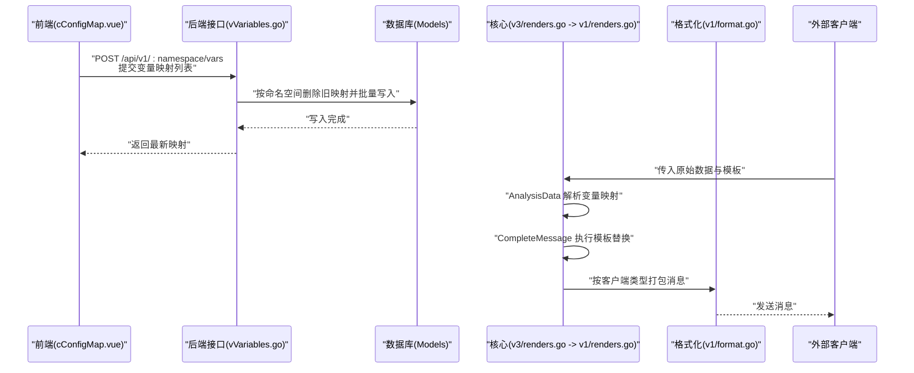
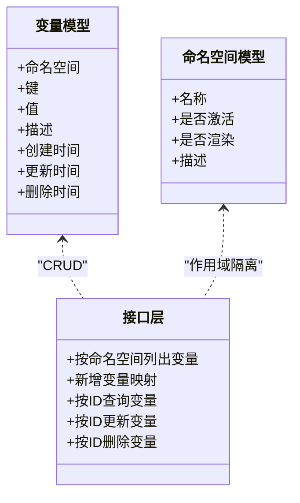
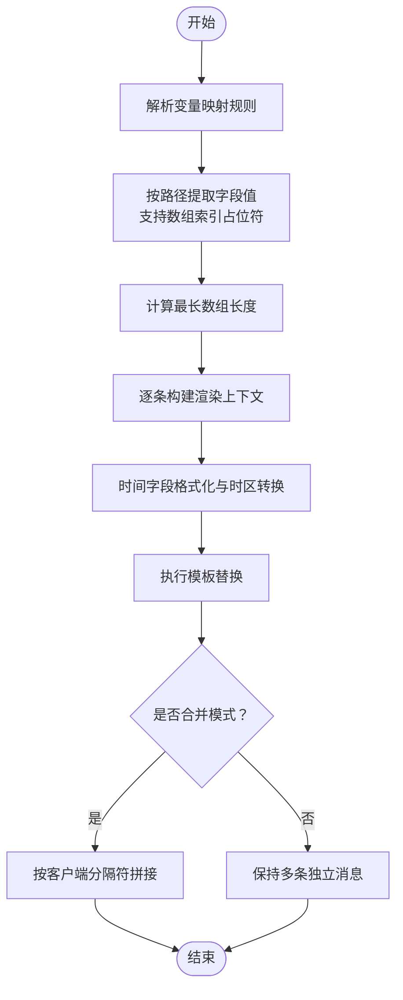
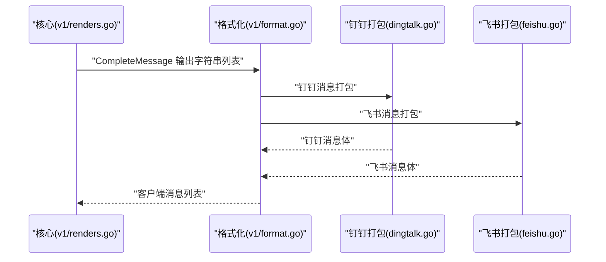
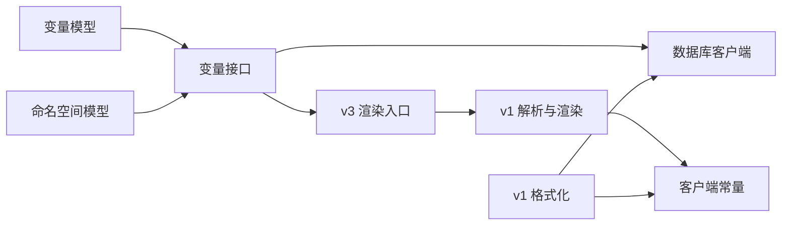

# 变量映射与替换

<cite>
**本文引用的文件**
- [pkg/models/variabels.go](file://pkg/models/variabels.go)
- [pkg/api/vVariables.go](file://pkg/api/vVariables.go)
- [pkg/services/core/v1/renders.go](file://pkg/services/core/v1/renders.go)
- [pkg/services/core/v1/format.go](file://pkg/services/core/v1/format.go)
- [pkg/services/core/v1/core.go](file://pkg/services/core/v1/core.go)
- [pkg/services/core/v3/renders.go](file://pkg/services/core/v3/renders.go)
- [pkg/utils/constants.go](file://pkg/utils/constants.go)
- [pkg/utils/template.json](file://pkg/utils/template.json)
- [pkg/utils/vars.json](file://pkg/utils/vars.json)
- [vue/src/components/cConfigMap.vue](file://vue/src/components/cConfigMap.vue)
- [pkg/models/namespace.go](file://pkg/models/namespace.go)
- [pkg/services/format/dingtalk.go](file://pkg/services/format/dingtalk.go)
- [pkg/services/format/feishu.go](file://pkg/services/format/feishu.go)
- [pkg/utils/database/global.go](file://pkg/utils/database/global.go)
</cite>

## 目录
1. [引言](#引言)
2. [项目结构](#项目结构)
3. [核心组件](#核心组件)
4. [架构总览](#架构总览)
5. [详细组件分析](#详细组件分析)
6. [依赖分析](#依赖分析)
7. [性能考量](#性能考量)
8. [故障排查指南](#故障排查指南)
9. [结论](#结论)
10. [附录](#附录)

## 引言
本文件围绕“变量映射与替换”机制展开，系统性阐述变量的定义、存储、解析、替换与渲染流程，并结合项目中的命名空间、模板与客户端适配，给出作用域与生命周期管理、命名规范与最佳实践、调试方法以及性能优化策略。读者无需深入 Go 或前端代码即可理解整体工作原理。

## 项目结构
变量映射与替换涉及前后端协同：前端负责维护用户变量映射表，后端负责持久化、解析原始数据、生成渲染模板所需的变量集合，并按不同客户端类型打包发送。

图表来源
- [vue/src/components/cConfigMap.vue:120-245](file://vue/src/components/cConfigMap.vue#L120-L245)
- [pkg/api/vVariables.go:12-103](file://pkg/api/vVariables.go#L12-L103)
- [pkg/models/variabels.go:9-89](file://pkg/models/variabels.go#L9-L89)
- [pkg/models/namespace.go:12-106](file://pkg/models/namespace.go#L12-L106)
- [pkg/services/core/v1/renders.go:15-127](file://pkg/services/core/v1/renders.go#L15-L127)
- [pkg/services/core/v1/format.go:10-62](file://pkg/services/core/v1/format.go#L10-L62)
- [pkg/services/core/v3/renders.go:10-13](file://pkg/services/core/v3/renders.go#L10-L13)
- [pkg/utils/constants.go:3-8](file://pkg/utils/constants.go#L3-L8)
- [pkg/utils/database/global.go:5-36](file://pkg/utils/database/global.go#L5-L36)

章节来源
- [vue/src/components/cConfigMap.vue:120-245](file://vue/src/components/cConfigMap.vue#L120-L245)
- [pkg/api/vVariables.go:12-103](file://pkg/api/vVariables.go#L12-L103)
- [pkg/models/variabels.go:9-89](file://pkg/models/variabels.go#L9-L89)
- [pkg/models/namespace.go:12-106](file://pkg/models/namespace.go#L12-L106)
- [pkg/services/core/v1/renders.go:15-127](file://pkg/services/core/v1/renders.go#L15-L127)
- [pkg/services/core/v1/format.go:10-62](file://pkg/services/core/v1/format.go#L10-L62)
- [pkg/services/core/v3/renders.go:10-13](file://pkg/services/core/v3/renders.go#L10-L13)
- [pkg/utils/constants.go:3-8](file://pkg/utils/constants.go#L3-L8)
- [pkg/utils/database/global.go:5-36](file://pkg/utils/database/global.go#L5-L36)

## 核心组件
- 变量模型与持久化：提供变量的增删改查与按命名空间批量更新能力，确保变量映射的原子性与一致性。
- 命名空间模型：承载变量映射的作用域边界，配合接口层实现按命名空间隔离。
- 变量解析与模板渲染：基于用户提供的变量映射规则，从原始数据中抽取目标字段，生成渲染上下文，并通过 Go html/template 执行模板替换。
- 客户端格式化：根据飞书、钉钉等客户端要求，将渲染后的消息体打包为对应结构。
- 前端配置界面：提供可视化编辑变量映射表，提交至后端并持久化。

章节来源
- [pkg/models/variabels.go:9-89](file://pkg/models/variabels.go#L9-L89)
- [pkg/models/namespace.go:12-106](file://pkg/models/namespace.go#L12-L106)
- [pkg/services/core/v1/renders.go:69-102](file://pkg/services/core/v1/renders.go#L69-L102)
- [pkg/services/core/v1/format.go:10-62](file://pkg/services/core/v1/format.go#L10-L62)
- [vue/src/components/cConfigMap.vue:120-245](file://vue/src/components/cConfigMap.vue#L120-L245)

## 架构总览
变量映射与替换的整体流程如下：

图表来源
- [vue/src/components/cConfigMap.vue:158-181](file://vue/src/components/cConfigMap.vue#L158-L181)
- [pkg/api/vVariables.go:30-43](file://pkg/api/vVariables.go#L30-L43)
- [pkg/models/variabels.go:65-88](file://pkg/models/variabels.go#L65-L88)
- [pkg/services/core/v3/renders.go:10-13](file://pkg/services/core/v3/renders.go#L10-L13)
- [pkg/services/core/v1/renders.go:69-102](file://pkg/services/core/v1/renders.go#L69-L102)
- [pkg/services/core/v1/format.go:10-62](file://pkg/services/core/v1/format.go#L10-L62)

## 详细组件分析

### 变量模型与命名空间
- 变量模型包含命名空间、键、值与描述；提供按命名空间列出、按 ID 查询、更新与删除等操作。
- 命名空间模型用于隔离变量映射，支持启用/禁用渲染模式等开关。
- 批量更新逻辑：先清空当前命名空间下所有变量，再写入最新映射，保证原子性。

图表来源
- [pkg/models/variabels.go:9-89](file://pkg/models/variabels.go#L9-L89)
- [pkg/models/namespace.go:12-106](file://pkg/models/namespace.go#L12-L106)
- [pkg/api/vVariables.go:12-103](file://pkg/api/vVariables.go#L12-L103)

章节来源
- [pkg/models/variabels.go:9-89](file://pkg/models/variabels.go#L9-L89)
- [pkg/models/namespace.go:12-106](file://pkg/models/namespace.go#L12-L106)
- [pkg/api/vVariables.go:12-103](file://pkg/api/vVariables.go#L12-L103)

### 变量解析与模板渲染
- 变量解析：根据用户提供的变量映射规则，使用 JSON 路径从原始数据中提取目标字段，支持数组索引占位符，计算最长数组长度以决定生成多条记录。
- 模板渲染：对时间字段进行时区转换与格式化，使用 Go html/template 将变量上下文注入模板，输出最终消息列表。
- 消息聚合：在合并模式下，将多条消息按客户端类型进行分隔符拼接。

图表来源
- [pkg/services/core/v1/renders.go:69-102](file://pkg/services/core/v1/renders.go#L69-L102)
- [pkg/services/core/v1/renders.go:15-67](file://pkg/services/core/v1/renders.go#L15-L67)

章节来源
- [pkg/services/core/v1/renders.go:69-102](file://pkg/services/core/v1/renders.go#L69-L102)
- [pkg/services/core/v1/renders.go:15-67](file://pkg/services/core/v1/renders.go#L15-L67)

### 客户端格式化与打包
- 钉钉：将消息体打包为 Markdown 结构，支持 at 手机号与 atAll。
- 飞书：将消息体打包为交互卡片结构，包含标题颜色与内容段落。
- 统一入口：v3 层提供 RendersContentData，内部调用 v1 的解析与渲染逻辑。

图表来源
- [pkg/services/core/v1/format.go:10-62](file://pkg/services/core/v1/format.go#L10-L62)
- [pkg/services/format/dingtalk.go:3-30](file://pkg/services/format/dingtalk.go#L3-L30)
- [pkg/services/format/feishu.go:7-61](file://pkg/services/format/feishu.go#L7-L61)
- [pkg/services/core/v3/renders.go:10-13](file://pkg/services/core/v3/renders.go#L10-L13)

章节来源
- [pkg/services/core/v1/format.go:10-62](file://pkg/services/core/v1/format.go#L10-L62)
- [pkg/services/format/dingtalk.go:3-30](file://pkg/services/format/dingtalk.go#L3-L30)
- [pkg/services/format/feishu.go:7-61](file://pkg/services/format/feishu.go#L7-L61)
- [pkg/services/core/v3/renders.go:10-13](file://pkg/services/core/v3/renders.go#L10-L13)

### 前端变量映射界面
- 用户在前端添加或删除变量映射项，每次提交都会将当前映射列表整体上传至后端。
- 前端会在模板中以占位符形式展示变量键，便于用户理解映射关系。
- 若后端无数据，前端会自动推送示例映射以帮助用户快速上手。

章节来源
- [vue/src/components/cConfigMap.vue:120-245](file://vue/src/components/cConfigMap.vue#L120-L245)
- [pkg/utils/vars.json:1-29](file://pkg/utils/vars.json#L1-L29)
- [pkg/utils/template.json:1-5](file://pkg/utils/template.json#L1-L5)

## 依赖分析
- 命名空间与变量：变量必须属于某个命名空间，接口层以命名空间为作用域进行 CRUD。
- 解析与渲染：v3 入口依赖 v1 的解析与渲染逻辑，形成清晰的版本演进。
- 客户端常量：通过常量统一客户端类型，避免魔法字符串。
- 数据库客户端：通过全局数据库客户端抽象，支持多种后端切换。

图表来源
- [pkg/models/variabels.go:9-89](file://pkg/models/variabels.go#L9-L89)
- [pkg/models/namespace.go:12-106](file://pkg/models/namespace.go#L12-L106)
- [pkg/api/vVariables.go:12-103](file://pkg/api/vVariables.go#L12-L103)
- [pkg/services/core/v3/renders.go:10-13](file://pkg/services/core/v3/renders.go#L10-L13)
- [pkg/services/core/v1/renders.go:69-102](file://pkg/services/core/v1/renders.go#L69-L102)
- [pkg/utils/constants.go:3-8](file://pkg/utils/constants.go#L3-L8)
- [pkg/utils/database/global.go:5-36](file://pkg/utils/database/global.go#L5-L36)

章节来源
- [pkg/models/variabels.go:9-89](file://pkg/models/variabels.go#L9-L89)
- [pkg/models/namespace.go:12-106](file://pkg/models/namespace.go#L12-L106)
- [pkg/api/vVariables.go:12-103](file://pkg/api/vVariables.go#L12-L103)
- [pkg/services/core/v3/renders.go:10-13](file://pkg/services/core/v3/renders.go#L10-L13)
- [pkg/services/core/v1/renders.go:69-102](file://pkg/services/core/v1/renders.go#L69-L102)
- [pkg/utils/constants.go:3-8](file://pkg/utils/constants.go#L3-L8)
- [pkg/utils/database/global.go:5-36](file://pkg/utils/database/global.go#L5-L36)

## 性能考量
- 变量映射批量更新：每次提交均清空并重写，避免并发写入导致的中间态，适合小规模映射场景；若映射规模较大，可考虑增量更新策略以减少数据库往返。
- 解析复杂度：解析阶段需遍历映射规则并按最长数组长度生成上下文，时间复杂度与映射数量及数组长度成正比；建议控制每条映射的路径层级与数组长度。
- 模板渲染：html/template 在渲染大模板时可能产生较多内存分配；建议复用模板实例、避免在热路径频繁 Parse。
- 客户端聚合：合并模式会进行字符串拼接，注意内存占用；在高并发场景下可考虑异步或流式处理。
- 数据库访问：统一通过全局数据库客户端访问，便于切换后端；建议在接口层增加必要的缓存与限流策略。

[本节为通用性能讨论，不直接分析具体文件]

## 故障排查指南
- 变量映射未生效
  - 检查前端提交的映射键是否与模板占位符一致。
  - 确认命名空间正确，接口请求路径包含正确的命名空间参数。
  - 查看后端日志中模板解析与执行错误信息。
- 模板渲染报错
  - 关注模板解析失败与模板执行失败的日志。
  - 检查时间字段格式与时区转换逻辑。
- 客户端消息异常
  - 核对打包函数中字段映射是否与客户端要求一致。
  - 检查合并模式下的分隔符是否符合客户端规范。
- 数据库写入问题
  - 批量更新时确认删除旧映射后再写入新映射，避免重复键冲突。
  - 关注数据库客户端初始化与连接状态。

章节来源
- [pkg/services/core/v1/renders.go:26-29](file://pkg/services/core/v1/renders.go#L26-L29)
- [pkg/services/core/v1/renders.go:57-60](file://pkg/services/core/v1/renders.go#L57-L60)
- [pkg/api/vVariables.go:30-43](file://pkg/api/vVariables.go#L30-L43)
- [pkg/services/format/dingtalk.go:3-30](file://pkg/services/format/dingtalk.go#L3-L30)
- [pkg/services/format/feishu.go:7-61](file://pkg/services/format/feishu.go#L7-L61)
- [pkg/utils/database/global.go:14-36](file://pkg/utils/database/global.go#L14-L36)

## 结论
变量映射与替换机制通过“前端可视化配置 + 后端解析渲染 + 客户端格式化”的分层设计，实现了灵活、可扩展的消息生成与推送。命名空间提供了天然的作用域隔离，批量更新保障了映射的一致性。在实践中，应重视映射规模、模板复杂度与客户端差异，结合缓存与限流策略提升整体性能与稳定性。

[本节为总结性内容，不直接分析具体文件]

## 附录

### 变量类型与作用域
- 内置变量：由系统预设的客户端类型常量，用于区分消息格式。
- 自定义变量：用户在前端配置的键值映射，键为模板占位符，值为原始数据路径。
- 命名空间变量：变量隶属于特定命名空间，接口层以命名空间为作用域进行隔离。

章节来源
- [pkg/utils/constants.go:3-8](file://pkg/utils/constants.go#L3-L8)
- [vue/src/components/cConfigMap.vue:120-245](file://vue/src/components/cConfigMap.vue#L120-L245)
- [pkg/models/namespace.go:12-106](file://pkg/models/namespace.go#L12-L106)

### 变量替换流程要点
- 变量解析：按映射规则提取原始数据字段，支持数组索引占位符。
- 值获取：使用 JSON 路径库获取目标值，必要时进行类型转换与格式化。
- 模板渲染：将上下文注入模板，输出最终字符串列表。
- 客户端打包：按客户端类型构造消息体，支持合并与独立两种模式。

章节来源
- [pkg/services/core/v1/renders.go:69-102](file://pkg/services/core/v1/renders.go#L69-L102)
- [pkg/services/core/v1/renders.go:15-67](file://pkg/services/core/v1/renders.go#L15-L67)
- [pkg/services/core/v1/format.go:10-62](file://pkg/services/core/v1/format.go#L10-L62)

### 命名规范与最佳实践
- 键命名：建议使用简洁、语义明确的标识符，避免特殊字符与空格。
- 路径表达：优先使用稳定字段路径，避免深层嵌套与动态键。
- 冲突避免：同一命名空间内键应唯一；跨命名空间可通过前缀区分。
- 性能考虑：控制映射数量与数组长度；模板尽量复用；避免在热路径频繁 Parse 模板。

[本节为通用最佳实践，不直接分析具体文件]

### 缓存机制与优化策略
- 模板缓存：对常用模板进行缓存，减少 Parse 开销。
- 映射缓存：对热点命名空间的变量映射进行短期缓存，降低数据库压力。
- 并发控制：在高并发场景下限制模板渲染与数据库写入频率。
- 异步处理：对长耗时任务采用异步队列，避免阻塞主流程。

[本节为通用优化建议，不直接分析具体文件]