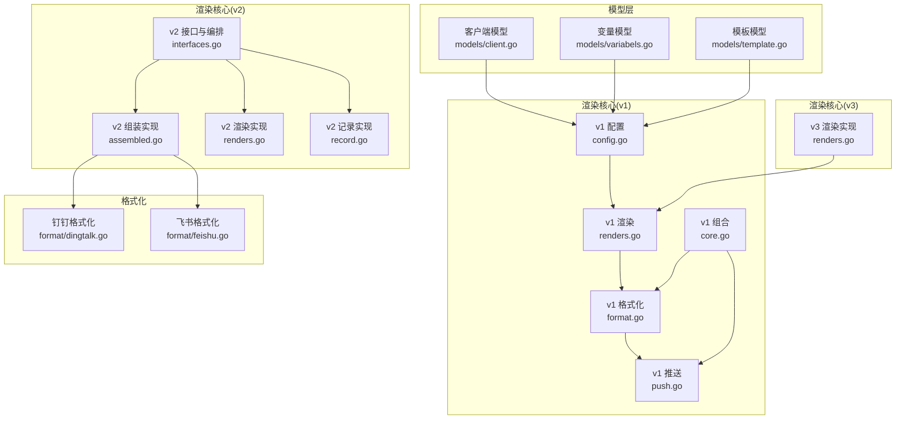
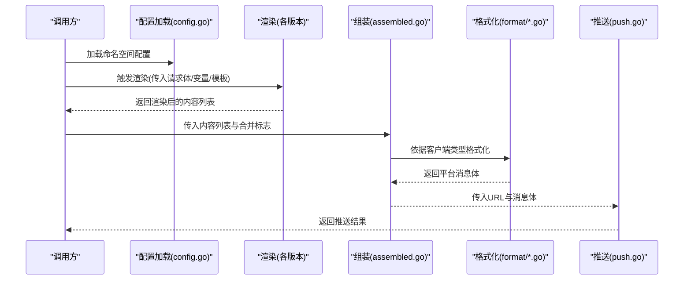
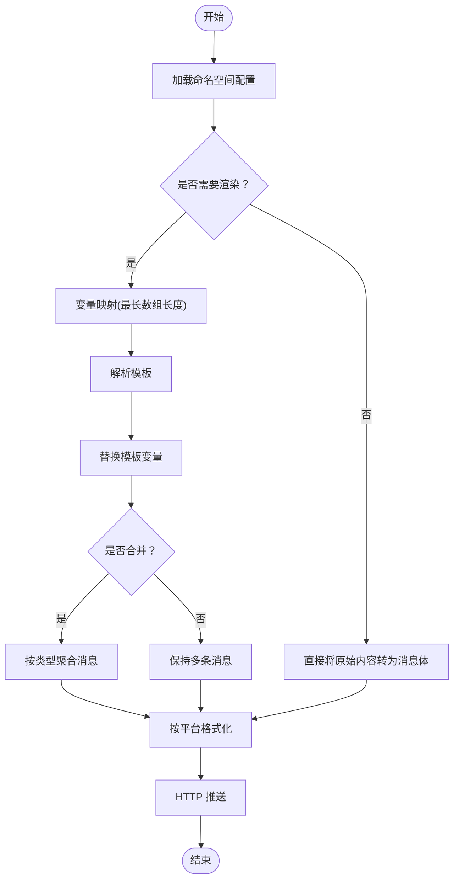
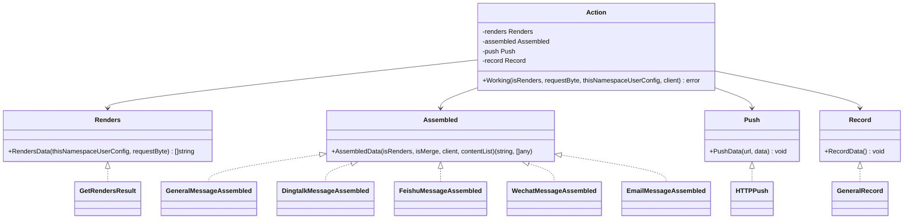
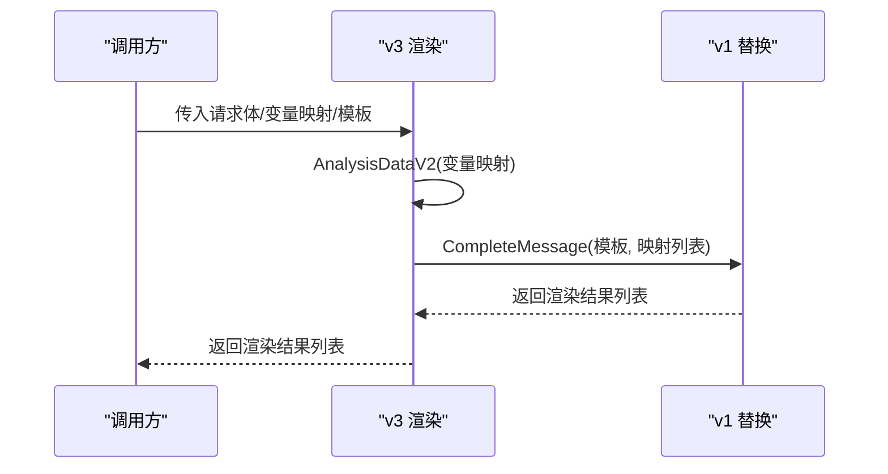
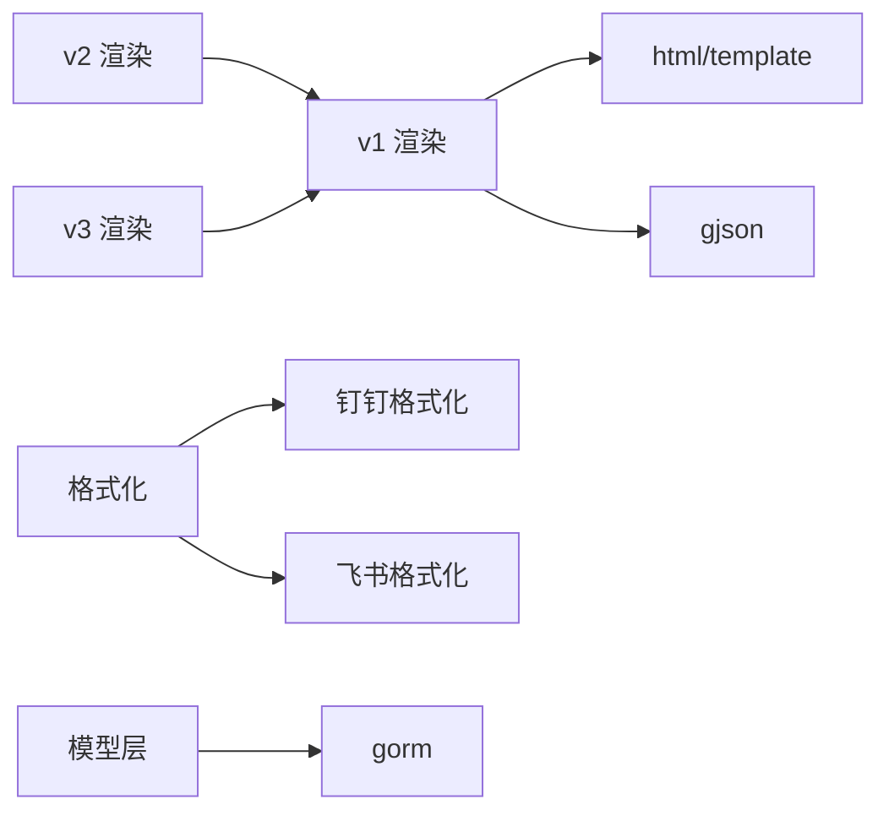

# 模板渲染引擎

<cite>
**本文引用的文件**
- [pkg/services/core/v1/core.go](file://pkg/services/core/v1/core.go)
- [pkg/services/core/v1/config.go](file://pkg/services/core/v1/config.go)
- [pkg/services/core/v1/format.go](file://pkg/services/core/v1/format.go)
- [pkg/services/core/v1/push.go](file://pkg/services/core/v1/push.go)
- [pkg/services/core/v1/renders.go](file://pkg/services/core/v1/renders.go)
- [pkg/services/core/v2/interfaces.go](file://pkg/services/core/v2/interfaces.go)
- [pkg/services/core/v2/assembled.go](file://pkg/services/core/v2/assembled.go)
- [pkg/services/core/v2/renders.go](file://pkg/services/core/v2/renders.go)
- [pkg/services/core/v2/record.go](file://pkg/services/core/v2/record.go)
- [pkg/services/core/v3/renders.go](file://pkg/services/core/v3/renders.go)
- [pkg/services/format/dingtalk.go](file://pkg/services/format/dingtalk.go)
- [pkg/services/format/feishu.go](file://pkg/services/format/feishu.go)
- [pkg/models/template.go](file://pkg/models/template.go)
- [pkg/models/client.go](file://pkg/models/client.go)
- [pkg/models/variabels.go](file://pkg/models/variabels.go)
</cite>

## 目录
1. [引言](#引言)
2. [项目结构](#项目结构)
3. [核心组件](#核心组件)
4. [架构总览](#架构总览)
5. [详细组件分析](#详细组件分析)
6. [依赖分析](#依赖分析)
7. [性能考虑](#性能考虑)
8. [故障排查指南](#故障排查指南)
9. [结论](#结论)
10. [附录](#附录)

## 引言
本技术文档围绕模板渲染引擎展开，系统性阐述模板渲染的完整流程与实现原理，覆盖解析阶段、验证阶段、替换阶段、格式化阶段等关键步骤；深入解析 v1、v2、v3 三个版本的演进差异与适用场景；总结性能优化策略（缓存、并行、内存管理）、错误处理与异常恢复机制，以及渲染结果的验证与测试方法。文档面向不同技术背景读者，力求以循序渐进的方式呈现复杂实现。

## 项目结构
模板渲染引擎位于后端服务的业务层，按版本划分核心模块，分别负责渲染、组装、推送与记录等职责。前端模板与变量通过模型层持久化，供渲染阶段读取与使用。

图表来源
- [pkg/services/core/v1/config.go:1-79](file://pkg/services/core/v1/config.go#L1-L79)
- [pkg/services/core/v1/renders.go:1-127](file://pkg/services/core/v1/renders.go#L1-L127)
- [pkg/services/core/v1/format.go:1-62](file://pkg/services/core/v1/format.go#L1-L62)
- [pkg/services/core/v1/push.go:1-57](file://pkg/services/core/v1/push.go#L1-L57)
- [pkg/services/core/v1/core.go:1-65](file://pkg/services/core/v1/core.go#L1-L65)
- [pkg/services/core/v2/interfaces.go:1-60](file://pkg/services/core/v2/interfaces.go#L1-L60)
- [pkg/services/core/v2/assembled.go:1-140](file://pkg/services/core/v2/assembled.go#L1-L140)
- [pkg/services/core/v2/renders.go:1-29](file://pkg/services/core/v2/renders.go#L1-L29)
- [pkg/services/core/v2/record.go:1-15](file://pkg/services/core/v2/record.go#L1-L15)
- [pkg/services/core/v3/renders.go:1-59](file://pkg/services/core/v3/renders.go#L1-L59)
- [pkg/services/format/dingtalk.go:1-30](file://pkg/services/format/dingtalk.go#L1-L30)
- [pkg/services/format/feishu.go:1-61](file://pkg/services/format/feishu.go#L1-L61)
- [pkg/models/client.go:1-239](file://pkg/models/client.go#L1-L239)
- [pkg/models/variabels.go:1-89](file://pkg/models/variabels.go#L1-L89)
- [pkg/models/template.go:1-72](file://pkg/models/template.go#L1-L72)

章节来源
- [pkg/services/core/v1/config.go:1-79](file://pkg/services/core/v1/config.go#L1-L79)
- [pkg/services/core/v2/interfaces.go:1-60](file://pkg/services/core/v2/interfaces.go#L1-L60)
- [pkg/services/core/v3/renders.go:1-59](file://pkg/services/core/v3/renders.go#L1-L59)

## 核心组件
- v1 渲染链路：配置加载 → 变量映射 → 模板解析与替换 → 消息聚合 → 格式化 → 推送
- v2 编排链路：接口抽象(Action) → 渲染实现 → 组装实现 → 推送与记录
- v3 渲染链路：基于 v2 的变量映射与 v1 的模板替换，简化了组装与推送逻辑
- 格式化模块：针对钉钉、飞书等平台的消息体结构进行打包
- 模型层：客户端、变量、模板的持久化与查询

章节来源
- [pkg/services/core/v1/renders.go:15-127](file://pkg/services/core/v1/renders.go#L15-L127)
- [pkg/services/core/v2/interfaces.go:29-60](file://pkg/services/core/v2/interfaces.go#L29-L60)
- [pkg/services/core/v3/renders.go:10-59](file://pkg/services/core/v3/renders.go#L10-L59)
- [pkg/services/format/dingtalk.go:1-30](file://pkg/services/format/dingtalk.go#L1-L30)
- [pkg/services/format/feishu.go:1-61](file://pkg/services/format/feishu.go#L1-L61)
- [pkg/models/client.go:13-239](file://pkg/models/client.go#L13-L239)
- [pkg/models/variabels.go:9-89](file://pkg/models/variabels.go#L9-L89)
- [pkg/models/template.go:9-72](file://pkg/models/template.go#L9-L72)

## 架构总览
渲染引擎采用分层与接口抽象设计，v2 通过接口解耦渲染、组装、推送与记录，形成可插拔的行为编排；v1 与 v3 则分别代表早期直连实现与精简实现。

图表来源
- [pkg/services/core/v1/config.go:20-58](file://pkg/services/core/v1/config.go#L20-L58)
- [pkg/services/core/v1/renders.go:15-127](file://pkg/services/core/v1/renders.go#L15-L127)
- [pkg/services/core/v2/assembled.go:17-140](file://pkg/services/core/v2/assembled.go#L17-L140)
- [pkg/services/core/v3/renders.go:10-59](file://pkg/services/core/v3/renders.go#L10-L59)
- [pkg/services/format/dingtalk.go:1-30](file://pkg/services/format/dingtalk.go#L1-L30)
- [pkg/services/format/feishu.go:1-61](file://pkg/services/format/feishu.go#L1-L61)
- [pkg/services/core/v1/push.go:14-57](file://pkg/services/core/v1/push.go#L14-L57)

## 详细组件分析

### v1 版本：直连渲染与推送
- 配置加载：从命名空间读取激活客户端、变量映射与模板内容，决定是否启用渲染与是否合并消息
- 变量映射：基于 gjson 的路径提取，按最长数组长度生成多条映射，逐条填充模板
- 模板解析与替换：使用 Go html/template 解析模板，执行替换，必要时进行时区转换
- 消息聚合：按客户端类型选择分隔符进行合并
- 格式化：将渲染结果按平台要求打包为消息体
- 推送：HTTP POST 发送消息体

图表来源
- [pkg/services/core/v1/config.go:20-58](file://pkg/services/core/v1/config.go#L20-L58)
- [pkg/services/core/v1/renders.go:69-127](file://pkg/services/core/v1/renders.go#L69-L127)
- [pkg/services/core/v1/format.go:10-62](file://pkg/services/core/v1/format.go#L10-L62)
- [pkg/services/core/v1/push.go:14-57](file://pkg/services/core/v1/push.go#L14-L57)

章节来源
- [pkg/services/core/v1/config.go:11-79](file://pkg/services/core/v1/config.go#L11-L79)
- [pkg/services/core/v1/renders.go:15-127](file://pkg/services/core/v1/renders.go#L15-L127)
- [pkg/services/core/v1/format.go:10-62](file://pkg/services/core/v1/format.go#L10-L62)
- [pkg/services/core/v1/push.go:14-57](file://pkg/services/core/v1/push.go#L14-L57)

### v2 版本：接口抽象与行为编排
- 接口设计：Renders、Assembled、Push、Record 四大接口，Action 负责编排工作流
- 渲染实现：复用 v1 的变量映射与模板替换能力
- 组装实现：按客户端类型选择格式化策略，支持合并与非合并两种模式
- 记录实现：统一记录发送行为
- 推送：沿用 v1 的 HTTP 推送

图表来源
- [pkg/services/core/v2/interfaces.go:9-60](file://pkg/services/core/v2/interfaces.go#L9-L60)
- [pkg/services/core/v2/assembled.go:12-140](file://pkg/services/core/v2/assembled.go#L12-L140)
- [pkg/services/core/v2/renders.go:8-29](file://pkg/services/core/v2/renders.go#L8-L29)
- [pkg/services/core/v2/record.go:7-15](file://pkg/services/core/v2/record.go#L7-L15)

章节来源
- [pkg/services/core/v2/interfaces.go:9-60](file://pkg/services/core/v2/interfaces.go#L9-L60)
- [pkg/services/core/v2/assembled.go:12-140](file://pkg/services/core/v2/assembled.go#L12-L140)
- [pkg/services/core/v2/renders.go:8-29](file://pkg/services/core/v2/renders.go#L8-L29)
- [pkg/services/core/v2/record.go:7-15](file://pkg/services/core/v2/record.go#L7-L15)

### v3 版本：简化渲染与映射
- 渲染入口：接收变量映射、请求体与模板，内部调用 v1 的模板替换逻辑
- 变量映射：基于 gjson 的路径提取与最长数组长度策略，生成多条映射
- 适用场景：当需要快速完成变量提取与模板替换，且无需额外组装/推送逻辑时

图表来源
- [pkg/services/core/v3/renders.go:10-59](file://pkg/services/core/v3/renders.go#L10-L59)
- [pkg/services/core/v1/renders.go:15-127](file://pkg/services/core/v1/renders.go#L15-L127)

章节来源
- [pkg/services/core/v3/renders.go:10-59](file://pkg/services/core/v3/renders.go#L10-L59)

### 平台格式化组件
- 钉钉格式化：生成 Markdown 类型消息体，支持 @ 手机号与 @All
- 飞书格式化：生成交互卡片类型消息体，包含标题与元素列表

章节来源
- [pkg/services/format/dingtalk.go:1-30](file://pkg/services/format/dingtalk.go#L1-L30)
- [pkg/services/format/feishu.go:1-61](file://pkg/services/format/feishu.go#L1-L61)

### 模型层与数据源
- 客户端模型：包含钉钉、飞书、企业微信等扩展字段，支持随机 URL 列表与关键字
- 变量模型：命名空间下的键值映射，用于模板变量替换
- 模板模型：命名空间下的模板内容与是否合并标志

章节来源
- [pkg/models/client.go:13-239](file://pkg/models/client.go#L13-L239)
- [pkg/models/variabels.go:9-89](file://pkg/models/variabels.go#L9-L89)
- [pkg/models/template.go:9-72](file://pkg/models/template.go#L9-L72)

## 依赖分析
- v1 依赖：html/template 用于模板解析与执行；gjson 用于 JSON 路径提取；loggers 用于日志记录
- v2 依赖：v1 的配置与渲染能力；format 包用于平台消息体格式化
- v3 依赖：v1 的 CompleteMessage 与 gjson 的变量映射
- 模型层依赖：gorm 与数据库连接，提供 CRUD 能力

图表来源
- [pkg/services/core/v1/renders.go:3-13](file://pkg/services/core/v1/renders.go#L3-L13)
- [pkg/services/core/v2/renders.go:3-6](file://pkg/services/core/v2/renders.go#L3-L6)
- [pkg/services/core/v3/renders.go:3-8](file://pkg/services/core/v3/renders.go#L3-L8)
- [pkg/models/client.go:3-11](file://pkg/models/client.go#L3-L11)

章节来源
- [pkg/services/core/v1/renders.go:3-13](file://pkg/services/core/v1/renders.go#L3-L13)
- [pkg/services/core/v2/renders.go:3-6](file://pkg/services/core/v2/renders.go#L3-L6)
- [pkg/services/core/v3/renders.go:3-8](file://pkg/services/core/v3/renders.go#L3-L8)
- [pkg/models/client.go:3-11](file://pkg/models/client.go#L3-L11)

## 性能考虑
- 缓存机制
  - 变量映射与模板内容可缓存于进程内，避免重复解析与数据库查询
  - 客户端随机 URL 列表可缓存，减少字符串切分与拼接开销
- 并行处理
  - 多客户端并行组装与推送，注意并发安全与限速控制
  - 对长数组映射的渲染可按块并行处理，最后合并结果
- 内存管理
  - 使用 bytes.Buffer 作为模板执行输出缓冲，避免频繁字符串拼接
  - 控制消息聚合长度，防止单次消息过大导致内存峰值过高
- 日志与可观测性
  - 在关键节点记录耗时与错误，便于定位性能瓶颈

## 故障排查指南
- 渲染失败
  - 检查模板语法与变量名是否匹配；确认时区转换逻辑在容器环境下的可用性
- 变量映射为空
  - 核对命名空间下的变量映射是否正确；确认 JSON 路径是否指向有效数组
- 消息聚合异常
  - 校验客户端类型与聚合分隔符；确认 isMerge 标志与业务期望一致
- 推送失败
  - 查看 HTTP 响应状态与返回体；核对随机 URL 是否可用；检查网络与鉴权配置
- 记录缺失
  - 确认 Record 实现已接入 Action.Working 流程

章节来源
- [pkg/services/core/v1/renders.go:26-60](file://pkg/services/core/v1/renders.go#L26-L60)
- [pkg/services/core/v1/renders.go:75-102](file://pkg/services/core/v1/renders.go#L75-L102)
- [pkg/services/core/v1/format.go:10-62](file://pkg/services/core/v1/format.go#L10-L62)
- [pkg/services/core/v1/push.go:14-57](file://pkg/services/core/v1/push.go#L14-L57)
- [pkg/services/core/v2/interfaces.go:48-59](file://pkg/services/core/v2/interfaces.go#L48-L59)

## 结论
该模板渲染引擎通过 v1 的直连实现、v2 的接口抽象与 v3 的简化实现，逐步提升了可维护性与可扩展性。v1 注重完备性，v2 注重解耦与编排，v3 注重轻量化与高复用。结合合理的缓存、并行与内存管理策略，可在高并发场景下稳定运行。建议在生产环境中配合完善的日志与监控体系，持续优化渲染路径与推送策略。

## 附录
- 版本演进要点
  - v1：完整链路直连，适合快速落地与小规模使用
  - v2：引入接口与编排，适合多平台扩展与团队协作
  - v3：聚焦变量映射与模板替换，适合快速集成与二次开发
- 适用场景
  - v1：简单模板与少量客户端
  - v2：多平台、多客户端、需要灵活编排
  - v3：已有变量映射与模板，仅需渲染替换