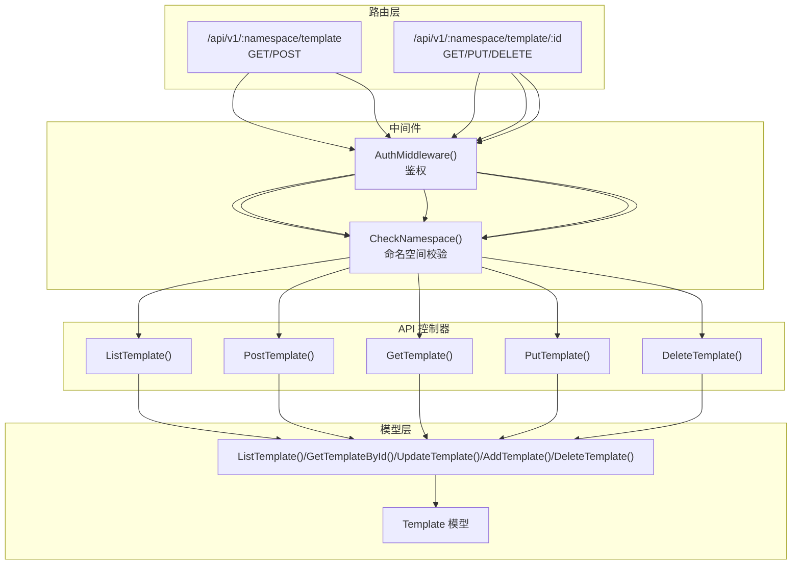
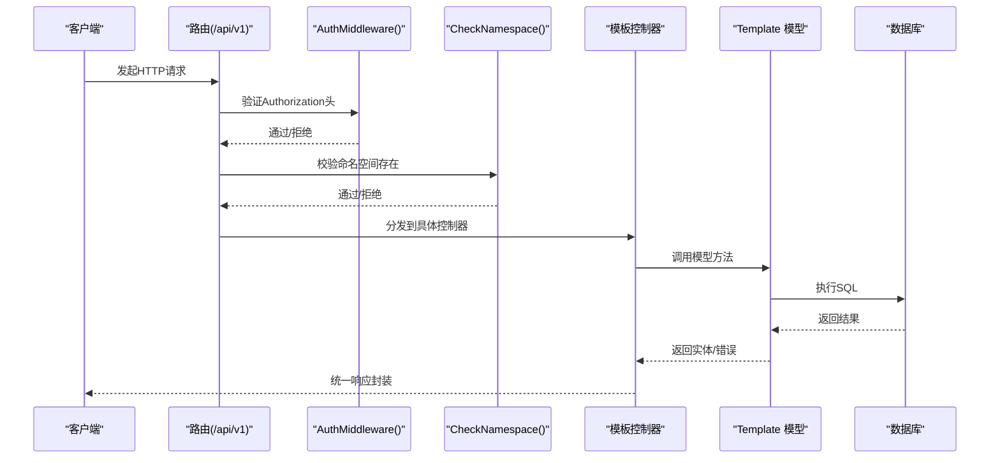
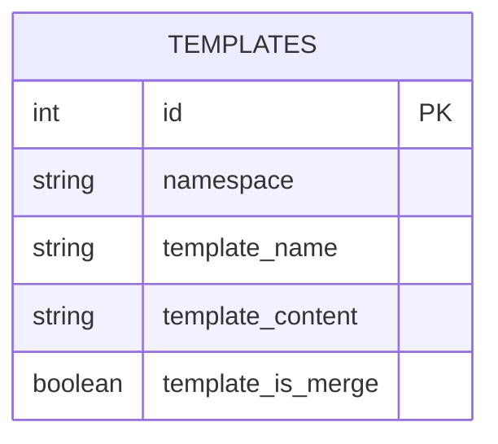
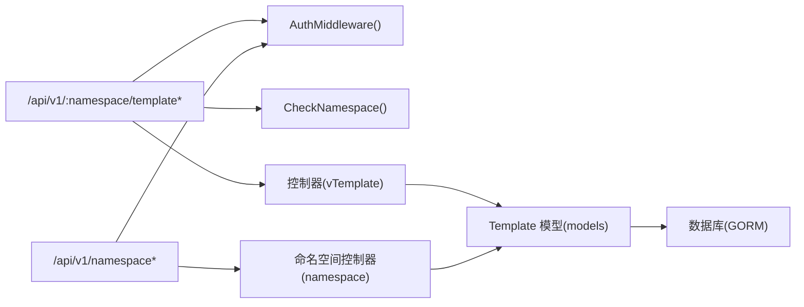

# 模板管理 API

<cite>
**本文引用的文件**
- [pkg/api/vTemplate.go](file://pkg/api/vTemplate.go)
- [pkg/models/template.go](file://pkg/models/template.go)
- [pkg/routers/urls.go](file://pkg/routers/urls.go)
- [pkg/utils/response.go](file://pkg/utils/response.go)
- [pkg/middleware/auth.go](file://pkg/middleware/auth.go)
- [pkg/middleware/namespace.go](file://pkg/middleware/namespace.go)
- [assets/docs/swagger.yaml](file://assets/docs/swagger.yaml)
- [vue/src/service/requests.js](file://vue/src/service/requests.js)
- [wiki/response.md](file://wiki/response.md)
</cite>

## 目录
1. [简介](#简介)
2. [项目结构](#项目结构)
3. [核心组件](#核心组件)
4. [架构总览](#架构总览)
5. [详细组件分析](#详细组件分析)
6. [依赖分析](#依赖分析)
7. [性能考虑](#性能考虑)
8. [故障排查指南](#故障排查指南)
9. [结论](#结论)
10. [附录](#附录)

## 简介
本文件为模板管理 API 的完整技术文档，覆盖以下端点：
- GET /api/v1/:namespace/template
- POST /api/v1/:namespace/template
- GET /api/v1/:namespace/template/:id
- PUT /api/v1/:namespace/template/:id
- DELETE /api/v1/:namespace/template/:id

文档内容包括：接口参数说明、请求/响应结构、业务逻辑、权限与中间件要求、错误码与异常处理、调用示例（curl、SDK、前端集成）、API 版本管理与兼容性、性能特征与使用限制等。

## 项目结构
模板管理 API 所属模块位于后端服务的 API 层，路由注册于 v1 组下，并通过中间件进行鉴权与命名空间校验。数据访问层由 models 包提供，统一通过 GORM 访问数据库。

图表来源
- [pkg/routers/urls.go:58-90](file://pkg/routers/urls.go#L58-L90)
- [pkg/api/vTemplate.go:13-146](file://pkg/api/vTemplate.go#L13-L146)
- [pkg/models/template.go:24-71](file://pkg/models/template.go#L24-L71)

章节来源
- [pkg/routers/urls.go:58-90](file://pkg/routers/urls.go#L58-L90)

## 核心组件
- 路由组：/api/v1，启用命名空间中间件与鉴权中间件
- 控制器：模板管理控制器，负责参数解析、业务校验、调用模型层、封装响应
- 模型层：Template 数据模型及 CRUD 方法
- 响应封装：统一响应结构，包含 code、msg、result、error 字段

章节来源
- [pkg/api/vTemplate.go:13-146](file://pkg/api/vTemplate.go#L13-L146)
- [pkg/models/template.go:9-71](file://pkg/models/template.go#L9-L71)
- [pkg/utils/response.go:3-27](file://pkg/utils/response.go#L3-L27)

## 架构总览
模板管理 API 的调用链路如下：客户端 -> 路由 -> 中间件（鉴权/命名空间）-> 控制器 -> 模型层 -> 数据库；响应统一通过工具函数封装。

图表来源
- [pkg/routers/urls.go:58-90](file://pkg/routers/urls.go#L58-L90)
- [pkg/middleware/auth.go:12-61](file://pkg/middleware/auth.go#L12-L61)
- [pkg/middleware/namespace.go:20-46](file://pkg/middleware/namespace.go#L20-L46)
- [pkg/api/vTemplate.go:13-146](file://pkg/api/vTemplate.go#L13-L146)
- [pkg/models/template.go:24-71](file://pkg/models/template.go#L24-L71)

## 详细组件分析

### 接口定义与参数说明

#### GET /api/v1/:namespace/template
- 功能：列出指定命名空间下的所有消息模板
- 路径参数
  - namespace: string，必填，命名空间标识
- 查询参数：无
- 请求体：无
- 响应体
  - code: number，1 表示成功，0 表示失败
  - msg: string，描述信息
  - result: Template[]，模板列表
  - error: any，失败时的错误对象
- 权限要求
  - 需要 Authorization 头（JWT），由 AuthMiddleware 校验
  - 命名空间必须存在，由 CheckNamespace 校验
- 业务逻辑
  - 根据 namespace 查询模板集合
  - 返回模板数组
- 错误与异常
  - 400 参数错误：namespace 解析失败或模板查询失败
  - 500 服务器错误：数据库查询异常
- 示例
  - curl
    - curl -H "Authorization: Bearer <token>" https://your-host/api/v1/ns1/template
  - SDK/前端
    - Vue：调用 service/requests.js 中的 getTemplate(namespace)

章节来源
- [pkg/api/vTemplate.go:13-25](file://pkg/api/vTemplate.go#L13-L25)
- [pkg/routers/urls.go:75-76](file://pkg/routers/urls.go#L75-L76)
- [vue/src/service/requests.js:17](file://vue/src/service/requests.js#L17)
- [assets/docs/swagger.yaml:37-42](file://assets/docs/swagger.yaml#L37-L42)

#### POST /api/v1/:namespace/template
- 功能：新增一个消息模板（注意：当前实现会先删除该命名空间下已有模板，再新增）
- 路径参数
  - namespace: string，必填，命名空间标识
- 查询参数：无
- 请求体
  - namespace: string，可选（会被覆盖为路径参数）
  - template_name: string，模板名称
  - template_content: string，模板内容（Go 语法模板）
  - template_is_merge: boolean，是否合并发送
- 响应体
  - code: number，1 表示成功，0 表示失败
  - msg: string，描述信息
  - result: Template，新增的模板对象
  - error: any，失败时的错误对象
- 权限要求
  - 需要 Authorization 头（JWT）
  - 命名空间必须存在
- 业务逻辑
  - 先查询该命名空间下所有模板并逐个删除
  - 再新增传入的模板
- 错误与异常
  - 400 请求内容错误：JSON 绑定失败
  - 400 模板添加失败：删除或新增过程出错
  - 500 服务器错误：数据库异常
- 示例
  - curl
    - curl -X POST -H "Authorization: Bearer <token>" -H "Content-Type: application/json" -d '{"template_name":"通知","template_content":"{{.title}}","template_is_merge":true}' https://your-host/api/v1/ns1/template
  - SDK/前端
    - Vue：调用 service/requests.js 中的 postTemplate(namespace, data)

章节来源
- [pkg/api/vTemplate.go:27-64](file://pkg/api/vTemplate.go#L27-L64)
- [pkg/routers/urls.go:77](file://pkg/routers/urls.go#L77)
- [vue/src/service/requests.js:18](file://vue/src/service/requests.js#L18)
- [assets/docs/swagger.yaml:43-46](file://assets/docs/swagger.yaml#L43-L46)

#### GET /api/v1/:namespace/template/:id
- 功能：按 ID 查询单个模板
- 路径参数
  - namespace: string，必填，命名空间标识
  - id: integer，必填，模板 ID
- 查询参数：无
- 请求体：无
- 响应体
  - code: number，1 表示成功，0 表示失败
  - msg: string，描述信息
  - result: Template，模板对象
  - error: any，失败时的错误对象
- 权限要求
  - 需要 Authorization 头（JWT）
  - 命名空间必须存在
- 业务逻辑
  - 校验 id 是否为整数
  - 查询模板并检查是否属于当前命名空间
- 错误与异常
  - 400 参数错误：id 非法或模板不属于当前命名空间
  - 400 查询失败：数据库查询异常
- 示例
  - curl
    - curl -H "Authorization: Bearer <token>" https://your-host/api/v1/ns1/template/1
  - SDK/前端
    - Vue：调用 service/requests.js 中的 getClientOne(namespace, id)

章节来源
- [pkg/api/vTemplate.go:66-86](file://pkg/api/vTemplate.go#L66-L86)
- [pkg/routers/urls.go:79-85](file://pkg/routers/urls.go#L79-L85)
- [assets/docs/swagger.yaml:54-57](file://assets/docs/swagger.yaml#L54-L57)

#### PUT /api/v1/:namespace/template/:id
- 功能：按 ID 更新模板
- 路径参数
  - namespace: string，必填，命名空间标识
  - id: integer，必填，模板 ID
- 查询参数：无
- 请求体
  - namespace: string，可选（会被覆盖为路径参数）
  - template_name: string
  - template_content: string
  - template_is_merge: boolean
- 响应体
  - code: number，1 表示成功，0 表示失败
  - msg: string，描述信息
  - result: Template，更新后的模板对象
  - error: any，失败时的错误对象
- 权限要求
  - 需要 Authorization 头（JWT）
  - 命名空间必须存在
- 业务逻辑
  - 校验 id 是否为整数
  - 查询模板并检查是否属于当前命名空间
  - 绑定请求体并更新模板
- 错误与异常
  - 400 参数错误：id 非法或模板不属于当前命名空间
  - 400 请求内容错误：JSON 绑定失败
  - 400 更新失败：数据库更新异常
- 示例
  - curl
    - curl -X PUT -H "Authorization: Bearer <token>" -H "Content-Type: application/json" -d '{"template_name":"更新后的通知","template_is_merge":false}' https://your-host/api/v1/ns1/template/1
  - SDK/前端
    - Vue：调用 service/requests.js 中的 putClientOne(namespace, id, data)

章节来源
- [pkg/api/vTemplate.go:88-119](file://pkg/api/vTemplate.go#L88-L119)
- [pkg/routers/urls.go:83-84](file://pkg/routers/urls.go#L83-L84)
- [assets/docs/swagger.yaml:59-62](file://assets/docs/swagger.yaml#L59-L62)

#### DELETE /api/v1/:namespace/template/:id
- 功能：按 ID 删除模板
- 路径参数
  - namespace: string，必填，命名空间标识
  - id: integer，必填，模板 ID
- 查询参数：无
- 请求体：无
- 响应体
  - code: number，1 表示成功，0 表示失败
  - msg: string，描述信息
  - result: string，受影响的行数说明
  - error: any，失败时的错误对象
- 权限要求
  - 需要 Authorization 头（JWT）
  - 命名空间必须存在
- 业务逻辑
  - 校验 id 是否为整数
  - 查询模板并检查是否属于当前命名空间
  - 删除模板并返回影响行数
- 错误与异常
  - 400 参数错误：id 非法或模板不属于当前命名空间
  - 400 删除失败：数据库删除异常
- 示例
  - curl
    - curl -X DELETE -H "Authorization: Bearer <token>" https://your-host/api/v1/ns1/template/1
  - SDK/前端
    - Vue：调用 service/requests.js 中的 deleteClientOne(namespace, id)

章节来源
- [pkg/api/vTemplate.go:121-146](file://pkg/api/vTemplate.go#L121-L146)
- [pkg/routers/urls.go:82-85](file://pkg/routers/urls.go#L82-L85)
- [assets/docs/swagger.yaml:48-51](file://assets/docs/swagger.yaml#L48-L51)

### 数据模型与数据库交互

图表来源
- [pkg/models/template.go:9-18](file://pkg/models/template.go#L9-L18)

- 关键方法
  - AddTemplate(t): 新增模板
  - UpdateTemplate(id, t): 更新模板
  - GetTemplateById(id): 按 ID 查询
  - ListTemplate(ns): 按命名空间查询
  - DeleteTemplate(id): 按 ID 删除
  - DeleteTemplateByNs(ns): 按命名空间批量删除

章节来源
- [pkg/models/template.go:24-71](file://pkg/models/template.go#L24-L71)

### 统一响应结构
- 成功响应：code=1，msg 描述，result 返回数据，error=null
- 失败响应：code=0，msg 描述，result=null，error 返回错误对象
- 参考文档：wiki/response.md

章节来源
- [pkg/utils/response.go:3-27](file://pkg/utils/response.go#L3-L27)
- [wiki/response.md:1-43](file://wiki/response.md#L1-L43)

### 中间件与权限
- 鉴权中间件 AuthMiddleware
  - 必须携带 Authorization 头
  - 校验 JWT 有效性与签名
  - 若 token 不在会话表中视为未登录
- 命名空间中间件 CheckNamespace
  - 校验命名空间是否存在
  - 对特定路径（如 /go、/gomessage）默认使用 "default" 命名空间

章节来源
- [pkg/middleware/auth.go:12-61](file://pkg/middleware/auth.go#L12-L61)
- [pkg/middleware/namespace.go:20-46](file://pkg/middleware/namespace.go#L20-L46)
- [pkg/routers/urls.go:58-90](file://pkg/routers/urls.go#L58-L90)

### API 版本管理与兼容性
- 当前模板管理 API 位于 /api/v1 下，采用命名空间分组
- 路由注册时统一挂载 CheckNamespace 与 AuthMiddleware
- 未来升级建议
  - 新增 /api/v2 时保持相同路径结构，逐步替换旧实现
  - 保持响应结构稳定，避免破坏性变更
  - 在 Swagger 文档中明确标注废弃与迁移指引

章节来源
- [pkg/routers/urls.go:58-90](file://pkg/routers/urls.go#L58-L90)
- [assets/docs/swagger.yaml:37-63](file://assets/docs/swagger.yaml#L37-L63)

## 依赖分析

图表来源
- [pkg/routers/urls.go:58-104](file://pkg/routers/urls.go#L58-L104)
- [pkg/api/vTemplate.go:13-146](file://pkg/api/vTemplate.go#L13-L146)
- [pkg/models/template.go:24-71](file://pkg/models/template.go#L24-L71)

## 性能考虑
- 单次新增模板会先删除该命名空间下所有模板，再新增一个，适合“单一模板”场景；若需多模板支持，建议扩展模型与控制器以支持多模板并存
- 查询与更新均基于主键或命名空间过滤，索引设计建议确保 namespace 字段有索引
- 建议对模板内容进行大小限制与格式校验，避免超大模板导致渲染性能问题
- 前端调用建议缓存模板内容，减少频繁请求

[本节为通用性能建议，无需特定文件来源]

## 故障排查指南
- 401 未授权
  - 检查 Authorization 头是否正确传递
  - 确认 JWT 未过期且在会话表中有效
- 404 命名空间不存在
  - 确认 namespace 是否拼写正确
  - 检查 CheckNamespace 中间件日志
- 400 参数错误
  - 检查 id 是否为整数
  - 检查模板是否属于当前命名空间
- 500 服务器错误
  - 查看数据库连接与迁移状态
  - 检查模板内容是否符合 Go 模板语法

章节来源
- [pkg/middleware/auth.go:12-61](file://pkg/middleware/auth.go#L12-L61)
- [pkg/middleware/namespace.go:20-46](file://pkg/middleware/namespace.go#L20-L46)
- [pkg/api/vTemplate.go:13-146](file://pkg/api/vTemplate.go#L13-L146)

## 结论
模板管理 API 提供了命名空间维度的消息模板增删改查能力，配合鉴权与命名空间中间件保证安全性与隔离性。当前实现以“单一模板”为核心语义，若业务需要多模板并存，建议在不影响现有接口的前提下扩展模型与控制器，保持响应结构与路由路径稳定，确保向后兼容。

[本节为总结性内容，无需特定文件来源]

## 附录

### 常见调用示例

- curl 列表
  - curl -H "Authorization: Bearer <token>" https://your-host/api/v1/ns1/template
- curl 新增
  - curl -X POST -H "Authorization: Bearer <token>" -H "Content-Type: application/json" -d '{"template_name":"通知","template_content":"{{.title}}","template_is_merge":true}' https://your-host/api/v1/ns1/template
- curl 查询
  - curl -H "Authorization: Bearer <token>" https://your-host/api/v1/ns1/template/1
- curl 更新
  - curl -X PUT -H "Authorization: Bearer <token>" -H "Content-Type: application/json" -d '{"template_name":"更新后的通知","template_is_merge":false}' https://your-host/api/v1/ns1/template/1
- curl 删除
  - curl -X DELETE -H "Authorization: Bearer <token>" https://your-host/api/v1/ns1/template/1

- 前端集成（Vue）
  - 使用 service/requests.js 中的 getTemplate/postTemplate/getClientOne/putClientOne/deleteClientOne
  - 组件中通过 $store.getters.getNamespace 获取当前命名空间

章节来源
- [vue/src/service/requests.js:17-35](file://vue/src/service/requests.js#L17-L35)
- [assets/docs/swagger.yaml:37-63](file://assets/docs/swagger.yaml#L37-L63)