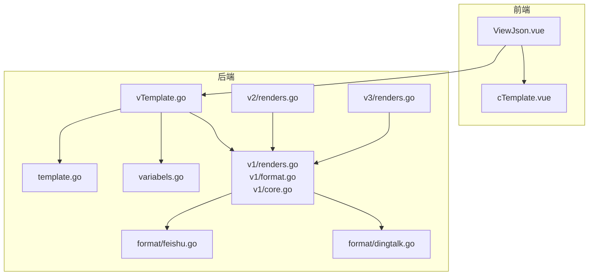
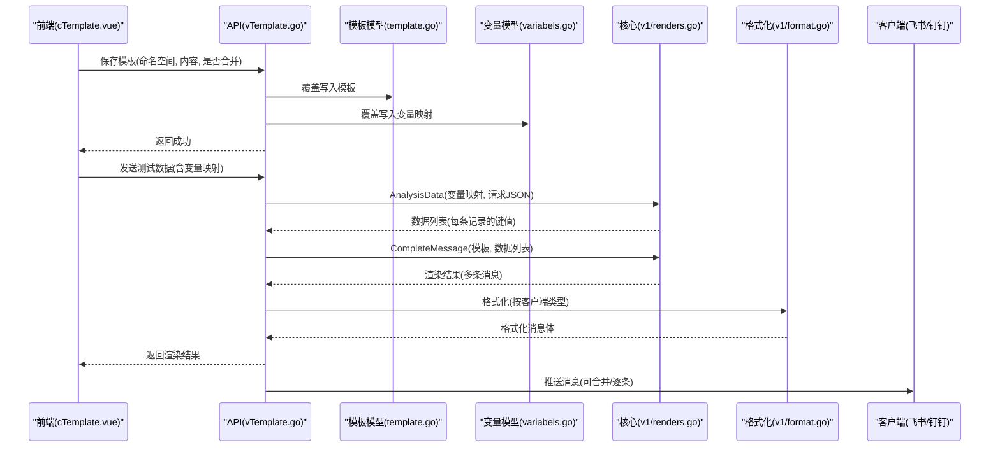
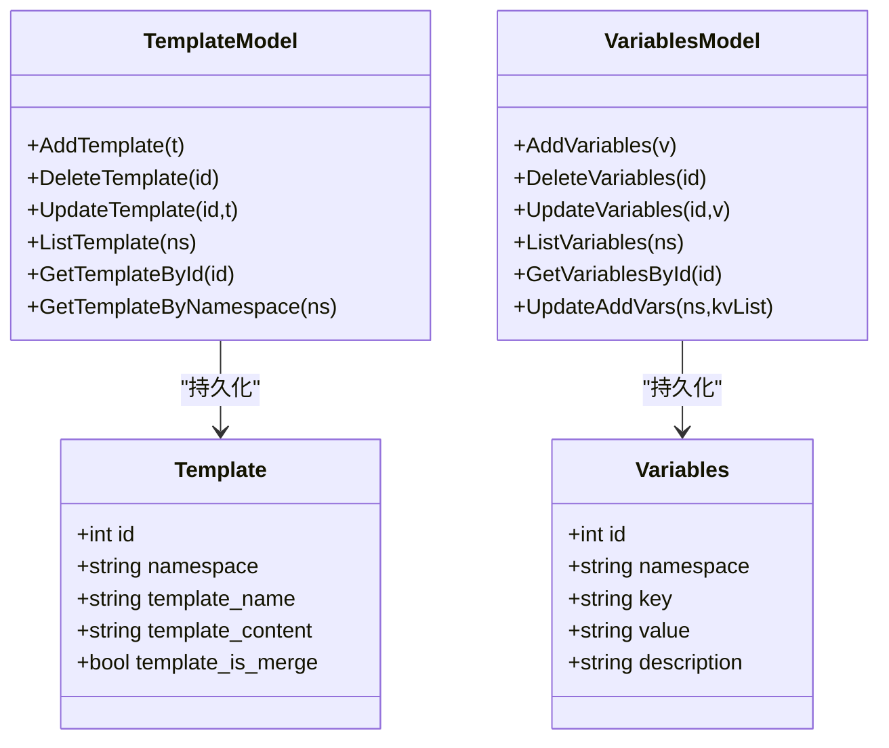
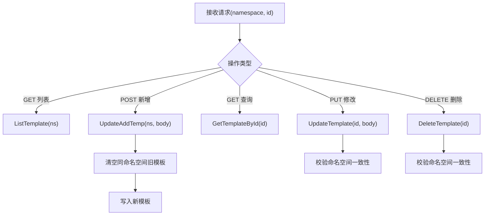
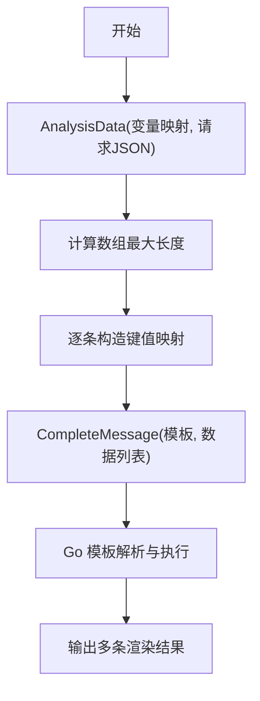
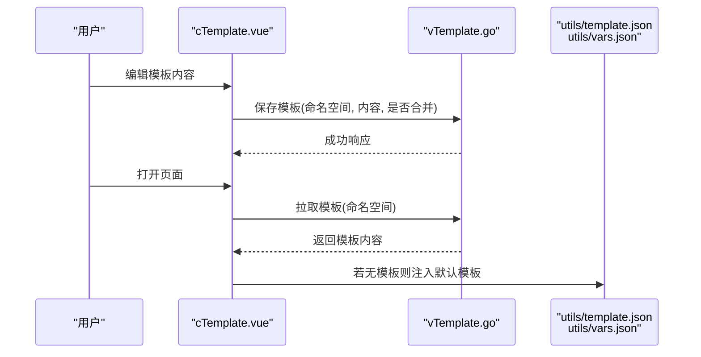
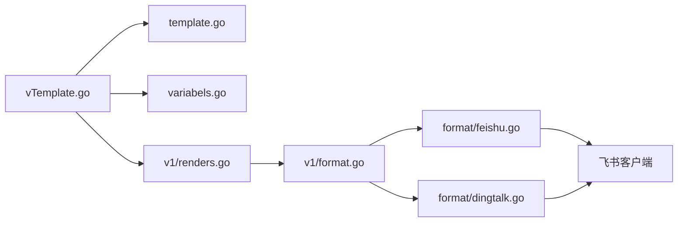

# 模板管理系统

<cite>
**本文引用的文件**
- [pkg/models/template.go](file://pkg/models/template.go)
- [pkg/models/variabels.go](file://pkg/models/variabels.go)
- [pkg/api/vTemplate.go](file://pkg/api/vTemplate.go)
- [pkg/services/core/v1/renders.go](file://pkg/services/core/v1/renders.go)
- [pkg/services/core/v1/format.go](file://pkg/services/core/v1/format.go)
- [pkg/services/core/v1/core.go](file://pkg/services/core/v1/core.go)
- [pkg/services/core/v2/renders.go](file://pkg/services/core/v2/renders.go)
- [pkg/services/core/v3/renders.go](file://pkg/services/core/v3/renders.go)
- [pkg/services/format/feishu.go](file://pkg/services/format/feishu.go)
- [pkg/services/format/dingtalk.go](file://pkg/services/format/dingtalk.go)
- [vue/src/components/cTemplate.vue](file://vue/src/components/cTemplate.vue)
- [vue/src/views/main/ViewJson.vue](file://vue/src/views/main/ViewJson.vue)
- [pkg/utils/template.json](file://pkg/utils/template.json)
- [pkg/utils/vars.json](file://pkg/utils/vars.json)
</cite>

## 目录
1. [简介](#简介)
2. [项目结构](#项目结构)
3. [核心组件](#核心组件)
4. [架构总览](#架构总览)
5. [详细组件分析](#详细组件分析)
6. [依赖分析](#依赖分析)
7. [性能考虑](#性能考虑)
8. [故障排查指南](#故障排查指南)
9. [结论](#结论)
10. [附录](#附录)

## 简介
本项目提供一套基于 JSON 的模板管理系统，支持：
- JSON 请求数据到人类可读消息的模板渲染
- 变量映射与替换（内置变量、自定义变量、变量作用域）
- 条件判断、循环结构等 Go 模板语法能力
- 多客户端适配（飞书、钉钉等）
- 实时预览与聚合发送
- 模板版本管理与迁移策略建议

## 项目结构
后端采用分层架构：
- API 层：负责路由与请求校验
- 服务层：核心渲染与格式化逻辑
- 模型层：模板与变量的持久化
- 前端 Vue 组件：模板编辑、变量映射、实时预览



**图表来源**
- [vue/src/views/main/ViewJson.vue:1-140](file://vue/src/views/main/ViewJson.vue#L1-L140)
- [vue/src/components/cTemplate.vue:1-141](file://vue/src/components/cTemplate.vue#L1-L141)
- [pkg/api/vTemplate.go:1-147](file://pkg/api/vTemplate.go#L1-L147)
- [pkg/models/template.go:1-72](file://pkg/models/template.go#L1-L72)
- [pkg/models/variabels.go:1-89](file://pkg/models/variabels.go#L1-L89)
- [pkg/services/core/v1/renders.go:1-127](file://pkg/services/core/v1/renders.go#L1-L127)
- [pkg/services/core/v1/format.go:1-62](file://pkg/services/core/v1/format.go#L1-L62)
- [pkg/services/core/v1/core.go:1-65](file://pkg/services/core/v1/core.go#L1-L65)
- [pkg/services/core/v2/renders.go:1-29](file://pkg/services/core/v2/renders.go#L1-L29)
- [pkg/services/core/v3/renders.go:1-59](file://pkg/services/core/v3/renders.go#L1-L59)
- [pkg/services/format/feishu.go:1-61](file://pkg/services/format/feishu.go#L1-L61)
- [pkg/services/format/dingtalk.go:1-30](file://pkg/services/format/dingtalk.go#L1-L30)

**章节来源**
- [vue/src/views/main/ViewJson.vue:1-140](file://vue/src/views/main/ViewJson.vue#L1-L140)
- [vue/src/components/cTemplate.vue:1-141](file://vue/src/components/cTemplate.vue#L1-L141)
- [pkg/api/vTemplate.go:1-147](file://pkg/api/vTemplate.go#L1-L147)

## 核心组件
- 模板模型与持久化：模板内容、命名空间、是否合并发送
- 变量模型与持久化：键值映射列表，描述信息
- API 控制器：模板的增删改查与覆盖式写入
- 渲染引擎（v1/v2/v3）：变量映射、模板解析与渲染、消息聚合
- 客户端格式化：飞书卡片、钉钉 Markdown 等
- 前端模板编辑器：实时保存、拉取默认模板、聚合开关

**章节来源**
- [pkg/models/template.go:9-18](file://pkg/models/template.go#L9-L18)
- [pkg/models/variabels.go:9-18](file://pkg/models/variabels.go#L9-L18)
- [pkg/api/vTemplate.go:13-64](file://pkg/api/vTemplate.go#L13-L64)
- [pkg/services/core/v1/renders.go:15-102](file://pkg/services/core/v1/renders.go#L15-L102)
- [pkg/services/core/v1/format.go:10-61](file://pkg/services/core/v1/format.go#L10-L61)
- [vue/src/components/cTemplate.vue:1-141](file://vue/src/components/cTemplate.vue#L1-L141)

## 架构总览
模板渲染主流程：
- 前端编辑模板并保存
- 后端接收请求，按命名空间覆盖模板
- 解析变量映射，从 JSON 请求中提取字段
- 使用 Go 模板引擎渲染多条消息
- 按客户端类型格式化消息体
- 可选合并发送或逐条发送



**图表来源**
- [vue/src/components/cTemplate.vue:94-119](file://vue/src/components/cTemplate.vue#L94-L119)
- [pkg/api/vTemplate.go:27-64](file://pkg/api/vTemplate.go#L27-L64)
- [pkg/models/template.go:24-27](file://pkg/models/template.go#L24-L27)
- [pkg/models/variabels.go:65-88](file://pkg/models/variabels.go#L65-L88)
- [pkg/services/core/v1/renders.go:15-67](file://pkg/services/core/v1/renders.go#L15-L67)
- [pkg/services/core/v1/format.go:10-61](file://pkg/services/core/v1/format.go#L10-L61)

## 详细组件分析

### 模板与变量模型
- 模板模型包含命名空间、模板名、模板内容、是否合并发送
- 变量模型包含命名空间、键、值（gjson 路径）、描述
- 提供 CRUD 与按命名空间覆盖写入接口



**图表来源**
- [pkg/models/template.go:9-22](file://pkg/models/template.go#L9-L22)
- [pkg/models/variabels.go:9-22](file://pkg/models/variabels.go#L9-L22)

**章节来源**
- [pkg/models/template.go:24-72](file://pkg/models/template.go#L24-L72)
- [pkg/models/variabels.go:24-89](file://pkg/models/variabels.go#L24-L89)

### API 控制器
- 列表、新增、查询、修改、删除模板
- 新增/修改时按命名空间覆盖写入
- 参数校验与命名空间一致性检查



**图表来源**
- [pkg/api/vTemplate.go:13-147](file://pkg/api/vTemplate.go#L13-L147)

**章节来源**
- [pkg/api/vTemplate.go:13-147](file://pkg/api/vTemplate.go#L13-L147)

### 渲染引擎（v1/v2/v3）
- v1：CompleteMessage 使用 Go 模板引擎渲染；AnalysisData 通过 gjson 提取数组长度并逐项替换；MessageJoint 按客户端类型拼接
- v2：封装渲染结果结构体，统一 RendersData 流程
- v3：RendersContentData 将变量映射与模板渲染串联



**图表来源**
- [pkg/services/core/v1/renders.go:69-102](file://pkg/services/core/v1/renders.go#L69-L102)
- [pkg/services/core/v1/renders.go:15-67](file://pkg/services/core/v1/renders.go#L15-L67)
- [pkg/services/core/v2/renders.go:14-28](file://pkg/services/core/v2/renders.go#L14-L28)
- [pkg/services/core/v3/renders.go:10-13](file://pkg/services/core/v3/renders.go#L10-L13)

**章节来源**
- [pkg/services/core/v1/renders.go:15-127](file://pkg/services/core/v1/renders.go#L15-L127)
- [pkg/services/core/v2/renders.go:8-29](file://pkg/services/core/v2/renders.go#L8-L29)
- [pkg/services/core/v3/renders.go:10-59](file://pkg/services/core/v3/renders.go#L10-L59)

### 客户端格式化
- 飞书：生成交互卡片消息，包含标题颜色模板、标题内容、Markdown 元素
- 钉钉：生成 Markdown 消息，支持 at 手机号与 atAll

```mermaid
classDiagram
class FeishuFormatter {
+PackFeishuMessage(userConfigInfo, message) interface{}
}
class DingtalkFormatter {
+PackDingtalkMessage(keyword, message, atAll, mobiles) interface{}
}
class ReadyClient {
+int id
+string name
+string type
+bool is_merge
+string url
+[]any data
}
FeishuFormatter --> ReadyClient : "返回格式化数据"
DingtalkFormatter --> ReadyClient : "返回格式化数据"
```

**图表来源**
- [pkg/services/format/feishu.go:8-60](file://pkg/services/format/feishu.go#L8-L60)
- [pkg/services/format/dingtalk.go:3-29](file://pkg/services/format/dingtalk.go#L3-L29)
- [pkg/services/core/v1/core.go:25-64](file://pkg/services/core/v1/core.go#L25-L64)

**章节来源**
- [pkg/services/format/feishu.go:1-61](file://pkg/services/format/feishu.go#L1-L61)
- [pkg/services/format/dingtalk.go:1-30](file://pkg/services/format/dingtalk.go#L1-L30)
- [pkg/services/core/v1/core.go:34-65](file://pkg/services/core/v1/core.go#L34-L65)

### 前端模板编辑与实时预览
- cTemplate.vue：模板编辑器，支持聚合开关、保存、拉取默认模板
- ViewJson.vue：组合数据格式化、变量映射、模板编辑区域，提供渲染开关与遮罩提示
- 默认模板与变量映射来自 utils 下的 JSON 文件



**图表来源**
- [vue/src/components/cTemplate.vue:94-119](file://vue/src/components/cTemplate.vue#L94-L119)
- [vue/src/views/main/ViewJson.vue:84-105](file://vue/src/views/main/ViewJson.vue#L84-L105)
- [pkg/utils/template.json:1-5](file://pkg/utils/template.json#L1-L5)
- [pkg/utils/vars.json:1-29](file://pkg/utils/vars.json#L1-L29)

**章节来源**
- [vue/src/components/cTemplate.vue:1-141](file://vue/src/components/cTemplate.vue#L1-L141)
- [vue/src/views/main/ViewJson.vue:1-140](file://vue/src/views/main/ViewJson.vue#L1-L140)
- [pkg/utils/template.json:1-5](file://pkg/utils/template.json#L1-L5)
- [pkg/utils/vars.json:1-29](file://pkg/utils/vars.json#L1-L29)

## 依赖分析
- 模板与变量模型之间无直接耦合，通过命名空间关联
- API 控制器依赖模型层进行持久化
- 渲染引擎依赖 gjson 提取数据，依赖 Go 模板引擎渲染
- 格式化模块依赖客户端配置信息
- 前端通过 API 与后端交互，使用默认 JSON 注入兜底



**图表来源**
- [pkg/api/vTemplate.go:1-147](file://pkg/api/vTemplate.go#L1-L147)
- [pkg/models/template.go:1-72](file://pkg/models/template.go#L1-L72)
- [pkg/models/variabels.go:1-89](file://pkg/models/variabels.go#L1-L89)
- [pkg/services/core/v1/renders.go:1-127](file://pkg/services/core/v1/renders.go#L1-L127)
- [pkg/services/core/v1/format.go:1-62](file://pkg/services/core/v1/format.go#L1-L62)
- [pkg/services/format/feishu.go:1-61](file://pkg/services/format/feishu.go#L1-L61)
- [pkg/services/format/dingtalk.go:1-30](file://pkg/services/format/dingtalk.go#L1-L30)

**章节来源**
- [pkg/api/vTemplate.go:1-147](file://pkg/api/vTemplate.go#L1-L147)
- [pkg/services/core/v1/renders.go:1-127](file://pkg/services/core/v1/renders.go#L1-L127)
- [pkg/services/core/v1/format.go:1-62](file://pkg/services/core/v1/format.go#L1-L62)

## 性能考虑
- 变量映射阶段仅提取用户关注字段，避免无关字段处理
- 渲染阶段按数组最大长度迭代，避免多余拼装
- 合并发送可减少网络往返次数，但需注意单条消息大小限制
- 建议在高并发场景下对模板解析结果进行缓存（如按模板哈希缓存解析后的模板对象）

## 故障排查指南
- 模板解析失败：检查 Go 模板语法，确认变量键名与映射一致
- 变量取值为空：检查 gjson 路径是否正确，确认数组索引替换是否匹配
- 客户端格式化异常：核对客户端配置（关键字、URL、颜色模板等）
- 命名空间不一致：确保请求参数与模板存储的命名空间一致
- 时区问题：模板中时间字段会尝试转换为指定时区，容器环境需确保时区可用

**章节来源**
- [pkg/services/core/v1/renders.go:26-29](file://pkg/services/core/v1/renders.go#L26-L29)
- [pkg/services/core/v1/renders.go:57-60](file://pkg/services/core/v1/renders.go#L57-L60)
- [pkg/api/vTemplate.go:81-84](file://pkg/api/vTemplate.go#L81-L84)
- [pkg/api/vTemplate.go:136-138](file://pkg/api/vTemplate.go#L136-L138)

## 结论
该模板管理系统以简洁的分层架构实现了从 JSON 请求到多客户端消息的自动化渲染与推送。通过变量映射与 Go 模板语法，能够灵活表达条件判断与循环结构，满足多种业务场景。前端提供了实时预览与聚合发送能力，便于快速验证与上线。

## 附录

### JSON 模板语法与语义
- 变量占位符：使用 Go 模板语法的点号访问，如 .N1、.N2
- 条件判断：支持 if/else if/else 等 Go 模板控制结构
- 循环结构：结合变量映射中的数组路径，通过索引替换实现逐条渲染
- 时间格式化：模板中时间字段会被转换为指定时区格式

**章节来源**
- [vue/src/components/cTemplate.vue:50-82](file://vue/src/components/cTemplate.vue#L50-L82)
- [pkg/services/core/v1/renders.go:35-54](file://pkg/services/core/v1/renders.go#L35-L54)

### 变量映射与替换机制
- 内置变量：由系统注入的键（如 N6、N7 等）
- 自定义变量：用户定义的键到 gjson 路径的映射
- 作用域：按命名空间隔离，同一命名空间内覆盖写入
- 替换流程：AnalysisData 提取数组长度，逐条替换键值，再由模板引擎渲染

**章节来源**
- [pkg/utils/vars.json:1-29](file://pkg/utils/vars.json#L1-L29)
- [pkg/services/core/v1/renders.go:69-102](file://pkg/services/core/v1/renders.go#L69-L102)

### 模板渲染流程详解
- 解析：使用 Go 模板引擎解析模板字符串
- 验证：检查模板语法与变量键名
- 替换：根据数据列表逐条替换变量
- 格式化：按客户端类型打包消息体
- 聚合：可选合并多条消息为单一推送

**章节来源**
- [pkg/services/core/v1/renders.go:15-67](file://pkg/services/core/v1/renders.go#L15-L67)
- [pkg/services/core/v1/format.go:10-61](file://pkg/services/core/v1/format.go#L10-L61)
- [pkg/services/core/v1/core.go:34-65](file://pkg/services/core/v1/core.go#L34-L65)

### 实时预览实现原理与使用
- 实现原理：前端保存模板后，后端覆盖写入模板与变量映射；再次发送测试数据时，后端按变量映射提取字段并渲染模板，返回渲染结果
- 使用方法：在模板编辑器中输入 Go 模板语法，点击保存；在数据格式化区域粘贴测试 JSON，即可看到渲染效果

**章节来源**
- [vue/src/components/cTemplate.vue:94-119](file://vue/src/components/cTemplate.vue#L94-L119)
- [vue/src/views/main/ViewJson.vue:84-105](file://vue/src/views/main/ViewJson.vue#L84-L105)

### 模板设计最佳实践
- 使用清晰的键名与语义化注释，便于维护
- 控制模板复杂度，尽量将复杂逻辑下沉到变量映射
- 对时间字段进行统一格式化，避免跨时区问题
- 在高并发场景下考虑模板解析缓存与批量推送

### 常见陷阱
- gjson 路径错误导致变量为空
- 模板语法错误导致渲染失败
- 数组索引越界或未正确替换
- 客户端格式化字段缺失导致消息结构异常

### 模板示例（路径）
- 默认模板示例：[pkg/utils/template.json:1-5](file://pkg/utils/template.json#L1-L5)
- 变量映射示例：[pkg/utils/vars.json:1-29](file://pkg/utils/vars.json#L1-L29)
- 前端模板示例：[vue/src/components/cTemplate.vue:50-82](file://vue/src/components/cTemplate.vue#L50-L82)

### 模板版本管理与迁移策略
- 版本管理：以命名空间为维度进行覆盖式写入，历史版本可通过备份保留
- 迁移策略：在灰度环境中逐步切换命名空间配置，对比渲染结果与客户端格式化差异，确保兼容性