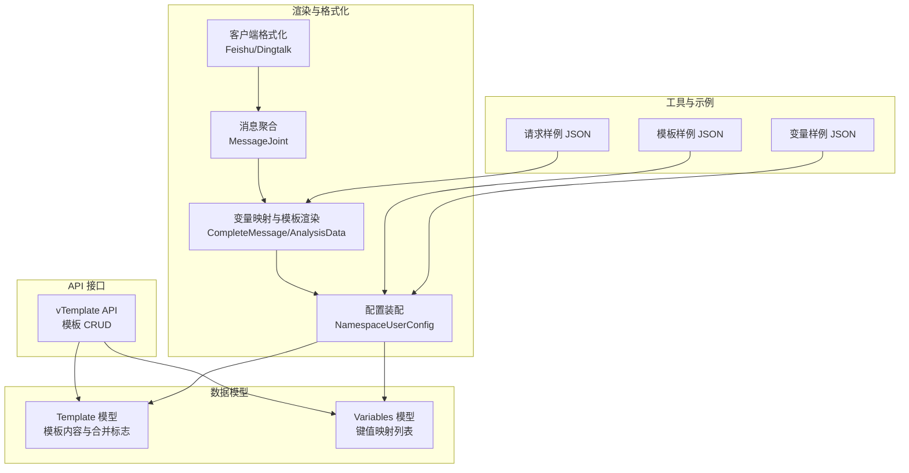
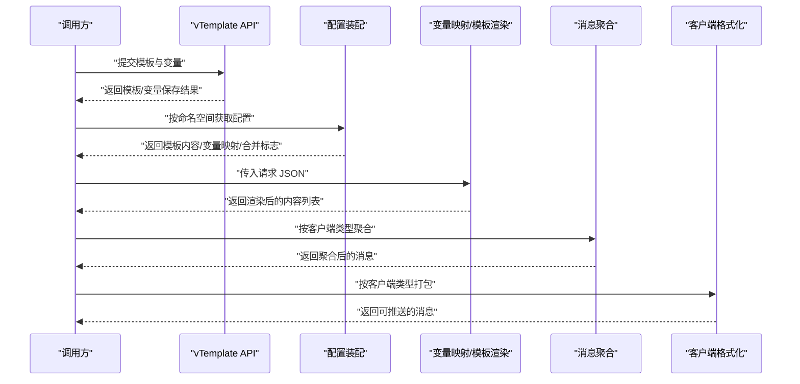
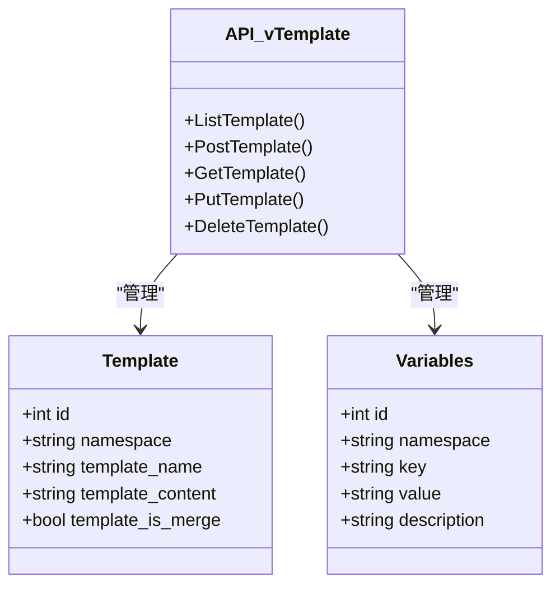
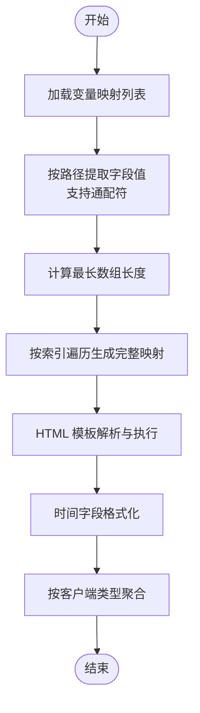
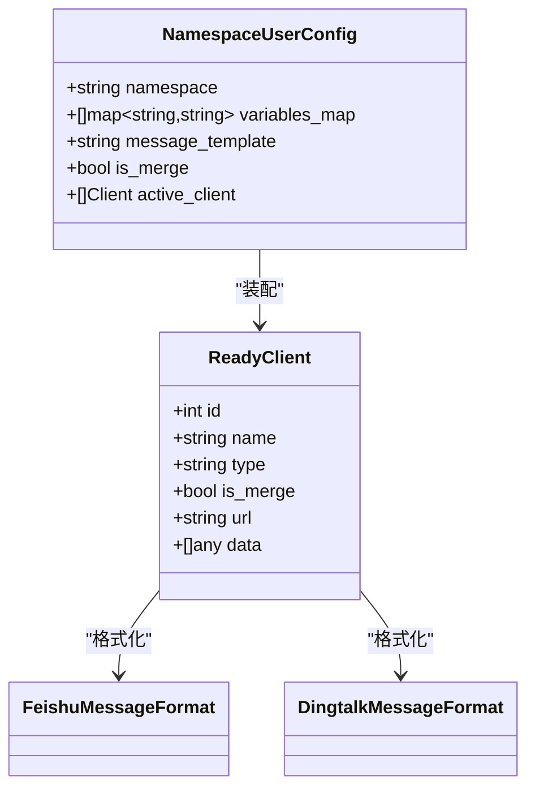
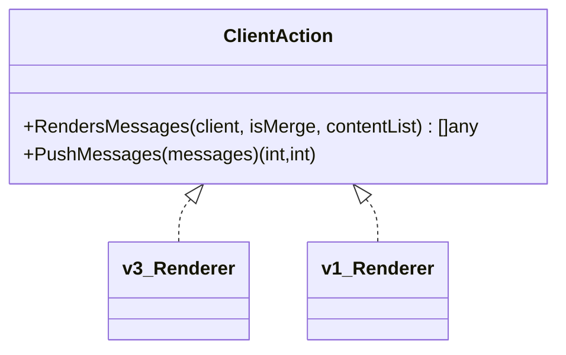
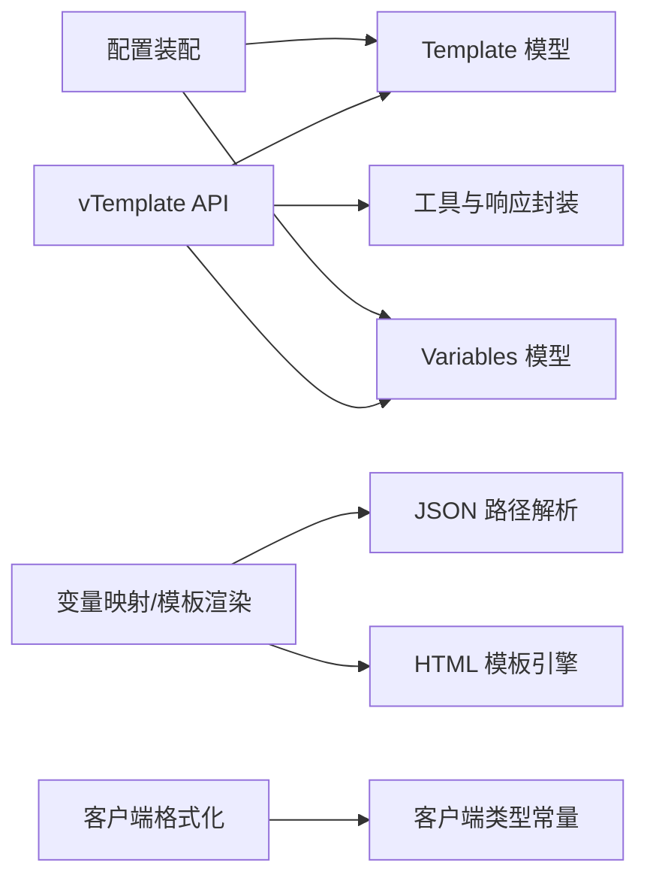

# 模板语法与语义

<cite>
**本文引用的文件**
- [pkg/services/core/v1/renders.go](file://pkg/services/core/v1/renders.go)
- [pkg/services/core/v3/renders.go](file://pkg/services/core/v3/renders.go)
- [pkg/services/core/v1/config.go](file://pkg/services/core/v1/config.go)
- [pkg/services/core/v1/format.go](file://pkg/services/core/v1/format.go)
- [pkg/services/core/v3/interfaces.go](file://pkg/services/core/v3/interfaces.go)
- [pkg/models/template.go](file://pkg/models/template.go)
- [pkg/models/variabels.go](file://pkg/models/variabels.go)
- [pkg/api/vTemplate.go](file://pkg/api/vTemplate.go)
- [pkg/utils/template.json](file://pkg/utils/template.json)
- [pkg/utils/vars.json](file://pkg/utils/vars.json)
- [vue/src/views/main/a2template.json](file://vue/src/views/main/a2template.json)
- [vue/src/views/bak/A1-template.json](file://vue/src/views/bak/A1-template.json)
- [pkg/utils/constants.go](file://pkg/utils/constants.go)
</cite>

## 目录
1. [引言](#引言)
2. [项目结构](#项目结构)
3. [核心组件](#核心组件)
4. [架构总览](#架构总览)
5. [详细组件分析](#详细组件分析)
6. [依赖分析](#依赖分析)
7. [性能考虑](#性能考虑)
8. [故障排查指南](#故障排查指南)
9. [结论](#结论)
10. [附录：语法参考与示例](#附录语法参考与示例)

## 引言
本文件面向模板语法与语义，系统性阐述基于 JSON 的模板系统设计与实现。该系统通过 HTML 模板引擎渲染占位符，并结合变量映射与数组展开能力，支持条件判断、循环结构以及多客户端格式化输出。本文将从数据模型、渲染流程、语法规范、错误处理与性能优化等方面进行全面说明。

## 项目结构
围绕模板系统的相关模块主要分布在以下位置：
- 数据模型层：模板与变量的持久化与读写
- API 层：模板与变量的增删改查接口
- 渲染层：变量映射、模板解析与执行、消息聚合
- 工具与示例：模板与变量样例、测试数据

图表来源
- [pkg/models/template.go:1-72](file://pkg/models/template.go#L1-L72)
- [pkg/models/variabels.go:1-89](file://pkg/models/variabels.go#L1-L89)
- [pkg/api/vTemplate.go:1-147](file://pkg/api/vTemplate.go#L1-L147)
- [pkg/services/core/v1/config.go:11-58](file://pkg/services/core/v1/config.go#L11-L58)
- [pkg/services/core/v1/renders.go:15-127](file://pkg/services/core/v1/renders.go#L15-L127)
- [pkg/services/core/v3/renders.go:10-59](file://pkg/services/core/v3/renders.go#L10-L59)
- [pkg/services/core/v1/format.go:10-62](file://pkg/services/core/v1/format.go#L10-L62)
- [pkg/utils/template.json:1-5](file://pkg/utils/template.json#L1-L5)
- [pkg/utils/vars.json:1-29](file://pkg/utils/vars.json#L1-L29)
- [vue/src/views/main/a2template.json:1-92](file://vue/src/views/main/a2template.json#L1-L92)

章节来源
- [pkg/models/template.go:1-72](file://pkg/models/template.go#L1-L72)
- [pkg/models/variabels.go:1-89](file://pkg/models/variabels.go#L1-L89)
- [pkg/api/vTemplate.go:1-147](file://pkg/api/vTemplate.go#L1-L147)
- [pkg/services/core/v1/config.go:11-58](file://pkg/services/core/v1/config.go#L11-L58)
- [pkg/services/core/v1/renders.go:15-127](file://pkg/services/core/v1/renders.go#L15-L127)
- [pkg/services/core/v3/renders.go:10-59](file://pkg/services/core/v3/renders.go#L10-L59)
- [pkg/services/core/v1/format.go:10-62](file://pkg/services/core/v1/format.go#L10-L62)
- [pkg/utils/template.json:1-5](file://pkg/utils/template.json#L1-L5)
- [pkg/utils/vars.json:1-29](file://pkg/utils/vars.json#L1-L29)
- [vue/src/views/main/a2template.json:1-92](file://vue/src/views/main/a2template.json#L1-L92)

## 核心组件
- 模板模型与变量模型：负责模板与变量的持久化存储与查询。
- API 控制器：提供模板的增删改查接口，并在新增时清理同命名空间旧模板。
- 渲染引擎：完成变量映射、模板解析与执行、时间格式转换、消息聚合与客户端格式化。
- 常量与示例：定义客户端类型常量，提供模板与变量样例及请求样例。

章节来源
- [pkg/models/template.go:9-18](file://pkg/models/template.go#L9-L18)
- [pkg/models/variabels.go:9-18](file://pkg/models/variabels.go#L9-L18)
- [pkg/api/vTemplate.go:49-64](file://pkg/api/vTemplate.go#L49-L64)
- [pkg/services/core/v1/renders.go:15-127](file://pkg/services/core/v1/renders.go#L15-L127)
- [pkg/services/core/v1/config.go:11-58](file://pkg/services/core/v1/config.go#L11-L58)
- [pkg/utils/constants.go:3-8](file://pkg/utils/constants.go#L3-L8)
- [pkg/utils/template.json:1-5](file://pkg/utils/template.json#L1-L5)
- [pkg/utils/vars.json:1-29](file://pkg/utils/vars.json#L1-L29)

## 架构总览
模板系统采用“配置装配—变量映射—模板渲染—消息聚合—客户端格式化”的流水线式处理。命名空间维度的配置决定是否启用渲染、模板内容与合并策略；变量映射负责从请求 JSON 中抽取字段；模板引擎执行内置函数与条件判断；最终按客户端类型进行格式化输出。

图表来源
- [pkg/api/vTemplate.go:49-64](file://pkg/api/vTemplate.go#L49-L64)
- [pkg/services/core/v1/config.go:20-55](file://pkg/services/core/v1/config.go#L20-L55)
- [pkg/services/core/v3/renders.go:10-13](file://pkg/services/core/v3/renders.go#L10-L13)
- [pkg/services/core/v1/renders.go:15-67](file://pkg/services/core/v1/renders.go#L15-L67)
- [pkg/services/core/v1/renders.go:104-127](file://pkg/services/core/v1/renders.go#L104-L127)
- [pkg/services/core/v1/format.go:10-62](file://pkg/services/core/v1/format.go#L10-L62)

## 详细组件分析

### 组件一：模板与变量的数据模型
- 模板模型包含命名空间、模板名、模板内容与是否合并标志。
- 变量模型包含命名空间、键、值与描述，支持批量导入与按命名空间查询。
- API 在新增模板时会先删除同命名空间旧模板，确保同一命名空间仅保留一份模板。

图表来源
- [pkg/models/template.go:9-18](file://pkg/models/template.go#L9-L18)
- [pkg/models/variabels.go:9-18](file://pkg/models/variabels.go#L9-L18)
- [pkg/api/vTemplate.go:17-86](file://pkg/api/vTemplate.go#L17-L86)

章节来源
- [pkg/models/template.go:9-72](file://pkg/models/template.go#L9-L72)
- [pkg/models/variabels.go:9-89](file://pkg/models/variabels.go#L9-L89)
- [pkg/api/vTemplate.go:49-64](file://pkg/api/vTemplate.go#L49-L64)

### 组件二：变量映射与模板渲染
- 变量映射：遍历变量映射列表，使用 JSON 路径从请求 JSON 中提取字段；当路径包含通配符时，取最长数组长度作为迭代次数，逐项替换通配符生成具体键值。
- 模板渲染：使用 HTML 模板引擎解析模板字符串，将映射后的数据集逐条执行，支持内置函数与条件判断；对 RFC3339 时间进行时区转换与格式化。
- 消息聚合：按客户端类型选择不同的分隔符进行拼接，形成最终消息体。

图表来源
- [pkg/services/core/v3/renders.go:15-58](file://pkg/services/core/v3/renders.go#L15-L58)
- [pkg/services/core/v1/renders.go:69-102](file://pkg/services/core/v1/renders.go#L69-L102)
- [pkg/services/core/v1/renders.go:15-67](file://pkg/services/core/v1/renders.go#L15-L67)
- [pkg/services/core/v1/renders.go:104-127](file://pkg/services/core/v1/renders.go#L104-L127)

章节来源
- [pkg/services/core/v3/renders.go:10-59](file://pkg/services/core/v3/renders.go#L10-L59)
- [pkg/services/core/v1/renders.go:15-127](file://pkg/services/core/v1/renders.go#L15-L127)

### 组件三：配置装配与客户端格式化
- 配置装配：按命名空间获取激活客户端、变量映射与模板内容，决定是否合并与渲染。
- 客户端格式化：根据客户端类型分别进行打包，支持合并模式与非合并模式。

图表来源
- [pkg/services/core/v1/config.go:11-58](file://pkg/services/core/v1/config.go#L11-L58)
- [pkg/services/core/v1/core.go:25-65](file://pkg/services/core/v1/core.go#L25-L65)
- [pkg/services/core/v1/format.go:10-62](file://pkg/services/core/v1/format.go#L10-L62)

章节来源
- [pkg/services/core/v1/config.go:11-58](file://pkg/services/core/v1/config.go#L11-L58)
- [pkg/services/core/v1/format.go:10-62](file://pkg/services/core/v1/format.go#L10-L62)

### 组件四：接口契约与版本演进
- v3 接口定义了渲染与推送的统一契约，便于扩展新的客户端类型。
- v1 提供历史兼容与核心渲染逻辑。

图表来源
- [pkg/services/core/v3/interfaces.go:7-11](file://pkg/services/core/v3/interfaces.go#L7-L11)
- [pkg/services/core/v1/renders.go:15-67](file://pkg/services/core/v1/renders.go#L15-L67)

章节来源
- [pkg/services/core/v3/interfaces.go:7-11](file://pkg/services/core/v3/interfaces.go#L7-L11)
- [pkg/services/core/v1/renders.go:15-67](file://pkg/services/core/v1/renders.go#L15-L67)

## 依赖分析
- 模板与变量模型依赖数据库访问层，提供 CRUD 能力。
- API 层依赖模型层与工具层响应封装。
- 渲染层依赖 HTML 模板引擎与 JSON 路径解析库，负责变量映射与模板执行。
- 客户端格式化依赖常量与打包函数，按类型选择聚合与格式化策略。

图表来源
- [pkg/api/vTemplate.go:1-147](file://pkg/api/vTemplate.go#L1-L147)
- [pkg/models/template.go:1-72](file://pkg/models/template.go#L1-L72)
- [pkg/models/variabels.go:1-89](file://pkg/models/variabels.go#L1-L89)
- [pkg/services/core/v1/config.go:11-58](file://pkg/services/core/v1/config.go#L11-L58)
- [pkg/services/core/v1/renders.go:15-127](file://pkg/services/core/v1/renders.go#L15-L127)
- [pkg/services/core/v1/format.go:10-62](file://pkg/services/core/v1/format.go#L10-L62)
- [pkg/utils/constants.go:3-8](file://pkg/utils/constants.go#L3-L8)

章节来源
- [pkg/api/vTemplate.go:1-147](file://pkg/api/vTemplate.go#L1-L147)
- [pkg/models/template.go:1-72](file://pkg/models/template.go#L1-L72)
- [pkg/models/variabels.go:1-89](file://pkg/models/variabels.go#L1-L89)
- [pkg/services/core/v1/config.go:11-58](file://pkg/services/core/v1/config.go#L11-L58)
- [pkg/services/core/v1/renders.go:15-127](file://pkg/services/core/v1/renders.go#L15-L127)
- [pkg/services/core/v1/format.go:10-62](file://pkg/services/core/v1/format.go#L10-L62)
- [pkg/utils/constants.go:3-8](file://pkg/utils/constants.go#L3-L8)

## 性能考虑
- 变量映射阶段优先计算最长数组长度，避免重复扫描；随后按索引生成映射，减少内存分配与拷贝。
- 模板解析仅在首次执行时进行，后续复用解析结果，降低 CPU 开销。
- 消息聚合采用字符串拼接，按客户端类型选择合适分隔符，避免复杂结构导致的序列化成本。
- 对时间字段进行本地化与时区转换，建议在上游数据中尽量保证时间格式一致性，减少解析失败与回退逻辑。

## 故障排查指南
- 模板解析失败：检查模板字符串是否符合 HTML 模板语法，确认条件判断与函数调用的闭合与正确嵌套。
- 变量映射为空：核对变量映射中的 JSON 路径是否与请求 JSON 结构一致，确认通配符索引是否越界。
- 时间格式异常：确认输入时间遵循 RFC3339，容器环境下注意时区配置与本地化加载。
- 客户端类型错误：检查客户端类型常量是否正确，避免聚合与格式化分支未覆盖的情况。
- API 参数校验：命名空间与模板 ID 不匹配会导致参数错误，需确保请求路径与数据归属一致。

章节来源
- [pkg/services/core/v1/renders.go:25-29](file://pkg/services/core/v1/renders.go#L25-L29)
- [pkg/services/core/v1/renders.go:57-60](file://pkg/services/core/v1/renders.go#L57-L60)
- [pkg/services/core/v1/renders.go:104-127](file://pkg/services/core/v1/renders.go#L104-L127)
- [pkg/api/vTemplate.go:70-85](file://pkg/api/vTemplate.go#L70-L85)
- [pkg/api/vTemplate.go:92-118](file://pkg/api/vTemplate.go#L92-L118)

## 结论
该模板系统以 JSON 为载体，结合变量映射与 HTML 模板引擎，实现了灵活的条件判断、数组展开与多客户端格式化能力。通过清晰的模块划分与接口契约，系统具备良好的可扩展性与可维护性。建议在生产环境中严格校验模板与变量路径，确保渲染稳定性与性能表现。

## 附录：语法参考与示例

### 语法参考手册
- 占位符语法
  - 单变量占位符：使用点号路径访问对象字段，例如 .N1、.N2。
  - 数组变量：在路径中使用通配符表示数组索引，例如 alerts.#.labels.alertname，系统将自动展开为多个映射。
  - 条件判断：支持 if/else if/else 结构，用于根据变量值选择不同分支。
  - 函数调用：模板中可使用内置函数进行字符串处理与比较，如 eq、ne、lt、gt 等。
- 特殊语法元素
  - 循环结构：通过数组变量与通配符配合，系统自动按最长数组长度进行迭代。
  - 合并标志：模板模型包含是否合并标志，影响消息聚合策略。
- 语法符号与规则
  - 模板字符串必须为合法的 HTML 模板语法。
  - 变量映射中的键为模板占位符标识，值为 JSON 路径表达式。
  - JSON 路径支持通配符与层级访问，确保与请求 JSON 结构一致。

章节来源
- [pkg/services/core/v1/renders.go:15-67](file://pkg/services/core/v1/renders.go#L15-L67)
- [pkg/services/core/v3/renders.go:15-58](file://pkg/services/core/v3/renders.go#L15-L58)
- [pkg/models/template.go:14-17](file://pkg/models/template.go#L14-L17)

### 语法示例
- 模板示例：参见模板样例 JSON，包含条件判断与占位符使用。
- 变量示例：参见变量样例 JSON，包含多组键值映射与通配符路径。
- 请求示例：参见请求样例 JSON，包含 alerts 数组与 labels/annotations 字段，用于演示数组变量展开。

章节来源
- [pkg/utils/template.json:1-5](file://pkg/utils/template.json#L1-L5)
- [pkg/utils/vars.json:1-29](file://pkg/utils/vars.json#L1-L29)
- [vue/src/views/main/a2template.json:1-92](file://vue/src/views/main/a2template.json#L1-L92)
- [vue/src/views/bak/A1-template.json:1-50](file://vue/src/views/bak/A1-template.json#L1-L50)