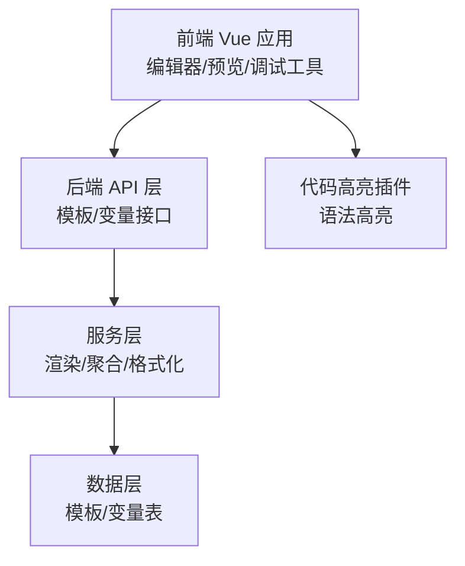
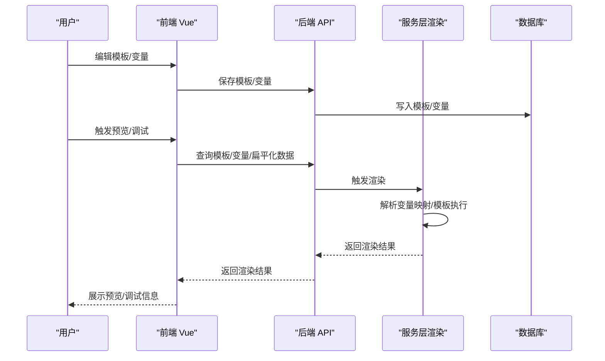
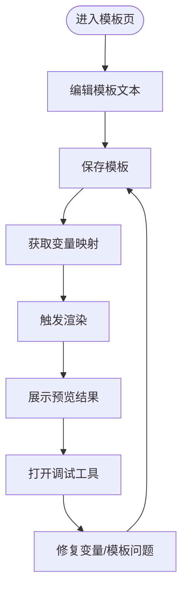
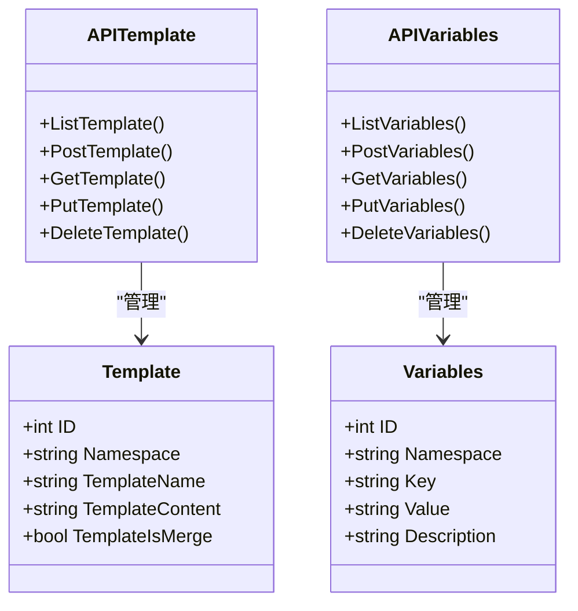
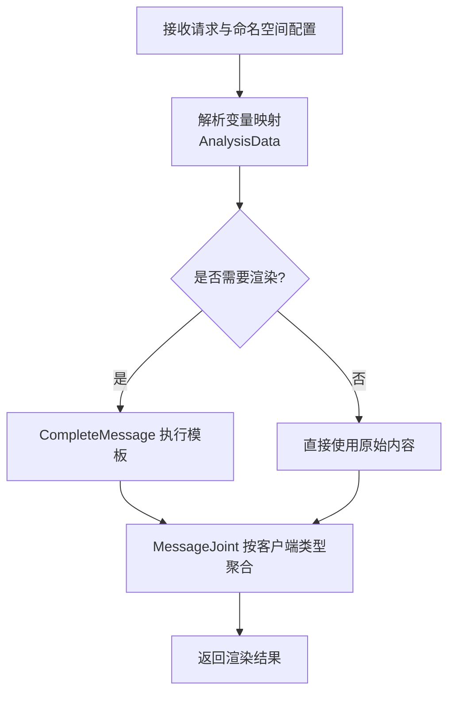
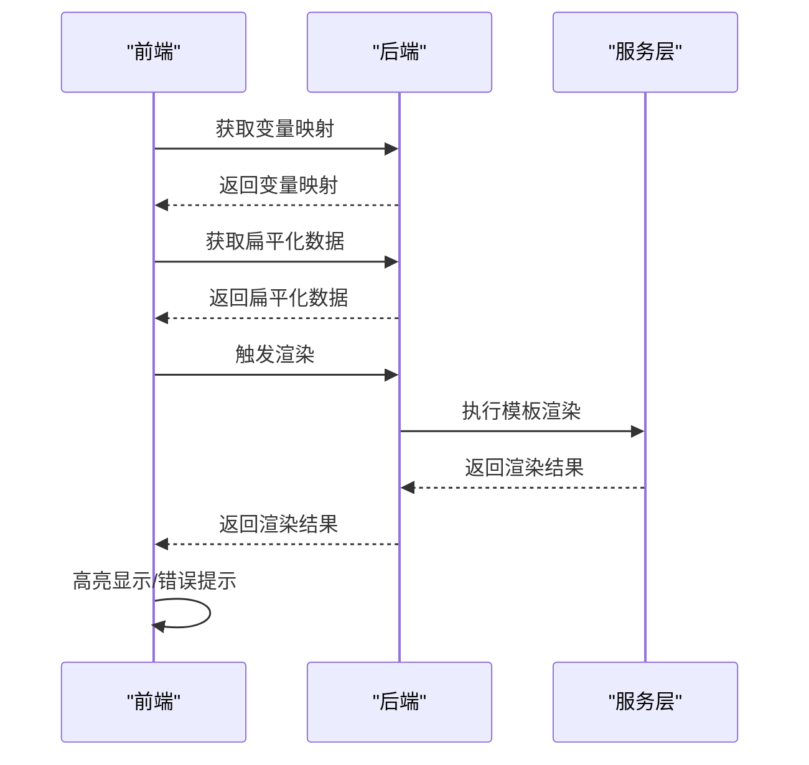
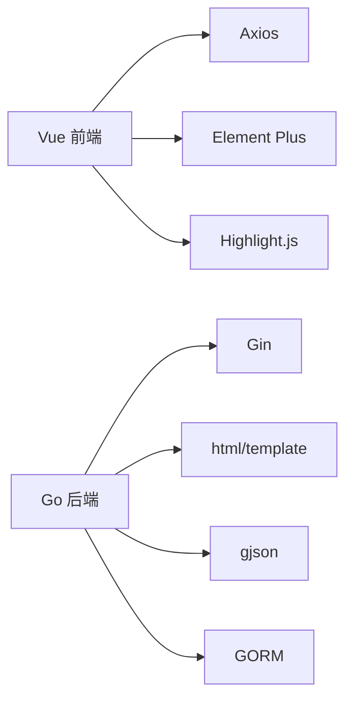

# 模板预览与调试

<cite>
**本文引用的文件**
- [pkg/api/vTemplate.go](file://pkg/api/vTemplate.go)
- [pkg/api/vVariables.go](file://pkg/api/vVariables.go)
- [pkg/models/template.go](file://pkg/models/template.go)
- [pkg/models/variabels.go](file://pkg/models/variabels.go)
- [pkg/services/core/v1/renders.go](file://pkg/services/core/v1/renders.go)
- [pkg/services/core/v2/renders.go](file://pkg/services/core/v2/renders.go)
- [vue/src/components/cTemplate.vue](file://vue/src/components/cTemplate.vue)
- [vue/src/views/bak/ViewTemplate.vue.bak](file://vue/src/views/bak/ViewTemplate.vue.bak)
- [vue/src/service/requests.js](file://vue/src/service/requests.js)
- [vue/src/plugins/highlight.js](file://vue/src/plugins/highlight.js)
</cite>

## 目录
1. [简介](#简介)
2. [项目结构](#项目结构)
3. [核心组件](#核心组件)
4. [架构总览](#架构总览)
5. [详细组件分析](#详细组件分析)
6. [依赖分析](#依赖分析)
7. [性能考虑](#性能考虑)
8. [故障排查指南](#故障排查指南)
9. [结论](#结论)
10. [附录](#附录)

## 简介
本文件围绕模板预览与调试能力进行系统化技术说明，重点覆盖以下方面：
- 实时预览的实现原理：前端编辑器、后端渲染、双向同步机制
- 预览界面交互设计与用户体验：编辑器、预览面板、调试工具
- 调试工具能力：语法高亮、错误提示、变量检查、性能分析
- 测试策略：单元测试、集成测试、端到端测试最佳实践
- 常见问题诊断与解决方案：渲染错误、变量缺失、格式问题
- 性能优化与体验改进

## 项目结构
该仓库采用前后端分离架构：
- 前端基于 Vue 生态，通过 Axios 发起 API 请求，使用 Element Plus 组件库构建界面
- 后端基于 Go Gin，提供模板与变量管理、数据扁平化、模板渲染等能力
- 渲染链路贯穿 v1/v2 版本，支持多客户端聚合与格式化

**图表来源**
- [vue/src/components/cTemplate.vue:1-91](file://vue/src/components/cTemplate.vue#L1-L91)
- [vue/src/service/requests.js:1-42](file://vue/src/service/requests.js#L1-L42)
- [pkg/api/vTemplate.go:1-147](file://pkg/api/vTemplate.go#L1-L147)
- [pkg/api/vVariables.go:1-103](file://pkg/api/vVariables.go#L1-L103)
- [pkg/services/core/v1/renders.go:1-127](file://pkg/services/core/v1/renders.go#L1-L127)
- [pkg/models/template.go:1-72](file://pkg/models/template.go#L1-L72)
- [pkg/models/variabels.go:1-89](file://pkg/models/variabels.go#L1-L89)
- [vue/src/plugins/highlight.js:1-46](file://vue/src/plugins/highlight.js#L1-L46)

**章节来源**
- [vue/src/components/cTemplate.vue:1-91](file://vue/src/components/cTemplate.vue#L1-L91)
- [vue/src/service/requests.js:1-42](file://vue/src/service/requests.js#L1-L42)
- [pkg/api/vTemplate.go:1-147](file://pkg/api/vTemplate.go#L1-L147)
- [pkg/api/vVariables.go:1-103](file://pkg/api/vVariables.go#L1-L103)
- [pkg/models/template.go:1-72](file://pkg/models/template.go#L1-L72)
- [pkg/models/variabels.go:1-89](file://pkg/models/variabels.go#L1-L89)
- [vue/src/plugins/highlight.js:1-46](file://vue/src/plugins/highlight.js#L1-L46)

## 核心组件
- 前端模板编辑器与预览：负责模板文本输入、实时预览、调试入口
- 后端模板管理：提供模板的增删改查、变量映射、数据扁平化
- 渲染引擎：根据变量映射与模板生成最终消息内容，并按客户端类型聚合
- 调试工具：语法高亮、变量检查、错误提示、性能分析

**章节来源**
- [vue/src/components/cTemplate.vue:1-91](file://vue/src/components/cTemplate.vue#L1-L91)
- [vue/src/views/bak/ViewTemplate.vue.bak:1-111](file://vue/src/views/bak/ViewTemplate.vue.bak#L1-L111)
- [vue/src/plugins/highlight.js:1-46](file://vue/src/plugins/highlight.js#L1-L46)
- [pkg/api/vTemplate.go:1-147](file://pkg/api/vTemplate.go#L1-L147)
- [pkg/api/vVariables.go:1-103](file://pkg/api/vVariables.go#L1-L103)
- [pkg/services/core/v1/renders.go:1-127](file://pkg/services/core/v1/renders.go#L1-L127)
- [pkg/services/core/v2/renders.go:1-28](file://pkg/services/core/v2/renders.go#L1-L28)

## 架构总览
模板预览与调试的整体流程如下：
- 前端编辑器保存模板与变量映射
- 后端接收请求，解析变量映射与原始数据
- 渲染引擎执行模板，生成内容列表
- 多客户端聚合策略对内容进行拼接
- 前端展示渲染结果并提供调试反馈

**图表来源**
- [vue/src/service/requests.js:1-42](file://vue/src/service/requests.js#L1-L42)
- [pkg/api/vTemplate.go:1-147](file://pkg/api/vTemplate.go#L1-L147)
- [pkg/api/vVariables.go:1-103](file://pkg/api/vVariables.go#L1-L103)
- [pkg/services/core/v1/renders.go:1-127](file://pkg/services/core/v1/renders.go#L1-L127)
- [pkg/models/template.go:1-72](file://pkg/models/template.go#L1-L72)
- [pkg/models/variabels.go:1-89](file://pkg/models/variabels.go#L1-L89)

## 详细组件分析

### 前端模板编辑器与预览
- 功能要点
  - 模板编辑区：支持长文本输入，提供保存按钮
  - 变量开关：聚合发送开关，便于不同场景测试
  - 教程入口：跳转到官方模板编写教程
  - 高亮插件：基于 highlight.js 的代码高亮指令
- 交互设计
  - 保存模板：调用后端模板接口，持久化模板内容
  - 实时预览：结合后端变量映射与渲染接口，展示渲染结果
  - 调试入口：提供变量检查、错误提示、性能分析入口

**图表来源**
- [vue/src/components/cTemplate.vue:1-91](file://vue/src/components/cTemplate.vue#L1-L91)
- [vue/src/plugins/highlight.js:1-46](file://vue/src/plugins/highlight.js#L1-L46)
- [vue/src/service/requests.js:1-42](file://vue/src/service/requests.js#L1-L42)

**章节来源**
- [vue/src/components/cTemplate.vue:1-91](file://vue/src/components/cTemplate.vue#L1-L91)
- [vue/src/plugins/highlight.js:1-46](file://vue/src/plugins/highlight.js#L1-L46)
- [vue/src/service/requests.js:1-42](file://vue/src/service/requests.js#L1-L42)

### 后端模板管理与变量映射
- 模板管理
  - 列表、新增、查询、修改、删除模板
  - 模板内容与命名空间绑定，支持聚合开关
- 变量映射
  - 支持批量新增变量映射，按命名空间清理旧映射
  - 提供变量列表查询与单条查询
- 数据扁平化
  - 提供扁平化接口，便于调试原始数据结构

**图表来源**
- [pkg/models/template.go:1-72](file://pkg/models/template.go#L1-L72)
- [pkg/models/variabels.go:1-89](file://pkg/models/variabels.go#L1-L89)
- [pkg/api/vTemplate.go:1-147](file://pkg/api/vTemplate.go#L1-L147)
- [pkg/api/vVariables.go:1-103](file://pkg/api/vVariables.go#L1-L103)

**章节来源**
- [pkg/models/template.go:1-72](file://pkg/models/template.go#L1-L72)
- [pkg/models/variabels.go:1-89](file://pkg/models/variabels.go#L1-L89)
- [pkg/api/vTemplate.go:1-147](file://pkg/api/vTemplate.go#L1-L147)
- [pkg/api/vVariables.go:1-103](file://pkg/api/vVariables.go#L1-L103)

### 渲染引擎与聚合策略
- 渲染流程
  - 解析变量映射：从原始请求数据中提取用户关注字段，按最长数组长度生成映射列表
  - 模板执行：使用 Go html/template 对每个映射执行模板，输出字符串列表
  - 客户端聚合：按不同客户端类型进行分隔符拼接
- v2 渲染包装
  - 支持是否渲染标志位，决定走变量映射与模板渲染或直接返回原始内容

**图表来源**
- [pkg/services/core/v1/renders.go:1-127](file://pkg/services/core/v1/renders.go#L1-L127)
- [pkg/services/core/v2/renders.go:1-28](file://pkg/services/core/v2/renders.go#L1-L28)

**章节来源**
- [pkg/services/core/v1/renders.go:1-127](file://pkg/services/core/v1/renders.go#L1-L127)
- [pkg/services/core/v2/renders.go:1-28](file://pkg/services/core/v2/renders.go#L1-L28)

### 调试工具与用户体验
- 语法高亮
  - 基于 highlight.js 的自定义指令，支持首次绑定与组件更新时重新高亮
- 错误提示
  - 渲染失败与模板解析失败的日志记录，便于定位问题
- 变量检查
  - 提供变量映射列表与单条查询接口，支持批量更新
- 性能分析
  - 建议在前端增加渲染耗时统计与日志上报，辅助性能优化

**图表来源**
- [vue/src/plugins/highlight.js:1-46](file://vue/src/plugins/highlight.js#L1-L46)
- [pkg/api/vVariables.go:1-103](file://pkg/api/vVariables.go#L1-L103)
- [pkg/services/core/v1/renders.go:1-127](file://pkg/services/core/v1/renders.go#L1-L127)

**章节来源**
- [vue/src/plugins/highlight.js:1-46](file://vue/src/plugins/highlight.js#L1-L46)
- [pkg/api/vVariables.go:1-103](file://pkg/api/vVariables.go#L1-L103)
- [pkg/services/core/v1/renders.go:1-127](file://pkg/services/core/v1/renders.go#L1-L127)

## 依赖分析
- 前端依赖
  - Axios：统一发起 HTTP 请求
  - Element Plus：UI 组件库
  - highlight.js：代码高亮
- 后端依赖
  - Gin：Web 框架
  - html/template：模板渲染
  - gjson：JSON 路径取值
  - GORM：数据库 ORM

**图表来源**
- [vue/src/service/requests.js:1-42](file://vue/src/service/requests.js#L1-L42)
- [vue/src/plugins/highlight.js:1-46](file://vue/src/plugins/highlight.js#L1-L46)
- [pkg/services/core/v1/renders.go:1-127](file://pkg/services/core/v1/renders.go#L1-L127)

**章节来源**
- [vue/src/service/requests.js:1-42](file://vue/src/service/requests.js#L1-L42)
- [vue/src/plugins/highlight.js:1-46](file://vue/src/plugins/highlight.js#L1-L46)
- [pkg/services/core/v1/renders.go:1-127](file://pkg/services/core/v1/renders.go#L1-L127)

## 性能考虑
- 渲染性能
  - 控制模板复杂度，避免深层嵌套与重复计算
  - 使用批量变量映射，减少 JSON 路径解析次数
- 前端渲染
  - 高亮仅在必要时触发，避免频繁重绘
  - 预览区域采用虚拟滚动或分页展示大量渲染结果
- 网络与缓存
  - 对常用模板与变量映射进行本地缓存
  - 合理设置请求超时与重试策略

## 故障排查指南
- 渲染错误
  - 检查模板语法是否正确，确认变量名与映射一致
  - 查看后端日志，定位模板解析与执行失败原因
- 变量缺失
  - 使用变量映射接口核对键值是否正确
  - 通过扁平化接口确认原始数据结构
- 格式问题
  - 根据客户端类型调整聚合分隔符
  - 检查时间格式与时区处理逻辑

**章节来源**
- [pkg/services/core/v1/renders.go:1-127](file://pkg/services/core/v1/renders.go#L1-L127)
- [pkg/api/vVariables.go:1-103](file://pkg/api/vVariables.go#L1-L103)
- [pkg/api/vTemplate.go:1-147](file://pkg/api/vTemplate.go#L1-L147)

## 结论
模板预览与调试功能通过前后端协同，实现了从编辑、渲染到调试的完整闭环。建议在现有基础上进一步完善：
- 增强前端调试面板的可视化与交互性
- 引入单元测试与集成测试，覆盖渲染与变量映射关键路径
- 优化渲染性能与网络请求策略，提升用户体验

## 附录
- 测试策略建议
  - 单元测试：针对变量映射与模板渲染函数进行边界与异常测试
  - 集成测试：模拟命名空间、模板、变量与渲染全流程
  - 端到端测试：覆盖编辑器、预览、调试工具的完整用户路径
- 常用接口参考
  - 模板：GET/POST/GET(PK)/PUT(PK)/DELETE(PK)
  - 变量：GET/POST/GET(PK)/PUT(PK)/DELETE(PK)
  - 数据：GET /api/v1/:namespace/json
  - 扁平化：GET /api/v1/:namespace/flattening

**章节来源**
- [pkg/api/vTemplate.go:1-147](file://pkg/api/vTemplate.go#L1-L147)
- [pkg/api/vVariables.go:1-103](file://pkg/api/vVariables.go#L1-L103)
- [vue/src/service/requests.js:1-42](file://vue/src/service/requests.js#L1-L42)