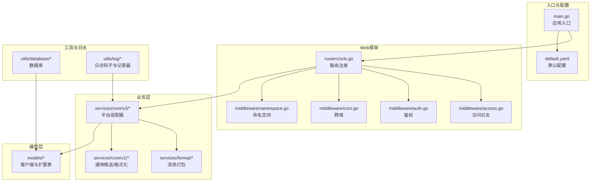
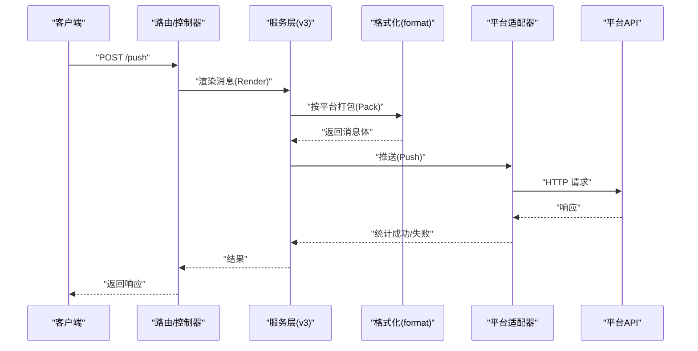
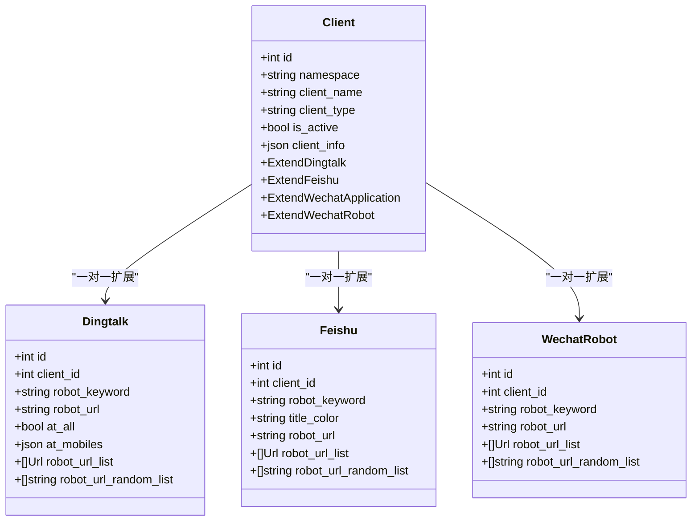
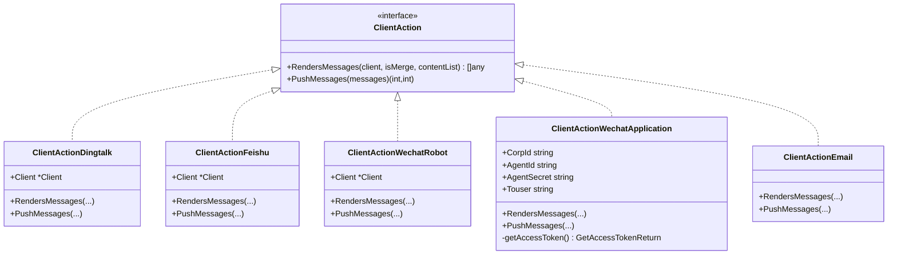
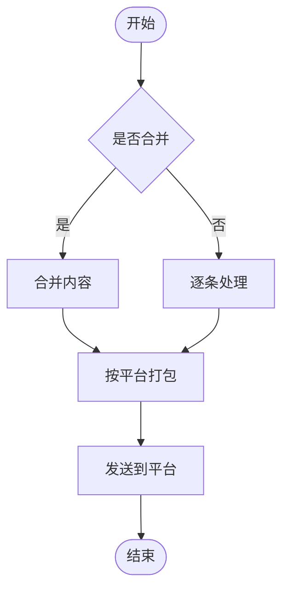
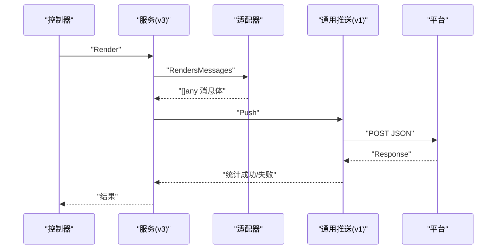
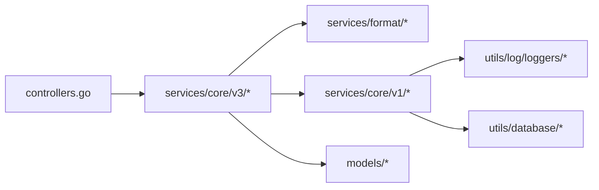

# 消息推送系统

<cite>
**本文引用的文件**   
- [main.go](file://main.go)
- [default.yaml](file://config/default.yaml)
- [client.go](file://pkg/models/client.go)
- [client_dingtalk.go](file://pkg/models/client_dingtalk.go)
- [client_feishu.go](file://pkg/models/client_feishu.go)
- [client_wechat.go](file://pkg/models/client_wechat.go)
- [interfaces.go](file://pkg/services/core/v3/interfaces.go)
- [dingtalk.go](file://pkg/services/core/v3/dingtalk.go)
- [feishu.go](file://pkg/services/core/v3/feishu.go)
- [wechat.go](file://pkg/services/core/v3/wechat.go)
- [wechat_robot.go](file://pkg/services/core/v3/wechat_robot.go)
- [email.go](file://pkg/services/core/v3/email.go)
- [format.go](file://pkg/services/core/v1/format.go)
- [push.go](file://pkg/services/core/v1/push.go)
- [dingtalk.go](file://pkg/services/format/dingtalk.go)
- [urls.go](file://pkg/routers/urls.go)
- [controllers.go](file://pkg/authorization/controllers.go)
- [models.go](file://pkg/authorization/models.go)
- [views.go](file://pkg/authorization/views.go)
- [clientDelete.go](file://pkg/api/client/clientDelete.go)
- [clientGet.go](file://pkg/api/client/clientGet.go)
- [clientList.go](file://pkg/api/client/clientList.go)
- [clientPost.go](file://pkg/api/client/clientPost.go)
- [clientPut.go](file://pkg/api/client/clientPut.go)
- [vGomessage.go](file://pkg/api/vGomessage.go)
- [vHealth.go](file://pkg/api/vHealth.go)
- [vIndex.go](file://pkg/api/vIndex.go)
- [vJson.go](file://pkg/api/vJson.go)
- [vNamespace.go](file://pkg/api/vNamespace.go)
- [vTemplate.go](file://pkg/api/vTemplate.go)
- [vVariables.go](file://pkg/api/vVariables.go)
- [access.go](file://pkg/middleware/access.go)
- [auth.go](file://pkg/middleware/auth.go)
- [cors.go](file://pkg/middleware/cors.go)
- [namespace.go](file://pkg/middleware/namespace.go)
- [mysql.go](file://pkg/utils/database/mysql.go)
- [sqlite.go](file://pkg/utils/database/sqlite.go)
- [loggers_access.go](file://pkg/utils/log/loggers/access.go)
- [loggers_push.go](file://pkg/utils/log/loggers/push.go)
- [loggers_runtime.go](file://pkg/utils/log/loggers/runtime.go)
- [hookAccess.go](file://pkg/utils/log/hooks/es/hookAccess.go)
- [hookPush.go](file://pkg/utils/log/hooks/es/hookPush.go)
- [hookRuntime.go](file://pkg/utils/log/hooks/es/hookRuntime.go)
- [base.go](file://pkg/utils/log/hooks/es/base.go)
- [client.go](file://pkg/utils/log/hooks/es/client.go)
- [mapping.go](file://pkg/utils/log/hooks/es/mapping.go)
- [constants.go](file://pkg/utils/constants.go)
- [response.go](file://pkg/utils/response.go)
- [vars.json](file://pkg/utils/vars.json)
- [template.json](file://pkg/utils/template.json)
</cite>

## 目录
1. [简介](#简介)
2. [项目结构](#项目结构)
3. [核心组件](#核心组件)
4. [架构总览](#架构总览)
5. [详细组件分析](#详细组件分析)
6. [依赖分析](#依赖分析)
7. [性能考虑](#性能考虑)
8. [故障排查指南](#故障排查指南)
9. [结论](#结论)
10. [附录](#附录)

## 简介
本项目是一个统一的消息推送系统，支持多种消息平台与渠道，包括：
- 钉钉机器人
- 飞书机器人
- 企业微信机器人
- 企业微信应用（应用号）
- 邮件推送（预留）

系统通过“渲染器 + 推送器”的分层设计，实现消息格式的统一与平台差异的隔离；同时提供统一的客户端管理、模板与变量系统，以及完善的日志与错误处理能力。

## 项目结构
后端采用 Go + Gin 框架，按功能域划分目录：
- config：默认配置文件
- pkg：
  - models：客户端与实体模型
  - services：业务服务
    - core：核心推送逻辑（v1/v2/v3 多版本演进）
    - format：各平台消息打包工具
  - api：HTTP 接口层
  - routers：路由注册
  - middleware：中间件
  - utils：工具库（日志、数据库、常量、响应封装等）
- vue：前端管理界面（非本文重点）

图表来源
- [main.go:1-56](file://main.go#L1-L56)
- [default.yaml:1-83](file://config/default.yaml#L1-L83)
- [urls.go](file://pkg/routers/urls.go)
- [access.go](file://pkg/middleware/access.go)
- [auth.go](file://pkg/middleware/auth.go)
- [cors.go](file://pkg/middleware/cors.go)
- [namespace.go](file://pkg/middleware/namespace.go)
- [interfaces.go](file://pkg/services/core/v3/interfaces.go)
- [dingtalk.go](file://pkg/services/core/v3/dingtalk.go)
- [feishu.go](file://pkg/services/core/v3/feishu.go)
- [wechat.go](file://pkg/services/core/v3/wechat.go)
- [wechat_robot.go](file://pkg/services/core/v3/wechat_robot.go)
- [email.go](file://pkg/services/core/v3/email.go)
- [format.go](file://pkg/services/core/v1/format.go)
- [push.go](file://pkg/services/core/v1/push.go)
- [dingtalk.go](file://pkg/services/format/dingtalk.go)
- [client.go](file://pkg/models/client.go)
- [mysql.go](file://pkg/utils/database/mysql.go)
- [sqlite.go](file://pkg/utils/database/sqlite.go)
- [loggers_access.go](file://pkg/utils/log/loggers/access.go)
- [loggers_push.go](file://pkg/utils/log/loggers/push.go)
- [loggers_runtime.go](file://pkg/utils/log/loggers/runtime.go)

章节来源
- [main.go:1-56](file://main.go#L1-L56)
- [default.yaml:1-83](file://config/default.yaml#L1-L83)

## 核心组件
- 客户端模型与持久化：统一的 Client 结构体及各平台扩展表（钉钉、飞书、企业微信机器人、企业微信应用），支持增删改查与激活状态管理。
- 平台适配器（v3）：以接口形式定义渲染与推送行为，分别针对钉钉、飞书、企业微信机器人、企业微信应用与邮件。
- 通用格式化与推送：v1 提供消息合并、URL 随机化、统一推送与日志记录。
- API 层：提供客户端 CRUD、命名空间、模板与变量等接口。
- 中间件：鉴权、跨域、命名空间校验、访问日志。
- 日志与 ES 集成：运行时、访问、推送三类日志，可选输出至 Elasticsearch。

章节来源
- [client.go:1-239](file://pkg/models/client.go#L1-L239)
- [client_dingtalk.go:1-38](file://pkg/models/client_dingtalk.go#L1-L38)
- [client_feishu.go:1-24](file://pkg/models/client_feishu.go#L1-L24)
- [client_wechat.go:1-24](file://pkg/models/client_wechat.go#L1-L24)
- [interfaces.go:1-11](file://pkg/services/core/v3/interfaces.go#L1-L11)
- [dingtalk.go:1-41](file://pkg/services/core/v3/dingtalk.go#L1-L41)
- [feishu.go:1-40](file://pkg/services/core/v3/feishu.go#L1-L40)
- [wechat.go:1-121](file://pkg/services/core/v3/wechat.go#L1-L121)
- [wechat_robot.go:1-40](file://pkg/services/core/v3/wechat_robot.go#L1-L40)
- [email.go:1-18](file://pkg/services/core/v3/email.go#L1-L18)
- [format.go](file://pkg/services/core/v1/format.go)
- [push.go:1-57](file://pkg/services/core/v1/push.go#L1-L57)

## 架构总览
系统采用“控制器-服务-格式化-平台适配器-平台”的分层架构。请求从 HTTP 路由进入，经中间件与控制器处理，调用服务层进行消息渲染与推送，最终通过平台适配器对接具体平台。

图表来源
- [dingtalk.go:14-40](file://pkg/services/core/v3/dingtalk.go#L14-L40)
- [feishu.go:14-39](file://pkg/services/core/v3/feishu.go#L14-L39)
- [wechat_robot.go:14-39](file://pkg/services/core/v3/wechat_robot.go#L14-L39)
- [wechat.go:24-91](file://pkg/services/core/v3/wechat.go#L24-L91)
- [push.go:14-56](file://pkg/services/core/v1/push.go#L14-L56)

## 详细组件分析

### 客户端模型与平台扩展
- 统一 Client 包含命名空间、名称、描述、类型、激活状态与扩展信息；扩展结构体分别对应各平台。
- 支持新增/更新/删除/查询/激活状态切换；查询时按类型加载对应扩展表。
- 平台扩展表均维护“机器人 URL 列表”，并在入库时生成“随机 URL 列表”。

图表来源
- [client.go:13-28](file://pkg/models/client.go#L13-L28)
- [client_dingtalk.go:21-33](file://pkg/models/client_dingtalk.go#L21-L33)
- [client_feishu.go:8-19](file://pkg/models/client_feishu.go#L8-L19)
- [client_wechat.go:8-19](file://pkg/models/client_wechat.go#L8-L19)

章节来源
- [client.go:1-239](file://pkg/models/client.go#L1-L239)
- [client_dingtalk.go:1-38](file://pkg/models/client_dingtalk.go#L1-L38)
- [client_feishu.go:1-24](file://pkg/models/client_feishu.go#L1-L24)
- [client_wechat.go:1-24](file://pkg/models/client_wechat.go#L1-L24)

### 平台适配器与消息格式化
- 接口定义：统一的渲染与推送接口，便于扩展新平台。
- 钉钉/飞书/企业微信机器人：先将多条内容合并或逐条渲染，再按平台打包消息体，最后随机选择机器人 URL 推送。
- 企业微信应用：先获取 access_token，再逐条推送，消息体为应用号格式（markdown）。
- 邮件：预留实现，当前直接输出提示信息。

图表来源
- [interfaces.go:7-10](file://pkg/services/core/v3/interfaces.go#L7-L10)
- [dingtalk.go:10-40](file://pkg/services/core/v3/dingtalk.go#L10-L40)
- [feishu.go:10-39](file://pkg/services/core/v3/feishu.go#L10-L39)
- [wechat_robot.go:10-39](file://pkg/services/core/v3/wechat_robot.go#L10-L39)
- [wechat.go:17-121](file://pkg/services/core/v3/wechat.go#L17-L121)
- [email.go:8-17](file://pkg/services/core/v3/email.go#L8-L17)

章节来源
- [interfaces.go:1-11](file://pkg/services/core/v3/interfaces.go#L1-L11)
- [dingtalk.go:1-41](file://pkg/services/core/v3/dingtalk.go#L1-L41)
- [feishu.go:1-40](file://pkg/services/core/v3/feishu.go#L1-L40)
- [wechat_robot.go:1-40](file://pkg/services/core/v3/wechat_robot.go#L1-L40)
- [wechat.go:1-121](file://pkg/services/core/v3/wechat.go#L1-L121)
- [email.go:1-18](file://pkg/services/core/v3/email.go#L1-L18)

### 消息格式化机制
- 钉钉：Markdown 类型，支持标题、文本与@配置。
- 飞书：Markdown 类型，支持标题颜色等。
- 企业微信机器人：Markdown 类型，支持关键字过滤。
- 企业微信应用：应用号消息体（markdown），需 access_token。
- 统一处理流程：先按平台规则渲染，再进行序列化与推送。

图表来源
- [dingtalk.go:14-27](file://pkg/services/core/v3/dingtalk.go#L14-L27)
- [feishu.go:14-26](file://pkg/services/core/v3/feishu.go#L14-L26)
- [wechat_robot.go:14-26](file://pkg/services/core/v3/wechat_robot.go#L14-L26)
- [wechat.go:24-53](file://pkg/services/core/v3/wechat.go#L24-L53)
- [dingtalk.go:3-29](file://pkg/services/format/dingtalk.go#L3-L29)

章节来源
- [dingtalk.go:14-27](file://pkg/services/core/v3/dingtalk.go#L14-L27)
- [feishu.go:14-26](file://pkg/services/core/v3/feishu.go#L14-L26)
- [wechat_robot.go:14-26](file://pkg/services/core/v3/wechat_robot.go#L14-L26)
- [wechat.go:24-53](file://pkg/services/core/v3/wechat.go#L24-L53)
- [dingtalk.go:1-30](file://pkg/services/format/dingtalk.go#L1-L30)

### 推送流程与控制流
- 控制器接收请求，调用服务层渲染消息。
- 服务层根据平台类型选择适配器，生成消息体。
- 通用推送函数负责 HTTP 发送、响应读取与日志记录。
- 企业微信应用额外包含 access_token 获取流程。

图表来源
- [dingtalk.go:30-40](file://pkg/services/core/v3/dingtalk.go#L30-L40)
- [feishu.go:29-39](file://pkg/services/core/v3/feishu.go#L29-L39)
- [wechat_robot.go:29-39](file://pkg/services/core/v3/wechat_robot.go#L29-L39)
- [wechat.go:55-91](file://pkg/services/core/v3/wechat.go#L55-L91)
- [push.go:14-56](file://pkg/services/core/v1/push.go#L14-L56)

章节来源
- [dingtalk.go:30-40](file://pkg/services/core/v3/dingtalk.go#L30-L40)
- [feishu.go:29-39](file://pkg/services/core/v3/feishu.go#L29-L39)
- [wechat_robot.go:29-39](file://pkg/services/core/v3/wechat_robot.go#L29-L39)
- [wechat.go:55-91](file://pkg/services/core/v3/wechat.go#L55-L91)
- [push.go:1-57](file://pkg/services/core/v1/push.go#L1-L57)

### 错误处理与重试机制
- 网络异常：HTTP 发送失败、响应读取失败、响应关闭失败均有日志记录与错误返回。
- 认证失败：企业微信应用获取 access_token 失败时，直接标记全部失败。
- 平台限制：推送函数记录响应状态与内容，便于定位问题。
- 重试策略：当前未实现自动重试，建议在上层控制器或任务队列中引入指数退避与限流。

章节来源
- [push.go:29-56](file://pkg/services/core/v1/push.go#L29-L56)
- [wechat.go:56-91](file://pkg/services/core/v3/wechat.go#L56-L91)

### 性能优化建议与最佳实践
- URL 随机化：各平台扩展表保存“随机 URL 列表”，避免单点故障与限流风险。
- 消息合并：在高并发场景下建议启用合并，减少请求次数。
- 日志分级：生产环境建议开启 ES 日志，配合索引滚动策略。
- 数据库：默认 SQLite 即可满足元数据存储，避免引入重型数据库。
- 超时与并发：统一设置 HTTP 客户端超时，控制并发度，防止雪崩。

章节来源
- [client_dingtalk.go:13-19](file://pkg/models/client_dingtalk.go#L13-L19)
- [client_feishu.go:16-18](file://pkg/models/client_feishu.go#L16-L18)
- [client_wechat.go:16-18](file://pkg/models/client_wechat.go#L16-L18)
- [default.yaml:48-62](file://config/default.yaml#L48-L62)

## 依赖分析
- 组件内聚：平台适配器与格式化模块职责清晰，耦合度低。
- 外部依赖：Gin、Viper、GORM、logrus、Elasticsearch（可选）。
- 循环依赖：未发现循环导入；适配器通过接口解耦。

图表来源
- [controllers.go](file://pkg/authorization/controllers.go)
- [interfaces.go](file://pkg/services/core/v3/interfaces.go)
- [dingtalk.go](file://pkg/services/core/v3/dingtalk.go)
- [push.go](file://pkg/services/core/v1/push.go)
- [client.go](file://pkg/models/client.go)
- [loggers_push.go](file://pkg/utils/log/loggers/push.go)
- [sqlite.go](file://pkg/utils/database/sqlite.go)

章节来源
- [controllers.go](file://pkg/authorization/controllers.go)
- [interfaces.go](file://pkg/services/core/v3/interfaces.go)
- [dingtalk.go](file://pkg/services/core/v3/dingtalk.go)
- [push.go](file://pkg/services/core/v1/push.go)
- [client.go](file://pkg/models/client.go)
- [loggers_push.go](file://pkg/utils/log/loggers/push.go)
- [sqlite.go](file://pkg/utils/database/sqlite.go)

## 性能考虑
- 并发与限流：建议在网关或控制器层引入令牌桶/漏桶算法，限制每客户端/每平台的 QPS。
- 缓存：access_token 可缓存并设置过期时间，避免频繁拉取。
- 批处理：合并消息时尽量批量发送，减少网络往返。
- 超时与重试：为 HTTP 客户端设置合理超时与最大重试次数，结合指数退避。
- 日志：生产环境建议异步写入与滚动清理，避免 IO 抖动。

## 故障排查指南
- 无法推送：检查平台 URL 是否正确、是否启用随机 URL、网络连通性。
- 认证失败：核对 access_token 获取路径与凭据；查看日志中的错误码与原因。
- 响应异常：查看推送日志中的响应状态与内容，定位平台侧限制。
- 日志定位：运行时日志、访问日志、推送日志分别用于不同维度的问题排查。

章节来源
- [loggers_runtime.go](file://pkg/utils/log/loggers/runtime.go)
- [loggers_access.go](file://pkg/utils/log/loggers/access.go)
- [loggers_push.go](file://pkg/utils/log/loggers/push.go)
- [hookRuntime.go](file://pkg/utils/log/hooks/es/hookRuntime.go)
- [hookAccess.go](file://pkg/utils/log/hooks/es/hookAccess.go)
- [hookPush.go](file://pkg/utils/log/hooks/es/hookPush.go)

## 结论
本系统通过清晰的分层与接口抽象，实现了多平台消息推送的统一接入与扩展。建议在生产环境中完善重试与限流策略、接入任务队列与监控告警，并持续优化日志与可观测性。

## 附录

### 支持的平台与配置要点
- 钉钉机器人
  - 关键字段：机器人关键字、机器人 URL 列表
  - 渲染：Markdown，支持 @ 配置
  - 推送：随机 URL，统一序列化与日志
- 飞书机器人
  - 关键字段：机器人关键字、标题颜色、机器人 URL 列表
  - 渲染：Markdown
  - 推送：随机 URL
- 企业微信机器人
  - 关键字段：机器人关键字、机器人 URL 列表
  - 渲染：Markdown
  - 推送：随机 URL
- 企业微信应用
  - 关键字段：企业 ID、应用 AgentId、应用密钥、接收人
  - 渲染：Markdown
  - 推送：先获取 access_token，再逐条发送
- 邮件推送
  - 当前为占位实现，后续可接入 SMTP 或第三方邮件服务

章节来源
- [client_dingtalk.go:21-33](file://pkg/models/client_dingtalk.go#L21-L33)
- [client_feishu.go:8-19](file://pkg/models/client_feishu.go#L8-L19)
- [client_wechat.go:8-19](file://pkg/models/client_wechat.go#L8-L19)
- [wechat.go:94-120](file://pkg/services/core/v3/wechat.go#L94-L120)

### API 与路由概览
- 客户端管理：增删改查、激活状态切换、按命名空间列出
- 命名空间与模板：命名空间管理、模板与变量接口
- 健康检查与首页：健康状态、系统信息

章节来源
- [clientPost.go](file://pkg/api/client/clientPost.go)
- [clientGet.go](file://pkg/api/client/clientGet.go)
- [clientPut.go](file://pkg/api/client/clientPut.go)
- [clientDelete.go](file://pkg/api/client/clientDelete.go)
- [clientList.go](file://pkg/api/client/clientList.go)
- [vNamespace.go](file://pkg/api/vNamespace.go)
- [vTemplate.go](file://pkg/api/vTemplate.go)
- [vVariables.go](file://pkg/api/vVariables.go)
- [vHealth.go](file://pkg/api/vHealth.go)
- [vIndex.go](file://pkg/api/vIndex.go)
- [vGomessage.go](file://pkg/api/vGomessage.go)
- [vJson.go](file://pkg/api/vJson.go)

### 配置示例（基于默认配置）
- 服务监听：主机与端口
- 日志级别与格式、ES 开关与地址
- 数据库类型与 SQLite 路径
- JWT 密钥（生产环境务必修改）

章节来源
- [default.yaml:19-21](file://config/default.yaml#L19-L21)
- [default.yaml:27-44](file://config/default.yaml#L27-L44)
- [default.yaml:52](file://config/default.yaml#L52)
- [default.yaml:58-62](file://config/default.yaml#L58-L62)
- [default.yaml:11-13](file://config/default.yaml#L11-L13)