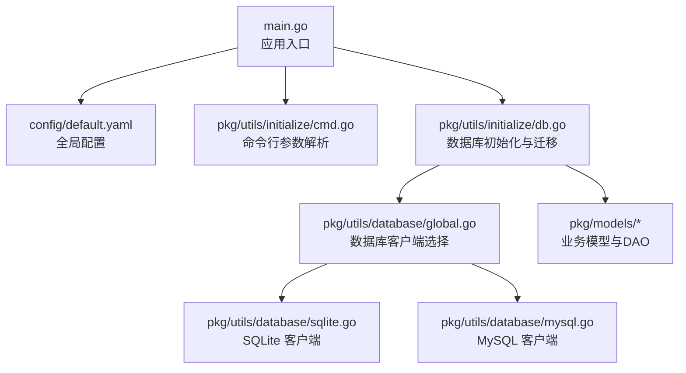
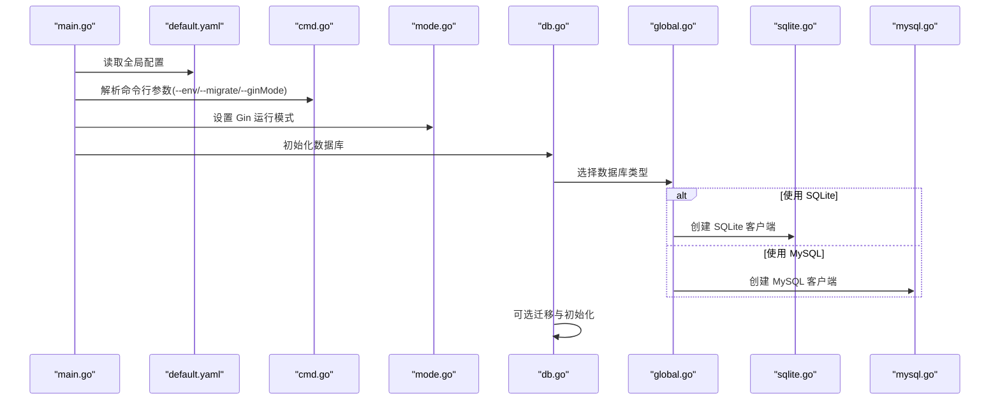
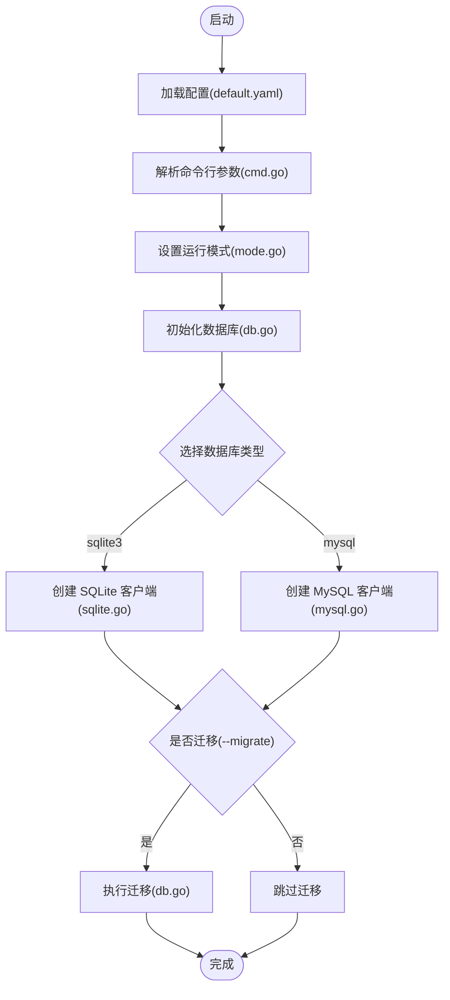
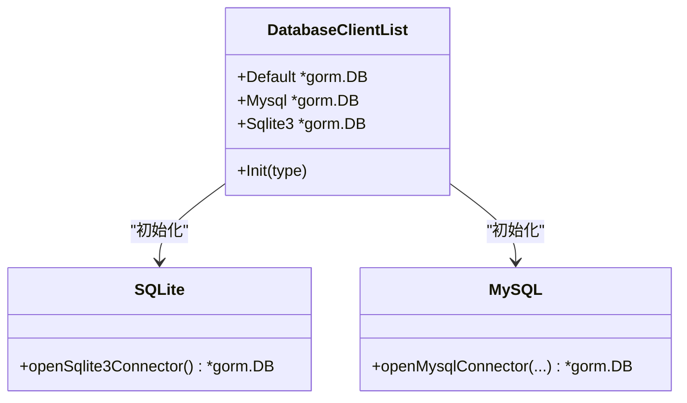
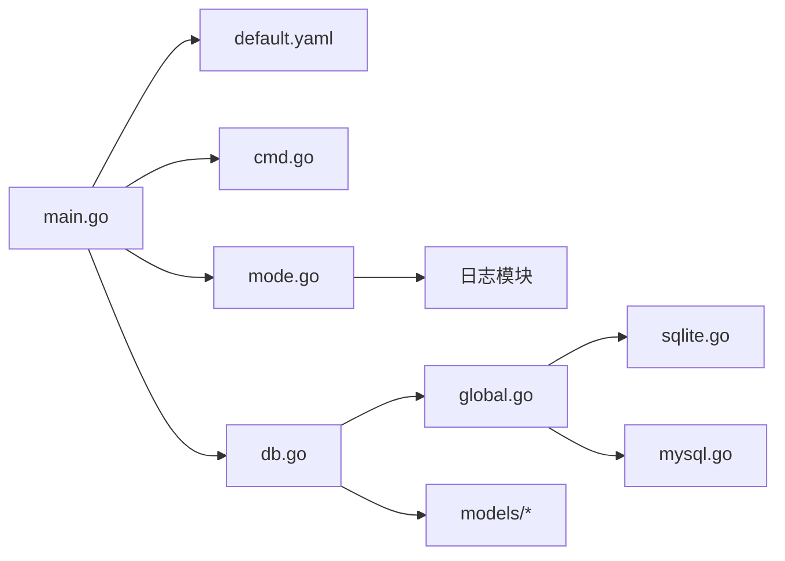

# 备份与恢复

<cite>
**本文引用的文件**
- [main.go](file://main.go)
- [default.yaml](file://config/default.yaml)
- [global.go](file://pkg/utils/database/global.go)
- [mysql.go](file://pkg/utils/database/mysql.go)
- [sqlite.go](file://pkg/utils/database/sqlite.go)
- [db.go](file://pkg/utils/initialize/db.go)
- [cmd.go](file://pkg/utils/initialize/cmd.go)
- [mode.go](file://pkg/utils/initialize/mode.go)
- [namespace.go](file://pkg/models/namespace.go)
- [template.go](file://pkg/models/template.go)
- [client.go](file://pkg/models/client.go)
- [Makefile](file://Makefile)
</cite>

## 目录
1. [简介](#简介)
2. [项目结构](#项目结构)
3. [核心组件](#核心组件)
4. [架构总览](#架构总览)
5. [详细组件分析](#详细组件分析)
6. [依赖分析](#依赖分析)
7. [性能考量](#性能考量)
8. [故障排查指南](#故障排查指南)
9. [结论](#结论)
10. [附录](#附录)

## 简介
本指南面向生产环境的数据保护，围绕数据库备份与恢复、自动化备份与定时任务、数据恢复流程与注意事项、数据迁移方法与工具、灾难恢复计划与演练、数据一致性检查与验证、备份数据安全存储与加密、备份恢复测试与验证流程、常见问题排查与解决、以及生产环境最佳实践等方面，结合本仓库现有数据库实现与配置，提供可操作的策略与步骤。

## 项目结构
本项目采用分层与按功能组织的结构：
- 配置层：通过 Viper 读取 YAML 配置，支持运行时覆盖。
- 初始化层：负责配置、命令行参数、日志、Gin 模式、数据库初始化与迁移。
- 数据访问层：基于 GORM，支持 SQLite 与 MySQL。
- 模型层：定义业务实体及常用 CRUD 方法。
- 构建与打包：Makefile 提供多平台构建与打包。

图表来源
- [main.go:13-35](file://main.go#L13-L35)
- [default.yaml:46-75](file://config/default.yaml#L46-L75)
- [cmd.go:46-98](file://pkg/utils/initialize/cmd.go#L46-L98)
- [db.go:11-48](file://pkg/utils/initialize/db.go#L11-L48)
- [global.go:14-35](file://pkg/utils/database/global.go#L14-L35)
- [sqlite.go:18-46](file://pkg/utils/database/sqlite.go#L18-L46)
- [mysql.go:25-51](file://pkg/utils/database/mysql.go#L25-L51)

章节来源
- [main.go:13-35](file://main.go#L13-L35)
- [default.yaml:46-75](file://config/default.yaml#L46-L75)
- [cmd.go:46-98](file://pkg/utils/initialize/cmd.go#L46-L98)
- [db.go:11-48](file://pkg/utils/initialize/db.go#L11-L48)
- [global.go:14-35](file://pkg/utils/database/global.go#L14-L35)
- [sqlite.go:18-46](file://pkg/utils/database/sqlite.go#L18-L46)
- [mysql.go:25-51](file://pkg/utils/database/mysql.go#L25-L51)

## 核心组件
- 数据库类型与路径
  - 支持 SQLite 与 MySQL，当前默认使用 SQLite，数据库文件路径由配置项决定。
- 数据库客户端
  - 通过统一的客户端列表在运行时切换默认客户端，便于扩展与维护。
- 初始化与迁移
  - 在启动阶段根据配置与命令行参数初始化数据库并可选地执行迁移。
- 模型与DAO
  - 以 GORM 模型封装常用 CRUD，便于直接用于备份/恢复场景的数据导出与导入。

章节来源
- [default.yaml:46-75](file://config/default.yaml#L46-L75)
- [global.go:14-35](file://pkg/utils/database/global.go#L14-L35)
- [db.go:11-48](file://pkg/utils/initialize/db.go#L11-L48)
- [namespace.go:12-26](file://pkg/models/namespace.go#L12-L26)
- [template.go:9-22](file://pkg/models/template.go#L9-L22)
- [client.go:13-28](file://pkg/models/client.go#L13-L28)

## 架构总览
应用启动时，按顺序加载配置、命令行参数、日志、Swagger、Gin 模式，最后初始化数据库并可选迁移。数据库初始化会根据配置选择 SQLite 或 MySQL，并建立连接池。

图表来源
- [main.go:13-35](file://main.go#L13-L35)
- [default.yaml:46-75](file://config/default.yaml#L46-L75)
- [cmd.go:46-98](file://pkg/utils/initialize/cmd.go#L46-L98)
- [mode.go:9-28](file://pkg/utils/initialize/mode.go#L9-L28)
- [db.go:11-48](file://pkg/utils/initialize/db.go#L11-L48)
- [global.go:14-35](file://pkg/utils/database/global.go#L14-L35)
- [sqlite.go:18-46](file://pkg/utils/database/sqlite.go#L18-L46)
- [mysql.go:25-51](file://pkg/utils/database/mysql.go#L25-L51)

## 详细组件分析

### 数据库初始化与迁移流程
- 初始化顺序
  - 配置加载 → 命令行参数覆盖 → 日志初始化 → Swagger/Gin 模式 → 数据库初始化与迁移。
- 迁移触发条件
  - 命令行参数 --migrate=true 时执行迁移；迁移列表包含命名空间、模板、变量、客户端及其扩展表等。
- 默认行为
  - 默认启用迁移，确保表结构幂等对齐；生产部署建议明确控制该参数。

图表来源
- [main.go:13-35](file://main.go#L13-L35)
- [cmd.go:46-98](file://pkg/utils/initialize/cmd.go#L46-L98)
- [mode.go:9-28](file://pkg/utils/initialize/mode.go#L9-L28)
- [db.go:11-48](file://pkg/utils/initialize/db.go#L11-L48)
- [global.go:14-35](file://pkg/utils/database/global.go#L14-L35)
- [sqlite.go:18-46](file://pkg/utils/database/sqlite.go#L18-L46)
- [mysql.go:25-51](file://pkg/utils/database/mysql.go#L25-L51)

章节来源
- [main.go:13-35](file://main.go#L13-L35)
- [cmd.go:46-98](file://pkg/utils/initialize/cmd.go#L46-L98)
- [mode.go:9-28](file://pkg/utils/initialize/mode.go#L9-L28)
- [db.go:11-48](file://pkg/utils/initialize/db.go#L11-L48)

### 数据库客户端选择与连接池
- 统一客户端列表
  - 通过数据库类型在运行时为 Default、Mysql、Sqlite3 赋值，便于全局使用。
- SQLite
  - 自动确保存储目录存在；设置连接池大小与生命周期。
- MySQL
  - 通过配置项拼接 DSN；设置连接池大小与生命周期。

图表来源
- [global.go:8-12](file://pkg/utils/database/global.go#L8-L12)
- [global.go:14-35](file://pkg/utils/database/global.go#L14-L35)
- [sqlite.go:18-46](file://pkg/utils/database/sqlite.go#L18-L46)
- [mysql.go:25-51](file://pkg/utils/database/mysql.go#L25-L51)

章节来源
- [global.go:8-12](file://pkg/utils/database/global.go#L8-L12)
- [sqlite.go:18-46](file://pkg/utils/database/sqlite.go#L18-L46)
- [mysql.go:25-51](file://pkg/utils/database/mysql.go#L25-L51)

### 模型与DAO（用于备份/恢复的数据载体）
- 命名空间、模板、客户端等模型均通过 GORM 定义表结构与常用 CRUD 方法，适合在备份/恢复流程中作为数据导出/导入的来源与目标。
- 备份策略可围绕这些模型进行全量/增量导出与回填。

章节来源
- [namespace.go:12-26](file://pkg/models/namespace.go#L12-L26)
- [template.go:9-22](file://pkg/models/template.go#L9-L22)
- [client.go:13-28](file://pkg/models/client.go#L13-L28)

## 依赖分析
- 配置与启动
  - main.go 依赖 default.yaml、cmd.go、mode.go、db.go。
- 数据库层
  - db.go 依赖 global.go；global.go 依赖 sqlite.go 与 mysql.go。
- 模型层
  - models/* 依赖 database.DB.Default 进行持久化操作。

图表来源
- [main.go:13-35](file://main.go#L13-L35)
- [default.yaml:46-75](file://config/default.yaml#L46-L75)
- [cmd.go:46-98](file://pkg/utils/initialize/cmd.go#L46-L98)
- [mode.go:9-28](file://pkg/utils/initialize/mode.go#L9-L28)
- [db.go:11-48](file://pkg/utils/initialize/db.go#L11-L48)
- [global.go:14-35](file://pkg/utils/database/global.go#L14-L35)
- [sqlite.go:18-46](file://pkg/utils/database/sqlite.go#L18-L46)
- [mysql.go:25-51](file://pkg/utils/database/mysql.go#L25-L51)

章节来源
- [main.go:13-35](file://main.go#L13-L35)
- [db.go:11-48](file://pkg/utils/initialize/db.go#L11-L48)
- [global.go:14-35](file://pkg/utils/database/global.go#L14-L35)

## 性能考量
- 连接池
  - SQLite 与 MySQL 均设置了最大空闲连接数与最大打开连接数，避免高并发下的连接争用。
- 迁移开销
  - 迁移在启动阶段执行，建议在生产中通过命令行参数精确控制，减少不必要的迁移。
- 文件系统
  - SQLite 数据文件位于配置指定路径，建议部署在高性能磁盘并定期监控容量与 IO。

章节来源
- [sqlite.go:41-46](file://pkg/utils/database/sqlite.go#L41-L46)
- [mysql.go:44-49](file://pkg/utils/database/mysql.go#L44-L49)
- [db.go:22-47](file://pkg/utils/initialize/db.go#L22-L47)

## 故障排查指南
- 启动参数校验
  - --env 必须为 dev/fat/uat/pro，否则退出；--migrate 控制迁移行为。
- 数据库连接失败
  - 检查配置项与网络连通性；确认 SQLite 数据文件所在目录权限。
- 迁移失败
  - 查看迁移日志；核对表结构与字段变更；必要时回滚并修正。
- Gin 模式
  - 通过 --ginMode 覆盖运行模式，便于调试与压测。

章节来源
- [cmd.go:21-34](file://pkg/utils/initialize/cmd.go#L21-L34)
- [cmd.go:67-97](file://pkg/utils/initialize/cmd.go#L67-L97)
- [sqlite.go:20-26](file://pkg/utils/database/sqlite.go#L20-L26)
- [db.go:50-59](file://pkg/utils/initialize/db.go#L50-L59)
- [mode.go:10-26](file://pkg/utils/initialize/mode.go#L10-L26)

## 结论
本项目提供了清晰的数据库抽象与初始化流程，结合配置与命令行参数，能够灵活地在 SQLite 与 MySQL 之间切换。围绕模型层的 CRUD 能力，可直接支撑备份/恢复与迁移流程。建议在生产环境中明确控制迁移与备份策略，强化一致性校验与演练，确保数据安全与业务连续性。

## 附录

### 数据库备份策略与脚本（概念性指导）
- MySQL 备份
  - 使用逻辑备份工具导出结构与数据；结合二进制日志实现增量备份与时间点恢复。
  - 建议在业务低峰期执行全量备份，并定期校验备份集可用性。
- SQLite 备份
  - 直接复制数据文件；或使用在线备份接口生成一致性的备份副本。
  - 对于生产环境，建议在事务外层停止写入或使用只读挂载，确保一致性。
- 备份脚本要点
  - 输出带时间戳的文件名；记录备份元数据（版本、时间、大小、校验和）。
  - 将备份文件归档至远端存储，并设置保留周期与轮转策略。

### 自动化备份与定时任务（概念性指导）
- 计划任务
  - 使用系统计划任务在固定时间触发备份脚本；失败时告警通知。
- 触发条件
  - 可结合业务指标或外部事件触发一次性备份。
- 清理与轮转
  - 定期清理过期备份；保留最近 N 次全备与若干次增量备份。

### 数据恢复流程与注意事项（概念性指导）
- 恢复前准备
  - 评估数据一致性与完整性；准备回滚方案与应急预案。
- 恢复步骤
  - 停止写入；选择最近可用备份；按顺序恢复结构与数据；执行一致性校验。
- 注意事项
  - 避免覆盖生产数据；在隔离环境先行验证；记录恢复过程与结果。

### 数据迁移方法与工具（概念性指导）
- 导出/导入
  - 使用模型层 DAO 导出目标数据为结构化文件；在目标环境导入。
- 工具选择
  - 根据数据规模与格式选择合适的工具；确保字符集与时区一致。
- 幂等性
  - 导入时避免重复键冲突；必要时使用 upsert 或去重策略。

### 灾难恢复计划与演练（概念性指导）
- DRP 制定
  - 明确 RTO/RPO 目标；识别关键系统与数据；定义恢复优先级。
- 演练频率
  - 定期进行桌面推演与实机演练；记录问题与改进项。
- 文档与培训
  - 更新 DRP 并对相关人员进行培训；确保流程可执行。

### 数据一致性检查与验证（概念性指导）
- 校验方法
  - 比对备份与源数据的记录数、关键字段哈希值；抽样比对业务关键指标。
- 验证流程
  - 在恢复后执行业务回归测试；监控关键指标与日志异常。

### 备份数据安全存储与加密（概念性指导）
- 存储位置
  - 使用受控的远端存储；限制访问权限与审计日志。
- 加密策略
  - 传输与静态加密；密钥管理遵循最小权限原则；定期轮换密钥。

### 备份恢复测试与验证流程（概念性指导）
- 测试环境
  - 准备与生产隔离的测试环境；模拟真实数据与负载。
- 验证清单
  - 可恢复性、完整性、性能表现、业务可用性。
- 报告与改进
  - 形成测试报告；总结问题并优化流程。

### 常见问题排查与解决（概念性指导）
- 启动失败
  - 检查配置项与命令行参数；确认数据库可达与权限正确。
- 备份失败
  - 检查磁盘空间、权限与网络；核对备份脚本与工具版本。
- 恢复异常
  - 检查备份文件完整性；确认恢复顺序与依赖；回滚并重试。

### 生产环境数据保护最佳实践（概念性指导）
- 策略
  - 分层备份（全量/增量/差异）；多地多活与异地容灾。
- 工具
  - 选择成熟稳定的备份工具；持续评估与升级。
- 运维
  - 建立变更管理与审批流程；定期演练与复盘；完善监控与告警。