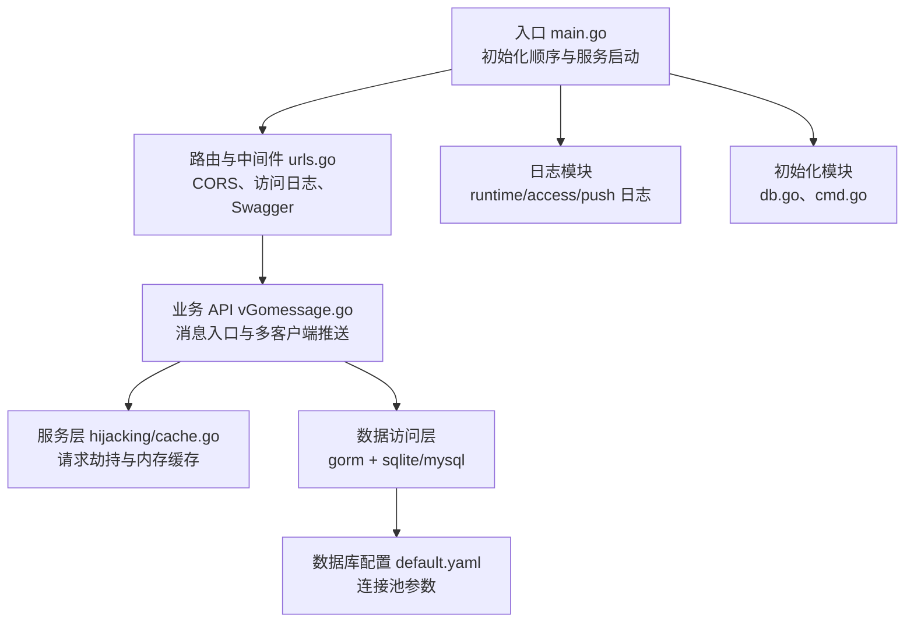
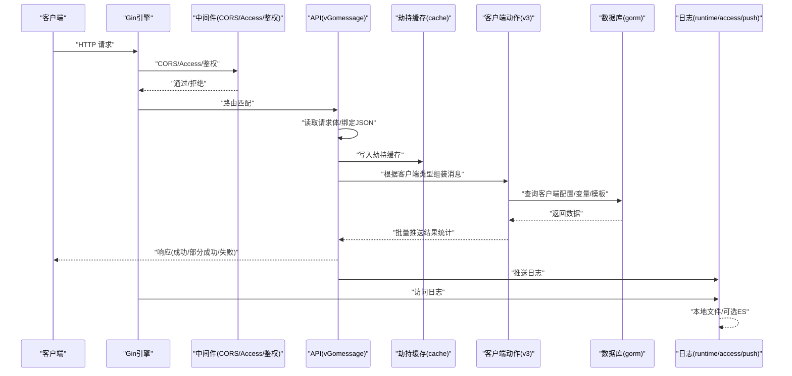
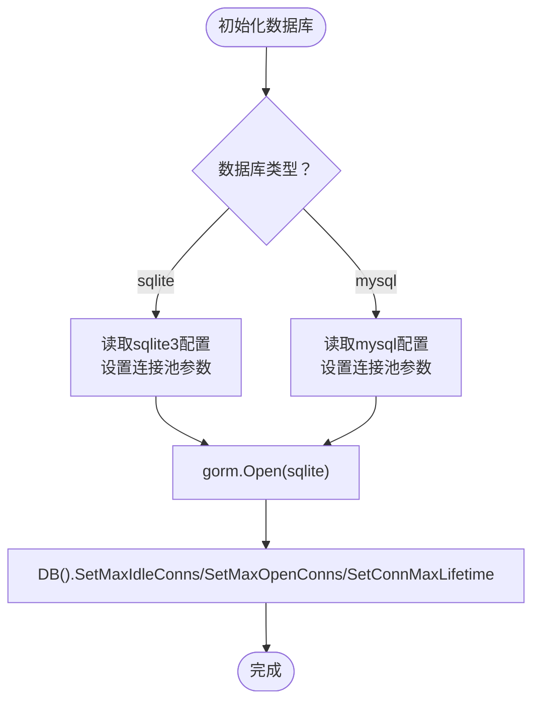
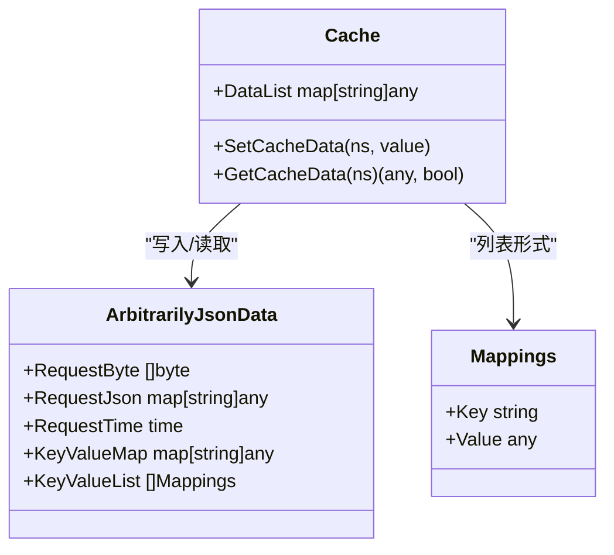
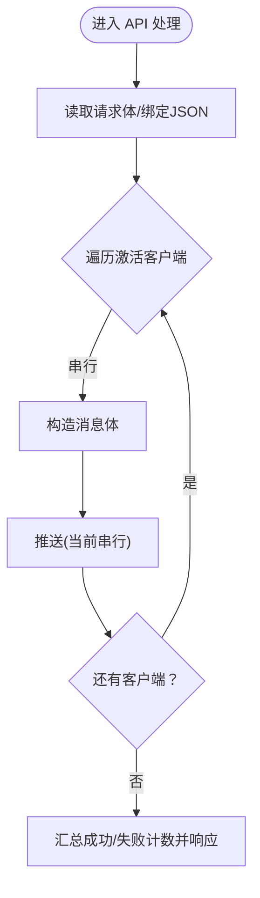
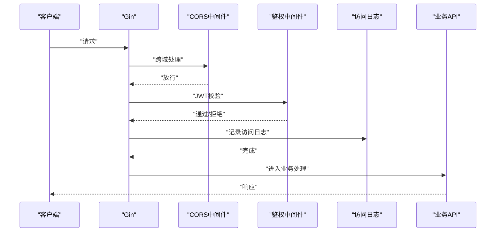
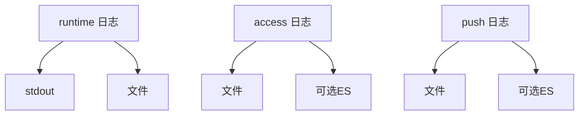
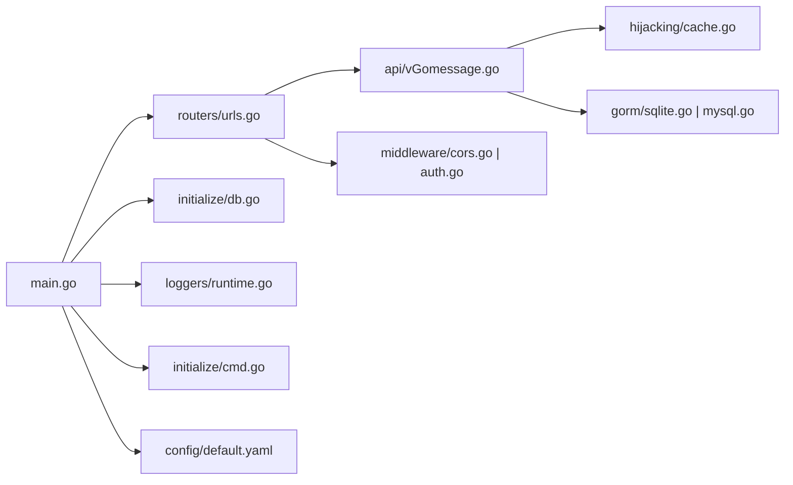

# 性能调优

<cite>
**本文引用的文件**
- [main.go](file://main.go)
- [default.yaml](file://config/default.yaml)
- [mysql.go](file://pkg/utils/database/mysql.go)
- [sqlite.go](file://pkg/utils/database/sqlite.go)
- [db.go](file://pkg/utils/initialize/db.go)
- [cmd.go](file://pkg/utils/initialize/cmd.go)
- [urls.go](file://pkg/routers/urls.go)
- [vGomessage.go](file://pkg/api/vGomessage.go)
- [cache.go](file://pkg/services/hijacking/cache.go)
- [access.go](file://pkg/utils/log/loggers/access.go)
- [push.go](file://pkg/utils/log/loggers/push.go)
- [runtime.go](file://pkg/utils/log/loggers/runtime.go)
- [auth.go](file://pkg/middleware/auth.go)
- [cors.go](file://pkg/middleware/cors.go)
- [go.mod](file://go.mod)
</cite>

## 目录
1. [简介](#简介)
2. [项目结构](#项目结构)
3. [核心组件](#核心组件)
4. [架构总览](#架构总览)
5. [详细组件分析](#详细组件分析)
6. [依赖分析](#依赖分析)
7. [性能考虑](#性能考虑)
8. [故障排查指南](#故障排查指南)
9. [结论](#结论)
10. [附录](#附录)

## 简介
本指南面向生产环境的性能调优，结合代码库现状，系统阐述如何识别与缓解性能瓶颈，涵盖数据库查询优化、内存使用优化、并发处理优化、缓存策略、负载均衡与水平扩展、性能测试与监控、常见问题诊断与最佳实践。文档以“可落地”为目标，既提供高层策略，也给出与代码实现直接对应的优化建议。

## 项目结构
系统采用典型的 Web 后端分层：入口初始化、路由与中间件、业务 API、服务层、数据访问层与日志/配置模块。整体结构清晰，便于定位性能热点与实施针对性优化。

图表来源
- [main.go:13-35](file://main.go#L13-L35)
- [urls.go:21-108](file://pkg/routers/urls.go#L21-L108)
- [vGomessage.go:21-173](file://pkg/api/vGomessage.go#L21-L173)
- [cache.go:1-64](file://pkg/services/hijacking/cache.go#L1-L64)
- [default.yaml:47-76](file://config/default.yaml#L47-L76)
- [runtime.go:15-60](file://pkg/utils/log/loggers/runtime.go#L15-L60)
- [access.go:15-58](file://pkg/utils/log/loggers/access.go#L15-L58)
- [push.go:15-58](file://pkg/utils/log/loggers/push.go#L15-L58)
- [db.go:11-48](file://pkg/utils/initialize/db.go#L11-L48)
- [cmd.go:46-98](file://pkg/utils/initialize/cmd.go#L46-L98)

章节来源
- [main.go:13-55](file://main.go#L13-L55)
- [urls.go:21-108](file://pkg/routers/urls.go#L21-L108)
- [default.yaml:47-76](file://config/default.yaml#L47-L76)

## 核心组件
- 入口与初始化：严格的初始化顺序保证配置、日志、数据库、Swagger 等模块按序加载，避免运行时竞态与配置缺失。
- 路由与中间件：统一处理 CORS、访问日志、鉴权与命名空间校验，形成稳定的请求入口。
- 业务 API：消息入口聚合多客户端推送，包含 JSON 解析、变量渲染、消息组装与批量推送。
- 数据访问层：通过 gorm 支持 sqlite 与 mysql，提供连接池配置与迁移能力。
- 日志模块：分别输出运行时、访问与推送日志，支持本地文件与可选 ES 输出。
- 缓存策略：内存级劫持缓存，用于请求数据的临时共享与后续渲染。

章节来源
- [main.go:13-35](file://main.go#L13-L35)
- [urls.go:21-108](file://pkg/routers/urls.go#L21-L108)
- [vGomessage.go:21-173](file://pkg/api/vGomessage.go#L21-L173)
- [sqlite.go:18-47](file://pkg/utils/database/sqlite.go#L18-L47)
- [mysql.go:25-52](file://pkg/utils/database/mysql.go#L25-L52)
- [cache.go:12-64](file://pkg/services/hijacking/cache.go#L12-L64)
- [runtime.go:15-113](file://pkg/utils/log/loggers/runtime.go#L15-L113)
- [access.go:15-59](file://pkg/utils/log/loggers/access.go#L15-L59)
- [push.go:15-59](file://pkg/utils/log/loggers/push.go#L15-L59)

## 架构总览
下图展示从请求进入、中间件处理、业务逻辑、数据访问到日志输出的整体链路，以及与数据库、缓存的关系。

图表来源
- [urls.go:21-108](file://pkg/routers/urls.go#L21-L108)
- [vGomessage.go:21-173](file://pkg/api/vGomessage.go#L21-L173)
- [cache.go:38-63](file://pkg/services/hijacking/cache.go#L38-L63)
- [sqlite.go:18-47](file://pkg/utils/database/sqlite.go#L18-L47)
- [mysql.go:25-52](file://pkg/utils/database/mysql.go#L25-L52)
- [runtime.go:15-113](file://pkg/utils/log/loggers/runtime.go#L15-L113)
- [access.go:15-59](file://pkg/utils/log/loggers/access.go#L15-L59)
- [push.go:15-59](file://pkg/utils/log/loggers/push.go#L15-L59)

## 详细组件分析

### 数据库层（gorm + sqlite/mysql）
- 连接池配置
  - sqlite：最大空闲连接数与最大打开连接数由配置文件提供，可在部署时按并发峰值调整。
  - mysql：显式设置空闲/最大连接数与连接生命周期，适合高并发场景。
- 日志模式：默认静默，降低日志开销；如需诊断可临时调整。
- 迁移与幂等：启动阶段可执行自动迁移，确保表结构一致性，避免运行期DDL风暴。

图表来源
- [sqlite.go:18-47](file://pkg/utils/database/sqlite.go#L18-L47)
- [mysql.go:25-52](file://pkg/utils/database/mysql.go#L25-L52)
- [default.yaml:58-62](file://config/default.yaml#L58-L62)
- [default.yaml:69-76](file://config/default.yaml#L69-L76)

章节来源
- [sqlite.go:18-47](file://pkg/utils/database/sqlite.go#L18-L47)
- [mysql.go:25-52](file://pkg/utils/database/mysql.go#L25-L52)
- [default.yaml:58-62](file://config/default.yaml#L58-L62)
- [default.yaml:69-76](file://config/default.yaml#L69-L76)
- [db.go:11-48](file://pkg/utils/initialize/db.go#L11-L48)

### 缓存策略与实现
- 劫持缓存：使用内存 map 存储当前命名空间的请求数据，配合读写锁保障并发安全；适用于短时共享与渲染前置。
- 注意事项：当前实现为临时替代方案，未来可引入成熟缓存组件（如带过期淘汰与持久化的缓存库），并评估锁粒度与容量限制。

图表来源
- [cache.go:22-33](file://pkg/services/hijacking/cache.go#L22-L33)
- [cache.go:38-63](file://pkg/services/hijacking/cache.go#L38-L63)

章节来源
- [cache.go:12-64](file://pkg/services/hijacking/cache.go#L12-L64)

### 并发处理与 goroutine 管理
- API 层并发特征：对每个命名空间内的激活客户端逐一处理，存在串行与并行混合场景；当前实现为顺序循环，未见显式 goroutine 并行。
- 优化建议：
  - 将客户端推送改为 goroutine 并行，使用带缓冲 channel 或 worker pool 控制并发度与背压。
  - 对外层请求体读取与 JSON 绑定进行异步化，避免阻塞请求处理。
  - 使用 context 控制超时与取消，防止下游慢客户端拖垮整体吞吐。

图表来源
- [vGomessage.go:67-143](file://pkg/api/vGomessage.go#L67-L143)

章节来源
- [vGomessage.go:21-173](file://pkg/api/vGomessage.go#L21-L173)

### 中间件与请求链路
- CORS：允许跨域与预检请求快速返回，减少浏览器往返。
- 访问日志：统一记录请求维度指标，便于流量分析与异常定位。
- 鉴权中间件：基于 JWT 与会话表校验，建议在高并发下引入会话缓存与签名校验加速。

图表来源
- [cors.go:9-28](file://pkg/middleware/cors.go#L9-L28)
- [auth.go:12-61](file://pkg/middleware/auth.go#L12-L61)
- [access.go:15-59](file://pkg/utils/log/loggers/access.go#L15-L59)
- [urls.go:27-28](file://pkg/routers/urls.go#L27-L28)

章节来源
- [cors.go:1-29](file://pkg/middleware/cors.go#L1-L29)
- [auth.go:1-62](file://pkg/middleware/auth.go#L1-L62)
- [urls.go:21-108](file://pkg/routers/urls.go#L21-L108)

### 日志与可观测性
- 运行时日志：控制台与文件双输出，支持 JSON/Text 格式与级别切换。
- 访问日志：结构化输出，可选投递 ES。
- 推送日志：记录上游消息与推送上下文，便于审计与追踪。

图表来源
- [runtime.go:15-113](file://pkg/utils/log/loggers/runtime.go#L15-L113)
- [access.go:15-59](file://pkg/utils/log/loggers/access.go#L15-L59)
- [push.go:15-59](file://pkg/utils/log/loggers/push.go#L15-L59)

章节来源
- [runtime.go:15-113](file://pkg/utils/log/loggers/runtime.go#L15-L113)
- [access.go:15-59](file://pkg/utils/log/loggers/access.go#L15-L59)
- [push.go:15-59](file://pkg/utils/log/loggers/push.go#L15-L59)

## 依赖分析
- 框架与库：Gin、GORM、Logrus、Viper、Swag 等，均为稳定生态组件。
- 数据库驱动：sqlite 与 mysql 双栈支持，便于在不同规模与可靠性需求下切换。
- 并发与网络：Gin 默认基于 net/http，具备良好并发模型；JWT 鉴权与 CORS 中间件开销可控。

图表来源
- [main.go:13-35](file://main.go#L13-L35)
- [urls.go:21-108](file://pkg/routers/urls.go#L21-L108)
- [vGomessage.go:21-173](file://pkg/api/vGomessage.go#L21-L173)
- [cache.go:1-64](file://pkg/services/hijacking/cache.go#L1-L64)
- [sqlite.go:1-48](file://pkg/utils/database/sqlite.go#L1-L48)
- [mysql.go:1-53](file://pkg/utils/database/mysql.go#L1-L53)
- [db.go:11-48](file://pkg/utils/initialize/db.go#L11-L48)
- [cmd.go:46-98](file://pkg/utils/initialize/cmd.go#L46-L98)
- [cors.go:1-29](file://pkg/middleware/cors.go#L1-L29)
- [auth.go:1-62](file://pkg/middleware/auth.go#L1-L62)
- [default.yaml:1-83](file://config/default.yaml#L1-L83)

章节来源
- [go.mod:5-21](file://go.mod#L5-L21)

## 性能考虑

### 数据库查询优化
- 连接池参数
  - sqlite：根据并发与磁盘 IO 能力调整空闲与最大连接数，避免连接争用与上下文切换开销。
  - mysql：合理设置最大连接数与连接生命周期，避免连接泄漏与长连接占用。
- 索引与查询
  - 针对命名空间、客户端 ID、模板与变量映射建立合适索引，减少扫描。
  - 批量查询与分页，避免一次性拉取大结果集。
- 日志与慢查询
  - 默认关闭 GORM 日志，生产环境可通过中间件或拦截器记录慢查询与错误 SQL。

章节来源
- [sqlite.go:41-46](file://pkg/utils/database/sqlite.go#L41-L46)
- [mysql.go:44-49](file://pkg/utils/database/mysql.go#L44-L49)
- [default.yaml:58-62](file://config/default.yaml#L58-L62)
- [default.yaml:69-76](file://config/default.yaml#L69-L76)

### 内存使用优化
- 劫持缓存：当前为内存 map，建议：
  - 明确过期策略与容量上限，避免长期持有大对象导致 GC 压力。
  - 使用对象池或复用 buffer，减少频繁分配。
- 请求体处理：避免重复拷贝，尽量在流式处理中完成解析与渲染。

章节来源
- [cache.go:12-20](file://pkg/services/hijacking/cache.go#L12-L20)
- [vGomessage.go:33-43](file://pkg/api/vGomessage.go#L33-L43)

### 并发处理优化
- goroutine 管理
  - 将客户端推送改为并发 goroutine，使用带缓冲 channel 或 worker pool 控制并发度。
  - 使用 context.WithTimeout 控制下游超时，避免雪崩。
- channel 使用
  - 为每个客户端推送分配独立任务 channel，聚合结果后统一上报。
- 锁优化
  - 读多写少场景使用读写锁；尽量缩小临界区，避免阻塞长时间持有锁。

章节来源
- [vGomessage.go:67-143](file://pkg/api/vGomessage.go#L67-L143)
- [cache.go:42-58](file://pkg/services/hijacking/cache.go#L42-L58)

### 缓存策略与实现
- 内存缓存：短期共享请求数据，避免重复解析与渲染。
- 建议引入成熟缓存组件（如带 TTL 与淘汰策略），并评估：
  - 分布式缓存（Redis）以支撑水平扩展。
  - 缓存预热与失效策略，避免热点击穿。

章节来源
- [cache.go:38-63](file://pkg/services/hijacking/cache.go#L38-L63)

### 负载均衡与水平扩展
- 服务端扩展
  - 通过反向代理（Nginx/Haproxy/Traefik）进行多实例负载均衡。
  - 保持无状态设计，必要时引入会话共享（如 Redis）。
- 数据库扩展
  - sqlite 适合小规模与开发环境；生产建议 MySQL/PG 并启用只读副本。
  - 使用连接池与读写分离，降低主库压力。

章节来源
- [default.yaml:52](file://config/default.yaml#L52)
- [mysql.go:44-49](file://pkg/utils/database/mysql.go#L44-L49)

### 性能测试方法与工具
- 压测工具
  - wrk、ab、k6、ghz 等，模拟并发请求与不同负载曲线。
- 关键指标
  - QPS、P95/P99 延迟、错误率、数据库连接池利用率、GC 次数与暂停时间。
- 场景设计
  - 单客户端推送、多客户端并发推送、大体积 JSON、慢下游模拟、断网与重试。

章节来源
- [vGomessage.go:67-143](file://pkg/api/vGomessage.go#L67-L143)

### 资源监控与性能指标
- 日志指标
  - 访问日志：请求方法、路径、状态码、耗时、用户代理等。
  - 推送日志：命名空间、消息体大小、推送结果、失败原因。
- 运行时指标
  - CPU、内存、Goroutines 数、GC 统计、文件句柄数。
- 建议集成
  - Prometheus + Grafana 或 OpenTelemetry，采集与可视化。

章节来源
- [access.go:15-59](file://pkg/utils/log/loggers/access.go#L15-L59)
- [push.go:15-59](file://pkg/utils/log/loggers/push.go#L15-L59)
- [runtime.go:15-113](file://pkg/utils/log/loggers/runtime.go#L15-L113)

### 常见性能问题与诊断
- 高延迟
  - 检查下游推送接口可用性与限流策略；确认数据库连接池饱和。
- 高错误率
  - 审核鉴权中间件与命名空间校验逻辑；检查客户端配置有效性。
- 内存上涨
  - 审视劫持缓存容量与过期策略；排查大对象未释放。
- 并发阻塞
  - 检查 goroutine 泄漏与 channel 阻塞；确认超时与取消机制。

章节来源
- [auth.go:12-61](file://pkg/middleware/auth.go#L12-L61)
- [vGomessage.go:67-143](file://pkg/api/vGomessage.go#L67-L143)
- [cache.go:38-63](file://pkg/services/hijacking/cache.go#L38-L63)

### 生产环境最佳实践
- 初始化顺序
  - 严格遵循配置 → 命令行参数覆盖 → 日志 → Swagger → Gin 模式 → 数据库的顺序，避免运行时竞态。
- 配置管理
  - 使用环境变量与配置文件分层，命令行参数优先级最高。
- 安全与合规
  - 生产环境务必更换 JWT 密钥；限制 CORS 与来源；启用 HTTPS。
- 可观测性
  - 结构化日志与指标采集；接入集中式日志与告警系统。
- 扩展性
  - 无状态服务 + 有状态数据库；读写分离与只读副本；缓存层与队列解耦。

章节来源
- [main.go:13-35](file://main.go#L13-L35)
- [cmd.go:46-98](file://pkg/utils/initialize/cmd.go#L46-L98)
- [default.yaml:11-13](file://config/default.yaml#L11-L13)

## 故障排查指南
- 启动失败
  - 检查配置文件与命令行参数是否冲突；确认数据库路径与权限。
- 数据库连接异常
  - 核对连接池参数与目标数据库可达性；观察连接数与等待时间。
- 推送失败
  - 查看推送日志与失败原因聚合；逐项验证客户端配置与模板渲染。
- 鉴权失败
  - 核对 Authorization 头与会话表状态；检查 JWT 签名与有效期。

章节来源
- [main.go:52-54](file://main.go#L52-L54)
- [db.go:11-48](file://pkg/utils/initialize/db.go#L11-L48)
- [vGomessage.go:144-153](file://pkg/api/vGomessage.go#L144-L153)
- [auth.go:12-61](file://pkg/middleware/auth.go#L12-L61)

## 结论
本指南基于现有代码结构，提出从数据库、缓存、并发、日志到扩展与监控的系统性优化路径。建议优先实施 goroutine 并行化、连接池参数调优与缓存策略完善，再逐步引入分布式缓存与监控体系，最终达成高吞吐、低延迟与高可用的生产级性能目标。

## 附录
- 快速检查清单
  - 连接池参数与数据库规模匹配
  - 并发推送与超时控制
  - 缓存容量与过期策略
  - 结构化日志与指标采集
  - 负载均衡与只读副本
  - 压测与回归基线