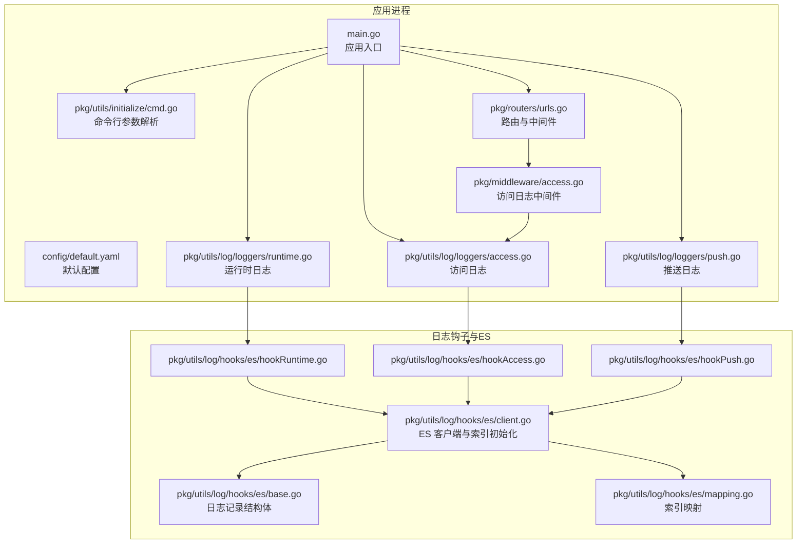
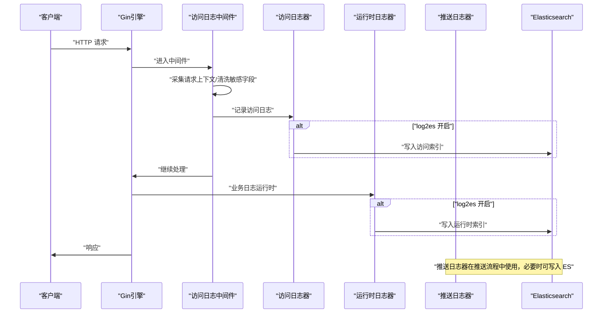
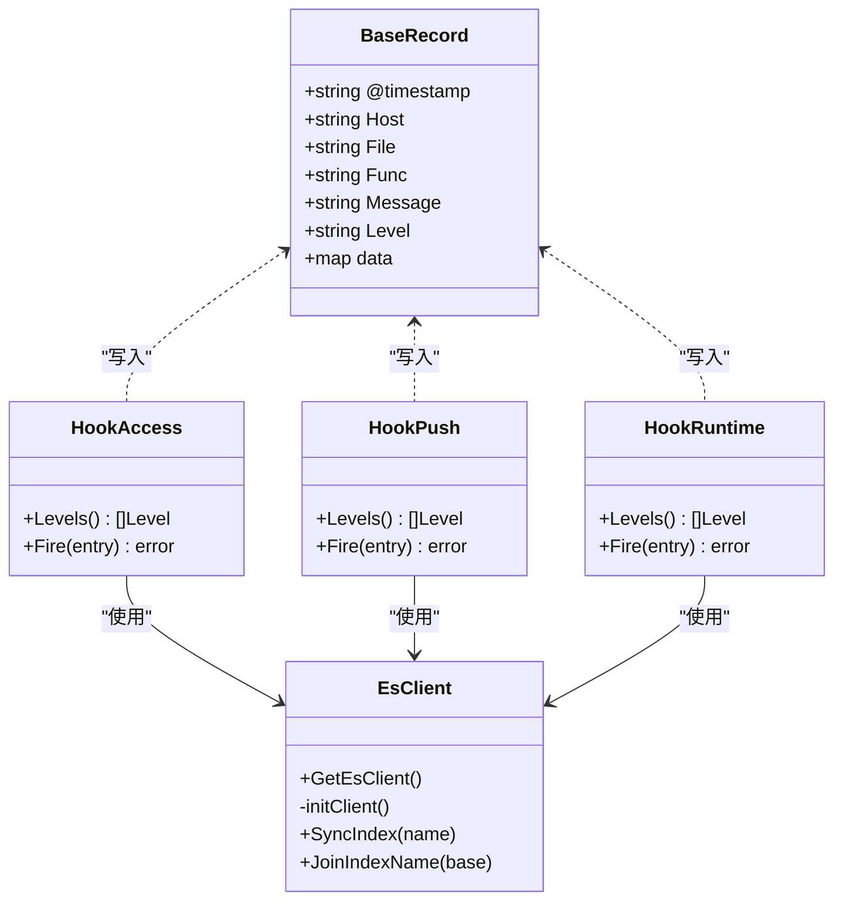
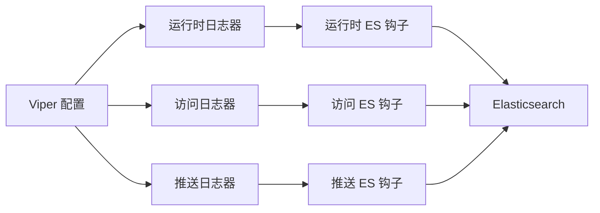

# 监控与日志

<cite>
**本文引用的文件**
- [main.go](file://main.go)
- [config/default.yaml](file://config/default.yaml)
- [pkg/utils/initialize/cmd.go](file://pkg/utils/initialize/cmd.go)
- [pkg/utils/log/loggers/runtime.go](file://pkg/utils/log/loggers/runtime.go)
- [pkg/utils/log/loggers/access.go](file://pkg/utils/log/loggers/access.go)
- [pkg/utils/log/loggers/push.go](file://pkg/utils/log/loggers/push.go)
- [pkg/utils/log/hooks/es/base.go](file://pkg/utils/log/hooks/es/base.go)
- [pkg/utils/log/hooks/es/client.go](file://pkg/utils/log/hooks/es/client.go)
- [pkg/utils/log/hooks/es/hookAccess.go](file://pkg/utils/log/hooks/es/hookAccess.go)
- [pkg/utils/log/hooks/es/hookPush.go](file://pkg/utils/log/hooks/es/hookPush.go)
- [pkg/utils/log/hooks/es/hookRuntime.go](file://pkg/utils/log/hooks/es/hookRuntime.go)
- [pkg/utils/log/hooks/es/mapping.go](file://pkg/utils/log/hooks/es/mapping.go)
- [pkg/middleware/access.go](file://pkg/middleware/access.go)
- [pkg/routers/urls.go](file://pkg/routers/urls.go)
- [pkg/api/vHealth.go](file://pkg/api/vHealth.go)
- [vue/src/views/main/a2template.json](file://vue/src/views/main/a2template.json)
- [pkg/models/namespace_init.go](file://pkg/models/namespace_init.go)
- [pkg/utils/vars.json](file://pkg/utils/vars.json)
</cite>

## 目录
1. [简介](#简介)
2. [项目结构](#项目结构)
3. [核心组件](#核心组件)
4. [架构总览](#架构总览)
5. [详细组件分析](#详细组件分析)
6. [依赖分析](#依赖分析)
7. [性能考虑](#性能考虑)
8. [故障排查指南](#故障排查指南)
9. [结论](#结论)
10. [附录](#附录)

## 简介
本指南面向运维与开发团队，系统性阐述本项目的监控与日志体系，涵盖以下要点：
- 日志系统架构与配置：访问日志、推送日志、运行时日志的格式与用途
- 日志钩子系统：Elasticsearch 集成的初始化、索引策略与字段映射
- 日志收集、存储、查询最佳实践
- 监控指标设计与采集建议（系统性能、业务指标、错误率统计）
- Prometheus/Grafana 集成参考配置与告警规则
- 日志分析工具使用与常见查询语句
- 故障排查的日志分析技巧与定位方法

## 项目结构
围绕“日志与监控”的关键目录与文件如下：
- 配置层：通过 Viper 读取配置，支持命令行覆盖
- 日志层：三类日志（运行时、访问、推送）分别初始化与输出
- 中间件层：HTTP 访问日志中间件，统一采集请求上下文
- ES 钩子层：将三类日志异步写入 Elasticsearch，按日期分索引
- 路由层：挂载中间件与健康检查接口，便于监控验证

图表来源
- [main.go:13-35](file://main.go#L13-L35)
- [pkg/utils/initialize/cmd.go:46-99](file://pkg/utils/initialize/cmd.go#L46-L99)
- [config/default.yaml:27-44](file://config/default.yaml#L27-L44)
- [pkg/routers/urls.go:21-109](file://pkg/routers/urls.go#L21-L109)
- [pkg/middleware/access.go:23-72](file://pkg/middleware/access.go#L23-L72)
- [pkg/utils/log/loggers/runtime.go:15-60](file://pkg/utils/log/loggers/runtime.go#L15-L60)
- [pkg/utils/log/loggers/access.go:15-58](file://pkg/utils/log/loggers/access.go#L15-L58)
- [pkg/utils/log/loggers/push.go:15-58](file://pkg/utils/log/loggers/push.go#L15-L58)
- [pkg/utils/log/hooks/es/base.go:12-49](file://pkg/utils/log/hooks/es/base.go#L12-L49)
- [pkg/utils/log/hooks/es/client.go:22-70](file://pkg/utils/log/hooks/es/client.go#L22-L70)
- [pkg/utils/log/hooks/es/hookAccess.go:10-31](file://pkg/utils/log/hooks/es/hookAccess.go#L10-L31)
- [pkg/utils/log/hooks/es/hookPush.go:10-31](file://pkg/utils/log/hooks/es/hookPush.go#L10-L31)
- [pkg/utils/log/hooks/es/hookRuntime.go:10-31](file://pkg/utils/log/hooks/es/hookRuntime.go#L10-L31)
- [pkg/utils/log/hooks/es/mapping.go:3-53](file://pkg/utils/log/hooks/es/mapping.go#L3-L53)

章节来源
- [main.go:13-35](file://main.go#L13-L35)
- [config/default.yaml:27-44](file://config/default.yaml#L27-L44)
- [pkg/utils/initialize/cmd.go:46-99](file://pkg/utils/initialize/cmd.go#L46-L99)
- [pkg/routers/urls.go:21-109](file://pkg/routers/urls.go#L21-L109)
- [pkg/middleware/access.go:23-72](file://pkg/middleware/access.go#L23-L72)

## 核心组件
- 配置与启动
  - 默认配置集中于配置文件，支持通过命令行参数覆盖关键开关（如日志投递开关、运行模式、环境等）
  - 启动顺序严格：先加载配置，再解析命令行，再初始化日志，最后初始化数据库与路由
- 日志系统
  - 运行时日志：可配置 JSON/文本格式、日志级别、输出目标（标准输出+文件）
  - 访问日志：中间件采集请求上下文，清洗敏感字段，输出到文件与可选的 ES
  - 推送日志：用于记录消息推送过程的关键事件，支持落盘与可选的 ES
- Elasticsearch 集成
  - 单客户端、按需初始化；按日期生成索引（如 gomessage-runtime-YYYY.MM.DD）
  - 提供三类钩子：运行时、访问、推送，分别写入对应索引
  - 映射采用动态映射，便于扩展字段

章节来源
- [config/default.yaml:27-44](file://config/default.yaml#L27-L44)
- [pkg/utils/initialize/cmd.go:46-99](file://pkg/utils/initialize/cmd.go#L46-L99)
- [main.go:13-35](file://main.go#L13-L35)
- [pkg/utils/log/loggers/runtime.go:15-113](file://pkg/utils/log/loggers/runtime.go#L15-L113)
- [pkg/utils/log/loggers/access.go:15-59](file://pkg/utils/log/loggers/access.go#L15-L59)
- [pkg/utils/log/loggers/push.go:15-59](file://pkg/utils/log/loggers/push.go#L15-L59)
- [pkg/utils/log/hooks/es/base.go:12-78](file://pkg/utils/log/hooks/es/base.go#L12-L78)
- [pkg/utils/log/hooks/es/client.go:22-70](file://pkg/utils/log/hooks/es/client.go#L22-L70)
- [pkg/utils/log/hooks/es/mapping.go:3-53](file://pkg/utils/log/hooks/es/mapping.go#L3-L53)

## 架构总览
下图展示从请求进入、中间件采集、日志落盘与可选 ES 投递的整体链路。

图表来源
- [pkg/middleware/access.go:23-72](file://pkg/middleware/access.go#L23-L72)
- [pkg/utils/log/loggers/access.go:15-59](file://pkg/utils/log/loggers/access.go#L15-L59)
- [pkg/utils/log/loggers/runtime.go:15-113](file://pkg/utils/log/loggers/runtime.go#L15-L113)
- [pkg/utils/log/loggers/push.go:15-59](file://pkg/utils/log/loggers/push.go#L15-L59)
- [pkg/utils/log/hooks/es/hookAccess.go:18-24](file://pkg/utils/log/hooks/es/hookAccess.go#L18-L24)
- [pkg/utils/log/hooks/es/hookRuntime.go:18-24](file://pkg/utils/log/hooks/es/hookRuntime.go#L18-L24)
- [pkg/utils/log/hooks/es/hookPush.go:18-24](file://pkg/utils/log/hooks/es/hookPush.go#L18-L24)

## 详细组件分析

### 日志系统与配置
- 运行时日志
  - 输出：标准输出 + 文件
  - 格式：JSON 或 Text（可配置）
  - 级别：debug/info（可配置）
  - 可选 ES：当 log2es 为 true 时，自动加载运行时 ES 钩子
- 访问日志
  - 输出：文件
  - 格式：JSON
  - 内容：起止时间、延迟、状态码、客户端 IP、方法、路径、路由、清洗后的请求体
  - 可选 ES：当 log2es 为 true 时，自动加载访问 ES 钩子
- 推送日志
  - 输出：文件
  - 格式：JSON
  - 可选 ES：当 log2es 为 true 时，自动加载推送 ES 钩子

章节来源
- [pkg/utils/log/loggers/runtime.go:15-113](file://pkg/utils/log/loggers/runtime.go#L15-L113)
- [pkg/utils/log/loggers/access.go:15-59](file://pkg/utils/log/loggers/access.go#L15-L59)
- [pkg/utils/log/loggers/push.go:15-59](file://pkg/utils/log/loggers/push.go#L15-L59)
- [config/default.yaml:27-44](file://config/default.yaml#L27-L44)

### 访问日志中间件
- 功能
  - 记录请求开始时间、URI（含查询参数）、方法、路由
  - 读取请求体一次并缓存，避免下游丢失；同时对敏感字段进行脱敏
  - 在请求完成后计算耗时并记录状态码
- 安全
  - 对 password、secret、token、authorization 等字段进行脱敏
  - 请求体截断长度限制，避免过大日志影响性能

章节来源
- [pkg/middleware/access.go:23-72](file://pkg/middleware/access.go#L23-L72)

### Elasticsearch 集成
- 客户端初始化
  - 支持从配置读取多个 ES 地址、用户名、密码
  - 支持本地环境变量覆盖（最高优先级），便于本地调试
  - 启动时预创建三类索引：访问、运行时、推送
- 索引策略
  - 按日期分索引（如 gomessage-runtime-YYYY.MM.DD）
  - 使用动态映射，便于后续字段扩展
- 钩子实现
  - 运行时、访问、推送三类钩子，均在 Fire 时写入对应索引
  - Fire 调用带超时控制，避免阻塞日志写入

图表来源
- [pkg/utils/log/hooks/es/base.go:12-49](file://pkg/utils/log/hooks/es/base.go#L12-L49)
- [pkg/utils/log/hooks/es/client.go:22-70](file://pkg/utils/log/hooks/es/client.go#L22-L70)
- [pkg/utils/log/hooks/es/hookAccess.go:10-31](file://pkg/utils/log/hooks/es/hookAccess.go#L10-L31)
- [pkg/utils/log/hooks/es/hookPush.go:10-31](file://pkg/utils/log/hooks/es/hookPush.go#L10-L31)
- [pkg/utils/log/hooks/es/hookRuntime.go:10-31](file://pkg/utils/log/hooks/es/hookRuntime.go#L10-L31)

章节来源
- [pkg/utils/log/hooks/es/base.go:12-78](file://pkg/utils/log/hooks/es/base.go#L12-L78)
- [pkg/utils/log/hooks/es/client.go:22-70](file://pkg/utils/log/hooks/es/client.go#L22-L70)
- [pkg/utils/log/hooks/es/mapping.go:3-53](file://pkg/utils/log/hooks/es/mapping.go#L3-L53)
- [pkg/utils/log/hooks/es/hookAccess.go:10-31](file://pkg/utils/log/hooks/es/hookAccess.go#L10-L31)
- [pkg/utils/log/hooks/es/hookPush.go:10-31](file://pkg/utils/log/hooks/es/hookPush.go#L10-L31)
- [pkg/utils/log/hooks/es/hookRuntime.go:10-31](file://pkg/utils/log/hooks/es/hookRuntime.go#L10-L31)

### 路由与健康检查
- 路由挂载中间件：跨域、访问日志
- 健康检查接口：/ok、/health，便于外部监控系统探测
- 日志器初始化顺序：运行时日志 → 推送日志 → 访问日志

章节来源
- [pkg/routers/urls.go:21-109](file://pkg/routers/urls.go#L21-L109)
- [pkg/api/vHealth.go:8-26](file://pkg/api/vHealth.go#L8-L26)
- [main.go:13-35](file://main.go#L13-L35)

## 依赖分析
- 组件耦合
  - 日志器与 ES 钩子通过 Viper 配置解耦，便于在不同环境切换
  - 中间件与日志器通过接口解耦，便于替换或扩展
- 外部依赖
  - Elasticsearch 客户端库、Viper、Logrus、Gin
- 潜在风险
  - ES 写入超时或不可用会影响日志写入性能
  - 请求体过大可能导致中间件内存压力

图表来源
- [config/default.yaml:27-44](file://config/default.yaml#L27-L44)
- [pkg/utils/log/loggers/runtime.go:50-53](file://pkg/utils/log/loggers/runtime.go#L50-L53)
- [pkg/utils/log/loggers/access.go:52-54](file://pkg/utils/log/loggers/access.go#L52-L54)
- [pkg/utils/log/loggers/push.go:52-54](file://pkg/utils/log/loggers/push.go#L52-L54)
- [pkg/utils/log/hooks/es/hookRuntime.go:26-30](file://pkg/utils/log/hooks/es/hookRuntime.go#L26-L30)
- [pkg/utils/log/hooks/es/hookAccess.go:26-30](file://pkg/utils/log/hooks/es/hookAccess.go#L26-L30)
- [pkg/utils/log/hooks/es/hookPush.go:26-30](file://pkg/utils/log/hooks/es/hookPush.go#L26-L30)

章节来源
- [config/default.yaml:27-44](file://config/default.yaml#L27-L44)
- [pkg/utils/log/loggers/runtime.go:50-53](file://pkg/utils/log/loggers/runtime.go#L50-L53)
- [pkg/utils/log/loggers/access.go:52-54](file://pkg/utils/log/loggers/access.go#L52-L54)
- [pkg/utils/log/loggers/push.go:52-54](file://pkg/utils/log/loggers/push.go#L52-L54)

## 性能考虑
- 日志落盘
  - 访问与推送日志默认落盘，避免内存堆积
  - 运行时日志同时输出到标准输出与文件，便于容器日志采集
- ES 写入
  - Fire 调用带超时，避免阻塞请求处理
  - 启动时预创建索引，减少首次写入开销
- 请求体处理
  - 中间件仅读取一次请求体并缓存，避免重复 IO
  - 敏感字段脱敏与长度截断，降低日志体积与泄露风险

[本节为通用性能建议，无需特定文件引用]

## 故障排查指南
- 启动参数与配置
  - 使用命令行参数覆盖配置，快速切换环境与开关（如 log2es）
  - 检查配置文件中的 ES 地址、用户名、密码是否正确
- 日志落盘问题
  - 确认日志目录与文件存在且具备写权限
  - 检查日志级别与格式是否符合预期
- ES 连接与索引
  - 若 log2es 为 true，确认 ES 可达且索引已创建
  - 观察 ES 客户端初始化日志与错误日志
- 健康检查
  - 通过 /ok、/health 接口验证服务可用性
- 告警与通知
  - 参考告警模板与变量映射，确保告警消息字段完整
  - 参考告警样例 JSON 结构，校验 Alertmanager 输入格式

章节来源
- [pkg/utils/initialize/cmd.go:46-99](file://pkg/utils/initialize/cmd.go#L46-L99)
- [config/default.yaml:27-44](file://config/default.yaml#L27-L44)
- [pkg/utils/log/loggers/access.go:15-59](file://pkg/utils/log/loggers/access.go#L15-L59)
- [pkg/utils/log/loggers/runtime.go:15-113](file://pkg/utils/log/loggers/runtime.go#L15-L113)
- [pkg/utils/log/loggers/push.go:15-59](file://pkg/utils/log/loggers/push.go#L15-L59)
- [pkg/utils/log/hooks/es/client.go:22-70](file://pkg/utils/log/hooks/es/client.go#L22-L70)
- [pkg/api/vHealth.go:8-26](file://pkg/api/vHealth.go#L8-L26)
- [vue/src/views/main/a2template.json:1-91](file://vue/src/views/main/a2template.json#L1-L91)
- [pkg/models/namespace_init.go:70-93](file://pkg/models/namespace_init.go#L70-L93)
- [pkg/utils/vars.json:1-28](file://pkg/utils/vars.json#L1-L28)

## 结论
本项目提供了清晰的日志分层与可插拔的 ES 集成方案。通过中间件统一采集访问日志、三类日志器分别承载运行时、访问、推送场景，并以日期分索引的方式实现日志归档与检索。结合健康检查接口与告警模板，可快速构建可观测性闭环。建议在生产环境中开启 log2es 并配合索引生命周期管理与查询优化，持续提升日志分析效率与稳定性。

[本节为总结性内容，无需特定文件引用]

## 附录

### 日志格式与用途
- 运行时日志
  - 用途：核心流程、调试、错误追踪
  - 格式：JSON/Text（可配置）
  - 输出：标准输出 + 文件
- 访问日志
  - 用途：审计、流量分析、异常定位
  - 格式：JSON
  - 字段：起止时间、延迟、状态码、客户端 IP、方法、路径、路由、清洗后的请求体
- 推送日志
  - 用途：消息推送过程记录与回溯
  - 格式：JSON
  - 输出：文件（可选 ES）

章节来源
- [pkg/utils/log/loggers/runtime.go:15-113](file://pkg/utils/log/loggers/runtime.go#L15-L113)
- [pkg/utils/log/loggers/access.go:15-59](file://pkg/utils/log/loggers/access.go#L15-L59)
- [pkg/utils/log/loggers/push.go:15-59](file://pkg/utils/log/loggers/push.go#L15-L59)
- [pkg/middleware/access.go:23-72](file://pkg/middleware/access.go#L23-L72)

### Elasticsearch 索引与映射
- 索引命名：三类索引按日期后缀命名（如 gomessage-runtime-YYYY.MM.DD）
- 映射策略：采用动态映射，便于扩展字段
- 字段建议：可基于访问日志字段扩展，如 start_time、end_time、latency、status_code、client_ip、method、path、router、request_body、server_host、level 等

章节来源
- [pkg/utils/log/hooks/es/mapping.go:3-53](file://pkg/utils/log/hooks/es/mapping.go#L3-L53)
- [pkg/utils/log/hooks/es/base.go:12-49](file://pkg/utils/log/hooks/es/base.go#L12-L49)
- [pkg/utils/log/hooks/es/client.go:65-69](file://pkg/utils/log/hooks/es/client.go#L65-L69)

### 日志收集、存储与查询最佳实践
- 收集
  - 将运行时日志同时输出到标准输出与文件，便于容器日志采集器与传统日志系统双通道采集
  - 访问与推送日志落盘，定期轮转与压缩
- 存储
  - ES 索引按天滚动，结合生命周期策略（ILM）控制保留期与冷热分层
  - 控制请求体大小与字段数量，避免索引膨胀
- 查询
  - 使用时间范围、状态码、路由、客户端 IP 等维度组合过滤
  - 建议建立常用查询模板，沉淀为仪表板与告警规则

[本节为通用最佳实践，无需特定文件引用]

### 监控指标设计与采集（建议）
- 系统性能指标
  - CPU、内存、磁盘、网络 I/O
  - 进程级指标：goroutines 数、GC 次数与暂停时间
- 业务指标
  - 请求总量、成功率、平均/分位延迟
  - 推送成功率、失败重试次数
- 错误率统计
  - 4xx/5xx 比例、错误分类分布
- 采集方式
  - 使用 Prometheus Exporter 或埋点上报
  - 与日志联动：通过日志聚合与可视化工具（如 Kibana/Grafana）构建仪表板

[本节为通用设计建议，无需特定文件引用]

### Prometheus/Grafana 集成参考
- Prometheus
  - 配置抓取目标：服务端口、健康检查端点
  - 导出指标：应用自定义指标与系统指标
- Grafana
  - 创建面板：请求速率、错误率、延迟分布、推送成功率
  - 设置阈值告警：结合日志与指标综合判断

[本节为通用集成建议，无需特定文件引用]

### 告警规则与通知
- 告警规则
  - 基于 Prometheus 报警规则表达式，结合服务健康与日志异常
  - 示例：请求错误率超过阈值、延迟分位数上升、ES 写入失败
- 通知机制
  - 使用 Alertmanager 聚合与去重
  - 通过 DingTalk/飞书/微信机器人等通道发送告警
- 模板与变量
  - 参考告警模板与变量映射，确保告警消息字段完整

章节来源
- [vue/src/views/main/a2template.json:1-91](file://vue/src/views/main/a2template.json#L1-L91)
- [pkg/models/namespace_init.go:70-93](file://pkg/models/namespace_init.go#L70-L93)
- [pkg/utils/vars.json:1-28](file://pkg/utils/vars.json#L1-L28)

### 日志分析工具与常见查询
- 工具
  - Kibana：构建可视化面板与查询
  - PromQL：结合日志聚合导出指标
- 常见查询思路
  - 时间序列：按分钟/小时统计错误率与延迟
  - 聚合分析：按路由、状态码、客户端 IP 分组
  - 异常定位：筛选包含特定关键词或错误堆栈的日志条目

[本节为通用分析方法，无需特定文件引用]