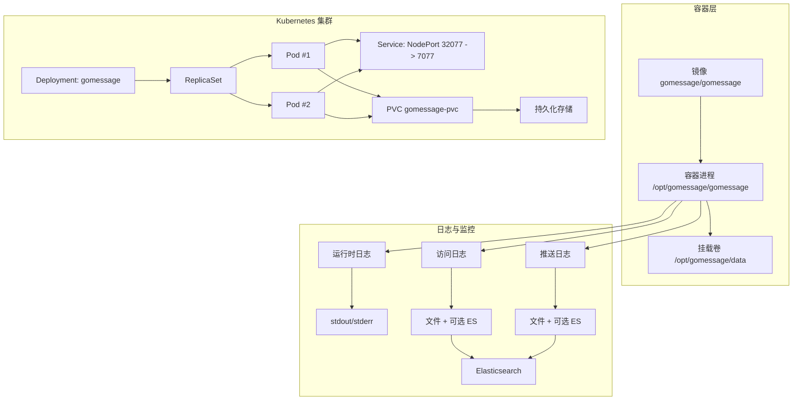
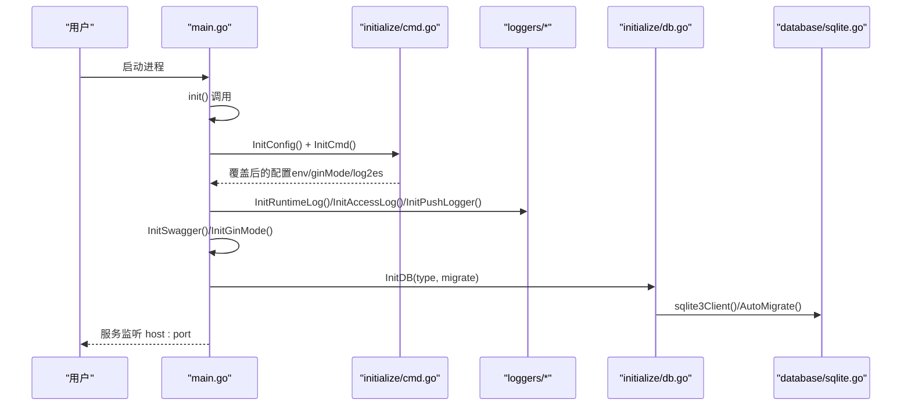
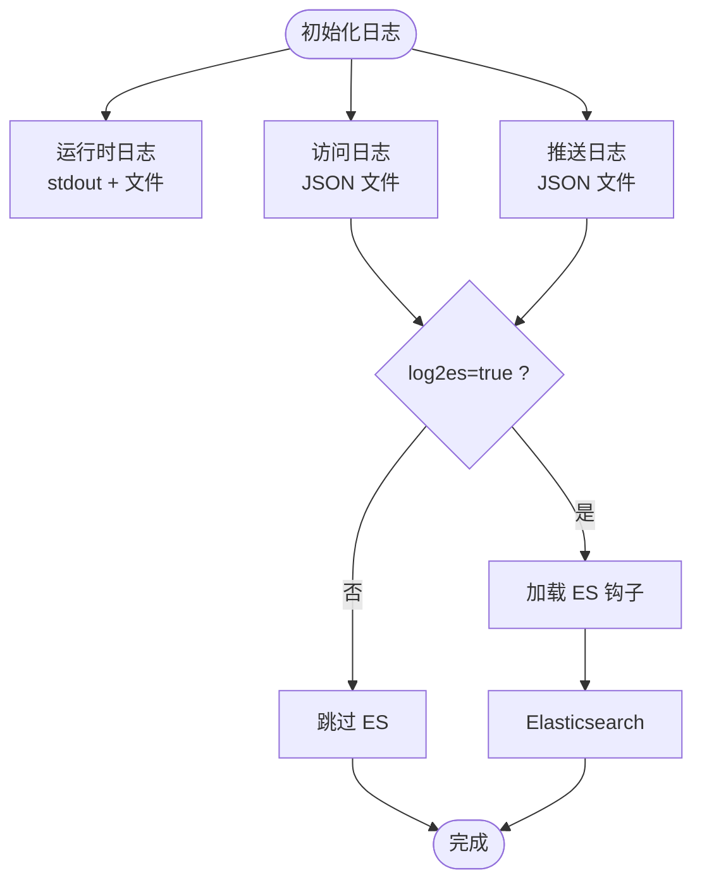
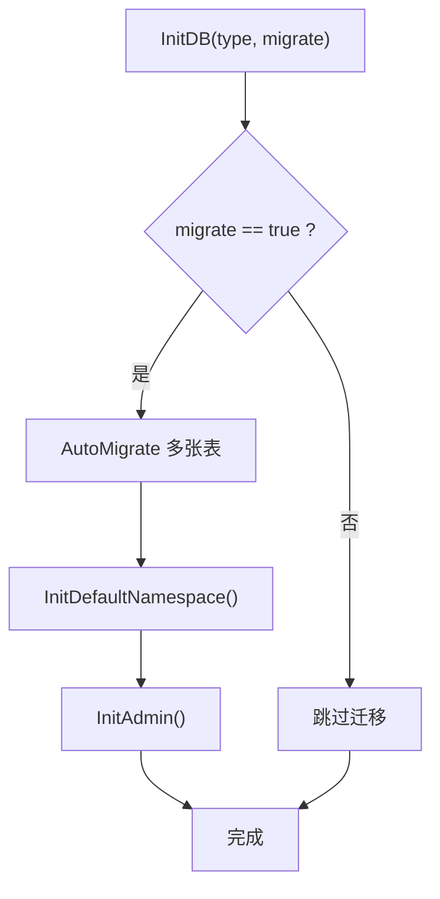
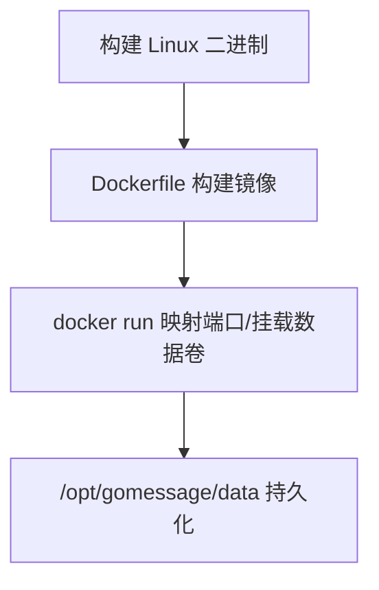
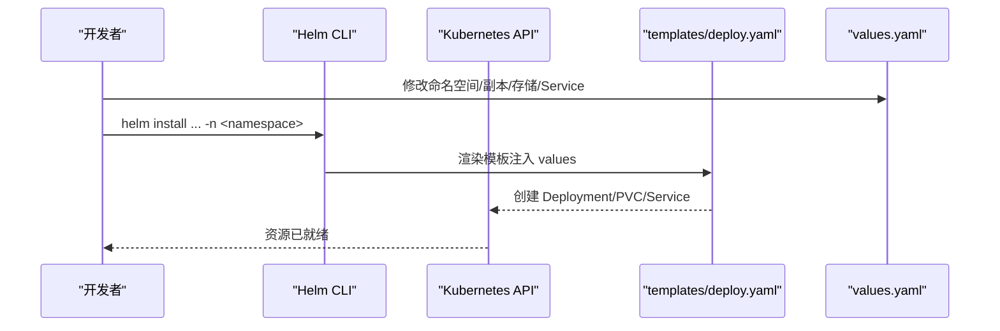
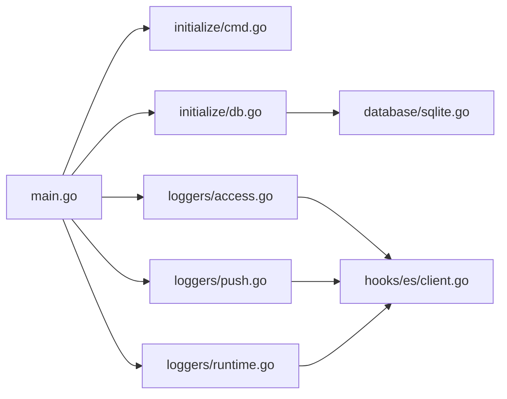

# 部署与运维

<cite>
**本文引用的文件**
- [main.go](file://main.go)
- [config/default.yaml](file://config/default.yaml)
- [pkg/utils/initialize/cmd.go](file://pkg/utils/initialize/cmd.go)
- [pkg/utils/initialize/db.go](file://pkg/utils/initialize/db.go)
- [pkg/utils/database/sqlite.go](file://pkg/utils/database/sqlite.go)
- [pkg/utils/log/loggers/runtime.go](file://pkg/utils/log/loggers/runtime.go)
- [pkg/utils/log/loggers/access.go](file://pkg/utils/log/loggers/access.go)
- [pkg/utils/log/loggers/push.go](file://pkg/utils/log/loggers/push.go)
- [pkg/utils/log/hooks/es/client.go](file://pkg/utils/log/hooks/es/client.go)
- [docker/Dockerfile](file://docker/Dockerfile)
- [docker/Deployment.yaml](file://docker/Deployment.yaml)
- [docker/helm/Chart.yaml](file://docker/helm/Chart.yaml)
- [docker/helm/values.yaml](file://docker/helm/values.yaml)
- [docker/helm/templates/deploy.yaml](file://docker/helm/templates/deploy.yaml)
- [Makefile](file://Makefile)
- [wiki/install_docker.md](file://wiki/install_docker.md)
- [wiki/install_helm.md](file://wiki/install_helm.md)
- [go.mod](file://go.mod)
</cite>

## 目录
1. [简介](#简介)
2. [项目结构](#项目结构)
3. [核心组件](#核心组件)
4. [架构总览](#架构总览)
5. [详细组件分析](#详细组件分析)
6. [依赖分析](#依赖分析)
7. [性能考虑](#性能考虑)
8. [故障排查指南](#故障排查指南)
9. [结论](#结论)
10. [附录](#附录)

## 简介
本指南面向生产环境的部署与运维，覆盖单机容器部署、Kubernetes 集群部署以及 Helm Chart 部署三种方式；提供配置文件说明（数据库、服务、日志、安全等）、容器化流程（镜像构建、容器运行、数据持久化）、Kubernetes 资源定义、监控与日志采集（访问日志、推送日志、运行时日志）、性能调优建议、故障排查方法，以及备份与灾难恢复策略。

## 项目结构
- 服务入口与初始化顺序严格控制，确保配置、命令行参数、日志、数据库、路由等按序启动。
- 配置采用 Viper + 默认 YAML，支持通过命令行参数覆盖。
- 日志系统分为运行时日志、访问日志、推送日志三类，可选投递至 Elasticsearch。
- 数据库默认使用 SQLite3，支持 MySQL（可选）。
- 提供 Dockerfile、Deployment YAML、Helm Chart 与 values，覆盖单容器与集群部署场景。

```mermaid
graph TB
A["main.go<br/>应用入口"] --> B["pkg/utils/initialize/cmd.go<br/>命令行参数解析"]
A --> C["pkg/utils/initialize/db.go<br/>数据库初始化"]
A --> D["pkg/utils/log/loggers/runtime.go<br/>运行时日志"]
A --> E["pkg/utils/log/loggers/access.go<br/>访问日志"]
A --> F["pkg/utils/log/loggers/push.go<br/>推送日志"]
A --> G["config/default.yaml<br/>默认配置"]
A --> H["pkg/utils/database/sqlite.go<br/>SQLite3连接"]
A --> I["pkg/utils/log/hooks/es/client.go<br/>ES客户端"]
J["docker/Dockerfile"] --> K["容器镜像"]
L["docker/Deployment.yaml"] --> M["K8s Deployment/PVC/Service"]
N["docker/helm/Chart.yaml"] --> O["Helm Chart"]
P["docker/helm/values.yaml"] --> Q["Helm Values"]
R["docker/helm/templates/deploy.yaml"] --> M
```

**图示来源**
- [main.go:13-35](file://main.go#L13-L35)
- [pkg/utils/initialize/cmd.go:47-98](file://pkg/utils/initialize/cmd.go#L47-L98)
- [pkg/utils/initialize/db.go:11-48](file://pkg/utils/initialize/db.go#L11-L48)
- [pkg/utils/log/loggers/runtime.go:15-60](file://pkg/utils/log/loggers/runtime.go#L15-L60)
- [pkg/utils/log/loggers/access.go:15-58](file://pkg/utils/log/loggers/access.go#L15-L58)
- [pkg/utils/log/loggers/push.go:15-58](file://pkg/utils/log/loggers/push.go#L15-L58)
- [config/default.yaml:1-83](file://config/default.yaml#L1-L83)
- [pkg/utils/database/sqlite.go:13-47](file://pkg/utils/database/sqlite.go#L13-L47)
- [pkg/utils/log/hooks/es/client.go:22-69](file://pkg/utils/log/hooks/es/client.go#L22-L69)
- [docker/Dockerfile:1-20](file://docker/Dockerfile#L1-L20)
- [docker/Deployment.yaml:1-63](file://docker/Deployment.yaml#L1-L63)
- [docker/helm/Chart.yaml:1-38](file://docker/helm/Chart.yaml#L1-L38)
- [docker/helm/values.yaml:1-19](file://docker/helm/values.yaml#L1-L19)
- [docker/helm/templates/deploy.yaml:1-69](file://docker/helm/templates/deploy.yaml#L1-L69)

**章节来源**
- [main.go:13-35](file://main.go#L13-L35)
- [config/default.yaml:1-83](file://config/default.yaml#L1-L83)

## 核心组件
- 配置与启动参数
  - 默认配置文件提供全局、鉴权、服务、日志、数据库等键位。
  - 命令行参数支持覆盖环境、运行模式、是否迁移数据库、是否投递日志到 ES。
- 日志系统
  - 运行时日志、访问日志、推送日志分别初始化，支持 JSON/文本格式、级别控制、文件落盘与可选 ES 钩子。
- 数据库
  - 默认 SQLite3，支持 MySQL（可选），连接池参数可配置；启动时可执行数据库迁移与默认命名空间/管理员初始化。
- 容器与集群
  - Dockerfile 构建单容器镜像；Deployment YAML 定义副本、PVC、Service（NodePort）；Helm Chart 提供可复用的模板与 values。

**章节来源**
- [config/default.yaml:4-83](file://config/default.yaml#L4-L83)
- [pkg/utils/initialize/cmd.go:47-98](file://pkg/utils/initialize/cmd.go#L47-L98)
- [pkg/utils/log/loggers/runtime.go:15-113](file://pkg/utils/log/loggers/runtime.go#L15-L113)
- [pkg/utils/log/loggers/access.go:15-58](file://pkg/utils/log/loggers/access.go#L15-L58)
- [pkg/utils/log/loggers/push.go:15-58](file://pkg/utils/log/loggers/push.go#L15-L58)
- [pkg/utils/initialize/db.go:11-48](file://pkg/utils/initialize/db.go#L11-L48)
- [pkg/utils/database/sqlite.go:13-47](file://pkg/utils/database/sqlite.go#L13-L47)
- [docker/Dockerfile:1-20](file://docker/Dockerfile#L1-L20)
- [docker/Deployment.yaml:1-63](file://docker/Deployment.yaml#L1-L63)
- [docker/helm/Chart.yaml:1-38](file://docker/helm/Chart.yaml#L1-L38)
- [docker/helm/values.yaml:1-19](file://docker/helm/values.yaml#L1-L19)
- [docker/helm/templates/deploy.yaml:1-69](file://docker/helm/templates/deploy.yaml#L1-L69)

## 架构总览
下图展示从容器到集群的部署视图，以及日志流向 ES 的可选路径。

**图示来源**
- [docker/Dockerfile:1-20](file://docker/Dockerfile#L1-L20)
- [docker/Deployment.yaml:1-63](file://docker/Deployment.yaml#L1-L63)
- [docker/helm/templates/deploy.yaml:1-69](file://docker/helm/templates/deploy.yaml#L1-L69)
- [pkg/utils/log/loggers/runtime.go:15-60](file://pkg/utils/log/loggers/runtime.go#L15-L60)
- [pkg/utils/log/loggers/access.go:15-58](file://pkg/utils/log/loggers/access.go#L15-L58)
- [pkg/utils/log/loggers/push.go:15-58](file://pkg/utils/log/loggers/push.go#L15-L58)
- [pkg/utils/log/hooks/es/client.go:22-69](file://pkg/utils/log/hooks/es/client.go#L22-L69)

## 详细组件分析

### 配置体系与启动流程
- 配置来源与优先级
  - 默认 YAML 文件提供基础键位。
  - 命令行参数覆盖默认配置（如 --env、--ginMode、--log2es）。
  - 环境变量可用于覆盖 ES 地址与凭据（本地开发调试）。
- 启动顺序
  - 初始化配置 → 解析命令行 → 初始化运行时日志 → 初始化访问/推送日志 → Swagger/Gin 模式 → 初始化数据库（可迁移）。

**图示来源**
- [main.go:13-35](file://main.go#L13-L35)
- [pkg/utils/initialize/cmd.go:47-98](file://pkg/utils/initialize/cmd.go#L47-L98)
- [pkg/utils/initialize/db.go:11-48](file://pkg/utils/initialize/db.go#L11-L48)
- [pkg/utils/database/sqlite.go:13-47](file://pkg/utils/database/sqlite.go#L13-L47)
- [pkg/utils/log/loggers/runtime.go:15-60](file://pkg/utils/log/loggers/runtime.go#L15-L60)
- [pkg/utils/log/loggers/access.go:15-58](file://pkg/utils/log/loggers/access.go#L15-L58)
- [pkg/utils/log/loggers/push.go:15-58](file://pkg/utils/log/loggers/push.go#L15-L58)

**章节来源**
- [config/default.yaml:4-83](file://config/default.yaml#L4-L83)
- [pkg/utils/initialize/cmd.go:47-98](file://pkg/utils/initialize/cmd.go#L47-L98)
- [main.go:13-35](file://main.go#L13-L35)

### 日志系统与 ES 投递
- 日志分类
  - 运行时日志：标准输出 + 文件，支持 JSON/文本格式与级别。
  - 访问日志：JSON 格式文件，可选投递 ES。
  - 推送日志：JSON 格式文件，可选投递 ES。
- ES 客户端
  - 支持多 URL、基本认证、健康检查、索引同步。
  - 本地可通过环境变量覆盖 ES 地址与凭据。

**图示来源**
- [pkg/utils/log/loggers/runtime.go:15-113](file://pkg/utils/log/loggers/runtime.go#L15-L113)
- [pkg/utils/log/loggers/access.go:15-58](file://pkg/utils/log/loggers/access.go#L15-L58)
- [pkg/utils/log/loggers/push.go:15-58](file://pkg/utils/log/loggers/push.go#L15-L58)
- [pkg/utils/log/hooks/es/client.go:22-69](file://pkg/utils/log/hooks/es/client.go#L22-L69)

**章节来源**
- [config/default.yaml:25-44](file://config/default.yaml#L25-L44)
- [pkg/utils/log/loggers/runtime.go:15-113](file://pkg/utils/log/loggers/runtime.go#L15-L113)
- [pkg/utils/log/loggers/access.go:15-58](file://pkg/utils/log/loggers/access.go#L15-L58)
- [pkg/utils/log/loggers/push.go:15-58](file://pkg/utils/log/loggers/push.go#L15-L58)
- [pkg/utils/log/hooks/es/client.go:22-69](file://pkg/utils/log/hooks/es/client.go#L22-L69)

### 数据库与迁移
- 默认 SQLite3，路径与连接池参数可配置。
- 启动时可执行数据库迁移，自动创建表结构与默认命名空间、管理员账户。
- 支持切换为 MySQL（需在配置中启用）。

**图示来源**
- [pkg/utils/initialize/db.go:11-48](file://pkg/utils/initialize/db.go#L11-L48)
- [pkg/utils/database/sqlite.go:13-47](file://pkg/utils/database/sqlite.go#L13-L47)

**章节来源**
- [config/default.yaml:46-76](file://config/default.yaml#L46-L76)
- [pkg/utils/initialize/db.go:11-48](file://pkg/utils/initialize/db.go#L11-L48)
- [pkg/utils/database/sqlite.go:13-47](file://pkg/utils/database/sqlite.go#L13-L47)

### 容器化与单容器部署
- 镜像构建
  - 基于 Alpine，创建工作目录与数据目录，拷贝二进制与配置，暴露端口，设置入口。
- 单容器运行
  - 支持前台/后台、重启策略、数据卷挂载持久化。

**图示来源**
- [Makefile:131-146](file://Makefile#L131-L146)
- [docker/Dockerfile:1-20](file://docker/Dockerfile#L1-L20)
- [wiki/install_docker.md:12-57](file://wiki/install_docker.md#L12-L57)

**章节来源**
- [docker/Dockerfile:1-20](file://docker/Dockerfile#L1-L20)
- [Makefile:131-146](file://Makefile#L131-L146)
- [wiki/install_docker.md:12-57](file://wiki/install_docker.md#L12-L57)

### Kubernetes 部署与 Helm Chart
- Deployment
  - 副本数、容器端口、镜像拉取策略、数据卷挂载。
- PVC
  - 请求容量、访问模式（ReadWriteMany）、StorageClass。
- Service
  - NodePort 类型，映射到容器端口。
- Helm Chart
  - Chart.yaml 定义应用版本与关键字；values.yaml 定义命名空间、副本、PVC 存储、Service 端口；templates/deploy.yaml 渲染资源。

**图示来源**
- [docker/helm/Chart.yaml:1-38](file://docker/helm/Chart.yaml#L1-L38)
- [docker/helm/values.yaml:1-19](file://docker/helm/values.yaml#L1-L19)
- [docker/helm/templates/deploy.yaml:1-69](file://docker/helm/templates/deploy.yaml#L1-L69)
- [docker/Deployment.yaml:1-63](file://docker/Deployment.yaml#L1-L63)

**章节来源**
- [docker/helm/Chart.yaml:1-38](file://docker/helm/Chart.yaml#L1-L38)
- [docker/helm/values.yaml:1-19](file://docker/helm/values.yaml#L1-L19)
- [docker/helm/templates/deploy.yaml:1-69](file://docker/helm/templates/deploy.yaml#L1-L69)
- [docker/Deployment.yaml:1-63](file://docker/Deployment.yaml#L1-L63)

## 依赖分析
- 外部依赖
  - Web 框架、配置管理、日志、Swagger、ORM、ES 客户端等。
- 组件耦合
  - main.go 作为入口协调各初始化模块；日志与数据库模块被多处使用；ES 客户端按需加载钩子。

**图示来源**
- [main.go:13-35](file://main.go#L13-L35)
- [pkg/utils/initialize/cmd.go:47-98](file://pkg/utils/initialize/cmd.go#L47-L98)
- [pkg/utils/initialize/db.go:11-48](file://pkg/utils/initialize/db.go#L11-L48)
- [pkg/utils/log/loggers/runtime.go:15-113](file://pkg/utils/log/loggers/runtime.go#L15-L113)
- [pkg/utils/log/loggers/access.go:15-58](file://pkg/utils/log/loggers/access.go#L15-L58)
- [pkg/utils/log/loggers/push.go:15-58](file://pkg/utils/log/loggers/push.go#L15-L58)
- [pkg/utils/database/sqlite.go:13-47](file://pkg/utils/database/sqlite.go#L13-L47)
- [pkg/utils/log/hooks/es/client.go:22-69](file://pkg/utils/log/hooks/es/client.go#L22-L69)

**章节来源**
- [go.mod:5-21](file://go.mod#L5-L21)

## 性能考虑
- 日志
  - 运行时日志默认关闭文件行号以减少开销；访问/推送日志使用 JSON 格式便于结构化采集。
  - ES 投递为可选，生产建议仅在必要时开启，避免写放大。
- 数据库
  - SQLite3 默认连接池参数可按并发与磁盘性能调优；如需高并发可评估 MySQL 并优化连接池。
- 容器与集群
  - Deployment 副本数按流量与可用性需求配置；PVC 容量与 StorageClass 选择需匹配业务数据增长预期。
  - Service 使用 NodePort 便于测试，生产建议使用 Ingress + TLS。

[本节为通用建议，无需特定文件引用]

## 故障排查指南
- 启动失败
  - 检查命令行参数（--env、--ginMode、--migrate、--log2es）是否正确。
  - 查看运行时日志输出与文件落盘情况。
- 数据库问题
  - 确认数据库类型与路径配置；如启用迁移，观察表结构迁移日志。
- 日志无法写入 ES
  - 检查 log2es 开关与 ES 地址、凭据；确认网络连通与索引创建。
- 容器/集群异常
  - 查看 Pod 日志与事件；确认 PVC 是否绑定成功；确认 Service 端口映射与 NodePort 可达。

**章节来源**
- [pkg/utils/initialize/cmd.go:47-98](file://pkg/utils/initialize/cmd.go#L47-L98)
- [pkg/utils/initialize/db.go:11-48](file://pkg/utils/initialize/db.go#L11-L48)
- [pkg/utils/log/loggers/runtime.go:15-113](file://pkg/utils/log/loggers/runtime.go#L15-L113)
- [pkg/utils/log/hooks/es/client.go:22-69](file://pkg/utils/log/hooks/es/client.go#L22-L69)
- [docker/Deployment.yaml:1-63](file://docker/Deployment.yaml#L1-L63)

## 结论
本指南提供了从单容器到 Kubernetes 集群的完整部署路径，结合配置、日志、数据库与 Helm Chart 的使用，帮助在不同规模环境中稳定运行。建议在生产中启用数据持久化、合理配置副本与存储、按需开启日志 ES 投递，并建立完善的监控与备份策略。

[本节为总结，无需特定文件引用]

## 附录

### A. 生产环境部署方式与要点
- Docker 单容器
  - 使用官方镜像，映射端口与数据卷，设置重启策略保证稳定性。
- Kubernetes 集群
  - 使用 Helm Chart 或原生 YAML；配置副本、PVC、Service；生产建议使用 Ingress。
- Helm Chart
  - 自定义 values 中的命名空间、副本、存储容量与节点端口；发布后验证资源状态。

**章节来源**
- [wiki/install_docker.md:12-57](file://wiki/install_docker.md#L12-L57)
- [wiki/install_helm.md:13-36](file://wiki/install_helm.md#L13-L36)
- [docker/helm/values.yaml:1-19](file://docker/helm/values.yaml#L1-L19)
- [docker/helm/templates/deploy.yaml:1-69](file://docker/helm/templates/deploy.yaml#L1-L69)
- [docker/Deployment.yaml:1-63](file://docker/Deployment.yaml#L1-L63)

### B. 配置文件说明（关键键位）
- 全局
  - global.env：运行环境（dev/fat/pro）
  - global.ginMode：运行模式（debug/test/release）
- 鉴权
  - auth.jwtKey：JWT 密钥（生产必须修改）
- 服务
  - service.host/port：监听地址与端口
- 日志
  - log.level/format：日志级别与格式
  - log.runtimeLogFile/accessLogFile/pushLogFile：日志文件路径
  - log.log2es 与 log.es.*：ES 开关与连接参数
- 数据库
  - databaseType：sqlite3 或 mysql
  - sqlite3.path/MaxIdleConns/MaxOpenConns：SQLite3 路径与连接池
  - mysql.*：MySQL 连接参数（可选）

**章节来源**
- [config/default.yaml:4-83](file://config/default.yaml#L4-L83)

### C. 命令行参数速查
- --env/-e：运行环境
- --ginMode/-g：Gin 运行模式
- --migrate/-m：是否迁移数据库
- --log2es/-l：是否投递日志到 ES

**章节来源**
- [pkg/utils/initialize/cmd.go:56-59](file://pkg/utils/initialize/cmd.go#L56-L59)

### D. 监控与日志采集建议
- 运行时日志：采集 stdout/stderr，结合文件日志进行聚合。
- 访问日志与推送日志：建议统一写入 JSON 文件，配合 Filebeat/Fluent Bit 采集至 ELK。
- ES：仅在需要结构化检索与分析时启用，注意索引生命周期与资源配额。

**章节来源**
- [pkg/utils/log/loggers/runtime.go:15-113](file://pkg/utils/log/loggers/runtime.go#L15-L113)
- [pkg/utils/log/loggers/access.go:15-58](file://pkg/utils/log/loggers/access.go#L15-L58)
- [pkg/utils/log/loggers/push.go:15-58](file://pkg/utils/log/loggers/push.go#L15-L58)
- [pkg/utils/log/hooks/es/client.go:22-69](file://pkg/utils/log/hooks/es/client.go#L22-L69)

### E. 备份与灾难恢复
- 备份
  - 定期备份 /opt/gomessage/data 下的 SQLite3 数据库文件与配置。
  - 如启用 ES，备份索引快照或导出策略。
- 恢复
  - 停止服务后替换数据文件，重新启动；验证数据库迁移与默认命名空间/管理员是否存在。
  - 集群场景：恢复 PVC/快照后重建 Pod，确认数据挂载与权限。

**章节来源**
- [pkg/utils/database/sqlite.go:18-26](file://pkg/utils/database/sqlite.go#L18-L26)
- [pkg/utils/initialize/db.go:42-47](file://pkg/utils/initialize/db.go#L42-L47)