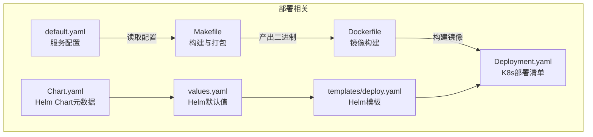
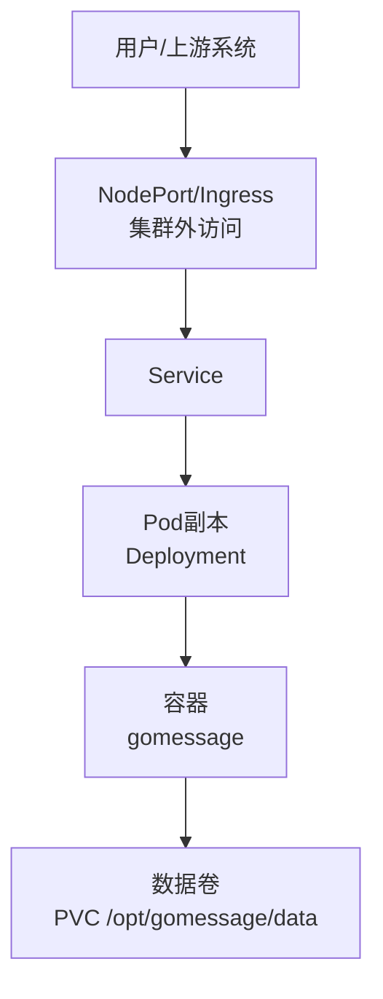
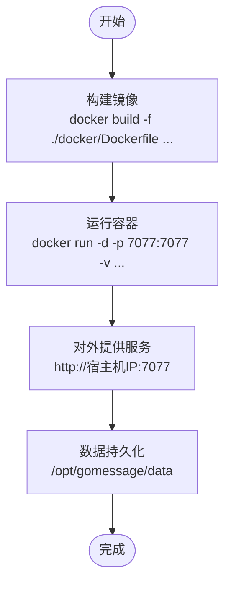
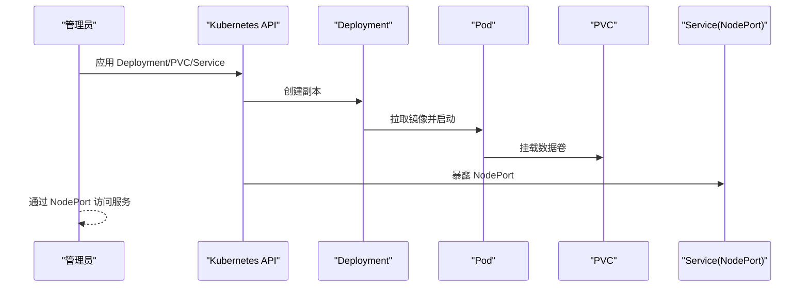
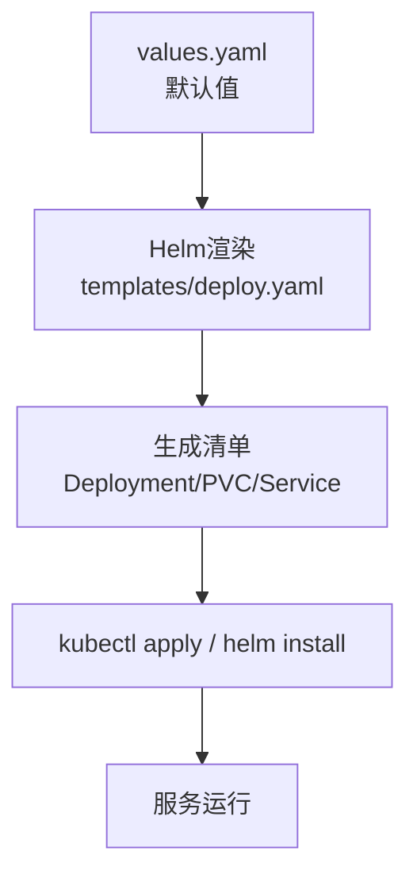
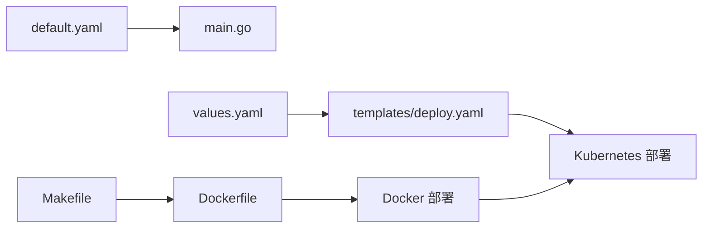

# 部署方式

<cite>
**本文引用的文件**
- [Dockerfile](file://docker/Dockerfile)
- [Deployment.yaml](file://docker/Deployment.yaml)
- [Chart.yaml](file://docker/helm/Chart.yaml)
- [values.yaml](file://docker/helm/values.yaml)
- [deploy.yaml](file://docker/helm/templates/deploy.yaml)
- [default.yaml](file://config/default.yaml)
- [main.go](file://main.go)
- [install_docker.md](file://wiki/install_docker.md)
- [install_helm.md](file://wiki/install_helm.md)
- [install_linux.md](file://wiki/install_linux.md)
- [install_yaml.md](file://wiki/install_yaml.md)
- [Makefile](file://Makefile)
- [README.md](file://README.md)
</cite>

## 目录
1. [简介](#简介)
2. [项目结构](#项目结构)
3. [核心组件](#核心组件)
4. [架构总览](#架构总览)
5. [详细组件分析](#详细组件分析)
6. [依赖分析](#依赖分析)
7. [性能考虑](#性能考虑)
8. [故障排查指南](#故障排查指南)
9. [结论](#结论)
10. [附录](#附录)

## 简介
本指南面向运维与开发人员，提供三种主流部署方式的完整实践：Docker 单容器部署、Kubernetes 集群部署、Helm Chart 部署。内容涵盖构建流程、镜像制作、容器运行参数、端口映射、数据持久化、Kubernetes 资源清单、滚动更新策略、Helm Chart 的版本管理与自定义配置等，并给出每种方式的命令示例与配置模板路径，帮助快速、安全、稳定地将服务上线。

## 项目结构
围绕部署相关的关键文件组织如下：
- Docker 镜像与单容器运行：Dockerfile、运行示例文档
- Kubernetes 部署：Deployment.yaml（含 PVC 与 Service）、原生 YAML 部署说明
- Helm Chart：Chart.yaml、values.yaml、模板 deploy.yaml
- 服务配置与启动：default.yaml、main.go
- 构建与打包：Makefile
- 项目总览与安装入口：README.md

图表来源
- [Dockerfile:1-20](file://docker/Dockerfile#L1-L20)
- [Deployment.yaml:1-63](file://docker/Deployment.yaml#L1-L63)
- [Chart.yaml:1-38](file://docker/helm/Chart.yaml#L1-L38)
- [values.yaml:1-19](file://docker/helm/values.yaml#L1-L19)
- [deploy.yaml:1-69](file://docker/helm/templates/deploy.yaml#L1-L69)
- [default.yaml:1-83](file://config/default.yaml#L1-L83)
- [Makefile:1-217](file://Makefile#L1-L217)

章节来源
- [Dockerfile:1-20](file://docker/Dockerfile#L1-L20)
- [Deployment.yaml:1-63](file://docker/Deployment.yaml#L1-L63)
- [Chart.yaml:1-38](file://docker/helm/Chart.yaml#L1-L38)
- [values.yaml:1-19](file://docker/helm/values.yaml#L1-L19)
- [deploy.yaml:1-69](file://docker/helm/templates/deploy.yaml#L1-L69)
- [default.yaml:1-83](file://config/default.yaml#L1-L83)
- [Makefile:1-217](file://Makefile#L1-L217)
- [README.md:78-86](file://README.md#L78-L86)

## 核心组件
- 服务监听与端口
  - 默认监听地址与端口来源于配置文件，服务启动时从配置读取 host 与 port 并绑定监听。
- Docker 镜像
  - 基于 Alpine，暴露服务端口，容器入口为二进制可执行文件。
- Kubernetes 资源
  - Deployment、PVC、Service（NodePort）三件套，支持数据持久化与集群外访问。
- Helm Chart
  - 提供 Chart 元数据、默认 values 与模板渲染，便于参数化部署。

章节来源
- [default.yaml:19-22](file://config/default.yaml#L19-L22)
- [main.go:48-54](file://main.go#L48-L54)
- [Dockerfile:7-19](file://docker/Dockerfile#L7-L19)
- [Deployment.yaml:10-31](file://docker/Deployment.yaml#L10-L31)
- [Chart.yaml:1-38](file://docker/helm/Chart.yaml#L1-L38)
- [values.yaml:5-16](file://docker/helm/values.yaml#L5-L16)
- [deploy.yaml:10-34](file://docker/helm/templates/deploy.yaml#L10-L34)

## 架构总览
三种部署方式的总体交互如下：

图表来源
- [Deployment.yaml:47-63](file://docker/Deployment.yaml#L47-L63)
- [deploy.yaml:53-69](file://docker/helm/templates/deploy.yaml#L53-L69)

## 详细组件分析

### Docker 单容器部署
- 构建过程
  - 基于 Alpine 镜像，创建工作目录与数据目录，拷贝应用内容，暴露服务端口，设置容器入口为二进制可执行文件。
- 镜像制作
  - 通过 Makefile 的 docker 目标，使用 Dockerfile 构建 latest 与指定版本镜像。
- 容器运行参数
  - 端口映射：将宿主 7077 映射到容器 7077
  - 数据卷挂载：将宿主目录挂载到 /opt/gomessage/data，实现数据持久化
  - 重启策略：建议使用 always，确保服务稳定
- 命令示例与模板
  - 参考安装文档中的命令示例与说明
- 环境要求
  - 已安装 Docker，具备网络访问能力
- 网络配置
  - 通过 -p 7077:7077 实现端口映射；若需集群外访问，可结合 NodePort 或 Ingress

图表来源
- [Dockerfile:7-19](file://docker/Dockerfile#L7-L19)
- [Makefile:158-168](file://Makefile#L158-L168)
- [install_docker.md:1-58](file://wiki/install_docker.md#L1-L58)

章节来源
- [Dockerfile:1-20](file://docker/Dockerfile#L1-L20)
- [Makefile:158-168](file://Makefile#L158-L168)
- [install_docker.md:1-58](file://wiki/install_docker.md#L1-L58)
- [default.yaml:19-22](file://config/default.yaml#L19-L22)
- [main.go:48-54](file://main.go#L48-L54)

### Kubernetes 集群部署
- 资源清单说明
  - Deployment：定义副本数、容器镜像、端口、数据卷挂载
  - PersistentVolumeClaim：申请持久化存储，支持 ReadWriteMany
  - Service：NodePort 类型，将集群内部端口暴露到外部
- 关键参数
  - 副本数：根据负载与高可用需求设置
  - 存储：PVC 请求容量与存储类
  - 端口：Service 的 port/targetPort/nodePort
- 命令示例与模板
  - 参考安装文档中的命令示例与说明
- 环境要求
  - 已有可用的 Kubernetes 集群，具备 PVC 动态供应能力或预置的存储类
- 网络配置
  - NodePort 方式通过 nodePort 暴露服务；也可结合 Ingress 实现域名访问

图表来源
- [Deployment.yaml:1-63](file://docker/Deployment.yaml#L1-L63)

章节来源
- [Deployment.yaml:1-63](file://docker/Deployment.yaml#L1-L63)
- [install_yaml.md:1-117](file://wiki/install_yaml.md#L1-L117)

### Helm Chart 部署
- Chart 元数据
  - Chart.yaml 包含 Chart 名称、版本、应用版本、类型、关键字、维护者等
- 默认值
  - values.yaml 定义命名空间、副本数、PVC 容量与存储类、Service 端口与 NodePort 等
- 模板渲染
  - templates/deploy.yaml 使用 values 中的参数渲染最终的 Deployment/PVC/Service
- 命令示例与模板
  - 参考安装文档中的 Helm 命令与参数说明
- 环境要求
  - 已安装 Helm，集群版本满足 Chart 要求（参考安装文档提示）
- 版本管理
  - 通过 Chart.yaml 的 version/appVersion 字段管理 Chart 与应用版本

图表来源
- [Chart.yaml:1-38](file://docker/helm/Chart.yaml#L1-L38)
- [values.yaml:1-19](file://docker/helm/values.yaml#L1-L19)
- [deploy.yaml:1-69](file://docker/helm/templates/deploy.yaml#L1-L69)

章节来源
- [Chart.yaml:1-38](file://docker/helm/Chart.yaml#L1-L38)
- [values.yaml:1-19](file://docker/helm/values.yaml#L1-L19)
- [deploy.yaml:1-69](file://docker/helm/templates/deploy.yaml#L1-L69)
- [install_helm.md:1-36](file://wiki/install_helm.md#L1-L36)

## 依赖分析
- 配置依赖
  - 服务监听地址与端口来自配置文件，启动时读取并绑定
- 构建依赖
  - Makefile 负责依赖处理、编译、打包与镜像构建
- 部署依赖
  - Docker 部署依赖 Docker 环境；Kubernetes 部署依赖集群与存储类；Helm 部署依赖 Helm 与 Chart 仓库

图表来源
- [default.yaml:19-22](file://config/default.yaml#L19-L22)
- [main.go:48-54](file://main.go#L48-L54)
- [Makefile:158-168](file://Makefile#L158-L168)
- [Dockerfile:7-19](file://docker/Dockerfile#L7-L19)
- [values.yaml:5-16](file://docker/helm/values.yaml#L5-L16)
- [deploy.yaml:10-34](file://docker/helm/templates/deploy.yaml#L10-L34)

章节来源
- [default.yaml:19-22](file://config/default.yaml#L19-L22)
- [main.go:48-54](file://main.go#L48-L54)
- [Makefile:158-168](file://Makefile#L158-L168)
- [Dockerfile:7-19](file://docker/Dockerfile#L7-L19)
- [values.yaml:5-16](file://docker/helm/values.yaml#L5-L16)
- [deploy.yaml:10-34](file://docker/helm/templates/deploy.yaml#L10-L34)

## 性能考虑
- 资源规划
  - 根据业务流量与并发需求合理设置副本数与 CPU/内存请求/限制
- 存储
  - PVC 容量与存储类应满足数据增长预期，避免因存储不足导致服务异常
- 网络
  - NodePort 仅适用于开发/测试场景；生产建议使用 Ingress + TLS 终止
- 镜像
  - 使用精简基础镜像（如 Alpine）降低镜像体积与启动时间
- 更新策略
  - Kubernetes 使用滚动更新策略，确保更新期间服务不中断

## 故障排查指南
- 服务无法访问
  - 检查端口映射与防火墙策略（Docker）或 Service/Ingress 配置（Kubernetes）
- 数据丢失或异常
  - 确认数据卷挂载路径与 PVC 是否正确绑定
- 镜像拉取失败
  - 检查镜像仓库可达性与认证配置
- Helm 安装失败
  - 检查集群版本与 Chart 兼容性，确认仓库地址与索引更新

章节来源
- [install_docker.md:1-58](file://wiki/install_docker.md#L1-L58)
- [install_yaml.md:1-117](file://wiki/install_yaml.md#L1-L117)
- [install_helm.md:1-36](file://wiki/install_helm.md#L1-L36)

## 结论
三种部署方式各有侧重：Docker 适合单机或小型环境；Kubernetes 适合需要弹性伸缩与高可用的生产环境；Helm Chart 适合标准化、可复用的集群交付。结合本文提供的命令示例、配置模板与最佳实践，可快速完成部署并保障服务稳定运行。

## 附录
- 部署前准备
  - Docker 环境（Docker 部署）
  - Kubernetes 集群与存储类（Kubernetes/Helm 部署）
  - Helm 工具与 Chart 仓库（Helm 部署）
- 环境要求
  - 网络连通性、DNS 解析、防火墙放行
- 网络配置
  - NodePort/Ingress、域名解析、TLS 终止（生产建议）

章节来源
- [install_docker.md:1-58](file://wiki/install_docker.md#L1-L58)
- [install_yaml.md:1-117](file://wiki/install_yaml.md#L1-L117)
- [install_helm.md:1-36](file://wiki/install_helm.md#L1-L36)
- [README.md:78-86](file://README.md#L78-L86)