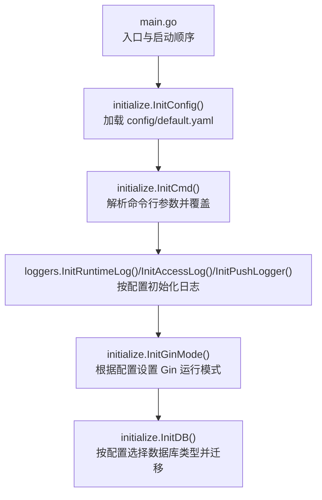
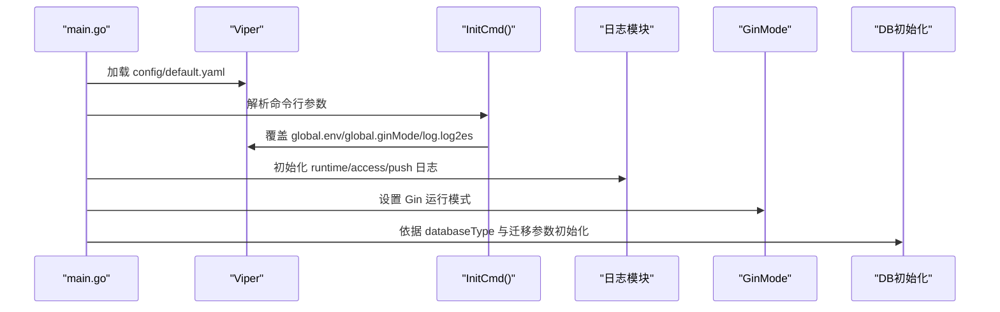
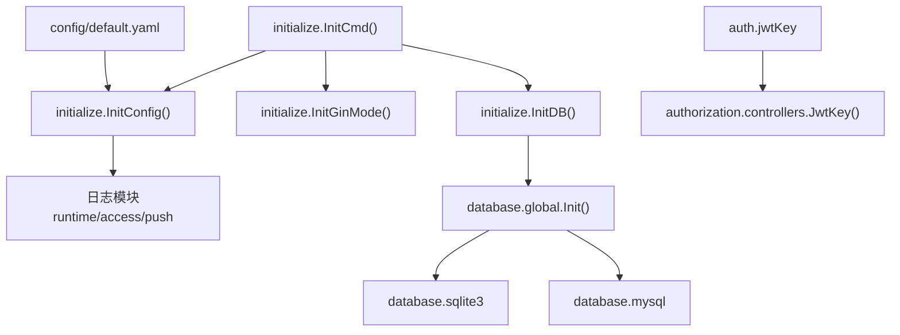

# 配置管理

<cite>
**本文引用的文件**
- [config/default.yaml](file://config/default.yaml)
- [main.go](file://main.go)
- [pkg/utils/initialize/config.go](file://pkg/utils/initialize/config.go)
- [pkg/utils/initialize/cmd.go](file://pkg/utils/initialize/cmd.go)
- [pkg/utils/initialize/mode.go](file://pkg/utils/initialize/mode.go)
- [pkg/utils/initialize/db.go](file://pkg/utils/initialize/db.go)
- [pkg/utils/database/global.go](file://pkg/utils/database/global.go)
- [pkg/utils/database/sqlite.go](file://pkg/utils/database/sqlite.go)
- [pkg/utils/database/mysql.go](file://pkg/utils/database/mysql.go)
- [pkg/utils/log/loggers/runtime.go](file://pkg/utils/log/loggers/runtime.go)
- [pkg/utils/log/loggers/access.go](file://pkg/utils/log/loggers/access.go)
- [pkg/utils/log/loggers/push.go](file://pkg/utils/log/loggers/push.go)
- [pkg/utils/log/hooks/es/hookPush.go](file://pkg/utils/log/hooks/es/hookPush.go)
- [pkg/authorization/controllers.go](file://pkg/authorization/controllers.go)
- [pkg/services/core/v1/push.go](file://pkg/services/core/v1/push.go)
- [docker/Dockerfile](file://docker/Dockerfile)
- [docker/helm/values.yaml](file://docker/helm/values.yaml)
</cite>

## 目录
1. [简介](#简介)
2. [项目结构](#项目结构)
3. [核心组件](#核心组件)
4. [架构总览](#架构总览)
5. [详细组件分析](#详细组件分析)
6. [依赖分析](#依赖分析)
7. [性能考量](#性能考量)
8. [故障排查指南](#故障排查指南)
9. [结论](#结论)
10. [附录](#附录)

## 简介
本指南面向运维与开发人员，系统性讲解本项目的配置管理方案。重点覆盖以下方面：
- 配置文件作用与配置项说明（config/default.yaml）
- 配置加载顺序与优先级
- 不同环境下的配置示例（开发、测试、生产）
- 配置热更新机制与配置验证方法
- 安全注意事项与最佳实践
- 常见配置问题与解决方案

## 项目结构
项目采用“配置文件 + 启动参数覆盖”的双层配置体系，配合 Viper 进行统一读取与默认值注入。启动流程严格规定初始化顺序，以保证配置在各模块初始化前已就绪。

图表来源
- [main.go:13-35](file://main.go#L13-L35)
- [pkg/utils/initialize/config.go:10-50](file://pkg/utils/initialize/config.go#L10-L50)
- [pkg/utils/initialize/cmd.go:46-98](file://pkg/utils/initialize/cmd.go#L46-L98)
- [pkg/utils/initialize/mode.go:9-28](file://pkg/utils/initialize/mode.go#L9-L28)
- [pkg/utils/initialize/db.go:11-19](file://pkg/utils/initialize/db.go#L11-L19)

章节来源
- [main.go:13-35](file://main.go#L13-L35)
- [pkg/utils/initialize/config.go:10-50](file://pkg/utils/initialize/config.go#L10-L50)
- [pkg/utils/initialize/cmd.go:46-98](file://pkg/utils/initialize/cmd.go#L46-L98)

## 核心组件
- 配置文件：config/default.yaml 提供默认配置，涵盖全局、服务、日志、数据库、鉴权等段落。
- 初始化顺序：main.go 中严格定义 InitConfig → InitCmd → 日志初始化 → Swagger/GinMode → DB 初始化。
- 命令行覆盖：通过 pflag 解析 --env/--ginMode/--migrate/--log2es 等参数，优先级最高。
- 默认值兜底：未在配置文件中设置的键，将由 setDefaultBaseConfig 注入默认值，配置文件优先级更高。

章节来源
- [config/default.yaml:1-83](file://config/default.yaml#L1-L83)
- [pkg/utils/initialize/config.go:52-76](file://pkg/utils/initialize/config.go#L52-L76)
- [pkg/utils/initialize/cmd.go:46-98](file://pkg/utils/initialize/cmd.go#L46-L98)
- [main.go:13-35](file://main.go#L13-L35)

## 架构总览
配置在启动阶段的流转如下：

图表来源
- [main.go:13-35](file://main.go#L13-L35)
- [pkg/utils/initialize/config.go:10-50](file://pkg/utils/initialize/config.go#L10-L50)
- [pkg/utils/initialize/cmd.go:46-98](file://pkg/utils/initialize/cmd.go#L46-L98)
- [pkg/utils/initialize/mode.go:9-28](file://pkg/utils/initialize/mode.go#L9-L28)
- [pkg/utils/initialize/db.go:11-19](file://pkg/utils/initialize/db.go#L11-L19)

## 详细组件分析

### 配置文件：config/default.yaml
- 全局配置（global）
  - env：当前运行环境（第二优先级，若命令行未指定 --env 则生效）
  - ginMode：Gin 运行模式（debug/test/release）
- 鉴权配置（auth）
  - jwtKey：JWT 密钥（生产环境必须修改为随机字符串）
- 服务配置（service）
  - host/port：服务监听地址与端口
- 日志配置（log）
  - level：日志级别（debug/info）
  - format：日志格式（json/text）
  - runtimeLogFile/accessLogFile/pushLogFile：三类日志文件路径
  - log2es：是否投递日志到 Elasticsearch
  - es：当 log2es=true 时生效，包含用户名、密码、urls
- 数据库配置
  - databaseType：数据库类型（sqlite3/mysql）
  - sqlite3：sqlite3 路径与连接池参数
  - mysql：MySQL 主机、端口、库名、用户名、密码、options（注释示例）

章节来源
- [config/default.yaml:1-83](file://config/default.yaml#L1-L83)

### 配置加载顺序与优先级
- 加载顺序
  1) InitConfig：读取 config/default.yaml
  2) InitCmd：解析命令行参数并覆盖部分键
  3) 日志初始化：按配置初始化 runtime/access/push 日志
  4) InitGinMode：设置 Gin 运行模式
  5) InitDB：按 databaseType 与迁移参数初始化数据库
- 优先级（从高到低）
  1) 命令行参数（--env/--ginMode/--migrate/--log2es）
  2) 配置文件（config/default.yaml）
  3) 默认值（setDefaultBaseConfig）

章节来源
- [main.go:13-35](file://main.go#L13-L35)
- [pkg/utils/initialize/config.go:10-50](file://pkg/utils/initialize/config.go#L10-L50)
- [pkg/utils/initialize/cmd.go:46-98](file://pkg/utils/initialize/cmd.go#L46-L98)
- [pkg/utils/initialize/mode.go:9-28](file://pkg/utils/initialize/mode.go#L9-L28)
- [pkg/utils/initialize/db.go:11-19](file://pkg/utils/initialize/db.go#L11-L19)

### 不同环境下的配置示例
- 开发环境（dev）
  - global.env=dev
  - global.ginMode=debug 或 release（按需）
  - log.level=debug（便于调试）
  - log.log2es=false（本地开发建议关闭）
  - databaseType=sqlite3（默认）
- 测试环境（fat）
  - global.env=fat
  - global.ginMode=release
  - log.level=info
  - log.log2es=false
  - databaseType=sqlite3 或 mysql（按需）
- 生产环境（pro）
  - global.env=pro
  - global.ginMode=release
  - log.level=info
  - log.log2es=true（如需集中日志）
  - databaseType=sqlite3（推荐）
  - auth.jwtKey=强随机字符串（必须修改）

章节来源
- [config/default.yaml:4-6](file://config/default.yaml#L4-L6)
- [config/default.yaml:27-38](file://config/default.yaml#L27-L38)
- [config/default.yaml:46-52](file://config/default.yaml#L46-L52)
- [config/default.yaml:11-13](file://config/default.yaml#L11-L13)
- [pkg/utils/initialize/config.go:60-76](file://pkg/utils/initialize/config.go#L60-L76)

### 配置热更新机制与验证
- 热更新机制
  - 本项目未实现配置热重载。任何配置变更（如数据库、日志、ES、JWT 密钥）均需重启进程以使新配置生效。
- 配置验证
  - 命令行参数校验：InitCmd 对 --env 做白名单校验（dev/fat/pro），非法值直接退出。
  - 默认值兜底：setDefaultBaseConfig 为缺失键提供默认值，避免运行时因缺省导致异常。
  - 日志与数据库初始化：按配置创建目录/文件与连接池，失败时直接退出，尽早暴露问题。

章节来源
- [pkg/utils/initialize/cmd.go:21-34](file://pkg/utils/initialize/cmd.go#L21-L34)
- [pkg/utils/initialize/config.go:52-76](file://pkg/utils/initialize/config.go#L52-L76)
- [pkg/utils/log/loggers/runtime.go:15-60](file://pkg/utils/log/loggers/runtime.go#L15-L60)
- [pkg/utils/database/sqlite.go:17-47](file://pkg/utils/database/sqlite.go#L17-L47)

### 安全配置与最佳实践
- JWT 密钥
  - 必须在生产环境修改为强随机字符串，避免使用默认值。
- 日志投递至 ES
  - 仅在需要集中日志时启用 log2es；生产环境建议谨慎开启，避免敏感信息泄露。
- 数据库选择
  - 推荐 sqlite3，因其仅存储少量元数据，性能与维护成本更低。
- 端口与访问
  - 服务默认监听 7077 端口，容器镜像已暴露该端口；生产部署建议通过反向代理与网络策略限制访问。

章节来源
- [config/default.yaml:11-13](file://config/default.yaml#L11-L13)
- [config/default.yaml:38-44](file://config/default.yaml#L38-L44)
- [config/default.yaml:46-52](file://config/default.yaml#L46-L52)
- [docker/Dockerfile:17-19](file://docker/Dockerfile#L17-L19)

### 消息推送配置（平台参数与重试策略）
- 平台参数
  - 平台参数由业务模型与渲染层决定，配置文件中未直接定义平台参数键。实际推送时，消息体由渲染与组装逻辑生成，最终通过 HTTP 推送。
- 重试策略
  - 本项目未内置重试机制。如需重试，可在上游调用侧或网关层实现。

章节来源
- [pkg/services/core/v1/push.go:14-56](file://pkg/services/core/v1/push.go#L14-L56)

## 依赖分析
配置相关模块之间的耦合关系如下：

图表来源
- [config/default.yaml:1-83](file://config/default.yaml#L1-L83)
- [pkg/utils/initialize/config.go:10-50](file://pkg/utils/initialize/config.go#L10-L50)
- [pkg/utils/initialize/cmd.go:46-98](file://pkg/utils/initialize/cmd.go#L46-L98)
- [pkg/utils/initialize/mode.go:9-28](file://pkg/utils/initialize/mode.go#L9-L28)
- [pkg/utils/initialize/db.go:11-19](file://pkg/utils/initialize/db.go#L11-L19)
- [pkg/utils/database/global.go:14-35](file://pkg/utils/database/global.go#L14-L35)
- [pkg/utils/database/sqlite.go:17-47](file://pkg/utils/database/sqlite.go#L17-L47)
- [pkg/utils/database/mysql.go:24-52](file://pkg/utils/database/mysql.go#L24-L52)
- [pkg/authorization/controllers.go:10-12](file://pkg/authorization/controllers.go#L10-L12)

章节来源
- [pkg/utils/database/global.go:14-35](file://pkg/utils/database/global.go#L14-L35)
- [pkg/utils/database/sqlite.go:17-47](file://pkg/utils/database/sqlite.go#L17-L47)
- [pkg/utils/database/mysql.go:24-52](file://pkg/utils/database/mysql.go#L24-L52)
- [pkg/authorization/controllers.go:10-12](file://pkg/authorization/controllers.go#L10-L12)

## 性能考量
- 日志
  - JSON 格式利于结构化日志采集；文本格式更易人工阅读。
  - 关闭 log2es 可降低网络与 ES 压力；开启时注意 ES 连接与索引策略。
- 数据库
  - sqlite3 默认连接池参数适于小规模场景；如需更高吞吐，可结合 MySQL 并调整连接池参数。
- Gin 运行模式
  - release 模式关闭调试信息，提升运行效率。

章节来源
- [config/default.yaml:27-38](file://config/default.yaml#L27-L38)
- [config/default.yaml:58-61](file://config/default.yaml#L58-L61)
- [pkg/utils/database/mysql.go:44-49](file://pkg/utils/database/mysql.go#L44-L49)
- [pkg/utils/initialize/mode.go:9-28](file://pkg/utils/initialize/mode.go#L9-L28)

## 故障排查指南
- 启动失败：基础配置文件读取失败
  - 现象：启动时报基础配置文件读取失败并退出
  - 处理：检查 config/default.yaml 路径与权限，确认文件存在且可读
- --env 参数错误
  - 现象：--env 非 dev/fat/pro 时直接退出
  - 处理：修正 --env 值或在配置文件中设置 global.env
- 日志目录/文件创建失败
  - 现象：初始化日志时报目录或文件创建失败并退出
  - 处理：确认日志路径权限与父目录存在，必要时手动创建
- 数据库连接失败
  - 现象：数据库初始化失败
  - 处理：核对 databaseType 与对应数据库配置；确认数据库可达与凭据正确
- JWT 密钥未修改
  - 现象：生产环境仍使用默认密钥
  - 处理：在 config/default.yaml 中替换 auth.jwtKey 为强随机字符串

章节来源
- [pkg/utils/initialize/config.go:18-24](file://pkg/utils/initialize/config.go#L18-L24)
- [pkg/utils/initialize/cmd.go:30-34](file://pkg/utils/initialize/cmd.go#L30-L34)
- [pkg/utils/log/loggers/runtime.go:21-32](file://pkg/utils/log/loggers/runtime.go#L21-L32)
- [pkg/utils/database/global.go:14-35](file://pkg/utils/database/global.go#L14-L35)
- [config/default.yaml:11-13](file://config/default.yaml#L11-L13)

## 结论
本项目的配置管理以 Viper 为核心，通过“配置文件 + 命令行参数”的双层机制实现灵活的环境适配。严格的启动顺序与默认值兜底保障了启动稳定性；未实现配置热重载，生产变更需重启生效。建议在生产环境务必修改 JWT 密钥、合理选择数据库类型、谨慎启用日志投递至 ES，并通过命令行参数快速覆盖关键配置。

## 附录

### 配置项一览与说明
- 全局配置（global）
  - env：运行环境（dev/fat/pro）
  - ginMode：Gin 运行模式（debug/test/release）
- 鉴权配置（auth）
  - jwtKey：JWT 密钥（生产必须修改）
- 服务配置（service）
  - host/port：监听地址与端口
- 日志配置（log）
  - level/format：日志级别与格式
  - runtimeLogFile/accessLogFile/pushLogFile：三类日志文件路径
  - log2es/es：日志投递开关与 ES 连接参数
- 数据库配置
  - databaseType：数据库类型（sqlite3/mysql）
  - sqlite3：路径与连接池参数
  - mysql：主机、端口、库名、用户名、密码、options（示例）

章节来源
- [config/default.yaml:1-83](file://config/default.yaml#L1-L83)

### 部署与环境示例
- 容器部署
  - 镜像暴露 7077 端口，可通过 -p 映射宿主端口
- Helm 部署
  - values.yaml 提供副本数、存储、Service 端口等默认值

章节来源
- [docker/Dockerfile:17-19](file://docker/Dockerfile#L17-L19)
- [docker/helm/values.yaml:1-19](file://docker/helm/values.yaml#L1-L19)