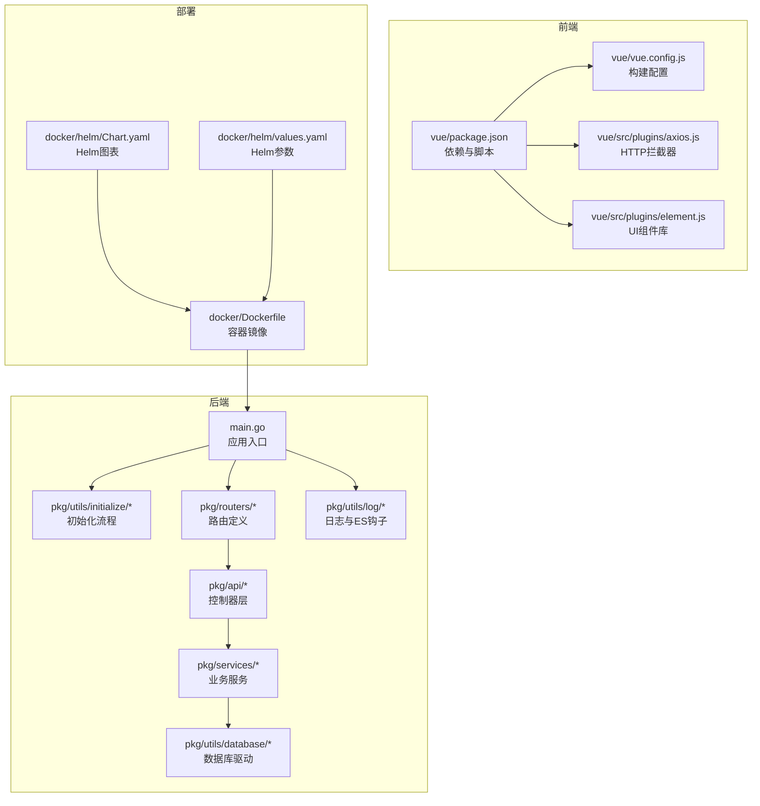
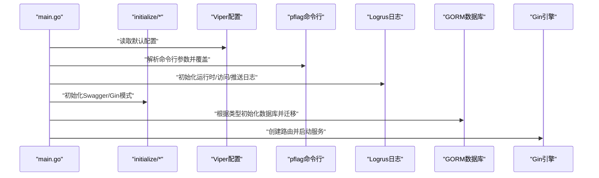
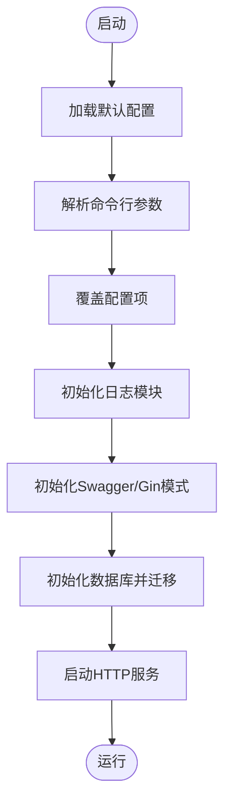
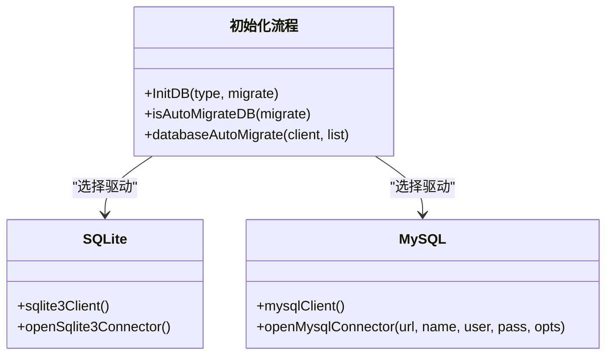
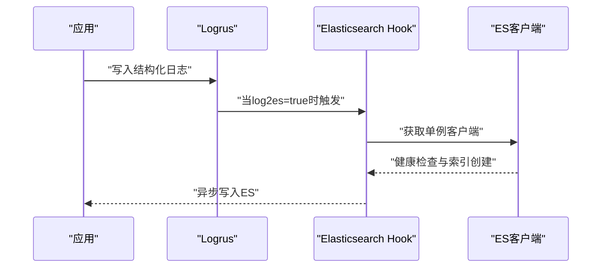
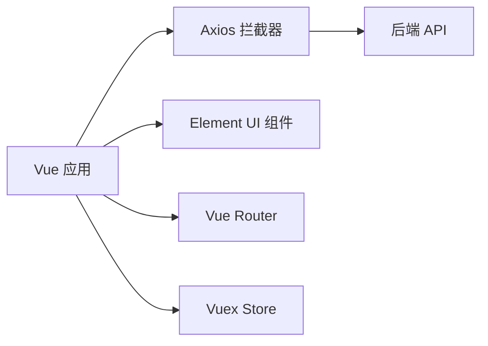
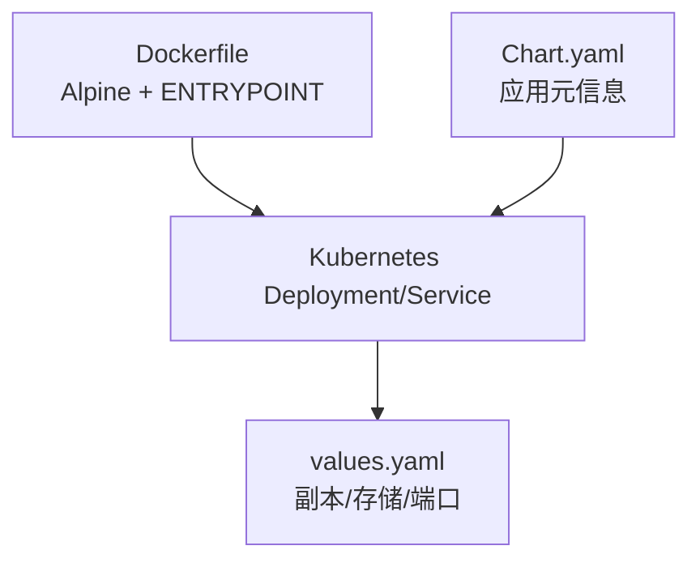
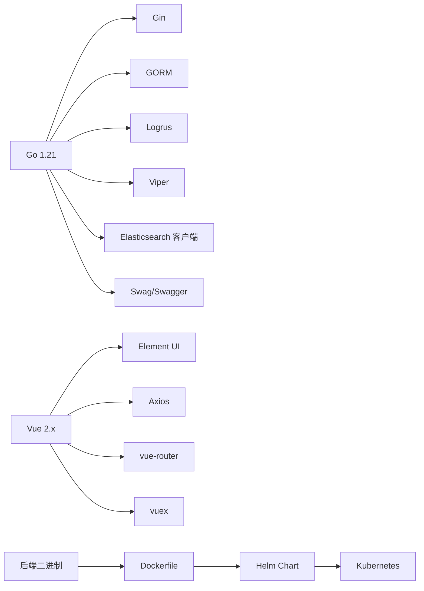

# 技术栈

<cite>
**本文档引用的文件**
- [go.mod](file://go.mod)
- [main.go](file://main.go)
- [config/default.yaml](file://config/default.yaml)
- [pkg/utils/initialize/cmd.go](file://pkg/utils/initialize/cmd.go)
- [pkg/utils/initialize/db.go](file://pkg/utils/initialize/db.go)
- [pkg/utils/database/sqlite.go](file://pkg/utils/database/sqlite.go)
- [pkg/utils/database/mysql.go](file://pkg/utils/database/mysql.go)
- [pkg/utils/log/hooks/es/client.go](file://pkg/utils/log/hooks/es/client.go)
- [docker/Dockerfile](file://docker/Dockerfile)
- [docker/helm/Chart.yaml](file://docker/helm/Chart.yaml)
- [docker/helm/values.yaml](file://docker/helm/values.yaml)
- [vue/package.json](file://vue/package.json)
- [vue/vue.config.js](file://vue/vue.config.js)
- [vue/src/plugins/axios.js](file://vue/src/plugins/axios.js)
- [vue/src/plugins/element.js](file://vue/src/plugins/element.js)
</cite>

## 目录
1. [简介](#简介)
2. [项目结构](#项目结构)
3. [核心组件](#核心组件)
4. [架构总览](#架构总览)
5. [详细组件分析](#详细组件分析)
6. [依赖关系分析](#依赖关系分析)
7. [性能考量](#性能考量)
8. [故障排查指南](#故障排查指南)
9. [结论](#结论)
10. [附录](#附录)

## 简介
本文件面向 GoMessage 项目的开发者与运维人员，系统梳理后端技术栈（Go 1.21、Gin Web 框架、GORM ORM、JWT 认证、Logrus 日志）、前端技术栈（Vue.js 2.x、Element UI、Axios）、数据库支持（SQLite 与 MySQL）、配置管理（Viper）、以及部署相关技术（Docker 容器化、Kubernetes 编排、Helm Chart）。文档以仓库实际实现为依据，结合架构图与流程图帮助理解技术选型与最佳实践。

## 项目结构
项目采用前后端分离架构：
- 后端：Go 语言实现，基于 Gin 框架提供 REST API，使用 GORM 进行数据库访问，通过 Viper 统一配置管理，日志由 Logrus 输出并可选接入 Elasticsearch。
- 前端：Vue.js 2.x + Element UI 构建管理界面，Axios 发起 HTTP 请求，构建产物静态化至后端 assets 目录供服务端托管。
- 部署：Docker 封装二进制运行时；Helm Chart 提供 Kubernetes 部署模板与默认参数；Kubernetes Deployment 与 Service 对接。

**图表来源**
- [main.go:1-56](file://main.go#L1-L56)
- [pkg/utils/initialize/cmd.go:1-99](file://pkg/utils/initialize/cmd.go#L1-L99)
- [pkg/utils/initialize/db.go:1-60](file://pkg/utils/initialize/db.go#L1-L60)
- [pkg/utils/database/sqlite.go:1-48](file://pkg/utils/database/sqlite.go#L1-L48)
- [pkg/utils/database/mysql.go:1-53](file://pkg/utils/database/mysql.go#L1-L53)
- [pkg/utils/log/hooks/es/client.go:1-70](file://pkg/utils/log/hooks/es/client.go#L1-L70)
- [vue/package.json:1-54](file://vue/package.json#L1-L54)
- [vue/vue.config.js:1-14](file://vue/vue.config.js#L1-L14)
- [vue/src/plugins/axios.js:1-96](file://vue/src/plugins/axios.js#L1-L96)
- [vue/src/plugins/element.js:1-6](file://vue/src/plugins/element.js#L1-L6)
- [docker/Dockerfile:1-20](file://docker/Dockerfile#L1-L20)
- [docker/helm/Chart.yaml:1-38](file://docker/helm/Chart.yaml#L1-L38)
- [docker/helm/values.yaml:1-19](file://docker/helm/values.yaml#L1-L19)

**章节来源**
- [main.go:1-56](file://main.go#L1-L56)
- [config/default.yaml:1-83](file://config/default.yaml#L1-L83)
- [go.mod:1-75](file://go.mod#L1-L75)

## 核心组件
- 后端语言与框架
  - Go 1.21：项目明确使用 go 1.21。
  - Gin Web 框架：应用入口使用 gin.Default() 创建路由引擎。
- ORM 与数据库
  - GORM v1：统一模型抽象与迁移能力；支持 SQLite 与 MySQL 驱动。
  - SQLite：默认推荐用于存储元数据，具备连接池配置。
  - MySQL：可选支持，提供 DSN 参数化配置与连接池优化。
- 配置管理
  - Viper：读取 YAML 配置、命令行参数覆盖、环境变量注入。
  - pflag：命令行参数解析与标准化。
- 日志与监控
  - Logrus：结构化日志输出，支持多通道日志（运行时、访问、推送）。
  - Elasticsearch Hook：可选将日志写入 ES，按日期索引。
- 前端技术栈
  - Vue.js 2.x：管理界面与交互。
  - Element UI：UI 组件库。
  - Axios：HTTP 客户端，统一拦截器处理鉴权与错误。
- 部署与编排
  - Docker：Alpine 基础镜像，暴露 7077 端口，ENTRYPOINT 直接运行二进制。
  - Helm Chart：定义应用版本、关键字、维护者信息与默认副本数、存储与服务端口。
  - Kubernetes：通过 Helm values.yaml 控制副本、持久卷、Service 端口映射。

**章节来源**
- [go.mod:1-75](file://go.mod#L1-L75)
- [main.go:1-56](file://main.go#L1-L56)
- [config/default.yaml:1-83](file://config/default.yaml#L1-L83)
- [pkg/utils/initialize/cmd.go:1-99](file://pkg/utils/initialize/cmd.go#L1-L99)
- [pkg/utils/initialize/db.go:1-60](file://pkg/utils/initialize/db.go#L1-L60)
- [pkg/utils/database/sqlite.go:1-48](file://pkg/utils/database/sqlite.go#L1-L48)
- [pkg/utils/database/mysql.go:1-53](file://pkg/utils/database/mysql.go#L1-L53)
- [pkg/utils/log/hooks/es/client.go:1-70](file://pkg/utils/log/hooks/es/client.go#L1-L70)
- [vue/package.json:1-54](file://vue/package.json#L1-L54)
- [vue/vue.config.js:1-14](file://vue/vue.config.js#L1-L14)
- [vue/src/plugins/axios.js:1-96](file://vue/src/plugins/axios.js#L1-L96)
- [vue/src/plugins/element.js:1-6](file://vue/src/plugins/element.js#L1-L6)
- [docker/Dockerfile:1-20](file://docker/Dockerfile#L1-L20)
- [docker/helm/Chart.yaml:1-38](file://docker/helm/Chart.yaml#L1-L38)
- [docker/helm/values.yaml:1-19](file://docker/helm/values.yaml#L1-L19)

## 架构总览
后端启动流程遵循“配置 → 命令行参数 → 日志 → Swagger/Gin模式 → 数据库”的顺序初始化，随后启动 Gin 服务监听配置的 host:port。前端通过 Axios 指向后端 API，构建产物由后端静态资源托管。

**图表来源**
- [main.go:13-35](file://main.go#L13-L35)
- [pkg/utils/initialize/cmd.go:46-99](file://pkg/utils/initialize/cmd.go#L46-L99)
- [pkg/utils/initialize/db.go:11-48](file://pkg/utils/initialize/db.go#L11-L48)
- [config/default.yaml:1-83](file://config/default.yaml#L1-L83)

## 详细组件分析

### 后端初始化与配置（Viper + pflag）
- 初始化顺序
  - 配置文件优先于命令行参数；命令行参数具有最高优先级，可覆盖配置项。
  - 初始化顺序包含：配置 → 命令行 → 日志 → Swagger/Gin模式 → 数据库。
- 关键配置项
  - 运行环境与 Gin 模式：global.env、global.ginMode。
  - 服务监听：service.host、service.port。
  - 日志级别、格式与 ES 写入开关：log.level、log.format、log.log2es、log.es.*。
  - 数据库类型与连接参数：databaseType、sqlite3.*、mysql.*。
- 命令行参数
  - --env/-e、--ginMode/-g、--migrate/-m、--log2es/-l，均支持下划线/点号/连字符标准化。

**图表来源**
- [main.go:13-35](file://main.go#L13-L35)
- [pkg/utils/initialize/cmd.go:46-99](file://pkg/utils/initialize/cmd.go#L46-L99)
- [config/default.yaml:1-83](file://config/default.yaml#L1-L83)

**章节来源**
- [main.go:13-35](file://main.go#L13-L35)
- [pkg/utils/initialize/cmd.go:1-99](file://pkg/utils/initialize/cmd.go#L1-L99)
- [config/default.yaml:1-83](file://config/default.yaml#L1-L83)

### 数据库与 ORM（GORM）
- 初始化流程
  - 根据 databaseType 选择 SQLite 或 MySQL 驱动，建立连接与连接池。
  - 自动迁移：在 migrate=true 时对命名空间、模板、变量、客户端、授权等模型执行幂等迁移。
  - 默认命名空间与 admin 账户仅在迁移时创建。
- SQLite
  - 默认静默日志，配置 MaxIdleConns 与 MaxOpenConns。
- MySQL
  - DSN 参数化，设置连接池最大空闲/最大打开连接与生命周期。

**图表来源**
- [pkg/utils/initialize/db.go:11-60](file://pkg/utils/initialize/db.go#L11-L60)
- [pkg/utils/database/sqlite.go:13-48](file://pkg/utils/database/sqlite.go#L13-L48)
- [pkg/utils/database/mysql.go:12-53](file://pkg/utils/database/mysql.go#L12-L53)

**章节来源**
- [pkg/utils/initialize/db.go:1-60](file://pkg/utils/initialize/db.go#L1-L60)
- [pkg/utils/database/sqlite.go:1-48](file://pkg/utils/database/sqlite.go#L1-L48)
- [pkg/utils/database/mysql.go:1-53](file://pkg/utils/database/mysql.go#L1-L53)
- [config/default.yaml:47-76](file://config/default.yaml#L47-L76)

### 日志系统（Logrus + Elasticsearch）
- 日志通道
  - 运行时日志、访问日志、推送日志分别输出到独立文件。
  - 支持 JSON/文本两种格式。
- ES 集成
  - 通过 log.log2es 开关控制是否启用 ES 写入。
  - 从配置读取用户名、密码与 URL 列表，支持本地开发环境变量覆盖。
  - 启动时预创建三个按日期命名的索引（运行时/访问/推送）。

**图表来源**
- [config/default.yaml:27-44](file://config/default.yaml#L27-L44)
- [pkg/utils/log/hooks/es/client.go:22-70](file://pkg/utils/log/hooks/es/client.go#L22-L70)

**章节来源**
- [config/default.yaml:1-83](file://config/default.yaml#L1-L83)
- [pkg/utils/log/hooks/es/client.go:1-70](file://pkg/utils/log/hooks/es/client.go#L1-L70)

### 前端技术栈（Vue.js 2.x + Element UI + Axios）
- 依赖与脚本
  - Vue 2.6、Element UI、Vuex、vue-router、Axios 等。
- 构建配置
  - 输出目录指向后端 assets/vue，静态资源目录 static，开发服务器端口 7070。
- Axios 拦截器
  - 请求头携带 Authorization（Token），未登录时跳转登录页。
  - 统一处理 401/403 权限错误。
- Element UI
  - 全局安装并引入样式。

**图表来源**
- [vue/package.json:10-33](file://vue/package.json#L10-L33)
- [vue/vue.config.js:1-14](file://vue/vue.config.js#L1-14)
- [vue/src/plugins/axios.js:13-96](file://vue/src/plugins/axios.js#L13-L96)
- [vue/src/plugins/element.js:1-6](file://vue/src/plugins/element.js#L1-L6)

**章节来源**
- [vue/package.json:1-54](file://vue/package.json#L1-L54)
- [vue/vue.config.js:1-14](file://vue/vue.config.js#L1-L14)
- [vue/src/plugins/axios.js:1-96](file://vue/src/plugins/axios.js#L1-L96)
- [vue/src/plugins/element.js:1-6](file://vue/src/plugins/element.js#L1-L6)

### 部署与编排（Docker + Helm + Kubernetes）
- Docker
  - 基于 Alpine，创建工作目录 /opt/gomessage，拷贝全部文件，暴露 7077，ENTRYPOINT 直接运行二进制。
- Helm Chart
  - 定义应用名称、版本、关键字、维护者等元信息。
- Helm Values
  - 默认副本数、PVC 存储类与容量、Service 端口映射（Service Port/Target Port/NodePort）。

**图表来源**
- [docker/Dockerfile:1-20](file://docker/Dockerfile#L1-L20)
- [docker/helm/Chart.yaml:1-38](file://docker/helm/Chart.yaml#L1-L38)
- [docker/helm/values.yaml:1-19](file://docker/helm/values.yaml#L1-L19)

**章节来源**
- [docker/Dockerfile:1-20](file://docker/Dockerfile#L1-L20)
- [docker/helm/Chart.yaml:1-38](file://docker/helm/Chart.yaml#L1-L38)
- [docker/helm/values.yaml:1-19](file://docker/helm/values.yaml#L1-L19)

## 依赖关系分析
- 语言与框架
  - Go 1.21 → Gin、GORM、Logrus、Viper、Elasticsearch 客户端、Swag 文档工具链。
- 前端生态
  - Vue 2.x → Element UI、Axios、vue-router、vuex。
- 部署链路
  - 二进制 → Docker 镜像 → Helm Chart → Kubernetes 集群。

**图表来源**
- [go.mod:5-21](file://go.mod#L5-L21)
- [vue/package.json:10-33](file://vue/package.json#L10-L33)
- [docker/Dockerfile:1-20](file://docker/Dockerfile#L1-L20)
- [docker/helm/Chart.yaml:1-38](file://docker/helm/Chart.yaml#L1-L38)

**章节来源**
- [go.mod:1-75](file://go.mod#L1-L75)
- [vue/package.json:1-54](file://vue/package.json#L1-L54)

## 性能考量
- 数据库连接池
  - SQLite：合理设置 MaxIdleConns 与 MaxOpenConns，避免并发阻塞。
  - MySQL：根据负载调整最大连接数与连接生命周期，降低连接抖动。
- 日志性能
  - GORM 日志默认静默，减少 ORM 层开销；Logrus 输出到文件与 ES 时注意异步写入与缓冲策略。
- 前端构建
  - 生产构建开启压缩与缓存策略，静态资源目录统一管理，减少回源压力。
- 容器与编排
  - 使用 Alpine 减小镜像体积；Helm values 中合理设置副本数与资源限制，确保弹性伸缩。

## 故障排查指南
- 启动参数校验
  - --env 必须为 dev/fat/pro 等受支持值，否则直接退出；可通过 --ginMode 调整运行模式。
- 数据库迁移
  - --migrate=true 时执行幂等迁移；如迁移失败，检查数据库连接与权限。
- 日志与 ES
  - 若 log2es=true 且 ES 不可用，需检查 log.es.* 配置与网络连通性；可通过环境变量临时覆盖 ES 地址与凭据。
- 前端访问
  - Axios 默认使用环境变量 VUE_APP_BASE_URL；如 401/403，检查 Token 是否有效与路由跳转逻辑。

**章节来源**
- [pkg/utils/initialize/cmd.go:21-34](file://pkg/utils/initialize/cmd.go#L21-L34)
- [pkg/utils/initialize/db.go:22-48](file://pkg/utils/initialize/db.go#L22-L48)
- [pkg/utils/log/hooks/es/client.go:29-69](file://pkg/utils/log/hooks/es/client.go#L29-L69)
- [vue/src/plugins/axios.js:19-57](file://vue/src/plugins/axios.js#L19-L57)

## 结论
本项目以 Go 1.21 为核心，结合 Gin、GORM、Viper、Logrus 与 Elasticsearch，构建出简洁可靠的后端服务；前端采用 Vue.js 2.x 与 Element UI，配合 Axios 实现统一的交互与鉴权；部署层面通过 Docker 与 Helm Chart 实现容器化与 Kubernetes 编排。整体技术栈清晰、职责分明，适合中小型团队快速迭代与稳定运维。

## 附录
- 关键配置参考
  - 服务监听：host/port
  - 日志：level/format/log2es/es.*
  - 数据库：databaseType/sqlite3/mysql
- 命令行参数参考
  - --env/--ginMode/--migrate/--log2es