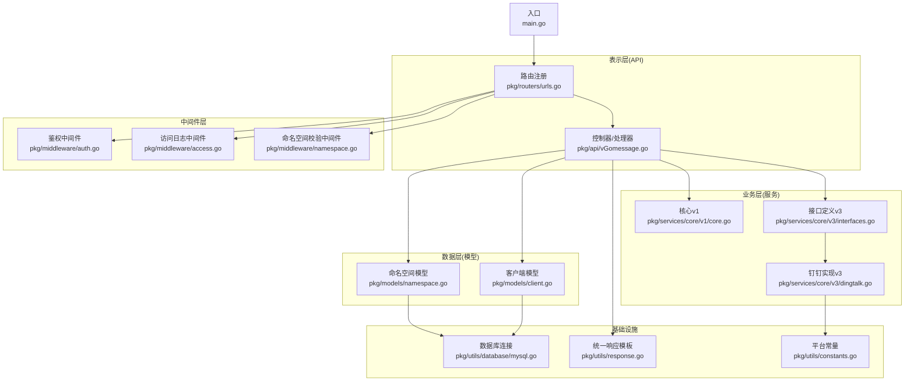
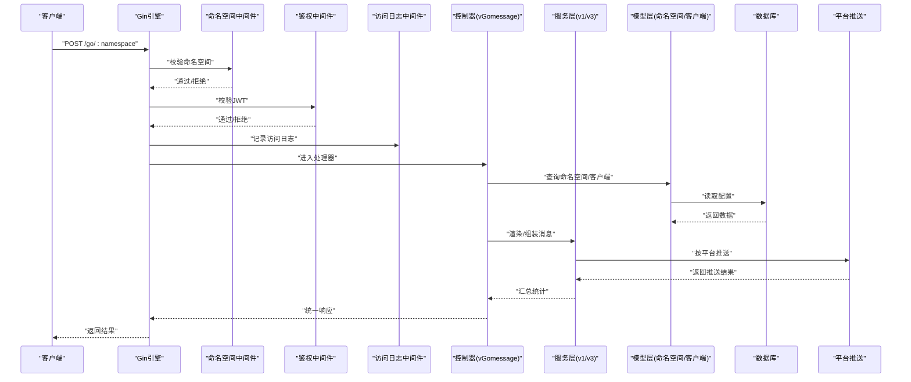
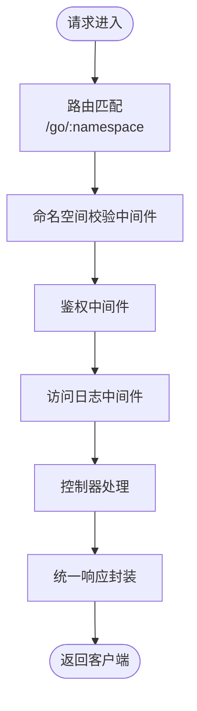
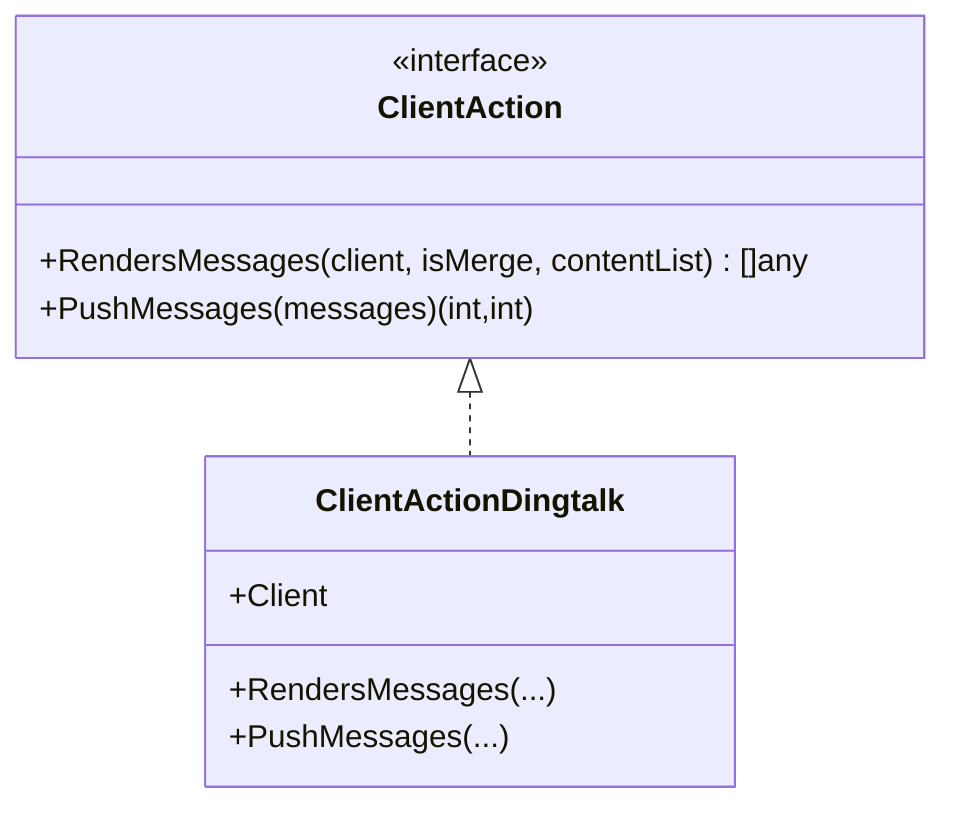
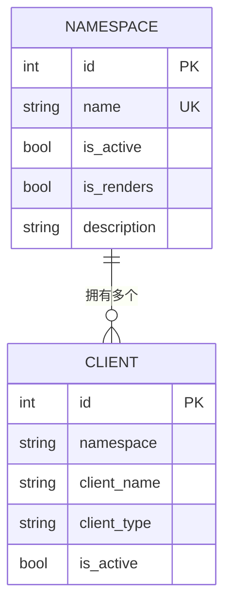
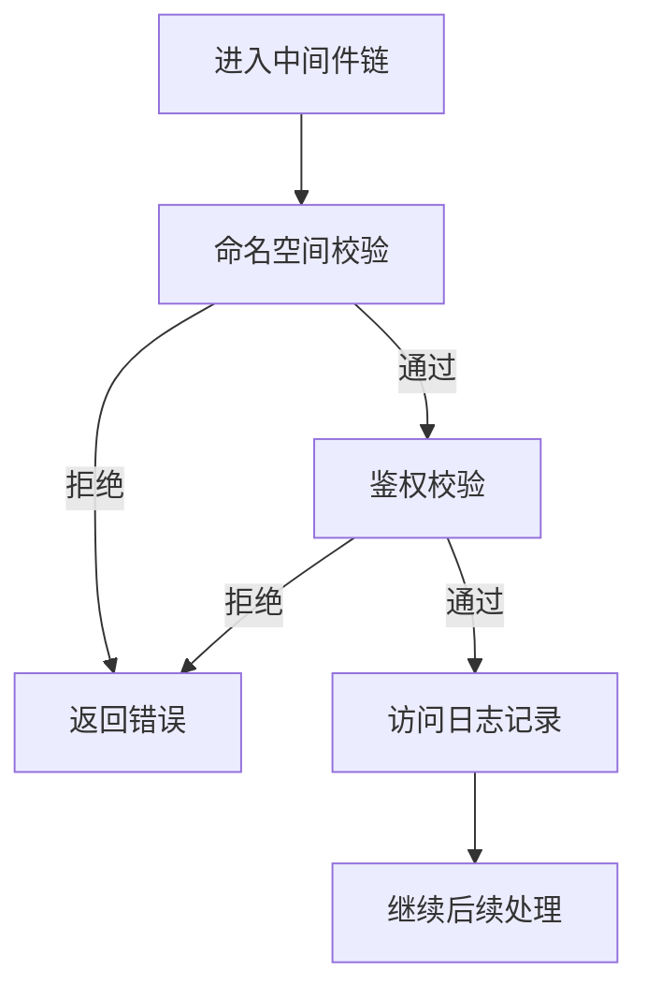
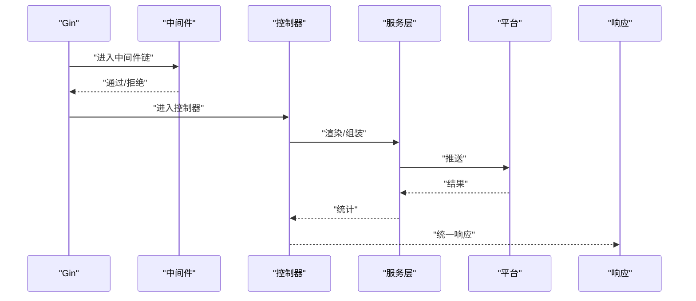
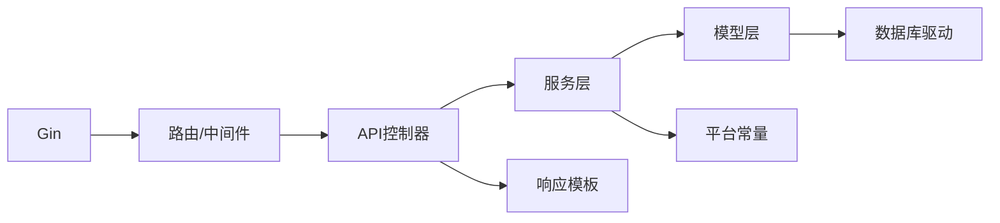

# 架构设计

<cite>
**本文引用的文件**
- [main.go](file://main.go)
- [urls.go](file://pkg/routers/urls.go)
- [auth.go](file://pkg/middleware/auth.go)
- [access.go](file://pkg/middleware/access.go)
- [namespace.go](file://pkg/middleware/namespace.go)
- [vGomessage.go](file://pkg/api/vGomessage.go)
- [client.go](file://pkg/models/client.go)
- [namespace.go](file://pkg/models/namespace.go)
- [interfaces.go](file://pkg/services/core/v3/interfaces.go)
- [dingtalk.go](file://pkg/services/core/v3/dingtalk.go)
- [core.go](file://pkg/services/core/v1/core.go)
- [mysql.go](file://pkg/utils/database/mysql.go)
- [constants.go](file://pkg/utils/constants.go)
- [response.go](file://pkg/utils/response.go)
- [go.mod](file://go.mod)
</cite>

## 目录
1. [引言](#引言)
2. [项目结构](#项目结构)
3. [核心组件](#核心组件)
4. [架构总览](#架构总览)
5. [详细组件分析](#详细组件分析)
6. [依赖分析](#依赖分析)
7. [性能考量](#性能考量)
8. [故障排查指南](#故障排查指南)
9. [结论](#结论)
10. [附录](#附录)

## 引言
本架构设计文档面向 GoMessage 项目，系统性阐述其整体架构模式、系统边界与组件划分、数据流、关键技术决策与权衡，并提供架构图与组件关系图，帮助开发者快速理解与高效迭代。

GoMessage 是一个消息中转与推送平台，支持多种即时通讯客户端（钉钉、飞书、企业微信机器人、企业微信应用号等）。系统采用分层架构（表示层、业务层、数据层），结合 MVC 与中间件模式，通过 Gin Web 框架提供 REST API，配合 Swagger 文档与统一响应体，形成清晰的请求-处理-推送-响应闭环。

## 项目结构
项目采用按“职责域”组织的分层结构：
- 表示层（API 层）：负责路由注册、请求解析、响应封装与文档生成
- 业务层（服务层）：负责消息渲染、组装、推送策略与平台适配
- 数据层（模型层）：负责命名空间、客户端、模板、变量等实体与持久化
- 中间件层：负责跨切面能力（鉴权、访问日志、命名空间校验等）
- 工具与基础设施：日志、数据库连接、常量、响应模板等

**图表来源**
- [main.go:1-56](file://main.go#L1-L56)
- [urls.go:1-109](file://pkg/routers/urls.go#L1-L109)
- [auth.go:1-62](file://pkg/middleware/auth.go#L1-L62)
- [access.go:1-72](file://pkg/middleware/access.go#L1-L72)
- [namespace.go:1-47](file://pkg/middleware/namespace.go#L1-L47)
- [vGomessage.go:1-172](file://pkg/api/vGomessage.go#L1-L172)
- [core.go:1-65](file://pkg/services/core/v1/core.go#L1-L65)
- [interfaces.go:1-11](file://pkg/services/core/v3/interfaces.go#L1-L11)
- [dingtalk.go:1-41](file://pkg/services/core/v3/dingtalk.go#L1-L41)
- [namespace.go:1-106](file://pkg/models/namespace.go#L1-L106)
- [client.go:1-239](file://pkg/models/client.go#L1-L239)
- [mysql.go:1-53](file://pkg/utils/database/mysql.go#L1-L53)
- [response.go:1-28](file://pkg/utils/response.go#L1-L28)
- [constants.go:1-9](file://pkg/utils/constants.go#L1-L9)

**章节来源**
- [main.go:1-56](file://main.go#L1-L56)
- [urls.go:1-109](file://pkg/routers/urls.go#L1-L109)

## 核心组件
- 入口与初始化
  - 初始化顺序严格控制：配置 → 命令行参数 → 运行时日志 → Swagger → Gin 模式 → 数据库
  - 启动服务监听，使用 Gin 默认引擎
- 路由与中间件
  - 静态资源与首页、健康检查、Swagger 文档
  - 全局中间件：CORS、访问日志
  - 分组中间件：命名空间校验、鉴权
- 控制器（API）
  - 提供 GET/POST 入口，支持命名空间参数
  - 统一响应模板封装
- 服务层
  - v1：消息组装与准备
  - v3：策略接口与具体平台实现（如钉钉）
- 模型层
  - 命名空间、客户端、模板、变量等
- 中间件
  - 鉴权：JWT 解析与会话校验
  - 访问日志：敏感字段脱敏、请求体截断
  - 命名空间校验：防止非法命名空间

**章节来源**
- [main.go:13-55](file://main.go#L13-L55)
- [urls.go:21-108](file://pkg/routers/urls.go#L21-L108)
- [auth.go:12-61](file://pkg/middleware/auth.go#L12-L61)
- [access.go:23-71](file://pkg/middleware/access.go#L23-L71)
- [namespace.go:20-46](file://pkg/middleware/namespace.go#L20-L46)
- [vGomessage.go:20-171](file://pkg/api/vGomessage.go#L20-L171)
- [core.go:25-64](file://pkg/services/core/v1/core.go#L25-L64)
- [interfaces.go:7-10](file://pkg/services/core/v3/interfaces.go#L7-L10)
- [dingtalk.go:10-40](file://pkg/services/core/v3/dingtalk.go#L10-L40)
- [namespace.go:12-26](file://pkg/models/namespace.go#L12-L26)
- [client.go:13-38](file://pkg/models/client.go#L13-L38)
- [response.go:3-27](file://pkg/utils/response.go#L3-L27)

## 架构总览
系统采用“请求-渲染-推送-响应”的流水线式处理：
- 请求进入：Gin 路由匹配 → 中间件链（命名空间校验、鉴权、访问日志）
- 业务处理：读取命名空间配置 → 读取客户端配置 → 可选渲染 → 策略组装消息
- 平台推送：按平台实现调用对应推送接口
- 响应返回：统一响应模板封装结果

**图表来源**
- [urls.go:42-48](file://pkg/routers/urls.go#L42-L48)
- [namespace.go:20-46](file://pkg/middleware/namespace.go#L20-L46)
- [auth.go:12-61](file://pkg/middleware/auth.go#L12-L61)
- [access.go:23-71](file://pkg/middleware/access.go#L23-L71)
- [vGomessage.go:20-153](file://pkg/api/vGomessage.go#L20-L153)
- [core.go:34-64](file://pkg/services/core/v1/core.go#L34-L64)
- [interfaces.go:7-10](file://pkg/services/core/v3/interfaces.go#L7-L10)
- [dingtalk.go:14-40](file://pkg/services/core/v3/dingtalk.go#L14-L40)
- [namespace.go:89-94](file://pkg/models/namespace.go#L89-L94)
- [client.go:230-239](file://pkg/models/client.go#L230-L239)

## 详细组件分析

### API 层（表示层）
- 职责
  - 注册路由与静态资源
  - 执行中间件链
  - 处理请求、调用服务层、封装响应
- 关键点
  - 支持 GET/POST 两种入口，自动重定向至标准路径
  - 统一响应模板，便于前端消费
  - Swagger 文档集成

**图表来源**
- [urls.go:42-48](file://pkg/routers/urls.go#L42-L48)
- [namespace.go:20-46](file://pkg/middleware/namespace.go#L20-L46)
- [auth.go:12-61](file://pkg/middleware/auth.go#L12-L61)
- [access.go:23-71](file://pkg/middleware/access.go#L23-L71)
- [vGomessage.go:20-153](file://pkg/api/vGomessage.go#L20-L153)
- [response.go:11-27](file://pkg/utils/response.go#L11-L27)

**章节来源**
- [urls.go:21-108](file://pkg/routers/urls.go#L21-L108)
- [vGomessage.go:20-171](file://pkg/api/vGomessage.go#L20-L171)
- [response.go:3-27](file://pkg/utils/response.go#L3-L27)

### 服务层（业务层）
- v1：消息组装与准备
  - 将命名空间配置与客户端信息整合，输出 ReadyClient 列表
- v3：策略接口与实现
  - 接口定义：渲染消息、推送消息
  - 实现示例：钉钉策略，支持聚合或逐条推送
- 关键点
  - 渲染开关与合并开关影响消息形态
  - 按客户端类型动态选择策略实现

**图表来源**
- [interfaces.go:7-10](file://pkg/services/core/v3/interfaces.go#L7-L10)
- [dingtalk.go:10-40](file://pkg/services/core/v3/dingtalk.go#L10-L40)

**章节来源**
- [core.go:25-64](file://pkg/services/core/v1/core.go#L25-L64)
- [interfaces.go:7-10](file://pkg/services/core/v3/interfaces.go#L7-L10)
- [dingtalk.go:14-40](file://pkg/services/core/v3/dingtalk.go#L14-L40)

### 模型层（数据层）
- 命名空间模型
  - 字段：名称、激活状态、渲染开关、描述
  - 查询：按 ID/Name 存在性检查
- 客户端模型
  - 字段：命名空间、名称、类型、激活状态、扩展信息
  - 操作：增删改查、按命名空间列出、按激活状态筛选
- 关键点
  - 不同客户端类型共享主表，扩展信息独立存储
  - 通过 ClientType 动态装配扩展结构

**图表来源**
- [namespace.go:12-26](file://pkg/models/namespace.go#L12-L26)
- [client.go:13-38](file://pkg/models/client.go#L13-L38)

**章节来源**
- [namespace.go:28-105](file://pkg/models/namespace.go#L28-L105)
- [client.go:40-239](file://pkg/models/client.go#L40-L239)

### 中间件层
- 命名空间校验中间件
  - 校验路径中的命名空间是否存在，不存在则直接返回
- 鉴权中间件
  - 从 Header 中提取 Authorization，校验 JWT 有效性与会话状态
- 访问日志中间件
  - 记录请求路径、方法、状态码、耗时、客户端 IP、脱敏后的请求体

**图表来源**
- [namespace.go:20-46](file://pkg/middleware/namespace.go#L20-L46)
- [auth.go:12-61](file://pkg/middleware/auth.go#L12-L61)
- [access.go:23-71](file://pkg/middleware/access.go#L23-L71)

**章节来源**
- [namespace.go:20-46](file://pkg/middleware/namespace.go#L20-L46)
- [auth.go:12-61](file://pkg/middleware/auth.go#L12-L61)
- [access.go:23-71](file://pkg/middleware/access.go#L23-L71)

### 数据流详解（从请求到响应）
- 请求进入：Gin 路由匹配 → 中间件链执行
- 业务处理：读取命名空间与客户端配置 → 可选渲染 → 策略组装消息
- 平台推送：按平台实现调用对应推送接口，统计成功/失败
- 响应返回：根据统计结果返回统一响应

**图表来源**
- [urls.go:42-48](file://pkg/routers/urls.go#L42-L48)
- [vGomessage.go:67-142](file://pkg/api/vGomessage.go#L67-L142)
- [dingtalk.go:30-40](file://pkg/services/core/v3/dingtalk.go#L30-L40)
- [response.go:11-27](file://pkg/utils/response.go#L11-L27)

**章节来源**
- [vGomessage.go:20-153](file://pkg/api/vGomessage.go#L20-L153)

## 依赖分析
- 框架与库
  - Web 框架：Gin
  - 文档：Swag + Gin-Swagger
  - 鉴权：JWT
  - ORM：GORM + MySQL/SQLite
  - 日志：Logrus + 自定义钩子
- 组件耦合
  - API 层依赖服务层与模型层；服务层依赖模型层与工具常量；中间件独立但贯穿 API 流程
- 外部依赖
  - 平台推送依赖各平台开放接口（钉钉、飞书、企业微信）

**图表来源**
- [go.mod:5-21](file://go.mod#L5-L21)
- [main.go:3-11](file://main.go#L3-L11)
- [urls.go:3-12](file://pkg/routers/urls.go#L3-L12)
- [vGomessage.go:3-18](file://pkg/api/vGomessage.go#L3-L18)
- [mysql.go:12-52](file://pkg/utils/database/mysql.go#L12-L52)
- [response.go:3-9](file://pkg/utils/response.go#L3-L9)
- [constants.go:3-8](file://pkg/utils/constants.go#L3-L8)

**章节来源**
- [go.mod:1-75](file://go.mod#L1-L75)

## 性能考量
- 数据库连接池
  - 最大空闲连接、最大打开连接、连接生命周期合理配置，避免高并发下的连接争用
- 日志与请求体
  - 访问日志对请求体进行脱敏与长度限制，避免日志膨胀
- 推送策略
  - 支持聚合推送减少平台调用次数，提升吞吐
- 缓存与劫持
  - 请求体读取后回写，避免重复 IO；劫持层用于数据透传与可观测

**章节来源**
- [mysql.go:38-51](file://pkg/utils/database/mysql.go#L38-L51)
- [access.go:15-21](file://pkg/middleware/access.go#L15-L21)
- [vGomessage.go:32-42](file://pkg/api/vGomessage.go#L32-L42)

## 故障排查指南
- 常见错误与定位
  - 命名空间不存在：中间件直接返回错误，检查路径参数与命名空间创建
  - 未提供或无效 Authorization：鉴权中间件返回未授权，检查 Token 与签名
  - 请求体非 JSON：控制器提示请求体必须为合法 JSON
  - 客户端类型错误：服务层日志记录，检查客户端类型配置
- 日志与追踪
  - 访问日志包含起止时间、耗时、状态码、路径、脱敏请求体
  - 推送日志记录命名空间与内容，便于问题回溯

**章节来源**
- [namespace.go:30-45](file://pkg/middleware/namespace.go#L30-L45)
- [auth.go:14-60](file://pkg/middleware/auth.go#L14-L60)
- [vGomessage.go:33-42](file://pkg/api/vGomessage.go#L33-L42)
- [vGomessage.go:101-106](file://pkg/api/vGomessage.go#L101-L106)
- [access.go:58-68](file://pkg/middleware/access.go#L58-L68)

## 结论
GoMessage 以清晰的分层架构与中间件模式构建，结合策略模式实现多平台推送，具备良好的扩展性与可维护性。通过统一响应模板与 Swagger 文档，提升了前后端协作效率。建议在高并发场景下进一步优化数据库连接池与推送并发控制，并持续完善平台适配与监控告警体系。

## 附录
- 关键技术决策与权衡
  - 选择 Gin：生态成熟、性能稳定、中间件丰富，适合快速构建 API
  - 多租户（命名空间）：通过命名空间隔离用户配置与数据，降低耦合
  - 策略模式：将不同平台的推送逻辑解耦，便于扩展新平台
  - 统一响应模板：简化前端处理，提升一致性
- 运行与部署
  - 支持 Docker 与 Helm 部署，便于容器化上线