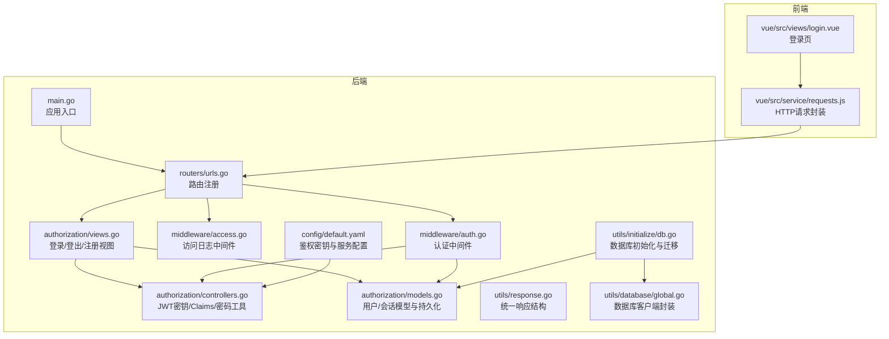
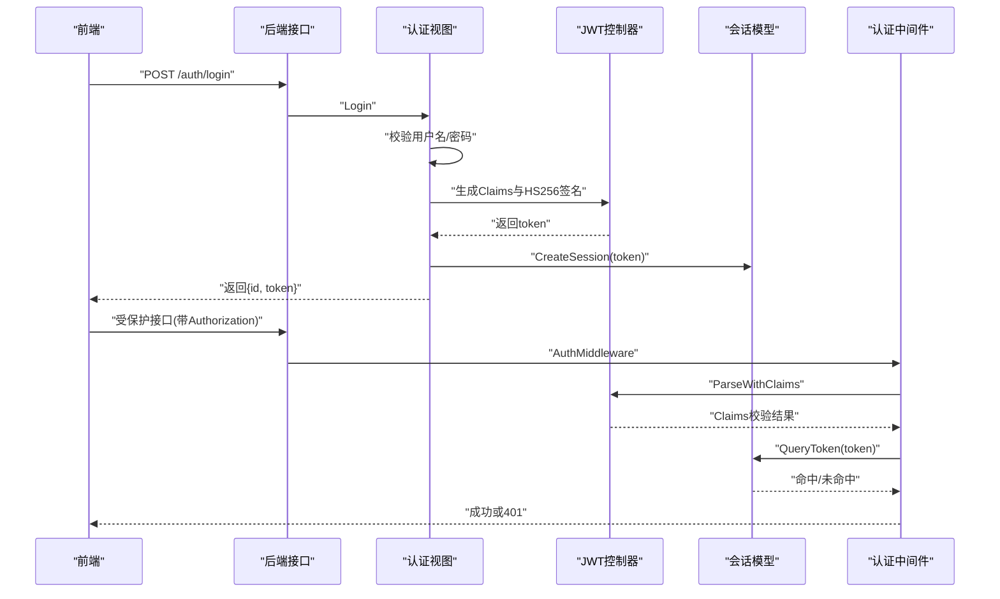
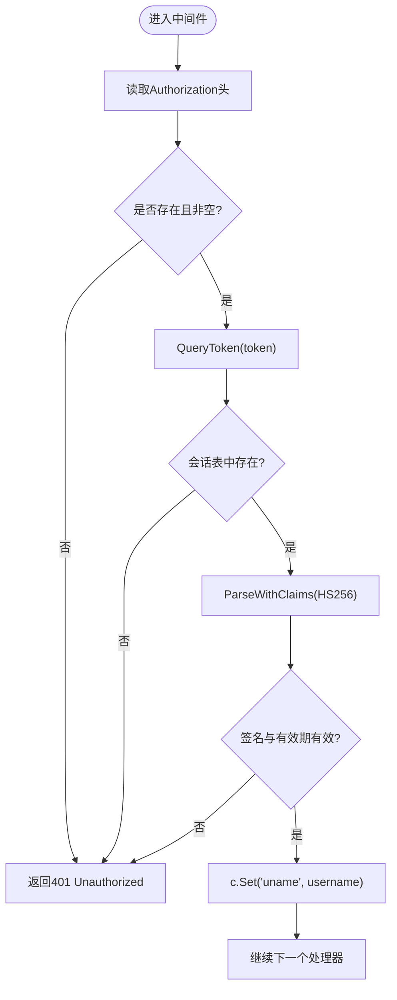
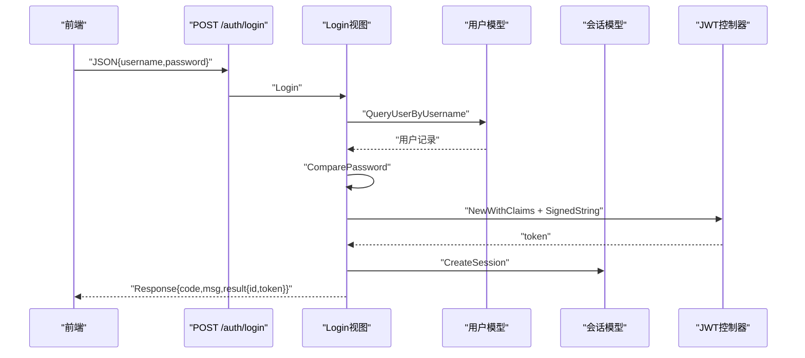
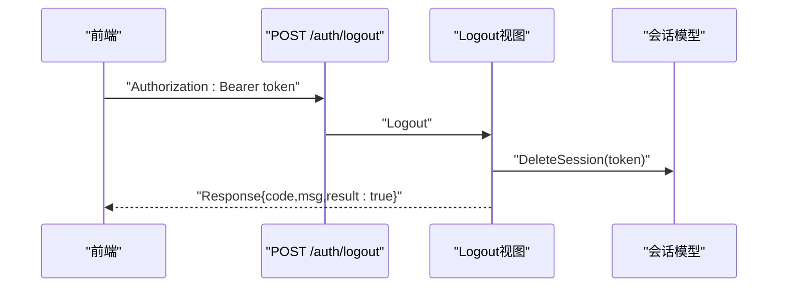
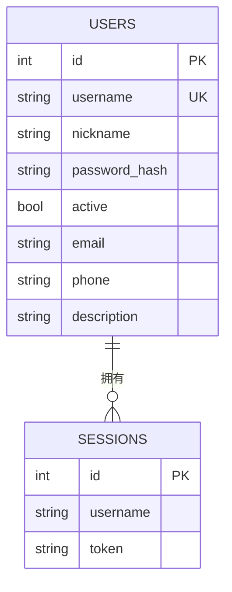
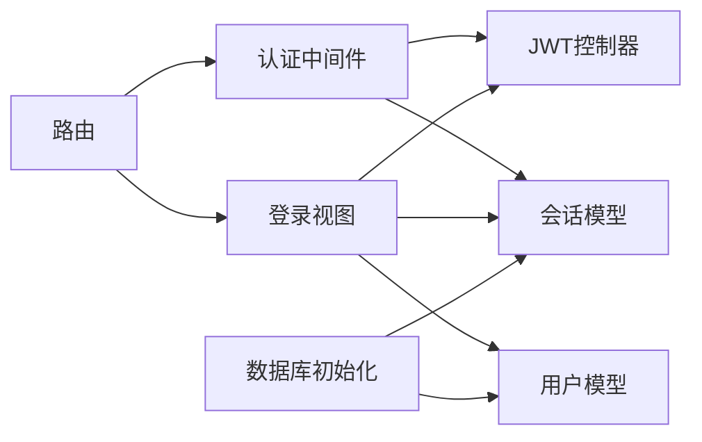

# JWT 认证授权

<cite>
**本文引用的文件**
- [main.go](file://main.go)
- [config/default.yaml](file://config/default.yaml)
- [pkg/utils/response.go](file://pkg/utils/response.go)
- [pkg/utils/initialize/db.go](file://pkg/utils/initialize/db.go)
- [pkg/utils/database/global.go](file://pkg/utils/database/global.go)
- [pkg/routers/urls.go](file://pkg/routers/urls.go)
- [pkg/middleware/auth.go](file://pkg/middleware/auth.go)
- [pkg/middleware/access.go](file://pkg/middleware/access.go)
- [pkg/authorization/controllers.go](file://pkg/authorization/controllers.go)
- [pkg/authorization/models.go](file://pkg/authorization/models.go)
- [pkg/authorization/views.go](file://pkg/authorization/views.go)
- [vue/src/views/login.vue](file://vue/src/views/login.vue)
- [vue/src/service/requests.js](file://vue/src/service/requests.js)
</cite>

## 目录
1. [简介](#简介)
2. [项目结构](#项目结构)
3. [核心组件](#核心组件)
4. [架构总览](#架构总览)
5. [详细组件分析](#详细组件分析)
6. [依赖分析](#依赖分析)
7. [性能考虑](#性能考虑)
8. [故障排查指南](#故障排查指南)
9. [结论](#结论)
10. [附录](#附录)

## 简介
本文件面向 JWT 认证授权系统，围绕以下目标展开：
- 详解 JWT 的生成、验证与登出流程
- 解释认证中间件工作流与安全策略
- 说明用户注册、登录、登出的完整链路
- 介绍权限控制模型与角色管理机制
- 提供认证接口使用说明（请求头、令牌管理、错误处理）
- 总结安全最佳实践（令牌存储、过期处理、防重放）
- 给出常见问题排查方法与解决方案

## 项目结构
后端采用 Gin 框架，路由集中于统一入口，认证相关逻辑分布在 authorization、middleware、routers 与 utils 包中；前端 Vue 通过 axios 封装的 http 客户端发起认证请求。

图表来源
- [main.go:37-55](file://main.go#L37-L55)
- [pkg/routers/urls.go:21-108](file://pkg/routers/urls.go#L21-L108)
- [pkg/middleware/auth.go:12-61](file://pkg/middleware/auth.go#L12-L61)
- [pkg/middleware/access.go:23-71](file://pkg/middleware/access.go#L23-L71)
- [pkg/authorization/views.go:12-88](file://pkg/authorization/views.go#L12-L88)
- [pkg/authorization/controllers.go:10-40](file://pkg/authorization/controllers.go#L10-L40)
- [pkg/authorization/models.go:10-134](file://pkg/authorization/models.go#L10-L134)
- [pkg/utils/response.go:11-27](file://pkg/utils/response.go#L11-L27)
- [pkg/utils/initialize/db.go:11-48](file://pkg/utils/initialize/db.go#L11-L48)
- [pkg/utils/database/global.go:14-35](file://pkg/utils/database/global.go#L14-L35)
- [config/default.yaml:11-13](file://config/default.yaml#L11-L13)
- [vue/src/views/login.vue:42-62](file://vue/src/views/login.vue#L42-L62)
- [vue/src/service/requests.js:38-41](file://vue/src/service/requests.js#L38-L41)

章节来源
- [main.go:37-55](file://main.go#L37-L55)
- [pkg/routers/urls.go:21-108](file://pkg/routers/urls.go#L21-L108)

## 核心组件
- 认证中间件：负责从请求头提取 Authorization 令牌，校验签名与有效期，并将用户名注入上下文
- 登录/登出/注册视图：实现用户凭据校验、JWT 签发、会话记录与清理
- 会话模型：维护用户与令牌的映射，用于登出与“令牌是否有效”的快速判定
- 密钥与 Claims：从配置读取 HS256 密钥，定义标准声明
- 统一响应：前后端一致的响应结构，便于错误处理与前端展示
- 路由注册：将认证接口与受保护接口分组并挂载中间件

章节来源
- [pkg/middleware/auth.go:12-61](file://pkg/middleware/auth.go#L12-L61)
- [pkg/authorization/views.go:12-88](file://pkg/authorization/views.go#L12-L88)
- [pkg/authorization/models.go:99-134](file://pkg/authorization/models.go#L99-L134)
- [pkg/authorization/controllers.go:10-40](file://pkg/authorization/controllers.go#L10-L40)
- [pkg/utils/response.go:11-27](file://pkg/utils/response.go#L11-L27)
- [pkg/routers/urls.go:50-90](file://pkg/routers/urls.go#L50-L90)

## 架构总览
JWT 认证授权的整体流程如下：
- 前端登录页提交用户名/密码
- 后端校验凭据，签发带过期时间的 JWT，并将令牌与用户名写入会话表
- 后续请求携带 Authorization 头，中间件校验签名与有效期，并检查令牌是否仍在会话表中
- 登出时清理会话表中的令牌，使其立即失效

图表来源
- [pkg/authorization/views.go:31-88](file://pkg/authorization/views.go#L31-L88)
- [pkg/middleware/auth.go:12-61](file://pkg/middleware/auth.go#L12-L61)
- [pkg/authorization/models.go:112-134](file://pkg/authorization/models.go#L112-L134)
- [pkg/authorization/controllers.go:10-40](file://pkg/authorization/controllers.go#L10-L40)

## 详细组件分析

### 认证中间件（AuthMiddleware）
- 请求头解析：从 Authorization 中提取 Bearer 令牌
- 会话表校验：若令牌不在会话表中，视为已登出或无效
- JWT 校验：使用 HS256 密钥验证签名与有效期
- 上下文注入：通过 c.Set 注入用户名，供后续处理器使用
- 错误处理：统一返回 401 与统一响应结构

图表来源
- [pkg/middleware/auth.go:12-61](file://pkg/middleware/auth.go#L12-L61)

章节来源
- [pkg/middleware/auth.go:12-61](file://pkg/middleware/auth.go#L12-L61)

### 登录（Login）
- 参数绑定：接收用户名与密码
- 用户查询：按用户名查询用户记录
- 凭据校验：bcrypt 对比密码哈希
- JWT 签发：设置过期时间（示例为60分钟），使用 HS256 签名
- 会话记录：将 token 写入 sessions 表
- 返回：统一响应结构，包含用户 id 与 token

图表来源
- [pkg/authorization/views.go:31-72](file://pkg/authorization/views.go#L31-L72)
- [pkg/authorization/models.go:112-119](file://pkg/authorization/models.go#L112-L119)
- [pkg/authorization/controllers.go:10-40](file://pkg/authorization/controllers.go#L10-L40)

章节来源
- [pkg/authorization/views.go:31-72](file://pkg/authorization/views.go#L31-L72)
- [pkg/authorization/models.go:112-119](file://pkg/authorization/models.go#L112-L119)
- [pkg/authorization/controllers.go:10-40](file://pkg/authorization/controllers.go#L10-L40)

### 登出（Logout）
- 从请求头读取 Authorization 令牌
- 若令牌非空，则删除会话表中的对应记录
- 返回统一成功响应

图表来源
- [pkg/authorization/views.go:74-88](file://pkg/authorization/views.go#L74-L88)
- [pkg/authorization/models.go:121-128](file://pkg/authorization/models.go#L121-L128)

章节来源
- [pkg/authorization/views.go:74-88](file://pkg/authorization/views.go#L74-L88)
- [pkg/authorization/models.go:121-128](file://pkg/authorization/models.go#L121-L128)

### 注册（Register）
- 参数绑定：接收用户名、昵称、邮箱、电话、密码
- 密码哈希：使用 bcrypt 生成哈希
- 用户创建：写入 users 表
- 返回：统一成功响应

章节来源
- [pkg/authorization/views.go:12-29](file://pkg/authorization/views.go#L12-L29)

### 会话模型与用户模型
- Users：用户基本信息与密码哈希
- Sessions：记录用户名与令牌，用于登出与有效性校验
- 初始化：数据库迁移时自动创建 users 与 sessions 表，并初始化 admin 账户

图表来源
- [pkg/authorization/models.go:10-26](file://pkg/authorization/models.go#L10-L26)
- [pkg/authorization/models.go:99-110](file://pkg/authorization/models.go#L99-L110)
- [pkg/utils/initialize/db.go:25-47](file://pkg/utils/initialize/db.go#L25-L47)

章节来源
- [pkg/authorization/models.go:10-26](file://pkg/authorization/models.go#L10-L26)
- [pkg/authorization/models.go:99-110](file://pkg/authorization/models.go#L99-L110)
- [pkg/utils/initialize/db.go:25-47](file://pkg/utils/initialize/db.go#L25-L47)

### JWT 密钥与 Claims
- 密钥来源：从配置文件读取 auth.jwtKey
- Claims：包含用户名与标准过期时间声明
- 签名算法：HS256

章节来源
- [pkg/authorization/controllers.go:10-40](file://pkg/authorization/controllers.go#L10-L40)
- [config/default.yaml:11-13](file://config/default.yaml#L11-L13)

### 统一响应结构
- 成功：code=1，result 为业务数据
- 失败：code=0，error 为错误信息
- 帮助链接：指向仓库 wiki 的响应规范文档

章节来源
- [pkg/utils/response.go:11-27](file://pkg/utils/response.go#L11-L27)

### 路由与中间件挂载
- 认证接口：/auth/login、/auth/logout、/auth/register
- 受保护接口：/api/v1 下的多条路由，均挂载认证中间件
- 全局中间件：跨域、访问日志

章节来源
- [pkg/routers/urls.go:50-90](file://pkg/routers/urls.go#L50-L90)

### 前端交互
- 登录页：输入用户名/密码，调用登录接口
- 登录成功：将 token 与用户 id 存入 store，并跳转主页面
- 登录接口：/auth/login
- 登出接口：/auth/logout

章节来源
- [vue/src/views/login.vue:42-62](file://vue/src/views/login.vue#L42-L62)
- [vue/src/service/requests.js:38-41](file://vue/src/service/requests.js#L38-L41)

## 依赖分析
- 认证中间件依赖 JWT 解析与会话模型
- 登录视图依赖用户模型、JWT 控制器与会话模型
- 路由层将认证中间件挂载到受保护接口
- 数据库初始化确保 users 与 sessions 表存在，并初始化 admin

图表来源
- [pkg/middleware/auth.go:12-61](file://pkg/middleware/auth.go#L12-L61)
- [pkg/authorization/views.go:31-88](file://pkg/authorization/views.go#L31-L88)
- [pkg/authorization/models.go:112-134](file://pkg/authorization/models.go#L112-L134)
- [pkg/routers/urls.go:50-90](file://pkg/routers/urls.go#L50-L90)
- [pkg/utils/initialize/db.go:25-47](file://pkg/utils/initialize/db.go#L25-L47)

章节来源
- [pkg/middleware/auth.go:12-61](file://pkg/middleware/auth.go#L12-L61)
- [pkg/authorization/views.go:31-88](file://pkg/authorization/views.go#L31-L88)
- [pkg/authorization/models.go:112-134](file://pkg/authorization/models.go#L112-L134)
- [pkg/routers/urls.go:50-90](file://pkg/routers/urls.go#L50-L90)
- [pkg/utils/initialize/db.go:25-47](file://pkg/utils/initialize/db.go#L25-L47)

## 性能考虑
- JWT 验证为内存计算，开销极低
- 会话表查询用于登出即时生效，建议为 token 字段建立索引以提升查询效率
- 登录接口仅在首次签发时产生数据库写入，后续读取为常量时间
- 建议将 jwtKey 放置在环境变量中，避免硬编码

## 故障排查指南
- 401 未授权
  - 缺失或为空的 Authorization 头
  - 令牌签名无效或过期
  - 令牌不在会话表中（已登出）
- 登录失败
  - 用户名不存在或密码错误
  - 服务器内部错误（签名失败）
- 登出无效
  - 前端未正确传递 Authorization 头
  - 令牌为空导致未删除会话记录
- 统一响应结构
  - code=0 时，查看 error 字段定位具体原因
  - 参考帮助链接获取响应规范

章节来源
- [pkg/middleware/auth.go:18-59](file://pkg/middleware/auth.go#L18-L59)
- [pkg/authorization/views.go:40-71](file://pkg/authorization/views.go#L40-L71)
- [pkg/authorization/views.go:74-88](file://pkg/authorization/views.go#L74-L88)
- [pkg/utils/response.go:11-27](file://pkg/utils/response.go#L11-L27)

## 结论
本系统基于 Gin 与 JWT 实现了简洁高效的认证授权方案：登录签发令牌并记录会话，中间件统一校验签名与有效性，登出通过会话表即时使令牌失效。配合统一响应结构与访问日志中间件，便于前端集成与运维监控。建议在生产环境中强化密钥管理、启用 HTTPS、限制令牌过期时间，并结合前端安全存储策略与 CSRF 防护进一步提升整体安全性。

## 附录

### 接口使用说明
- 登录
  - 方法：POST /auth/login
  - 请求体：用户名、密码
  - 成功响应：包含用户 id 与 token
- 登出
  - 方法：POST /auth/logout
  - 请求头：Authorization: Bearer <token>
  - 成功响应：登出成功
- 注册
  - 方法：POST /auth/register
  - 请求体：用户名、昵称、邮箱、电话、密码
  - 成功响应：注册成功

章节来源
- [pkg/routers/urls.go:50-53](file://pkg/routers/urls.go#L50-L53)
- [pkg/authorization/views.go:12-29](file://pkg/authorization/views.go#L12-L29)
- [pkg/authorization/views.go:74-88](file://pkg/authorization/views.go#L74-L88)

### 请求头与令牌管理
- Authorization 头格式：Bearer <token>
- 前端应将 token 存储于本地（如 sessionStorage 或安全 Cookie），并在每次请求时附加
- 登录成功后，前端应更新用户状态与路由跳转

章节来源
- [vue/src/views/login.vue:52-58](file://vue/src/views/login.vue#L52-L58)
- [vue/src/service/requests.js:38-41](file://vue/src/service/requests.js#L38-L41)

### 安全最佳实践
- 密钥管理
  - 生产环境必须修改默认 jwtKey，使用强随机字符串
  - 将密钥置于环境变量或安全配置中心
- 传输安全
  - 使用 HTTPS，防止令牌在传输中被窃取
- 令牌生命周期
  - 设置合理的过期时间；可引入刷新令牌机制（当前实现未包含）
- 存储安全
  - 前端避免将敏感令牌存储于 localStorage；优先使用 HttpOnly Cookie 并开启 SameSite/Secure
- 防重放与风控
  - 引入 nonce、jti、IP/UA 绑定与限频策略
- 日志与审计
  - 使用访问日志中间件记录关键信息，但需脱敏敏感字段

章节来源
- [config/default.yaml:11-13](file://config/default.yaml#L11-L13)
- [pkg/middleware/access.go:13-21](file://pkg/middleware/access.go#L13-L21)