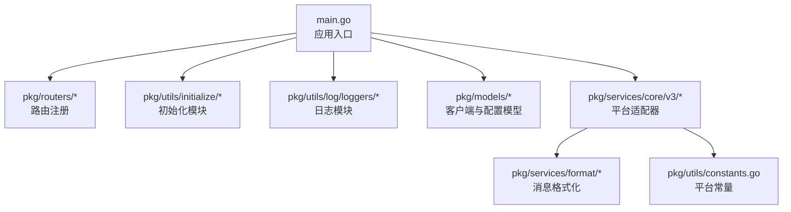
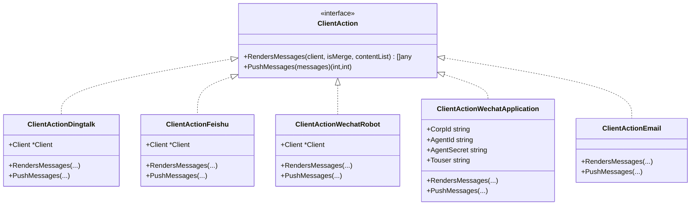
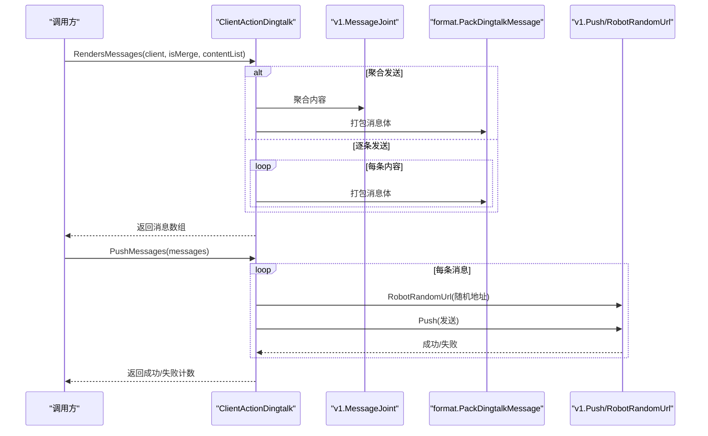
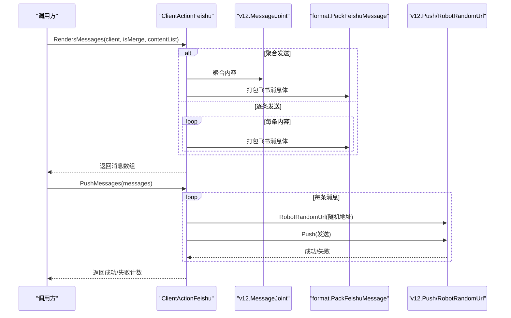
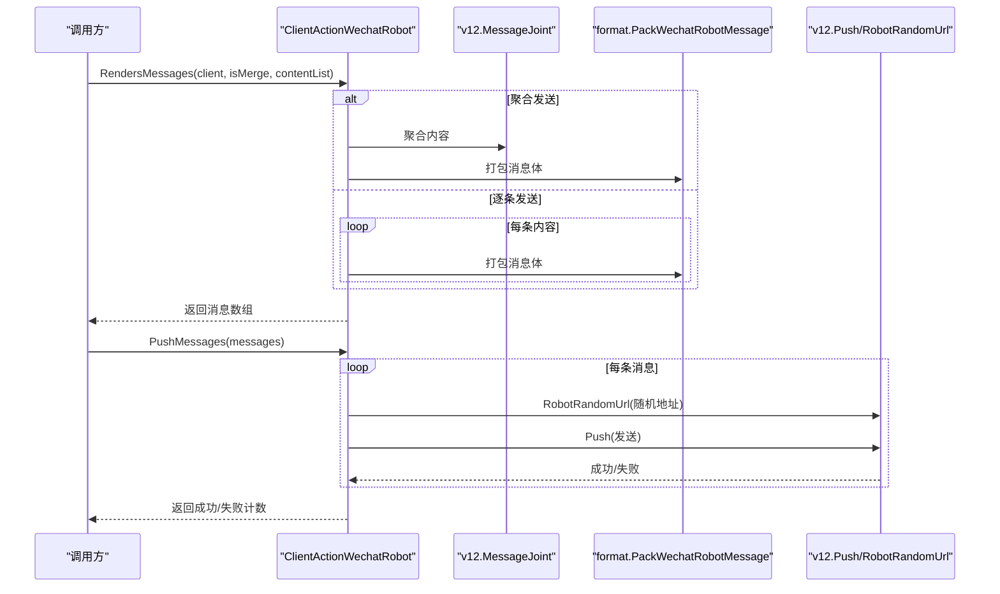
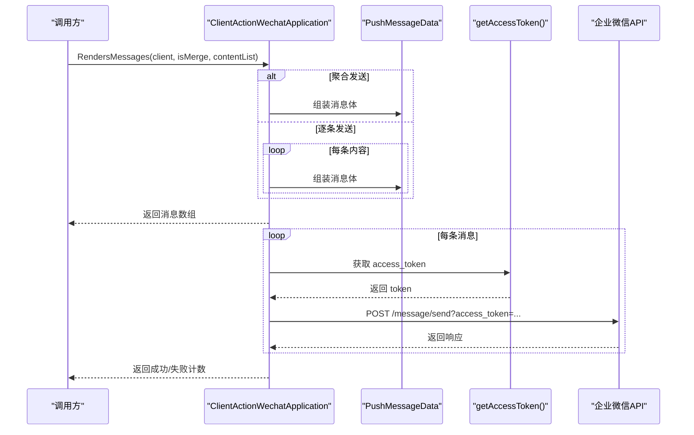
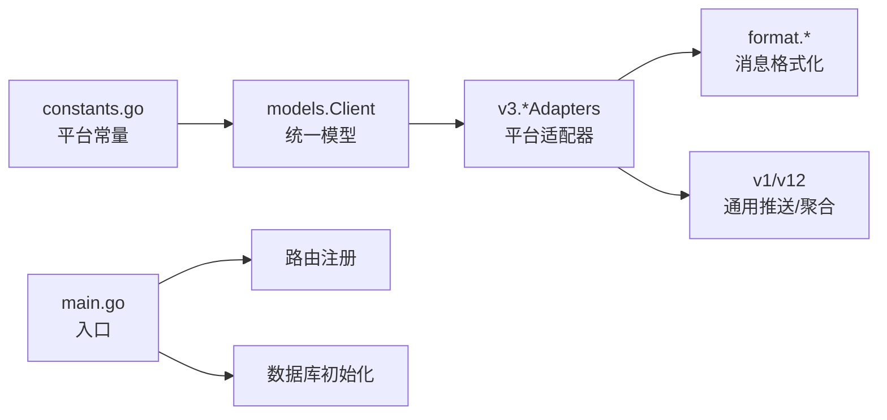

# 多平台消息推送

<cite>
**本文引用的文件**
- [main.go](file://main.go)
- [client.go](file://pkg/models/client.go)
- [client_dingtalk.go](file://pkg/models/client_dingtalk.go)
- [client_feishu.go](file://pkg/models/client_feishu.go)
- [interfaces.go](file://pkg/services/core/v3/interfaces.go)
- [dingtalk.go](file://pkg/services/core/v3/dingtalk.go)
- [feishu.go](file://pkg/services/core/v3/feishu.go)
- [wechat.go](file://pkg/services/core/v3/wechat.go)
- [wechat_robot.go](file://pkg/services/core/v3/wechat_robot.go)
- [email.go](file://pkg/services/core/v3/email.go)
- [dingtalk.go](file://pkg/services/format/dingtalk.go)
- [feishu.go](file://pkg/services/format/feishu.go)
- [wechat.go](file://pkg/services/format/wechat.go)
- [wechat_robot.go](file://pkg/services/format/wechat_robot.go)
- [constants.go](file://pkg/utils/constants.go)
</cite>

## 目录
1. [简介](#简介)
2. [项目结构](#项目结构)
3. [核心组件](#核心组件)
4. [架构总览](#架构总览)
5. [详细组件分析](#详细组件分析)
6. [依赖分析](#依赖分析)
7. [性能考虑](#性能考虑)
8. [故障排查指南](#故障排查指南)
9. [结论](#结论)
10. [附录](#附录)

## 简介
本项目提供统一的多平台消息推送能力，当前支持以下五类客户端：
- 钉钉机器人推送
- 飞书机器人推送
- 企业微信机器人推送
- 企业微信应用推送
- 邮件推送（预留）

系统通过“平台适配器”设计模式，将不同平台的消息格式与调用流程抽象为统一接口，便于扩展与维护。后端以 Gin 框架提供 HTTP 接口，使用 GORM 进行持久化，支持按命名空间管理客户端配置。

## 项目结构
后端入口负责初始化配置、日志、数据库与路由注册；核心推送逻辑位于 v3 适配层，格式化模块负责各平台消息体拼装，模型层负责客户端配置的增删改查与关联表存储。

图表来源
- [main.go:1-56](file://main.go#L1-L56)
- [interfaces.go:1-11](file://pkg/services/core/v3/interfaces.go#L1-L11)
- [constants.go:1-9](file://pkg/utils/constants.go#L1-L9)

章节来源
- [main.go:1-56](file://main.go#L1-L56)

## 核心组件
- 平台适配器接口
  - 定义统一的渲染与推送方法，用于将业务内容转换为各平台消息体并发起推送。
- 平台实现
  - 钉钉、飞书、企业微信机器人、企业微信应用、邮件（预留）分别实现该接口。
- 消息格式化
  - 提供各平台的消息体结构封装，确保符合平台 API 的字段要求。
- 客户端模型
  - 统一存储客户端基础信息与各平台扩展配置，支持随机轮询机器人地址、关键词等。

章节来源
- [interfaces.go:1-11](file://pkg/services/core/v3/interfaces.go#L1-L11)
- [dingtalk.go:1-41](file://pkg/services/core/v3/dingtalk.go#L1-L41)
- [feishu.go:1-40](file://pkg/services/core/v3/feishu.go#L1-L40)
- [wechat_robot.go:1-40](file://pkg/services/core/v3/wechat_robot.go#L1-L40)
- [wechat.go:1-121](file://pkg/services/core/v3/wechat.go#L1-L121)
- [email.go:1-18](file://pkg/services/core/v3/email.go#L1-L18)
- [dingtalk.go:1-30](file://pkg/services/format/dingtalk.go#L1-L30)
- [feishu.go:1-61](file://pkg/services/format/feishu.go#L1-L61)
- [wechat_robot.go:1-22](file://pkg/services/format/wechat_robot.go#L1-L22)
- [wechat.go:1-115](file://pkg/services/format/wechat.go#L1-L115)
- [client.go:1-239](file://pkg/models/client.go#L1-L239)
- [client_dingtalk.go:1-38](file://pkg/models/client_dingtalk.go#L1-L38)
- [client_feishu.go:1-24](file://pkg/models/client_feishu.go#L1-L24)
- [constants.go:1-9](file://pkg/utils/constants.go#L1-L9)

## 架构总览
系统采用“适配器 + 格式化 + 模型”的分层设计：
- 适配器层：按平台实现统一接口，负责消息渲染与推送调度。
- 格式化层：按平台生成标准消息体，屏蔽平台差异。
- 模型层：持久化客户端与扩展配置，支持随机机器人地址与关键词等。

图表来源
- [interfaces.go:1-11](file://pkg/services/core/v3/interfaces.go#L1-L11)
- [dingtalk.go:1-41](file://pkg/services/core/v3/dingtalk.go#L1-L41)
- [feishu.go:1-40](file://pkg/services/core/v3/feishu.go#L1-L40)
- [wechat_robot.go:1-40](file://pkg/services/core/v3/wechat_robot.go#L1-L40)
- [wechat.go:1-121](file://pkg/services/core/v3/wechat.go#L1-L121)
- [email.go:1-18](file://pkg/services/core/v3/email.go#L1-L18)

## 详细组件分析

### 钉钉机器人推送
- 配置要点
  - 关键词：用于标题前缀或过滤标识。
  - 机器人地址：支持多地址轮询，提升可用性。
  - @所有人与手机号：可选的提醒范围。
- 渲染与推送
  - 支持聚合发送与逐条发送两种模式。
  - 使用格式化模块生成 Markdown 消息体。
  - 从扩展配置中随机选择机器人地址进行推送。
- 特殊参数
  - at_all 与 at_mobiles 控制提醒范围。
- 错误处理
  - 推送失败计数累加，成功计数累加。

图表来源
- [dingtalk.go:14-40](file://pkg/services/core/v3/dingtalk.go#L14-L40)
- [dingtalk.go:1-30](file://pkg/services/format/dingtalk.go#L1-L30)

章节来源
- [client_dingtalk.go:21-38](file://pkg/models/client_dingtalk.go#L21-L38)
- [dingtalk.go:14-40](file://pkg/services/core/v3/dingtalk.go#L14-L40)
- [dingtalk.go:1-30](file://pkg/services/format/dingtalk.go#L1-L30)

### 飞书机器人推送
- 配置要点
  - 关键词：作为卡片标题内容。
  - 颜色模板：控制卡片头部颜色主题。
  - 机器人地址：支持多地址轮询。
- 渲染与推送
  - 使用格式化模块生成飞书交互卡片消息体。
  - 支持聚合与逐条两种模式。
- 特殊参数
  - title_color 与 robot_keyword 影响卡片外观与标题。
- 错误处理
  - 推送失败计数累加，成功计数累加。

图表来源
- [feishu.go:14-39](file://pkg/services/core/v3/feishu.go#L14-L39)
- [feishu.go:1-61](file://pkg/services/format/feishu.go#L1-L61)

章节来源
- [client_feishu.go:8-24](file://pkg/models/client_feishu.go#L8-L24)
- [feishu.go:14-39](file://pkg/services/core/v3/feishu.go#L14-L39)
- [feishu.go:1-61](file://pkg/services/format/feishu.go#L1-L61)

### 企业微信机器人推送
- 配置要点
  - 关键词：影响标题内容。
  - 机器人地址：支持多地址轮询。
- 渲染与推送
  - 使用格式化模块生成 Markdown 消息体。
  - 支持聚合与逐条两种模式。
- 特殊参数
  - robot_keyword 与 robot_url_list。
- 错误处理
  - 推送失败计数累加，成功计数累加。

图表来源
- [wechat_robot.go:14-39](file://pkg/services/core/v3/wechat_robot.go#L14-L39)
- [wechat_robot.go:1-22](file://pkg/services/format/wechat_robot.go#L1-L22)

章节来源
- [wechat_robot.go:14-39](file://pkg/services/core/v3/wechat_robot.go#L14-L39)
- [wechat_robot.go:1-22](file://pkg/services/format/wechat_robot.go#L1-L22)

### 企业微信应用推送
- 配置要点
  - CorpId、AgentId、Secret：用于获取 access_token。
  - Touser：目标用户。
- 渲染与推送
  - 使用格式化模块生成 Markdown 消息体。
  - 先获取 access_token，再向企业微信 API 发送消息。
- 特殊参数
  - agent_id、touser、markdown.content。
- 错误处理
  - token 获取失败则全部计为失败；网络错误与响应读取失败均计入失败。

图表来源
- [wechat.go:24-91](file://pkg/services/core/v3/wechat.go#L24-L91)
- [wechat.go:94-120](file://pkg/services/core/v3/wechat.go#L94-L120)
- [wechat.go:21-29](file://pkg/services/format/wechat.go#L21-L29)

章节来源
- [wechat.go:24-91](file://pkg/services/core/v3/wechat.go#L24-L91)
- [wechat.go:94-120](file://pkg/services/core/v3/wechat.go#L94-L120)
- [wechat.go:21-29](file://pkg/services/format/wechat.go#L21-L29)

### 邮件推送（预留）
- 当前实现
  - 仅打印提示信息，未接入实际邮件发送。
- 扩展建议
  - 引入 SMTP 客户端，实现邮件体渲染与发送。
  - 在适配器中实现 PushMessages 方法，返回成功/失败计数。

章节来源
- [email.go:1-18](file://pkg/services/core/v3/email.go#L1-L18)

## 依赖分析
- 平台常量
  - 通过常量定义平台类型，避免魔法字符串，提高可维护性。
- 模型与适配器耦合
  - 适配器通过 Client 结构持有扩展配置，解耦平台细节。
- 格式化模块
  - 将平台特定的消息体封装为统一返回值，便于上层统一处理。
- 路由与入口
  - 入口文件负责初始化顺序与服务启动，路由层负责对外暴露 API。

图表来源
- [constants.go:1-9](file://pkg/utils/constants.go#L1-L9)
- [client.go:13-28](file://pkg/models/client.go#L13-L28)
- [interfaces.go:7-10](file://pkg/services/core/v3/interfaces.go#L7-L10)
- [dingtalk.go:14-40](file://pkg/services/core/v3/dingtalk.go#L14-L40)
- [feishu.go:14-39](file://pkg/services/core/v3/feishu.go#L14-L39)
- [wechat_robot.go:14-39](file://pkg/services/core/v3/wechat_robot.go#L14-L39)
- [wechat.go:24-91](file://pkg/services/core/v3/wechat.go#L24-L91)
- [dingtalk.go:1-30](file://pkg/services/format/dingtalk.go#L1-L30)
- [feishu.go:1-61](file://pkg/services/format/feishu.go#L1-L61)
- [wechat_robot.go:1-22](file://pkg/services/format/wechat_robot.go#L1-L22)
- [wechat.go:1-115](file://pkg/services/format/wechat.go#L1-L115)
- [main.go:13-35](file://main.go#L13-L35)

章节来源
- [constants.go:1-9](file://pkg/utils/constants.go#L1-L9)
- [client.go:13-28](file://pkg/models/client.go#L13-L28)
- [interfaces.go:7-10](file://pkg/services/core/v3/interfaces.go#L7-L10)
- [main.go:13-35](file://main.go#L13-L35)

## 性能考虑
- 地址轮询
  - 机器人地址列表支持随机轮询，提升可用性与容灾能力。
- 聚合发送
  - 对多条内容进行聚合，减少 API 调用次数，降低网络开销。
- 日志与错误统计
  - 适配器层返回成功/失败计数，便于监控与重试策略制定。
- 并发与限流
  - 可在 PushMessages 中引入并发控制与退避重试，避免触发平台限流。
- 缓存与复用
  - 企业微信 access_token 获取频率较低，可在适配器内缓存并复用，减少重复请求。

## 故障排查指南
- 钉钉/飞书/企业微信机器人
  - 症状：推送失败计数增加。
  - 排查：检查机器人地址是否有效、关键词是否匹配、网络连通性。
  - 建议：启用地址轮询，记录每次使用的地址以便定位问题。
- 企业微信应用
  - 症状：access_token 获取失败或消息发送失败。
  - 排查：确认 CorpId、AgentId、Secret 是否正确；检查 token 是否过期；查看响应体定位错误原因。
  - 建议：增加 token 缓存与刷新策略，记录错误码与错误信息。
- 邮件推送
  - 症状：无实际发送动作。
  - 排查：确认已实现 PushMessages 方法并接入 SMTP。
  - 建议：参考企业微信应用的错误处理与日志记录方式。

章节来源
- [dingtalk.go:30-40](file://pkg/services/core/v3/dingtalk.go#L30-L40)
- [feishu.go:29-39](file://pkg/services/core/v3/feishu.go#L29-L39)
- [wechat_robot.go:29-39](file://pkg/services/core/v3/wechat_robot.go#L29-L39)
- [wechat.go:55-91](file://pkg/services/core/v3/wechat.go#L55-L91)
- [email.go:15-18](file://pkg/services/core/v3/email.go#L15-L18)

## 结论
本系统通过“平台适配器 + 消息格式化 + 模型存储”的架构，实现了对多平台消息推送的统一抽象与扩展。现有实现覆盖钉钉、飞书、企业微信机器人与应用，邮件推送预留接口便于后续扩展。通过聚合发送、地址轮询与错误计数等机制，系统具备良好的可用性与可观测性。建议在生产环境中进一步完善并发控制、限流与缓存策略，并补充邮件推送的具体实现。

## 附录
- 平台常量
  - 钉钉：用于区分客户端类型与渲染逻辑。
  - 飞书：用于区分客户端类型与渲染逻辑。
  - 企业微信机器人：用于区分客户端类型与渲染逻辑。
  - 企业微信应用：用于区分客户端类型与渲染逻辑。
- 数据模型要点
  - Client：统一存储基础信息与扩展配置。
  - Dingtalk/Feishu：存储机器人相关配置与随机地址列表。
  - WechatApplication：存储 CorpId、AgentId、Secret、Touser 等应用级配置。

章节来源
- [constants.go:3-8](file://pkg/utils/constants.go#L3-L8)
- [client.go:13-28](file://pkg/models/client.go#L13-L28)
- [client_dingtalk.go:21-38](file://pkg/models/client_dingtalk.go#L21-L38)
- [client_feishu.go:8-24](file://pkg/models/client_feishu.go#L8-L24)