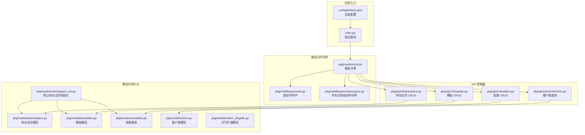
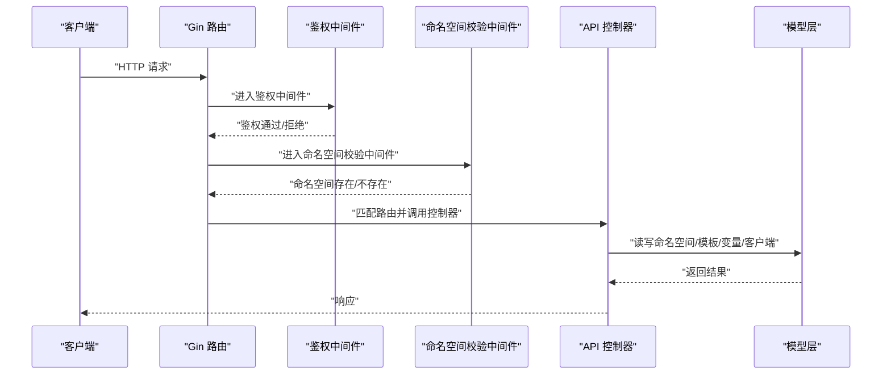
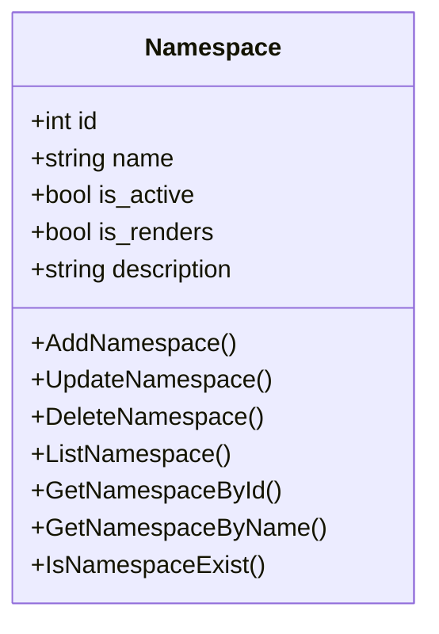
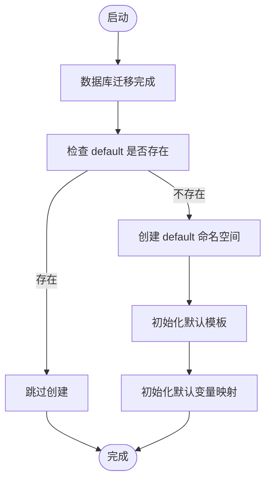
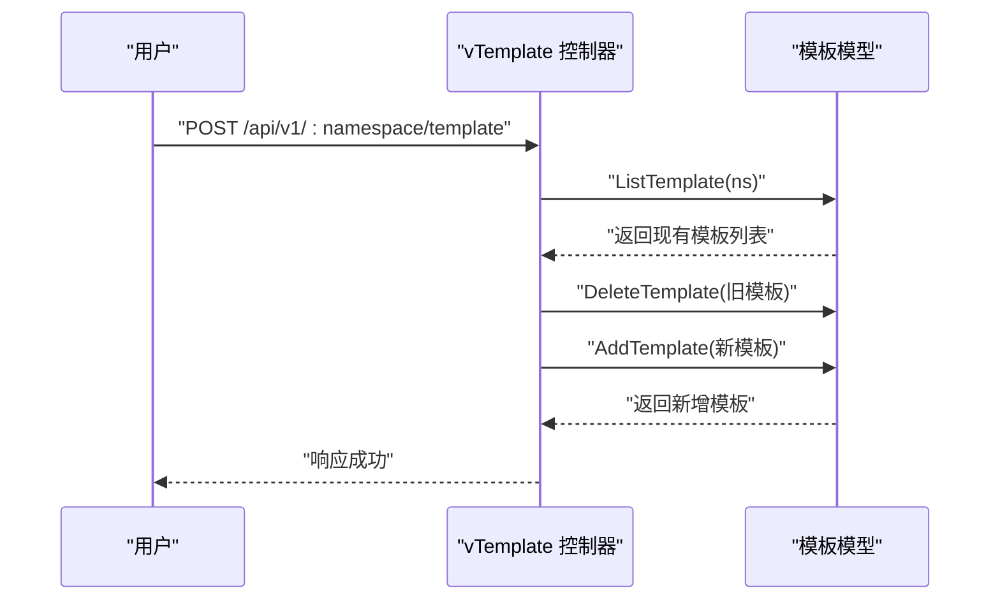
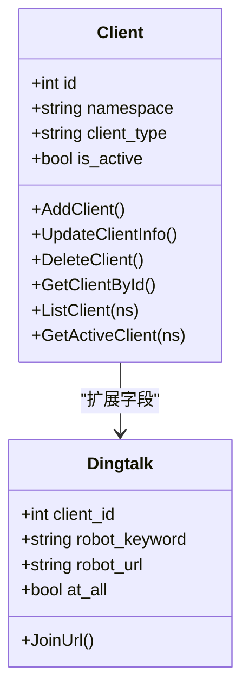
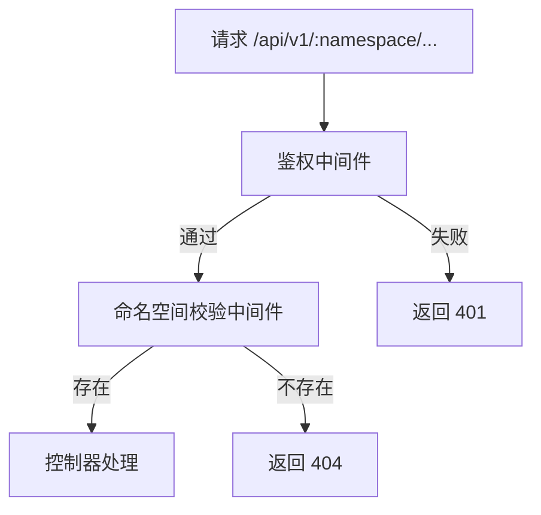
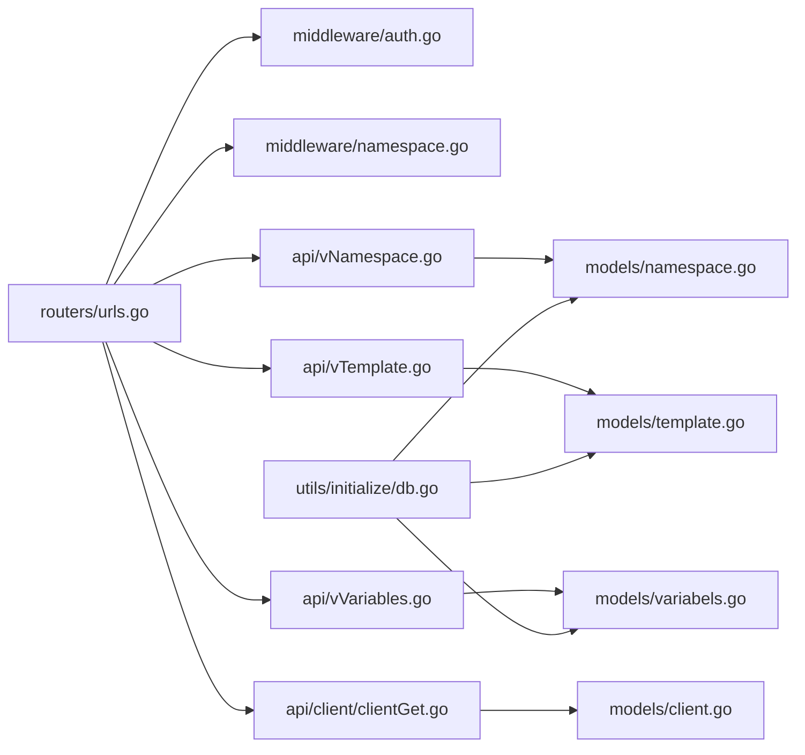

# 多租户命名空间

<cite>
**本文引用的文件**
- [main.go](file://main.go)
- [config/default.yaml](file://config/default.yaml)
- [pkg/utils/initialize/db.go](file://pkg/utils/initialize/db.go)
- [pkg/routers/urls.go](file://pkg/routers/urls.go)
- [pkg/middleware/namespace.go](file://pkg/middleware/namespace.go)
- [pkg/middleware/auth.go](file://pkg/middleware/auth.go)
- [pkg/models/namespace.go](file://pkg/models/namespace.go)
- [pkg/models/namespace_init.go](file://pkg/models/namespace_init.go)
- [pkg/api/vNamespace.go](file://pkg/api/vNamespace.go)
- [pkg/models/template.go](file://pkg/models/template.go)
- [pkg/api/vTemplate.go](file://pkg/api/vTemplate.go)
- [pkg/models/variabels.go](file://pkg/models/variabels.go)
- [pkg/api/vVariables.go](file://pkg/api/vVariables.go)
- [pkg/models/client.go](file://pkg/models/client.go)
- [pkg/api/client/clientGet.go](file://pkg/api/client/clientGet.go)
- [pkg/models/client_dingtalk.go](file://pkg/models/client_dingtalk.go)
</cite>

## 目录
1. [简介](#简介)
2. [项目结构](#项目结构)
3. [核心组件](#核心组件)
4. [架构总览](#架构总览)
5. [详细组件分析](#详细组件分析)
6. [依赖分析](#依赖分析)
7. [性能考量](#性能考量)
8. [故障排查指南](#故障排查指南)
9. [结论](#结论)
10. [附录](#附录)

## 简介
本文件面向“多租户命名空间”系统，围绕命名空间的概念、设计理念与实现机制展开，系统性阐述命名空间的创建、配置与管理流程；解释命名空间隔离与权限控制的工作原理；梳理命名空间与客户端、模板、变量之间的关联关系及数据隔离与资源共享策略；并提供命名规范、权限分配与资源限制的最佳实践，以及多租户场景下的安全与性能优化建议。

## 项目结构
后端采用 Go + Gin 框架，按职责分层组织：
- 路由层：定义 REST API 与中间件挂载点
- 中间件层：鉴权、跨域、访问日志、命名空间校验
- API 层：对外暴露的业务接口（命名空间、模板、变量、客户端）
- 模型层：数据模型与持久化逻辑（GORM）
- 初始化与配置：数据库迁移、默认命名空间、Swagger 文档、运行模式
- 前端静态资源：Vue 构建产物通过静态文件方式提供

图表来源
- [main.go:37-55](file://main.go#L37-L55)
- [config/default.yaml:1-83](file://config/default.yaml#L1-L83)
- [pkg/routers/urls.go:21-109](file://pkg/routers/urls.go#L21-L109)
- [pkg/middleware/auth.go:12-61](file://pkg/middleware/auth.go#L12-L61)
- [pkg/middleware/namespace.go:20-46](file://pkg/middleware/namespace.go#L20-L46)
- [pkg/api/vNamespace.go:15-149](file://pkg/api/vNamespace.go#L15-L149)
- [pkg/api/vTemplate.go:13-147](file://pkg/api/vTemplate.go#L13-L147)
- [pkg/api/vVariables.go:12-103](file://pkg/api/vVariables.go#L12-L103)
- [pkg/api/client/clientGet.go:27-93](file://pkg/api/client/clientGet.go#L27-L93)
- [pkg/models/namespace.go:12-106](file://pkg/models/namespace.go#L12-L106)
- [pkg/models/namespace_init.go:8-94](file://pkg/models/namespace_init.go#L8-L94)
- [pkg/models/template.go:9-72](file://pkg/models/template.go#L9-L72)
- [pkg/models/variabels.go:9-89](file://pkg/models/variabels.go#L9-L89)
- [pkg/models/client.go:13-239](file://pkg/models/client.go#L13-L239)
- [pkg/models/client_dingtalk.go:21-38](file://pkg/models/client_dingtalk.go#L21-L38)

章节来源
- [main.go:13-55](file://main.go#L13-L55)
- [config/default.yaml:1-83](file://config/default.yaml#L1-L83)
- [pkg/routers/urls.go:21-109](file://pkg/routers/urls.go#L21-L109)

## 核心组件
- 命名空间（Namespace）
  - 作为“通道”的概念，用于多租户隔离，具备唯一名称、启用状态、渲染模式、描述等属性
  - 提供创建、查询、更新、列表、删除等能力
- 默认命名空间初始化
  - 启动时自动创建“default”命名空间，并为其初始化默认模板与变量映射
- 模板（Template）
  - 按命名空间隔离的消息模板，支持增删改查
- 变量（Variables）
  - 按命名空间隔离的变量映射，支持批量更新与查询
- 客户端（Client）
  - 按命名空间隔离的推送客户端（钉钉、飞书、企业微信机器人/应用），支持增删改查与激活状态管理
- 中间件
  - 鉴权中间件：基于 JWT 的认证与会话校验
  - 命名空间校验中间件：确保请求路径中的命名空间存在
- 路由与 API
  - 对外提供命名空间、模板、变量、客户端的 REST 接口，统一以“命名空间”为作用域

章节来源
- [pkg/models/namespace.go:12-106](file://pkg/models/namespace.go#L12-L106)
- [pkg/models/namespace_init.go:8-94](file://pkg/models/namespace_init.go#L8-L94)
- [pkg/models/template.go:9-72](file://pkg/models/template.go#L9-L72)
- [pkg/models/variabels.go:9-89](file://pkg/models/variabels.go#L9-L89)
- [pkg/models/client.go:13-239](file://pkg/models/client.go#L13-L239)
- [pkg/middleware/auth.go:12-61](file://pkg/middleware/auth.go#L12-L61)
- [pkg/middleware/namespace.go:20-46](file://pkg/middleware/namespace.go#L20-L46)
- [pkg/routers/urls.go:21-109](file://pkg/routers/urls.go#L21-L109)
- [pkg/api/vNamespace.go:15-149](file://pkg/api/vNamespace.go#L15-L149)
- [pkg/api/vTemplate.go:13-147](file://pkg/api/vTemplate.go#L13-L147)
- [pkg/api/vVariables.go:12-103](file://pkg/api/vVariables.go#L12-L103)
- [pkg/api/client/clientGet.go:27-93](file://pkg/api/client/clientGet.go#L27-L93)

## 架构总览
系统通过 Gin 路由注册 API，并在命名空间维度进行资源隔离。请求进入后先经过鉴权中间件，再经命名空间校验中间件，最后由控制器处理具体业务逻辑。命名空间作为“租户边界”，贯穿模板、变量、客户端等资源的 CRUD 流程。

图表来源
- [pkg/routers/urls.go:21-109](file://pkg/routers/urls.go#L21-L109)
- [pkg/middleware/auth.go:12-61](file://pkg/middleware/auth.go#L12-L61)
- [pkg/middleware/namespace.go:20-46](file://pkg/middleware/namespace.go#L20-L46)
- [pkg/api/vNamespace.go:15-149](file://pkg/api/vNamespace.go#L15-L149)
- [pkg/api/vTemplate.go:13-147](file://pkg/api/vTemplate.go#L13-L147)
- [pkg/api/vVariables.go:12-103](file://pkg/api/vVariables.go#L12-L103)
- [pkg/api/client/clientGet.go:27-93](file://pkg/api/client/clientGet.go#L27-L93)
- [pkg/models/namespace.go:12-106](file://pkg/models/namespace.go#L12-L106)
- [pkg/models/template.go:9-72](file://pkg/models/template.go#L9-L72)
- [pkg/models/variabels.go:9-89](file://pkg/models/variabels.go#L9-L89)
- [pkg/models/client.go:13-239](file://pkg/models/client.go#L13-L239)

## 详细组件分析

### 命名空间模型与生命周期
- 设计理念
  - 命名空间作为“通道/租户”的最小隔离单元，每个命名空间拥有独立的模板、变量与客户端集合
  - 支持启用/禁用与渲染模式开关，便于按租户进行功能控制
- 关键能力
  - 创建：新增命名空间并自动初始化默认模板与变量映射
  - 查询：按 ID/名称查询，支持按启用状态过滤
  - 更新：修改名称、启用状态、渲染模式与描述
  - 删除：软删除命名空间，并级联清理该命名空间下的模板、变量、客户端
- 默认命名空间
  - 启动时自动创建“default”命名空间，并初始化默认模板与变量映射，便于快速接入

图表来源
- [pkg/models/namespace.go:12-106](file://pkg/models/namespace.go#L12-L106)

章节来源
- [pkg/models/namespace.go:12-106](file://pkg/models/namespace.go#L12-L106)
- [pkg/models/namespace_init.go:8-94](file://pkg/models/namespace_init.go#L8-L94)
- [pkg/api/vNamespace.go:15-149](file://pkg/api/vNamespace.go#L15-L149)

### 命名空间初始化流程
- 触发时机
  - 数据库迁移完成后，自动创建“default”命名空间
  - 同步初始化默认模板与变量映射
- 关键点
  - 若已存在则跳过创建
  - 初始化模板与变量映射，保证新租户可直接使用

图表来源
- [pkg/utils/initialize/db.go:21-48](file://pkg/utils/initialize/db.go#L21-L48)
- [pkg/models/namespace_init.go:8-94](file://pkg/models/namespace_init.go#L8-L94)

章节来源
- [pkg/utils/initialize/db.go:21-48](file://pkg/utils/initialize/db.go#L21-L48)
- [pkg/models/namespace_init.go:8-94](file://pkg/models/namespace_init.go#L8-L94)

### 模板与变量：命名空间内的数据隔离
- 模板
  - 每个命名空间可维护一套模板，支持按命名空间查询、新增、更新、删除
  - 新增模板时会清理同命名空间下旧模板，确保每命名空间仅保留一份模板
- 变量映射
  - 每个命名空间维护一组变量映射，支持批量更新与查询
  - 批量更新时会先清空当前命名空间的变量，再写入新映射，保证原子性

图表来源
- [pkg/api/vTemplate.go:27-64](file://pkg/api/vTemplate.go#L27-L64)
- [pkg/models/template.go:24-53](file://pkg/models/template.go#L24-L53)

章节来源
- [pkg/api/vTemplate.go:13-147](file://pkg/api/vTemplate.go#L13-L147)
- [pkg/models/template.go:9-72](file://pkg/models/template.go#L9-L72)
- [pkg/api/vVariables.go:12-103](file://pkg/api/vVariables.go#L12-L103)
- [pkg/models/variabels.go:9-89](file://pkg/models/variabels.go#L9-L89)

### 客户端：按命名空间隔离的推送通道
- 客户端类型
  - 支持钉钉、飞书、企业微信机器人、企业微信应用等类型
  - 每个客户端包含基础信息与扩展信息（如机器人 URL 列表、关键词、应用凭证等）
- 命名空间隔离
  - 客户端均绑定命名空间，查询与变更均受命名空间约束
  - 支持按命名空间列出、按 ID 查询、更新激活状态、删除等

图表来源
- [pkg/models/client.go:13-239](file://pkg/models/client.go#L13-L239)
- [pkg/models/client_dingtalk.go:21-38](file://pkg/models/client_dingtalk.go#L21-L38)

章节来源
- [pkg/models/client.go:13-239](file://pkg/models/client.go#L13-L239)
- [pkg/api/client/clientGet.go:27-93](file://pkg/api/client/clientGet.go#L27-L93)
- [pkg/models/client_dingtalk.go:21-38](file://pkg/models/client_dingtalk.go#L21-L38)

### 路由与中间件：命名空间与权限控制
- 路由
  - 所有命名空间相关 API 均以“/:namespace”为前缀
  - 数据入口提供 GET/POST /go/:namespace 与 /go、/gomessage 的重定向
  - 命名空间组路由统一挂载命名空间校验与鉴权中间件
- 中间件
  - 命名空间校验中间件：解析路径中的命名空间，若不存在则拒绝请求
  - 鉴权中间件：校验 Authorization 头部的 JWT，结合会话表判断是否有效

图表来源
- [pkg/routers/urls.go:41-104](file://pkg/routers/urls.go#L41-L104)
- [pkg/middleware/auth.go:12-61](file://pkg/middleware/auth.go#L12-L61)
- [pkg/middleware/namespace.go:20-46](file://pkg/middleware/namespace.go#L20-L46)

章节来源
- [pkg/routers/urls.go:21-109](file://pkg/routers/urls.go#L21-L109)
- [pkg/middleware/namespace.go:20-46](file://pkg/middleware/namespace.go#L20-L46)
- [pkg/middleware/auth.go:12-61](file://pkg/middleware/auth.go#L12-L61)

## 依赖分析
- 组件耦合
  - 路由层依赖中间件与控制器
  - 控制器依赖模型层进行数据访问
  - 模型层依赖数据库客户端（GORM）
- 外部依赖
  - Gin：Web 框架
  - GORM：对象关系映射
  - Viper：配置管理
  - Swagger：接口文档
- 循环依赖
  - 未发现循环依赖迹象，分层清晰

图表来源
- [pkg/routers/urls.go:21-109](file://pkg/routers/urls.go#L21-L109)
- [pkg/middleware/auth.go:12-61](file://pkg/middleware/auth.go#L12-L61)
- [pkg/middleware/namespace.go:20-46](file://pkg/middleware/namespace.go#L20-L46)
- [pkg/api/vNamespace.go:15-149](file://pkg/api/vNamespace.go#L15-L149)
- [pkg/api/vTemplate.go:13-147](file://pkg/api/vTemplate.go#L13-L147)
- [pkg/api/vVariables.go:12-103](file://pkg/api/vVariables.go#L12-L103)
- [pkg/api/client/clientGet.go:27-93](file://pkg/api/client/clientGet.go#L27-L93)
- [pkg/models/namespace.go:12-106](file://pkg/models/namespace.go#L12-L106)
- [pkg/models/template.go:9-72](file://pkg/models/template.go#L9-L72)
- [pkg/models/variabels.go:9-89](file://pkg/models/variabels.go#L9-L89)
- [pkg/models/client.go:13-239](file://pkg/models/client.go#L13-L239)
- [pkg/utils/initialize/db.go:11-48](file://pkg/utils/initialize/db.go#L11-L48)

章节来源
- [pkg/routers/urls.go:21-109](file://pkg/routers/urls.go#L21-L109)
- [pkg/utils/initialize/db.go:11-48](file://pkg/utils/initialize/db.go#L11-L48)

## 性能考量
- 数据库连接池
  - SQLite3 与 MySQL 均配置最大空闲/打开连接数，建议结合实际并发压测调整
- 路由与中间件
  - 命名空间校验与鉴权中间件为 O(1) 检索，开销极低
- 模板与变量
  - 每命名空间仅保留一份模板，减少冗余查询
  - 变量映射批量更新采用“清空+重建”，避免部分更新带来的复杂度
- 日志与监控
  - 访问日志、运行时日志、推送日志分离，便于定位性能瓶颈
- 建议
  - 对高并发场景，建议使用 MySQL 并开启连接池优化
  - 对模板与变量查询增加缓存层（如 Redis）以降低数据库压力
  - 对客户端 URL 列表等热点数据进行本地缓存与定期刷新

## 故障排查指南
- 常见问题与定位
  - 401 未授权：检查 Authorization 头是否正确传递，确认会话是否有效
  - 404 命名空间不存在：确认路径中的命名空间是否真实存在
  - 400 参数错误：核对请求体结构与命名空间一致性（模板、客户端、变量）
  - 删除命名空间失败：确认事务回滚原因（模板/变量/客户端删除异常）
- 关键日志
  - 访问日志：定位请求来源与耗时
  - 运行时日志：定位初始化与中间件执行情况
  - 推送日志：定位消息发送链路
- 建议
  - 使用 Swagger 在线调试接口
  - 结合数据库日志与服务端日志交叉验证

章节来源
- [pkg/middleware/auth.go:12-61](file://pkg/middleware/auth.go#L12-L61)
- [pkg/middleware/namespace.go:20-46](file://pkg/middleware/namespace.go#L20-L46)
- [pkg/api/vTemplate.go:66-86](file://pkg/api/vTemplate.go#L66-L86)
- [pkg/api/client/clientGet.go:27-93](file://pkg/api/client/clientGet.go#L27-L93)
- [pkg/api/vVariables.go:12-103](file://pkg/api/vVariables.go#L12-L103)
- [pkg/api/vNamespace.go:98-149](file://pkg/api/vNamespace.go#L98-L149)

## 结论
本系统以“命名空间”为核心隔离单元，通过路由与中间件实现租户边界控制，结合模板、变量、客户端的命名空间维度管理，形成完整的多租户消息通道体系。默认命名空间初始化与幂等迁移机制降低了部署与运维成本；鉴权中间件保障了访问安全。建议在生产环境中进一步引入缓存、连接池优化与可观测性增强，以提升稳定性与性能。

## 附录

### 最佳实践
- 命名规范
  - 命名空间名称应简洁、唯一、可读性强，避免特殊字符
  - 建议采用“业务域-环境-实例”等分层命名
- 权限分配
  - 严格区分管理员与普通用户角色，避免越权操作
  - 对敏感接口（删除命名空间、修改模板）实施更严格的鉴权
- 资源限制
  - 限制模板数量与大小，避免过度膨胀
  - 对变量映射进行白名单校验，防止注入风险
- 安全加固
  - 生产环境务必更换默认 JWT 密钥
  - 启用 HTTPS 与 CORS 白名单
  - 定期轮换密钥与会话令牌
- 性能优化
  - 使用连接池与缓存
  - 对高频接口进行限流与熔断
  - 分离日志输出，便于容量规划

### 多租户场景的安全与性能建议
- 安全
  - 强制使用 HTTPS 传输
  - 对外部机器人 URL 进行白名单校验
  - 对模板渲染输入进行严格校验，防止注入
- 性能
  - 将模板与变量映射放入缓存，减少数据库访问
  - 对客户端 URL 列表进行本地缓存与定时刷新
  - 使用数据库连接池与慢查询日志定位瓶颈