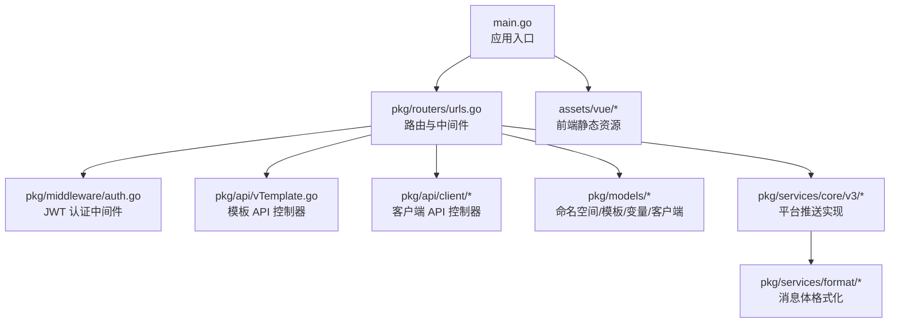
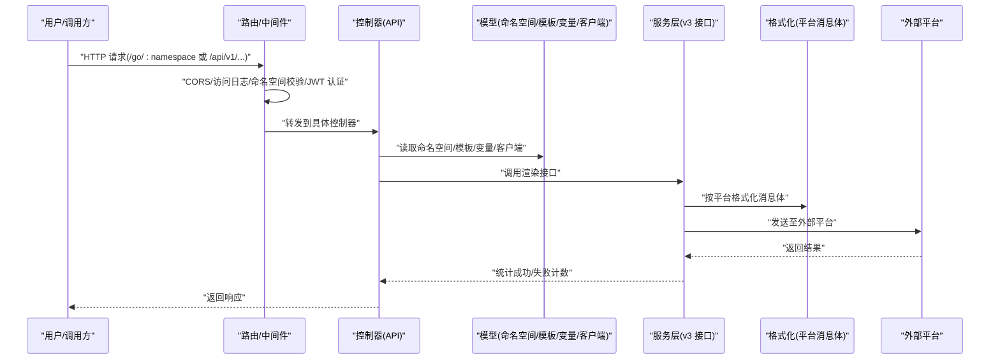
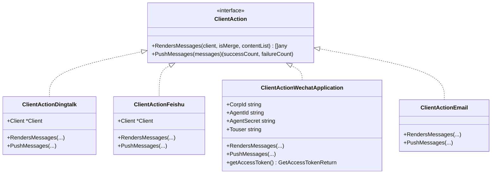
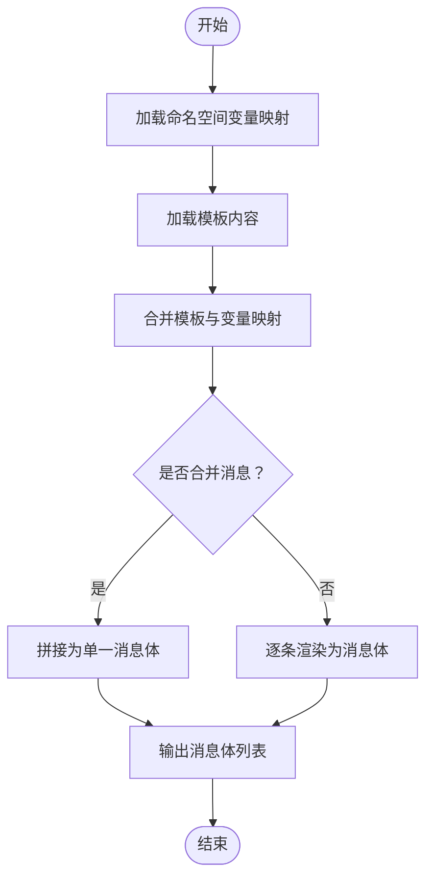
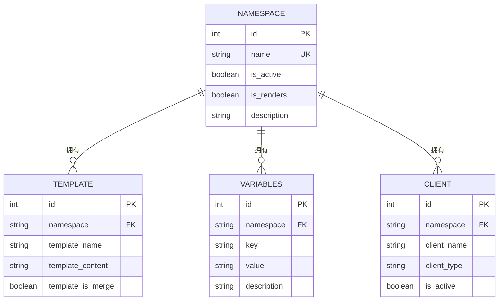
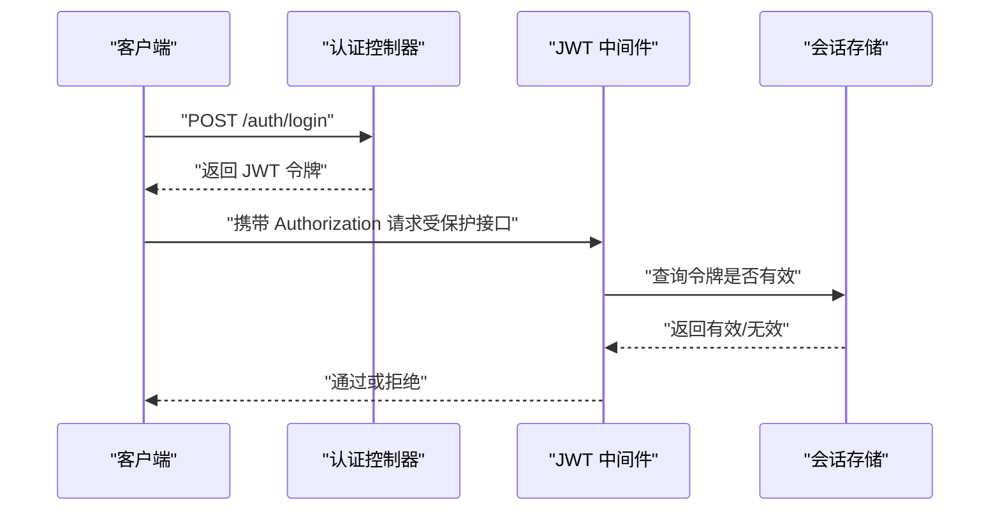
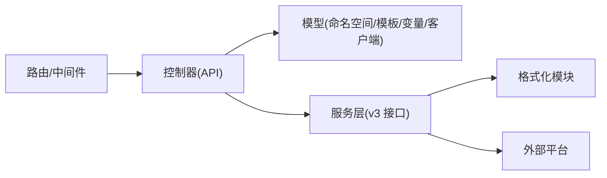

# 核心特性

<cite>
**本文引用的文件**
- [main.go](file://main.go)
- [urls.go](file://pkg/routers/urls.go)
- [auth.go](file://pkg/middleware/auth.go)
- [client.go](file://pkg/models/client.go)
- [template.go](file://pkg/models/template.go)
- [variabels.go](file://pkg/models/variabels.go)
- [namespace.go](file://pkg/models/namespace.go)
- [interfaces.go](file://pkg/services/core/v3/interfaces.go)
- [dingtalk.go](file://pkg/services/core/v3/dingtalk.go)
- [feishu.go](file://pkg/services/core/v3/feishu.go)
- [wechat.go](file://pkg/services/core/v3/wechat.go)
- [email.go](file://pkg/services/core/v3/email.go)
- [dingtalk_format.go](file://pkg/services/format/dingtalk.go)
- [feishu_format.go](file://pkg/services/format/feishu.go)
- [vTemplate.go](file://pkg/api/vTemplate.go)
</cite>

## 目录
1. [简介](#简介)
2. [项目结构](#项目结构)
3. [核心组件](#核心组件)
4. [架构总览](#架构总览)
5. [详细组件分析](#详细组件分析)
6. [依赖分析](#依赖分析)
7. [性能考虑](#性能考虑)
8. [故障排查指南](#故障排查指南)
9. [结论](#结论)
10. [附录](#附录)

## 简介
本文件面向 GoMessage 的使用者与维护者，系统性梳理项目的核心特性与实现机制，包括：
- 多平台消息推送：钉钉机器人、飞书机器人、企业微信机器人、企业微信应用、邮件推送
- 模板管理系统：JSON 模板、变量映射、实时渲染
- 多租户架构：命名空间隔离
- JWT 认证授权
- 完整的管理界面与 API 路由

文档通过“高层概览 + 组件剖析 + 数据流图 + 最佳实践”的方式，帮助读者快速理解并高效使用。

## 项目结构
后端采用 Gin 框架，路由集中于统一入口，中间件贯穿认证、跨域、访问日志；模型层负责命名空间、模板、变量、客户端等持久化；服务层按版本拆分推送核心逻辑与平台适配；格式化模块负责各平台消息体打包；前端静态资源通过 Gin 提供，Swagger 文档集成。

图表来源
- [main.go:1-56](file://main.go#L1-L56)
- [urls.go:1-109](file://pkg/routers/urls.go#L1-L109)
- [auth.go:1-62](file://pkg/middleware/auth.go#L1-L62)
- [vTemplate.go:1-147](file://pkg/api/vTemplate.go#L1-L147)

章节来源
- [main.go:1-56](file://main.go#L1-L56)
- [urls.go:1-109](file://pkg/routers/urls.go#L1-L109)

## 核心组件
- 路由与中间件：统一挂载 CORS、访问日志、命名空间校验与 JWT 认证中间件，暴露公开健康检查与 Swagger 文档，并对受保护资源按命名空间分组。
- 模型层：命名空间、模板、变量、客户端四类实体，均以命名空间为维度进行隔离与查询。
- 服务层：v3 版本定义统一接口，按平台实现渲染与推送；格式化模块提供各平台消息体结构。
- 前端：静态资源托管，提供管理界面与交互。

章节来源
- [urls.go:1-109](file://pkg/routers/urls.go#L1-L109)
- [namespace.go:1-106](file://pkg/models/namespace.go#L1-L106)
- [template.go:1-72](file://pkg/models/template.go#L1-L72)
- [variabels.go:1-89](file://pkg/models/variabels.go#L1-L89)
- [client.go:1-239](file://pkg/models/client.go#L1-L239)
- [interfaces.go:1-11](file://pkg/services/core/v3/interfaces.go#L1-L11)

## 架构总览
下图展示从请求进入、鉴权、命名空间校验、模板与变量解析、平台适配渲染到最终推送的整体流程。

图表来源
- [urls.go:21-109](file://pkg/routers/urls.go#L21-L109)
- [auth.go:12-62](file://pkg/middleware/auth.go#L12-L62)
- [vTemplate.go:13-147](file://pkg/api/vTemplate.go#L13-L147)
- [interfaces.go:7-11](file://pkg/services/core/v3/interfaces.go#L7-L11)
- [dingtalk_format.go:1-30](file://pkg/services/format/dingtalk.go#L1-L30)
- [feishu_format.go:1-61](file://pkg/services/format/feishu.go#L1-L61)

## 详细组件分析

### 多平台消息推送
- 设计要点
  - 统一接口：v3 定义渲染与推送两个阶段，平台差异通过实现类隔离。
  - 渲染阶段：根据是否合并策略，将内容列表拼接或逐条渲染为平台消息体。
  - 推送阶段：平台实现各自推送逻辑，如钉钉/飞书机器人随机 URL 调用，企业微信应用需先获取 access_token 再发送。
- 平台实现
  - 钉钉机器人：支持合并与非合并两种渲染路径，最终以 JSON 形式推送。
  - 飞书机器人：按平台格式化卡片消息体，支持标题颜色模板。
  - 企业微信应用：先拉取 access_token，再向企业微信 API 发送消息。
  - 企业微信机器人：与钉钉类似，支持关键字与随机 URL。
  - 邮件推送：预留接口，当前实现为占位。

图表来源
- [interfaces.go:7-11](file://pkg/services/core/v3/interfaces.go#L7-L11)
- [dingtalk.go:10-41](file://pkg/services/core/v3/dingtalk.go#L10-L41)
- [feishu.go:10-40](file://pkg/services/core/v3/feishu.go#L10-L40)
- [wechat.go:17-121](file://pkg/services/core/v3/wechat.go#L17-L121)
- [email.go:8-18](file://pkg/services/core/v3/email.go#L8-L18)

章节来源
- [dingtalk.go:14-40](file://pkg/services/core/v3/dingtalk.go#L14-L40)
- [feishu.go:14-39](file://pkg/services/core/v3/feishu.go#L14-L39)
- [wechat.go:24-91](file://pkg/services/core/v3/wechat.go#L24-L91)
- [email.go:10-17](file://pkg/services/core/v3/email.go#L10-L17)

### 模板管理系统
- 功能概述
  - 模板 CRUD：按命名空间管理模板，支持列表、新增、查询、更新、删除。
  - 变量映射：命名空间内键值对变量集合，用于模板渲染时的上下文替换。
  - 实时渲染：模板内容与变量映射结合，生成最终消息体。
- 关键流程
  - 新增模板时，先清理同命名空间旧模板，再写入新模板。
  - 渲染阶段，将变量映射注入模板，输出可推送的消息内容列表。

图表来源
- [vTemplate.go:49-64](file://pkg/api/vTemplate.go#L49-L64)
- [variabels.go:65-89](file://pkg/models/variabels.go#L65-L89)
- [template.go:24-53](file://pkg/models/template.go#L24-L53)

章节来源
- [vTemplate.go:13-147](file://pkg/api/vTemplate.go#L13-L147)
- [variabels.go:1-89](file://pkg/models/variabels.go#L1-L89)
- [template.go:1-72](file://pkg/models/template.go#L1-L72)

### 多租户架构（命名空间隔离）
- 设计要点
  - 所有实体（命名空间、模板、变量、客户端）均携带命名空间标识，查询与变更均以命名空间为边界。
  - 路由层强制启用命名空间中间件，确保资源访问的租户隔离。
  - 删除命名空间时，建议联动清理其下模板、变量、客户端，避免脏数据。
- 典型场景
  - 不同业务线/客户共享同一实例，互不干扰。
  - 支持按命名空间导出/导入配置，便于迁移与备份。

图表来源
- [namespace.go:12-26](file://pkg/models/namespace.go#L12-L26)
- [template.go:9-22](file://pkg/models/template.go#L9-L22)
- [variabels.go:9-22](file://pkg/models/variabels.go#L9-L22)
- [client.go:13-38](file://pkg/models/client.go#L13-L38)

章节来源
- [urls.go:58-104](file://pkg/routers/urls.go#L58-L104)
- [namespace.go:1-106](file://pkg/models/namespace.go#L1-L106)

### JWT 认证授权
- 流程说明
  - 登录/注册：生成并存储 JWT 令牌，后续请求通过 Authorization 请求头携带。
  - 中间件：校验令牌签名、有效性与黑名单状态，通过后放行并注入用户信息。
  - 会话管理：令牌若不在有效会话表中，视为未登录或已注销。
- 使用建议
  - 生产环境建议使用 HTTPS 传输，合理设置过期时间与刷新策略。
  - 对敏感接口（命名空间/模板/客户端）务必启用认证中间件。

图表来源
- [auth.go:12-62](file://pkg/middleware/auth.go#L12-L62)

章节来源
- [auth.go:1-62](file://pkg/middleware/auth.go#L1-L62)

### 完整的管理界面与 API
- 路由组织
  - 公共接口：健康检查、首页、Swagger 文档。
  - 数据入口：GET/POST /go/:namespace，支持按命名空间接收消息。
  - 管理接口：/api/v1 下按命名空间分组的模板、变量、客户端管理，以及命名空间级管理。
- 前端资源
  - 静态文件托管与 HTML 页面加载，提供可视化配置与操作界面。

章节来源
- [urls.go:21-109](file://pkg/routers/urls.go#L21-L109)

## 依赖分析
- 组件耦合
  - 路由层仅依赖中间件与控制器，控制器依赖模型与服务层，服务层依赖格式化模块与外部平台。
  - 模型层通过命名空间字段实现天然隔离，降低跨租户耦合风险。
- 外部依赖
  - Gin：Web 框架与路由。
  - Swagger：文档自动生成与展示。
  - 平台 SDK/HTTP 客户端：钉钉/飞书/企业微信 API。
- 循环依赖
  - 未发现直接循环依赖；服务层与格式化模块为单向依赖。

图表来源
- [urls.go:21-109](file://pkg/routers/urls.go#L21-L109)
- [interfaces.go:7-11](file://pkg/services/core/v3/interfaces.go#L7-L11)

章节来源
- [urls.go:1-109](file://pkg/routers/urls.go#L1-L109)
- [interfaces.go:1-11](file://pkg/services/core/v3/interfaces.go#L1-L11)

## 性能考虑
- 消息聚合
  - 合并发送可减少网络往返与平台限流压力，适用于短文本聚合场景。
- 随机 URL 与重试
  - 机器人 URL 列表随机选择，提升可用性；推送失败时可结合重试策略与日志监控。
- 变量映射批处理
  - 批量写入变量映射时建议一次性清空旧值再写入，避免并发竞争。
- 日志与监控
  - 访问日志、推送日志、运行时日志分级记录，便于定位性能瓶颈与异常。

## 故障排查指南
- 认证失败
  - 检查 Authorization 请求头是否正确传递，确认令牌未过期或未被注销。
- 命名空间访问异常
  - 确认请求路径中的命名空间与资源所属一致，避免跨租户误操作。
- 模板渲染错误
  - 核对模板内容与变量映射键名，确保渲染上下文完整。
- 平台推送失败
  - 查看平台返回码与日志，核对机器人关键字、URL、access_token 等配置。
- 前端界面无法加载
  - 确认静态资源路径与路由配置，检查浏览器控制台与网络面板。

章节来源
- [auth.go:12-62](file://pkg/middleware/auth.go#L12-L62)
- [vTemplate.go:66-86](file://pkg/api/vTemplate.go#L66-L86)
- [wechat.go:55-91](file://pkg/services/core/v3/wechat.go#L55-L91)

## 结论
GoMessage 通过清晰的多租户设计、统一的服务接口与平台适配、完善的模板与变量体系，实现了跨平台消息推送的高扩展性与易用性。配合 JWT 认证与管理界面，满足企业级部署与运维需求。建议在生产环境中强化安全配置、日志监控与容错策略，持续优化消息聚合与平台对接的稳定性。

## 附录
- 快速使用步骤
  - 创建命名空间 → 配置变量映射 → 编写模板 → 添加客户端 → 发送测试消息 → 查看推送结果
- 最佳实践
  - 将短文本聚合发送，减少 API 调用次数
  - 为不同业务线/客户划分独立命名空间，避免交叉污染
  - 定期清理过期令牌与不再使用的客户端配置
  - 对外暴露的机器人 URL 建议使用多地址轮询与健康检查