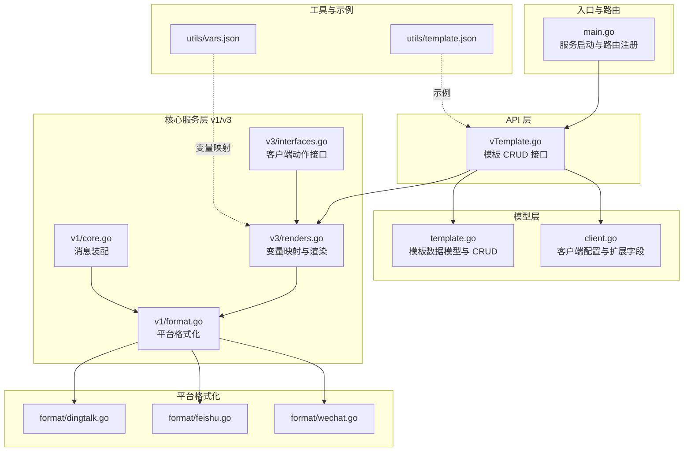
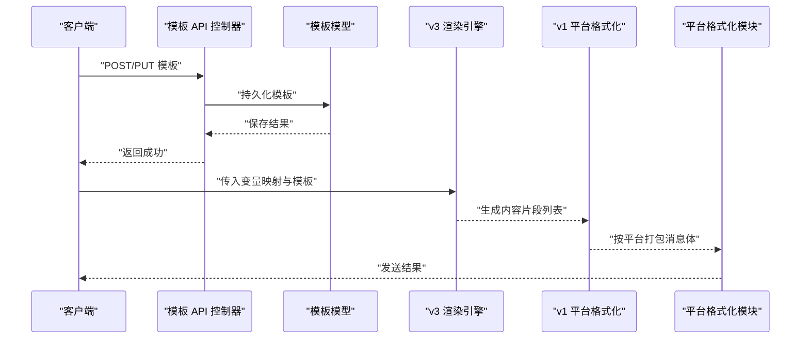
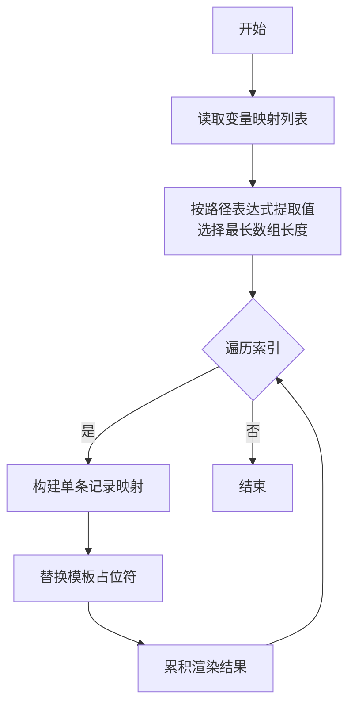
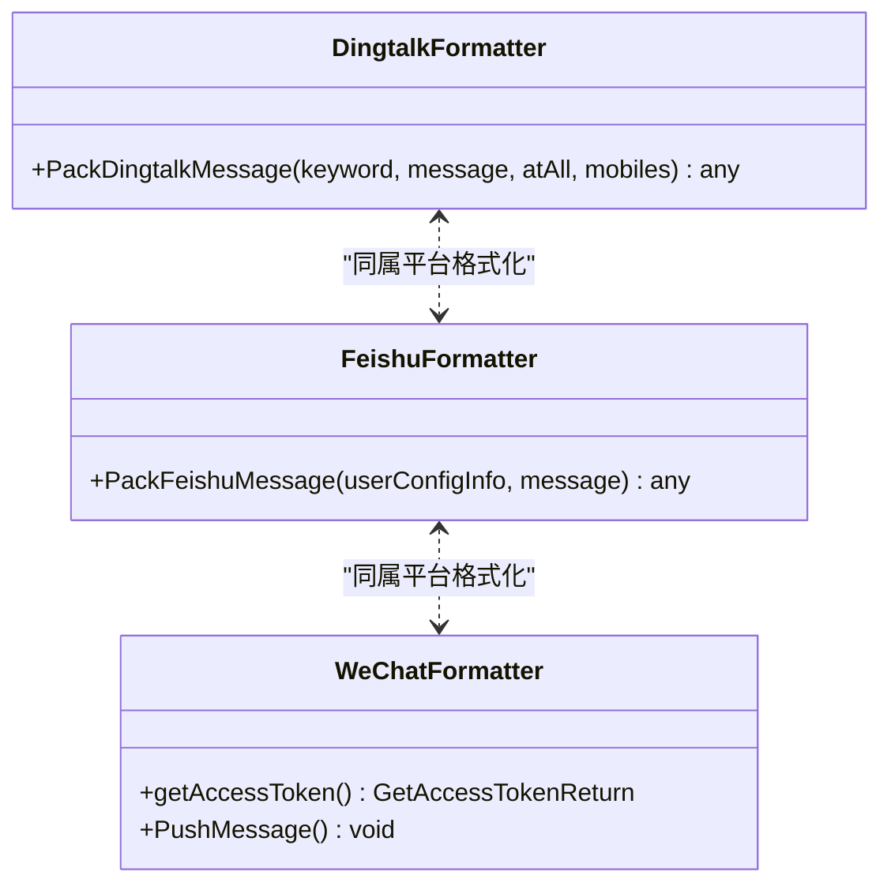
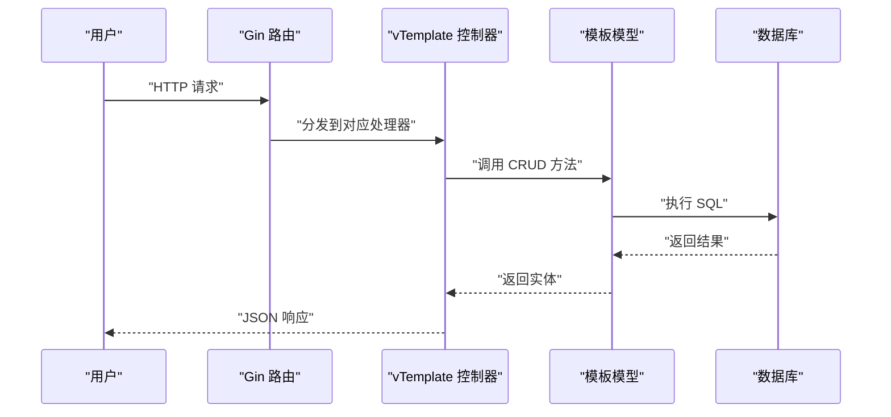
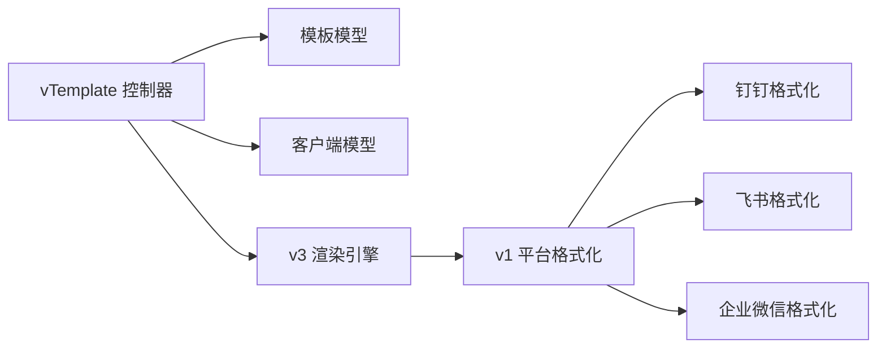

# 模板管理系统

<cite>
**本文引用的文件**
- [main.go](file://main.go)
- [pkg/api/vTemplate.go](file://pkg/api/vTemplate.go)
- [pkg/models/template.go](file://pkg/models/template.go)
- [pkg/services/core/v3/renders.go](file://pkg/services/core/v3/renders.go)
- [pkg/services/core/v3/interfaces.go](file://pkg/services/core/v3/interfaces.go)
- [pkg/services/core/v1/format.go](file://pkg/services/core/v1/format.go)
- [pkg/services/core/v1/core.go](file://pkg/services/core/v1/core.go)
- [pkg/services/format/dingtalk.go](file://pkg/services/format/dingtalk.go)
- [pkg/services/format/feishu.go](file://pkg/services/format/feishu.go)
- [pkg/services/format/wechat.go](file://pkg/services/format/wechat.go)
- [pkg/models/client.go](file://pkg/models/client.go)
- [pkg/utils/template.json](file://pkg/utils/template.json)
- [pkg/utils/vars.json](file://pkg/utils/vars.json)
</cite>

## 目录
1. [简介](#简介)
2. [项目结构](#项目结构)
3. [核心组件](#核心组件)
4. [架构总览](#架构总览)
5. [详细组件分析](#详细组件分析)
6. [依赖分析](#依赖分析)
7. [性能考虑](#性能考虑)
8. [故障排查指南](#故障排查指南)
9. [结论](#结论)
10. [附录](#附录)

## 简介
本文件面向模板管理系统，围绕“JSON 模板定义语法、变量映射机制、实时渲染与格式化、模板验证规则、多平台格式化差异、变量替换算法、模板继承机制、CRUD 接口、批量导入导出与版本策略、调试与性能优化”等方面进行系统化说明。文档以仓库现有实现为依据，结合接口与服务层逻辑，给出可操作的实践建议与可视化图示。

## 项目结构
后端采用 Go 语言与 Gin 框架，模板管理由 API 层、模型层与服务层协同完成；前端 Vue 项目位于 vue/ 目录，提供可视化界面与交互能力。服务层包含 v1、v2、v3 多版本核心流程与平台格式化模块，用于将模板与变量映射生成各平台消息体。

图表来源
- [main.go:37-55](file://main.go#L37-L55)
- [pkg/api/vTemplate.go:17-146](file://pkg/api/vTemplate.go#L17-L146)
- [pkg/models/template.go:24-71](file://pkg/models/template.go#L24-L71)
- [pkg/models/client.go:40-238](file://pkg/models/client.go#L40-L238)
- [pkg/services/core/v1/format.go:10-61](file://pkg/services/core/v1/format.go#L10-L61)
- [pkg/services/core/v1/core.go:34-64](file://pkg/services/core/v1/core.go#L34-L64)
- [pkg/services/core/v3/renders.go:10-58](file://pkg/services/core/v3/renders.go#L10-L58)
- [pkg/services/core/v3/interfaces.go:7-10](file://pkg/services/core/v3/interfaces.go#L7-L10)
- [pkg/services/format/dingtalk.go:3-29](file://pkg/services/format/dingtalk.go#L3-L29)
- [pkg/services/format/feishu.go:8-60](file://pkg/services/format/feishu.go#L8-L60)
- [pkg/services/format/wechat.go:42-114](file://pkg/services/format/wechat.go#L42-L114)
- [pkg/utils/template.json:1-5](file://pkg/utils/template.json#L1-L5)
- [pkg/utils/vars.json:1-29](file://pkg/utils/vars.json#L1-L29)

章节来源
- [main.go:13-35](file://main.go#L13-L35)
- [main.go:37-55](file://main.go#L37-L55)

## 核心组件
- 模板模型与 CRUD
  - 数据模型包含命名空间、模板名、模板内容、是否合并等字段，并提供新增、删除、按命名空间删除、更新、查询列表与按 ID 查询等方法。
- 模板 API 控制器
  - 提供按命名空间列出模板、新增模板（含覆盖旧模板）、按 ID 查询、按 ID 更新、按 ID 删除等接口；控制器内包含命名空间校验与错误处理。
- 变量映射与渲染
  - v3 渲染模块负责从请求数据中提取变量映射，按数组索引生成多条记录，再交由 v1 的模板填充函数完成最终消息体生成。
- 平台格式化
  - v1 格式化模块根据客户端类型（钉钉、飞书等）将渲染结果打包为平台消息体；平台格式化模块分别实现钉钉 Markdown、飞书 Card、企业微信 Markdown 的结构封装。
- 客户端模型
  - 客户端包含通用字段与各平台扩展字段（如飞书标题颜色、关键词、机器人 URL 列表等），并提供按 ID 查询、列表查询、激活状态查询、更新等方法。

章节来源
- [pkg/models/template.go:9-71](file://pkg/models/template.go#L9-L71)
- [pkg/api/vTemplate.go:17-146](file://pkg/api/vTemplate.go#L17-L146)
- [pkg/services/core/v3/renders.go:10-58](file://pkg/services/core/v3/renders.go#L10-L58)
- [pkg/services/core/v1/format.go:10-61](file://pkg/services/core/v1/format.go#L10-L61)
- [pkg/services/format/dingtalk.go:3-29](file://pkg/services/format/dingtalk.go#L3-L29)
- [pkg/services/format/feishu.go:8-60](file://pkg/services/format/feishu.go#L8-L60)
- [pkg/services/format/wechat.go:42-114](file://pkg/services/format/wechat.go#L42-L114)
- [pkg/models/client.go:13-238](file://pkg/models/client.go#L13-L238)

## 架构总览
模板管理的端到端流程如下：客户端通过 API 创建或更新模板；请求到达后，系统基于变量映射与模板语法生成消息内容；随后按目标平台进行格式化封装；最后通过客户端配置的机器人或应用接口发送。

图表来源
- [pkg/api/vTemplate.go:31-64](file://pkg/api/vTemplate.go#L31-L64)
- [pkg/models/template.go:24-53](file://pkg/models/template.go#L24-L53)
- [pkg/services/core/v3/renders.go:10-13](file://pkg/services/core/v3/renders.go#L10-L13)
- [pkg/services/core/v1/format.go:10-35](file://pkg/services/core/v1/format.go#L10-L35)
- [pkg/services/format/dingtalk.go:3-29](file://pkg/services/format/dingtalk.go#L3-L29)
- [pkg/services/format/feishu.go:8-60](file://pkg/services/format/feishu.go#L8-L60)
- [pkg/services/format/wechat.go:71-114](file://pkg/services/format/wechat.go#L71-L114)

## 详细组件分析

### 组件一：模板定义语法与验证规则
- JSON 模板定义
  - 模板内容以字符串形式存储，支持模板语法占位符（如示例中使用的双花括号占位符）。模板内容字段与是否合并字段共同决定渲染与发送行为。
- 变量映射机制
  - 变量映射通过键值对列表定义，键为模板占位符（如 N1、N2…），值为请求数据路径表达式（支持数组通配与层级访问）。渲染时按最长数组长度生成多条记录，逐条替换模板占位符。
- 模板验证规则
  - 控制器层对请求体绑定、命名空间一致性、参数合法性进行校验；模型层提供唯一性约束与索引（如软删除索引）。建议在业务层增加模板语法校验与占位符完整性检查，避免运行期错误。

章节来源
- [pkg/utils/template.json:1-5](file://pkg/utils/template.json#L1-L5)
- [pkg/utils/vars.json:1-29](file://pkg/utils/vars.json#L1-L29)
- [pkg/api/vTemplate.go:37-46](file://pkg/api/vTemplate.go#L37-L46)
- [pkg/models/template.go:9-18](file://pkg/models/template.go#L9-L18)

### 组件二：变量映射与实时渲染算法
- 变量提取与映射
  - 从请求数据中按路径表达式提取值，选择最长数组长度作为迭代次数，逐条替换模板占位符，形成多条渲染结果。
- 渲染流程
  - v3 渲染模块先生成变量映射列表，再交由 v1 的模板填充函数生成最终消息体；支持按平台进行合并或逐条发送。

图表来源
- [pkg/services/core/v3/renders.go:15-58](file://pkg/services/core/v3/renders.go#L15-L58)

章节来源
- [pkg/services/core/v3/renders.go:10-58](file://pkg/services/core/v3/renders.go#L10-L58)

### 组件三：模板在不同消息平台的格式化差异
- 钉钉（Markdown）
  - 使用 Markdown 标题与文本字段，支持 @ 手机号与 @All 选项。
- 飞书（Interactive Card）
  - 使用 Interactive 卡片结构，包含 Header（标题与颜色模板）与多个 Markdown 元素，适合富文本与卡片展示。
- 企业微信（Markdown）
  - 通过企业微信接口发送 Markdown 内容，需先获取 access_token，再调用消息发送接口。

图表来源
- [pkg/services/format/dingtalk.go:3-29](file://pkg/services/format/dingtalk.go#L3-L29)
- [pkg/services/format/feishu.go:8-60](file://pkg/services/format/feishu.go#L8-L60)
- [pkg/services/format/wechat.go:42-114](file://pkg/services/format/wechat.go#L42-L114)

章节来源
- [pkg/services/core/v1/format.go:10-61](file://pkg/services/core/v1/format.go#L10-L61)
- [pkg/services/format/dingtalk.go:3-29](file://pkg/services/format/dingtalk.go#L3-L29)
- [pkg/services/format/feishu.go:8-60](file://pkg/services/format/feishu.go#L8-L60)
- [pkg/services/format/wechat.go:42-114](file://pkg/services/format/wechat.go#L42-L114)

### 组件四：模板 CRUD 接口与命名空间校验
- 接口清单
  - GET /api/v1/:namespace/template：列出命名空间下模板
  - POST /api/v1/:namespace/template：新增模板（旧模板会被覆盖）
  - GET /api/v1/:namespace/template/:id：按 ID 查询
  - PUT /api/v1/:namespace/template/:id：按 ID 更新
  - DELETE /api/v1/:namespace/template/:id：按 ID 删除
- 命名空间校验
  - 查询、更新、删除均校验模板所属命名空间与请求路径一致，防止越权访问。

图表来源
- [pkg/api/vTemplate.go:17-146](file://pkg/api/vTemplate.go#L17-L146)
- [pkg/models/template.go:24-71](file://pkg/models/template.go#L24-L71)

章节来源
- [pkg/api/vTemplate.go:17-146](file://pkg/api/vTemplate.go#L17-L146)
- [pkg/models/template.go:24-71](file://pkg/models/template.go#L24-L71)

### 组件五：模板继承机制与版本管理策略
- 继承机制
  - 当前实现未直接体现“模板继承”。可通过命名空间+模板名组合实现“继承”语义：新模板命名基于旧模板并在内容上叠加变更。
- 版本管理
  - 建议引入版本号字段与“最近一次有效版本”策略：每次更新模板时保留历史版本，提供回滚与审计能力；同时在 API 中支持按版本查询与对比。

章节来源
- [pkg/models/template.go:9-18](file://pkg/models/template.go#L9-L18)
- [pkg/api/vTemplate.go:49-64](file://pkg/api/vTemplate.go#L49-L64)

### 组件六：批量导入导出与调试技巧
- 批量导入导出
  - 建议提供导入导出接口：导入时按命名空间批量写入模板，导出时按命名空间拉取模板集合；支持 JSON/CSV 格式。
- 调试技巧
  - 在渲染阶段输出变量映射与占位符替换过程；在格式化阶段输出最终消息体结构；在平台发送阶段记录响应码与错误信息，便于定位问题。

章节来源
- [pkg/services/core/v3/renders.go:10-58](file://pkg/services/core/v3/renders.go#L10-L58)
- [pkg/services/format/wechat.go:71-114](file://pkg/services/format/wechat.go#L71-L114)

## 依赖分析
- 组件耦合
  - API 控制器依赖模型层；渲染引擎依赖 v1 的模板填充；平台格式化模块依赖客户端配置与扩展字段。
- 外部依赖
  - 钉钉、飞书、企业微信的外部接口调用由格式化模块承担；日志模块贯穿于发送流程，便于追踪。

图表来源
- [pkg/api/vTemplate.go:17-146](file://pkg/api/vTemplate.go#L17-L146)
- [pkg/models/template.go:24-71](file://pkg/models/template.go#L24-L71)
- [pkg/models/client.go:40-238](file://pkg/models/client.go#L40-L238)
- [pkg/services/core/v3/renders.go:10-13](file://pkg/services/core/v3/renders.go#L10-L13)
- [pkg/services/core/v1/format.go:10-61](file://pkg/services/core/v1/format.go#L10-L61)
- [pkg/services/format/dingtalk.go:3-29](file://pkg/services/format/dingtalk.go#L3-L29)
- [pkg/services/format/feishu.go:8-60](file://pkg/services/format/feishu.go#L8-L60)
- [pkg/services/format/wechat.go:42-114](file://pkg/services/format/wechat.go#L42-L114)

章节来源
- [pkg/api/vTemplate.go:17-146](file://pkg/api/vTemplate.go#L17-L146)
- [pkg/models/template.go:24-71](file://pkg/models/template.go#L24-L71)
- [pkg/models/client.go:40-238](file://pkg/models/client.go#L40-L238)
- [pkg/services/core/v3/renders.go:10-13](file://pkg/services/core/v3/renders.go#L10-L13)
- [pkg/services/core/v1/format.go:10-61](file://pkg/services/core/v1/format.go#L10-L61)

## 性能考虑
- 渲染性能
  - 变量映射按最长数组长度迭代，建议在上游限制数组长度或分页处理；对模板语法进行缓存与预编译可降低重复计算成本。
- 发送性能
  - 平台格式化阶段支持合并发送与逐条发送两种模式，按场景选择；对机器人 URL 进行随机轮询可提升稳定性与吞吐。
- 存储与查询
  - 模板与客户端查询按命名空间过滤，建议在命名空间与模板名建立复合索引，减少查询开销。

## 故障排查指南
- 常见错误
  - 参数错误：命名空间不匹配、ID 类型错误、请求体绑定失败。
  - 数据库错误：模板不存在、更新失败、删除影响行数异常。
  - 平台发送错误：access_token 获取失败、消息发送接口返回错误。
- 排查步骤
  - 核对请求路径与命名空间一致性；检查模板内容与占位符是否匹配；确认客户端配置（URL、关键词、权限）正确；查看日志模块输出的错误码与响应体。

章节来源
- [pkg/api/vTemplate.go:70-85](file://pkg/api/vTemplate.go#L70-L85)
- [pkg/api/vTemplate.go:92-118](file://pkg/api/vTemplate.go#L92-L118)
- [pkg/api/vTemplate.go:125-146](file://pkg/api/vTemplate.go#L125-L146)
- [pkg/services/format/wechat.go:42-114](file://pkg/services/format/wechat.go#L42-L114)

## 结论
模板管理系统以清晰的分层架构实现了模板的定义、渲染与多平台发送。通过变量映射与模板语法的结合，系统能够灵活适配不同消息平台的格式差异。建议后续增强模板语法校验、版本管理与批量导入导出能力，并在渲染与发送链路中加入更细粒度的可观测性与性能优化措施。

## 附录
- 模板示例参考
  - 文本模板示例：参见模板内容字段示例。
  - 变量映射示例：参见变量映射列表示例。
- 平台消息体示例
  - 钉钉 Markdown：参见平台格式化模块。
  - 飞书 Interactive Card：参见平台格式化模块。
  - 企业微信 Markdown：参见平台格式化模块。

章节来源
- [pkg/utils/template.json:1-5](file://pkg/utils/template.json#L1-L5)
- [pkg/utils/vars.json:1-29](file://pkg/utils/vars.json#L1-L29)
- [pkg/services/format/dingtalk.go:3-29](file://pkg/services/format/dingtalk.go#L3-L29)
- [pkg/services/format/feishu.go:8-60](file://pkg/services/format/feishu.go#L8-L60)
- [pkg/services/format/wechat.go:71-114](file://pkg/services/format/wechat.go#L71-L114)