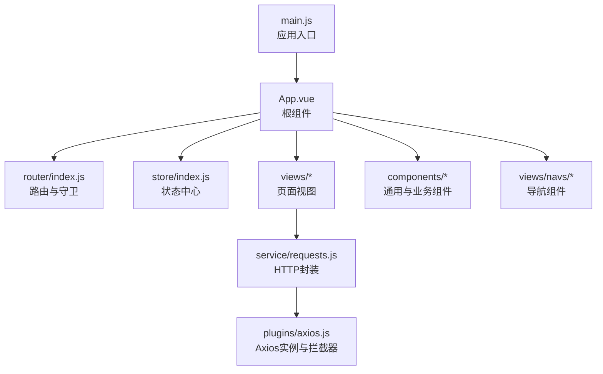
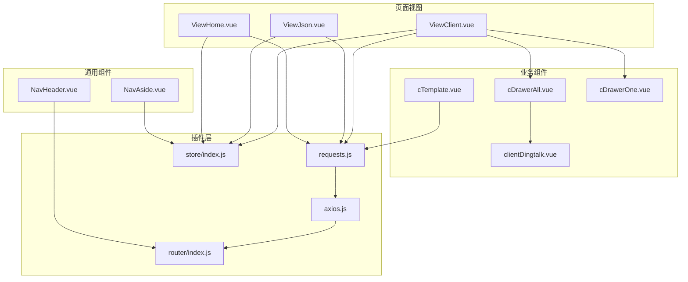
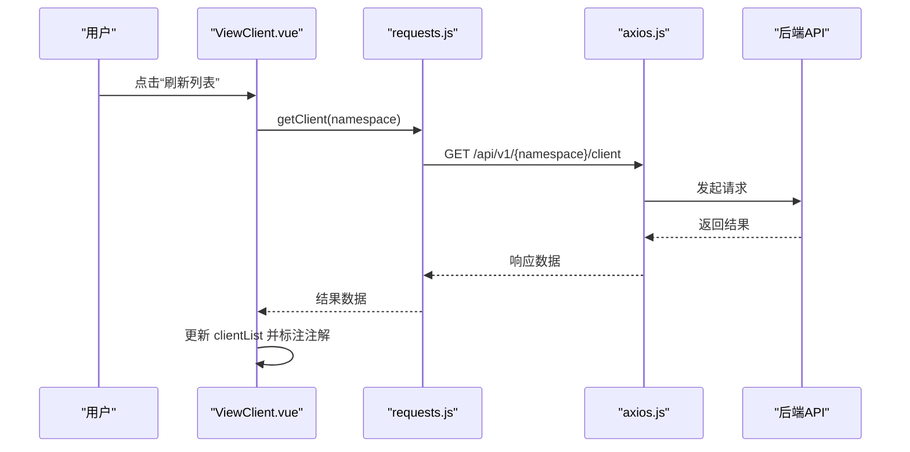
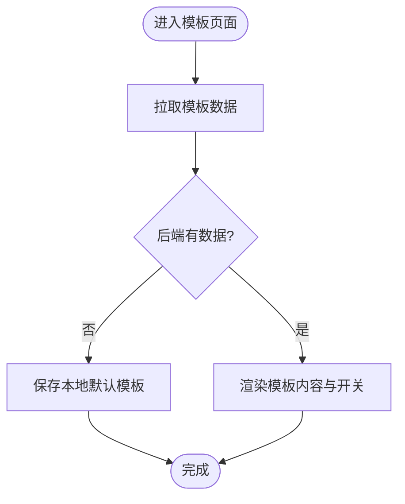
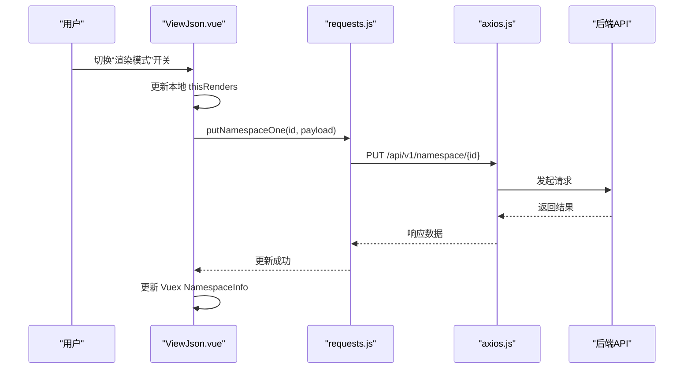
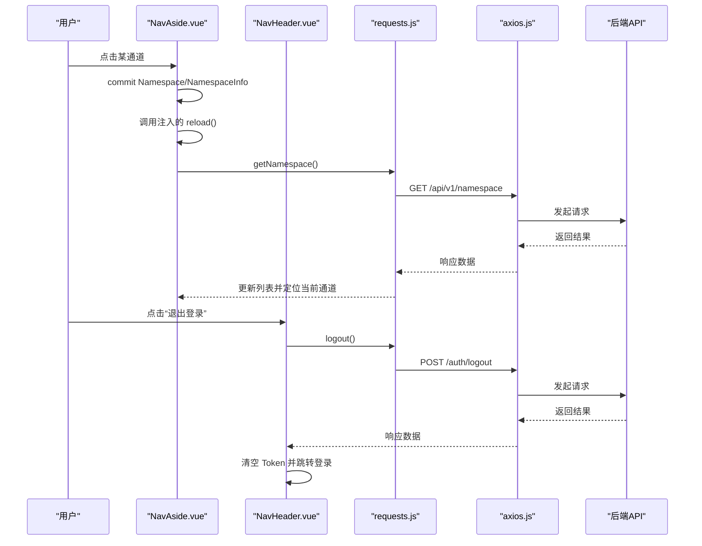
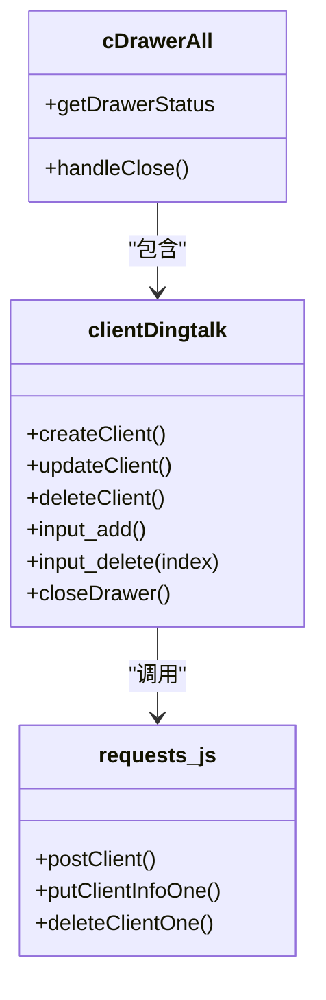
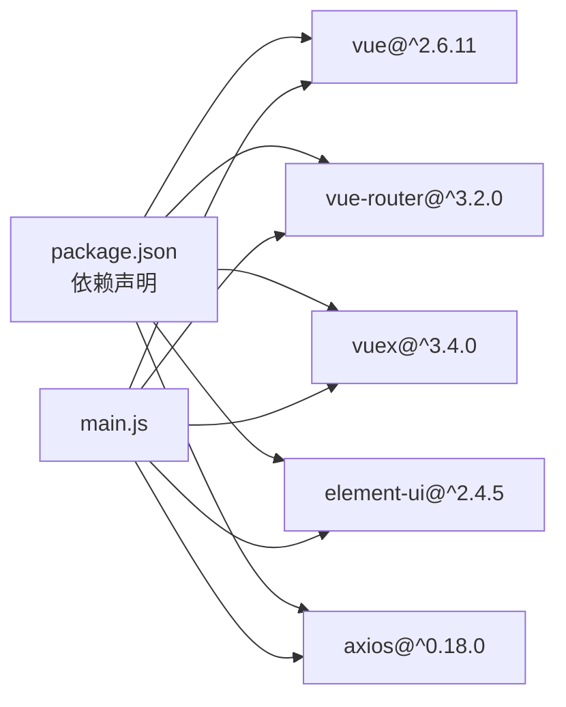

# 管理界面系统

<cite>
**本文引用的文件**
- [main.js](file://vue/src/main.js)
- [App.vue](file://vue/src/App.vue)
- [router/index.js](file://vue/src/router/index.js)
- [store/index.js](file://vue/src/store/index.js)
- [package.json](file://vue/package.json)
- [ViewClient.vue](file://vue/src/views/main/ViewClient.vue)
- [ViewHome.vue](file://vue/src/views/main/ViewHome.vue)
- [ViewJson.vue](file://vue/src/views/main/ViewJson.vue)
- [clientDingtalk.vue](file://vue/src/components/clients/clientDingtalk.vue)
- [cTemplate.vue](file://vue/src/components/cTemplate.vue)
- [requests.js](file://vue/src/service/requests.js)
- [axios.js](file://vue/src/plugins/axios.js)
- [NavHeader.vue](file://vue/src/views/navs/NavHeader.vue)
- [NavAside.vue](file://vue/src/views/navs/NavAside.vue)
- [cDrawerAll.vue](file://vue/src/components/cDrawerAll.vue)
</cite>

## 目录
1. [简介](#简介)
2. [项目结构](#项目结构)
3. [核心组件](#核心组件)
4. [架构总览](#架构总览)
5. [详细组件分析](#详细组件分析)
6. [依赖关系分析](#依赖关系分析)
7. [性能考虑](#性能考虑)
8. [故障排查指南](#故障排查指南)
9. [结论](#结论)
10. [附录](#附录)

## 简介
本管理界面系统基于 Vue.js 2.x + Element UI 构建，提供统一的 Web 管理入口，覆盖以下核心功能域：
- 客户端管理：支持多种即时通讯平台客户端（钉钉、飞书、企业微信机器人/应用号）的增删改查与状态控制。
- 模板管理：提供消息渲染模板的编辑、保存与聚合发送开关。
- 配置管理：命名空间（通道）管理、渲染模式开关、变量映射与数据劫持。
- 用户体验：响应式布局、抽屉式交互、步骤引导、状态持久化与自动刷新。

系统通过 Axios 封装统一发起 HTTP 请求，结合 Vuex 做状态管理，Vue Router 实现页面路由与鉴权拦截，Element UI 提供丰富的 UI 组件与布局容器。

## 项目结构
前端采用按功能模块划分的目录组织方式，关键目录与职责如下：
- vue/src/main.js：应用入口，初始化 Vue 实例、注册插件与挂载根组件。
- vue/src/App.vue：应用根组件，提供全局布局容器、侧边导航、头部导航与底部导航，内置路由视图重载能力与状态持久化。
- vue/src/router/index.js：路由配置与全局前置守卫，实现登录态校验与路由跳转控制。
- vue/src/store/index.js：Vuex 状态中心，集中管理步骤条、抽屉状态、命名空间、令牌与用户 ID。
- vue/src/service/requests.js：HTTP 请求封装，统一暴露各业务接口（模板、客户端、命名空间、用户等）。
- vue/src/plugins/axios.js：Axios 实例与拦截器，统一设置基础 URL、超时、请求头与错误处理。
- vue/src/views/：页面视图，包含首页、渲染配置、客户端列表、定时任务、用户资料等。
- vue/src/components/：通用组件与业务组件，如抽屉、模板编辑器、客户端表单等。
- vue/src/views/navs/：导航组件，包含顶部导航、侧边导航与底部导航。
- vue/public/index.html：HTML 入口模板。

图表来源
- [main.js:1-32](file://vue/src/main.js#L1-L32)
- [App.vue:1-132](file://vue/src/App.vue#L1-L132)
- [router/index.js:1-139](file://vue/src/router/index.js#L1-L139)
- [store/index.js:1-49](file://vue/src/store/index.js#L1-L49)
- [requests.js:1-42](file://vue/src/service/requests.js#L1-L42)
- [axios.js:1-96](file://vue/src/plugins/axios.js#L1-L96)

章节来源
- [main.js:1-32](file://vue/src/main.js#L1-L32)
- [App.vue:1-132](file://vue/src/App.vue#L1-L132)
- [router/index.js:1-139](file://vue/src/router/index.js#L1-L139)
- [store/index.js:1-49](file://vue/src/store/index.js#L1-L49)
- [package.json:1-54](file://vue/package.json#L1-L54)

## 核心组件
- 应用根组件 App.vue
  - 提供全局容器布局（Header/Aside/Main/Footer），根据路由动态控制头部显示。
  - 通过 provide/inject 向子组件注入 reload 方法，实现路由视图强制刷新。
  - 在 created 钩子中从 sessionStorage 恢复 Vuex 状态，并在页面卸载前持久化状态。
- 路由与鉴权 router/index.js
  - 定义首页、渲染配置、客户端管理、定时任务、登录、用户资料等路由。
  - beforeEach 守卫读取 Vuex/SessionStorage 中的 token，未认证时重定向至登录页。
- 状态管理 store/index.js
  - 维护 StepsActive、DrawerStatus、Namespace、Token、UserID、NamespaceInfo 等状态。
  - 提供 getters 与 mutations，便于组件读取与修改状态。
- HTTP 封装 requests.js
  - 统一封装模板、客户端、命名空间、用户等接口，形成清晰的业务层调用。
- Axios 插件 axios.js
  - 设置 baseURL（来自环境变量）、超时、请求头 Authorization。
  - 统一处理 401/403 无权限错误，自动跳转登录页。

章节来源
- [App.vue:38-89](file://vue/src/App.vue#L38-L89)
- [router/index.js:109-136](file://vue/src/router/index.js#L109-L136)
- [store/index.js:6-48](file://vue/src/store/index.js#L6-L48)
- [requests.js:1-42](file://vue/src/service/requests.js#L1-L42)
- [axios.js:13-57](file://vue/src/plugins/axios.js#L13-L57)

## 架构总览
前端采用“页面视图 + 业务组件 + 通用组件 + 插件”的分层架构，数据流自上而下：
- 页面视图负责业务编排与状态展示。
- 业务组件负责具体交互（如抽屉、表单、模板编辑器）。
- 通用组件提供可复用的 UI 与行为（如抽屉、步骤条）。
- 插件层负责网络请求与状态持久化。

图表来源
- [ViewHome.vue:1-47](file://vue/src/views/main/ViewHome.vue#L1-L47)
- [ViewJson.vue:1-140](file://vue/src/views/main/ViewJson.vue#L1-L140)
- [ViewClient.vue:1-266](file://vue/src/views/main/ViewClient.vue#L1-L266)
- [cTemplate.vue:1-141](file://vue/src/components/cTemplate.vue#L1-L141)
- [cDrawerAll.vue:1-64](file://vue/src/components/cDrawerAll.vue#L1-L64)
- [NavHeader.vue:1-195](file://vue/src/views/navs/NavHeader.vue#L1-L195)
- [NavAside.vue:1-265](file://vue/src/views/navs/NavAside.vue#L1-L265)
- [requests.js:1-42](file://vue/src/service/requests.js#L1-L42)
- [axios.js:1-96](file://vue/src/plugins/axios.js#L1-L96)
- [store/index.js:1-49](file://vue/src/store/index.js#L1-L49)
- [router/index.js:1-139](file://vue/src/router/index.js#L1-L139)

## 详细组件分析

### 客户端管理页面（ViewClient.vue）
- 功能特性
  - 展示客户端列表，支持“是否激活”状态的实时切换与自动保存。
  - 支持打开抽屉批量新增多种类型的客户端。
  - 支持查看单个客户端详情、修改与删除。
  - 列表刷新、空数据提示与演示数据保护（避免误删示例数据）。
- 交互设计
  - 使用 Element UI 表格与抽屉组件，提供紧凑且直观的操作区域。
  - “是否激活”采用复选框，失焦即保存，减少额外操作。
  - 抽屉内按客户端类型分页签，统一入口管理多平台配置。
- 数据流向
  - 通过 requests.js 的 getClient/getClientOne/deleteClientOne/putClientOne 等接口与后端交互。
  - Vuex 中的 Namespace 决定当前操作的通道，DrawerStatus 控制抽屉显示。
- 使用方法
  - 新增：点击“添加新客户端”，在抽屉中选择平台类型并填写配置，提交后自动刷新列表。
  - 编辑：点击“详情”，在抽屉中切换到 show 模式，修改后提交。
  - 删除：点击“移除”，对非演示数据进行后端删除，演示数据仅做 UI 删除。

图表来源
- [ViewClient.vue:210-226](file://vue/src/views/main/ViewClient.vue#L210-L226)
- [requests.js:22-27](file://vue/src/service/requests.js#L22-L27)
- [axios.js:61-92](file://vue/src/plugins/axios.js#L61-L92)

章节来源
- [ViewClient.vue:1-266](file://vue/src/views/main/ViewClient.vue#L1-L266)
- [cDrawerAll.vue:1-64](file://vue/src/components/cDrawerAll.vue#L1-L64)
- [clientDingtalk.vue:101-229](file://vue/src/components/clients/clientDingtalk.vue#L101-L229)

### 模板管理组件（cTemplate.vue）
- 功能特性
  - 提供消息渲染模板的编辑区，支持聚合发送开关。
  - 初始化内置模板内容，首次使用时自动保存到后端。
  - 一键保存模板，成功后给出反馈。
- 交互设计
  - 顶部工具栏包含“保存模板”、“聚合发送”开关与“查看文档”链接。
  - 文本域支持多行输入与自动高度调整。
- 数据流向
  - 通过 requests.js 的 getTemplate/postTemplate 与后端交互。
  - 模板内容与聚合开关作为整体提交，后端返回最新状态。

图表来源
- [cTemplate.vue:93-119](file://vue/src/components/cTemplate.vue#L93-L119)
- [requests.js:16-18](file://vue/src/service/requests.js#L16-L18)

章节来源
- [cTemplate.vue:1-141](file://vue/src/components/cTemplate.vue#L1-L141)
- [requests.js:16-18](file://vue/src/service/requests.js#L16-L18)

### 渲染配置页面（ViewJson.vue）
- 功能特性
  - 展示数据格式化、变量映射（手动/自动扁平化）与模板编辑三大区域。
  - 提供命名空间渲染模式开关，开启后将对过境数据进行“渲染为人类可读”的处理。
  - 通过遮罩层提示开启渲染模式的影响。
- 交互设计
  - 使用 el-row/col 布局左右分区，左侧为数据处理，右侧为模板渲染。
  - 渲染开关与遮罩联动，直观提示用户当前模式。
- 数据流向
  - 通过 requests.js 的 getNamespaceOne/putNamespaceOne 获取与更新命名空间渲染状态。
  - Vuex 中的 NamespaceInfo 缓存当前通道信息，供组件读取与更新。

图表来源
- [ViewJson.vue:84-105](file://vue/src/views/main/ViewJson.vue#L84-L105)
- [requests.js:30-35](file://vue/src/service/requests.js#L30-L35)
- [axios.js:77-92](file://vue/src/plugins/axios.js#L77-L92)

章节来源
- [ViewJson.vue:1-140](file://vue/src/views/main/ViewJson.vue#L1-L140)
- [requests.js:30-35](file://vue/src/service/requests.js#L30-L35)

### 命名空间管理（NavAside.vue + NavHeader.vue）
- 功能特性
  - 顶部导航显示当前命名空间，支持跳转到首页、渲染配置、客户端管理等。
  - 侧边导航展示所有命名空间，支持新增、删除与切换。
  - 切换命名空间后通过注入的 reload 强制刷新当前路由视图。
- 交互设计
  - 顶部导航右上角提供“文档”链接与“个人信息/退出登录”下拉菜单。
  - 侧边导航弹窗式对话框管理命名空间列表与新增表单。
- 数据流向
  - 通过 requests.js 的 getNamespace/postNamespace/deleteNamespaceOne 等接口管理命名空间。
  - Vuex 中的 Namespace 与 NamespaceInfo 作为全局状态驱动页面行为。

图表来源
- [NavAside.vue:164-192](file://vue/src/views/navs/NavAside.vue#L164-L192)
- [NavHeader.vue:157-174](file://vue/src/views/navs/NavHeader.vue#L157-L174)
- [requests.js:39-41](file://vue/src/service/requests.js#L39-L41)
- [axios.js:77-92](file://vue/src/plugins/axios.js#L77-L92)

章节来源
- [NavAside.vue:1-265](file://vue/src/views/navs/NavAside.vue#L1-L265)
- [NavHeader.vue:1-195](file://vue/src/views/navs/NavHeader.vue#L1-L195)
- [requests.js:30-41](file://vue/src/service/requests.js#L30-L41)

### 客户端新增抽屉（cDrawerAll.vue + clientDingtalk.vue）
- 功能特性
  - 抽屉内按平台分页签，统一入口管理多平台客户端配置。
  - 钉钉客户端支持多个机器人 URL 列表，动态增删，随机选择 URL 推送以规避频率限制。
  - 提供“创建/修改/删除”完整 CRUD 流程。
- 交互设计
  - 抽屉顶部标签页按平台分类，便于快速切换。
  - 表单包含必填校验与占位提示，提交后自动关闭抽屉并刷新列表。
- 数据流向
  - 通过 requests.js 的 postClient/putClientInfoOne/deleteClientOne 与后端交互。
  - Vuex DrawerStatus 控制抽屉显示，cli_GetClientList 回调刷新列表。

图表来源
- [cDrawerAll.vue:28-60](file://vue/src/components/cDrawerAll.vue#L28-L60)
- [clientDingtalk.vue:101-229](file://vue/src/components/clients/clientDingtalk.vue#L101-L229)
- [requests.js:22-27](file://vue/src/service/requests.js#L22-L27)

章节来源
- [cDrawerAll.vue:1-64](file://vue/src/components/cDrawerAll.vue#L1-L64)
- [clientDingtalk.vue:1-240](file://vue/src/components/clients/clientDingtalk.vue#L1-L240)
- [requests.js:22-27](file://vue/src/service/requests.js#L22-L27)

### 首页与演示推送（ViewHome.vue）
- 功能特性
  - 提供“模拟 AlertManager 推送一条报警信息”按钮，用于快速验证系统链路。
  - 加载本地 JSON 模板并调用后端接口进行演示推送。
- 交互设计
  - 页面居中布局，按钮突出显示，适合首次使用场景。
- 数据流向
  - 通过 requests.js 的 postDemoData 发起演示推送。

章节来源
- [ViewHome.vue:1-47](file://vue/src/views/main/ViewHome.vue#L1-L47)
- [requests.js:4-5](file://vue/src/service/requests.js#L4-L5)

## 依赖关系分析
- 组件耦合
  - App.vue 作为根组件，耦合路由、状态与导航组件，承担全局布局与状态持久化职责。
  - 视图组件通过 requests.js 间接依赖 axios.js，形成清晰的网络层抽象。
  - 抽屉组件与业务表单组件松耦合，通过 props 与回调进行数据传递。
- 外部依赖
  - Element UI：提供布局容器、表格、表单、抽屉、导航、对话框等组件。
  - Vue Router：路由配置与守卫，实现登录态校验与页面跳转。
  - Vuex：集中状态管理，支撑命名空间切换与抽屉状态控制。
  - Axios：统一网络请求与拦截器，处理鉴权与错误。

图表来源
- [package.json:10-33](file://vue/package.json#L10-L33)
- [main.js:1-10](file://vue/src/main.js#L1-L10)

章节来源
- [package.json:1-54](file://vue/package.json#L1-L54)
- [main.js:1-32](file://vue/src/main.js#L1-L32)

## 性能考虑
- 状态持久化：App.vue 在 created 钩子中从 sessionStorage 恢复 Vuex 状态，在 beforeunload 时保存，减少刷新后的重复初始化。
- 路由视图重载：通过 provide/inject 注入 reload 方法，避免深层 props 传递，提升组件通信效率。
- 自动保存：客户端激活状态采用失焦即保存策略，减少不必要的按钮点击与二次交互。
- 按需加载：路由采用异步组件加载，降低首屏体积与加载时间。
- Axios 超时：统一设置较长超时时间，适配后端处理耗时场景。

## 故障排查指南
- 登录态失效
  - 现象：跳转到登录页或出现 401/403。
  - 原因：Axios 请求拦截器检测到空 Token 或后端返回无权限。
  - 处理：确保登录成功后正确写入 Token；检查环境变量 VUE_APP_BASE_URL 是否正确。
- 抽屉无法关闭
  - 现象：抽屉确认关闭后仍显示。
  - 原因：handleClose 中的确认逻辑或 Vuex DrawerStatus 未更新。
  - 处理：检查 handleClose 与 commit(updateDrawerStatus) 调用链。
- 列表不刷新
  - 现象：新增/删除/修改后列表未更新。
  - 原因：未调用 cli_GetClientList 或未正确刷新 clientList。
  - 处理：确认回调函数绑定与调用时机。
- 命名空间切换无效
  - 现象：切换通道后页面未更新。
  - 原因：未调用注入的 reload 或未更新 Namespace/NamespaceInfo。
  - 处理：检查 NavAside.vue 的 updateNamespace 与 reload 调用。

章节来源
- [axios.js:19-57](file://vue/src/plugins/axios.js#L19-L57)
- [cDrawerAll.vue:49-59](file://vue/src/components/cDrawerAll.vue#L49-L59)
- [ViewClient.vue:161-170](file://vue/src/views/main/ViewClient.vue#L161-L170)
- [NavAside.vue:183-192](file://vue/src/views/navs/NavAside.vue#L183-L192)

## 结论
该管理界面系统以 Vue.js + Element UI 为基础，构建了清晰的页面视图、业务组件与通用组件分层架构。通过 Axios 统一网络层与 Vuex 集中状态管理，实现了命名空间切换、客户端管理、模板编辑与渲染配置等核心功能。系统具备良好的可维护性与扩展性，适合在多通道场景下进行持续迭代与功能拓展。

## 附录
- 界面操作指南（概述）
  - 新增客户端：点击“添加新客户端”，在抽屉中选择平台类型并填写配置，提交后自动刷新列表。
  - 编辑客户端：点击“详情”，在抽屉中切换到 show 模式，修改后提交。
  - 删除客户端：点击“移除”，对非演示数据进行后端删除，演示数据仅做 UI 删除。
  - 切换命名空间：在侧边导航选择目标通道，页面自动刷新。
  - 开启渲染模式：在渲染配置页面切换开关，系统将对过境数据进行“渲染为人类可读”的处理。
  - 保存模板：在模板编辑器中点击“保存模板”，系统将模板内容与聚合开关提交到后端。
- 响应式设计与用户体验
  - 使用 Element UI 布局容器与栅格系统，适配不同屏幕尺寸。
  - 提供遮罩层提示、成功/失败消息反馈与自动刷新机制，提升交互体验。
- 与后端 API 的集成
  - 所有接口通过 requests.js 统一暴露，Axios 拦截器统一设置 Authorization 与错误处理。
  - 命名空间、客户端、模板、用户等接口分别对应不同的资源路径与方法。
- 定制化与扩展开发
  - 新增页面：在 router/index.js 中添加路由，并在 views 下创建新视图。
  - 新增组件：在 components 下创建通用或业务组件，通过 props 与回调与父组件通信。
  - 新增客户端类型：在 cDrawerAll.vue 中新增标签页，并在对应客户端组件中完善表单与校验。
  - 状态扩展：在 store/index.js 中新增 state/getters/mutations，并在组件中通过 this.$store.commit/updateXxx 使用。