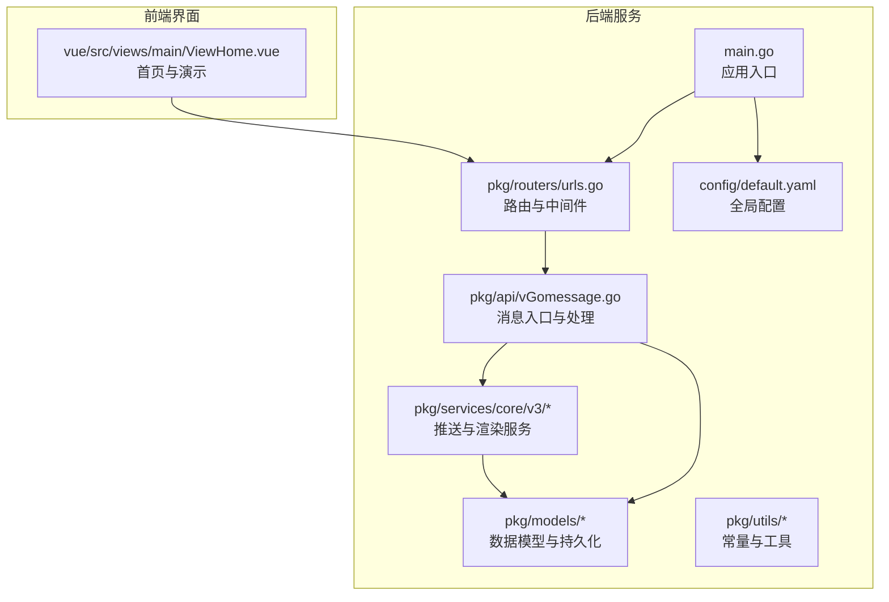
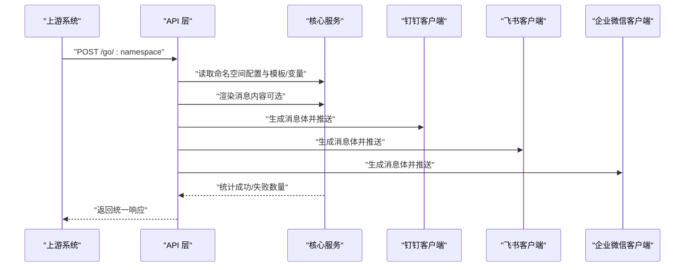
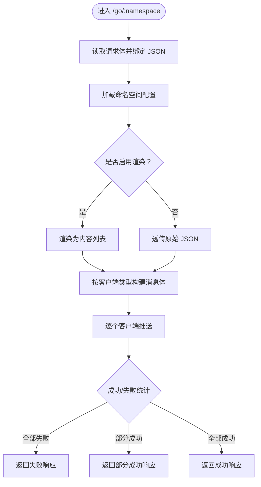
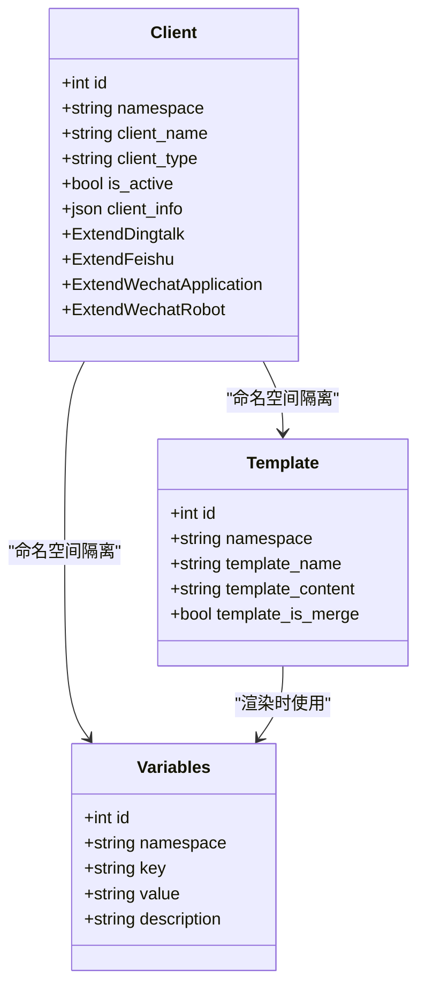
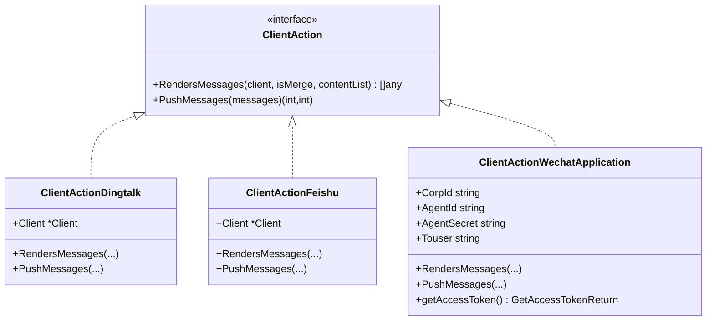
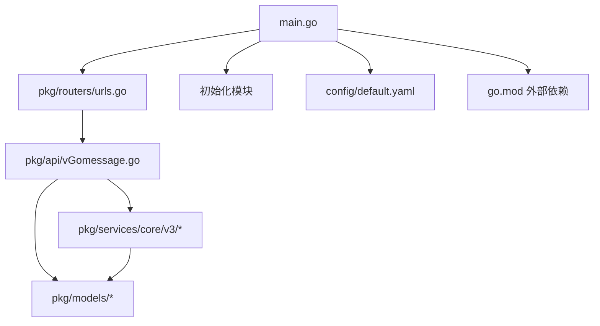

# 项目介绍

<cite>
**本文引用的文件**
- [main.go](file://main.go)
- [go.mod](file://go.mod)
- [config/default.yaml](file://config/default.yaml)
- [pkg/routers/urls.go](file://pkg/routers/urls.go)
- [pkg/api/vGomessage.go](file://pkg/api/vGomessage.go)
- [pkg/models/client.go](file://pkg/models/client.go)
- [pkg/models/template.go](file://pkg/models/template.go)
- [pkg/models/variabels.go](file://pkg/models/variabels.go)
- [pkg/services/core/v3/interfaces.go](file://pkg/services/core/v3/interfaces.go)
- [pkg/services/core/v3/dingtalk.go](file://pkg/services/core/v3/dingtalk.go)
- [pkg/services/core/v3/feishu.go](file://pkg/services/core/v3/feishu.go)
- [pkg/services/core/v3/wechat.go](file://pkg/services/core/v3/wechat.go)
- [pkg/utils/constants.go](file://pkg/utils/constants.go)
- [vue/src/views/main/ViewHome.vue](file://vue/src/views/main/ViewHome.vue)
- [README.md](file://README.md)
</cite>

## 目录
1. [简介](#简介)
2. [项目结构](#项目结构)
3. [核心组件](#核心组件)
4. [架构总览](#架构总览)
5. [详细组件分析](#详细组件分析)
6. [依赖分析](#依赖分析)
7. [性能考虑](#性能考虑)
8. [故障排查指南](#故障排查指南)
9. [结论](#结论)
10. [附录](#附录)

## 简介
GoMessage 是一个面向告警、Webhook 与任意 JSON 事件的企业级消息推送网关系统。它的核心价值在于补齐“机器 → 通知 → 人类”链路中最容易被重复开发、也最容易变得零散脆弱的一环，将原始机器信息整理为适合人类阅读和处理的消息，并统一推送到钉钉、飞书、企业微信、邮件等多平台。

- 统一的消息推送接口：通过命名空间隔离与多通道设计，为不同业务场景提供独立入口与配置。
- 多平台支持：内置对钉钉机器人、飞书机器人、企业微信应用号与机器人等平台的支持。
- 模板化消息处理：支持将任意 JSON 事件渲染为人类可读的消息体，模板语法支持条件与循环等逻辑，便于适配复杂场景。
- 易用性：提供可视化管理界面与 Swagger 文档，降低接入成本。
- 可扩展性：通过接口抽象与插件式客户端，便于扩展新的推送平台。
- 安全性：内置鉴权、跨域、访问日志与运行时日志，支持将日志输出到 Elasticsearch，便于审计与追踪。

## 项目结构
项目采用前后端分离与模块化组织方式：
- 后端服务：基于 Gin 框架，提供 REST API、中间件与日志系统；配置通过 Viper 管理；数据库使用 GORM 支持 SQLite 与 MySQL。
- 前端管理界面：基于 Vue，提供通道管理、客户端配置、模板与变量编辑等功能。
- 文档与示例：包含 Swagger 文档、安装与使用指南以及演示数据。

**图表来源**
- [main.go:1-56](file://main.go#L1-L56)
- [pkg/routers/urls.go:1-109](file://pkg/routers/urls.go#L1-L109)
- [pkg/api/vGomessage.go:1-172](file://pkg/api/vGomessage.go#L1-L172)
- [config/default.yaml:1-83](file://config/default.yaml#L1-L83)

**章节来源**
- [main.go:1-56](file://main.go#L1-L56)
- [go.mod:1-75](file://go.mod#L1-L75)
- [config/default.yaml:1-83](file://config/default.yaml#L1-L83)
- [pkg/routers/urls.go:1-109](file://pkg/routers/urls.go#L1-L109)
- [vue/src/views/main/ViewHome.vue:1-47](file://vue/src/views/main/ViewHome.vue#L1-L47)

## 核心组件
- 应用入口与初始化：负责加载配置、命令行参数、日志、数据库与 Swagger，启动 HTTP 服务。
- 路由与中间件：提供健康检查、静态资源、跨域、访问日志与命名空间校验等。
- API 层：对外暴露消息入口与管理接口，处理请求、调用渲染与推送服务。
- 模型层：定义客户端、模板、变量等数据结构与 CRUD 操作。
- 服务层：实现多平台推送与消息渲染，支持聚合与拆分策略。
- 前端界面：提供通道、客户端、模板与变量的可视化管理。

**章节来源**
- [main.go:13-35](file://main.go#L13-L35)
- [pkg/routers/urls.go:21-109](file://pkg/routers/urls.go#L21-L109)
- [pkg/api/vGomessage.go:20-172](file://pkg/api/vGomessage.go#L20-L172)
- [pkg/models/client.go:13-239](file://pkg/models/client.go#L13-L239)
- [pkg/models/template.go:9-72](file://pkg/models/template.go#L9-L72)
- [pkg/models/variabels.go:9-89](file://pkg/models/variabels.go#L9-L89)
- [pkg/services/core/v3/interfaces.go:7-11](file://pkg/services/core/v3/interfaces.go#L7-L11)

## 架构总览
GoMessage 的整体流程如下：
- 上游系统将结构化 JSON 推送至命名空间入口。
- 服务根据命名空间加载用户配置（模板、变量、激活的客户端）。
- 若开启渲染，将原始 JSON 渲染为人类可读内容；否则透传原始内容。
- 根据客户端类型生成对应消息体，并按聚合/拆分策略推送至各平台。
- 记录推送结果与日志，返回统一响应。

**图表来源**
- [pkg/api/vGomessage.go:20-153](file://pkg/api/vGomessage.go#L20-L153)
- [pkg/services/core/v3/dingtalk.go:14-40](file://pkg/services/core/v3/dingtalk.go#L14-L40)
- [pkg/services/core/v3/feishu.go:14-39](file://pkg/services/core/v3/feishu.go#L14-L39)
- [pkg/services/core/v3/wechat.go:24-91](file://pkg/services/core/v3/wechat.go#L24-L91)

## 详细组件分析

### 应用入口与初始化
- 初始化顺序严格控制：先加载配置，再解析命令行参数覆盖配置，随后初始化日志、Swagger、Gin 模式与数据库。
- 默认监听地址与端口由配置文件决定，启动后打印服务地址日志。

**章节来源**
- [main.go:13-35](file://main.go#L13-L35)
- [main.go:37-55](file://main.go#L37-L55)
- [config/default.yaml:19-21](file://config/default.yaml#L19-L21)

### 路由与中间件
- 提供健康检查、首页、Swagger 文档与静态资源。
- 消息入口支持 GET 与 POST，均受命名空间中间件保护。
- 登录注册与 API v1 管理接口按组划分，统一鉴权与命名空间校验。

**章节来源**
- [pkg/routers/urls.go:21-109](file://pkg/routers/urls.go#L21-L109)

### API 层：消息入口与处理
- POST 入口负责读取请求体、绑定 JSON、写入劫持缓存、获取命名空间配置、渲染消息、生成平台消息体并推送。
- 支持聚合与拆分两种推送策略，聚合时将多条内容合并后发送，拆分时逐条发送。
- 返回统一响应：全部成功、部分成功或全部失败。

**图表来源**
- [pkg/api/vGomessage.go:20-153](file://pkg/api/vGomessage.go#L20-L153)

**章节来源**
- [pkg/api/vGomessage.go:20-172](file://pkg/api/vGomessage.go#L20-L172)

### 模型层：客户端、模板与变量
- 客户端模型支持多种类型（钉钉、飞书、企业微信应用号、企业微信机器人），并维护扩展信息（如机器人 URL、关键词等）。
- 模板模型支持命名空间隔离与合并策略标记。
- 变量模型支持键值映射与批量更新。

**图表来源**
- [pkg/models/client.go:13-239](file://pkg/models/client.go#L13-L239)
- [pkg/models/template.go:9-72](file://pkg/models/template.go#L9-L72)
- [pkg/models/variabels.go:9-89](file://pkg/models/variabels.go#L9-L89)

**章节来源**
- [pkg/models/client.go:13-239](file://pkg/models/client.go#L13-L239)
- [pkg/models/template.go:9-72](file://pkg/models/template.go#L9-L72)
- [pkg/models/variabels.go:9-89](file://pkg/models/variabels.go#L9-L89)

### 服务层：多平台推送与渲染
- 接口抽象：统一的推送接口定义，便于扩展新平台。
- 钉钉：支持聚合/拆分策略，随机轮询机器人 URL。
- 飞书：支持聚合/拆分策略，按平台格式打包消息。
- 企业微信应用号：获取 access_token 后发送 Markdown 消息。
- 企业微信机器人：按平台格式打包消息并推送。

**图表来源**
- [pkg/services/core/v3/interfaces.go:7-11](file://pkg/services/core/v3/interfaces.go#L7-L11)
- [pkg/services/core/v3/dingtalk.go:10-41](file://pkg/services/core/v3/dingtalk.go#L10-L41)
- [pkg/services/core/v3/feishu.go:10-40](file://pkg/services/core/v3/feishu.go#L10-L40)
- [pkg/services/core/v3/wechat.go:17-121](file://pkg/services/core/v3/wechat.go#L17-L121)

**章节来源**
- [pkg/services/core/v3/interfaces.go:7-11](file://pkg/services/core/v3/interfaces.go#L7-L11)
- [pkg/services/core/v3/dingtalk.go:14-40](file://pkg/services/core/v3/dingtalk.go#L14-L40)
- [pkg/services/core/v3/feishu.go:14-39](file://pkg/services/core/v3/feishu.go#L14-L39)
- [pkg/services/core/v3/wechat.go:24-91](file://pkg/services/core/v3/wechat.go#L24-L91)
- [pkg/utils/constants.go:3-8](file://pkg/utils/constants.go#L3-L8)

### 前端界面：通道与演示
- 首页提供“模拟 AlertManager 推送”按钮，一键触发演示数据，便于快速验证通道连通性。
- 界面与后端路由配合，通过命名空间与模板联动，直观展示消息渲染效果。

**章节来源**
- [vue/src/views/main/ViewHome.vue:16-42](file://vue/src/views/main/ViewHome.vue#L16-L42)

## 依赖分析
- 外部依赖：Gin、Viper、Swag、Logrus、JWT、GORM、Elasticsearch 客户端等。
- 内部模块：路由、API、模型、服务、工具与日志模块耦合度低，职责清晰，便于维护与扩展。

**图表来源**
- [main.go:1-56](file://main.go#L1-L56)
- [go.mod:1-75](file://go.mod#L1-L75)
- [pkg/routers/urls.go:1-109](file://pkg/routers/urls.go#L1-L109)
- [pkg/api/vGomessage.go:1-172](file://pkg/api/vGomessage.go#L1-L172)

**章节来源**
- [go.mod:1-75](file://go.mod#L1-L75)

## 性能考虑
- 推送并发：按命名空间并发推送多个客户端，提升吞吐。
- 聚合策略：对同命名空间内的多条内容进行聚合，减少平台推送次数，降低限流风险。
- 随机轮询：对多机器人 URL 进行随机轮询，提高可用性与稳定性。
- 日志与审计：支持本地日志与 ES 输出，便于性能与问题追踪。

## 故障排查指南
- 通道不可用：检查命名空间是否存在、客户端是否激活、模板与变量是否正确配置。
- 推送失败：查看推送日志与平台返回，确认机器人 URL、关键词、access_token 等参数是否正确。
- 渲染异常：核对模板语法与变量映射，确保渲染上下文完整。
- 访问问题：确认跨域与鉴权中间件是否正常，Swagger 文档路径是否可达。

**章节来源**
- [pkg/api/vGomessage.go:66-153](file://pkg/api/vGomessage.go#L66-L153)
- [config/default.yaml:27-44](file://config/default.yaml#L27-L44)

## 结论
GoMessage 通过统一的推送网关、模板化渲染与多平台适配，为企业提供了稳定、可控且易于扩展的消息通知解决方案。它不仅简化了“机器向人类汇报”的过程，还通过命名空间隔离与可视化管理降低了接入与运维成本。对于需要对接多种平台、处理复杂 JSON 事件并保证一致性与可审计性的团队，GoMessage 是一个值得信赖的选择。

## 附录
- 快速开始与安装：参考项目根目录 README 与 wiki 中的安装指南。
- 使用说明：通道创建、客户端配置与模板渲染的详细步骤见 README 与界面提示。
- 示例演示：首页“模拟 AlertManager 推送”按钮可快速验证通道与渲染效果。

**章节来源**
- [README.md:1-197](file://README.md#L1-L197)
- [vue/src/views/main/ViewHome.vue:27-35](file://vue/src/views/main/ViewHome.vue#L27-L35)