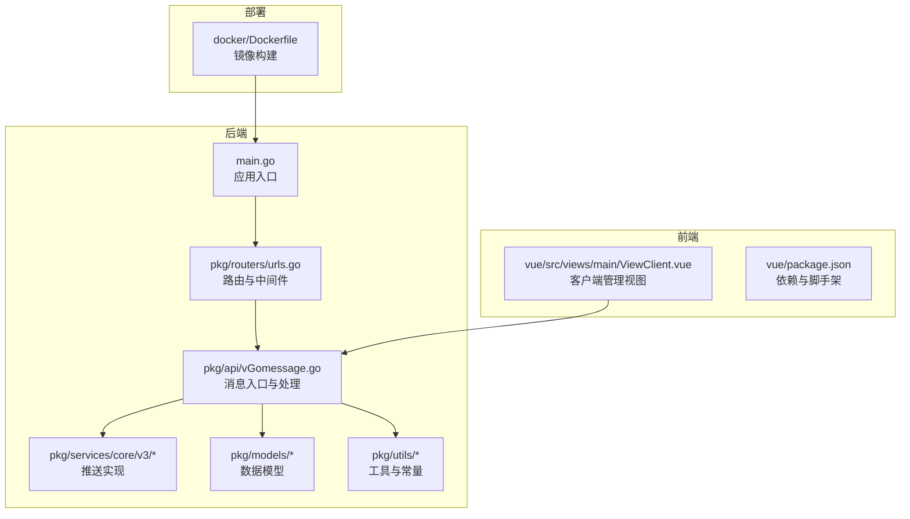
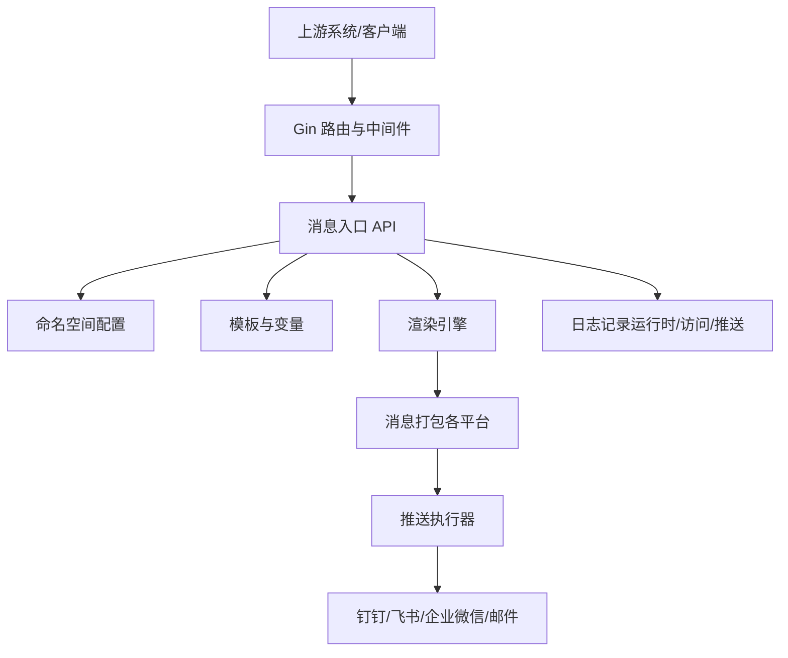
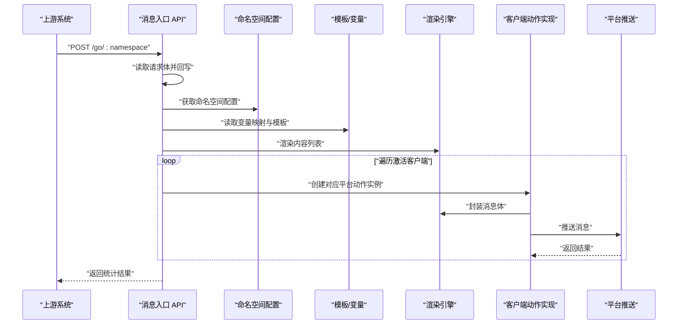
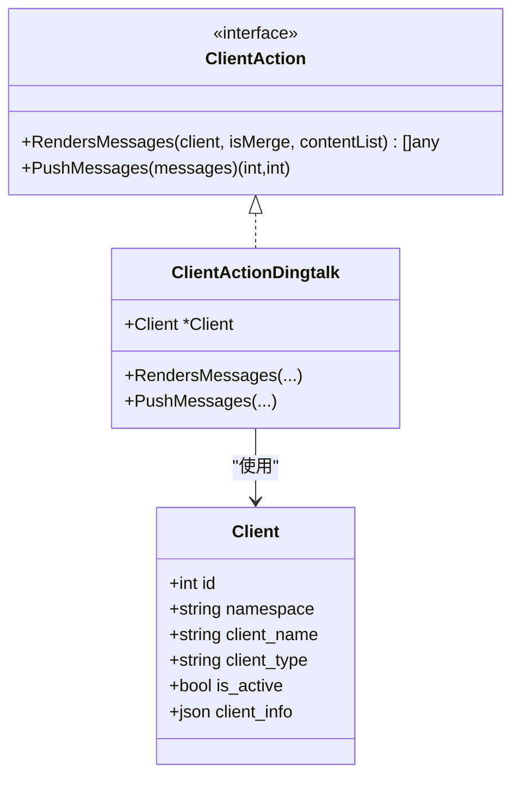
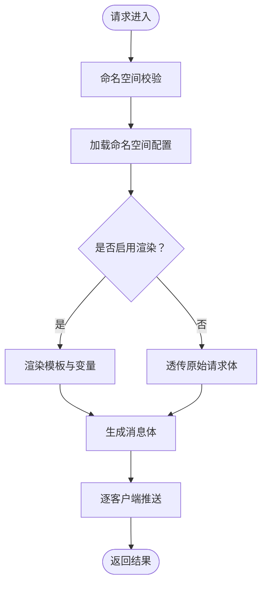
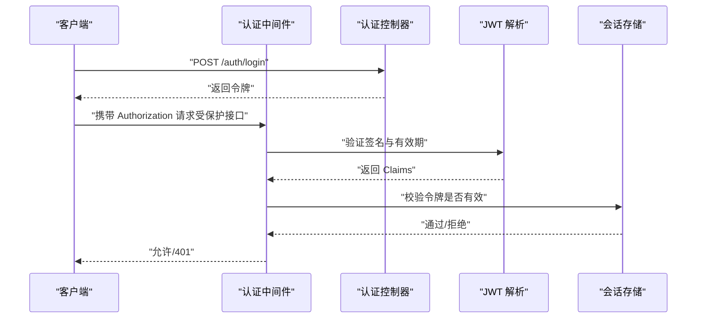
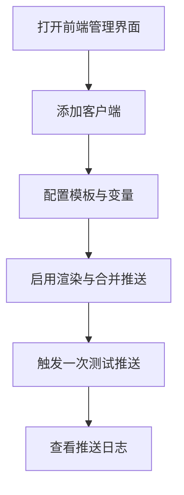
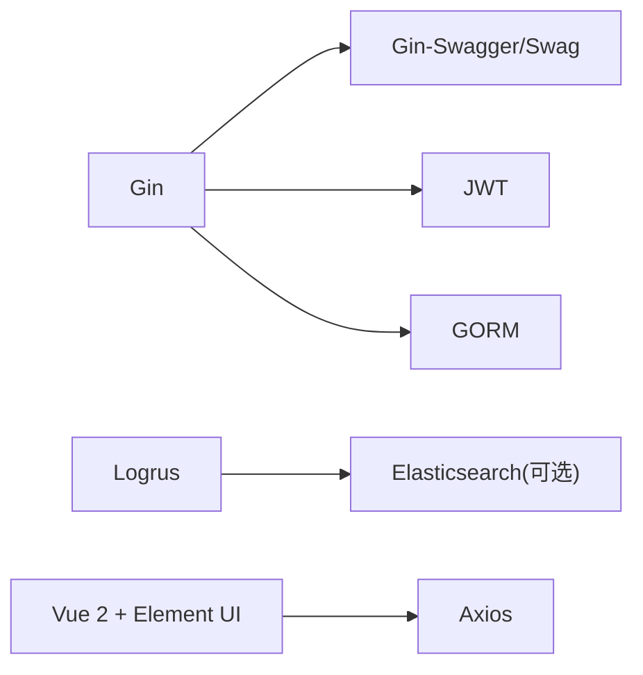

# 项目概述

<cite>
**本文引用的文件**
- [main.go](file://main.go)
- [go.mod](file://go.mod)
- [config/default.yaml](file://config/default.yaml)
- [pkg/routers/urls.go](file://pkg/routers/urls.go)
- [pkg/api/vGomessage.go](file://pkg/api/vGomessage.go)
- [pkg/middleware/auth.go](file://pkg/middleware/auth.go)
- [pkg/models/client.go](file://pkg/models/client.go)
- [pkg/models/namespace.go](file://pkg/models/namespace.go)
- [pkg/services/core/v3/interfaces.go](file://pkg/services/core/v3/interfaces.go)
- [pkg/services/core/v3/dingtalk.go](file://pkg/services/core/v3/dingtalk.go)
- [pkg/services/core/v1/core.go](file://pkg/services/core/v1/core.go)
- [pkg/utils/constants.go](file://pkg/utils/constants.go)
- [docker/Dockerfile](file://docker/Dockerfile)
- [vue/package.json](file://vue/package.json)
- [vue/src/views/main/ViewClient.vue](file://vue/src/views/main/ViewClient.vue)
</cite>

## 目录
1. [简介](#简介)
2. [项目结构](#项目结构)
3. [核心组件](#核心组件)
4. [架构总览](#架构总览)
5. [详细组件分析](#详细组件分析)
6. [依赖分析](#依赖分析)
7. [性能考虑](#性能考虑)
8. [故障排查指南](#故障排查指南)
9. [结论](#结论)
10. [附录](#附录)

## 简介
GoMessage 是一个面向企业的消息推送网关系统，提供统一的多平台消息推送能力，支持钉钉机器人、飞书机器人、企业微信应用与机器人、以及邮件等渠道。通过命名空间（Namespace）实现多租户隔离，结合模板管理与变量映射，将任意 JSON 请求体渲染为各平台可读的消息内容，并以高可用的方式进行推送与记录。

项目采用前后端分离架构：后端使用 Go 语言与 Gin 框架构建 REST API，内置 Swagger 文档、JWT 认证、跨域与访问日志；前端使用 Vue.js 2 + Element UI 提供可视化配置界面，涵盖客户端管理、模板与变量配置、命名空间管理等功能。

## 项目结构
项目采用按职责分层的组织方式：
- 后端入口与初始化：main.go 负责初始化配置、日志、数据库与路由注册。
- 路由与中间件：pkg/routers/urls.go 定义 REST 接口与中间件链路。
- API 层：pkg/api/ 下提供对外接口，如消息入口、模板、变量、命名空间与客户端管理。
- 业务模型：pkg/models/ 定义命名空间、客户端、模板、变量等实体与持久化。
- 服务层：pkg/services/ 实现消息渲染、格式化与推送逻辑，按版本分层（v1/v2/v3）。
- 中间件：pkg/middleware/ 提供 JWT 认证、跨域、访问日志与命名空间校验。
- 工具与常量：pkg/utils/ 包含常量、响应封装与数据库初始化等。
- 前端工程：vue/ 使用 Vue CLI 构建，提供客户端、模板、命名空间等管理界面。
- 部署：docker/ 提供 Dockerfile 与 Helm Chart，便于容器化部署。

图表来源
- [main.go:1-56](file://main.go#L1-L56)
- [pkg/routers/urls.go:1-109](file://pkg/routers/urls.go#L1-L109)
- [pkg/api/vGomessage.go:1-172](file://pkg/api/vGomessage.go#L1-L172)
- [vue/src/views/main/ViewClient.vue:1-200](file://vue/src/views/main/ViewClient.vue#L1-L200)
- [docker/Dockerfile:1-20](file://docker/Dockerfile#L1-L20)

章节来源
- [main.go:1-56](file://main.go#L1-L56)
- [pkg/routers/urls.go:1-109](file://pkg/routers/urls.go#L1-L109)
- [vue/package.json:1-54](file://vue/package.json#L1-L54)

## 核心组件
- 应用入口与初始化：负责加载配置、命令行参数、日志、Swagger、运行模式与数据库初始化，随后启动 HTTP 服务并注册路由。
- 路由与中间件：提供健康检查、静态资源、Swagger 文档、命名空间校验、跨域与访问日志等。
- 消息入口 API：接收来自上游的 JSON 请求，按命名空间配置进行渲染与推送，支持聚合与非聚合两种推送模式。
- 客户端模型：抽象统一的客户端实体，支持多种类型（钉钉、飞书、企业微信应用/机器人），并维护扩展信息。
- 命名空间模型：作为“通道”的概念，用于多租户隔离与配置聚合，包含是否渲染、是否合并等开关。
- 服务层接口：定义统一的推送接口，不同平台通过实现该接口完成消息封装与推送。
- 前端管理界面：提供客户端增删改查、模板与变量配置、命名空间管理等操作。

章节来源
- [main.go:13-35](file://main.go#L13-L35)
- [pkg/routers/urls.go:21-109](file://pkg/routers/urls.go#L21-L109)
- [pkg/api/vGomessage.go:20-153](file://pkg/api/vGomessage.go#L20-L153)
- [pkg/models/client.go:13-239](file://pkg/models/client.go#L13-L239)
- [pkg/models/namespace.go:12-106](file://pkg/models/namespace.go#L12-L106)
- [pkg/services/core/v3/interfaces.go:7-11](file://pkg/services/core/v3/interfaces.go#L7-L11)
- [vue/src/views/main/ViewClient.vue:1-200](file://vue/src/views/main/ViewClient.vue#L1-L200)

## 架构总览
系统采用“网关 + 多平台适配”的架构模式：
- 网关层：Gin 路由与中间件，统一鉴权、跨域、日志与命名空间校验。
- 业务层：消息入口 API 负责解析请求、读取命名空间配置、渲染模板、组装消息体。
- 适配层：v3 版本通过接口抽象，针对不同平台（钉钉、飞书、企业微信、邮件）实现具体推送逻辑。
- 存储层：SQLite/MySQL 存放元数据（命名空间、客户端、模板、变量），推送日志与运行时日志可落盘或写入 Elasticsearch。
- 前端层：Vue.js 提供可视化配置与运维界面。

图表来源
- [pkg/api/vGomessage.go:20-153](file://pkg/api/vGomessage.go#L20-L153)
- [pkg/services/core/v3/interfaces.go:7-11](file://pkg/services/core/v3/interfaces.go#L7-L11)
- [pkg/models/namespace.go:12-106](file://pkg/models/namespace.go#L12-L106)
- [pkg/models/client.go:13-239](file://pkg/models/client.go#L13-L239)

## 详细组件分析

### 组件一：消息入口与推送流程
消息入口 API 接收 POST /go/:namespace 请求，完成以下步骤：
- 读取请求体并回写，以便后续中间件与劫持模块复用。
- 获取命名空间信息与用户配置（变量映射、模板、激活客户端）。
- 根据命名空间是否启用渲染，将原始 JSON 渲染为平台可读的内容列表。
- 针对每个激活客户端，生成对应平台的消息体并执行推送。
- 统计成功/失败数量并返回结果。

图表来源
- [pkg/api/vGomessage.go:20-153](file://pkg/api/vGomessage.go#L20-L153)
- [pkg/services/core/v3/interfaces.go:7-11](file://pkg/services/core/v3/interfaces.go#L7-L11)

章节来源
- [pkg/api/vGomessage.go:20-153](file://pkg/api/vGomessage.go#L20-L153)

### 组件二：客户端模型与多平台适配
客户端模型抽象统一的客户端实体，支持多种类型并通过扩展字段存储平台特定配置。服务层通过接口定义，针对不同平台实现消息封装与推送逻辑，例如钉钉、飞书、企业微信应用与机器人。

图表来源
- [pkg/models/client.go:13-239](file://pkg/models/client.go#L13-L239)
- [pkg/services/core/v3/interfaces.go:7-11](file://pkg/services/core/v3/interfaces.go#L7-L11)
- [pkg/services/core/v3/dingtalk.go:10-41](file://pkg/services/core/v3/dingtalk.go#L10-L41)

章节来源
- [pkg/models/client.go:13-239](file://pkg/models/client.go#L13-L239)
- [pkg/services/core/v3/dingtalk.go:10-41](file://pkg/services/core/v3/dingtalk.go#L10-L41)
- [pkg/utils/constants.go:3-9](file://pkg/utils/constants.go#L3-L9)

### 组件三：命名空间与多租户
命名空间作为“通道”概念，用于多租户隔离与配置聚合。每个命名空间可独立配置是否启用渲染、是否合并消息、以及激活的客户端集合。系统通过命名空间校验中间件确保请求归属正确。

图表来源
- [pkg/routers/urls.go:58-90](file://pkg/routers/urls.go#L58-L90)
- [pkg/models/namespace.go:12-106](file://pkg/models/namespace.go#L12-L106)
- [pkg/api/vGomessage.go:117-142](file://pkg/api/vGomessage.go#L117-L142)

章节来源
- [pkg/models/namespace.go:12-106](file://pkg/models/namespace.go#L12-L106)
- [pkg/routers/urls.go:58-90](file://pkg/routers/urls.go#L58-L90)

### 组件四：JWT 认证与安全
系统通过中间件实现基于 JWT 的认证与会话校验，要求请求头携带有效的 Authorization 令牌，并在会话表中确认令牌有效性。同时提供登录、注册与登出接口。

图表来源
- [pkg/middleware/auth.go:12-62](file://pkg/middleware/auth.go#L12-L62)

章节来源
- [pkg/middleware/auth.go:12-62](file://pkg/middleware/auth.go#L12-L62)

### 组件五：前端管理界面与使用场景
前端提供客户端管理视图，支持添加、查看、编辑与删除客户端，以及批量切换激活状态。典型使用场景包括：
- 新增钉钉/飞书/企业微信机器人客户端，填写机器人关键字与 URL 列表。
- 配置模板与变量映射，将上游 JSON 字段映射为平台可读内容。
- 在命名空间维度开启/关闭渲染与合并推送，观察推送效果。

图表来源
- [vue/src/views/main/ViewClient.vue:1-200](file://vue/src/views/main/ViewClient.vue#L1-L200)

章节来源
- [vue/src/views/main/ViewClient.vue:1-200](file://vue/src/views/main/ViewClient.vue#L1-L200)

## 依赖分析
- 后端依赖：Gin 用于 Web 框架，Viper 用于配置管理，Swaggo/Gin-Swagger 用于文档，JWT 用于认证，GORM 用于数据库访问，Logrus 用于日志。
- 前端依赖：Vue 2、Element UI、Axios 等，通过 Vue CLI 构建与开发。
- 部署依赖：Alpine 基础镜像，暴露 7077 端口，ENTRYPOINT 指向后端可执行文件。

图表来源
- [go.mod:5-21](file://go.mod#L5-L21)
- [vue/package.json:10-33](file://vue/package.json#L10-L33)

章节来源
- [go.mod:1-75](file://go.mod#L1-L75)
- [vue/package.json:1-54](file://vue/package.json#L1-L54)

## 性能考虑
- 渲染与推送分离：通过命名空间开关控制是否启用渲染，避免不必要的模板解析开销。
- 消息聚合：在配置允许的情况下，将多条内容合并为一条消息，减少平台推送次数。
- 随机 URL 轮询：对多个机器人 URL 进行随机轮询，提升可用性与稳定性。
- 日志与监控：支持本地日志与 Elasticsearch 输出，便于问题定位与性能分析。

## 故障排查指南
- 401 未授权：检查 Authorization 请求头是否正确，确认令牌未过期或未被注销。
- 命名空间不存在：确认请求路径中的命名空间名称正确，且已在系统中创建。
- 客户端类型错误：检查客户端类型配置是否在支持列表内。
- 推送失败：查看推送日志与失败原因汇总，确认平台机器人配置与网络连通性。
- 数据库连接：确认 SQLite/MySQL 配置正确，权限充足，必要时启用迁移初始化。

章节来源
- [pkg/middleware/auth.go:12-62](file://pkg/middleware/auth.go#L12-L62)
- [pkg/api/vGomessage.go:155-172](file://pkg/api/vGomessage.go#L155-L172)
- [config/default.yaml:46-75](file://config/default.yaml#L46-L75)

## 结论
GoMessage 以“网关 + 多平台适配”的方式，为企业提供统一、可扩展的消息推送能力。通过命名空间实现多租户隔离，结合模板与变量渲染，满足复杂业务场景的消息展示需求。前后端分离的设计提升了可维护性与可扩展性，配合容器化部署与日志体系，适合在生产环境中稳定运行。

## 附录
- 配置文件位置与关键项：服务监听地址、日志级别与输出、数据库类型与连接、JWT 密钥等。
- 前端构建与运行：使用 Vue CLI 进行开发与打包，依赖 Element UI 与 Axios。
- 部署方式：Dockerfile 提供基础镜像与入口，建议结合 Kubernetes/Helm 进行编排。

章节来源
- [config/default.yaml:1-82](file://config/default.yaml#L1-L82)
- [vue/package.json:1-54](file://vue/package.json#L1-L54)
- [docker/Dockerfile:1-20](file://docker/Dockerfile#L1-L20)